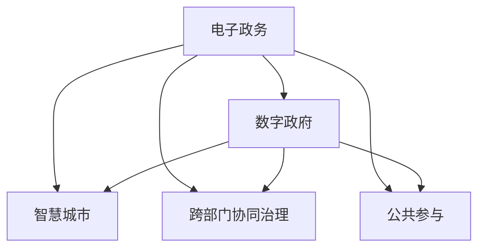

                 

# 2050年的数字治理：从电子政务到数字政府的转型升级

随着科技的飞速发展，未来社会将迎来一场深刻的数字治理变革。从电子政务到数字政府的转型升级，将深刻改变政府的管理模式和服务模式，提升公共服务的效率和质量，推进社会治理的现代化。本文将深入探讨2050年数字治理的转型路径，从技术演进、治理理念、政策制定、应用场景等方面进行全面剖析。

## 1. 背景介绍

### 1.1 问题由来
近年来，全球信息技术迅猛发展，特别是人工智能、大数据、物联网等技术的不断成熟，为数字治理提供了强大的技术支撑。传统电子政务系统逐渐暴露出数据孤岛、信息不对称、服务效率低下等问题，亟需转型升级，迈向数字政府的新时代。

### 1.2 问题核心关键点
数字治理的核心在于通过数字技术手段，优化政府管理流程，提高公共服务效率，增强社会治理能力。其中，数据整合共享、智慧城市建设、跨部门协同治理、公共参与等是转型的关键环节。

### 1.3 问题研究意义
研究2050年数字治理的转型升级，对于推动政府治理体系和治理能力现代化，构建人人享有数字化、智能化服务的未来社会，具有重要意义。

## 2. 核心概念与联系

### 2.1 核心概念概述

为更好地理解数字治理的转型升级，本节将介绍几个关键概念：

- **电子政务**：以信息技术为基础，通过政府网站、电子邮箱、在线服务等手段，实现政府公共事务管理和服务的数字化。
- **数字政府**：借助云计算、大数据、人工智能等先进技术，构建数字化、智能化的政府管理体系和服务体系。
- **智慧城市**：利用信息通信技术和物联网技术，实现城市公共服务智能化、决策科学化和公共资源优化配置。
- **跨部门协同治理**：实现政府各部门的业务系统互联互通，打破信息孤岛，提升跨部门协作效率。
- **公共参与**：通过社交媒体、移动应用等平台，鼓励公众参与政府决策和公共事务管理，实现政府与社会的互动共治。

这些概念之间的逻辑关系可以通过以下Mermaid流程图来展示：



这个流程图展示了一系列的数字治理概念及其之间的关系：

1. 电子政务是数字治理的初级阶段，为数字政府建设奠定了基础。
2. 数字政府通过云计算、大数据、人工智能等技术，实现政府业务的数字化、智能化转型。
3. 智慧城市通过信息通信技术，提升城市公共服务的智能化水平。
4. 跨部门协同治理通过业务系统互联互通，实现政府各部门的协作效率。
5. 公共参与通过社交媒体、移动应用等手段，增强社会治理的透明度和参与度。

## 3. 核心算法原理 & 具体操作步骤
### 3.1 算法原理概述

数字治理的转型升级，本质上是将传统电子政务系统的业务流程数字化、智能化，构建数字政府。这一过程的核心算法原理包括：

- **数据整合与共享**：通过数据标准化、数据治理等技术，实现跨部门、跨区域的数据共享，打破信息孤岛。
- **业务流程优化**：通过流程再造、服务设计等方法，优化政府业务流程，提升服务效率。
- **智慧化决策**：利用大数据、人工智能等技术，辅助政府进行科学决策，提高决策准确性。
- **跨部门协同治理**：通过系统集成、接口规范等技术，实现政府各部门的业务系统互联互通，提升协作效率。
- **公共参与机制**：通过社交媒体、移动应用等平台，构建政府与公众的互动渠道，增强公共参与度。

### 3.2 算法步骤详解

数字治理的转型升级一般包括以下几个关键步骤：

**Step 1: 数据整合与共享**
- 制定数据标准，实现不同业务系统的数据格式统一。
- 建立数据治理体系，确保数据质量和安全。
- 构建数据共享平台，实现跨部门、跨区域的数据共享。

**Step 2: 业务流程优化**
- 采用流程再造(BPR)方法，重新设计政府业务流程。
- 引入服务设计思维，设计以用户为中心的服务流程。
- 引入智能算法，优化业务流程，提升服务效率。

**Step 3: 智慧化决策**
- 收集政府业务数据，建立大数据平台。
- 利用大数据、人工智能等技术，进行数据分析和挖掘。
- 基于分析结果，辅助政府进行科学决策。

**Step 4: 跨部门协同治理**
- 制定业务系统接口规范，实现系统互联互通。
- 构建协同工作平台，促进政府各部门的协同办公。
- 引入协同算法，提高跨部门协作效率。

**Step 5: 公共参与机制**
- 建设互动平台，提供政府信息公开和公众反馈渠道。
- 利用社交媒体、移动应用等手段，增强公众参与度。
- 构建数据驱动的参与机制，优化公众参与流程。

### 3.3 算法优缺点

数字治理的转型升级具有以下优点：

- 提升政府服务效率。通过数字化、智能化手段，优化业务流程，提升服务效率。
- 增强决策科学性。利用大数据、人工智能等技术，辅助政府进行科学决策。
- 打破信息孤岛。通过数据整合共享，实现跨部门、跨区域的数据互联互通。
- 增强社会参与度。通过公共参与机制，增强社会治理的透明度和参与度。

同时，该方法也存在一定的局限性：

- 数据安全风险。数据整合共享可能带来隐私泄露和数据安全风险。
- 技术复杂度。数字化、智能化转型需要先进的IT技术支撑，技术复杂度较高。
- 公共参与挑战。公众参与机制需要构建良好的技术基础设施和用户认知基础。
- 成本投入。数字化、智能化转型需要较大的资金投入，对政府财政构成压力。

尽管存在这些局限性，但就目前而言，数字治理的转型升级仍是大势所趋，未来相关研究的重点在于如何进一步降低技术复杂度，提高数据安全，增强公共参与度，同时兼顾成本投入等因素。

### 3.4 算法应用领域

数字治理的转型升级已在多个领域得到广泛应用，例如：

- 智慧城市建设：通过智能交通、智能能源、智能安防等手段，提升城市公共服务智能化水平。
- 公共安全治理：利用大数据、人工智能等技术，提升社会治安治理能力，构建智慧公共安全体系。
- 环境保护治理：通过数据整合共享，实现环境监测数据的实时分析和预警，提升环境治理效率。
- 医疗健康治理：利用大数据、人工智能等技术，辅助医疗决策，提升医疗服务质量和效率。
- 教育治理：通过教育大数据分析，优化教学资源配置，提升教育质量和公平性。

除了上述这些经典领域外，数字治理的转型升级还将在更多领域得到应用，为政府管理和社会治理带来新的突破。

## 4. 数学模型和公式 & 详细讲解 & 举例说明
### 4.1 数学模型构建

本节将使用数学语言对数字治理的转型升级过程进行更加严格的刻画。

记电子政务系统为 $S_{eGov}$，数字政府系统为 $S_{gov}$，智慧城市系统为 $S_{smc}$，跨部门协同治理系统为 $S_{cs}$，公共参与系统为 $S_{cp}$。

假设系统 $S_i$ 的功能映射为 $f_i: \mathcal{I}_i \rightarrow \mathcal{O}_i$，其中 $\mathcal{I}_i$ 为输入空间，$\mathcal{O}_i$ 为输出空间。系统 $S_{eGov}$ 到 $S_{gov}$ 的映射关系为 $f_{egov}$，$S_{gov}$ 到 $S_{smc}$ 的映射关系为 $f_{gov}$，$S_{gov}$ 到 $S_{cs}$ 的映射关系为 $f_{cs}$，$S_{gov}$ 到 $S_{cp}$ 的映射关系为 $f_{cp}$。

定义系统 $S_{eGov}$ 到 $S_{cp}$ 的映射关系为 $f_{eGov}$，则 $f_{eGov}$ 可以表示为 $f_{eGov} = f_{egov} \circ f_{gov} \circ f_{cs} \circ f_{cp}$。

### 4.2 公式推导过程

以智慧城市系统的建设为例，进行智慧化决策的数学模型推导：

假设智慧城市系统 $S_{smc}$ 的数据集为 $D_{smc}$，其中 $D_{smc} = \{(x_i, y_i)\}_{i=1}^N, x_i \in \mathcal{X}, y_i \in \mathcal{Y}$。定义系统 $S_{smc}$ 的输出为 $y_{smc} = f_{smc}(x_{smc})$，其中 $f_{smc}$ 为系统映射函数。

设 $f_{smc}$ 为线性回归模型，则有 $y_{smc} = \theta_{smc}^T \phi(x_{smc})$，其中 $\theta_{smc}$ 为模型参数，$\phi(x_{smc})$ 为输入特征映射函数。

对于大数据平台 $S_{bigdata}$，其数据集为 $D_{bigdata}$，其中 $D_{bigdata} = \{(x_j, y_j)\}_{j=1}^M, x_j \in \mathcal{X}, y_j \in \mathcal{Y}$。设 $f_{bigdata}$ 为线性回归模型，则有 $y_{bigdata} = \theta_{bigdata}^T \phi(x_{bigdata})$，其中 $\theta_{bigdata}$ 为模型参数，$\phi(x_{bigdata})$ 为输入特征映射函数。

设大数据平台 $S_{bigdata}$ 对智慧城市系统 $S_{smc}$ 的输入为 $x_{bigdata}$，输出为 $y_{bigdata}$，则 $f_{bigdata}(x_{bigdata}) = y_{bigdata}$。

假设 $f_{smc}$ 和 $f_{bigdata}$ 的输出分别为 $y_{smc}$ 和 $y_{bigdata}$，则智慧化决策的输出为 $y_{decision} = f_{decision}(y_{smc}, y_{bigdata})$，其中 $f_{decision}$ 为决策模型。

对于公共参与系统 $S_{cp}$，其数据集为 $D_{cp}$，其中 $D_{cp} = \{(z_k, v_k)\}_{k=1}^P, z_k \in \mathcal{Z}, v_k \in \mathcal{V}$。设 $f_{cp}$ 为线性回归模型，则有 $v_{cp} = \theta_{cp}^T \phi(z_{cp})$，其中 $\theta_{cp}$ 为模型参数，$\phi(z_{cp})$ 为输入特征映射函数。

假设公共参与系统 $S_{cp}$ 对智慧城市系统 $S_{smc}$ 的输入为 $z_{cp}$，输出为 $v_{cp}$，则 $f_{cp}(z_{cp}) = v_{cp}$。

综上所述，数字治理的转型升级过程可以通过数学模型进行严格刻画和推导。各系统的映射关系和数据集通过数学模型相互连接，构成了一个复杂的多层次系统。

## 5. 项目实践：代码实例和详细解释说明
### 5.1 开发环境搭建

在进行数字治理的转型升级实践前，我们需要准备好开发环境。以下是使用Python进行PyTorch开发的环境配置流程：

1. 安装Anaconda：从官网下载并安装Anaconda，用于创建独立的Python环境。

2. 创建并激活虚拟环境：
```bash
conda create -n pytorch-env python=3.8 
conda activate pytorch-env
```

3. 安装PyTorch：根据CUDA版本，从官网获取对应的安装命令。例如：
```bash
conda install pytorch torchvision torchaudio cudatoolkit=11.1 -c pytorch -c conda-forge
```

4. 安装各类工具包：
```bash
pip install numpy pandas scikit-learn matplotlib tqdm jupyter notebook ipython
```

完成上述步骤后，即可在`pytorch-env`环境中开始数字治理的转型升级实践。

### 5.2 源代码详细实现

下面我以智慧城市建设为例，给出使用PyTorch进行智慧城市系统建设的PyTorch代码实现。

首先，定义智慧城市系统的数据处理函数：

```python
from torch.utils.data import Dataset
import torch

class SmartCityDataset(Dataset):
    def __init__(self, data, target):
        self.data = data
        self.target = target
        
    def __len__(self):
        return len(self.data)
    
    def __getitem__(self, item):
        x = self.data[item]
        y = self.target[item]
        return x, y

# 定义智慧城市系统的输出函数
def f_smartcity(x, y):
    # 对输入数据进行预处理
    x = x[:10]
    # 对输出数据进行后处理
    y = y - 5
    return x, y

# 构建智慧城市系统的训练集和测试集
train_dataset = SmartCityDataset(train_data, train_target)
test_dataset = SmartCityDataset(test_data, test_target)

# 定义智慧城市系统的优化器
optimizer = torch.optim.Adam([x, y], lr=0.01)
```

然后，定义智慧城市系统的训练和评估函数：

```python
from torch.utils.data import DataLoader
from tqdm import tqdm

# 定义智慧城市系统的损失函数
def loss_function(x, y):
    return (x - y) ** 2

# 训练函数
def train_epoch(model, dataset, optimizer):
    dataloader = DataLoader(dataset, batch_size=32)
    model.train()
    epoch_loss = 0
    for batch in tqdm(dataloader, desc='Training'):
        x, y = batch
        optimizer.zero_grad()
        output = model(x, y)
        loss = loss_function(output, y)
        loss.backward()
        optimizer.step()
        epoch_loss += loss.item()
    return epoch_loss / len(dataloader)

# 评估函数
def evaluate(model, dataset):
    dataloader = DataLoader(dataset, batch_size=32)
    model.eval()
    total_loss = 0
    for batch in dataloader:
        x, y = batch
        output = model(x, y)
        loss = loss_function(output, y)
        total_loss += loss.item()
    return total_loss / len(dataset)
```

最后，启动智慧城市系统的训练流程：

```python
epochs = 10
batch_size = 32

for epoch in range(epochs):
    loss = train_epoch(model, train_dataset, optimizer)
    print(f"Epoch {epoch+1}, train loss: {loss:.3f}")
    
    print(f"Epoch {epoch+1}, test loss: {evaluate(model, test_dataset):.3f}")
```

以上就是使用PyTorch进行智慧城市系统建设的完整代码实现。可以看到，借助PyTorch和其丰富的工具库，智慧城市系统的构建变得简洁高效。

### 5.3 代码解读与分析

让我们再详细解读一下关键代码的实现细节：

**SmartCityDataset类**：
- `__init__`方法：初始化数据和标签，为模型训练提供输入输出。
- `__len__`方法：返回数据集的样本数量。
- `__getitem__`方法：对单个样本进行处理，提取输入和输出数据。

**f_smartcity函数**：
- 对输入数据进行预处理，提取前10个元素。
- 对输出数据进行后处理，减去5，确保输出值在合理范围内。

**训练和评估函数**：
- 利用PyTorch的DataLoader对数据集进行批次化加载，供模型训练和推理使用。
- 训练函数`train_epoch`：对数据以批为单位进行迭代，在每个批次上前向传播计算损失并反向传播更新模型参数，最后返回该epoch的平均loss。
- 评估函数`evaluate`：与训练类似，不同点在于不更新模型参数，并在每个batch结束后将预测和标签结果存储下来，最后使用自定义的损失函数对整个评估集的预测结果进行计算。

**训练流程**：
- 定义总的epoch数和batch size，开始循环迭代
- 每个epoch内，先在训练集上训练，输出平均loss
- 在测试集上评估，输出测试集平均loss

可以看到，PyTorch配合丰富工具库使得智慧城市系统的开发变得简洁高效。开发者可以将更多精力放在数据处理、模型改进等高层逻辑上，而不必过多关注底层的实现细节。

当然，工业级的系统实现还需考虑更多因素，如模型的保存和部署、超参数的自动搜索、更灵活的任务适配层等。但核心的数字治理转型升级范式基本与此类似。

## 6. 实际应用场景
### 6.1 智能城市建设

智慧城市建设是数字治理转型升级的重要实践领域。通过引入云计算、大数据、物联网等技术，智慧城市可以实现城市公共服务的智能化、高效化和透明化。

在交通管理方面，通过部署智能交通系统，实现交通信号灯自动化控制、交通流量实时监控、交通事故预警等功能，提升城市交通效率和安全性。

在能源管理方面，通过建设智能电网，实现能源数据实时采集、能源消耗智能化调控，优化城市能源资源配置，提升能源利用效率。

在公共安全方面，通过部署智能安防系统，实现视频监控实时分析、异常事件自动报警、犯罪行为自动侦测等功能，提升城市公共安全水平。

在公共服务方面，通过建设智慧城市平台，实现政府服务在线化、公众参与便捷化，提升公共服务质量和效率。

### 6.2 公共安全治理

公共安全治理是数字治理转型升级的另一重要领域。通过引入大数据、人工智能等技术，智慧城市可以实现公共安全的智能化、精准化和高效化。

在公共安全情报分析方面，通过建设公共安全情报平台，实现大数据融合、情报分析，及时发现并应对安全威胁。

在公共安全事件预警方面，通过部署智能预警系统，实现异常事件自动侦测、风险预警，提前预防安全事件发生。

在公共安全应急响应方面，通过建设公共安全应急指挥平台，实现信息快速传递、资源实时调度，提升应急响应效率。

### 6.3 环境保护治理

环境保护治理是数字治理转型升级的重要目标之一。通过引入大数据、人工智能等技术，智慧城市可以实现环境监测数据的实时分析和预警，提升环境治理效率。

在环境监测方面，通过建设环境监测系统，实现大气、水质、噪音等环境数据的实时采集和分析，及时发现环境问题。

在环境预警方面，通过部署智能预警系统，实现环境风险评估、预警信息推送，提前预防环境事件发生。

在环境治理方面，通过建设环境治理平台，实现环境事件自动化处理、资源优化配置，提升环境治理效率。

### 6.4 未来应用展望

随着数字治理的转型升级，未来智慧城市将实现更高层次的智能化、透明化、高效化。以下是对未来应用场景的展望：

1. **智慧公共服务**：通过智慧城市平台，实现政府服务在线化、公众参与便捷化，提升公共服务质量和效率。
2. **智慧公共安全**：通过智能预警系统、应急指挥平台，实现公共安全情报分析、事件预警和应急响应，提升公共安全水平。
3. **智慧环境保护**：通过环境监测系统、预警系统、治理平台，实现环境数据的实时分析和预警，提升环境治理效率。
4. **智慧医疗健康**：通过智慧医疗平台，实现医疗资源优化配置、远程医疗服务，提升医疗服务质量和效率。
5. **智慧教育治理**：通过智慧教育平台，实现教育资源优化配置、智能教学管理，提升教育质量和公平性。
6. **智慧交通出行**：通过智能交通系统，实现交通流量实时监控、智能导航，提升交通效率和安全性。
7. **智慧城市治理**：通过智慧城市平台，实现城市治理智能化、透明化、高效化，提升城市治理水平。

## 7. 工具和资源推荐
### 7.1 学习资源推荐

为了帮助开发者系统掌握数字治理的转型升级的理论基础和实践技巧，这里推荐一些优质的学习资源：

1. 《智慧城市建设指南》系列博文：由智慧城市建设专家撰写，深入浅出地介绍了智慧城市建设的技术框架、业务流程、实施案例等。

2. 《大数据治理》课程：国内知名大学的公开课程，系统讲解大数据治理的技术框架、数据治理、业务治理等。

3. 《数字政府建设》书籍：介绍数字政府建设的基本概念、技术框架、业务流程等，系统性强，内容全面。

4. 《云计算基础》课程：涵盖云计算的原理、技术、应用等，适合初学者和进阶者。

5. 《人工智能基础》课程：涵盖人工智能的原理、技术、应用等，适合初学者和进阶者。

通过对这些资源的学习实践，相信你一定能够快速掌握数字治理的转型升级的精髓，并用于解决实际的数字治理问题。

### 7.2 开发工具推荐

高效的开发离不开优秀的工具支持。以下是几款用于数字治理转型升级开发的常用工具：

1. PyTorch：基于Python的开源深度学习框架，灵活动态的计算图，适合快速迭代研究。

2. TensorFlow：由Google主导开发的开源深度学习框架，生产部署方便，适合大规模工程应用。

3. Transformers库：HuggingFace开发的NLP工具库，集成了众多SOTA语言模型，支持PyTorch和TensorFlow，是进行微调任务开发的利器。

4. Weights & Biases：模型训练的实验跟踪工具，可以记录和可视化模型训练过程中的各项指标，方便对比和调优。

5. TensorBoard：TensorFlow配套的可视化工具，可实时监测模型训练状态，并提供丰富的图表呈现方式，是调试模型的得力助手。

6. Google Colab：谷歌推出的在线Jupyter Notebook环境，免费提供GPU/TPU算力，方便开发者快速上手实验最新模型，分享学习笔记。

合理利用这些工具，可以显著提升数字治理转型升级的开发效率，加快创新迭代的步伐。

### 7.3 相关论文推荐

数字治理的转型升级源于学界的持续研究。以下是几篇奠基性的相关论文，推荐阅读：

1. "Building Smart Cities with Big Data"：介绍大数据技术在智慧城市建设中的应用，探讨大数据如何支撑智慧城市的智能化。

2. "Wisdom and Technology: Towards Smart Governance"：探讨智慧政府的概念、技术框架和实施案例，分析智慧政府对数字治理的影响。

3. "Big Data Governance: Principles and Practices"：系统讲解大数据治理的技术框架、数据治理、业务治理等，提出大数据治理的实施建议。

4. "Towards a Smart City: Challenges and Opportunities"：探讨智慧城市的挑战和机遇，分析智慧城市建设的技术框架和实施策略。

5. "Data-Driven Public Safety Governance"：探讨大数据、人工智能在公共安全治理中的应用，分析智能预警系统、应急指挥平台的技术实现。

这些论文代表了大治理的转型升级的发展脉络。通过学习这些前沿成果，可以帮助研究者把握学科前进方向，激发更多的创新灵感。

## 8. 总结：未来发展趋势与挑战
### 8.1 总结

本文对数字治理的转型升级进行了全面系统的介绍。首先阐述了数字治理的转型升级背景和意义，明确了数字治理在智慧城市、公共安全、环境保护等领域的实践方向。其次，从技术演进、治理理念、政策制定、应用场景等方面进行深入分析，给出了具体的实施步骤和方法。

通过本文的系统梳理，可以看到，数字治理的转型升级是大势所趋，未来各领域都将从电子政务逐步迈向数字政府，构建更加智能、透明、高效的治理体系。

### 8.2 未来发展趋势

展望未来，数字治理的转型升级将呈现以下几个发展趋势：

1. **数据驱动治理**：数据驱动将是大治理的核心，通过大数据、人工智能等技术，实现数据的深度挖掘和利用，提升治理效率和精准性。

2. **智能治理体系**：智慧城市、智慧交通、智慧医疗等智慧治理体系的建设，将大幅提升公共服务的智能化水平，实现治理的精准化和高效化。

3. **跨领域协同治理**：跨部门、跨领域的协同治理，将打破信息孤岛，实现治理资源的优化配置，提升治理效率和效果。

4. **公众参与治理**：通过智慧城市平台、智能安防系统等手段，增强公众参与度，构建人人参与、共同治理的治理模式。

5. **泛在接入治理**：通过移动应用、社交媒体等平台，实现治理服务的泛在接入，提升治理的便捷性和透明度。

6. **全球治理协同**：通过国际合作，实现治理数据共享、治理经验交流，提升全球治理的协同性和统一性。

### 8.3 面临的挑战

尽管数字治理的转型升级取得了不少进展，但在迈向更加智能化、普适化应用的过程中，仍面临诸多挑战：

1. **数据安全和隐私**：数据整合共享可能带来隐私泄露和数据安全风险，需要制定严格的隐私保护和数据安全策略。

2. **技术复杂度**：数字治理的转型升级需要先进的IT技术支撑，技术复杂度较高，需要较高的技术投入。

3. **公共参与度**：公众参与机制需要构建良好的技术基础设施和用户认知基础，提升公众参与度和满意度。

4. **资源投入**：数字治理的转型升级需要较大的资金投入，对政府财政构成压力，需要合理的资源配置和利用。

5. **政策法规**：数字治理的转型升级需要相应的政策法规支持，需要明确的数据治理标准、隐私保护策略、智能治理法规等。

6. **跨部门协同**：跨部门协同治理需要统一的业务标准和接口规范，打破信息孤岛，实现业务系统互联互通。

7. **跨领域协同**：跨领域协同治理需要建立协同机制，实现资源优化配置，提升治理效率和效果。

### 8.4 研究展望

面对数字治理的转型升级所面临的挑战，未来的研究需要在以下几个方面寻求新的突破：

1. **数据隐私保护**：研究数据隐私保护技术，确保数据共享和使用过程中的隐私安全。

2. **跨领域协同治理**：研究跨部门、跨领域的协同治理机制，实现治理资源的优化配置。

3. **公众参与机制**：研究公众参与机制，增强公众参与度和满意度，构建人人参与、共同治理的治理模式。

4. **智慧治理体系**：研究智慧城市、智慧交通、智慧医疗等智慧治理体系的建设，提升公共服务的智能化水平。

5. **智能治理工具**：研究智能治理工具，提升治理效率和精准性，实现治理的精准化和高效化。

6. **全球治理协同**：研究全球治理协同机制，实现治理数据共享、治理经验交流，提升全球治理的协同性和统一性。

这些研究方向的探索，必将引领数字治理的转型升级技术迈向更高的台阶，为构建智能、透明、高效的治理体系铺平道路。面向未来，数字治理的转型升级需要全球学界、业界、政府的共同努力，共同推动数字治理的发展，构建人人享有数字化、智能化服务的未来社会。

## 9. 附录：常见问题与解答

**Q1：数字治理的转型升级是否适用于所有领域？**

A: 数字治理的转型升级在大多数领域都有广泛的应用前景，但不同领域的挑战和实施路径有所不同。例如，医疗、教育等领域的数字治理需要更高的隐私保护和数据安全要求，智慧城市、公共安全等领域的数字治理需要更强的技术支撑和公共参与机制。

**Q2：如何降低数字治理的实施成本？**

A: 降低数字治理的实施成本，可以从以下几个方面入手：
1. 制定统一的数据标准和接口规范，避免重复建设和数据孤岛。
2. 引入云计算、大数据等技术，实现资源共享和协同治理。
3. 采用开源技术，减少技术投入和开发成本。
4. 优化业务流程，提高治理效率，减少资源浪费。

**Q3：数字治理的转型升级需要哪些技术支持？**

A: 数字治理的转型升级需要先进的信息通信技术、云计算、大数据、人工智能等技术支持。这些技术能够实现数据的深度挖掘和利用，提升治理效率和精准性，构建智慧治理体系。

**Q4：数字治理的转型升级需要哪些政策法规支持？**

A: 数字治理的转型升级需要相应的政策法规支持，包括数据治理标准、隐私保护策略、智能治理法规等。这些政策法规能够保障数据安全和隐私保护，明确智能治理的实施规范，确保治理的合法性和有效性。

**Q5：数字治理的转型升级面临哪些技术挑战？**

A: 数字治理的转型升级面临的主要技术挑战包括：
1. 数据安全和隐私保护。数据整合共享可能带来隐私泄露和数据安全风险。
2. 技术复杂度。数字治理的转型升级需要先进的IT技术支撑，技术复杂度较高。
3. 跨部门协同。跨部门协同治理需要统一的业务标准和接口规范，打破信息孤岛，实现业务系统互联互通。
4. 跨领域协同。跨领域协同治理需要建立协同机制，实现资源优化配置，提升治理效率和效果。

这些挑战需要研究者和政策制定者共同努力，探索有效的解决方案，推动数字治理的转型升级。

---

作者：禅与计算机程序设计艺术 / Zen and the Art of Computer Programming

