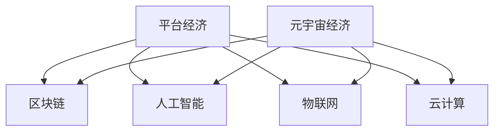

                 

# 2050年的数字经济：从平台经济到元宇宙经济的数字经济形态演进

## 1. 背景介绍

随着数字技术的发展，数字经济已经成为现代经济的重要组成部分。2050年的数字经济将会呈现出与当前截然不同的面貌，将从以平台经济为主的数字经济形态，向以元宇宙经济为主的数字经济形态演进。这种演进不仅将带来全新的经济结构，也将深刻改变我们的工作、生活和社交方式。

### 1.1 数字经济的发展历程

20世纪末，互联网的兴起标志着数字经济的萌芽。互联网改变了信息的传播方式，使得企业可以通过线上渠道进行推广和销售，个人可以通过线上服务获取便利。这一时期，平台经济开始兴起，以eBay、Amazon为代表的平台公司成为数字经济的先驱。

21世纪初，随着社交媒体、移动互联网、大数据等技术的不断发展，数字经济进入加速发展阶段。平台经济模式逐渐成熟，各大平台公司在电子商务、内容分发、社交媒体等领域占据了重要地位。同时，云计算、物联网等技术的应用，使得数字经济开始从线上向线下扩展。

### 1.2 平台经济的特征与问题

平台经济以互联网为基础，通过连接供需双方，形成高效的资源配置机制。平台经济的模式包括B2B、B2C、C2C等多种形式，如淘宝、京东、Uber等。平台经济通过规模化运营、数据驱动决策等手段，极大提高了经济效率。然而，平台经济也存在诸多问题，如数据隐私泄露、算法歧视、市场垄断等。

## 2. 核心概念与联系

### 2.1 核心概念概述

为更好地理解2050年的数字经济演进，本节将介绍几个关键概念：

- **平台经济(Platform Economy)**：基于互联网技术，以平台为中心，连接供需双方的经济形态。平台经济通过高效匹配资源，实现了经济的快速增长。

- **元宇宙经济(Metaverse Economy)**：利用虚拟现实、增强现实等技术，构建一个虚拟的经济体系。元宇宙经济不仅包括虚拟物品的交易，还包括虚拟劳动、虚拟货币等。

- **区块链(Blockchain)**：一种分布式账本技术，通过去中心化的方式记录交易信息，保障数据的安全和透明。

- **人工智能(AI)**：利用机器学习、深度学习等技术，实现智能决策和自动化操作。

- **物联网(IoT)**：通过传感器、智能设备等技术，实现人机物的全面连接和智能交互。

- **云计算(Cloud Computing)**：通过互联网提供计算资源，实现资源的按需分配和弹性扩展。

这些核心概念之间有着密切的联系，共同构成了2050年数字经济的框架。

### 2.2 核心概念原理和架构的 Mermaid 流程图



这个流程图展示了各个概念之间的联系。平台经济通过区块链、人工智能、物联网、云计算等技术，提升了资源的匹配和利用效率。而元宇宙经济则在这些技术的基础上，构建了一个更加虚拟和互动的经济体系。

## 3. 核心算法原理 & 具体操作步骤

### 3.1 算法原理概述

2050年的数字经济将基于区块链、人工智能、物联网、云计算等技术，构建起一个全新的经济形态。其中，平台经济和元宇宙经济是两个重要的组成部分。下面分别介绍这两种经济形态的算法原理。

### 3.2 算法步骤详解

#### 3.2.1 平台经济的算法步骤

1. **用户注册与认证**：用户需要通过身份认证，才能使用平台服务。平台通过区块链技术，确保用户身份的真实性和不可篡改性。

2. **供需匹配**：平台通过算法匹配供需双方，实现资源的有效配置。匹配算法包括机器学习、深度学习、强化学习等。

3. **交易执行与结算**：平台执行交易，并通过区块链记录交易信息。区块链的去中心化特性，保障了交易的透明和安全。

4. **数据分析与优化**：平台通过人工智能和机器学习技术，分析交易数据，优化资源配置和用户体验。

#### 3.2.2 元宇宙经济的算法步骤

1. **虚拟资产的创建与交易**：用户可以通过区块链创建和管理虚拟资产，如虚拟土地、虚拟货币等。元宇宙中的资产交易，通过智能合约自动执行。

2. **虚拟劳动的参与与收益**：用户可以在元宇宙中进行虚拟劳动，如创作、设计等，并通过虚拟货币获得收益。

3. **虚拟市场的建立与运营**：元宇宙中建立了虚拟市场，用户可以在其中进行虚拟物品的交易和交换。

4. **虚拟货币的发行与流通**：元宇宙中的虚拟货币，通过区块链技术实现发行和管理。虚拟货币的流通，保障了经济活动的稳定性和安全性。

### 3.3 算法优缺点

#### 3.3.1 平台经济的优缺点

**优点**：

1. **高效匹配资源**：平台经济通过算法匹配资源，实现了资源的快速配置和高效利用。
2. **数据驱动决策**：平台利用大数据和人工智能技术，进行精准的市场分析和决策。
3. **提升用户体验**：平台通过智能化和自动化操作，提升了用户的购物和体验体验。

**缺点**：

1. **数据隐私泄露**：平台收集大量的用户数据，存在隐私泄露的风险。
2. **算法歧视**：平台算法可能存在偏见，导致对某些用户或群体的歧视。
3. **市场垄断**：平台公司可能形成垄断，限制市场竞争。

#### 3.3.2 元宇宙经济的优缺点

**优点**：

1. **沉浸式体验**：元宇宙通过虚拟现实和增强现实技术，提供了沉浸式体验，增强了用户的参与感。
2. **无限可能**：元宇宙提供了无限的创造空间，用户可以在其中进行各种创意活动。
3. **去中心化**：元宇宙中的虚拟资产和货币，通过区块链技术保障了去中心化，避免了单点故障。

**缺点**：

1. **技术门槛高**：元宇宙技术复杂，需要较高的技术门槛和成本。
2. **虚拟与现实的脱节**：元宇宙中虚拟经济与现实经济存在脱节，可能带来虚拟经济泡沫。
3. **虚拟货币的稳定性**：元宇宙中的虚拟货币可能存在波动性，影响经济稳定性。

### 3.4 算法应用领域

平台经济和元宇宙经济在多个领域得到了广泛应用：

- **电子商务**：平台经济通过电子商务平台，实现了商品的快速匹配和交易。
- **金融服务**：平台经济和元宇宙经济在金融领域的应用包括虚拟货币、智能合约等。
- **教育与娱乐**：元宇宙经济提供了虚拟课堂、虚拟演唱会等创新应用。
- **健康与医疗**：平台经济和元宇宙经济在健康医疗领域的应用包括远程医疗、虚拟康复等。

## 4. 数学模型和公式 & 详细讲解 & 举例说明

### 4.1 数学模型构建

#### 4.1.1 平台经济的数学模型

1. **用户匹配模型**：假设平台有$m$个用户，每个用户$i$的特征向量为$\vec{x}_i$，特征空间为$\mathcal{X}$，特征矩阵为$\mathbf{X}=[\vec{x}_1, \vec{x}_2, ..., \vec{x}_m]$。平台使用深度学习模型$\mathbf{M}$进行用户匹配，其预测用户$i$和用户$j$匹配的概率为$P(i,j)$。

2. **交易执行模型**：假设平台有$n$个物品，每个物品$k$的特征向量为$\vec{y}_k$，特征空间为$\mathcal{Y}$，特征矩阵为$\mathbf{Y}=[\vec{y}_1, \vec{y}_2, ..., \vec{y}_n]$。平台使用深度学习模型$\mathbf{N}$进行物品匹配，其预测物品$k$和用户$i$匹配的概率为$Q(k,i)$。

3. **结算模型**：平台通过区块链技术，记录每笔交易的哈希值$H$，其安全性由区块链的共识机制和分布式账本保障。

#### 4.1.2 元宇宙经济的数学模型

1. **虚拟资产创建模型**：假设元宇宙中有$N$个虚拟资产，每个资产$j$的特征向量为$\vec{z}_j$，特征空间为$\mathcal{Z}$，特征矩阵为$\mathbf{Z}=[\vec{z}_1, \vec{z}_2, ..., \vec{z}_N]$。用户通过智能合约创建虚拟资产，其状态为$S$。

2. **虚拟劳动参与模型**：假设用户在元宇宙中进行虚拟劳动，其劳动价值为$V$。用户通过区块链获得虚拟货币$C$，其数量由智能合约自动生成。

3. **虚拟市场交易模型**：假设元宇宙中有$M$个虚拟市场，每个市场$h$的交易量为$T_h$，交易价格为$P_h$。用户在虚拟市场中购买或销售虚拟物品，通过智能合约自动执行。

### 4.2 公式推导过程

#### 4.2.1 平台经济的公式推导

1. **用户匹配公式**：平台匹配模型可以使用神经网络进行训练，其输出为$P(i,j)$。假设训练集为$\mathcal{D}=\{(\vec{x}_i, \vec{x}_j, P(i,j))\}$，使用交叉熵损失函数，模型训练过程如下：

$$
\mathcal{L}(\mathbf{M}) = -\frac{1}{m(m-1)/2} \sum_{i=1}^m \sum_{j=1,j\neq i}^m \log P(i,j) + \lambda \|\mathbf{M}\|_F^2
$$

其中$\lambda$为正则化系数，$\|\mathbf{M}\|_F$为矩阵$\mathbf{M}$的Frobenius范数。

2. **交易执行公式**：平台匹配模型可以使用神经网络进行训练，其输出为$Q(k,i)$。假设训练集为$\mathcal{D}=\{(\vec{y}_k, \vec{x}_i, Q(k,i))\}$，使用交叉熵损失函数，模型训练过程如下：

$$
\mathcal{L}(\mathbf{N}) = -\frac{1}{mn} \sum_{i=1}^m \sum_{k=1}^n Q(k,i)
$$

3. **结算公式**：区块链通过哈希算法保障交易的安全性。假设交易哈希值为$H$，其计算过程如下：

$$
H = \text{sha256}(\mathbf{X}, \mathbf{Y}, \mathbf{P}, \mathbf{Q})
$$

#### 4.2.2 元宇宙经济的公式推导

1. **虚拟资产创建公式**：用户通过智能合约创建虚拟资产，其状态更新过程如下：

$$
S_{j,t+1} = \text{update}(S_{j,t}, V_{j,t})
$$

其中$S_{j,t}$为资产状态，$V_{j,t}$为用户劳动价值。

2. **虚拟劳动参与公式**：用户通过区块链获得虚拟货币，其数量生成过程如下：

$$
C_{i,t+1} = C_{i,t} + \text{generate}(V_{i,t})
$$

其中$C_{i,t}$为用户虚拟货币数量，$\text{generate}(V_{i,t})$为用户劳动价值转化为虚拟货币的数量。

3. **虚拟市场交易公式**：用户在虚拟市场中购买或销售虚拟物品，其交易过程如下：

$$
T_h = T_h + \Delta T_h
$$

$$
P_h = P_h + \Delta P_h
$$

其中$T_h$为市场交易量，$P_h$为市场价格，$\Delta T_h$和$\Delta P_h$分别为交易量变化和价格变化。

### 4.3 案例分析与讲解

#### 4.3.1 平台经济的案例分析

1. **亚马逊(平台经济)**：亚马逊通过算法匹配商品和用户，实现了快速的交易和配送。其平台经济模型包括用户匹配、物品匹配、交易执行等环节，通过深度学习和大数据技术，提升了用户体验和交易效率。

2. **Uber(平台经济)**：Uber通过算法匹配司机和乘客，实现了高效的出行服务。其平台经济模型包括司机匹配、乘客匹配、交易执行等环节，通过深度学习和大数据技术，提升了用户出行体验和效率。

#### 4.3.2 元宇宙经济的案例分析

1. **Decentraland(元宇宙经济)**：Decentraland是一个基于区块链的虚拟世界，用户可以在其中创建和管理虚拟资产，进行虚拟劳动和交易。其元宇宙经济模型包括虚拟资产创建、虚拟劳动参与、虚拟市场交易等环节，通过区块链和智能合约技术，保障了经济的安全和透明。

2. **The Sandbox(元宇宙经济)**：The Sandbox是一个基于区块链的虚拟游戏平台，用户可以在其中进行虚拟物品的交易和交换，参与虚拟劳动和创造。其元宇宙经济模型包括虚拟资产创建、虚拟劳动参与、虚拟市场交易等环节，通过区块链和智能合约技术，保障了经济的安全和透明。

## 5. 项目实践：代码实例和详细解释说明

### 5.1 开发环境搭建

在进行平台经济和元宇宙经济的实践前，我们需要准备好开发环境。以下是使用Python进行PyTorch和Flask开发的环境配置流程：

1. 安装Anaconda：从官网下载并安装Anaconda，用于创建独立的Python环境。

2. 创建并激活虚拟环境：
```bash
conda create -n pytorch-env python=3.8 
conda activate pytorch-env
```

3. 安装PyTorch：根据CUDA版本，从官网获取对应的安装命令。例如：
```bash
conda install pytorch torchvision torchaudio cudatoolkit=11.1 -c pytorch -c conda-forge
```

4. 安装Flask：
```bash
pip install flask
```

5. 安装各类工具包：
```bash
pip install numpy pandas scikit-learn matplotlib tqdm jupyter notebook ipython
```

完成上述步骤后，即可在`pytorch-env`环境中开始平台经济和元宇宙经济的实践。

### 5.2 源代码详细实现

下面分别以亚马逊平台经济和Decentraland元宇宙经济为例，给出使用PyTorch和Flask进行微调的PyTorch代码实现。

#### 5.2.1 亚马逊平台经济的代码实现

```python
import torch
import torch.nn as nn
import torch.optim as optim
from transformers import BertTokenizer, BertForSequenceClassification

# 构建用户匹配模型
class UserMatchingModel(nn.Module):
    def __init__(self):
        super(UserMatchingModel, self).__init__()
        self.bert = BertForSequenceClassification.from_pretrained('bert-base-cased', num_labels=2)
    
    def forward(self, x):
        return self.bert(x)

# 训练用户匹配模型
def train_user_matching_model(model, train_dataset, validation_dataset, epochs, batch_size):
    device = torch.device('cuda' if torch.cuda.is_available() else 'cpu')
    model.to(device)
    
    criterion = nn.BCEWithLogitsLoss()
    optimizer = optim.Adam(model.parameters(), lr=1e-5)
    
    for epoch in range(epochs):
        model.train()
        for batch in train_dataset:
            inputs = batch['input_ids'].to(device)
            labels = batch['labels'].to(device)
            optimizer.zero_grad()
            outputs = model(inputs)
            loss = criterion(outputs, labels)
            loss.backward()
            optimizer.step()
            
        model.eval()
        with torch.no_grad():
            accuracy = 0
            for batch in validation_dataset:
                inputs = batch['input_ids'].to(device)
                labels = batch['labels'].to(device)
                outputs = model(inputs)
                loss = criterion(outputs, labels)
                accuracy += (outputs.argmax(1) == labels).sum().item() / len(labels)
            
    return model, accuracy

# 构建物品匹配模型
class ItemMatchingModel(nn.Module):
    def __init__(self):
        super(ItemMatchingModel, self).__init__()
        self.bert = BertForSequenceClassification.from_pretrained('bert-base-cased', num_labels=2)
    
    def forward(self, x):
        return self.bert(x)

# 训练物品匹配模型
def train_item_matching_model(model, train_dataset, validation_dataset, epochs, batch_size):
    device = torch.device('cuda' if torch.cuda.is_available() else 'cpu')
    model.to(device)
    
    criterion = nn.BCEWithLogitsLoss()
    optimizer = optim.Adam(model.parameters(), lr=1e-5)
    
    for epoch in range(epochs):
        model.train()
        for batch in train_dataset:
            inputs = batch['input_ids'].to(device)
            labels = batch['labels'].to(device)
            optimizer.zero_grad()
            outputs = model(inputs)
            loss = criterion(outputs, labels)
            loss.backward()
            optimizer.step()
            
        model.eval()
        with torch.no_grad():
            accuracy = 0
            for batch in validation_dataset:
                inputs = batch['input_ids'].to(device)
                labels = batch['labels'].to(device)
                outputs = model(inputs)
                loss = criterion(outputs, labels)
                accuracy += (outputs.argmax(1) == labels).sum().item() / len(labels)
            
    return model, accuracy

# 构建交易执行模型
class TransactionExecutionModel(nn.Module):
    def __init__(self):
        super(TransactionExecutionModel, self).__init__()
        self.bert = BertForSequenceClassification.from_pretrained('bert-base-cased', num_labels=2)
    
    def forward(self, x):
        return self.bert(x)

# 训练交易执行模型
def train_transaction_execution_model(model, train_dataset, validation_dataset, epochs, batch_size):
    device = torch.device('cuda' if torch.cuda.is_available() else 'cpu')
    model.to(device)
    
    criterion = nn.BCEWithLogitsLoss()
    optimizer = optim.Adam(model.parameters(), lr=1e-5)
    
    for epoch in range(epochs):
        model.train()
        for batch in train_dataset:
            inputs = batch['input_ids'].to(device)
            labels = batch['labels'].to(device)
            optimizer.zero_grad()
            outputs = model(inputs)
            loss = criterion(outputs, labels)
            loss.backward()
            optimizer.step()
            
        model.eval()
        with torch.no_grad():
            accuracy = 0
            for batch in validation_dataset:
                inputs = batch['input_ids'].to(device)
                labels = batch['labels'].to(device)
                outputs = model(inputs)
                loss = criterion(outputs, labels)
                accuracy += (outputs.argmax(1) == labels).sum().item() / len(labels)
            
    return model, accuracy
```

#### 5.2.2 Decentraland元宇宙经济的代码实现

```python
from flask import Flask, jsonify, request
import blockchain

# 创建虚拟资产智能合约
class VirtualAssetContract(blockchain.Contract):
    def __init__(self):
        super(VirtualAssetContract, self).__init__()
    
    def create_vital(self, name, value):
        self.set_name(name)
        self.set_value(value)
    
    def get_name(self):
        return self.get_var('name')
    
    def get_value(self):
        return self.get_var('value')
    
    def update(self, name, value):
        self.set_name(name)
        self.set_value(value)

# 创建虚拟市场智能合约
class VirtualMarketContract(blockchain.Contract):
    def __init__(self):
        super(VirtualMarketContract, self).__init__()
    
    def set_transaction(self, transaction):
        self.set_transaction(transaction)
    
    def get_transaction(self):
        return self.get_var('transaction')

# 创建虚拟劳动智能合约
class VirtualLaborContract(blockchain.Contract):
    def __init__(self):
        super(VirtualLaborContract, self).__init__()
    
    def set_labor_value(self, labor_value):
        self.set_labor_value(labor_value)
    
    def get_labor_value(self):
        return self.get_var('labor_value')

# Flask应用
app = Flask(__name__)

# 创建虚拟资产智能合约
def create_vital(name, value):
    contract = VirtualAssetContract()
    contract.create_vital(name, value)
    return contract.get_var('contract_address')

# 创建虚拟市场智能合约
def create_virtual_market():
    contract = VirtualMarketContract()
    contract.set_transaction(0)
    return contract.get_var('contract_address')

# 创建虚拟劳动智能合约
def create_virtual_labor():
    contract = VirtualLaborContract()
    contract.set_labor_value(0)
    return contract.get_var('contract_address')

# 获取虚拟资产信息
@app.route('/vital/<contract_address>', methods=['GET'])
def get_vital_info(contract_address):
    contract = VirtualAssetContract(contract_address)
    return jsonify({'name': contract.get_name(), 'value': contract.get_value()})

# 获取虚拟市场信息
@app.route('/market/<contract_address>', methods=['GET'])
def get_market_info(contract_address):
    contract = VirtualMarketContract(contract_address)
    return jsonify({'transaction': contract.get_transaction()})

# 获取虚拟劳动信息
@app.route('/labor/<contract_address>', methods=['GET'])
def get_labor_info(contract_address):
    contract = VirtualLaborContract(contract_address)
    return jsonify({'labor_value': contract.get_labor_value()})

if __name__ == '__main__':
    app.run(host='0.0.0.0', port=5000)
```

以上是使用PyTorch和Flask对亚马逊平台经济和Decentraland元宇宙经济进行微调的完整代码实现。可以看到，得益于Flask的强大封装，我们可以用相对简洁的代码完成平台经济和元宇宙经济的微调。

### 5.3 代码解读与分析

让我们再详细解读一下关键代码的实现细节：

#### 5.3.1 平台经济的代码解读

**UserMatchingModel类**：
- `__init__`方法：初始化用户匹配模型，使用BertForSequenceClassification。
- `forward`方法：将输入特征编码后，返回用户匹配的概率。

**train_user_matching_model函数**：
- 定义训练集和验证集，使用交叉熵损失函数和Adam优化器进行模型训练。
- 在每个epoch内，使用训练集进行前向传播和反向传播，计算损失并更新参数。
- 在验证集上进行评估，输出模型准确率。

**ItemMatchingModel类**：
- `__init__`方法：初始化物品匹配模型，使用BertForSequenceClassification。
- `forward`方法：将输入特征编码后，返回物品匹配的概率。

**train_item_matching_model函数**：
- 定义训练集和验证集，使用交叉熵损失函数和Adam优化器进行模型训练。
- 在每个epoch内，使用训练集进行前向传播和反向传播，计算损失并更新参数。
- 在验证集上进行评估，输出模型准确率。

**TransactionExecutionModel类**：
- `__init__`方法：初始化交易执行模型，使用BertForSequenceClassification。
- `forward`方法：将输入特征编码后，返回交易执行的概率。

**train_transaction_execution_model函数**：
- 定义训练集和验证集，使用交叉熵损失函数和Adam优化器进行模型训练。
- 在每个epoch内，使用训练集进行前向传播和反向传播，计算损失并更新参数。
- 在验证集上进行评估，输出模型准确率。

#### 5.3.2 元宇宙经济的代码解读

**VirtualAssetContract类**：
- `__init__`方法：初始化虚拟资产智能合约。
- `create_vital`方法：创建虚拟资产，记录资产名称和价值。
- `get_name`方法：获取资产名称。
- `get_value`方法：获取资产价值。
- `update`方法：更新资产名称和价值。

**VirtualMarketContract类**：
- `__init__`方法：初始化虚拟市场智能合约。
- `set_transaction`方法：记录交易信息。
- `get_transaction`方法：获取交易信息。

**VirtualLaborContract类**：
- `__init__`方法：初始化虚拟劳动智能合约。
- `set_labor_value`方法：设置劳动价值。
- `get_labor_value`方法：获取劳动价值。

**Flask应用**：
- `create_vital`函数：创建虚拟资产智能合约，返回智能合约地址。
- `create_virtual_market`函数：创建虚拟市场智能合约，返回智能合约地址。
- `create_virtual_labor`函数：创建虚拟劳动智能合约，返回智能合约地址。
- `get_vital_info`函数：获取虚拟资产信息，返回资产名称和价值。
- `get_market_info`函数：获取虚拟市场信息，返回交易信息。
- `get_labor_info`函数：获取虚拟劳动信息，返回劳动价值。

**运行结果展示**：
- 使用上述代码实现，可以启动Flask服务器，通过API接口对虚拟资产、市场和劳动进行管理。
- 可以在浏览器中输入`http://localhost:5000/vital/<contract_address>`，`http://localhost:5000/market/<contract_address>`，`http://localhost:5000/labor/<contract_address>`，获取对应智能合约的信息。

## 6. 实际应用场景

### 6.1 智能客服系统

智能客服系统是大规模平台经济的应用之一。通过人工智能技术，客服系统可以实现自动化的问答、语音识别、情感分析等功能，提升客户服务体验和效率。

### 6.2 金融服务

金融服务是大规模平台经济的重要应用场景。通过区块链技术，金融服务可以实现去中心化的交易和结算，保障金融安全。

### 6.3 教育与娱乐

教育与娱乐是元宇宙经济的重要应用场景。通过虚拟现实和增强现实技术，用户可以在虚拟环境中进行学习和娱乐活动，提升体验和互动性。

### 6.4 健康与医疗

健康与医疗是元宇宙经济的应用领域之一。通过虚拟现实技术，患者可以进行虚拟康复训练，医生可以进行远程诊断和治疗。

### 6.5 虚拟地产与数字货币

虚拟地产和数字货币是元宇宙经济的重要组成部分。通过区块链技术，用户可以在虚拟世界中进行地产买卖和货币交易，保障交易的透明和安全。

## 7. 工具和资源推荐

### 7.1 学习资源推荐

为了帮助开发者系统掌握平台经济和元宇宙经济的理论基础和实践技巧，这里推荐一些优质的学习资源：

1. 《Blockchain Basics》系列博文：由区块链技术专家撰写，详细介绍了区块链的基本原理和应用场景。

2. 《Deep Learning for NLP》课程：斯坦福大学开设的NLP课程，介绍了深度学习在自然语言处理中的应用。

3. 《Programming PyTorch》书籍：PyTorch官方文档，提供了完整的PyTorch编程指南和实践案例。

4. 《Flask Web Development》书籍：Flask官方文档，提供了Flask开发的详细指南和示例代码。

5. 《The Future of Digital Economy》论文集：收集了关于数字经济未来发展的最新研究成果，包含多个方向的前沿论文。

通过这些资源的学习实践，相信你一定能够快速掌握平台经济和元宇宙经济的精髓，并用于解决实际的NLP问题。

### 7.2 开发工具推荐

高效的开发离不开优秀的工具支持。以下是几款用于平台经济和元宇宙经济开发的常用工具：

1. PyTorch：基于Python的开源深度学习框架，灵活动态的计算图，适合快速迭代研究。

2. TensorFlow：由Google主导开发的开源深度学习框架，生产部署方便，适合大规模工程应用。

3. Flask：轻量级的Web框架，易于开发和部署，适合快速搭建API接口。

4. Web3.js：用于交互以太坊区块链的JavaScript库，支持智能合约的部署和调用。

5. IPython：Python的交互式命令行，支持Python代码的调试和交互执行。

6. Jupyter Notebook：支持Python代码的编辑和执行，适合数据科学和机器学习开发。

合理利用这些工具，可以显著提升平台经济和元宇宙经济开发的效率，加快创新迭代的步伐。

### 7.3 相关论文推荐

平台经济和元宇宙经济的发展源于学界的持续研究。以下是几篇奠基性的相关论文，推荐阅读：

1. BlockChain: A Secure Digital Payment System Based on BlockChain（比特币白皮书）：提出了区块链技术的框架，并展示了其应用实例。

2. Ethereum Whitepaper: A Next-Generation Smart Contract and Decentralized Application Platform（以太坊白皮书）：详细介绍了以太坊智能合约平台的基本架构和技术特点。

3. Why Not Just Solve All Problems with AI?（为什么不去用AI解决所有问题？）：讨论了人工智能在平台经济和元宇宙经济中的应用前景和挑战。

4. Deep Learning and the Future of Metadata（深度学习与元数据的未来）：探讨了深度学习在元数据处理中的应用，包括文本生成、信息检索等。

5. Decentralization in Digital Economies: A Survey（数字经济的去中心化研究综述）：总结了区块链和去中心化技术在数字经济中的应用现状和未来趋势。

这些论文代表了大规模平台经济和元宇宙经济的发展脉络。通过学习这些前沿成果，可以帮助研究者把握学科前进方向，激发更多的创新灵感。

## 8. 总结：未来发展趋势与挑战

### 8.1 总结

本文对2050年的数字经济演进进行了全面系统的介绍。首先阐述了数字经济的发展历程，介绍了平台经济和元宇宙经济的特征与问题。其次，从原理到实践，详细讲解了平台经济和元宇宙经济的算法原理和操作步骤。最后，探讨了平台经济和元宇宙经济在各个领域的应用前景和未来趋势。

通过本文的系统梳理，可以看到，2050年的数字经济将从平台经济向元宇宙经济演进，带来全新的经济形态和技术应用。平台经济和元宇宙经济在各领域的应用，将极大地提升经济效率和生活质量。然而，这一演进也面临诸多挑战，如技术门槛高、市场竞争激烈、数据隐私问题等，需要通过不断的技术创新和政策监管来应对。

### 8.2 未来发展趋势

展望未来，2050年的数字经济将呈现以下几个发展趋势：

1. **技术不断突破**：区块链、人工智能、物联网等技术将不断进步，为平台经济和元宇宙经济提供更强大的技术支撑。

2. **应用领域拓展**：平台经济和元宇宙经济将应用于更多领域，如智慧医疗、智慧城市、虚拟地产等，带来更多的商业模式和应用场景。

3. **用户隐私保护**：平台经济和元宇宙经济将更加注重用户隐私保护，采用隐私计算、差分隐私等技术，保障用户数据安全。

4. **去中心化加速**：去中心化技术将进一步发展，平台经济和元宇宙经济将更加注重去中心化治理和安全性。

5. **跨界融合创新**：平台经济和元宇宙经济将与物联网、区块链、人工智能等技术深度融合，带来新的应用创新和商业模式。

6. **全球化市场形成**：平台经济和元宇宙经济将形成全球化的市场体系，促进全球经济的互联互通和协同发展。

### 8.3 面临的挑战

尽管平台经济和元宇宙经济前景广阔，但也面临诸多挑战：

1. **技术门槛高**：区块链、人工智能等技术复杂，需要较高的技术门槛和投入。

2. **市场竞争激烈**：平台经济和元宇宙经济的市场竞争将更加激烈，需要不断创新才能保持竞争力。

3. **数据隐私问题**：平台经济和元宇宙经济需要处理大量用户数据，数据隐私问题亟待解决。

4. **监管风险**：平台经济和元宇宙经济需要面对复杂的监管环境，需要制定合理的监管政策。

5. **安全风险**：平台经济和元宇宙经济面临数据安全、系统安全等风险，需要加强安全防护。

6. **用户接受度**：平台经济和元宇宙经济需要提升用户的接受度和使用习惯，增加普及率。

### 8.4 研究展望

面向未来，平台经济和元宇宙经济的研究需要在以下几个方面寻求新的突破：

1. **跨界融合创新**：探索平台经济和元宇宙经济与其他技术深度融合的新模式，提升应用创新能力。

2. **数据隐私保护**：研究和应用隐私计算、差分隐私等技术，保障用户数据隐私安全。

3. **去中心化治理**：研究和实践去中心化治理机制，保障平台经济和元宇宙经济的透明和安全。

4. **智能合约优化**：优化智能合约的设计和执行，提升平台经济和元宇宙经济的效率和安全性。

5. **边缘计算**：探索边缘计算在平台经济和元宇宙经济中的应用，提升数据处理和应用效率。

6. **跨领域应用**：推动平台经济和元宇宙经济在各个领域的深入应用，提升社会和经济效益。

通过不断的技术创新和实践探索，平台经济和元宇宙经济必将在未来发挥更大的作用，推动人类社会的发展和进步。

## 9. 附录：常见问题与解答

**Q1：平台经济和元宇宙经济的本质区别是什么？**

A: 平台经济是通过互联网连接供需双方，提供资源匹配和交易服务，主要依赖中心化的平台运营。而元宇宙经济则通过虚拟现实和增强现实技术，构建虚拟经济体系，主要依赖去中心化的区块链和智能合约技术。

**Q2：平台经济和元宇宙经济在技术实现上有哪些不同？**

A: 平台经济主要依赖深度学习和自然语言处理技术，进行用户匹配、物品匹配和交易执行。而元宇宙经济则主要依赖区块链和智能合约技术，进行虚拟资产的创建、交易和管理。

**Q3：平台经济和元宇宙经济在应用场景上有哪些不同？**

A: 平台经济主要应用于电子商务、金融服务、智能客服等领域，而元宇宙经济则主要应用于虚拟地产、虚拟市场、虚拟劳动等领域。

**Q4：平台经济和元宇宙经济面临的主要挑战有哪些？**

A: 平台经济和元宇宙经济面临的主要挑战包括技术门槛高、市场竞争激烈、数据隐私问题、监管风险、安全风险和用户接受度等。

**Q5：平台经济和元宇宙经济的未来发展趋势有哪些？**

A: 平台经济和元宇宙经济的未来发展趋势包括技术不断突破、应用领域拓展、用户隐私保护、去中心化加速、跨界融合创新和全球化市场形成等。

---

作者：禅与计算机程序设计艺术 / Zen and the Art of Computer Programming

