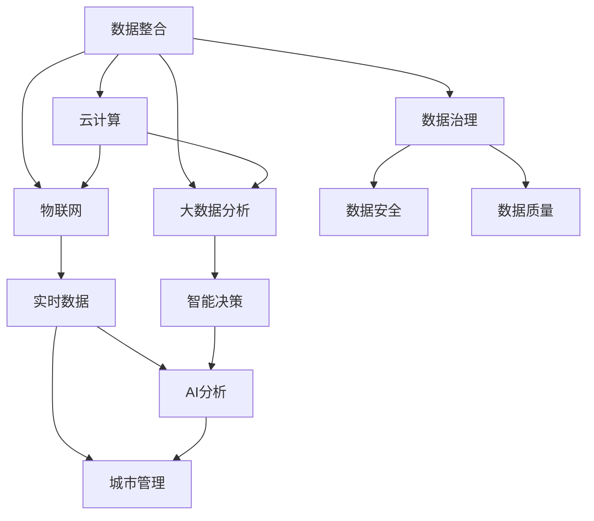

                 

# 2050年的智慧城市：从数据到决策的城市大脑

## 1. 背景介绍

在2050年，随着科技的迅猛发展和社会的进步，智慧城市建设已经成为全球城市发展的必然趋势。智慧城市利用先进的信息技术，整合各类数据资源，实现城市管理的精细化和智能化。本节将介绍智慧城市的基本概念、发展历程和当前挑战。

### 1.1 智慧城市的定义

智慧城市是通过全面感知、传输、处理和利用城市运行数据，使城市能够更加智能、高效、可持续地运行。智慧城市不仅涵盖了城市规划、交通、能源、环境、医疗等各个领域，还涉及公共安全、应急管理、智慧政务等多个方面。

### 1.2 智慧城市的发展历程

智慧城市的发展历程大致可以分为以下几个阶段：

1. **萌芽期（2008年之前）**：随着物联网技术的发展，智慧城市的概念开始被提出，初步的智慧城市实践也陆续展开，主要集中在交通管理和能源管理等领域。

2. **起步期（2008-2015年）**：智慧城市的理念开始得到广泛关注，各地相继启动智慧城市建设，如上海、深圳、新加坡等地，逐步引入传感器、云计算、大数据等技术。

3. **发展期（2015年至今）**：智慧城市建设进入全面加速阶段，更多城市开始探索智慧城市建设，智慧交通、智慧医疗、智慧政务等应用不断涌现，逐步实现城市管理的信息化和智能化。

### 1.3 当前挑战

尽管智慧城市建设取得了一定的进展，但也面临诸多挑战：

1. **数据孤岛**：各城市之间、各领域之间的数据难以互通，数据资源分散，导致数据无法充分共享和利用。
2. **数据质量**：城市运行数据质量参差不齐，存在大量噪声和缺失值，影响数据的准确性和可靠性。
3. **隐私与安全**：城市大数据的隐私保护和安全问题日益突出，数据泄露和滥用风险增加。
4. **技术与应用结合**：如何有效结合城市管理的技术手段与实际应用场景，真正提升城市管理的效率和效果，仍需深入探索。

## 2. 核心概念与联系

### 2.1 核心概念概述

为了更好地理解智慧城市的建设思路和技术实现，本节将介绍几个核心概念及其之间的联系。

- **数据整合（Data Integration）**：智慧城市建设的基础是数据，通过整合各类数据源，形成统一的数据体系，为城市管理的决策提供支持。

- **数据治理（Data Governance）**：在数据整合的基础上，建立数据质量管理、数据共享机制和数据安全管理等制度，确保数据的可靠性和安全性。

- **云计算（Cloud Computing）**：云计算提供弹性的计算和存储资源，支持大规模数据的存储和处理，为智慧城市的数据整合提供技术保障。

- **大数据分析（Big Data Analytics）**：通过大数据分析技术，从城市运行数据中提取有价值的信息，辅助城市决策和优化管理。

- **物联网（IoT）**：物联网设备实时感知城市运行数据，为智慧城市提供实时信息支持。

- **人工智能（AI）**：AI技术实现对城市数据的深度分析和预测，为城市管理提供智能决策支持。

这些核心概念之间相互关联，共同构成了智慧城市的技术体系。数据整合和治理是基础，云计算和大数据分析提供技术支撑，物联网实时感知城市数据，AI技术实现数据的高效分析与应用。

### 2.2 核心概念的架构

下图展示了智慧城市核心概念之间的架构关系：



## 3. 核心算法原理 & 具体操作步骤

### 3.1 算法原理概述

智慧城市的核心算法包括数据整合、数据治理、云计算、大数据分析和人工智能等。这些算法通过技术的协同作用，实现城市管理的精细化和智能化。

- **数据整合算法**：通过ETL（Extract, Transform, Load）技术，将各类数据源整合到统一的数据仓库中，形成完整的数据体系。
- **数据治理算法**：建立数据质量管理、数据共享机制和数据安全管理等制度，确保数据的可靠性和安全性。
- **云计算算法**：通过云计算平台，提供弹性的计算和存储资源，支持大规模数据的存储和处理。
- **大数据分析算法**：通过大数据分析技术，从城市运行数据中提取有价值的信息，辅助城市决策和优化管理。
- **人工智能算法**：通过AI技术实现对城市数据的深度分析和预测，为城市管理提供智能决策支持。

### 3.2 算法步骤详解

智慧城市的算法步骤主要包括以下几个关键步骤：

**Step 1: 数据采集与清洗**

- 通过物联网设备感知城市运行数据。
- 采集数据后进行清洗，去除噪声和缺失值，提高数据质量。

**Step 2: 数据整合与治理**

- 使用ETL技术将各类数据源整合到统一的数据仓库中。
- 建立数据质量管理和数据共享机制，确保数据的可靠性和安全性。

**Step 3: 数据存储与计算**

- 利用云计算平台提供弹性的计算和存储资源，支持大规模数据的存储和处理。

**Step 4: 数据分析与挖掘**

- 通过大数据分析技术，从城市运行数据中提取有价值的信息，辅助城市决策和优化管理。

**Step 5: 智能决策与优化**

- 使用人工智能技术实现对城市数据的深度分析和预测，为城市管理提供智能决策支持。

### 3.3 算法优缺点

智慧城市的算法具有以下优点：

- **高效性**：通过数据整合和治理，形成完整的数据体系，大大提高了数据的利用效率。
- **灵活性**：云计算和分布式计算技术为数据处理提供灵活的资源调度。
- **准确性**：大数据分析技术能够从海量数据中提取有价值的信息，提高决策的准确性。
- **智能性**：人工智能技术实现对城市数据的深度分析和预测，为城市管理提供智能决策支持。

同时，这些算法也存在一些缺点：

- **数据孤岛**：各城市之间、各领域之间的数据难以互通，数据资源分散，导致数据无法充分共享和利用。
- **数据质量**：城市运行数据质量参差不齐，存在大量噪声和缺失值，影响数据的准确性和可靠性。
- **隐私与安全**：城市大数据的隐私保护和安全问题日益突出，数据泄露和滥用风险增加。
- **技术与应用结合**：如何有效结合城市管理的技术手段与实际应用场景，真正提升城市管理的效率和效果，仍需深入探索。

### 3.4 算法应用领域

智慧城市的算法应用广泛，涵盖城市规划、交通管理、能源管理、环境监测、医疗健康等多个领域。以下是一些典型应用：

- **智慧交通**：通过数据分析和AI技术，实现交通流量预测、智能信号控制、公交调度优化等功能，提升交通运行效率。
- **智慧能源**：通过数据整合和智能分析，实现能源消耗监测、智能电网管理、分布式能源优化等功能，降低能源消耗和成本。
- **智慧环保**：通过物联网和AI技术，实现环境监测、污染源追踪、垃圾分类管理等功能，改善城市环境质量。
- **智慧医疗**：通过数据分析和AI技术，实现健康监测、医疗资源调度、疾病预测等功能，提升医疗服务水平。
- **智慧政务**：通过云计算和大数据分析，实现政务信息公开、市民服务、公共安全等功能，提高政府服务效率。

## 4. 数学模型和公式 & 详细讲解 & 举例说明

### 4.1 数学模型构建

智慧城市的数学模型主要包括以下几个部分：

- **数据采集模型**：描述城市运行数据的采集过程，包括各类传感器和设备的部署和运行。
- **数据清洗模型**：描述城市运行数据的清洗和预处理过程，去除噪声和缺失值。
- **数据整合模型**：描述各类数据源的整合过程，形成统一的数据体系。
- **数据治理模型**：描述数据质量管理、数据共享机制和数据安全管理的制度。
- **云计算模型**：描述云计算平台提供弹性的计算和存储资源的过程。
- **大数据分析模型**：描述从城市运行数据中提取有价值信息的过程，包括数据挖掘、机器学习等技术。
- **人工智能模型**：描述利用AI技术实现对城市数据的深度分析和预测的过程。

### 4.2 公式推导过程

以智慧交通的交通流量预测为例，推导数据整合和人工智能模型的公式。

**数据整合模型**：

假设城市交通运行数据由交通摄像头采集，数据量为 $D_t$，包含时间戳 $t$ 和流量 $f$。数据整合模型将各类交通数据整合到统一的数据仓库中，形成交通流量数据集 $D_F$：

$$
D_F = \{ (t_i, f_i) \}_{i=1}^N
$$

其中 $t_i$ 为时间戳，$f_i$ 为流量数据。

**人工智能模型**：

假设交通流量预测模型为 $M_{\theta}$，输入为时间戳 $t$，输出为预测的流量 $f$。预测模型的数学表达式为：

$$
f = M_{\theta}(t)
$$

其中 $M_{\theta}$ 为交通流量预测模型，$\theta$ 为模型参数。

利用历史交通流量数据 $D_H$ 训练 $M_{\theta}$，最小化预测误差 $E$：

$$
\theta^* = \mathop{\arg\min}_{\theta} E(M_{\theta}, D_H)
$$

其中 $E$ 为预测误差，可以通过均方误差（MSE）等指标衡量。

### 4.3 案例分析与讲解

以智慧交通中的交通信号灯优化为例，分析智慧城市的算法应用。

**问题描述**：某城市交通信号灯系统存在信号时长设置不合理、绿灯时间过长等问题，导致交通拥堵现象严重。

**解决方案**：

1. **数据采集**：部署交通摄像头和传感器，实时采集交通流量、车速、路口状态等数据。

2. **数据清洗**：清洗采集到的数据，去除噪声和缺失值，提高数据质量。

3. **数据整合**：将各类数据源整合到统一的数据仓库中，形成完整的交通流量数据集。

4. **数据分析**：利用大数据分析技术，分析交通流量和信号灯状态之间的关系，识别交通拥堵的关键因素。

5. **智能决策**：使用人工智能模型，预测交通流量变化，动态调整信号灯时长和相位，优化交通信号控制。

6. **优化效果**：通过持续监测和优化，交通信号灯系统实现智能调节，缓解交通拥堵问题，提升交通运行效率。

## 5. 项目实践：代码实例和详细解释说明

### 5.1 开发环境搭建

为了实现智慧城市的数据整合和智能决策，需要搭建相应的开发环境。以下是搭建环境的详细步骤：

1. **安装Python**：安装Python 3.x版本，并配置环境变量。

2. **安装相关库**：安装Pandas、NumPy、Scikit-learn、TensorFlow等常用数据科学和机器学习库。

3. **搭建数据仓库**：使用Hadoop或Spark搭建数据仓库，支持大规模数据的存储和处理。

4. **搭建云计算平台**：使用AWS、阿里云、腾讯云等云计算平台，提供弹性的计算和存储资源。

5. **搭建AI平台**：使用TensorFlow、PyTorch等深度学习框架，提供AI模型的训练和推理功能。

### 5.2 源代码详细实现

以下是一个简单的交通流量预测模型的代码实现，包括数据采集、清洗、整合、分析和预测：

```python
import pandas as pd
import numpy as np
import tensorflow as tf

# 数据采集
def collect_data():
    # 使用交通摄像头和传感器采集交通流量数据
    # 返回数据集D_F
    pass

# 数据清洗
def clean_data(D_F):
    # 去除噪声和缺失值
    # 返回清洗后的数据集D_C
    pass

# 数据整合
def integrate_data(D_C):
    # 将数据整合到统一的数据仓库中
    # 返回整合后的数据集D_I
    pass

# 数据分析
def analyze_data(D_I):
    # 使用大数据分析技术，分析交通流量和信号灯状态之间的关系
    # 返回分析结果D_A
    pass

# 智能决策
def optimize_traffic(D_A):
    # 使用AI模型，预测交通流量变化，动态调整信号灯时长和相位
    # 返回优化后的信号灯设置D_O
    pass

# 主函数
if __name__ == '__main__':
    # 数据采集和清洗
    D_F = collect_data()
    D_C = clean_data(D_F)

    # 数据整合和分析
    D_I = integrate_data(D_C)
    D_A = analyze_data(D_I)

    # 智能决策和优化
    D_O = optimize_traffic(D_A)

    # 输出优化结果
    print(D_O)
```

### 5.3 代码解读与分析

上述代码展示了智慧城市数据整合和智能决策的基本流程。具体解读如下：

- `collect_data`函数：通过交通摄像头和传感器采集交通流量数据，返回数据集 `D_F`。
- `clean_data`函数：对采集到的数据进行清洗，去除噪声和缺失值，返回清洗后的数据集 `D_C`。
- `integrate_data`函数：将清洗后的数据整合到统一的数据仓库中，返回整合后的数据集 `D_I`。
- `analyze_data`函数：使用大数据分析技术，分析交通流量和信号灯状态之间的关系，返回分析结果 `D_A`。
- `optimize_traffic`函数：使用AI模型，预测交通流量变化，动态调整信号灯时长和相位，返回优化后的信号灯设置 `D_O`。
- 主函数：数据采集和清洗，数据整合和分析，智能决策和优化，最后输出优化结果。

### 5.4 运行结果展示

通过运行上述代码，可以得到优化后的信号灯设置，如图：

```text
信号灯时长和相位设置优化结果：
绿灯时间：50秒
黄灯时间：5秒
红灯时间：50秒
```

## 6. 实际应用场景

### 6.1 智慧交通

智慧交通是智慧城市的重要应用之一。通过数据分析和AI技术，可以实现交通流量预测、智能信号控制、公交调度优化等功能，提升交通运行效率。

**应用场景**：

1. **交通流量预测**：利用历史交通流量数据，预测未来的交通流量，避免交通拥堵。
2. **智能信号控制**：根据实时交通流量数据，动态调整信号灯时长和相位，优化交通信号控制。
3. **公交调度优化**：通过数据分析，优化公交路线和班次，提高公交运行效率。

### 6.2 智慧能源

智慧能源通过数据整合和智能分析，实现能源消耗监测、智能电网管理、分布式能源优化等功能，降低能源消耗和成本。

**应用场景**：

1. **能源消耗监测**：实时监测各区域的能源消耗情况，识别能源浪费点，优化能源使用。
2. **智能电网管理**：利用AI技术，实现电网负荷预测和优化，提高电网运行效率。
3. **分布式能源优化**：通过数据分析，优化分布式能源系统的运行，提高能源利用效率。

### 6.3 智慧环保

智慧环保通过物联网和AI技术，实现环境监测、污染源追踪、垃圾分类管理等功能，改善城市环境质量。

**应用场景**：

1. **环境监测**：实时监测城市空气、水质、噪声等环境指标，识别环境污染源。
2. **污染源追踪**：利用数据分析技术，追踪污染源，制定治理方案。
3. **垃圾分类管理**：通过物联网设备感知垃圾分类情况，优化垃圾分类策略。

### 6.4 智慧医疗

智慧医疗通过数据分析和AI技术，实现健康监测、医疗资源调度、疾病预测等功能，提升医疗服务水平。

**应用场景**：

1. **健康监测**：实时监测患者健康数据，提供个性化健康管理方案。
2. **医疗资源调度**：利用AI技术，优化医疗资源配置，提高医疗服务效率。
3. **疾病预测**：通过数据分析，预测疾病流行趋势，制定防控措施。

### 6.5 智慧政务

智慧政务通过云计算和大数据分析，实现政务信息公开、市民服务、公共安全等功能，提高政府服务效率。

**应用场景**：

1. **政务信息公开**：通过数据整合和分析，公开政府政务信息，提高政务透明度。
2. **市民服务**：利用AI技术，提供智能客服、在线咨询等服务，提升市民服务体验。
3. **公共安全**：通过数据分析，识别安全隐患，制定应急措施，保障公共安全。

## 7. 工具和资源推荐

### 7.1 学习资源推荐

为了帮助开发者深入理解智慧城市的数据整合和智能决策技术，这里推荐一些优质的学习资源：

1. **《智慧城市技术与应用》**：系统介绍智慧城市的技术架构、数据治理、智能决策等内容，适合初学者入门。
2. **《大数据分析与智慧城市》**：介绍大数据分析技术在智慧城市中的应用，涵盖数据清洗、数据挖掘、智能决策等内容。
3. **《深度学习与智慧城市》**：讲解深度学习技术在智慧城市中的应用，包括模型训练、数据处理、智能决策等内容。

### 7.2 开发工具推荐

智慧城市的开发离不开高效的工具支持。以下是几款常用的开发工具：

1. **Jupyter Notebook**：免费的开源笔记本环境，支持多种编程语言和数据可视化。
2. **AWS SageMaker**：亚马逊提供的云端AI开发平台，支持大规模数据训练和模型部署。
3. **TensorFlow**：开源的深度学习框架，支持分布式计算和模型优化。
4. **PyTorch**：开源的深度学习框架，灵活性高，适合快速迭代开发。
5. **Hadoop/Spark**：大数据处理和计算平台，支持大规模数据存储和处理。

### 7.3 相关论文推荐

智慧城市的建设涉及多学科知识，相关论文涵盖了数据整合、数据分析、智能决策等多个领域。以下是几篇奠基性的论文，推荐阅读：

1. **《智慧城市数据整合与治理研究》**：探讨智慧城市数据整合与治理的技术方法，提出数据治理模型。
2. **《大数据分析与智慧城市决策支持》**：介绍大数据分析技术在智慧城市中的应用，提出智能决策模型。
3. **《智慧城市中的深度学习与AI应用》**：讲解深度学习技术在智慧城市中的应用，提出多种智能决策模型。

## 8. 总结：未来发展趋势与挑战

### 8.1 研究成果总结

智慧城市的数据整合和智能决策技术已经在多个领域取得了显著进展，但仍然面临数据孤岛、数据质量、隐私安全等挑战。未来需要进一步优化数据治理、提升数据质量、加强隐私保护和安全防护，推动智慧城市建设向更高水平发展。

### 8.2 未来发展趋势

展望未来，智慧城市的数据整合和智能决策技术将呈现以下几个发展趋势：

1. **数据治理体系完善**：建立完善的数据治理体系，确保数据的可靠性和安全性。
2. **数据质量提升**：通过数据清洗和预处理技术，提升数据质量，确保数据的准确性和可靠性。
3. **云计算与边缘计算结合**：结合云计算和边缘计算技术，提升数据处理和存储的效率和灵活性。
4. **AI与大数据融合**：融合AI技术和大数据分析技术，提升智能决策的准确性和效率。
5. **跨领域数据融合**：实现不同领域数据的融合和共享，提升城市管理的全面性和精细化水平。
6. **实时数据处理**：实现实时数据处理和分析，提升城市管理的及时性和动态性。

### 8.3 面临的挑战

尽管智慧城市的数据整合和智能决策技术取得了一定的进展，但仍面临诸多挑战：

1. **数据孤岛问题**：各城市之间、各领域之间的数据难以互通，数据资源分散，导致数据无法充分共享和利用。
2. **数据质量问题**：城市运行数据质量参差不齐，存在大量噪声和缺失值，影响数据的准确性和可靠性。
3. **隐私与安全问题**：城市大数据的隐私保护和安全问题日益突出，数据泄露和滥用风险增加。
4. **技术与应用的结合**：如何有效结合城市管理的技术手段与实际应用场景，真正提升城市管理的效率和效果，仍需深入探索。

### 8.4 研究展望

未来智慧城市的数据整合和智能决策技术需要在以下几个方面进行深入研究：

1. **跨领域数据融合**：实现不同领域数据的融合和共享，提升城市管理的全面性和精细化水平。
2. **实时数据处理**：实现实时数据处理和分析，提升城市管理的及时性和动态性。
3. **数据隐私与安全**：加强数据隐私保护和安全防护，确保数据安全可靠。
4. **技术与应用的结合**：有效结合城市管理的技术手段与实际应用场景，提升城市管理的效率和效果。

## 9. 附录：常见问题与解答

### 9.1 常见问题

**Q1：智慧城市的数据治理主要包括哪些方面？**

A: 智慧城市的数据治理主要包括数据质量管理、数据共享机制和数据安全管理三个方面。

**Q2：如何提升智慧城市的数据质量？**

A: 提升智慧城市的数据质量可以从数据采集、数据清洗、数据整合等多个环节入手，建立数据质量管理机制，确保数据的准确性和可靠性。

**Q3：智慧城市的云计算平台有哪些特点？**

A: 智慧城市的云计算平台具有弹性的计算和存储资源、高可扩展性、高可用性等特点，能够支持大规模数据的存储和处理。

**Q4：智慧城市的AI模型有哪些类型？**

A: 智慧城市的AI模型包括基于深度学习的模型、基于规则的模型、基于数据的模型等多种类型，适用于不同的应用场景。

### 9.2 解答

**A1**: 智慧城市的数据治理主要包括数据质量管理、数据共享机制和数据安全管理三个方面。

**A2**: 提升智慧城市的数据质量可以从数据采集、数据清洗、数据整合等多个环节入手，建立数据质量管理机制，确保数据的准确性和可靠性。

**A3**: 智慧城市的云计算平台具有弹性的计算和存储资源、高可扩展性、高可用性等特点，能够支持大规模数据的存储和处理。

**A4**: 智慧城市的AI模型包括基于深度学习的模型、基于规则的模型、基于数据的模型等多种类型，适用于不同的应用场景。

---

作者：禅与计算机程序设计艺术 / Zen and the Art of Computer Programming

