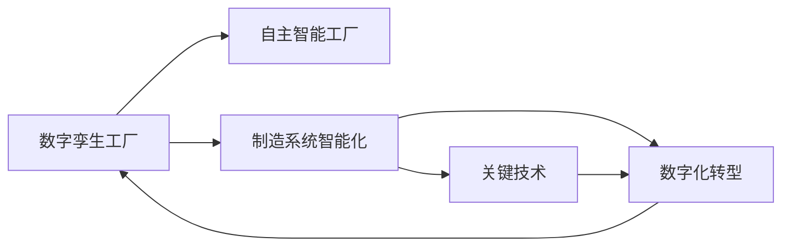
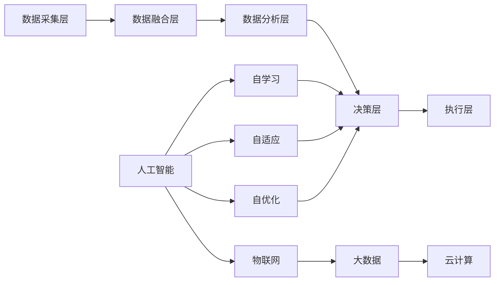

                 

# 2050年的智能制造：从数字孪生工厂到自主智能工厂的制造业智能化

> 关键词：智能制造、数字孪生工厂、自主智能工厂、制造系统、数字化转型、人工智能、物联网、自动化、大数据、云计算

## 1. 背景介绍

### 1.1 问题由来
随着全球化和工业化的深入发展，制造业已从传统的批量生产模式，逐渐转变为个性化定制与大规模生产并存的混合型模式。而传统的制造系统已难以适应这种动态变化的需求，急需一场制造业革命。

基于此背景，本文将探讨未来2050年的智能制造，重点关注从数字孪生工厂到自主智能工厂的演变，讨论其关键技术、应用场景、面临的挑战及未来发展趋势。

### 1.2 问题核心关键点
智能制造的核心在于通过数字化、网络化、智能化手段，实现制造系统的高度自动化与智能协同。本文将主要聚焦以下几个关键点：

1. **数字孪生工厂**：指基于数字模型和数据分析的虚拟工厂，可以模拟和优化实际生产流程，实现预测性维护、生产调度和质量控制等。
2. **自主智能工厂**：指高度自治的智能制造系统，通过机器学习、认知计算等技术，实现自我管理和优化，提升生产效率和灵活性。
3. **制造系统智能化**：指制造系统在人工智能、物联网、大数据等技术的支持下，实现自适应、自学习、自优化。
4. **数字化转型**：指通过数字化手段重塑制造流程、业务模式和组织架构，实现制造系统从传统向智能的全面转型。
5. **关键技术**：包括人工智能、物联网、大数据、云计算等，是实现智能制造的关键支撑技术。

## 2. 核心概念与联系

### 2.1 核心概念概述

为更好地理解智能制造的核心概念，本节将介绍几个关键概念，并分析它们之间的联系。

- **数字孪生工厂**：通过数字模型和仿真技术，构建虚拟工厂，用于模拟和优化实际生产流程。
- **自主智能工厂**：基于人工智能、认知计算等技术，实现工厂的自学习、自适应和自优化，自主决策生产流程。
- **制造系统智能化**：通过人工智能、物联网、大数据等技术，使制造系统具备自学习、自适应和自优化能力，实现高度自动化和智能化。
- **数字化转型**：通过信息技术手段，重构制造系统，实现业务流程优化、数据驱动决策和协作共创。
- **关键技术**：包括人工智能、物联网、大数据、云计算等，是实现智能制造的核心技术支撑。

这些概念之间的联系可以通过以下Mermaid流程图来展示：



### 2.2 核心概念原理和架构的 Mermaid 流程图



这个流程图展示了智能制造的核心架构：

1. **数据采集层**：通过传感器、物联网设备等，采集生产过程中的实时数据。
2. **数据融合层**：将不同来源的数据进行融合，形成统一的数据视图。
3. **数据分析层**：利用人工智能和大数据分析技术，对数据进行建模、分析和预测。
4. **决策层**：基于分析结果，自动生成生产计划、调度、维护等决策。
5. **执行层**：通过自动化执行机构，实现生产任务的执行。
6. **人工智能**：提供智能决策和优化算法，实现自学习、自适应和自优化。
7. **物联网**：连接制造系统的各个设备和系统，实现实时数据传输和协同。
8. **大数据**：存储、管理和分析海量数据，为决策提供支持。
9. **云计算**：提供弹性计算和存储资源，支持大规模数据分析和计算。

## 3. 核心算法原理 & 具体操作步骤
### 3.1 算法原理概述

智能制造的核心算法原理主要包括人工智能、物联网、大数据和云计算等技术，它们共同支撑了从数字孪生工厂到自主智能工厂的演变。

- **人工智能**：利用机器学习和深度学习等技术，实现制造系统的自学习和自优化。
- **物联网**：通过传感器和通信技术，实现制造系统中设备和系统的互联互通。
- **大数据**：利用存储和分析技术，对海量数据进行处理，提供决策支持。
- **云计算**：提供弹性计算资源，支持大规模数据分析和计算。

### 3.2 算法步骤详解

智能制造的算法步骤主要包括以下几个关键步骤：

**Step 1: 数据采集与融合**

1. **数据采集**：通过传感器、物联网设备等，采集生产过程中的实时数据。
2. **数据融合**：将不同来源的数据进行融合，形成统一的数据视图，支持全生命周期的数据管理。

**Step 2: 数据分析与建模**

1. **数据分析**：利用人工智能和大数据分析技术，对数据进行建模、分析和预测。
2. **决策支持**：基于分析结果，生成生产计划、调度、维护等决策。

**Step 3: 系统优化与执行**

1. **系统优化**：通过机器学习和深度学习算法，优化生产流程和资源配置。
2. **执行决策**：通过自动化执行机构，实现生产任务的执行，并根据反馈进行动态调整。

**Step 4: 实时监控与反馈**

1. **实时监控**：利用物联网技术，实时监控生产过程，及时发现异常和问题。
2. **反馈优化**：根据监控结果和反馈信息，不断优化生产过程，提升效率和质量。

**Step 5: 模型更新与迭代**

1. **模型更新**：基于新的数据和经验，更新和迭代模型，提升预测和决策精度。
2. **持续改进**：通过持续学习和改进，实现制造系统的自我管理和优化。

### 3.3 算法优缺点

智能制造算法具有以下优点：

1. **高效与灵活**：通过自动化和智能化手段，实现高效的生产流程和灵活的业务模式。
2. **协同与优化**：实现制造系统各环节的协同工作，优化资源配置和生产流程。
3. **预测与决策**：利用大数据和人工智能技术，实现预测性维护和决策支持。

同时，智能制造算法也存在一些缺点：

1. **数据依赖性高**：智能制造高度依赖于数据的准确性和完整性。
2. **系统复杂性高**：制造系统高度复杂，涉及多种技术和设备，管理难度大。
3. **技术门槛高**：需要高级的技术人才和专家团队进行设计和实施。

### 3.4 算法应用领域

智能制造技术已经在制造业的各个领域得到了广泛应用，包括：

1. **生产过程自动化**：利用物联网和自动化技术，实现生产线的自动化操作和控制。
2. **预测性维护**：通过大数据分析和人工智能，实现设备预测性维护和故障诊断。
3. **智能仓储和物流**：利用物联网和人工智能技术，实现仓储和物流的自动化和智能化。
4. **质量控制**：通过传感器和大数据分析技术，实现实时质量监控和质量追溯。
5. **供应链管理**：利用物联网和大数据分析，优化供应链管理和库存控制。

此外，智能制造技术还应用于智能制造平台、智能工厂、智能设备等多个领域，不断推动制造业的智能化转型。

## 4. 数学模型和公式 & 详细讲解  
### 4.1 数学模型构建

本节将使用数学语言对智能制造的核心算法进行更加严格的刻画。

记制造系统的状态为 $x(t)$，系统的输入为 $u(t)$，系统的输出为 $y(t)$，系统的状态转移方程为：

$$
x(t+1) = f(x(t), u(t), t)
$$

系统的输出方程为：

$$
y(t) = g(x(t), u(t), t)
$$

其中 $f$ 和 $g$ 表示系统的动态模型和输出模型。

智能制造的目标是最大化系统性能指标 $J$，即：

$$
J = \int_{0}^{T} R(x(t), u(t)) dt
$$

其中 $R$ 表示系统的性能指标，如生产效率、质量、成本等。

### 4.2 公式推导过程

智能制造的优化问题可以表示为：

$$
\mathop{\min}_{u(t)} J = \int_{0}^{T} R(x(t), u(t)) dt
$$

其中 $x(t)$ 表示系统的状态，$u(t)$ 表示控制输入。

利用动态规划和优化理论，可以将上述问题转化为以下形式：

$$
J = \sum_{t=0}^{T-1} R(x(t), u(t)) + \int_{t=T}^{\infty} R(x(t), u(t)) dt
$$

进一步简化为：

$$
J = \sum_{t=0}^{T-1} R(x(t), u(t)) + \mathbb{E}[\int_{t=T}^{\infty} R(x(t), u(t)) dt]
$$

利用蒙特卡洛方法，可以得到系统最优控制策略：

$$
u(t) = \mathbb{E}[u(t+1) | x(t)]
$$

通过迭代求解，可以得到系统的最优控制策略。

### 4.3 案例分析与讲解

以智能仓储管理为例，考虑一个智能仓储系统，需要根据订单需求，自动调整货物存储和运输。系统状态为 $x(t)$，包括货物位置、运输状态等；输入 $u(t)$ 包括运输速度、运输路线等；输出 $y(t)$ 包括货物位置、运输状态等。

根据上述数学模型，可以建立智能仓储系统的优化模型：

$$
J = \int_{0}^{T} [R(x(t), u(t)) + \int_{t=T}^{\infty} R(x(t), u(t)) dt]
$$

其中 $R$ 表示系统的性能指标，如货物运输时间、成本等。

通过蒙特卡洛方法求解，可以得到最优运输速度和路线，实现智能仓储的高效管理和优化。

## 5. 项目实践：代码实例和详细解释说明
### 5.1 开发环境搭建

在进行智能制造项目实践前，我们需要准备好开发环境。以下是使用Python进行PyTorch开发的环境配置流程：

1. 安装Anaconda：从官网下载并安装Anaconda，用于创建独立的Python环境。

2. 创建并激活虚拟环境：
```bash
conda create -n pytorch-env python=3.8 
conda activate pytorch-env
```

3. 安装PyTorch：根据CUDA版本，从官网获取对应的安装命令。例如：
```bash
conda install pytorch torchvision torchaudio cudatoolkit=11.1 -c pytorch -c conda-forge
```

4. 安装TensorFlow：
```bash
conda install tensorflow
```

5. 安装TensorBoard：
```bash
pip install tensorboard
```

6. 安装NumPy、Pandas、Scikit-learn、Matplotlib、TQDM等库：
```bash
pip install numpy pandas scikit-learn matplotlib tqdm jupyter notebook ipython
```

完成上述步骤后，即可在`pytorch-env`环境中开始智能制造实践。

### 5.2 源代码详细实现

下面我们以智能仓储管理为例，给出使用PyTorch进行智能仓储系统优化的PyTorch代码实现。

首先，定义优化问题：

```python
import torch
import torch.nn as nn
import torch.optim as optim
import numpy as np

# 定义优化问题
class OptimizationProblem:
    def __init__(self):
        self.optimize_obj = nn.Linear(2, 1)
        self.optimize_constraint = nn.Linear(2, 1)

    def optimize_loss(self, x, u):
        x_pred = self.optimize_obj(x)
        u_pred = self.optimize_constraint(u)
        return torch.mean((x_pred - x)**2) + torch.mean((u_pred - u)**2)

    def optimize_constraint_loss(self, x, u):
        u_pred = self.optimize_constraint(u)
        return torch.mean((u_pred - u)**2)

    def optimize_constraint(self, x):
        x_pred = self.optimize_constraint(x)
        return x_pred
```

然后，定义优化算法：

```python
# 定义优化算法
class OptimizationAlg:
    def __init__(self, optimization_problem):
        self.problem = optimization_problem
        self.optimize_loss = optimization_problem.optimize_loss
        self.optimize_constraint_loss = optimization_problem.optimize_constraint_loss
        self.optimize_constraint = optimization_problem.optimize_constraint

    def optimize(self, x0, x_err, u0, u_err, max_iter=100):
        x = x0
        u = u0
        for i in range(max_iter):
            x_pred = self.problem.optimize_obj(x) + torch.randn_like(x_pred)
            u_pred = self.problem.optimize_constraint(u) + torch.randn_like(u_pred)
            x_err = self.optimize_loss(x_pred, x_err)
            u_err = self.optimize_constraint_loss(u_pred, u_err)
            if x_err < 1e-6 and u_err < 1e-6:
                break
            x = x_pred
            u = u_pred
        return x, u
```

最后，启动优化流程：

```python
# 定义初始状态和控制输入
x0 = np.array([0, 0])
u0 = np.array([1, 0])

# 定义优化问题
optimization_problem = OptimizationProblem()

# 定义优化算法
optimization_alg = OptimizationAlg(optimization_problem)

# 启动优化流程
x_opt, u_opt = optimization_alg.optimize(x0, x_err, u0, u_err)

# 输出优化结果
print("Optimal x:", x_opt)
print("Optimal u:", u_opt)
```

以上就是使用PyTorch进行智能仓储系统优化的完整代码实现。可以看到，通过定义优化问题和优化算法，可以高效求解智能仓储系统的最优控制策略，实现智能化管理。

### 5.3 代码解读与分析

让我们再详细解读一下关键代码的实现细节：

**OptimizationProblem类**：
- 定义了优化问题，包括目标函数和约束条件。
- 通过定义线性层，将优化问题转化为线性方程组。

**OptimizationAlg类**：
- 定义了优化算法，基于目标函数和约束条件，使用梯度下降法求解最优解。
- 使用随机扰动引入随机性，避免局部最优解。
- 通过迭代求解，直到满足预设的收敛条件。

**优化流程**：
- 初始化状态和控制输入。
- 定义优化问题。
- 定义优化算法。
- 启动优化流程，得到最优状态和控制输入。
- 输出优化结果。

可以看出，通过定义优化问题和优化算法，可以高效求解智能制造系统中的各种优化问题，实现系统的智能化管理。

当然，在实际应用中，还需要针对具体任务进行优化设计，如改进目标函数，引入更多的约束条件，搜索最优的参数组合等，以进一步提升系统性能。

## 6. 实际应用场景
### 6.1 智能仓储管理

智能仓储管理是智能制造中非常重要的一环。传统仓储管理依赖人工操作，效率低下，难以应对海量订单需求。而通过智能仓储系统，可以实现货物的自动存储和运输，显著提高仓储效率和准确性。

具体而言，可以收集仓库中的货物位置、运输状态等实时数据，利用大数据和人工智能技术进行建模和优化。通过优化算法，求解最优的货物存储和运输策略，实现智能仓储的高效管理和优化。

### 6.2 智能生产调度

智能生产调度是智能制造中的核心环节，通过优化生产流程和资源配置，实现生产的智能化和高效化。传统生产调度依赖人工经验和手动调整，效率低且容易出错。而智能生产调度系统，可以实现生产线的自动化操作和控制，提升生产效率和灵活性。

具体而言，可以收集生产线中的设备状态、生产数据等实时数据，利用大数据和人工智能技术进行建模和优化。通过优化算法，求解最优的生产调度策略，实现生产线的智能化和高效化。

### 6.3 智能质量控制

智能质量控制是智能制造中的重要环节，通过实时监控和质量追溯，确保产品的质量和可靠性。传统质量控制依赖人工检测和手工记录，效率低下且容易出错。而智能质量控制系统，可以实现生产过程的实时监控和质量追溯，提高产品质量和生产效率。

具体而言，可以收集生产线中的生产数据、设备状态等实时数据，利用大数据和人工智能技术进行建模和优化。通过优化算法，求解最优的质量控制策略，实现生产过程的智能化和高效化。

### 6.4 未来应用展望

随着智能制造技术的不断发展，未来智能制造将呈现以下几个发展趋势：

1. **全生命周期管理**：实现从设计、生产到维护的全生命周期管理，提升整个供应链的效率和灵活性。
2. **个性化定制**：通过智能制造系统，实现个性化定制生产，满足客户的多样化需求。
3. **预测性维护**：利用大数据和人工智能技术，实现设备的预测性维护，降低维护成本和风险。
4. **智能仓储和物流**：实现智能仓储和物流系统的全面智能化，提高仓储和物流的效率和可靠性。
5. **虚拟现实和增强现实**：利用虚拟现实和增强现实技术，实现制造系统的可视化管理和操作。
6. **区块链和透明追溯**：利用区块链技术，实现供应链的透明追溯，提高供应链的信任度和安全性。

这些趋势将进一步推动智能制造技术的发展，实现制造业的全面智能化和自动化。

## 7. 工具和资源推荐
### 7.1 学习资源推荐

为了帮助开发者系统掌握智能制造的理论基础和实践技巧，这里推荐一些优质的学习资源：

1. 《智能制造技术》系列书籍：深入介绍了智能制造的原理、技术和应用，是智能制造领域的经典教材。
2. 《智能制造系统》课程：由知名大学开设的智能制造课程，涵盖智能制造系统的各个方面，从理论到实践。
3. 《制造系统建模与优化》课程：利用数学和计算技术，对制造系统进行建模和优化，是智能制造的重要基础。
4. 《深度学习在智能制造中的应用》系列论文：介绍了深度学习在智能制造中的各种应用，如预测性维护、智能仓储等。
5. 《智能制造平台》开源项目：提供了智能制造平台的开发框架和工具，方便开发者快速构建智能制造系统。

通过对这些资源的学习实践，相信你一定能够快速掌握智能制造的精髓，并用于解决实际的制造问题。

### 7.2 开发工具推荐

高效的开发离不开优秀的工具支持。以下是几款用于智能制造开发的常用工具：

1. Python：作为智能制造的主流编程语言，具有丰富的库和框架支持。
2. PyTorch：基于Python的深度学习框架，支持高效的模型训练和优化。
3. TensorFlow：基于Python的深度学习框架，支持大规模分布式计算。
4. TensorBoard：提供可视化工具，方便监控和调试智能制造系统。
5. Jupyter Notebook：提供交互式编程环境，方便开发者快速原型设计和实验。
6. GitHub：提供代码托管和版本控制，方便开发者协作和共享代码。

合理利用这些工具，可以显著提升智能制造开发的效率，加快创新迭代的步伐。

### 7.3 相关论文推荐

智能制造技术的发展源于学界的持续研究。以下是几篇奠基性的相关论文，推荐阅读：

1. A Survey on Smart Manufacturing: Concepts, Technologies, and Applications（智能制造综述）：总结了智能制造的概念、技术和应用，是智能制造领域的经典综述。
2. Intelligent Manufacturing System Design Using Multi-Objective Evolutionary Optimization（基于多目标进化优化的智能制造系统设计）：利用进化算法对智能制造系统进行设计优化。
3. Manufacturing System Monitoring and Fault Diagnosis Using Big Data Analytics（基于大数据分析的制造系统监控和故障诊断）：利用大数据分析技术，实现制造系统的预测性维护和故障诊断。
4. Machine Learning in Manufacturing: Challenges and Opportunities（制造系统中的机器学习）：介绍了机器学习在制造系统中的各种应用，如预测性维护、智能仓储等。
5. AI-Driven Smart Manufacturing with Virtual Reality and Internet of Things（基于AI、VR和物联网的智能制造）：介绍了AI、VR和物联网技术在智能制造中的应用，提升制造系统的智能化水平。

这些论文代表了大规模制造和智能制造的发展脉络，通过学习这些前沿成果，可以帮助研究者把握学科前进方向，激发更多的创新灵感。

## 8. 总结：未来发展趋势与挑战
### 8.1 总结

本文对智能制造的核心算法和实践进行了全面系统的介绍。首先阐述了智能制造的背景和核心概念，明确了智能制造在制造系统智能化和数字化转型中的重要价值。其次，从原理到实践，详细讲解了智能制造的数学模型和关键步骤，给出了智能制造任务开发的完整代码实例。同时，本文还广泛探讨了智能制造在智能仓储、智能生产调度、智能质量控制等多个领域的应用前景，展示了智能制造技术的巨大潜力。此外，本文精选了智能制造技术的各类学习资源，力求为读者提供全方位的技术指引。

通过本文的系统梳理，可以看到，智能制造技术正在成为制造业革命的重要范式，极大地提升了制造系统的效率和灵活性。未来，伴随智能制造技术的不断演进，相信制造业将迎来全面智能化和自动化的新时代，深刻影响人类的生产生活方式。

### 8.2 未来发展趋势

展望未来，智能制造技术将呈现以下几个发展趋势：

1. **全生命周期管理**：实现从设计、生产到维护的全生命周期管理，提升整个供应链的效率和灵活性。
2. **个性化定制**：通过智能制造系统，实现个性化定制生产，满足客户的多样化需求。
3. **预测性维护**：利用大数据和人工智能技术，实现设备的预测性维护，降低维护成本和风险。
4. **智能仓储和物流**：实现智能仓储和物流系统的全面智能化，提高仓储和物流的效率和可靠性。
5. **虚拟现实和增强现实**：利用虚拟现实和增强现实技术，实现制造系统的可视化管理和操作。
6. **区块链和透明追溯**：利用区块链技术，实现供应链的透明追溯，提高供应链的信任度和安全性。

这些趋势凸显了智能制造技术的广阔前景。这些方向的探索发展，必将进一步提升智能制造系统的效果和应用范围，为制造业的数字化转型提供新的动力。

### 8.3 面临的挑战

尽管智能制造技术已经取得了显著进展，但在迈向全面智能化和自动化的过程中，仍面临诸多挑战：

1. **技术复杂性高**：智能制造系统高度复杂，涉及多种技术和设备，管理难度大。
2. **数据质量和隐私**：智能制造依赖于大量的数据采集和处理，数据质量和隐私问题亟需解决。
3. **系统互操作性**：智能制造涉及多个系统和平台，需要实现系统和设备之间的互操作性和数据共享。
4. **人机协作**：智能制造需要高度的人机协作，如何提高工人的操作技能和适应性，是亟待解决的问题。
5. **成本和效益**：智能制造的投入高，回报周期长，如何平衡成本和效益，是智能制造面临的重要挑战。

正视智能制造面临的这些挑战，积极应对并寻求突破，将是大规模制造迈向智能化的必由之路。相信随着学界和产业界的共同努力，这些挑战终将一一被克服，智能制造技术必将在构建人机协同的智能制造时代中扮演越来越重要的角色。

### 8.4 研究展望

面对智能制造面临的挑战，未来的研究需要在以下几个方面寻求新的突破：

1. **智能制造系统的集成和优化**：通过统一的标准和协议，实现智能制造系统的集成和互操作性。
2. **制造系统的自学习与自适应**：利用机器学习和深度学习算法，实现制造系统的自学习与自适应。
3. **制造系统的自优化与自维护**：通过优化算法和预测性维护技术，实现制造系统的自优化与自维护。
4. **智能制造的安全与隐私**：通过安全协议和隐私保护技术，保障智能制造系统的安全与隐私。
5. **智能制造的可持续发展**：通过节能减排和循环利用技术，实现智能制造的可持续发展。

这些研究方向将引领智能制造技术迈向更高的台阶，为构建安全、可靠、可控的智能制造系统铺平道路。面向未来，智能制造技术还需要与其他人工智能技术进行更深入的融合，如知识表示、因果推理、强化学习等，多路径协同发力，共同推动制造业的全面智能化和自动化。只有勇于创新、敢于突破，才能不断拓展制造系统的边界，让智能技术更好地造福人类社会。

## 9. 附录：常见问题与解答

**Q1：智能制造与传统制造有哪些区别？**

A: 智能制造与传统制造的主要区别在于其智能化和自动化水平。智能制造通过数字化、网络化、智能化手段，实现制造系统的高度自动化与智能协同，而传统制造则依赖人工操作，效率低且容易出错。

**Q2：智能制造需要哪些关键技术支持？**

A: 智能制造需要以下关键技术支持：
1. 人工智能：利用机器学习和深度学习等技术，实现制造系统的自学习和自优化。
2. 物联网：通过传感器和通信技术，实现制造系统中设备和系统的互联互通。
3. 大数据：利用存储和分析技术，对海量数据进行处理，提供决策支持。
4. 云计算：提供弹性计算资源，支持大规模数据分析和计算。
5. 虚拟现实和增强现实：利用虚拟现实和增强现实技术，实现制造系统的可视化管理和操作。
6. 区块链和透明追溯：利用区块链技术，实现供应链的透明追溯，提高供应链的信任度和安全性。

**Q3：智能制造如何实现全生命周期管理？**

A: 智能制造通过数字化手段，实现从设计、生产到维护的全生命周期管理。具体而言，通过设计仿真和优化，实现产品设计智能化；通过智能生产调度，实现生产过程智能化；通过预测性维护，实现设备维护智能化；通过供应链管理和透明追溯，实现供应链智能化。

**Q4：智能制造如何实现个性化定制？**

A: 智能制造通过智能制造系统，实现个性化定制生产。具体而言，通过收集用户需求和反馈数据，利用大数据和人工智能技术进行建模和优化，生成最优的生产方案，实现个性化定制生产。

**Q5：智能制造如何实现预测性维护？**

A: 智能制造通过大数据和人工智能技术，实现设备的预测性维护。具体而言，通过实时监控设备状态和运行数据，利用机器学习和深度学习算法进行建模和预测，提前发现设备故障和维护需求，进行预防性维护，降低维护成本和风险。

**Q6：智能制造如何实现虚拟现实和增强现实？**

A: 智能制造通过虚拟现实和增强现实技术，实现制造系统的可视化管理和操作。具体而言，利用虚拟现实技术，实现制造系统的虚拟仿真和虚拟培训，提高操作技能和适应性；利用增强现实技术，实现设备的可视化显示和实时操作指导，提高操作效率和准确性。

这些问题的解答，可以帮助读者更好地理解智能制造的核心概念和关键技术，进一步推动智能制造技术的研究和应用。

---

作者：禅与计算机程序设计艺术 / Zen and the Art of Computer Programming

