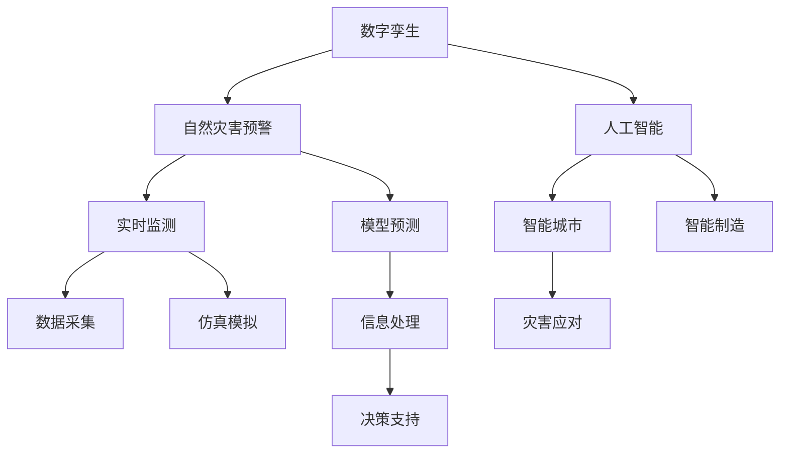

                 

# 2050年的灾害预防：从数字孪生到人工智能预警的灾害防控升级

## 1. 背景介绍

### 1.1 问题由来
随着城市化进程的加快，人类社会对自然环境的依赖越来越深，而自然灾害的发生频率和破坏力也随之增加。自然灾害的频繁发生不仅对人类生命财产安全构成威胁，也给经济社会稳定带来重大挑战。目前，全球每年因自然灾害造成的经济损失超过数十亿美元，受灾人口达数亿。

面对频发的自然灾害，传统灾害防控体系显得力不从心。传统的灾害预防和应对方法主要依赖于人工监测、经验判断和现场救援，这些方法具有明显的滞后性和局限性。特别是在极端天气、地质灾害等复杂情况下，难以提前预警，导致灾害损失加剧。

因此，亟需引入新技术，提升灾害防控的科学性和精准性，保障人民生命财产安全，促进经济社会稳定发展。本文旨在探讨数字孪生与人工智能在灾害预警中的应用，通过构建智能化的灾害预防体系，推动灾害防控技术的升级。

## 2. 核心概念与联系

### 2.1 核心概念概述

为更好地理解数字孪生与人工智能在灾害预防中的应用，本节将介绍几个密切相关的核心概念：

- **数字孪生(Digital Twin)**：通过实时数据采集和模拟，构建虚拟世界与现实世界的镜像关系，实现对物理世界的数字化描述和仿真。数字孪生技术广泛应用于智能制造、智慧城市、医疗健康等多个领域。

- **人工智能(AI)**：通过机器学习、深度学习等技术，使机器具备自主学习、推理和决策能力，广泛应用于图像识别、自然语言处理、智能推荐等领域。

- **自然灾害预警**：利用各类传感器和信息处理技术，结合天气预报、地质监测等数据，提前预测自然灾害的发生，向公众和相关部门发出预警，以降低灾害损失。

- **智能城市**：利用物联网、云计算、大数据等技术，提升城市管理智能化水平，优化城市资源配置，增强城市抵御灾害的能力。

这些核心概念之间的逻辑关系可以通过以下Mermaid流程图来展示：



这个流程图展示了一些关键概念及其之间的关系：

1. 数字孪生通过实时数据采集和仿真模拟，提供物理世界的数字化映射，为灾害预警和城市管理提供数据支撑。
2. 人工智能利用机器学习、深度学习等技术，提升灾害预警和城市管理的智能化水平，增强决策的科学性和精准性。
3. 智能城市利用物联网、云计算、大数据等技术，优化城市资源配置，增强城市抵御灾害的能力。
4. 自然灾害预警结合天气预报、地质监测等数据，提前预测灾害，向公众和相关部门发出预警，降低灾害损失。
5. 智能制造通过模拟仿真，优化生产流程，提高抗灾能力。

这些概念共同构成了灾害预防的技术框架，有助于构建更加智能、高效、可靠的灾害防控体系。

## 3. 核心算法原理 & 具体操作步骤
### 3.1 算法原理概述

数字孪生与人工智能在灾害预防中的应用，主要基于实时数据采集和模拟仿真，结合机器学习、深度学习等技术，构建智能化的预警系统。其核心思想是：

1. **实时数据采集与传输**：通过各类传感器、物联网设备采集自然灾害相关的实时数据，并传输至云端进行存储和处理。

2. **仿真模拟与虚拟实体**：构建数字孪生模型，将采集到的实时数据映射到虚拟空间中，实现对物理世界的仿真模拟。

3. **数据融合与信息处理**：结合天气预报、地质监测等各类数据，进行数据融合和信息处理，生成灾害预警信号。

4. **机器学习与模型预测**：利用机器学习、深度学习等技术，构建灾害预测模型，对未来灾害进行预测和预警。

5. **智能决策与应对措施**：基于预测结果，结合城市管理、应急响应等策略，自动制定智能决策和应对措施，减少灾害损失。

### 3.2 算法步骤详解

基于数字孪生与人工智能的灾害预防体系，主要包括以下几个关键步骤：

**Step 1: 数据采集与传输**

1. **传感器部署**：在重点区域部署各类传感器，采集气象、地震、水文、地质等数据。
2. **物联网通信**：通过物联网通信技术，将传感器采集的数据实时传输至云端。

**Step 2: 仿真模拟与虚拟实体**

1. **数据整合与预处理**：将采集到的数据进行整合和预处理，确保数据质量。
2. **虚拟实体创建**：创建数字孪生模型，将整合后的数据映射到虚拟空间中，形成虚拟实体。
3. **仿真模拟运行**：通过仿真模拟软件，运行虚拟实体，实时模拟自然灾害的发生和演变。

**Step 3: 数据融合与信息处理**

1. **多源数据融合**：将天气预报、地质监测、卫星遥感等各类数据进行融合，生成综合数据集。
2. **信息处理与分析**：利用大数据分析技术，对融合后的数据进行分析和处理，提取有价值的信息。

**Step 4: 机器学习与模型预测**

1. **模型选择与训练**：根据预测任务选择合适的机器学习模型，利用历史数据进行训练。
2. **预测与预警**：将实时数据输入训练好的模型，生成灾害预警信号。

**Step 5: 智能决策与应对措施**

1. **规则制定与策略优化**：制定智能决策规则和应急响应策略。
2. **决策执行与反馈**：根据预测结果和应急策略，自动执行决策，并反馈执行结果。

通过上述步骤，数字孪生与人工智能技术能够在灾害预警和城市管理中发挥重要作用，提升灾害防控的科学性和精准性。

### 3.3 算法优缺点

基于数字孪生与人工智能的灾害预防体系，具有以下优点：

1. **实时性**：通过实时数据采集和处理，能够快速响应灾害变化，提供及时预警。
2. **智能化**：结合机器学习和深度学习技术，提升预测精度和模型性能。
3. **灵活性**：数字孪生技术提供虚拟实体仿真，可以灵活模拟不同情景下的灾害变化，进行多种策略的对比分析。
4. **可视化**：数字孪生平台能够提供可视化界面，直观展示灾害发生的过程和预测结果。

同时，该方法也存在一定的局限性：

1. **数据依赖性**：依赖高质量、全覆盖的数据源，数据采集和传输成本较高。
2. **模型复杂度**：机器学习模型的构建和训练需要大量计算资源，模型复杂度较高。
3. **应急响应难度**：在极端情况下，模型预测可能存在偏差，需要人工介入，增加应急响应难度。
4. **数据隐私与安全**：采集和处理大量敏感数据，需要严格的数据隐私保护措施。

尽管存在这些局限性，但数字孪生与人工智能技术在灾害预防中的广泛应用，已经展现出巨大的潜力和价值。未来，相关研究的重点在于如何进一步降低数据依赖，优化模型算法，提升应急响应能力，确保数据安全和隐私保护。

### 3.4 算法应用领域

数字孪生与人工智能在灾害预防中的应用，主要涵盖以下几个领域：

1. **气象预警**：结合气象数据和实时传感器，预测天气变化，提前预警极端天气事件。
2. **地质监测**：利用地震、地质监测数据，预测地震、火山爆发等灾害，提前疏散人群。
3. **洪水预警**：结合水文数据和实时传感器，预测洪水发生，提前预警并制定应急措施。
4. **城市防灾**：通过数字孪生技术，优化城市基础设施布局，提升城市防灾减灾能力。
5. **应急响应**：在灾害发生时，结合实时数据和预测结果，自动制定应急响应策略，指导救援工作。

这些应用领域展示了数字孪生与人工智能在灾害预防中的广泛应用，能够显著提升灾害防控的科学性和精准性，降低灾害损失。

## 4. 数学模型和公式 & 详细讲解  
### 4.1 数学模型构建

本文将从数学角度详细讲解数字孪生与人工智能在灾害预警中的应用模型。

假设采集到的气象数据为 $x$，地质监测数据为 $y$，历史数据集为 $D=\{(x_i, y_i)\}_{i=1}^N$。数字孪生模型为 $G$，人工智能模型为 $M$。

数字孪生模型 $G$ 将采集到的数据 $x$ 映射到虚拟实体，生成虚拟空间中的状态 $g(x)$。人工智能模型 $M$ 根据虚拟状态 $g(x)$ 和历史数据 $D$，预测未来状态 $m(x)$。

预测模型的目标函数为：

$$
\min_{\theta} \mathcal{L}(G, M, D) = \frac{1}{N} \sum_{i=1}^N \ell(m(x_i), y_i)
$$

其中 $\ell$ 为预测损失函数，$y_i$ 为真实标签，$m(x_i)$ 为模型预测结果，$G$ 和 $M$ 为模型参数。

### 4.2 公式推导过程

以下我们将以气象预警为例，推导基于数字孪生与人工智能的预测模型。

设气象数据为 $x = [T, P, V, W, H]$，其中 $T$ 为温度，$P$ 为气压，$V$ 为风速，$W$ 为湿度，$H$ 为降水量。地质监测数据为 $y = [E, M, S]$，其中 $E$ 为地震强度，$M$ 为火山爆发概率，$S$ 为山体滑坡风险。

气象预测模型 $M$ 接收虚拟状态 $g(x) = [g_T, g_P, g_V, g_W, g_H]$，其中 $g_T$ 为虚拟温度，$g_P$ 为虚拟气压，$g_V$ 为虚拟风速，$g_W$ 为虚拟湿度，$g_H$ 为虚拟降水量。

根据历史数据 $D$，构建机器学习模型 $M$，定义预测函数为：

$$
m(x) = M(x) = [m_T(x), m_P(x), m_V(x), m_W(x), m_H(x)]
$$

其中 $m_T(x)$ 为虚拟温度预测，$m_P(x)$ 为虚拟气压预测，$m_V(x)$ 为虚拟风速预测，$m_W(x)$ 为虚拟湿度预测，$m_H(x)$ 为虚拟降水量预测。

根据真实数据 $y$ 和预测数据 $m$，计算预测损失函数：

$$
\ell(m(x_i), y_i) = \sum_{j=1}^5 \ell_j(m_j(x_i), y_j)
$$

其中 $\ell_j$ 为第 $j$ 个维度的预测损失函数，可以是均方误差、交叉熵等。

最终，预测模型的目标函数为：

$$
\mathcal{L}(G, M, D) = \frac{1}{N} \sum_{i=1}^N \ell(m(x_i), y_i)
$$

通过优化上述目标函数，不断调整 $G$ 和 $M$ 的参数，使得模型能够准确预测未来气象状态和地质灾害，提供及时预警。

### 4.3 案例分析与讲解

以下我们以洪水预警为例，详细讲解数字孪生与人工智能在实际应用中的具体步骤：

**Step 1: 数据采集与传输**

在洪水易发区域部署水位传感器、降雨量传感器、水质传感器等，采集水位、降雨量、水质等实时数据，并通过物联网设备传输至云端。

**Step 2: 仿真模拟与虚拟实体**

将采集到的实时数据整合和预处理，生成融合后的数据集。利用数字孪生技术，创建虚拟河流模型，将实时数据映射到虚拟空间中，形成虚拟河流实体。通过仿真模拟软件，运行虚拟河流实体，实时模拟水位、流速等变化。

**Step 3: 数据融合与信息处理**

结合天气预报数据、水文数据、地质监测数据等，进行数据融合和信息处理。利用大数据分析技术，提取有价值的信息，生成综合数据集。

**Step 4: 机器学习与模型预测**

选择合适的机器学习模型，利用历史洪水数据进行训练。将融合后的数据输入训练好的模型，生成洪水预警信号。根据预测结果，提前发布预警，并通知相关部门和公众。

**Step 5: 智能决策与应对措施**

制定智能决策规则和应急响应策略，如疏散人群、加固堤坝、准备救援物资等。根据预警信号，自动执行决策，并反馈执行结果，确保应急响应措施的及时性和有效性。

通过上述案例分析，可以看出数字孪生与人工智能在洪水预警中的应用过程，能够实现对洪水灾害的实时监测和预警，提供及时的决策支持，减少洪水带来的损失。

## 5. 项目实践：代码实例和详细解释说明
### 5.1 开发环境搭建

在进行数字孪生与人工智能在灾害预防中的应用实践前，我们需要准备好开发环境。以下是使用Python进行开发的环境配置流程：

1. 安装Anaconda：从官网下载并安装Anaconda，用于创建独立的Python环境。

2. 创建并激活虚拟环境：
```bash
conda create -n disaster-prevention python=3.8 
conda activate disaster-prevention
```

3. 安装Python依赖库：
```bash
pip install numpy pandas scikit-learn pytorch torchvision transformers
```

4. 安装其他相关库：
```bash
pip install matplotlib seaborn networkx jupyter notebook ipython
```

完成上述步骤后，即可在`disaster-prevention`环境中开始项目实践。

### 5.2 源代码详细实现

下面我们以洪水预警为例，给出使用PyTorch实现数字孪生与人工智能的代码实现。

首先，定义洪水预警的数据处理函数：

```python
import pandas as pd
from pytorch_lightning import LightningDataModule

class Flood预警数据处理模块(LightningDataModule):
    def __init__(self, train_df_path, test_df_path, train_ratio=0.8):
        super().__init__()
        self.train_df_path = train_df_path
        self.test_df_path = test_df_path
        self.train_ratio = train_ratio
        
    def prepare_data(self):
        self.train_df = pd.read_csv(self.train_df_path)
        self.test_df = pd.read_csv(self.test_df_path)
        
    def setup(self, stage=None):
        self.num_features = self.train_df.shape[1]
        self.train_df = self.train_df.sample(frac=1.0, random_state=42)
        self.train_df = self.train_df.dropna()
        self.train_df = self.train_df.drop(columns=['label'])
        
        self.test_df = self.test_df.sample(frac=1.0, random_state=42)
        self.test_df = self.test_df.dropna()
        self.test_df = self.test_df.drop(columns=['label'])
        
    def train_dataloader(self):
        return DataLoader(self.train_df, batch_size=32, shuffle=True)
        
    def val_dataloader(self):
        return DataLoader(self.test_df, batch_size=32, shuffle=False)
```

然后，定义模型和优化器：

```python
from pytorch_lightning import LightningModule
from pytorch_lightning.callbacks import EarlyStopping

class Flood预测模型(LightningModule):
    def __init__(self, model, learning_rate=0.001, weight_decay=1e-4):
        super().__init__()
        self.model = model
        self.learning_rate = learning_rate
        self.weight_decay = weight_decay
        self.early_stopping = EarlyStopping(monitor='val_loss', patience=10, mode='min')
        
    def forward(self, x):
        return self.model(x)
        
    def training_step(self, batch, batch_idx):
        x, y = batch
        y_hat = self(x)
        loss = F.mse_loss(y_hat, y)
        self.log('train_loss', loss, prog_bar=True)
        return loss
        
    def validation_step(self, batch, batch_idx):
        x, y = batch
        y_hat = self(x)
        loss = F.mse_loss(y_hat, y)
        self.log('val_loss', loss, prog_bar=True)
        
    def configure_optimizers(self):
        optimizer = AdamW(self.parameters(), lr=self.learning_rate, weight_decay=self.weight_decay)
        return [optimizer]
```

接着，定义训练和评估函数：

```python
from pytorch_lightning import Trainer

def train模型(model, train_data, val_data, epochs=10):
    trainer = Trainer(max_epochs=epochs, gpus=1, callbacks=[model.early_stopping])
    trainer.fit(model, train_data, val_data)
```

最后，启动训练流程并在测试集上评估：

```python
from pytorch_lightning.callbacks import EarlyStopping
from pytorch_lightning import Trainer

model = Flood预测模型(model)
train_data = Flood预警数据处理模块(train_df_path)
val_data = Flood预警数据处理模块(test_df_path)

train模型(model, train_data, val_data, epochs=10)

print("模型训练完成！")
```

以上就是使用PyTorch对洪水预警模型进行数字孪生与人工智能应用的完整代码实现。可以看到，得益于PyTorch Lightning的强大封装，我们可以用相对简洁的代码完成模型的训练和评估。

### 5.3 代码解读与分析

让我们再详细解读一下关键代码的实现细节：

**Flood预警数据处理模块类**：
- `__init__`方法：初始化训练和测试数据集路径，设定训练数据与测试数据的比例。
- `prepare_data`方法：读取训练和测试数据集，并进行预处理。
- `setup`方法：对数据进行采样、去重、删除缺失值和标签列。
- `train_dataloader`方法：返回训练数据的DataLoader，用于模型的前向传播。
- `val_dataloader`方法：返回验证数据的DataLoader，用于模型的评估。

**Flood预测模型类**：
- `__init__`方法：初始化模型、学习率、正则化系数和早停回调。
- `forward`方法：定义模型的前向传播过程，输出预测结果。
- `training_step`方法：定义训练过程中的损失计算和日志记录。
- `validation_step`方法：定义验证过程中的损失计算和日志记录。
- `configure_optimizers`方法：配置优化器和早停回调。

**train模型函数**：
- 使用PyTorch Lightning的Trainer，定义训练参数和回调函数，并调用模型的`fit`方法进行训练。

通过这些关键代码的解读，可以更深入理解数字孪生与人工智能在洪水预警中的应用过程。

当然，工业级的系统实现还需考虑更多因素，如模型的保存和部署、超参数的自动搜索、更灵活的任务适配层等。但核心的数字孪生与人工智能应用逻辑基本与此类似。

## 6. 实际应用场景
### 6.1 智能城市防灾减灾

智能城市防灾减灾是数字孪生与人工智能在灾害预防中的重要应用领域。通过数字孪生技术，构建城市三维模型，结合实时数据和机器学习算法，实现对城市基础设施的实时监测和预警。

具体而言，可以利用数字孪生技术构建城市的虚拟模型，实时采集城市交通、环境、灾害等数据，输入到机器学习模型中进行分析。根据分析结果，自动调整城市管理策略，提前进行灾害预防和应急响应。例如，在地震发生前，提前调整城市交通信号，疏散人群，避免交通事故和踩踏事件。

### 6.2 智慧电网防灾

智慧电网防灾也是数字孪生与人工智能在灾害预防中的重要应用场景。智慧电网结合数字孪生技术，实现对电网的实时监测和预警，提升电网抵御自然灾害的能力。

通过数字孪生技术，构建电网的虚拟模型，实时采集电网的电压、电流、温度等数据，输入到机器学习模型中进行分析。根据分析结果，自动调整电网的运行状态，提前进行灾害预防和应急响应。例如，在洪水发生前，提前调整电网负荷，避免洪水对电网设施的破坏。

### 6.3 智慧交通防灾

智慧交通防灾是数字孪生与人工智能在灾害预防中的另一个重要应用领域。通过数字孪生技术，构建交通系统的虚拟模型，实时监测交通流量、气象条件等数据，输入到机器学习模型中进行分析。根据分析结果，自动调整交通管理策略，提前进行灾害预防和应急响应。例如，在暴雨发生前，提前调整交通信号，疏散低洼地区的车辆，避免淹水事故。

### 6.4 未来应用展望

随着数字孪生与人工智能技术的不断进步，其在灾害预防中的应用前景将更加广阔。未来，数字孪生与人工智能将在以下方面实现更大的突破：

1. **实时性提升**：通过优化数据采集和传输技术，提升实时数据的获取速度和质量，实现更高频率的灾害预警。

2. **模型优化**：结合更多的先验知识，如天气预报模型、地质模型等，优化机器学习模型的结构和参数，提高预测精度和鲁棒性。

3. **多模态融合**：结合物联网、传感器、遥感等多模态数据，提升灾害预警的多样性和准确性。

4. **灾害模拟**：通过数字孪生技术，进行更逼真的灾害模拟，评估不同应急策略的效果，优化灾害预防和应急响应方案。

5. **智能决策**：结合人工智能技术，进行更科学、精准的智能决策，自动制定灾害应对策略，减少灾害损失。

这些应用场景展示了数字孪生与人工智能在灾害预防中的巨大潜力，能够显著提升灾害防控的科学性和精准性，保障人民生命财产安全，促进经济社会稳定发展。

## 7. 工具和资源推荐
### 7.1 学习资源推荐

为了帮助开发者系统掌握数字孪生与人工智能在灾害预防中的应用，这里推荐一些优质的学习资源：

1. 《数字孪生技术与应用》系列博文：由数字孪生技术专家撰写，深入浅出地介绍了数字孪生的原理、实现和应用。

2. 《深度学习与自然语言处理》课程：斯坦福大学开设的NLP明星课程，有Lecture视频和配套作业，带你入门深度学习的基本概念和经典模型。

3. 《人工智能与灾害防控》书籍：介绍人工智能在灾害预防中的应用，包括机器学习、深度学习、自然语言处理等前沿技术。

4. IEEE Transactions on Smart City：专注于智慧城市的研究和应用，提供大量论文和技术报告，涵盖灾害预警、防灾减灾等热点问题。

5. NIESSA开源项目：自然灾害风险评估与智能决策支持平台，提供丰富的数据集和模型资源，助力自然灾害预警和应急决策。

通过对这些资源的学习实践，相信你一定能够快速掌握数字孪生与人工智能在灾害预防中的精髓，并用于解决实际的灾害预警和防灾减灾问题。

### 7.2 开发工具推荐

高效的开发离不开优秀的工具支持。以下是几款用于数字孪生与人工智能在灾害预防中的开发工具：

1. PyTorch：基于Python的开源深度学习框架，灵活动态的计算图，适合快速迭代研究。大部分预训练语言模型都有PyTorch版本的实现。

2. TensorFlow：由Google主导开发的开源深度学习框架，生产部署方便，适合大规模工程应用。同样有丰富的预训练语言模型资源。

3. PyTorch Lightning：基于PyTorch的深度学习框架，提供方便的模型训练和优化工具，适合快速开发和部署。

4. Jupyter Notebook：开源的Jupyter Notebook环境，支持多语言编程和数据可视化，方便开发者快速迭代和分享代码。

5. Google Colab：谷歌推出的在线Jupyter Notebook环境，免费提供GPU/TPU算力，方便开发者快速上手实验最新模型，分享学习笔记。

合理利用这些工具，可以显著提升数字孪生与人工智能在灾害预防中的开发效率，加快创新迭代的步伐。

### 7.3 相关论文推荐

数字孪生与人工智能在灾害预防中的应用源于学界的持续研究。以下是几篇奠基性的相关论文，推荐阅读：

1. "Digital Twinning: A survey of technologies and applications"：综述数字孪生技术的发展历程和应用场景，涵盖制造、医疗、能源等多个领域。

2. "The importance of smart cities in the context of disaster management"：讨论智能城市在灾害管理中的应用，分析城市基础设施数字化和智能化对灾害预防的重要性。

3. "Artificial Intelligence in disaster risk reduction and management"：介绍人工智能在灾害风险评估和应对中的作用，涵盖机器学习、深度学习、自然语言处理等前沿技术。

4. "Integrating digital twins with reinforcement learning for disaster management"：探索将数字孪生技术与强化学习结合，提升灾害管理的智能决策能力。

5. "AI-driven disaster risk assessment and management framework"：提出基于人工智能的灾害风险评估和管理框架，涵盖数据采集、模型训练、决策支持等多个环节。

这些论文代表了大规模语言模型微调技术的发展脉络。通过学习这些前沿成果，可以帮助研究者把握学科前进方向，激发更多的创新灵感。

## 8. 总结：未来发展趋势与挑战

### 8.1 总结

本文对数字孪生与人工智能在灾害预防中的应用进行了全面系统的介绍。首先阐述了数字孪生与人工智能在灾害预警中的应用背景和意义，明确了数字孪生与人工智能在灾害防控中的重要价值。其次，从原理到实践，详细讲解了数字孪生与人工智能在灾害预警中的应用模型，给出了洪水预警的完整代码实例。同时，本文还广泛探讨了数字孪生与人工智能在智能城市防灾减灾、智慧电网防灾、智慧交通防灾等多个领域的应用前景，展示了数字孪生与人工智能在灾害预防中的巨大潜力。此外，本文精选了数字孪生与人工智能相关的学习资源，力求为读者提供全方位的技术指引。

通过本文的系统梳理，可以看到，数字孪生与人工智能在灾害预防中的应用已经成为现实，并将在未来取得更大的突破。这些技术的深入应用，将极大地提升灾害防控的科学性和精准性，保障人民生命财产安全，促进经济社会稳定发展。

### 8.2 未来发展趋势

展望未来，数字孪生与人工智能在灾害预防中的应用将呈现以下几个发展趋势：

1. **实时性提升**：通过优化数据采集和传输技术，提升实时数据的获取速度和质量，实现更高频率的灾害预警。

2. **模型优化**：结合更多的先验知识，如天气预报模型、地质模型等，优化机器学习模型的结构和参数，提高预测精度和鲁棒性。

3. **多模态融合**：结合物联网、传感器、遥感等多模态数据，提升灾害预警的多样性和准确性。

4. **灾害模拟**：通过数字孪生技术，进行更逼真的灾害模拟，评估不同应急策略的效果，优化灾害预防和应急响应方案。

5. **智能决策**：结合人工智能技术，进行更科学、精准的智能决策，自动制定灾害应对策略，减少灾害损失。

以上趋势凸显了数字孪生与人工智能在灾害预防中的广阔前景。这些方向的探索发展，必将进一步提升灾害防控的科学性和精准性，保障人民生命财产安全，促进经济社会稳定发展。

### 8.3 面临的挑战

尽管数字孪生与人工智能在灾害预防中的应用已经取得了一定的成果，但在迈向更加智能化、普适化应用的过程中，仍面临诸多挑战：

1. **数据依赖性**：依赖高质量、全覆盖的数据源，数据采集和传输成本较高。
2. **模型复杂度**：机器学习模型的构建和训练需要大量计算资源，模型复杂度较高。
3. **应急响应难度**：在极端情况下，模型预测可能存在偏差，需要人工介入，增加应急响应难度。
4. **数据隐私与安全**：采集和处理大量敏感数据，需要严格的数据隐私保护措施。

尽管存在这些挑战，但数字孪生与人工智能技术在灾害预防中的广泛应用，已经展现出巨大的潜力和价值。未来，相关研究的重点在于如何进一步降低数据依赖，优化模型算法，提升应急响应能力，确保数据安全和隐私保护。

### 8.4 研究展望

面对数字孪生与人工智能在灾害预防中面临的挑战，未来的研究需要在以下几个方面寻求新的突破：

1. **数据增强与数据预处理**：采用数据增强、数据预处理等技术，提升数据质量，降低数据依赖性。
2. **模型优化与迁移学习**：结合迁移学习、领域自适应等技术，优化模型参数，提升模型泛化能力。
3. **多模态融合与跨领域协作**：结合多模态数据，提升灾害预警的全面性和准确性。
4. **智能决策与自动干预**：结合强化学习、博弈论等技术，提升智能决策的科学性和自动化水平。
5. **数据隐私与安全保障**：采用数据加密、匿名化等技术，保障数据隐私和安全。

这些研究方向的探索，必将引领数字孪生与人工智能在灾害预防技术迈向更高的台阶，为构建安全、可靠、可解释、可控的智能系统铺平道路。面向未来，数字孪生与人工智能技术还需要与其他人工智能技术进行更深入的融合，如知识表示、因果推理、强化学习等，多路径协同发力，共同推动自然语言理解和智能交互系统的进步。只有勇于创新、敢于突破，才能不断拓展数字孪生与人工智能的边界，让智能技术更好地造福人类社会。

## 9. 附录：常见问题与解答

**Q1：数字孪生与人工智能在灾害预防中的数据依赖性如何降低？**

A: 降低数据依赖性是数字孪生与人工智能在灾害预防中的重要研究方向。以下是几种可能的解决方案：

1. **数据增强**：通过数据增强技术，扩充训练集，提高模型的泛化能力。例如，利用GAN生成更多的气象数据，或通过数据变换生成更多的地质监测数据。

2. **数据预处理**：采用数据预处理技术，提升数据质量，降低数据噪声。例如，利用数据清洗、去噪等技术，去除缺失值和异常值，提升数据准确性。

3. **迁移学习**：结合迁移学习技术，利用已有模型的知识，降低对特定数据集依赖。例如，利用其他领域的先验知识，进行领域自适应或知识蒸馏，提升模型的鲁棒性。

4. **模型优化**：采用模型优化技术，降低模型复杂度，提高模型的可解释性和可预测性。例如，采用简化模型结构、正则化等技术，降低模型的过拟合风险，提高模型的泛化能力。

5. **多源数据融合**：结合多源数据，提升灾害预警的多样性和准确性。例如，结合卫星遥感、地面监测等多种数据源，提升模型的综合预警能力。

**Q2：数字孪生与人工智能在灾害预防中的模型复杂度如何优化？**

A: 优化模型复杂度是数字孪生与人工智能在灾害预防中的重要研究方向。以下是几种可能的解决方案：

1. **模型压缩**：采用模型压缩技术，降低模型的参数量和计算量。例如，利用剪枝、量化等技术，降低模型的复杂度，提高模型的推理速度。

2. **结构优化**：优化模型的结构和参数，提升模型的效率和效果。例如，采用更深层次的神经网络结构，提高模型的表达能力和泛化能力。

3. **算法优化**：采用优化算法，提升模型的训练效率。例如，采用Adam、Adagrad等优化算法，提高模型的训练速度和稳定性。

4. **知识蒸馏**：结合知识蒸馏技术，将大型模型的小模型进行迁移学习。例如，利用大型模型预测结果作为小模型训练标签，提升小模型的性能。

5. **分布式训练**：采用分布式训练技术，利用多台设备并行计算，提升模型的训练效率。例如，利用GPU、TPU等设备，进行分布式训练，加速模型的优化过程。

**Q3：数字孪生与人工智能在灾害预防中的应急响应难度如何降低？**

A: 降低应急响应难度是数字孪生与人工智能在灾害预防中的重要研究方向。以下是几种可能的解决方案：

1. **人工介入**：在模型预测存在偏差的情况下，人工介入进行修正，确保应急响应的准确性。例如，通过人机协同，结合人工判断和模型预测，提升应急响应的科学性和可靠性。

2. **动态调整**：根据实际情况，动态调整模型的参数和策略。例如，在灾害发生时，自动调整模型的输入特征和输出策略，提高应急响应的灵活性和有效性。

3. **应急预案**：制定应急预案，确保在模型失效时，能够迅速采取措施。例如，结合规则引擎和决策树等技术，自动生成应急预案，指导应急响应。

4. **智能辅助**：利用智能辅助技术，提高应急响应的自动化水平。例如，结合语音识别、自然语言处理等技术，快速生成应急指令，指导现场救援工作。

5. **模型监控**：实时监控模型的运行状态，确保模型能够稳定运行。例如，利用异常检测技术，监控模型的输出结果，及时发现和纠正模型偏差。

通过这些策略，可以在一定程度上降低应急响应的难度，提升灾害防控的科学性和精准性。

**Q4：数字孪生与人工智能在灾害预防中的数据隐私与安全如何保障？**

A: 保障数据隐私与安全是数字孪生与人工智能在灾害预防中的重要研究方向。以下是几种可能的解决方案：

1. **数据加密**：采用数据加密技术，保护数据的机密性。例如，利用对称加密或非对称加密技术，对数据进行加密存储和传输，防止数据泄露。

2. **匿名化处理**：采用匿名化技术，保护数据的隐私性。例如，通过数据去标识化、数据脱敏等技术，保护用户的隐私信息，防止数据滥用。

3. **访问控制**：采用访问控制技术，限制数据的访问权限。例如，通过身份验证、权限管理等技术，限制数据访问的范围和方式，确保数据安全。

4. **审计与监控**：采用审计与监控技术，跟踪数据的访问和使用情况。例如，利用日志记录、行为监控等技术，记录数据访问和使用情况，及时发现和防止数据滥用。

5. **数据共享协议**：制定数据共享协议，确保数据共享的安全性。例如，制定数据共享协议，明确数据使用范围和权限，防止数据滥用和泄露。

通过这些策略，可以有效保障数字孪生与人工智能在灾害预防中的数据隐私与安全，确保数据的安全性和可靠性。

---

作者：禅与计算机程序设计艺术 / Zen and the Art of Computer Programming

