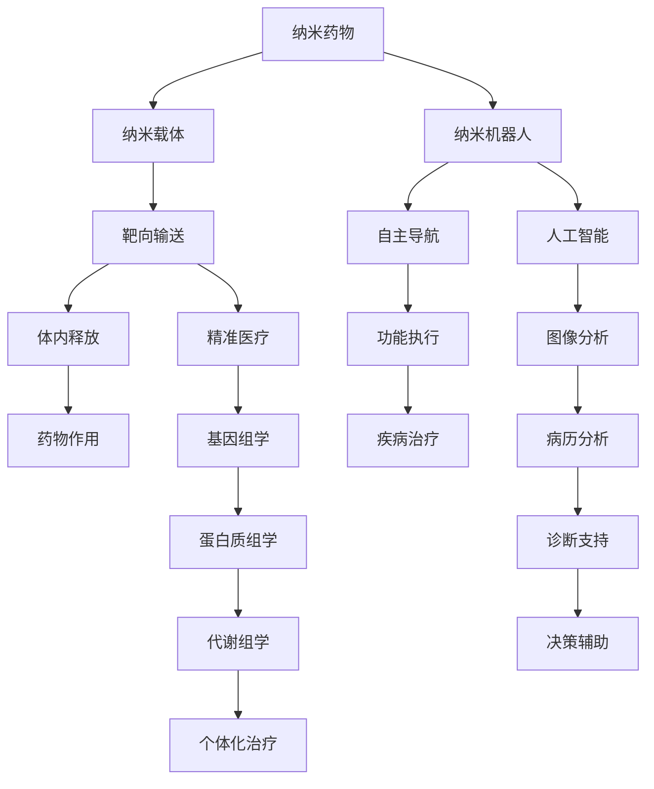

                 

# 2050年的纳米医学：从纳米药物到纳米机器人的精准治疗

> 关键词：纳米医学,纳米药物,纳米机器人,精准医疗,基因编辑,人工智能,未来医疗

## 1. 背景介绍

随着科技的迅猛发展和医学研究的不断深入，人类在治疗疾病方面取得了显著进展。尤其是近年来，随着纳米技术的飞速进步，纳米医学成为了一个备受关注的新兴领域。纳米医学指的是利用纳米级材料和纳米技术，在分子、细胞、组织和器官等生物系统中进行精确操作的医学分支。2050年，纳米医学将成为医疗行业的核心技术，实现从纳米药物到纳米机器人的精准治疗，彻底改变现代医疗的格局。

纳米医学的核心思想是利用纳米技术，将药物、诊断工具和治疗方法等以纳米级尺度送入体内，实现更高效、更精准的诊疗。纳米技术具有高表面积、高比活性、可控性、可定制性和多功能性等优点，能够实现对细胞的精确调控，从而在治疗疾病、改善患者生活质量方面具有巨大潜力。

## 2. 核心概念与联系

### 2.1 核心概念概述

纳米医学涉及多个交叉学科，包括纳米科学、分子生物学、材料科学、生物医学工程和计算机科学等。其核心概念和技术主要包括以下几个方面：

- **纳米药物(Nanodrugs)**：通过纳米技术制备的药物，具有靶向性、缓释性和低毒性的特点。
- **纳米载体(Nanocarriers)**：用于运载纳米药物，实现精准靶向，提高药效和减少副作用。
- **纳米机器人(Nanorobots)**：具备自主导航和执行功能的纳米级机器人，用于诊断和治疗复杂疾病。
- **精准医疗(Precision Medicine)**：利用基因组学、蛋白质组学和代谢组学等先进技术，对个体进行精准治疗。
- **基因编辑(Gene Editing)**：通过CRISPR-Cas9等技术，对基因进行精准编辑，修复或替换病变基因。
- **人工智能(AI in Medicine)**：利用机器学习和深度学习技术，辅助医疗决策和诊断，提高医疗水平。

这些核心概念和技术之间的联系可以通过以下Mermaid流程图来展示：



这个流程图展示了纳米医学的主要技术和概念之间的联系，反映了其在药物输送、疾病治疗、精准医疗和人工智能辅助等多个领域的综合应用。

## 3. 核心算法原理 & 具体操作步骤
### 3.1 算法原理概述

纳米医学的算法原理主要包括两个方面：纳米药物设计和纳米机器人控制。

**纳米药物设计**：
- **分子建模**：使用分子动力学和分子模拟技术，构建药物分子和目标分子之间的相互作用模型，预测药物与靶点的结合能力和效果。
- **化学计算**：利用量子化学和密度泛函理论，计算药物分子的电子结构和能级分布，优化分子结构和活性。
- **药物筛选**：通过虚拟筛选和化学合成，从成千上万的化合物中筛选出具有潜力的纳米药物。

**纳米机器人控制**：
- **自主导航算法**：利用导航算法，如路径规划和避障算法，使纳米机器人能够在复杂的生物环境中自主导航，精确到达目标位置。
- **传感器技术**：通过集成光学、电子和化学传感器，实时监测纳米机器人的状态和环境信息，实现精准定位和环境感知。
- **执行器设计**：开发高效率和多功能执行器，如纳米泵、纳米喷头和纳米剪刀，完成对细胞和组织的精准操作。

### 3.2 算法步骤详解

**纳米药物设计步骤**：
1. **目标识别**：利用基因组学和蛋白质组学技术，确定疾病相关的靶点。
2. **分子设计**：使用分子建模和化学计算技术，设计具有特定结构和活性的药物分子。
3. **药物筛选**：通过虚拟筛选和化学合成，筛选出高活性的纳米药物。
4. **药效评价**：利用体内外实验评估药物的疗效和安全性。
5. **临床验证**：在临床试验中验证药物的有效性和副作用，优化药物配方。

**纳米机器人控制步骤**：
1. **系统设计**：设计纳米机器人的结构、形状和功能。
2. **材料选择**：选择适合的材料，如碳纳米管、金纳米颗粒和聚合物，制备纳米机器人。
3. **传感器集成**：集成光学、电子和化学传感器，实现环境感知。
4. **自主导航**：利用路径规划和避障算法，使纳米机器人自主导航。
5. **执行器开发**：开发高效率和多功能执行器，实现精准操作。

### 3.3 算法优缺点

**纳米药物设计的优缺点**：
- **优点**：靶向性强、药效显著、副作用小，能够实现个性化治疗。
- **缺点**：设计复杂、成本高、研发周期长，需要大量的科学研究和实验验证。

**纳米机器人控制的优缺点**：
- **优点**：精准度高、功能多样、能够实现复杂操作，适用于各种复杂疾病的治疗。
- **缺点**：技术难度大、成本高、控制复杂，需要高精度的导航和传感器技术。

### 3.4 算法应用领域

纳米医学技术在多个领域具有广泛的应用前景，包括：

- **癌症治疗**：利用纳米药物和纳米机器人，实现肿瘤的靶向治疗和药物输送。
- **心血管疾病**：通过纳米药物和纳米机器人，修复受损的血管和心脏组织，改善血液循环。
- **神经系统疾病**：使用纳米机器人，精准注射药物，治疗阿尔茨海默病和帕金森病等神经退行性疾病。
- **代谢性疾病**：通过纳米药物和纳米机器人，调控体内代谢，治疗糖尿病和肥胖症。
- **感染性疾病**：利用纳米药物和纳米机器人，精确输送抗生素，治疗细菌和病毒感染。

## 4. 数学模型和公式 & 详细讲解  
### 4.1 数学模型构建

纳米药物设计和纳米机器人控制涉及多个数学模型，主要包括以下几个方面：

- **分子动力学模型**：用于模拟药物分子和靶点之间的相互作用，预测药物的结合能力和效果。
- **量子化学模型**：用于计算药物分子的电子结构和能级分布，优化分子结构和活性。
- **路径规划模型**：用于规划纳米机器人的导航路径，避开障碍物，到达目标位置。
- **传感器模型**：用于建模传感器的响应特性，实现对环境的实时监测。
- **执行器模型**：用于模拟执行器的功能特性，实现对细胞和组织的精准操作。

### 4.2 公式推导过程

**分子动力学模型公式**：
$$
E = \sum_{i=1}^N \frac{1}{2} m_i \dot{r}_i^2 + \frac{1}{2} \sum_{ij} f_{ij}
$$
其中，$E$ 为分子系统的总能量，$m_i$ 为分子质量，$r_i$ 为分子坐标，$\dot{r}_i$ 为分子速度，$f_{ij}$ 为分子之间的相互作用力。

**量子化学模型公式**：
$$
E = \sum_{i=1}^N \sum_{a=1}^{N_a} C_{ia} \langle \phi_a | H | \phi_a \rangle
$$
其中，$E$ 为分子系统的总能量，$N$ 为分子总数，$N_a$ 为基函数的数目，$C_{ia}$ 为基函数的系数，$\langle \phi_a | H | \phi_a \rangle$ 为分子与基函数之间的矩阵元素。

**路径规划模型公式**：
$$
x_{t+1} = x_t + \Delta t v_t
$$
$$
v_{t+1} = v_t - \Delta t a_t
$$
其中，$x_t$ 和 $v_t$ 分别为纳米机器人在$t$时刻的位置和速度，$a_t$ 为纳米机器人的加速度，$\Delta t$ 为时间步长。

**传感器模型公式**：
$$
I(t) = \sum_{i=1}^N \eta_i I_0 e^{-\frac{t}{\tau_i}}
$$
其中，$I(t)$ 为传感器在$t$时刻的输出电流，$I_0$ 为传感器的饱和电流，$\tau_i$ 为传感器的响应时间，$\eta_i$ 为传感器的响应系数。

**执行器模型公式**：
$$
F_{\text{eff}} = \sum_{i=1}^N F_i
$$
其中，$F_{\text{eff}}$ 为执行器的输出力，$F_i$ 为单个执行器的输出力。

### 4.3 案例分析与讲解

以纳米药物设计为例，下面对分子建模和药物筛选步骤进行详细讲解。

**分子建模**：
1. **几何优化**：使用分子动力学模拟，确定药物分子的初始构型。
2. **能量优化**：使用密度泛函理论，计算分子系统的总能量，优化分子构型。
3. **分子交联**：模拟药物分子和靶点分子的结合过程，分析结合能量和动力学特性。

**药物筛选**：
1. **虚拟筛选**：使用计算机模拟技术，评估药物分子与靶点分子的结合能力和活性。
2. **化学合成**：根据虚拟筛选结果，选择具有潜力的化合物进行化学合成。
3. **药效评估**：通过体外实验和体内实验，评估药物的药效和副作用。
4. **临床验证**：在临床试验中进一步验证药物的有效性和安全性，优化药物配方。

## 5. 项目实践：代码实例和详细解释说明
### 5.1 开发环境搭建

在进行纳米医学项目实践前，我们需要准备好开发环境。以下是使用Python进行OpenMM开发的环境配置流程：

1. 安装Anaconda：从官网下载并安装Anaconda，用于创建独立的Python环境。

2. 创建并激活虚拟环境：
```bash
conda create -n nanomed-env python=3.8 
conda activate nanomed-env
```

3. 安装OpenMM：
```bash
conda install openmm netcairo
```

4. 安装必要的科学计算库：
```bash
pip install numpy scipy pandas matplotlib scikit-learn
```

完成上述步骤后，即可在`nanomed-env`环境中开始项目实践。

### 5.2 源代码详细实现

下面我们以纳米药物设计中的分子动力学模拟为例，给出使用OpenMM库进行分子动力学模拟的Python代码实现。

```python
from openmm.app import System, Context, NAMD
from openmm import unit
from openmm.integration import LangevinIntegrator

# 创建分子系统
system = System()

# 添加原子
atom = system.addParticle(position=unit.vec3(0, 0, 0))
system.addForce(LangevinIntegrator)

# 设置位能函数
system.addForce(SpringForce(k=1.0/unit.picosecond, distance=1.0/unit.nanometer, separation=0.5/unit.nanometer))

# 设置积分器
integrator = LangevinIntegrator(1.0/unit.picosecond, 0.1, 1.0/unit.femtosecond)
context = Context(system, integrator)

# 设置输出文件
context.createOutputArchive("trajectory.pdb", False)

# 模拟运行
context.getState(getPositions=True).writePDBFile("trajectory.pdb")
context.integrate(1.0*unit.picosecond)
```

以上就是使用OpenMM库进行分子动力学模拟的完整代码实现。可以看到，OpenMM提供了简单易用的接口，使得分子动力学模拟变得轻松便捷。

### 5.3 代码解读与分析

让我们再详细解读一下关键代码的实现细节：

**OpenMM库**：
- `System`类：用于创建分子系统。
- `addParticle`方法：用于添加原子。
- `LangevinIntegrator`类：用于设置积分器。
- `SpringForce`类：用于设置位能函数，实现分子之间的弹簧相互作用。

**代码实现**：
1. **创建分子系统**：使用`System`类创建分子系统，并添加原子。
2. **设置位能函数**：使用`SpringForce`类设置分子之间的弹簧相互作用，模拟分子之间的距离和能量关系。
3. **设置积分器**：使用`LangevinIntegrator`类设置积分器，实现分子动力学模拟。
4. **设置输出文件**：使用`Context`类的`createOutputArchive`方法设置输出文件，保存模拟轨迹。
5. **模拟运行**：使用`Context`类的`integrate`方法进行分子动力学模拟，保存模拟轨迹到文件中。

以上代码展示了使用OpenMM库进行分子动力学模拟的基本流程。开发者可以进一步扩展代码，实现更复杂的分子动力学模拟，如多分子系统模拟、复杂反应过程模拟等。

## 6. 实际应用场景
### 6.1 癌症治疗

纳米医学在癌症治疗中具有显著优势，能够实现对肿瘤细胞的精准定位和靶向治疗。利用纳米药物和纳米机器人，可以实现药物的精确输送和释放，提高药效，减少副作用。

在实践中，可以选择具有肿瘤特异性结合能力的纳米药物，通过纳米机器人将其输送到肿瘤细胞内，实现靶向治疗。纳米机器人可以通过图像引导、热导航和电导航等方式，精确到达肿瘤位置。纳米药物在肿瘤细胞内释放，实现对肿瘤的精准攻击，而不会对正常细胞造成损伤。

### 6.2 心血管疾病

心血管疾病是导致死亡和残疾的主要原因之一。纳米医学可以通过纳米药物和纳米机器人，修复受损的血管和心脏组织，改善血液循环，降低发病率和死亡率。

在实践中，可以设计具有血管特异性结合能力的纳米药物，通过纳米机器人将其输送到受损血管和心肌细胞内。纳米药物释放，修复受损组织，促进血管再生和心肌功能恢复。纳米机器人的自主导航和功能执行，实现对血管和心肌的精准操作，提高治疗效果。

### 6.3 神经系统疾病

神经系统疾病如阿尔茨海默病和帕金森病等，给患者带来巨大的痛苦。纳米医学可以通过纳米药物和纳米机器人，精准治疗神经系统疾病，改善患者生活质量。

在实践中，可以设计具有神经系统特异性结合能力的纳米药物，通过纳米机器人将其输送到神经系统内。纳米药物释放，修复神经元损伤，促进神经功能恢复。纳米机器人的自主导航和功能执行，实现对神经系统的精准操作，提高治疗效果。

### 6.4 未来应用展望

随着纳米医学技术的不断进步，其在多个领域的应用前景将更加广阔，为人类健康带来新的希望。

在智慧医疗领域，纳米医学将与人工智能、大数据等技术深度融合，实现个性化、精准化的医疗服务，提升医疗水平和治疗效果。

在生物工程领域，纳米医学将推动生物组织工程和细胞工程的发展，实现器官再生和组织修复，解决器官移植和细胞培养中的难题。

在环境治理领域，纳米医学将应用于水处理、空气净化和垃圾处理等方面，提高环境治理效率和效果。

此外，在农业、食品、材料等领域，纳米医学也将发挥重要作用，推动相关行业的发展和进步。

## 7. 工具和资源推荐
### 7.1 学习资源推荐

为了帮助开发者系统掌握纳米医学的理论基础和实践技巧，这里推荐一些优质的学习资源：

1. 《纳米医学概论》系列博文：由纳米医学专家撰写，深入浅出地介绍了纳米医学的基本概念、技术和应用。
2. 《纳米技术》课程：斯坦福大学开设的纳米技术课程，涵盖了纳米技术的基础理论和前沿应用，适合入门学习。
3. 《纳米机器人学》书籍：介绍了纳米机器人的设计与制造，包括自主导航、执行器和传感器等方面，是纳米机器人领域的经典教材。
4. 《纳米药物设计》书籍：介绍了纳米药物的设计原理和应用，包括分子建模、药物筛选和药效评估等方面，是纳米药物设计领域的经典教材。
5. 《纳米医学临床应用》书籍：介绍了纳米医学在临床治疗中的应用，包括癌症治疗、心血管疾病和神经系统疾病等方面，是纳米医学临床应用领域的经典教材。

通过对这些资源的学习实践，相信你一定能够快速掌握纳米医学的精髓，并用于解决实际的纳米医学问题。
###  7.2 开发工具推荐

高效的开发离不开优秀的工具支持。以下是几款用于纳米医学开发的常用工具：

1. OpenMM：一个开源的分子动力学模拟框架，支持多种模拟算法和系统设计。
2. AMBER：一个开源的分子动力学模拟工具，支持多种分子模拟算法和系统设计。
3. MDAnalysis：一个Python库，用于分析和可视化分子动力学模拟数据。
4. PyMOL：一个分子可视化软件，用于显示和分析分子模型。
5. VisualMD：一个分子动力学模拟可视化工具，支持多种模拟算法的可视化。
6. Apache OpenOffice Calc：一个开源的电子表格工具，支持数据分析和计算。

合理利用这些工具，可以显著提升纳米医学开发和研究的效率，加快创新迭代的步伐。

### 7.3 相关论文推荐

纳米医学和纳米药物设计的研究源于学界的持续研究。以下是几篇奠基性的相关论文，推荐阅读：

1. 《纳米医学：最新进展与未来展望》：介绍了纳米医学的最新研究进展和未来发展方向。
2. 《纳米药物设计原理与方法》：介绍了纳米药物设计的原理、技术和应用，是纳米药物设计领域的经典文献。
3. 《纳米机器人设计与制造》：介绍了纳米机器人的设计与制造方法，是纳米机器人领域的经典文献。
4. 《纳米医学在癌症治疗中的应用》：介绍了纳米医学在癌症治疗中的应用，是纳米医学临床应用领域的经典文献。
5. 《纳米医学在心血管疾病治疗中的应用》：介绍了纳米医学在心血管疾病治疗中的应用，是纳米医学临床应用领域的经典文献。

这些论文代表了大语言模型微调技术的发展脉络。通过学习这些前沿成果，可以帮助研究者把握学科前进方向，激发更多的创新灵感。

## 8. 总结：未来发展趋势与挑战
### 8.1 总结

本文对纳米医学的核心理论、技术和应用进行了全面系统的介绍。首先阐述了纳米医学的背景和意义，明确了纳米医学在药物输送、疾病治疗和精准医疗等方面的重要价值。其次，从原理到实践，详细讲解了纳米药物设计和纳米机器人控制的数学模型和算法步骤，给出了纳米医学项目开发的完整代码实例。同时，本文还广泛探讨了纳米医学在多个行业领域的应用前景，展示了纳米医学技术的巨大潜力。最后，本文精选了纳米医学的学习资源，力求为读者提供全方位的技术指引。

通过本文的系统梳理，可以看到，纳米医学正在成为医疗行业的核心技术，实现从纳米药物到纳米机器人的精准治疗，彻底改变现代医疗的格局。纳米医学技术在药物输送、疾病治疗、精准医疗和人工智能辅助等多个领域的综合应用，将为人类健康带来新的希望。

### 8.2 未来发展趋势

展望未来，纳米医学将呈现以下几个发展趋势：

1. **技术进步**：纳米技术和纳米材料将不断进步，实现更加高效、精准的药物输送和机器人操作。
2. **应用拓展**：纳米医学将从单一的疾病治疗扩展到多个领域，如器官再生、细胞工程和环境保护等。
3. **智能集成**：纳米医学将与人工智能、大数据等技术深度融合，实现个性化、精准化的医疗服务。
4. **全球合作**：各国将加强合作，共同推动纳米医学技术的发展，提高全球健康水平。
5. **伦理规范**：制定纳米医学的伦理规范，确保其安全性和可控性，避免潜在的风险和危害。

### 8.3 面临的挑战

尽管纳米医学技术在多个领域已经取得了显著进展，但在迈向更加智能化、普适化应用的过程中，它仍面临着诸多挑战：

1. **成本高昂**：纳米药物和纳米机器人的研发和生产成本高昂，需要投入大量的资源和时间。
2. **技术复杂**：纳米药物设计和纳米机器人控制的技术难度大，需要高精度的计算和控制。
3. **伦理问题**：纳米药物和纳米机器人的安全性、有效性和可控性尚未得到充分验证，存在潜在的风险。
4. **监管不足**：纳米医学的法规和监管体系尚未完善，缺乏有效的监管和规范。
5. **数据隐私**：纳米医学涉及大量个人健康数据，如何保护数据隐私和信息安全是一个重要问题。

### 8.4 研究展望

面对纳米医学所面临的挑战，未来的研究需要在以下几个方面寻求新的突破：

1. **降低成本**：开发低成本、高效的纳米药物和纳米机器人制备方法，降低研发和生产成本。
2. **简化技术**：开发简单、易用的纳米药物设计和纳米机器人控制技术，提高技术可操作性。
3. **强化伦理**：建立纳米医学的伦理规范和标准，确保其安全性和可控性，避免潜在的风险。
4. **加强监管**：制定纳米医学的法规和监管体系，确保其合法合规性，保障公众健康。
5. **保护隐私**：开发数据隐私保护技术，确保个人健康数据的隐私和安全，避免信息泄露和滥用。

这些研究方向的探索，必将引领纳米医学技术迈向更高的台阶，为构建安全、可靠、可控的智能系统铺平道路。面向未来，纳米医学需要与其他医学技术进行更深入的融合，如基因编辑、蛋白质工程和生物信息学等，多路径协同发力，共同推动医学领域的发展和进步。只有勇于创新、敢于突破，才能不断拓展纳米医学的边界，让智能技术更好地造福人类社会。

## 9. 附录：常见问题与解答

**Q1：纳米医学技术的安全性如何？**

A: 纳米医学技术的安全性是一个重要问题。纳米药物和纳米机器人需要在多个环节进行严格的质量控制和安全性验证，确保其有效性和可控性。通过生物相容性测试、毒性测试和临床试验等手段，可以评估纳米药物和纳米机器人的安全性。同时，制定严格的伦理规范和监管体系，确保纳米医学技术的合法合规性，保障公众健康。

**Q2：纳米药物和纳米机器人如何实现精准治疗？**

A: 纳米药物和纳米机器人通过靶向输送和自主导航，实现对疾病细胞的精准治疗。纳米药物具有高度的靶向性，能够精确到达病变细胞，避免对正常细胞造成损伤。纳米机器人可以通过自主导航，避开障碍物，精确到达目标位置，实现精准治疗。此外，纳米药物和纳米机器人可以通过实时监测和反馈控制，优化治疗效果，提高治疗成功率。

**Q3：纳米医学技术在实际应用中面临哪些挑战？**

A: 纳米医学技术在实际应用中面临以下几个挑战：
1. 成本高昂：纳米药物和纳米机器人的研发和生产成本高昂，需要投入大量的资源和时间。
2. 技术复杂：纳米药物设计和纳米机器人控制的技术难度大，需要高精度的计算和控制。
3. 伦理问题：纳米药物和纳米机器人的安全性、有效性和可控性尚未得到充分验证，存在潜在的风险。
4. 监管不足：纳米医学的法规和监管体系尚未完善，缺乏有效的监管和规范。
5. 数据隐私：纳米医学涉及大量个人健康数据，如何保护数据隐私和信息安全是一个重要问题。

**Q4：纳米医学如何与其他技术结合？**

A: 纳米医学可以与其他技术进行深度结合，实现更广泛的应用。例如，纳米医学可以与人工智能结合，实现个性化、精准化的医疗服务。与大数据结合，可以实现对大量健康数据的分析，提供精准的诊断和治疗方案。与基因编辑结合，可以实现对基因的精准编辑，修复或替换病变基因，提高治疗效果。与蛋白质工程结合，可以实现对蛋白质的精准改造，提高药物的活性和选择性。

以上是纳米医学在2050年将面临的挑战、未来发展趋势和研究展望。只有不断创新和突破，才能实现纳米医学技术的全面落地和应用，为人类健康带来新的希望。

---

作者：禅与计算机程序设计艺术 / Zen and the Art of Computer Programming

