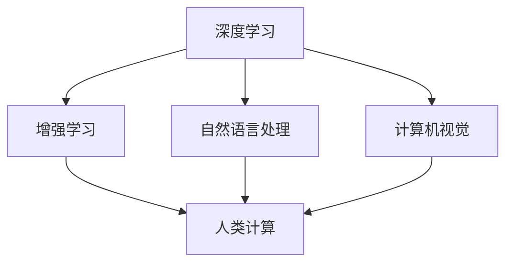

                 

# 应对人类共同挑战：人类计算的使命担当

在科技迅猛发展的今天，人工智能（AI）已经成为推动社会进步的重要力量。作为其中的佼佼者，人类计算（Human Computing）技术不仅在科研和学术界引发了广泛的讨论，也逐渐成为解决人类共同挑战的强有力工具。本文将从背景介绍、核心概念与联系、核心算法原理与操作步骤、数学模型与公式推导、项目实践、实际应用场景、工具和资源推荐、总结与未来发展趋势及挑战等多个角度，全面剖析人类计算技术的使命担当。

## 1. 背景介绍

### 1.1 问题由来

在科技日益成为人类社会发展关键因素的当下，人类计算的概念日益兴起。人类计算指的是通过引入具有类人智能的计算模型，如深度学习、增强学习等，来提升计算系统的智能化和自动化水平。相较于传统的算法优化，人类计算具有更加强大的决策能力和环境适应能力。

人类计算技术的崛起源于人工智能的不断进步，特别是深度学习算法的成熟应用。近年来，无论是自然语言处理（NLP）、计算机视觉（CV）还是强化学习（RL）等领域，深度学习模型凭借其卓越的性能和广泛的应用前景，已经逐渐成为人类计算技术的重要工具。

### 1.2 问题核心关键点

人类计算技术的应用主要集中在以下几个关键领域：

- **自然语言处理**：通过深度学习模型处理和理解人类语言，包括语言翻译、情感分析、智能客服、机器翻译等。
- **计算机视觉**：利用深度学习模型进行图像识别、物体检测、图像生成等任务。
- **增强学习**：通过深度学习模型驱动的强化学习算法，优化复杂系统的决策，如自动驾驶、机器人控制等。
- **数据分析与科学计算**：使用深度学习模型处理大数据，进行复杂的数据挖掘、科学模拟等任务。

这些技术的应用不仅显著提升了计算效率，也在解决人类共同挑战方面起到了关键作用。例如，AI驱动的智能客服系统能够在24小时内无间断服务，显著降低了企业成本并提高了客户满意度；计算机视觉技术在医疗影像识别和分析中的应用，则极大提高了疾病诊断的准确性和效率；增强学习技术在自动驾驶和机器人领域的应用，则有望彻底改变交通和工业生产模式。

## 2. 核心概念与联系

### 2.1 核心概念概述

为更好地理解人类计算技术的使命担当，本节将介绍几个关键概念：

- **深度学习**：一种模拟人脑神经网络的机器学习技术，能够自动从大量数据中学习特征，进行分类、回归等任务。
- **增强学习**：通过与环境交互，逐步优化策略，以最大化某个指标的算法。
- **自然语言处理**：使用计算机处理和理解人类语言的技术，包括文本分类、信息抽取、情感分析等。
- **计算机视觉**：利用计算机视觉模型对图像、视频等视觉数据进行分析和处理的技术。
- **人类计算**：将人类智能与计算机计算相结合，通过引入类人智能的计算模型，提升计算系统的智能化和自动化水平。

这些概念之间的逻辑关系可以通过以下Mermaid流程图来展示：



这个流程图展示了人类计算技术的核心概念及其之间的关系：

1. 深度学习和增强学习是构成人类计算技术的基础。
2. 自然语言处理和计算机视觉是人类计算技术的重要应用领域。
3. 人类计算技术通过结合这些智能算法，提升计算系统的智能化和自动化水平。

## 3. 核心算法原理 & 具体操作步骤

### 3.1 算法原理概述

人类计算技术的核心算法原理基于深度学习和增强学习。通过构建复杂模型，这些算法能够从大量数据中学习到高层次的抽象特征，并在实际应用中表现出色。

以深度学习为例，其主要原理是通过多层神经网络对数据进行非线性映射，学习数据的高层次特征。通过反向传播算法，模型能够不断优化权重，从而提升预测精度。

增强学习则是通过与环境的交互，逐步优化策略，最大化某个指标。其中，Q-learning和策略梯度方法是最常见的两种算法。

### 3.2 算法步骤详解

#### 3.2.1 深度学习算法步骤

1. **数据预处理**：收集和清洗数据，转换为模型所需格式。
2. **模型设计**：选择适当的深度学习模型结构，如卷积神经网络（CNN）、循环神经网络（RNN）、长短期记忆网络（LSTM）等。
3. **模型训练**：使用反向传播算法更新模型权重，最小化预测误差。
4. **模型评估**：使用测试集评估模型性能，如准确率、召回率等。

#### 3.2.2 增强学习算法步骤

1. **环境定义**：定义与人类计算任务相关的环境，包括状态空间、动作空间、奖励函数等。
2. **策略选择**：初始化策略，如随机策略、Q-learning策略等。
3. **模型训练**：使用增强学习算法优化策略，如Q-learning的Q值更新、策略梯度的策略更新等。
4. **模型评估**：在实际环境中测试模型，评估其性能。

### 3.3 算法优缺点

人类计算技术在处理复杂问题方面具有显著优势，但也存在以下局限性：

**优点**：

- **高效率**：通过深度学习和增强学习算法，人类计算技术能够高效地处理和分析大量数据。
- **高精度**：深度学习和增强学习算法在处理复杂任务时，通常能够取得较高的精度和准确度。
- **自适应能力**：这些算法能够自动适应环境变化，进行动态优化。

**缺点**：

- **数据依赖**：深度学习和增强学习算法的效果高度依赖于训练数据的数量和质量，数据不足时可能难以取得理想效果。
- **模型复杂性**：深度学习模型结构复杂，训练和推理所需资源较多。
- **可解释性不足**：深度学习和增强学习算法通常是"黑盒"模型，难以解释其内部工作机制。

### 3.4 算法应用领域

人类计算技术已经在多个领域得到了广泛应用，包括但不限于：

- **医疗**：利用深度学习和增强学习算法进行疾病预测、影像分析、个性化治疗等。
- **金融**：通过深度学习和增强学习算法进行股票预测、风险评估、量化交易等。
- **交通**：利用计算机视觉和增强学习算法进行交通流量分析、自动驾驶、智能交通管理等。
- **智能制造**：通过深度学习和增强学习算法进行预测性维护、质量控制、供应链优化等。
- **环境保护**：使用深度学习和增强学习算法进行环境监测、气候预测、灾害预警等。

## 4. 数学模型和公式 & 详细讲解 & 举例说明

### 4.1 数学模型构建

以深度学习中的卷积神经网络（CNN）为例，其数学模型可以表示为：

$$
y = \sigma(Wx + b)
$$

其中，$y$ 为输出，$x$ 为输入，$W$ 和 $b$ 为模型的权重和偏置，$\sigma$ 为激活函数，如ReLU、Sigmoid等。

### 4.2 公式推导过程

以CNN中常见的卷积层为例，其数学模型可以进一步展开为：

$$
y_{i,j,k} = \sigma \left( \sum_{m,n,p} W_{i,j,k;m,n,p} x_{m,n,p} + b_{i,j,k} \right)
$$

其中，$W_{i,j,k;m,n,p}$ 为卷积核权重，$x_{m,n,p}$ 为输入特征图，$b_{i,j,k}$ 为偏置。

### 4.3 案例分析与讲解

以图像分类任务为例，通过卷积神经网络，模型可以自动提取图像的特征并进行分类。具体步骤如下：

1. **数据预处理**：将图像数据转换为模型所需的格式，如将图像转换为张量。
2. **模型设计**：设计卷积神经网络的结构，包括卷积层、池化层、全连接层等。
3. **模型训练**：使用反向传播算法更新模型权重，最小化分类误差。
4. **模型评估**：使用测试集评估模型性能，如准确率、召回率等。

## 5. 项目实践：代码实例和详细解释说明

### 5.1 开发环境搭建

在进行人类计算技术实践前，我们需要准备好开发环境。以下是使用Python进行TensorFlow开发的环境配置流程：

1. 安装Anaconda：从官网下载并安装Anaconda，用于创建独立的Python环境。

2. 创建并激活虚拟环境：
```bash
conda create -n tf-env python=3.7 
conda activate tf-env
```

3. 安装TensorFlow：根据CUDA版本，从官网获取对应的安装命令。例如：
```bash
conda install tensorflow -c tf
```

4. 安装各类工具包：
```bash
pip install numpy pandas scikit-learn matplotlib tqdm jupyter notebook ipython
```

完成上述步骤后，即可在`tf-env`环境中开始人类计算技术的开发实践。

### 5.2 源代码详细实现

下面我们以图像分类任务为例，给出使用TensorFlow进行卷积神经网络模型训练的代码实现。

```python
import tensorflow as tf
from tensorflow.keras import layers

# 定义CNN模型
model = tf.keras.Sequential([
    layers.Conv2D(32, (3, 3), activation='relu', input_shape=(28, 28, 1)),
    layers.MaxPooling2D((2, 2)),
    layers.Conv2D(64, (3, 3), activation='relu'),
    layers.MaxPooling2D((2, 2)),
    layers.Flatten(),
    layers.Dense(64, activation='relu'),
    layers.Dense(10, activation='softmax')
])

# 编译模型
model.compile(optimizer='adam', loss='sparse_categorical_crossentropy', metrics=['accuracy'])

# 加载数据集
(x_train, y_train), (x_test, y_test) = tf.keras.datasets.mnist.load_data()

# 数据预处理
x_train = x_train.reshape(-1, 28, 28, 1) / 255.0
x_test = x_test.reshape(-1, 28, 28, 1) / 255.0

# 模型训练
model.fit(x_train, y_train, epochs=10, validation_data=(x_test, y_test))

# 模型评估
model.evaluate(x_test, y_test)
```

以上代码实现了使用TensorFlow构建卷积神经网络模型，并在MNIST数据集上进行图像分类的训练和评估。可以看到，TensorFlow提供的高层API使得模型的构建和训练变得非常简单。

### 5.3 代码解读与分析

让我们再详细解读一下关键代码的实现细节：

- **定义CNN模型**：使用Sequential模型搭建了包含卷积层、池化层、全连接层的CNN结构。
- **编译模型**：选择合适的优化器和损失函数，并定义评估指标。
- **加载数据集**：使用MNIST数据集进行模型训练和评估。
- **数据预处理**：将数据转换为模型所需的格式，并进行归一化处理。
- **模型训练**：使用fit方法进行模型训练，并在验证集上评估模型性能。
- **模型评估**：使用evaluate方法评估模型在测试集上的表现。

可以看到，TensorFlow的高级API使得CNN模型的构建和训练变得非常便捷，开发者可以更多地关注模型结构和超参数调优等关键问题。

当然，工业级的系统实现还需考虑更多因素，如模型的保存和部署、超参数的自动搜索、更灵活的任务适配层等。但核心的模型构建和训练流程基本与此类似。

## 6. 实际应用场景

### 6.1 智能医疗

人类计算技术在医疗领域具有重要应用。例如，通过深度学习和增强学习算法，可以对医疗影像进行自动分析和诊断，提升医疗服务的智能化水平。

具体而言，可以将医学影像（如CT、MRI等）作为输入数据，使用卷积神经网络模型进行图像分类和分割，辅助医生进行疾病诊断和治疗。此外，增强学习算法还可以用于个性化治疗方案的优化，根据患者的病历和基因信息，生成最优的治疗策略。

### 6.2 金融风险管理

金融行业面临诸多风险，如市场波动、信用风险等。通过人类计算技术，可以对金融市场进行预测和分析，提升风险管理能力。

具体而言，可以使用深度学习算法对金融数据进行特征提取和建模，预测市场走势和风险水平。增强学习算法则可以在金融交易中，通过自动优化投资策略，降低风险和提升收益。

### 6.3 自动驾驶

自动驾驶技术是人工智能的重要应用领域之一。通过计算机视觉和增强学习算法，可以构建高效的自动驾驶系统，提升交通安全和运输效率。

具体而言，可以使用深度学习算法对摄像头和传感器数据进行图像识别和目标检测，识别出道路上的障碍物和行人，并生成相应的驾驶决策。增强学习算法则可以用于自动驾驶决策优化，根据实时路况和驾驶环境，动态调整驾驶策略。

### 6.4 智能制造

智能制造是工业4.0的重要组成部分。通过人类计算技术，可以实现生产线的自动化和智能化，提升生产效率和产品质量。

具体而言，可以使用深度学习算法对生产数据进行分析和预测，优化生产过程和设备维护。增强学习算法则可以用于动态调整生产计划和资源配置，确保生产系统的最优运行。

### 6.5 环境保护

环境保护是当今社会面临的重要问题之一。通过计算机视觉和增强学习算法，可以对环境数据进行分析和预测，提升环境保护的智能化水平。

具体而言，可以使用深度学习算法对环境监测数据进行分析和建模，预测环境变化趋势。增强学习算法则可以在环境保护中，通过动态优化资源配置，提升环境治理的效率和效果。

## 7. 工具和资源推荐

### 7.1 学习资源推荐

为了帮助开发者系统掌握人类计算技术的理论基础和实践技巧，这里推荐一些优质的学习资源：

1. **《深度学习》课程**：由斯坦福大学Andrew Ng教授主讲，深入浅出地介绍了深度学习的基本概念和算法，是深度学习入门的重要资源。
2. **《TensorFlow官方文档》**：TensorFlow的官方文档，提供了丰富的学习资源和示例代码，是TensorFlow开发的必备资料。
3. **《TensorFlow实战》书籍**：结合TensorFlow的最新功能，提供了大量的实战项目，帮助开发者提升实际开发能力。
4. **Kaggle平台**：全球最大的数据科学竞赛平台，提供了大量的数据集和竞赛项目，是提升实战经验的好去处。
5. **arXiv论文库**：收录了最新的人工智能研究成果，是跟踪前沿技术的最佳途径。

通过对这些资源的学习实践，相信你一定能够快速掌握人类计算技术的精髓，并用于解决实际的智能问题。

### 7.2 开发工具推荐

高效的开发离不开优秀的工具支持。以下是几款用于人类计算技术开发的工具：

1. **TensorFlow**：Google开发的开源深度学习框架，具有灵活的计算图和高效的分布式计算能力，适用于各类深度学习任务。
2. **PyTorch**：Facebook开发的深度学习框架，支持动态计算图和GPU加速，适用于科研和工业级应用。
3. **MXNet**：由亚马逊开发的深度学习框架，支持多种编程语言和分布式训练，适用于大模型和大规模数据集。
4. **Scikit-learn**：Python中的经典机器学习库，提供了丰富的算法和工具，适用于各种数据挖掘和预测任务。
5. **Jupyter Notebook**：基于Web的交互式编程环境，支持多种编程语言和数据格式，是数据科学开发的理想平台。

合理利用这些工具，可以显著提升人类计算技术的开发效率，加快创新迭代的步伐。

### 7.3 相关论文推荐

人类计算技术的发展离不开学术界的持续研究。以下是几篇奠基性的相关论文，推荐阅读：

1. **《卷积神经网络》（Convolutional Neural Networks）**：Yann LeCun等人的经典论文，奠定了卷积神经网络在计算机视觉和图像处理中的应用基础。
2. **《Q-learning：一种新型的强化学习方法》**：Deep Q-learning的奠基论文，展示了Q-learning算法在强化学习中的应用效果。
3. **《神经网络在自然语言处理中的应用》**：由Yoshua Bengio等人发表的综述性论文，介绍了深度学习在自然语言处理中的广泛应用。
4. **《深度学习在自动驾驶中的应用》**：Aurélien Géron等人的论文，介绍了深度学习在自动驾驶中的多项应用和挑战。
5. **《人类计算在环境保护中的应用》**：Lisa Gansler等人的论文，介绍了计算机视觉和增强学习在环境保护中的实际应用。

这些论文代表了大计算技术的发展脉络。通过学习这些前沿成果，可以帮助研究者把握学科前进方向，激发更多的创新灵感。

## 8. 总结：未来发展趋势与挑战

### 8.1 总结

本文对人类计算技术的使命担当进行了全面系统的介绍。首先阐述了人类计算技术的发展背景和重要性，明确了其在解决人类共同挑战方面的独特价值。其次，从原理到实践，详细讲解了深度学习和增强学习的算法原理和操作步骤，给出了人类计算技术开发的完整代码实例。同时，本文还广泛探讨了人类计算技术在医疗、金融、自动驾驶等多个领域的应用前景，展示了其广阔的潜力。最后，本文精选了人类计算技术的各类学习资源，力求为读者提供全方位的技术指引。

通过本文的系统梳理，可以看到，人类计算技术在解决人类共同挑战方面具有巨大潜力。这些技术的不断发展，必将在医疗、金融、环境保护等多个领域带来革命性影响，为人类社会的可持续发展提供强有力的技术支撑。

### 8.2 未来发展趋势

展望未来，人类计算技术的发展将呈现以下几个趋势：

1. **模型规模继续增大**：随着算力成本的下降和数据规模的扩张，深度学习模型将逐渐向更大规模发展，学习更加复杂的特征，提升处理复杂任务的能力。
2. **算法复杂度进一步提高**：深度学习和增强学习算法将不断改进和优化，引入更多创新技术，如深度强化学习、自监督学习等，提升模型的智能化和自动化水平。
3. **跨领域应用广泛推广**：人类计算技术将在更多领域得到应用，如智能家居、智慧城市、智能制造等，提升各行业的智能化水平。
4. **人机协同日益成熟**：人类计算技术将与人类智能更紧密结合，提升系统的协作和决策能力，构建更加智能的生态系统。
5. **多模态融合更加深入**：人类计算技术将逐步实现跨模态融合，融合视觉、语音、文本等多种模态数据，提升对复杂环境的多维度理解和建模能力。

这些趋势预示着人类计算技术将不断拓展其应用边界，成为解决人类共同挑战的重要工具。

### 8.3 面临的挑战

尽管人类计算技术已经取得了显著成果，但在迈向更加智能化、普适化应用的过程中，仍面临诸多挑战：

1. **数据获取和标注成本高**：深度学习模型需要大量标注数据进行训练，数据获取和标注成本高，限制了技术在更多领域的应用。
2. **模型泛化能力不足**：当前深度学习模型在处理未知数据时，泛化能力有限，难以应对实际应用中的复杂多变环境。
3. **模型可解释性不足**：深度学习模型通常是"黑盒"模型，难以解释其内部工作机制和决策逻辑，限制了其在医疗、金融等高风险领域的应用。
4. **计算资源需求大**：大规模深度学习模型的训练和推理需要大量的计算资源，硬件成本高，限制了技术的广泛应用。
5. **伦理和安全问题**：深度学习模型可能学习到有偏见、有害的信息，通过微调传递到下游任务，产生误导性、歧视性的输出，引发伦理和安全问题。

这些挑战需要学界和产业界共同努力，积极应对并寻求突破，才能让人类计算技术真正发挥其潜力。

### 8.4 研究展望

面对人类计算技术面临的诸多挑战，未来的研究需要在以下几个方面寻求新的突破：

1. **无监督和半监督学习技术**：探索不依赖标注数据的深度学习技术，利用自监督学习、主动学习等方法，最大限度利用非结构化数据，提升模型的泛化能力和鲁棒性。
2. **可解释性和透明性增强**：开发更加可解释的深度学习模型，引入更多的解释机制，提升模型在医疗、金融等高风险领域的应用能力。
3. **多模态数据融合**：探索跨模态数据融合技术，将视觉、语音、文本等多种模态数据结合起来，提升对复杂环境的多维度理解和建模能力。
4. **计算资源优化**：开发更加高效的深度学习算法和硬件设备，降低模型训练和推理的资源需求，提升技术在更多领域的应用能力。
5. **伦理和社会责任**：在深度学习模型的设计和应用过程中，加强伦理和社会责任的考虑，确保技术应用的安全性和公平性。

这些研究方向的探索，必将在未来引领人类计算技术的进一步发展，为构建更加智能、安全、可解释的系统提供坚实基础。

## 9. 附录：常见问题与解答

**Q1：深度学习和增强学习算法的原理是什么？**

A: 深度学习算法的原理是基于多层神经网络对数据进行非线性映射，学习数据的高层次特征。增强学习算法的原理是通过与环境的交互，逐步优化策略，最大化某个指标。其中，Q-learning和策略梯度方法是最常见的两种算法。

**Q2：人类计算技术的应用领域有哪些？**

A: 人类计算技术在医疗、金融、自动驾驶、智能制造、环境保护等多个领域具有重要应用。例如，在医疗领域，可以使用深度学习算法对医疗影像进行自动分析和诊断；在金融领域，可以使用深度学习算法进行市场预测和风险评估；在自动驾驶领域，可以使用计算机视觉和增强学习算法构建高效的自动驾驶系统；在智能制造领域，可以使用深度学习算法进行生产数据分析和设备维护；在环境保护领域，可以使用计算机视觉和增强学习算法对环境数据进行分析和预测。

**Q3：人类计算技术在实际应用中需要注意哪些问题？**

A: 人类计算技术在实际应用中需要注意以下问题：

1. **数据依赖**：深度学习和增强学习算法的效果高度依赖于训练数据的数量和质量，数据不足时可能难以取得理想效果。
2. **模型复杂性**：深度学习模型结构复杂，训练和推理所需资源较多。
3. **可解释性不足**：深度学习和增强学习算法通常是"黑盒"模型，难以解释其内部工作机制和决策逻辑。
4. **计算资源需求大**：大规模深度学习模型的训练和推理需要大量的计算资源，硬件成本高，限制了技术的广泛应用。
5. **伦理和安全问题**：深度学习模型可能学习到有偏见、有害的信息，通过微调传递到下游任务，产生误导性、歧视性的输出，引发伦理和安全问题。

**Q4：如何提高深度学习模型的泛化能力？**

A: 提高深度学习模型的泛化能力可以从以下几个方面入手：

1. **增加训练数据**：增加训练数据，避免模型过拟合。
2. **使用数据增强**：通过数据增强方法，如旋转、缩放等，扩充训练集，提高模型的泛化能力。
3. **正则化技术**：使用L2正则、Dropout等正则化技术，避免过拟合。
4. **模型集成**：通过集成多个模型，提升模型的泛化能力。
5. **迁移学习**：通过迁移学习，利用预训练模型的知识，提升模型的泛化能力。

**Q5：如何优化深度学习算法的计算效率？**

A: 优化深度学习算法的计算效率可以从以下几个方面入手：

1. **模型裁剪**：去除不必要的层和参数，减小模型尺寸，加快推理速度。
2. **量化加速**：将浮点模型转为定点模型，压缩存储空间，提高计算效率。
3. **分布式训练**：利用分布式训练技术，加速模型的训练过程。
4. **硬件优化**：选择高性能的GPU、TPU等硬件设备，提高模型的计算效率。
5. **算法优化**：改进深度学习算法，如使用更高效的激活函数、优化器等，提高计算效率。

这些措施可以帮助优化深度学习算法的计算效率，提升其在实际应用中的性能和可行性。

---

作者：禅与计算机程序设计艺术 / Zen and the Art of Computer Programming

