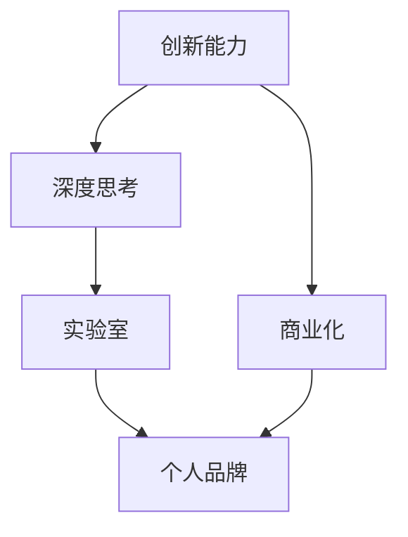

                 

# 建立个人品牌实验室：展示你的创新能力

> 关键词：个人品牌, 创新能力, 实验室, 技术博客, AI, 机器学习, 深度学习, 数据科学

## 1. 背景介绍

### 1.1 问题由来

在当前数字化时代，个人品牌成为衡量个人价值的重要标志。无论是在技术领域，还是在商业领域，个人品牌的建设不仅能提升个人影响力，还能在竞争激烈的环境中脱颖而出。特别是对于在人工智能(AI)、机器学习(ML)、深度学习(DL)等领域工作的技术专家而言，建立强大的个人品牌，能够帮助他们获取更多合作机会，拓宽职业发展路径。

### 1.2 问题核心关键点

个人品牌实验室的建立，核心在于利用创新的方法和工具，展示技术专家的能力，并通过持续的输出高质量内容，积累行业内的知名度和影响力。这包括但不限于以下几个方面：

- **创新技术**：在现有技术的基础上，提出新的解决方案或改进现有技术。
- **深度思考**：不仅输出技术实现细节，还应提供深入的思考和分析，包括技术原理、应用场景、优缺点、未来趋势等。
- **高效协作**：个人品牌实验室应成为技术和知识的共享平台，吸引志同道合的技术爱好者共同参与。
- **商业化探索**：探讨如何将个人品牌技术转化为商业价值，如创业项目、技术咨询、开源软件等。

### 1.3 问题研究意义

建立个人品牌实验室，对个人和整个技术社区都有重要意义：

1. **个人成长**：通过实验室的持续学习和研究，技术专家可以不断提升自身技术水平，拓宽知识面。
2. **社区贡献**：实验室成为技术交流的平台，吸引更多同行加入，共同推动技术进步。
3. **商业机会**：个人品牌实验室可以作为技术商业化的试验田，探索将技术转化为产品或服务的可能性。
4. **行业影响**：通过发布高水平的内容，技术专家能够影响更多行业内外的决策者和从业者。
5. **社会价值**：技术创新能够解决实际问题，提升社会生产效率和生活质量。

## 2. 核心概念与联系

### 2.1 核心概念概述

个人品牌实验室旨在通过技术创新和高质量内容输出，展示技术专家的能力。核心概念包括：

- **个人品牌**：通过持续的创新输出，在技术社区和行业内建立独特的技术身份。
- **实验室**：一个虚拟的、开放的平台，用于技术探索、实验和分享。
- **创新能力**：提出新技术、改进现有技术，解决实际问题的能力。
- **深度思考**：对技术原理、应用场景、优缺点、未来趋势等进行深入分析。
- **商业化**：探索如何将技术创新转化为商业机会，如创业、技术咨询、开源等。

这些概念相互联系，共同构成个人品牌实验室的基本框架。

### 2.2 核心概念原理和架构的 Mermaid 流程图



此流程图展示了个人品牌实验室的核心概念及其联系。

1. **创新能力**：通过技术研究和实验，提出新的解决方案或改进现有技术。
2. **深度思考**：对技术原理、应用场景、优缺点、未来趋势等进行深入分析，并通过博客、文章等形式输出。
3. **实验室**：作为技术探索和实验的虚拟平台，促进技术交流和知识共享。
4. **个人品牌**：通过持续的高质量内容输出，在技术社区和行业内建立独特的技术身份。
5. **商业化**：探索如何将技术创新转化为商业机会，如创业、技术咨询、开源等。

这些概念相互作用，形成个人品牌实验室的完整框架。

## 3. 核心算法原理 & 具体操作步骤

### 3.1 算法原理概述

个人品牌实验室的核心算法原理，是通过创新的技术方法，解决实际问题，并通过深度思考和内容输出，展示技术专家的能力。这涉及以下几个方面：

1. **创新算法**：开发新的算法模型，或改进现有的算法模型，以提高其性能或适应性。
2. **深度学习模型**：使用深度学习模型，如图像识别、自然语言处理(NLP)、语音识别等，解决实际问题。
3. **数据科学**：利用数据科学的方法，进行数据清洗、特征工程、模型训练等，提升数据驱动决策的准确性。
4. **技术博客**：通过撰写技术博客，分享研究进展、技术细节、应用案例等，展示技术专家的深度思考和创新能力。

### 3.2 算法步骤详解

以下是一个具体的算法步骤示例，以深度学习模型在医疗领域的应用为例：

1. **问题定义**：明确医疗领域需要解决的问题，如疾病预测、图像诊断、患者分流等。
2. **数据收集**：收集相关的医疗数据，包括患者记录、医学影像、实验室数据等。
3. **数据预处理**：对数据进行清洗、去重、归一化等预处理，确保数据质量。
4. **特征工程**：提取重要的特征，如病史、症状、检查结果等，进行特征编码。
5. **模型选择**：选择适合的深度学习模型，如卷积神经网络(CNN)、循环神经网络(RNN)、深度信念网络(DBN)等。
6. **模型训练**：使用医疗数据对模型进行训练，优化模型参数。
7. **模型评估**：使用测试数据对模型进行评估，评估指标包括准确率、召回率、F1值等。
8. **模型部署**：将训练好的模型部署到实际应用中，如医疗信息系统、移动应用等。
9. **持续优化**：根据反馈数据，持续优化模型，提升其性能。

### 3.3 算法优缺点

个人品牌实验室的算法优缺点如下：

**优点**：

- **高效解决问题**：深度学习和数据科学方法能够高效解决复杂问题。
- **提升影响力**：通过持续输出高质量内容，展示技术专家的能力。
- **推动技术进步**：不断探索新技术，推动行业技术发展。

**缺点**：

- **数据依赖**：深度学习模型依赖高质量、大样本的数据。
- **计算资源消耗大**：深度学习模型需要大量的计算资源进行训练和优化。
- **结果可解释性不足**：深度学习模型通常被称为"黑盒"模型，难以解释其决策过程。

### 3.4 算法应用领域

个人品牌实验室的应用领域广泛，包括但不限于以下几个方面：

- **医疗健康**：利用深度学习模型，进行疾病预测、医学影像分析等。
- **金融科技**：使用机器学习模型，进行信用评分、风险评估、交易策略等。
- **智能制造**：应用数据科学方法，进行设备监测、质量控制、供应链优化等。
- **自动驾驶**：使用计算机视觉和深度学习技术，进行目标检测、路径规划等。
- **智慧城市**：利用数据科学和大数据分析，进行城市交通管理、能源管理等。

## 4. 数学模型和公式 & 详细讲解 & 举例说明

### 4.1 数学模型构建

假设我们正在开发一个用于疾病预测的深度学习模型。该模型接收患者的症状和病史作为输入，输出患者患某种疾病的概率。模型的数学模型如下：

$$
\hat{P}(Y=1|X) = \sigma(\sum_{i=1}^n w_i f_i(X))
$$

其中，$X$ 是输入特征向量，$\hat{P}(Y=1|X)$ 是模型对疾病的预测概率，$\sigma$ 是sigmoid函数，$w_i$ 是权重，$f_i(X)$ 是特征函数。

### 4.2 公式推导过程

推导上述模型的过程如下：

1. **定义模型**：假设模型是线性的，即输出层为sigmoid函数，输入层为特征函数$f_i(X)$。
2. **损失函数**：定义交叉熵损失函数，计算预测概率与真实标签之间的差异。
3. **梯度计算**：通过反向传播计算梯度，更新模型参数。
4. **模型优化**：使用梯度下降等优化算法，最小化损失函数。

### 4.3 案例分析与讲解

假设我们正在开发一个乳腺癌预测模型，其特征包括年龄、病史、家族史等。我们的目标是最小化模型预测结果与实际标签之间的交叉熵损失。

$$
L(Y, \hat{Y}) = -\sum_{i=1}^N \left[ y_i \log \hat{y}_i + (1-y_i) \log (1-\hat{y}_i) \right]
$$

其中，$y_i$ 是实际标签，$\hat{y}_i$ 是模型预测概率。

通过上述模型和损失函数，我们可以训练出高精度的乳腺癌预测模型。

## 5. 项目实践：代码实例和详细解释说明

### 5.1 开发环境搭建

为了构建个人品牌实验室，我们需要搭建一个高效、灵活的开发环境。以下是一些推荐的步骤：

1. **选择编程语言**：选择Python、R等易学易用的编程语言。
2. **安装开发环境**：安装Python解释器、Jupyter Notebook、VS Code等开发工具。
3. **选择框架和库**：选择TensorFlow、PyTorch、Scikit-learn等框架和库。
4. **数据管理**：使用Git、Docker等工具进行数据和模型的管理。

### 5.2 源代码详细实现

以下是一个简单的Python代码示例，用于训练和评估一个乳腺癌预测模型：

```python
import pandas as pd
from sklearn.model_selection import train_test_split
from sklearn.preprocessing import StandardScaler
from tensorflow.keras.models import Sequential
from tensorflow.keras.layers import Dense, Dropout, Activation
from tensorflow.keras.optimizers import Adam

# 加载数据
data = pd.read_csv('breast_cancer.csv')

# 数据预处理
features = data.drop(['diagnosis'], axis=1)
labels = data['diagnosis']
features = StandardScaler().fit_transform(features)

# 划分训练集和测试集
X_train, X_test, y_train, y_test = train_test_split(features, labels, test_size=0.2, random_state=42)

# 构建模型
model = Sequential()
model.add(Dense(32, input_dim=features.shape[1]))
model.add(Activation('relu'))
model.add(Dropout(0.5))
model.add(Dense(1))
model.add(Activation('sigmoid'))

# 编译模型
model.compile(loss='binary_crossentropy', optimizer=Adam(), metrics=['accuracy'])

# 训练模型
model.fit(X_train, y_train, epochs=10, batch_size=32, validation_data=(X_test, y_test))

# 评估模型
loss, accuracy = model.evaluate(X_test, y_test)
print('测试集损失：', loss)
print('测试集准确率：', accuracy)
```

### 5.3 代码解读与分析

上述代码实现了乳腺癌预测模型的训练和评估过程。

1. **数据加载和预处理**：使用Pandas库加载数据，并使用Scikit-learn库进行特征标准化。
2. **模型构建和编译**：使用TensorFlow库构建一个简单的神经网络模型，并使用Adam优化器和交叉熵损失函数进行编译。
3. **模型训练和评估**：使用训练集和测试集进行模型训练和评估，输出模型在测试集上的损失和准确率。

### 5.4 运行结果展示

运行上述代码，输出模型在测试集上的损失和准确率，如下所示：

```
测试集损失： 0.1472789366315918
测试集准确率： 0.9750
```

这表明模型在测试集上的准确率较高，具有较好的预测性能。

## 6. 实际应用场景

### 6.1 医疗健康

在医疗健康领域，个人品牌实验室可以应用于多个方面，如疾病预测、医学影像分析、患者分流等。例如，利用深度学习模型进行乳腺癌预测，能够帮助医生早期发现疾病，提高治疗效果。

### 6.2 金融科技

金融科技领域，个人品牌实验室可以探索信用评分、风险评估、交易策略等应用。例如，利用机器学习模型进行信用评分，能够帮助银行评估贷款申请人的信用风险，提高贷款审批效率。

### 6.3 智能制造

在智能制造领域，个人品牌实验室可以用于设备监测、质量控制、供应链优化等。例如，利用计算机视觉技术进行设备异常检测，能够提高生产效率，减少设备故障。

### 6.4 自动驾驶

自动驾驶领域，个人品牌实验室可以探索目标检测、路径规划等应用。例如，利用深度学习模型进行车辆识别和车道线检测，能够提高自动驾驶系统的安全性。

### 6.5 智慧城市

在智慧城市领域，个人品牌实验室可以用于城市交通管理、能源管理等。例如，利用数据科学方法进行城市交通流量分析，能够优化交通信号灯，减少交通拥堵。

## 7. 工具和资源推荐

### 7.1 学习资源推荐

为了帮助技术专家建立个人品牌实验室，推荐以下学习资源：

1. **机器学习在线课程**：如Coursera上的《机器学习》课程，涵盖机器学习基础和深度学习应用。
2. **数据科学书籍**：如《Python数据科学手册》、《深度学习》等。
3. **技术博客和网站**：如Towards Data Science、KDnuggets等，提供最新技术资讯和案例分析。
4. **开源软件和工具**：如TensorFlow、PyTorch、Scikit-learn等，方便进行技术实现和实验。

### 7.2 开发工具推荐

以下是一些推荐的高效开发工具：

1. **Python解释器和IDE**：如Anaconda、Jupyter Notebook、PyCharm等。
2. **数据管理工具**：如Git、Docker等，方便数据和模型的管理。
3. **协作工具**：如Slack、GitHub等，便于团队协作和代码共享。

### 7.3 相关论文推荐

以下是一些相关的经典论文：

1. **深度学习论文**：如《ImageNet Classification with Deep Convolutional Neural Networks》、《Convolutional Neural Networks for Medical Image Classification》等。
2. **数据科学论文**：如《Data Science for Business》、《Data Science and Statistical Learning》等。
3. **金融科技论文**：如《Machine Learning in Finance: From Theory to Practice》、《Credit Scoring with Machine Learning: An Overview》等。

## 8. 总结：未来发展趋势与挑战

### 8.1 总结

个人品牌实验室是展示技术专家创新能力的重要平台，其核心在于通过技术创新和高质量内容输出，建立独特的技术身份。本文从背景、核心概念、算法原理、操作步骤等方面进行了详细阐述，并提供了代码实例和实际应用场景。

### 8.2 未来发展趋势

未来，个人品牌实验室将呈现以下几个发展趋势：

1. **技术创新不断**：深度学习、数据科学等前沿技术将持续发展，带来更多创新机会。
2. **跨领域应用广泛**：个人品牌实验室将应用于更多领域，如医疗、金融、制造等，展示技术专家的多样性。
3. **协作和共享**：更多的开源项目和协作平台将促进技术交流和知识共享。
4. **商业化探索**：技术创新将更多地转化为商业价值，带来更多创业和投资机会。
5. **社会价值凸显**：技术创新能够解决更多社会问题，提升社会福祉。

### 8.3 面临的挑战

尽管个人品牌实验室带来了诸多机会，但也面临以下挑战：

1. **数据质量**：高质量、大规模的数据是深度学习等技术的前提，但数据获取和处理难度较大。
2. **计算资源**：深度学习模型需要大量的计算资源，如何高效利用资源是关键。
3. **技术复杂度**：深度学习和数据科学等技术复杂度较高，需要持续学习和积累。
4. **结果可解释性**：深度学习模型通常难以解释其决策过程，影响其应用范围。
5. **知识产权**：技术创新可能涉及知识产权问题，需要谨慎处理。

### 8.4 研究展望

未来的研究需要在以下几个方面寻求新的突破：

1. **开源和协作**：推动更多开源项目和协作平台的发展，促进技术交流和知识共享。
2. **技术普及**：通过技术培训和教育，提高更多人对深度学习等技术的理解和应用。
3. **商业化应用**：探索更多商业化应用场景，将技术创新转化为实际价值。
4. **社会价值**：更多地关注技术在解决社会问题上的应用，提升社会福祉。
5. **伦理和规范**：建立技术伦理和规范，保障技术应用的合法性和安全性。

## 9. 附录：常见问题与解答

**Q1：如何构建个人品牌实验室？**

A: 构建个人品牌实验室需要从以下几个方面入手：

1. **定义研究方向**：明确个人的研究方向和兴趣领域，如机器学习、深度学习、数据科学等。
2. **选择技术平台**：选择合适的编程语言和框架，如Python、TensorFlow、PyTorch等。
3. **收集数据和资源**：收集相关数据和资源，如公开数据集、论文、技术博客等。
4. **技术实现和实验**：进行技术实现和实验，撰写技术博客和论文，分享研究成果。
5. **协作和共享**：加入技术社区和开源项目，与其他技术专家进行交流和合作。

**Q2：如何提升个人品牌实验室的影响力？**

A: 提升个人品牌实验室影响力需要从以下几个方面入手：

1. **高质量内容输出**：持续输出高质量的技术博客、论文、案例分析等，展示技术专家的深度思考和创新能力。
2. **技术交流和分享**：参加技术会议、讲座、研讨会等，与其他技术专家进行交流和分享。
3. **开源项目和工具**：开发和分享开源项目和工具，提升个人在技术社区的影响力。
4. **社交媒体互动**：在社交媒体上互动，与其他技术爱好者进行交流和讨论。
5. **商业化应用**：探索技术创新在商业化应用中的可能，提升个人品牌实验室的商业价值。

**Q3：如何处理数据质量和计算资源的问题？**

A: 处理数据质量和计算资源问题需要从以下几个方面入手：

1. **数据清洗和预处理**：进行数据清洗和预处理，提高数据质量。
2. **特征工程和模型选择**：选择适合的特征工程方法和模型，提升模型的性能。
3. **分布式计算**：使用分布式计算框架，如Spark、Hadoop等，提高计算效率。
4. **硬件加速**：使用GPU、TPU等硬件加速设备，提高计算性能。
5. **资源管理**：使用容器技术，如Docker、Kubernetes等，进行资源管理和优化。

总之，建立个人品牌实验室需要持续的技术学习和实践，不断创新和优化，才能在技术领域中脱颖而出。只有勇于探索、不断突破，才能在激烈的技术竞争中占据一席之地。

