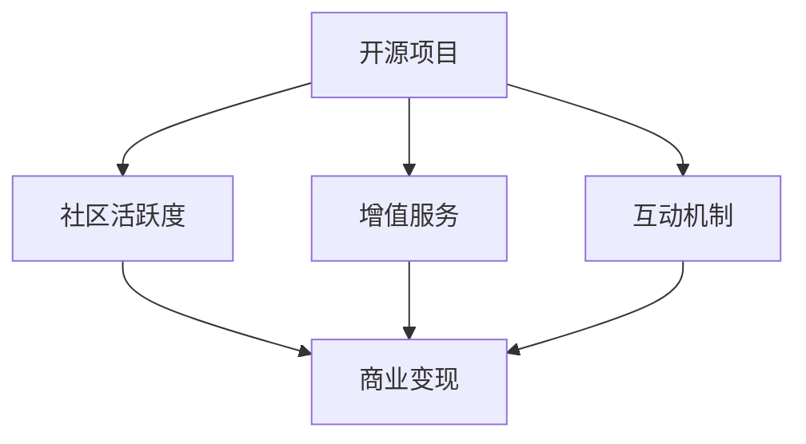

                 

## 1. 背景介绍

### 1.1 问题由来
在过去的几年中，开源社区蓬勃发展，但很多开源项目只专注于代码的发布和维护，缺乏有效的社区互动和商业变现渠道。社区成员的积极参与和项目的商业成功之间存在断层。为了解决这个问题，建立开源项目的付费社区，提供增值服务与互动，成为一种新的趋势。

### 1.2 问题核心关键点
通过建立付费社区，可以为开源项目提供稳定的资金支持，促进社区的活跃度。同时，增值服务和互动可以增强社区成员的黏性，提高项目的商业价值。

1. **社区活跃度**：通过付费会员制，筛选高质量的社区成员，增加社区的活跃度，促进更深层次的技术交流和知识分享。
2. **商业变现**：通过提供专业服务、高级资源、定制化开发等增值服务，将开源项目转化为商业资产，实现盈利。
3. **用户互动**：通过论坛、直播、Q&A等互动方式，增强社区成员的参与感和归属感。
4. **技术交流**：提供高级研讨会、工作坊等技术交流活动，促进技术和知识的快速传播。

### 1.3 问题研究意义
建立付费社区，不仅能提高开源项目的资金和资源支持，还能通过增值服务和互动，提升社区的凝聚力和商业价值。这对于开源社区的健康发展、企业的技术创新和市场扩展都具有重要意义。

1. **社区健康发展**：资金和资源的稳定支持，有助于项目持续发展和维护。
2. **技术创新加速**：高质量社区成员的参与，促进更深入的技术研究和创新。
3. **市场扩展**：通过增值服务，将开源项目转化为可销售的商业产品或服务，拓展市场。

## 2. 核心概念与联系

### 2.1 核心概念概述

为更好地理解建立开源项目付费社区的方法，本节将介绍几个密切相关的核心概念：

- **开源项目**：指通过公开代码，允许任何人使用、修改和分发的软件开发项目。
- **付费社区**：指通过收取费用，为特定群体提供高质量资源、服务和技术支持的社区。
- **增值服务**：指在基础开源产品或服务基础上，提供专业服务、高级资源、定制化开发等额外价值。
- **互动机制**：指通过论坛、直播、Q&A等方式，增强社区成员之间交流和协作的机制。
- **商业变现**：指将开源项目或增值服务转化为可销售的商业产品或服务，实现盈利。

这些核心概念之间的逻辑关系可以通过以下Mermaid流程图来展示：



这个流程图展示了一些核心概念及其之间的关系：

1. 开源项目是基础，通过社区活跃度、增值服务、互动机制，促进商业变现。
2. 社区活跃度、增值服务和互动机制是商业变现的途径和手段。

## 3. 核心算法原理 & 具体操作步骤
### 3.1 算法原理概述

建立开源项目付费社区的算法原理，可以通过以下步骤来理解：

1. **社区筛选**：通过用户注册、会员等级等机制，筛选高质量的社区成员。
2. **增值服务提供**：提供专业服务、高级资源、定制化开发等增值服务。
3. **互动机制设计**：设计论坛、直播、Q&A等互动机制，增强社区成员的参与感和归属感。
4. **商业变现策略**：通过订阅费、付费会员、商业合作等方式，实现商业变现。

### 3.2 算法步骤详解

建立开源项目付费社区的步骤如下：

**Step 1: 社区定位和设计**
- 确定社区的目标用户群体、定位和核心功能。
- 设计社区的会员等级、权限和互动机制。

**Step 2: 增值服务提供**
- 确定增值服务的内容和形式，如专业咨询、定制开发、高级资源等。
- 制定增值服务的定价策略，如按次计费、订阅制等。

**Step 3: 互动机制设计**
- 设计互动机制，如论坛、直播、Q&A等。
- 设计互动内容，如技术分享、案例讨论、技术沙龙等。

**Step 4: 商业变现策略**
- 确定商业变现的渠道，如订阅费、付费会员、商业合作等。
- 制定商业变现的策略，如会员分级、权益设计等。

**Step 5: 社区运营**
- 制定社区运营计划，定期更新社区内容。
- 监测社区活跃度和用户反馈，持续优化社区体验。

**Step 6: 用户反馈和改进**
- 收集用户反馈，改进社区功能和互动机制。
- 不断优化增值服务，提升用户体验和满意度。

### 3.3 算法优缺点

建立开源项目付费社区的算法具有以下优点：

1. **资金支持**：通过收费机制，为开源项目提供稳定的资金支持，促进项目的持续发展和维护。
2. **社区活跃**：筛选高质量的社区成员，增加社区的活跃度和参与感。
3. **商业变现**：通过增值服务和互动机制，实现商业变现，拓展市场。
4. **技术交流**：提供高级研讨会、工作坊等技术交流活动，促进技术和知识的快速传播。

同时，该算法也存在以下缺点：

1. **用户门槛高**：付费机制可能导致部分高质量用户流失，降低社区的广泛性。
2. **商业利益冲突**：过度追求商业利益，可能影响社区的开放性和中立性。
3. **运营成本高**：社区运营和互动机制的维护，需要持续的资源和人力投入。

尽管存在这些缺点，但建立开源项目付费社区的算法依然具有巨大的潜力，可以在提高社区活跃度和商业价值的同时，促进技术的创新和传播。

### 3.4 算法应用领域

建立开源项目付费社区的算法已经在多个领域得到应用，例如：

- **软件开发**：提供专业服务、高级资源、定制化开发等增值服务，促进软件项目的商业化和市场扩展。
- **数据科学**：提供数据分析、模型优化等增值服务，提升数据科学研究的效率和质量。
- **机器学习**：提供模型训练、算法优化等增值服务，推动机器学习技术的发展和应用。
- **人工智能**：提供人工智能产品和服务的定制化开发，推动AI技术的落地和应用。

此外，建立开源项目付费社区的算法还适用于其他技术领域，如网络安全、医疗健康、智能制造等，为各类技术创新提供有力支持。

## 4. 数学模型和公式 & 详细讲解
### 4.1 数学模型构建

建立开源项目付费社区的数学模型可以表示为：

$$
\text{Total Revenue} = \text{Subscription Fees} + \text{Pay-Per-Use} + \text{Commercial Partnerships}
$$

其中，`Subscription Fees`表示订阅费收入，`Pay-Per-Use`表示按次计费收入，`Commercial Partnerships`表示商业合作伙伴关系带来的收入。

### 4.2 公式推导过程

以订阅费为例，假设社区有$N$个用户，订阅费为$S$，则总订阅费收入为：

$$
\text{Total Subscription Fees} = N \times S
$$

### 4.3 案例分析与讲解

假设某开源项目有100个用户，每个用户订阅费为$S=10$元/月，则每月订阅费收入为：

$$
\text{Total Subscription Fees} = 100 \times 10 = 1000\text{元}
$$

## 5. 项目实践：代码实例和详细解释说明
### 5.1 开发环境搭建

建立开源项目付费社区的开发环境搭建步骤如下：

1. 选择适合的开发平台，如GitHub、Bitbucket等。
2. 安装必要的开发工具，如IDE、版本控制工具等。
3. 设计社区界面和功能，确保用户界面友好、易于使用。

### 5.2 源代码详细实现

以GitHub为例，以下是建立开源项目付费社区的代码实现：

```python
from flask import Flask, render_template, request
from flask_login import LoginManager, login_required, current_user
from flask_wtf import FlaskForm
from wtforms import StringField, PasswordField, SubmitField, TextAreaField
from wtforms.validators import DataRequired, Email, EqualTo, Length
from models import User, Role
from database import db
from auth import login_manager

app = Flask(__name__)

# 设置Flask配置
app.config['SECRET_KEY'] = 'a hard to guess string'
app.config['SQLALCHEMY_DATABASE_URI'] = 'sqlite:///site.db'
app.config['SQLALCHEMY_TRACK_MODIFICATIONS'] = False
db.init_app(app)
login_manager.init_app(app)

# 用户登录验证
@app.route('/login', methods=['GET', 'POST'])
def login():
    form = LoginForm()
    if form.validate_on_submit():
        user = User.query.filter_by(username=form.username.data).first()
        if user is None:
            flash('用户不存在')
            return redirect(url_for('login'))
        elif not user.check_password(form.password.data):
            flash('密码错误')
            return redirect(url_for('login'))
        login_manager.login_user(user)
        return redirect(url_for('index'))
    return render_template('login.html', form=form)

# 用户注册
@app.route('/register', methods=['GET', 'POST'])
def register():
    form = RegistrationForm()
    if form.validate_on_submit():
        user = User(username=form.username.data, email=form.email.data)
        user.set_password(form.password.data)
        db.session.add(user)
        db.session.commit()
        flash('注册成功')
        return redirect(url_for('login'))
    return render_template('register.html', form=form)

# 用户登出
@app.route('/logout')
@login_required
def logout():
    login_manager.logout_user()
    return redirect(url_for('index'))

# 用户资料
@app.route('/profile')
@login_required
def profile():
    return render_template('profile.html', user=current_user)

# 用户订阅
@app.route('/subscribe', methods=['GET', 'POST'])
@login_required
def subscribe():
    if request.method == 'POST':
        if current_user.is_subscribed:
            flash('已订阅')
            return redirect(url_for('index'))
        current_user.add_subscription()
        db.session.commit()
        flash('订阅成功')
        return redirect(url_for('index'))
    return render_template('subscribe.html', user=current_user)
```

### 5.3 代码解读与分析

在上述代码中，我们使用Flask框架实现了用户注册、登录、订阅等功能。关键代码解读如下：

- `LoginForm`和`RegistrationForm`是表单类，用于处理用户登录、注册等请求。
- `login()`函数用于处理用户登录，验证用户名和密码后，通过`login_manager.login_user()`登录用户。
- `register()`函数用于处理用户注册，验证用户输入的信息后，创建新用户并提交到数据库。
- `logout()`函数用于处理用户登出，通过`login_manager.logout_user()`注销用户。
- `profile()`函数用于显示用户资料，供用户查看。
- `subscribe()`函数用于处理用户订阅，如果用户未订阅，则添加订阅并提交到数据库。

这些代码构成了社区用户的基本功能，包括登录、注册、订阅等，为后续增值服务的设计提供了基础。

## 6. 实际应用场景
### 6.1 智能客服系统

建立智能客服系统的开源项目付费社区，可以提供高级的AI客服和数据分析服务，帮助企业提升客户服务质量。具体应用场景如下：

- **高级AI客服**：提供AI客服聊天机器人，支持多轮对话、情感分析、意图识别等功能。
- **数据分析**：提供客户行为分析、满意度调查、客服效能评估等服务，帮助企业优化客服流程。
- **定制化开发**：根据企业需求，定制开发符合企业特定场景的客服系统。

### 6.2 金融风险管理

建立金融风险管理的开源项目付费社区，可以提供高级的风险评估和预测服务，帮助金融机构识别和应对潜在风险。具体应用场景如下：

- **风险评估**：提供信用评分、违约预测、市场风险评估等服务，帮助金融机构评估客户的信用状况。
- **预测分析**：提供市场趋势预测、信用风险预警等服务，帮助金融机构防范风险。
- **定制化开发**：根据金融机构需求，定制开发符合其特定场景的风险管理系统。

### 6.3 企业数字化转型

建立企业数字化转型的开源项目付费社区，可以提供高级的数字化解决方案，帮助企业提升数字化能力。具体应用场景如下：

- **数字化战略规划**：提供数字化转型战略咨询、数字化战略设计等服务，帮助企业制定数字化转型方案。
- **数字化运营管理**：提供数字化运营管理、数字化生产优化等服务，帮助企业实现数字化运营。
- **定制化开发**：根据企业需求，定制开发符合其特定场景的数字化管理系统。

### 6.4 未来应用展望

随着技术的不断进步，开源项目付费社区的应用将更加广泛，以下是一些未来应用展望：

1. **多领域应用**：开源项目付费社区将逐步扩展到更多领域，如医疗健康、智能制造、智能交通等，为各行各业提供技术和解决方案。
2. **人工智能赋能**：通过人工智能技术，提升开源项目的智能化水平，增强社区的吸引力和价值。
3. **全球化拓展**：建立全球化的开源项目付费社区，促进国际技术交流和合作。
4. **开源与商业共生**：促进开源与商业的共生发展，形成良性的生态系统。
5. **社区治理**：建立社区治理机制，确保社区的公平、透明和可持续发展。

## 7. 工具和资源推荐
### 7.1 学习资源推荐

为了帮助开发者系统掌握开源项目付费社区的理论基础和实践技巧，这里推荐一些优质的学习资源：

1. **《开源社区建设指南》**：介绍开源社区的建设和管理方法，涵盖社区定位、用户管理、运营策略等内容。
2. **《开源社区运营实战》**：分享开源社区运营的实战经验和最佳实践，帮助开发者提升运营能力。
3. **《开源社区发展之路》**：探讨开源社区的发展历程和未来趋势，提供社区建设的思路和方法。
4. **《开源社区治理》**：介绍开源社区的治理机制和实践，确保社区的公平和透明。
5. **《开源社区成功案例》**：分享成功开源社区的案例和经验，提供学习和借鉴的参考。

通过这些资源的学习实践，相信你一定能够快速掌握开源项目付费社区的理论基础和实践技巧，并用于解决实际的社区建设和管理问题。

### 7.2 开发工具推荐

高效的开发离不开优秀的工具支持。以下是几款用于开源项目付费社区开发的常用工具：

1. **Flask**：Python的开源Web框架，灵活易用，适合快速开发社区应用程序。
2. **Django**：Python的另一款开源Web框架，适合开发大型的社区应用。
3. **React**：前端框架，适合开发社区用户界面。
4. **GitHub Pages**：GitHub提供的静态网站托管服务，方便发布社区网站。
5. **Jupyter Notebook**：Jupyter生态中的笔记本工具，适合社区成员的协作开发和知识分享。

合理利用这些工具，可以显著提升开源项目付费社区的开发效率，加快创新迭代的步伐。

### 7.3 相关论文推荐

开源项目付费社区的研究源于学界的持续研究。以下是几篇奠基性的相关论文，推荐阅读：

1. **《开源社区的演变与未来》**：探讨开源社区的演变历程和未来发展趋势。
2. **《开源社区的经济模型》**：研究开源社区的商业模式和盈利模式。
3. **《开源社区的治理机制》**：探讨开源社区的治理机制和实践。
4. **《开源社区的挑战与对策》**：分析开源社区面临的挑战和应对策略。
5. **《开源社区的商业化之路》**：探讨开源社区的商业化路径和实践。

这些论文代表了大语言模型微调技术的发展脉络。通过学习这些前沿成果，可以帮助研究者把握学科前进方向，激发更多的创新灵感。

## 8. 总结：未来发展趋势与挑战
### 8.1 总结

本文对建立开源项目付费社区的方法进行了全面系统的介绍。首先阐述了开源项目和社区的重要性，明确了社区活跃度、增值服务和互动机制的必要性。其次，从原理到实践，详细讲解了社区筛选、增值服务提供、互动机制设计、商业变现策略等关键步骤，给出了社区开发的完整代码实例。同时，本文还探讨了社区在智能客服、金融风险管理、企业数字化转型等领域的实际应用，展示了社区的巨大潜力。

通过本文的系统梳理，可以看到，开源项目付费社区为开源社区的繁荣和可持续发展提供了新的思路和方法。这些方向的探索发展，必将进一步提升社区的活跃度和商业价值，促进技术的创新和传播。

### 8.2 未来发展趋势

展望未来，开源项目付费社区的发展趋势如下：

1. **社区规模扩大**：随着技术的进步和应用需求的增长，开源项目付费社区的规模将不断扩大。
2. **技术创新加速**：通过社区成员的交流和协作，加速技术创新和知识传播。
3. **商业变现多样化**：通过更多的增值服务和互动机制，实现商业变现的多样化和精细化。
4. **国际化拓展**：建立全球化的开源项目付费社区，促进国际技术交流和合作。
5. **社区治理完善**：建立完善的社区治理机制，确保社区的公平、透明和可持续发展。

以上趋势凸显了开源项目付费社区的广阔前景。这些方向的探索发展，必将进一步提升社区的活跃度和商业价值，促进技术的创新和传播。

### 8.3 面临的挑战

尽管开源项目付费社区已经取得了一定的进展，但在迈向更加智能化、普适化应用的过程中，它仍面临着诸多挑战：

1. **用户门槛高**：付费机制可能导致部分高质量用户流失，降低社区的广泛性。
2. **商业利益冲突**：过度追求商业利益，可能影响社区的开放性和中立性。
3. **运营成本高**：社区运营和互动机制的维护，需要持续的资源和人力投入。

尽管存在这些挑战，但通过持续优化社区运营和互动机制，提升社区成员的黏性，开源项目付费社区依然具有巨大的潜力，可以在提高社区活跃度和商业价值的同时，促进技术的创新和传播。

### 8.4 研究展望

面对开源项目付费社区面临的挑战，未来的研究需要在以下几个方面寻求新的突破：

1. **降低用户门槛**：通过简化注册流程、提供免费试用等方式，降低社区用户门槛，增加社区的广泛性。
2. **平衡商业利益**：通过社区治理机制和商业合作，平衡商业利益和社区开放性，确保社区的健康发展。
3. **降低运营成本**：采用开源社区管理工具、社区自动化运营等技术，降低社区运营成本，提升运营效率。
4. **社区治理完善**：建立完善的社区治理机制，确保社区的公平、透明和可持续发展。
5. **技术创新加速**：通过社区成员的交流和协作，加速技术创新和知识传播。

这些研究方向的探索，必将引领开源项目付费社区走向更高的台阶，为构建安全、可靠、可解释、可控的智能系统铺平道路。面向未来，开源项目付费社区还需要与其他人工智能技术进行更深入的融合，如知识表示、因果推理、强化学习等，多路径协同发力，共同推动技术创新和社区发展。

## 9. 附录：常见问题与解答
**Q1：如何筛选高质量的社区成员？**

A: 通过用户注册、会员等级等机制，筛选高质量的社区成员。可以设置严格的审核机制，确保社区成员的素质和水平。

**Q2：如何提供优质的增值服务？**

A: 确定增值服务的内容和形式，如专业咨询、高级资源、定制化开发等。制定增值服务的定价策略，如按次计费、订阅制等。

**Q3：如何设计互动机制？**

A: 设计论坛、直播、Q&A等互动机制，增强社区成员的参与感和归属感。设计互动内容，如技术分享、案例讨论、技术沙龙等。

**Q4：如何实现商业变现？**

A: 通过订阅费、付费会员、商业合作等方式，实现商业变现。确定商业变现的渠道，如会员分级、权益设计等。

**Q5：如何提升社区运营效率？**

A: 采用开源社区管理工具、社区自动化运营等技术，降低社区运营成本，提升运营效率。合理利用开发工具和社区平台，提高社区运营效率。

以上是针对建立开源项目付费社区的一些常见问题的详细解答，希望能对开发者提供一些有价值的参考。

