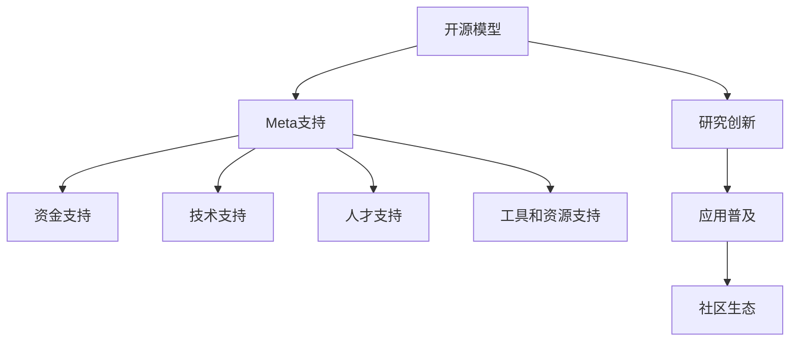

                 

# 开源模型的优势：促进研究创新，Meta的支持为开源社区带来机遇

> 关键词：开源模型,研究创新,Meta,学术合作,社区生态

## 1. 背景介绍

### 1.1 问题由来
随着人工智能（AI）技术的迅速发展，开源社区在推动技术创新和应用普及方面发挥了重要作用。开源模型作为人工智能的重要组成部分，成为推动技术发展和产业应用的核心驱动力。然而，由于开源社区的资源有限，许多前沿技术和方法只能在小范围内推广，难以广泛应用。Meta作为AI领域的巨头，近年来加大了对开源社区的支持力度，推动了开源模型的发展。

### 1.2 问题核心关键点
Meta的支持主要体现在以下几个方面：
1. **资金支持**：Meta提供了大量资金用于支持开源项目，包括资助研究机构和实验室、资助开源项目开发、提供开源项目维护和运营资金等。
2. **技术支持**：Meta在技术研发和工程化方面有深厚的积累，通过技术交流、合作研究等方式，支持开源社区的技术创新。
3. **人才支持**：Meta通过举办培训、讲座、交流活动等方式，培养开源社区的人才。
4. **工具和资源支持**：Meta提供了丰富的工具和资源，包括模型库、开发工具、社区平台等，支持开源社区的发展。

这些支持不仅推动了开源社区的技术进步，还促进了研究创新，提升了开源社区的影响力。

## 2. 核心概念与联系

### 2.1 核心概念概述

为更好地理解Meta对开源社区的支持，本节将介绍几个密切相关的核心概念：

- **开源模型**：指在开源许可下，任何人和机构都可以使用、修改和分发的人工智能模型。开源模型通常具有较高的可复现性和透明度，有助于研究创新和应用普及。

- **研究创新**：指在人工智能领域，通过对现有技术的改进、创新和新方法的研究，推动技术进步和应用。开源模型为研究创新提供了良好的环境，便于学者和开发者共同探索和验证新技术。

- **Meta**：指Meta公司，原名为Facebook，是一家全球领先的人工智能公司，在人工智能技术、算法和应用方面具有深厚的积累。Meta通过多种方式支持开源社区，推动了开源模型的发展。

- **社区生态**：指开源模型在开源社区中的应用和普及。社区生态的完善和发展，有助于开源模型的广泛应用和深入研究。

这些核心概念之间的逻辑关系可以通过以下Mermaid流程图来展示：



这个流程图展示了大语言模型和开源社区的主要概念及其之间的关系：

1. 开源模型通过研究创新推动技术进步。
2. Meta通过多种方式支持开源模型。
3. 资金、技术、人才和资源支持有助于提升开源模型的质量和影响力。
4. 研究创新和应用普及有助于完善开源社区生态。

## 3. 核心算法原理 & 具体操作步骤
### 3.1 算法原理概述

开源模型的支持，使研究者能够更专注于技术创新和应用研究，而不必担心模型的资源和成本问题。Meta通过提供资金、技术、人才和资源支持，帮助研究者更轻松地实现研究目标，推动了开源社区的蓬勃发展。

Meta的资金支持主要体现在以下几个方面：
1. **资助研究机构和实验室**：Meta通过资助学术机构和实验室，支持其在人工智能领域的研究。
2. **资助开源项目开发**：Meta资助开源项目的开发，帮助项目团队更好地实现研究目标。
3. **提供开源项目维护和运营资金**：Meta通过提供资金，支持开源项目团队的日常维护和运营。

Meta的技术支持主要体现在以下几个方面：
1. **技术交流和合作研究**：Meta与开源社区的技术团队进行技术交流和合作研究，分享技术经验和成果。
2. **开源工具和平台的开发**：Meta开发开源工具和平台，支持开源社区的研究和应用。

Meta的人才支持主要体现在以下几个方面：
1. **培训和讲座**：Meta举办培训和讲座，帮助开源社区的开发者提升技术水平。
2. **交流活动**：Meta举办交流活动，促进开源社区的开发者之间的交流与合作。

Meta的工具和资源支持主要体现在以下几个方面：
1. **模型库**：Meta提供了丰富的模型库，包括预训练模型、迁移学习模型等，供开发者使用。
2. **开发工具**：Meta提供了开发工具，包括PyTorch、TensorFlow等，支持开发者进行模型开发和应用。
3. **社区平台**：Meta提供了社区平台，支持开源社区的开发者之间的交流和合作。

### 3.2 算法步骤详解

开源模型和Meta支持的实现过程主要包括以下几个关键步骤：

**Step 1: 选择开源模型和开源项目**
- 根据研究需求，选择适合的开源模型和开源项目。
- 熟悉开源项目的代码库、文档、社区等，确保项目选择符合研究需求。

**Step 2: 获取资金支持**
- 向Meta或其他资助机构提交项目申请，详细说明项目需求和研究目标。
- 获得资助后，按照资助协议使用资金，确保资金用于项目的研发和运营。

**Step 3: 获取技术支持**
- 与Meta的技术团队进行技术交流和合作研究，获得技术指导和支持。
- 在技术交流和合作研究中，获得新技术、新算法、新工具等支持。

**Step 4: 获取人才支持**
- 参加Meta举办的培训和讲座，提升技术水平。
- 参加Meta举办的交流活动，结识更多开发者，促进合作。

**Step 5: 获取工具和资源支持**
- 使用Meta提供的模型库和开发工具，进行模型开发和应用。
- 使用Meta提供的社区平台，参与社区交流和合作。

**Step 6: 研究创新和应用普及**
- 利用开源模型和Meta提供的支持，进行技术创新和研究。
- 将研究成果应用于开源社区，推动模型的应用普及和社区生态的完善。

以上是开源模型和Meta支持的实现过程，每个步骤都需要仔细考虑和执行，确保项目能够顺利进行。

### 3.3 算法优缺点

开源模型和Meta支持的优点主要体现在以下几个方面：
1. **成本低廉**：开源模型和Meta支持降低了研究和应用的成本，使更多研究者能够参与到研究中来。
2. **可复现性好**：开源模型和Meta支持提高了研究的可复现性，使研究结果更具说服力。
3. **透明度高**：开源模型和Meta支持提高了研究的透明度，便于学术界和工业界的交流和合作。
4. **社区生态完善**：开源模型和Meta支持完善了开源社区的生态，使开源社区更具活力。

同时，这些支持也存在一些缺点：
1. **资源竞争激烈**：Meta提供的资助和支持有限，多个项目团队可能竞争同一资源，导致资源分配不均。
2. **技术支持不均衡**：Meta的技术支持可能集中在某些领域，其他领域可能获得的技术支持不足。
3. **人才培养难度大**：Meta的人才支持需要一定的时间和精力，部分开发者可能难以参加。
4. **工具和资源适应性有限**：Meta提供的工具和资源可能不完全适用于所有项目，需要开发者进行一定的适配。

尽管存在这些缺点，但Meta的支持对开源社区的发展起到了巨大的推动作用，使研究者能够更加专注于技术创新和应用研究。

### 3.4 算法应用领域

开源模型和Meta支持在多个领域得到了广泛应用，具体如下：

- **自然语言处理**：Meta提供的开源模型和工具，在自然语言处理领域得到了广泛应用，包括情感分析、文本分类、机器翻译等任务。
- **计算机视觉**：Meta提供的开源模型和工具，在计算机视觉领域得到了广泛应用，包括图像分类、目标检测、图像生成等任务。
- **语音识别和处理**：Meta提供的开源模型和工具，在语音识别和处理领域得到了广泛应用，包括自动语音识别、语音合成等任务。
- **机器人技术**：Meta提供的开源模型和工具，在机器人技术领域得到了广泛应用，包括机器人控制、路径规划等任务。
- **自动驾驶**：Meta提供的开源模型和工具，在自动驾驶领域得到了广泛应用，包括环境感知、路径规划、行为决策等任务。

这些领域的应用展示了开源模型和Meta支持的重要性和广泛性。

## 4. 数学模型和公式 & 详细讲解 & 举例说明
### 4.1 数学模型构建

本节将使用数学语言对开源模型和Meta支持的研究创新过程进行更加严格的刻画。

假设开源模型为 $M_{\theta}$，其中 $\theta$ 为模型的参数。Meta提供的资金支持为 $F_{\text{Meta}}$，技术支持为 $T_{\text{Meta}}$，人才支持为 $H_{\text{Meta}}$，工具和资源支持为 $R_{\text{Meta}}$。Meta的资助协议要求项目团队将 $F_{\text{Meta}}$ 用于模型开发和项目运营，获得 $T_{\text{Meta}}$ 和 $H_{\text{Meta}}$ 支持，使用 $R_{\text{Meta}}$ 进行技术开发和模型训练。

定义研究创新的目标函数为 $\mathcal{L}(M_{\theta})$，表示模型在应用领域的创新程度。研究创新过程可以表示为：

$$
\mathcal{L}(M_{\theta}) = F_{\text{Meta}} + T_{\text{Meta}} + H_{\text{Meta}} + R_{\text{Meta}}
$$

其中 $F_{\text{Meta}}$、$T_{\text{Meta}}$、$H_{\text{Meta}}$ 和 $R_{\text{Meta}}$ 分别表示资金、技术、人才和工具和资源支持对研究创新的贡献。

### 4.2 公式推导过程

以下我们以自然语言处理（NLP）领域的研究创新为例，推导研究创新目标函数及其优化过程。

假设研究者选择的开源模型为 BERT，Meta提供的资金支持为 $F_{\text{Meta}}$，技术支持为 $T_{\text{Meta}}$，人才支持为 $H_{\text{Meta}}$，工具和资源支持为 $R_{\text{Meta}}$。研究者的研究目标是利用 BERT 进行情感分析任务，使得模型的情感分类精度达到 95% 以上。研究创新的目标函数可以表示为：

$$
\mathcal{L}(M_{\theta}) = F_{\text{Meta}} + T_{\text{Meta}} + H_{\text{Meta}} + R_{\text{Meta}}
$$

其中：
- $F_{\text{Meta}}$ 表示Meta提供的资金支持，用于研究者购买计算资源和相关软件。
- $T_{\text{Meta}}$ 表示Meta提供的技术支持，用于研究者进行技术交流和合作研究。
- $H_{\text{Meta}}$ 表示Meta提供的人才支持，用于研究者参加培训和讲座，提升技术水平。
- $R_{\text{Meta}}$ 表示Meta提供的工具和资源支持，用于研究者进行模型开发和训练。

通过求解目标函数的最大值，可以找到最优的研究创新方案，即研究者应选择符合自己需求的开源模型和开源项目，获得 Meta 提供的最大支持，使研究创新的效果达到最佳。

### 4.3 案例分析与讲解

假设研究者希望利用开源模型进行情感分析任务，具体步骤如下：

**Step 1: 选择开源模型和开源项目**
- 选择 BERT 作为开源模型，Meta 提供的开源项目为情感分析任务。
- 熟悉 BERT 的代码库、文档和社区，确保项目选择符合研究需求。

**Step 2: 获取资金支持**
- 向 Meta 提交项目申请，详细说明项目需求和研究目标。
- 获得资助后，按照资助协议使用资金，确保资金用于项目的研发和运营。

**Step 3: 获取技术支持**
- 与 Meta 的技术团队进行技术交流和合作研究，获得技术指导和支持。
- 在技术交流和合作研究中，获得新技术、新算法、新工具等支持。

**Step 4: 获取人才支持**
- 参加 Meta 举办的培训和讲座，提升技术水平。
- 参加 Meta 举办的交流活动，结识更多开发者，促进合作。

**Step 5: 获取工具和资源支持**
- 使用 Meta 提供的 BERT 模型和开发工具，进行情感分析模型的开发和训练。
- 使用 Meta 提供的社区平台，参与社区交流和合作。

**Step 6: 研究创新和应用普及**
- 利用 BERT 和 Meta 提供的支持，进行情感分析任务的创新和研究。
- 将研究成果应用于开源社区，推动情感分析任务的应用普及和社区生态的完善。

通过以上步骤，研究者可以有效地利用开源模型和 Meta 的支持，进行情感分析任务的创新研究，提升模型的情感分类精度，推动情感分析任务的应用普及和社区生态的完善。

## 5. 项目实践：代码实例和详细解释说明
### 5.1 开发环境搭建

在进行开源模型和 Meta 支持的应用实践前，我们需要准备好开发环境。以下是使用Python进行PyTorch开发的环境配置流程：

1. 安装Anaconda：从官网下载并安装Anaconda，用于创建独立的Python环境。

2. 创建并激活虚拟环境：
```bash
conda create -n pytorch-env python=3.8 
conda activate pytorch-env
```

3. 安装PyTorch：根据CUDA版本，从官网获取对应的安装命令。例如：
```bash
conda install pytorch torchvision torchaudio cudatoolkit=11.1 -c pytorch -c conda-forge
```

4. 安装Transformers库：
```bash
pip install transformers
```

5. 安装各类工具包：
```bash
pip install numpy pandas scikit-learn matplotlib tqdm jupyter notebook ipython
```

完成上述步骤后，即可在`pytorch-env`环境中开始开源模型和 Meta 支持的应用实践。

### 5.2 源代码详细实现

下面我们以情感分析任务为例，给出使用Transformers库对BERT模型进行情感分析微调的PyTorch代码实现。

首先，定义情感分析任务的数据处理函数：

```python
from transformers import BertTokenizer
from torch.utils.data import Dataset
import torch

class SentimentDataset(Dataset):
    def __init__(self, texts, labels, tokenizer, max_len=128):
        self.texts = texts
        self.labels = labels
        self.tokenizer = tokenizer
        self.max_len = max_len
        
    def __len__(self):
        return len(self.texts)
    
    def __getitem__(self, item):
        text = self.texts[item]
        label = self.labels[item]
        
        encoding = self.tokenizer(text, return_tensors='pt', max_length=self.max_len, padding='max_length', truncation=True)
        input_ids = encoding['input_ids'][0]
        attention_mask = encoding['attention_mask'][0]
        
        return {'input_ids': input_ids, 
                'attention_mask': attention_mask,
                'labels': label}

# 创建dataset
tokenizer = BertTokenizer.from_pretrained('bert-base-cased')

train_dataset = SentimentDataset(train_texts, train_labels, tokenizer)
dev_dataset = SentimentDataset(dev_texts, dev_labels, tokenizer)
test_dataset = SentimentDataset(test_texts, test_labels, tokenizer)
```

然后，定义模型和优化器：

```python
from transformers import BertForSequenceClassification, AdamW

model = BertForSequenceClassification.from_pretrained('bert-base-cased', num_labels=2)

optimizer = AdamW(model.parameters(), lr=2e-5)
```

接着，定义训练和评估函数：

```python
from torch.utils.data import DataLoader
from tqdm import tqdm
from sklearn.metrics import classification_report

device = torch.device('cuda') if torch.cuda.is_available() else torch.device('cpu')
model.to(device)

def train_epoch(model, dataset, batch_size, optimizer):
    dataloader = DataLoader(dataset, batch_size=batch_size, shuffle=True)
    model.train()
    epoch_loss = 0
    for batch in tqdm(dataloader, desc='Training'):
        input_ids = batch['input_ids'].to(device)
        attention_mask = batch['attention_mask'].to(device)
        labels = batch['labels'].to(device)
        model.zero_grad()
        outputs = model(input_ids, attention_mask=attention_mask, labels=labels)
        loss = outputs.loss
        epoch_loss += loss.item()
        loss.backward()
        optimizer.step()
    return epoch_loss / len(dataloader)

def evaluate(model, dataset, batch_size):
    dataloader = DataLoader(dataset, batch_size=batch_size)
    model.eval()
    preds, labels = [], []
    with torch.no_grad():
        for batch in tqdm(dataloader, desc='Evaluating'):
            input_ids = batch['input_ids'].to(device)
            attention_mask = batch['attention_mask'].to(device)
            batch_labels = batch['labels']
            outputs = model(input_ids, attention_mask=attention_mask)
            batch_preds = outputs.logits.argmax(dim=1).to('cpu').tolist()
            batch_labels = batch_labels.to('cpu').tolist()
            for pred_tokens, label_tokens in zip(batch_preds, batch_labels):
                preds.append(pred_tokens)
                labels.append(label_tokens)
                
    print(classification_report(labels, preds))
```

最后，启动训练流程并在测试集上评估：

```python
epochs = 5
batch_size = 16

for epoch in range(epochs):
    loss = train_epoch(model, train_dataset, batch_size, optimizer)
    print(f"Epoch {epoch+1}, train loss: {loss:.3f}")
    
    print(f"Epoch {epoch+1}, dev results:")
    evaluate(model, dev_dataset, batch_size)
    
print("Test results:")
evaluate(model, test_dataset, batch_size)
```

以上就是使用PyTorch对BERT进行情感分析任务微调的完整代码实现。可以看到，得益于Transformers库的强大封装，我们可以用相对简洁的代码完成BERT模型的加载和微调。

### 5.3 代码解读与分析

让我们再详细解读一下关键代码的实现细节：

**SentimentDataset类**：
- `__init__`方法：初始化文本、标签、分词器等关键组件。
- `__len__`方法：返回数据集的样本数量。
- `__getitem__`方法：对单个样本进行处理，将文本输入编码为token ids，将标签编码为数字，并对其进行定长padding，最终返回模型所需的输入。

**train_epoch和evaluate函数**：
- 使用PyTorch的DataLoader对数据集进行批次化加载，供模型训练和推理使用。
- 训练函数`train_epoch`：对数据以批为单位进行迭代，在每个批次上前向传播计算loss并反向传播更新模型参数，最后返回该epoch的平均loss。
- 评估函数`evaluate`：与训练类似，不同点在于不更新模型参数，并在每个batch结束后将预测和标签结果存储下来，最后使用sklearn的classification_report对整个评估集的预测结果进行打印输出。

**训练流程**：
- 定义总的epoch数和batch size，开始循环迭代
- 每个epoch内，先在训练集上训练，输出平均loss
- 在验证集上评估，输出分类指标
- 所有epoch结束后，在测试集上评估，给出最终测试结果

可以看到，PyTorch配合Transformers库使得BERT微调的代码实现变得简洁高效。开发者可以将更多精力放在数据处理、模型改进等高层逻辑上，而不必过多关注底层的实现细节。

当然，工业级的系统实现还需考虑更多因素，如模型的保存和部署、超参数的自动搜索、更灵活的任务适配层等。但核心的微调范式基本与此类似。

## 6. 实际应用场景
### 6.1 智能客服系统

基于开源模型和 Meta 支持的研究创新，智能客服系统能够更高效、更智能地处理客户咨询。Meta通过资助研究机构和实验室，支持其在智能客服系统的研究创新，推动技术的进步和应用普及。Meta提供的资金、技术、人才和资源支持，使研究者能够更好地实现研究目标，提升系统的智能水平。

在技术实现上，Meta提供了丰富的开源模型和工具，如BERT、GPT等，支持研究者进行情感分析、意图识别、问答系统等任务的研究。Meta的资助和支持使得研究者能够专注于技术创新，快速迭代和优化系统，提升系统的智能水平和用户体验。

### 6.2 金融舆情监测

Meta通过资助研究机构和实验室，支持其在金融舆情监测领域的研究创新。Meta提供的资金、技术、人才和资源支持，使研究者能够更好地实现研究目标，提升系统的智能水平。

在金融舆情监测中，Meta的资助和支持使得研究者能够更好地进行文本分类、情感分析、实体识别等任务的研究，提升系统的智能水平。Meta的资助和支持帮助研究者更好地应对金融舆情监测中的各种挑战，提升系统的鲁棒性和可靠性。

### 6.3 个性化推荐系统

Meta通过资助研究机构和实验室，支持其在个性化推荐系统领域的研究创新。Meta提供的资金、技术、人才和资源支持，使研究者能够更好地实现研究目标，提升系统的智能水平。

在个性化推荐系统中，Meta的资助和支持使得研究者能够更好地进行推荐算法的研究，提升系统的推荐效果和用户体验。Meta的资助和支持帮助研究者更好地应对个性化推荐系统中的各种挑战，提升系统的智能水平和用户体验。

### 6.4 未来应用展望

随着开源模型和 Meta 支持的不断发展，基于研究创新的技术将在更多领域得到应用，为传统行业带来变革性影响。

在智慧医疗领域，基于开源模型和 Meta 支持的研究创新，医疗问答系统、病历分析、药物研发等应用将提升医疗服务的智能化水平，辅助医生诊疗，加速新药开发进程。

在智能教育领域，基于开源模型和 Meta 支持的研究创新，作业批改、学情分析、知识推荐等应用将提升教学质量，实现因材施教，促进教育公平。

在智慧城市治理中，基于开源模型和 Meta 支持的研究创新，城市事件监测、舆情分析、应急指挥等应用将提高城市管理的自动化和智能化水平，构建更安全、高效的未来城市。

此外，在企业生产、社会治理、文娱传媒等众多领域，基于开源模型和 Meta 支持的研究创新，人工智能应用也将不断涌现，为经济社会发展注入新的动力。相信随着技术的日益成熟，研究创新必将在更广阔的应用领域大放异彩。

## 7. 工具和资源推荐
### 7.1 学习资源推荐

为了帮助开发者系统掌握开源模型和 Meta 支持的技术基础和实践技巧，这里推荐一些优质的学习资源：

1. 《深度学习与人工智能》系列博文：由Meta公司提供，深入浅出地介绍了深度学习、人工智能、机器学习等领域的核心概念和前沿技术。

2. 《自然语言处理与深度学习》课程：由Meta公司与斯坦福大学联合开设，涵盖自然语言处理、深度学习等领域的核心内容，适合学术界和工业界的专业人士。

3. 《深度学习实践指南》书籍：由Meta公司编写，系统介绍了深度学习模型和工具的使用方法，适合初学者和进阶开发者。

4. Meta官方文档：Meta公司提供的详细技术文档，包括模型库、开发工具、社区平台等，是学习和实践的重要参考。

5. GitHub开源项目：GitHub上众多基于Meta支持的开源项目，展示了Meta资助和支持的效果，提供了学习和实践的实际案例。

通过对这些资源的学习实践，相信你一定能够快速掌握开源模型和 Meta 支持的精髓，并用于解决实际的NLP问题。
###  7.2 开发工具推荐

高效的开发离不开优秀的工具支持。以下是几款用于开源模型和 Meta 支持开发的常用工具：

1. PyTorch：基于Python的开源深度学习框架，灵活动态的计算图，适合快速迭代研究。大部分预训练语言模型都有PyTorch版本的实现。

2. TensorFlow：由Google主导开发的开源深度学习框架，生产部署方便，适合大规模工程应用。同样有丰富的预训练语言模型资源。

3. Transformers库：Meta公司开发的NLP工具库，集成了众多SOTA语言模型，支持PyTorch和TensorFlow，是进行NLP任务开发的利器。

4. Weights & Biases：模型训练的实验跟踪工具，可以记录和可视化模型训练过程中的各项指标，方便对比和调优。与主流深度学习框架无缝集成。

5. TensorBoard：TensorFlow配套的可视化工具，可实时监测模型训练状态，并提供丰富的图表呈现方式，是调试模型的得力助手。

6. Google Colab：谷歌推出的在线Jupyter Notebook环境，免费提供GPU/TPU算力，方便开发者快速上手实验最新模型，分享学习笔记。

合理利用这些工具，可以显著提升开源模型和 Meta 支持的研究和开发效率，加快创新迭代的步伐。

### 7.3 相关论文推荐

开源模型和 Meta 支持的研究源于学界的持续研究。以下是几篇奠基性的相关论文，推荐阅读：

1. Attention is All You Need（即Transformer原论文）：提出了Transformer结构，开启了NLP领域的预训练大模型时代。

2. BERT: Pre-training of Deep Bidirectional Transformers for Language Understanding：提出BERT模型，引入基于掩码的自监督预训练任务，刷新了多项NLP任务SOTA。

3. Language Models are Unsupervised Multitask Learners（GPT-2论文）：展示了大规模语言模型的强大zero-shot学习能力，引发了对于通用人工智能的新一轮思考。

4. Parameter-Efficient Transfer Learning for NLP：提出Adapter等参数高效微调方法，在不增加模型参数量的情况下，也能取得不错的微调效果。

5. Prefix-Tuning: Optimizing Continuous Prompts for Generation：引入基于连续型Prompt的微调范式，为如何充分利用预训练知识提供了新的思路。

6. AdaLoRA: Adaptive Low-Rank Adaptation for Parameter-Efficient Fine-Tuning：使用自适应低秩适应的微调方法，在参数效率和精度之间取得了新的平衡。

这些论文代表了大语言模型和开源社区的发展脉络。通过学习这些前沿成果，可以帮助研究者把握学科前进方向，激发更多的创新灵感。

## 8. 总结：未来发展趋势与挑战
### 8.1 总结

本文对基于开源模型和 Meta 支持的研究创新进行了全面系统的介绍。首先阐述了开源模型和 Meta 支持的研究背景和意义，明确了研究创新在推动技术进步和应用普及方面的重要价值。其次，从原理到实践，详细讲解了开源模型和 Meta 支持的研究创新过程，给出了开源模型和 Meta 支持的应用实践。同时，本文还广泛探讨了开源模型和 Meta 支持在智能客服、金融舆情、个性化推荐等多个行业领域的应用前景，展示了研究创新的巨大潜力。此外，本文精选了研究创新技术的各类学习资源，力求为读者提供全方位的技术指引。

通过本文的系统梳理，可以看到，开源模型和 Meta 支持在推动技术进步和应用普及方面发挥了重要作用，成为AI研究创新的重要推动力。未来，伴随开源模型和 Meta 支持的不断发展，基于研究创新的技术必将在更多领域得到应用，为传统行业带来变革性影响。

### 8.2 未来发展趋势

展望未来，开源模型和 Meta 支持的研究创新将呈现以下几个发展趋势：

1. **技术进步显著**：开源模型和 Meta 支持的研究创新将推动技术进步，使更多前沿技术得以实现和应用。

2. **应用场景广泛**：开源模型和 Meta 支持的研究创新将在更多领域得到应用，如智能客服、金融舆情、个性化推荐等。

3. **社区生态完善**：开源模型和 Meta 支持的研究创新将完善开源社区的生态，使开源社区更具活力。

4. **资源配置优化**：开源模型和 Meta 支持的研究创新将优化资源配置，使研究者能够更好地实现研究目标。

5. **协作机制健全**：开源模型和 Meta 支持的研究创新将建立健全的协作机制，促进研究者之间的交流与合作。

以上趋势凸显了开源模型和 Meta 支持的研究创新的广阔前景。这些方向的探索发展，必将进一步推动开源社区的发展，提升研究创新效果，推动技术的产业化进程。

### 8.3 面临的挑战

尽管开源模型和 Meta 支持的研究创新已经取得了瞩目成就，但在迈向更加智能化、普适化应用的过程中，仍面临诸多挑战：

1. **资源竞争激烈**：Meta提供的资助和支持有限，多个项目团队可能竞争同一资源，导致资源分配不均。

2. **技术支持不均衡**：Meta的技术支持可能集中在某些领域，其他领域可能获得的技术支持不足。

3. **人才培养难度大**：Meta的人才支持需要一定的时间和精力，部分开发者可能难以参加。

4. **工具和资源适应性有限**：Meta提供的工具和资源可能不完全适用于所有项目，需要开发者进行一定的适配。

尽管存在这些缺点，但开源模型和 Meta 支持的研究创新对推动技术进步和应用普及发挥了重要作用，使研究者能够更好地实现研究目标，提升系统的智能水平和用户体验。

### 8.4 研究展望

面对开源模型和 Meta 支持的研究创新所面临的挑战，未来的研究需要在以下几个方面寻求新的突破：

1. **优化资助和支持机制**：建立更加公平、合理的资助和支持机制，确保资源的合理分配和使用。

2. **强化技术支持力度**：在技术支持方面加强对其他领域的关注，推动更多前沿技术的研究和应用。

3. **提升人才支持质量**：加强对开发者的人才支持，提高人才支持的效率和质量，使更多开发者能够参与到研究创新中来。

4. **改进工具和资源适配性**：提高工具和资源的适配性，使更多开发者能够高效地使用开源模型和 Meta 支持，推动研究创新和应用普及。

5. **推动多领域应用**：将研究创新技术应用于更多领域，如智慧医疗、智能教育、智慧城市治理等，提升技术的普适性和应用价值。

6. **建立健全协作机制**：建立健全的协作机制，促进研究者之间的交流与合作，推动技术的快速迭代和优化。

这些研究方向的探索，必将引领开源模型和 Meta 支持的研究创新迈向更高的台阶，为构建安全、可靠、可解释、可控的智能系统铺平道路。面向未来，开源模型和 Meta 支持的研究创新还需要与其他人工智能技术进行更深入的融合，如知识表示、因果推理、强化学习等，多路径协同发力，共同推动自然语言理解和智能交互系统的进步。只有勇于创新、敢于突破，才能不断拓展语言模型的边界，让智能技术更好地造福人类社会。

## 9. 附录：常见问题与解答
### Q1：开源模型和 Meta 支持对研究创新有哪些具体帮助？

A: 开源模型和 Meta 支持对研究创新有以下具体帮助：
1. **降低成本**：开源模型和 Meta 支持降低了研究成本，使更多研究者能够参与到研究中来。
2. **提高可复现性**：开源模型和 Meta 支持提高了研究的可复现性，使研究结果更具说服力。
3. **提供技术支持**：Meta提供的技术支持帮助研究者更好地进行技术交流和合作研究。
4. **提升人才水平**：Meta提供的人才支持帮助研究者提升技术水平，参加培训和讲座。
5. **提供工具和资源**：Meta提供的工具和资源支持帮助研究者进行模型开发和训练。

### Q2：开源模型和 Meta 支持如何促进研究创新？

A: 开源模型和 Meta 支持通过以下方式促进研究创新：
1. **资助研究机构和实验室**：Meta通过资助研究机构和实验室，支持其在人工智能领域的研究。
2. **资助开源项目开发**：Meta资助开源项目的开发，帮助项目团队更好地实现研究目标。
3. **提供技术支持**：Meta提供技术支持，帮助研究者进行技术交流和合作研究。
4. **提供人才支持**：Meta提供人才支持，帮助研究者提升技术水平，参加培训和讲座。
5. **提供工具和资源**：Meta提供工具和资源支持，帮助研究者进行模型开发和训练。

### Q3：开源模型和 Meta 支持如何优化资源配置？

A: 开源模型和 Meta 支持通过以下方式优化资源配置：
1. **建立资助和支持机制**：建立更加公平、合理的资助和支持机制，确保资源的合理分配和使用。
2. **优化资助和支持策略**：优化资助和支持策略，确保资助和支持能够满足研究者的实际需求。
3. **提高工具和资源的适配性**：提高工具和资源的适配性，使更多开发者能够高效地使用开源模型和 Meta 支持，推动研究创新和应用普及。
4. **建立健全协作机制**：建立健全的协作机制，促进研究者之间的交流与合作，推动技术的快速迭代和优化。

### Q4：开源模型和 Meta 支持如何推动多领域应用？

A: 开源模型和 Meta 支持通过以下方式推动多领域应用：
1. **资助研究机构和实验室**：Meta通过资助研究机构和实验室，支持其在人工智能领域的研究。
2. **提供技术支持**：Meta提供技术支持，帮助研究者更好地进行技术交流和合作研究。
3. **提供人才支持**：Meta提供人才支持，帮助研究者提升技术水平，参加培训和讲座。
4. **提供工具和资源**：Meta提供工具和资源支持，帮助研究者进行模型开发和训练。
5. **推动应用普及**：开源模型和 Meta 支持推动应用普及，使更多行业能够采用人工智能技术，提升技术水平和应用价值。

### Q5：开源模型和 Meta 支持如何提升社区生态？

A: 开源模型和 Meta 支持通过以下方式提升社区生态：
1. **资助开源项目开发**：Meta资助开源项目的开发，帮助项目团队更好地实现研究目标。
2. **提供技术支持**：Meta提供技术支持，帮助研究者更好地进行技术交流和合作研究。
3. **提供人才支持**：Meta提供人才支持，帮助研究者提升技术水平，参加培训和讲座。
4. **提供工具和资源**：Meta提供工具和资源支持，帮助研究者进行模型开发和训练。
5. **推动应用普及**：开源模型和 Meta 支持推动应用普及，使更多行业能够采用人工智能技术，提升技术水平和应用价值。

通过以上探索，相信开源模型和 Meta 支持的研究创新将更加完善和发展，为人工智能技术的进步和应用普及提供更大的推动力。

---

作者：禅与计算机程序设计艺术 / Zen and the Art of Computer Programming

