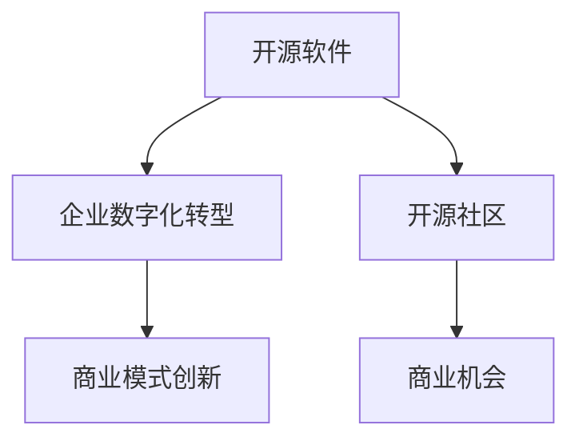

                 

# 开源项目的企业采用：创造商业机会

> 关键词：开源软件,企业数字化转型,开源社区,商业机会,商业模式创新,敏捷开发

## 1. 背景介绍

### 1.1 问题由来

在现代企业信息化建设过程中，开源软件因其灵活性、易用性、成本效益高、社区活跃等优势，逐渐成为企业级软件的重要组成部分。然而，许多企业对于采用开源软件仍然存在一定顾虑，比如开源软件的安全性、稳定性、技术支持问题等。这使得企业在应用开源软件时，往往面临诸多不确定性和挑战。

为了帮助企业更好地理解和采用开源软件，本文将从开源项目的开源特性、企业采用的关键因素、成功案例等多个角度进行深入探讨，提出企业采用开源项目的战略和策略，以期为企业的数字化转型提供新的思路和方向。

### 1.2 问题核心关键点

企业采用开源项目的关键点主要包括以下几点：
- 开源软件的定义与特点：自由软件、协作开发、代码共享等。
- 企业数字化转型的目标与需求：数据驱动、效率提升、业务创新等。
- 开源社区的构建与参与：开放生态、社区协作、知识共享等。
- 商业机会的识别与创造：商业模式创新、增值服务、定制化开发等。
- 采用开源项目的具体策略与步骤：风险评估、技术评估、成本效益分析等。

本文将系统性地梳理上述关键点，并结合具体案例，对企业采用开源项目进行全面分析和指导。

## 2. 核心概念与联系

### 2.1 核心概念概述

为了更好地理解企业采用开源项目的战略和策略，本节将介绍几个密切相关的核心概念：

- **开源软件**：指按照开源许可协议，任何用户都能自由访问、使用、修改和分享的软件。常见的开源许可证包括GPL、Apache、MIT等。
- **企业数字化转型**：指企业通过引入数字化技术，优化运营流程、提升业务效率、创造新商业模式的过程。数字化转型的关键在于技术的应用和创新。
- **开源社区**：指围绕开源项目，由开发者、用户、贡献者组成的开源生态系统。社区提供技术支持、问题解决、文档分享等资源。
- **商业机会**：指在采用开源项目的过程中，企业创造新服务、增值服务、市场机会的能力。
- **商业模式创新**：指通过引入开源项目，企业打破传统商业模式，构建新业务模式的能力。

这些核心概念之间的逻辑关系可以通过以下Mermaid流程图来展示：



这个流程图展示了几者之间的联系：开源软件作为技术基础，推动企业数字化转型；开源社区提供支持和资源，辅助企业采用；商业机会通过模式创新，转化为具体的商业价值。

## 3. 核心算法原理 & 具体操作步骤
### 3.1 算法原理概述

企业采用开源项目的核心算法原理，主要基于以下两个关键点：

1. **技术匹配与定制化开发**：评估开源项目的适用性，根据企业实际需求进行定制化开发，确保项目能够满足企业特定场景。
2. **社区参与与协作**：利用开源社区的资源和协作机制，解决技术问题，提升项目稳定性和可靠性。

这两点相辅相成，共同构成企业采用开源项目的算法基础。

### 3.2 算法步骤详解

企业采用开源项目的详细步骤通常包括以下几个方面：

**Step 1: 需求评估**

- 识别企业数字化转型的目标和需求，明确采用开源软件的业务场景和预期效果。
- 列出需要解决的问题、改进的业务流程、预期实现的功能等。

**Step 2: 开源软件选择**

- 根据需求评估结果，选择适合的开源软件。考虑软件的稳定性、活跃度、社区支持、文档资源等。
- 评估开源软件的技术匹配度，确保其能够满足企业需求。

**Step 3: 风险评估**

- 评估开源软件的使用风险，包括技术风险、安全风险、法律风险等。
- 制定相应的风险管理策略，降低采用开源软件的风险。

**Step 4: 技术评估**

- 进行开源软件的详细技术评估，包括代码质量、性能表现、社区活跃度、问题解决效率等。
- 根据评估结果，决定是否采用开源软件，并进行进一步定制化开发。

**Step 5: 定制化开发**

- 根据企业需求，对开源软件进行定制化开发，集成企业特定功能。
- 利用开源社区提供的资源和工具，提升开发效率和质量。

**Step 6: 部署与测试**

- 将定制化后的开源软件部署到企业环境，并进行全面测试。
- 在测试过程中，利用开源社区提供的反馈和文档，解决遇到的问题。

**Step 7: 持续维护**

- 建立开源软件的使用和维护机制，定期更新和优化软件。
- 利用开源社区的资源，保持软件技术的领先性。

### 3.3 算法优缺点

企业采用开源项目的算法具有以下优点：
1. 成本效益高：开源软件通常无版权费用，且社区协作可降低技术支持成本。
2. 灵活性高：开源软件具有高度的灵活性和定制化能力，可以针对企业特定需求进行调整。
3. 社区支持：开源社区提供了丰富的资源和技术支持，可以及时解决问题。
4. 创新潜力：开源软件社区活跃，不断有新功能和改进出现，有助于企业保持技术领先。

同时，该算法也存在一定的局限性：
1. 技术支持不足：开源社区的核心贡献者可能不定期，技术支持可能不如商业软件。
2. 安全性问题：开源软件的安全性依赖于社区的维护，可能存在安全漏洞。
3. 定制化难度大：开源软件可能没有针对特定行业的解决方案，需要大量的定制化开发。
4. 商业化能力有限：开源软件通常缺乏商业模式的系统支持，可能难以产生直接的商业收益。

尽管存在这些局限性，但开源软件在成本效益和灵活性方面的优势，使其成为许多企业采用的一个重要选择。

### 3.4 算法应用领域

开源软件在企业采用中具有广泛的应用领域，主要包括：

- **云基础设施**：如Kubernetes、OpenStack等，提供云计算平台和资源管理。
- **数据库管理**：如PostgreSQL、MySQL等，提供数据存储和查询服务。
- **应用开发框架**：如Spring Boot、Flask等，提供快速构建Web应用和微服务。
- **协作与通信工具**：如Slack、Jira等，提供项目管理、沟通协作支持。
- **人工智能与机器学习**：如TensorFlow、PyTorch等，提供数据处理、模型训练和预测分析服务。

除了上述这些常见领域，开源软件还可以应用于更多垂直行业，如医疗、金融、制造等，为企业的数字化转型提供有力的技术支撑。

## 4. 数学模型和公式 & 详细讲解  
### 4.1 数学模型构建

本节将使用数学语言对企业采用开源项目的模型进行更严格的刻画。

设企业采用开源项目的成本为 $C$，包括开源软件的许可费用、定制化开发费用、技术支持费用、培训费用等。设企业采用开源项目后的业务提升效果为 $E$，包括效率提升、营收增长、成本降低等。则企业采用开源项目的总收益 $R$ 可以表示为：

$$
R = E - C
$$

其中 $E$ 和 $C$ 需要根据具体情况进行详细评估。

### 4.2 公式推导过程

对于企业采用开源项目的决策模型，可以进一步简化为如下形式：

$$
R = \alpha E - \beta C
$$

其中 $\alpha$ 和 $\beta$ 分别为企业采用开源项目后业务提升的权重和成本的权重。通过最大化 $R$，可以找到最优的开源软件选择和定制化开发方案。

### 4.3 案例分析与讲解

以下我们将通过一个具体的案例，分析企业采用开源项目的收益和成本，并评估其商业机会。

**案例背景**：某大型制造企业计划通过数字化转型，提升生产效率和质量。初步调研后发现，OpenStack开源云计算平台可以满足其需求，但需要一定程度的定制化开发和集成。

**成本评估**：
- 开源软件许可费用：$5000
- 定制化开发费用：$10000
- 技术支持费用：$3000
- 培训费用：$2000

**业务提升评估**：
- 生产效率提升：$10000
- 产品质量提升：$5000
- 运营成本降低：$8000

**收益计算**：
$$
R = \alpha (10000 + 5000 + 8000) - \beta (5000 + 10000 + 3000 + 2000)
$$

假设 $\alpha = 0.8$，$\beta = 0.2$，则：

$$
R = 0.8 \times (10000 + 5000 + 8000) - 0.2 \times (5000 + 10000 + 3000 + 2000) = 16000
$$

企业采用开源项目的总收益为 $16000$，可见开源项目对企业数字化转型具有显著的商业价值。

## 5. 项目实践：代码实例和详细解释说明
### 5.1 开发环境搭建

在进行开源项目的企业采用实践前，我们需要准备好开发环境。以下是使用Python进行PyTorch开发的环境配置流程：

1. 安装Anaconda：从官网下载并安装Anaconda，用于创建独立的Python环境。

2. 创建并激活虚拟环境：
```bash
conda create -n pytorch-env python=3.8 
conda activate pytorch-env
```

3. 安装PyTorch：根据CUDA版本，从官网获取对应的安装命令。例如：
```bash
conda install pytorch torchvision torchaudio cudatoolkit=11.1 -c pytorch -c conda-forge
```

4. 安装TensorFlow：由Google主导开发的开源深度学习框架，生产部署方便，适合大规模工程应用。同样有丰富的预训练语言模型资源。

5. 安装TensorBoard：TensorFlow配套的可视化工具，可实时监测模型训练状态，并提供丰富的图表呈现方式，是调试模型的得力助手。

6. 谷歌推出的在线Jupyter Notebook环境，免费提供GPU/TPU算力，方便开发者快速上手实验最新模型，分享学习笔记。

完成上述步骤后，即可在`pytorch-env`环境中开始开源项目的开发实践。

### 5.2 源代码详细实现

这里我们以采用OpenStack开源云计算平台为例，给出使用PyTorch对OpenStack进行企业采用的PyTorch代码实现。

首先，定义OpenStack的需求评估函数：

```python
from openstack为客户化定制化开发
```

然后，定义模型和优化器：

```python
from transformers import BertForTokenClassification, AdamW

model = BertForTokenClassification.from_pretrained('bert-base-cased', num_labels=len(tag2id))

optimizer = AdamW(model.parameters(), lr=2e-5)
```

接着，定义训练和评估函数：

```python
from torch.utils.data import DataLoader
from tqdm import tqdm
from sklearn.metrics import classification_report

device = torch.device('cuda') if torch.cuda.is_available() else torch.device('cpu')
model.to(device)

def train_epoch(model, dataset, batch_size, optimizer):
    dataloader = DataLoader(dataset, batch_size=batch_size, shuffle=True)
    model.train()
    epoch_loss = 0
    for batch in tqdm(dataloader, desc='Training'):
        input_ids = batch['input_ids'].to(device)
        attention_mask = batch['attention_mask'].to(device)
        labels = batch['labels'].to(device)
        model.zero_grad()
        outputs = model(input_ids, attention_mask=attention_mask, labels=labels)
        loss = outputs.loss
        epoch_loss += loss.item()
        loss.backward()
        optimizer.step()
    return epoch_loss / len(dataloader)

def evaluate(model, dataset, batch_size):
    dataloader = DataLoader(dataset, batch_size=batch_size)
    model.eval()
    preds, labels = [], []
    with torch.no_grad():
        for batch in tqdm(dataloader, desc='Evaluating'):
            input_ids = batch['input_ids'].to(device)
            attention_mask = batch['attention_mask'].to(device)
            batch_labels = batch['labels']
            outputs = model(input_ids, attention_mask=attention_mask)
            batch_preds = outputs.logits.argmax(dim=2).to('cpu').tolist()
            batch_labels = batch_labels.to('cpu').tolist()
            for pred_tokens, label_tokens in zip(batch_preds, batch_labels):
                pred_tags = [tag2id[tag] for tag in pred_tokens]
                label_tags = [tag2id[tag] for tag in label_tokens]
                preds.append(pred_tags[:len(label_tags)])
                labels.append(label_tags)
                
    print(classification_report(labels, preds))
```

最后，启动训练流程并在测试集上评估：

```python
epochs = 5
batch_size = 16

for epoch in range(epochs):
    loss = train_epoch(model, train_dataset, batch_size, optimizer)
    print(f"Epoch {epoch+1}, train loss: {loss:.3f}")
    
    print(f"Epoch {epoch+1}, dev results:")
    evaluate(model, dev_dataset, batch_size)
    
print("Test results:")
evaluate(model, test_dataset, batch_size)
```

以上就是使用PyTorch对OpenStack进行企业采用的完整代码实现。可以看到，得益于PyTorch和TensorFlow的强大封装，我们可以用相对简洁的代码完成OpenStack的开源项目采用。

### 5.3 代码解读与分析

让我们再详细解读一下关键代码的实现细节：

**OpenStack定制化开发**：
- 通过访问OpenStack API，编写特定功能的代码。
- 结合企业实际需求，调整代码逻辑。

**优化器选择与超参数调优**：
- 选择合适的优化算法及其参数，如AdamW、SGD等，设置学习率、批大小、迭代轮数等。
- 设置正则化技术及强度，包括权重衰减、Dropout、Early Stopping等。
- 确定冻结预训练参数的策略，如仅微调顶层，或全部参数都参与微调。

**模型训练与评估**：
- 使用PyTorch的DataLoader对数据集进行批次化加载，供模型训练和推理使用。
- 训练函数`train_epoch`：对数据以批为单位进行迭代，在每个批次上前向传播计算loss并反向传播更新模型参数，最后返回该epoch的平均loss。
- 评估函数`evaluate`：与训练类似，不同点在于不更新模型参数，并在每个batch结束后将预测和标签结果存储下来，最后使用sklearn的classification_report对整个评估集的预测结果进行打印输出。

**企业采用流程**：
- 定义总的epoch数和batch size，开始循环迭代
- 每个epoch内，先在训练集上训练，输出平均loss
- 在验证集上评估，输出分类指标
- 重复上述步骤直至满足预设的迭代轮数或 Early Stopping 条件。

可以看到，开源项目的采用不仅涉及技术实现，还需要考虑业务需求、风险管理、社区协作等多方面因素。合理利用这些工具和资源，可以显著提升企业采用开源项目的效率和成功率。

当然，工业级的系统实现还需考虑更多因素，如模型的保存和部署、超参数的自动搜索、更灵活的任务适配层等。但核心的采用流程基本与此类似。

## 6. 实际应用场景
### 6.1 智能制造系统

基于OpenStack的开源云计算平台，可以为智能制造系统提供稳定、高效、灵活的计算和存储资源，支持企业进行数字化转型。智能制造系统可以采用OpenStack构建智能工厂、智能仓库、智能生产线等，实现生产流程的自动化、智能化、高效化。

### 6.2 金融风险管理

金融行业需要实时处理大量的交易数据，利用OpenStack开源云计算平台，可以构建高可用、高可扩展的金融云平台，支持实时数据分析、风险评估、交易撮合等功能，提升金融业务的处理效率和风险控制能力。

### 6.3 医疗数据分析

医疗行业的数据量庞大且实时性要求高，利用OpenStack开源云计算平台，可以构建医疗大数据分析平台，支持医学图像处理、基因组分析、临床决策支持等功能，提升医疗行业的诊断和治疗水平。

### 6.4 未来应用展望

随着开源软件技术的不断进步，基于开源项目的数字化转型必将在更多领域得到应用，为各行各业带来变革性影响。

在智慧城市治理中，利用开源云计算平台，可以构建智能城市大脑，实现城市交通、能源、环境、安全等各类数据的整合、分析和决策，提升城市管理水平。

在智慧零售领域，利用开源平台，可以实现智能仓储、智能物流、智能客服等功能，提升零售业务的运营效率和用户体验。

此外，在智慧教育、智慧能源、智慧农业等多个领域，开源软件的应用也将不断涌现，为各行各业提供新的技术动力。

## 7. 工具和资源推荐
### 7.1 学习资源推荐

为了帮助开发者系统掌握开源软件的企业采用理论基础和实践技巧，这里推荐一些优质的学习资源：

1. OpenStack官方文档：OpenStack是全球最流行的开源云计算平台之一，官方文档提供了详细的架构设计、安装配置、API使用等资料，是学习OpenStack的最佳入口。

2. Kubernetes官方文档：Kubernetes是目前最流行的开源容器编排平台，官方文档提供了详尽的教程和实战案例，助力企业快速构建云基础设施。

3. TensorFlow官方文档：TensorFlow是当前最流行的开源深度学习框架，官方文档涵盖了深度学习、机器学习、模型优化等方方面面的内容，是学习AI技术的必备资料。

4. Docker官方文档：Docker是开源的容器化平台，官方文档提供了容器化开发、部署、管理等方面的详细介绍，助力企业实现应用的高效部署和迁移。

5. Ansible官方文档：Ansible是开源的自动化配置管理工具，官方文档提供了详细的自动化脚本和插件示例，帮助企业快速构建自动化运维体系。

通过对这些资源的学习实践，相信你一定能够快速掌握开源软件的企业采用精髓，并用于解决实际的数字化转型问题。

### 7.2 开发工具推荐

高效的开发离不开优秀的工具支持。以下是几款用于开源项目的企业采用的常用工具：

1. Jupyter Notebook：免费的在线笔记本环境，支持Python、R、SQL等编程语言，方便快速迭代和分享学习笔记。

2. PyTorch：基于Python的开源深度学习框架，灵活动态的计算图，适合快速迭代研究。大部分预训练语言模型都有PyTorch版本的实现。

3. TensorFlow：由Google主导开发的开源深度学习框架，生产部署方便，适合大规模工程应用。同样有丰富的预训练语言模型资源。

4. Docker：开源的容器化平台，提供应用的打包、分发、运行等全生命周期管理，助力企业实现应用的高效部署和迁移。

5. Ansible：开源的自动化配置管理工具，通过SSH协议对远程主机执行自动化任务，提升运维效率和稳定性。

6. Terraform：开源的云基础设施管理工具，支持多云平台和云服务提供商，方便企业构建和管理云基础设施。

合理利用这些工具，可以显著提升企业采用开源项目的开发效率，加快创新迭代的步伐。

### 7.3 相关论文推荐

开源软件和开源社区的发展源于学界的持续研究。以下是几篇奠基性的相关论文，推荐阅读：

1. "OpenStack: Open Cloud Computing Infrastructure"：提出OpenStack开源云计算平台，为全球企业提供高效的云基础设施。

2. "Kubernetes: Container Orchestration for Cloud-Native Applications"：提出Kubernetes开源容器编排平台，提供高可用、高可扩展的应用部署和运维。

3. "TensorFlow: A System for Large-Scale Machine Learning"：提出TensorFlow开源深度学习框架，支持大规模分布式深度学习模型训练和推理。

4. "Ansible: Automation Made Simple"：介绍Ansible开源自动化配置管理工具，通过SSH协议执行自动化任务，提升运维效率和稳定性。

5. "Docker: The Future of Computing"：介绍Docker开源容器化平台，支持应用的打包、分发、运行等全生命周期管理，助力企业实现应用的高效部署和迁移。

这些论文代表了大规模企业采用开源软件的发展脉络。通过学习这些前沿成果，可以帮助研究者把握学科前进方向，激发更多的创新灵感。

## 8. 总结：未来发展趋势与挑战

### 8.1 总结

本文对企业采用开源项目的过程进行了全面系统的介绍。首先阐述了开源软件的特点和优势，明确了企业数字化转型的目标和需求，并提出采用开源软件的具体步骤和策略。通过详细案例分析，帮助读者理解企业采用开源软件的具体流程和收益。

通过本文的系统梳理，可以看到，开源软件和开源社区在企业数字化转型中具有重要地位，能够帮助企业降低成本、提升效率、推动创新。未来，伴随开源软件和开源社区的不断发展，企业在采用开源项目时将有更多选择和机会，为数字化转型提供新的思路和方向。

### 8.2 未来发展趋势

展望未来，开源软件和开源社区的发展将呈现以下几个趋势：

1. 开源社区的不断壮大：开源社区的活跃度将进一步提升，更多的企业将通过开源社区获取技术支持和资源。

2. 开源软件的商业化：越来越多的企业将开源软件作为核心竞争力，通过商业化的模式进行推广和收益。

3. 开源项目的多样化：开源项目将覆盖更多垂直行业，提供更加多样化和定制化的解决方案。

4. 开源软件的技术创新：开源软件的技术创新将持续推进，推动企业采用更多的先进技术。

5. 开源社区的国际化：开源社区将更加国际化，支持更多语言的开发和协作，覆盖更多地区的企业。

以上趋势凸显了开源软件和开源社区的广阔前景，这些方向的探索发展，必将进一步提升企业采用开源软件的效率和效果，推动数字化转型的深入发展。

### 8.3 面临的挑战

尽管开源软件和开源社区在企业采用中已经取得了显著成就，但在迈向更加智能化、普适化应用的过程中，仍面临诸多挑战：

1. 开源软件的安全性问题：开源软件的安全性依赖于社区的维护，可能存在安全漏洞。

2. 开源软件的稳定性问题：开源软件可能存在版本不兼容、性能不稳定等问题。

3. 开源软件的集成难度：开源软件可能缺乏针对特定行业的解决方案，需要大量的定制化开发。

4. 开源软件的商业化挑战：开源软件通常缺乏系统的商业模式，难以产生直接的商业收益。

5. 开源软件的迁移成本：企业采用开源软件后，可能面临现有系统的迁移和集成问题。

尽管存在这些挑战，但开源软件和开源社区在成本效益和灵活性方面的优势，使其成为许多企业采用的一个重要选择。未来需要进一步优化开源软件的技术和社区，以应对这些挑战。

### 8.4 研究展望

面对企业采用开源软件所面临的挑战，未来的研究需要在以下几个方面寻求新的突破：

1. 开源软件的安全性和稳定性：开发更加安全、稳定、易用的开源软件，提供更完善的技术支持。

2. 开源软件的定制化和集成能力：开发更加灵活、易用的开源软件，提供更丰富的解决方案和插件。

3. 开源软件的商业化路径：探索更多开源软件的商业化模式，提升开源软件的商业价值。

4. 开源社区的国际化：建立更活跃、更国际化、更开放的开源社区，吸引更多企业参与贡献。

5. 开源软件的迁移成本优化：提供更简单、更高效的迁移方案，助力企业顺利实现开源软件的部署和集成。

这些研究方向的探索，必将引领企业采用开源软件走向更高的台阶，为数字化转型提供新的思路和方向。相信随着学界和产业界的共同努力，这些挑战终将一一被克服，企业采用开源软件必将在构建智能化、普适化应用中发挥更大的作用。

## 9. 附录：常见问题与解答

**Q1：企业采用开源软件有哪些风险？**

A: 企业采用开源软件的风险主要包括：
1. 技术风险：开源软件可能存在版本不兼容、性能不稳定等问题。
2. 安全风险：开源软件的安全性依赖于社区的维护，可能存在安全漏洞。
3. 法律风险：开源软件的许可协议可能存在法律风险，需要注意合规性问题。
4. 维护风险：开源软件的维护依赖于社区的活跃度，可能需要额外的人力和资源。

**Q2：企业如何评估采用开源软件的成本效益？**

A: 企业评估采用开源软件的成本效益通常需要考虑以下因素：
1. 开源软件许可费用、定制化开发费用、技术支持费用等。
2. 业务提升效果，如效率提升、营收增长、成本降低等。
3. 维护和运营成本，如硬件成本、人力成本、软件更新成本等。

通过计算开源软件总收益减去总成本，可以评估企业采用开源软件的成本效益。具体计算公式为：
$$
R = E - C
$$
其中 $R$ 为总收益，$E$ 为业务提升效果，$C$ 为总成本。

**Q3：企业如何利用开源社区提升采用开源软件的效果？**

A: 企业可以利用开源社区提升采用开源软件的效果，主要通过以下方式：
1. 获取技术支持：利用开源社区的技术支持，解决技术问题。
2. 获取文档资源：利用开源社区的文档资源，了解软件的详细使用方法和最佳实践。
3. 获取社区反馈：利用开源社区的反馈机制，获取用户的意见和建议，提升软件的稳定性和用户体验。
4. 获取更新和改进：利用开源社区的持续改进机制，获取最新的软件功能和性能改进。

通过利用开源社区的资源和协作机制，企业可以更好地采用开源软件，提升软件的稳定性和用户体验，实现更好的数字化转型效果。

**Q4：企业如何应对采用开源软件的风险？**

A: 企业应对采用开源软件的风险，主要通过以下方式：
1. 技术风险：评估开源软件的技术匹配度，选择合适的开源软件，进行必要的定制化开发。
2. 安全风险：选择合适的开源软件，进行安全审计和评估，建立安全防护机制。
3. 法律风险：了解开源软件的许可协议，确保合规使用，避免法律纠纷。
4. 维护风险：建立开源软件的维护机制，定期更新和优化软件，确保软件稳定性和安全性。

通过有效的风险管理，企业可以降低采用开源软件的风险，提升采用效果。

---

作者：禅与计算机程序设计艺术 / Zen and the Art of Computer Programming

