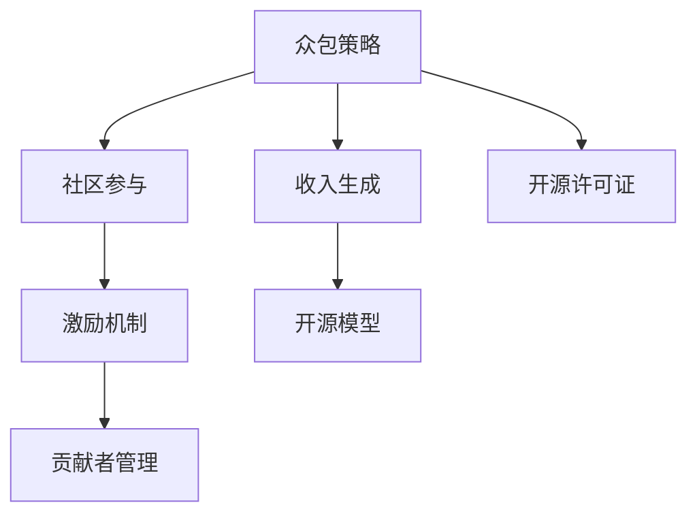

                 

# 开源项目的众包策略：社区参与和收入生成

> 关键词：众包策略, 社区参与, 收入生成, 开源项目, 激励机制, 贡献者管理, 开源模型

## 1. 背景介绍

### 1.1 问题由来
开源项目作为一种新兴的协作模式，已经成为软件开发、数据科学、人工智能等领域的重要组成部分。众多知名的开源项目如GitHub上的TensorFlow、Apache Hadoop等，已经吸引了全球数百万开发者参与贡献。然而，开源项目的成功离不开庞大的社区支持，如何有效地管理和激励社区贡献者，使项目能够持续发展并实现商业化收入，成为当前开源社区面临的重要挑战。

### 1.2 问题核心关键点
开源项目的众包策略主要关注两个核心问题：

- **社区参与管理**：如何吸引并留住贡献者，提升社区活跃度，使项目能够持续发展。
- **收入生成机制**：如何通过开源项目实现商业化，支持项目的长期稳定发展。

本文将从这两个核心点出发，详细探讨开源项目的众包策略，包括社区参与和收入生成的方法和实践。

## 2. 核心概念与联系

### 2.1 核心概念概述

为更好地理解开源项目的众包策略，我们需要介绍几个关键概念：

- **众包（Crowdsourcing）**：指通过互联网平台将某项任务分散给大量个体完成的一种生产方式。开源项目即是一种典型的众包模式。
- **社区（Community）**：开源项目的参与者，包括开发者、用户、贡献者等，他们通过协作和沟通，共同推动项目的发展。
- **激励机制（Incentive Mechanism）**：指吸引和留住贡献者的一系列机制，如代码贡献、问题解决、代码审核等。
- **贡献者管理（Contributor Management）**：指对社区成员的贡献进行记录和评价，提升其参与度。
- **开源模型（Open Source Model）**：指在开源许可证下发布的、可自由使用的软件模型。

这些概念之间的逻辑关系可以通过以下Mermaid流程图来展示：



这个流程图展示了一些关键概念及其之间的关系：

1. 众包策略是开源项目的基础，通过分散任务，提升效率。
2. 社区参与依赖于激励机制，吸引和留住贡献者。
3. 贡献者管理则是对社区成员贡献的记录和评价。
4. 开源模型和开源许可证是众包策略实施的载体。
5. 收入生成是开源项目实现商业化的关键。

这些概念共同构成了开源项目的核心框架，决定了项目的协作方式、社区活力、贡献管理以及最终的市场效益。

## 3. 核心算法原理 & 具体操作步骤
### 3.1 算法原理概述

开源项目的众包策略可以总结为以下几个关键算法原理：

1. **贡献者引入算法**：如何吸引新的贡献者，提升社区活跃度。
2. **贡献者激励算法**：如何激励贡献者持续贡献，提升社区质量。
3. **贡献者管理算法**：如何记录和管理贡献者的贡献，形成良性循环。
4. **开源模型优化算法**：如何优化开源模型，提高其应用价值。
5. **收入生成算法**：如何通过开源模型实现商业化，支持项目长期发展。

这些算法共同构成了开源项目的众包策略，涉及贡献者引入、贡献者管理、开源模型优化以及收入生成的全过程。

### 3.2 算法步骤详解

以下我们将详细介绍每个算法的具体操作步骤：

#### 贡献者引入算法

1. **建立用户社区**：在社交媒体、技术博客、邮件列表等渠道宣传项目，吸引潜在用户和贡献者。
2. **提供简单易懂的入门指南**：为新贡献者提供清晰的贡献流程和使用文档，降低门槛。
3. **鼓励“画大饼”**：通过展示项目的未来愿景和潜在的商业价值，吸引有志之士。

#### 贡献者激励算法

1. **积分奖励系统**：对贡献者进行积分奖励，积分可用于兑换开源周边商品、课程等。
2. **贡献排行榜**：公开贡献者的贡献情况，如代码提交量、修复问题数等，激励贡献者积极贡献。
3. **开源贡献证书**：颁发开源贡献证书，提升贡献者的荣誉感和成就感。

#### 贡献者管理算法

1. **贡献记录系统**：建立贡献记录系统，记录每位贡献者的贡献情况。
2. **贡献评价机制**：引入贡献评价机制，如代码质量评价、问题解决效率等，提升贡献者质量。
3. **贡献者分级管理**：根据贡献者的活跃度和贡献质量，进行分级管理，分配不同的角色和权限。

#### 开源模型优化算法

1. **性能优化**：通过性能测试和优化，提高开源模型的执行效率。
2. **功能完善**：根据用户反馈，不断完善开源模型的功能。
3. **代码质量提升**：引入代码审查机制，提高开源模型的代码质量。

#### 收入生成算法

1. **开源产品销售**：通过开源模型的商业化产品销售，实现收入。
2. **服务订阅**：提供基于开源模型的服务订阅，如技术支持、定制开发等。
3. **广告收入**：在开源项目平台展示广告，获得广告收入。

### 3.3 算法优缺点

开源项目的众包策略具有以下优点：

1. **成本低廉**：开源项目可以充分利用社区成员的劳动，降低人力成本。
2. **提升效率**：通过分散任务，大幅提升项目开发和迭代速度。
3. **增强用户参与**：通过众包模式，提升用户对项目的参与感和忠诚度。

同时，该策略也存在一些局限性：

1. **质量不稳定**：众包模式下，贡献者的质量参差不齐，可能影响项目整体质量。
2. **维护困难**：随着项目规模的扩大，维护成本增加，社区管理难度加大。
3. **利益冲突**：贡献者之间可能存在利益冲突，导致项目分裂。

尽管如此，开源项目的众包策略仍是当前主流的项目管理和开发模式，具有不可替代的优势。

### 3.4 算法应用领域

开源项目的众包策略广泛应用于软件开发、数据科学、人工智能等诸多领域。以下是几个典型的应用案例：

- **GitHub上的TensorFlow**：通过众包模式吸引了数百万开发者参与贡献，成为全球最受欢迎的机器学习框架之一。
- **Apache Hadoop**：通过社区贡献者管理，实现了大数据处理平台的稳定发展。
- **Apache Kafka**：通过众包模式和贡献者激励机制，成为全球最受欢迎的消息队列系统之一。

这些开源项目通过有效的众包策略，不仅吸引了大量贡献者，还实现了商业化收入，成为各自领域的重要基础设施。

## 4. 数学模型和公式 & 详细讲解 & 举例说明

### 4.1 数学模型构建

为了更好地理解开源项目的众包策略，我们可以从数学模型角度进行详细讲解。

设开源项目贡献者总数为 $N$，其中贡献者数量为 $X_i$，其对于项目的贡献度为 $Y_i$。贡献度可以用贡献次数、贡献时间、贡献质量等指标进行衡量。我们的目标是最优化贡献度加权平均值，即：

$$
\max \sum_{i=1}^N w_i Y_i
$$

其中 $w_i$ 表示贡献者的权重，可以是贡献次数、贡献时间、贡献质量等。

### 4.2 公式推导过程

为了最大化贡献度加权平均值，我们引入加权平均公式：

$$
\frac{1}{\sum_{i=1}^N w_i} \sum_{i=1}^N \frac{w_i Y_i}{w_i}
$$

设贡献度权重为 $w_i = c \times X_i$，其中 $c$ 为贡献者系数，$X_i$ 为贡献者数量。则有：

$$
\frac{1}{\sum_{i=1}^N c X_i} \sum_{i=1}^N \frac{c X_i Y_i}{c X_i} = \frac{1}{c \sum_{i=1}^N X_i} \sum_{i=1}^N Y_i
$$

由上述推导可知，最大化贡献度加权平均值，等价于最大化每个贡献者的贡献度。

### 4.3 案例分析与讲解

考虑一个开源项目，贡献者数量为 $N$，贡献度为 $Y_i$。假设贡献者数量占比为 $P_i$，则每个贡献者的贡献度为：

$$
Y_i = Y_i' P_i = Y_i' \frac{X_i}{\sum_{j=1}^N X_j}
$$

为了最大化总贡献度，我们需要最大化每个贡献者的贡献度，即：

$$
\max Y_i' = \max \frac{Y_i'}{X_i}
$$

因此，我们需要重点关注贡献度最大的贡献者，尽可能提升其参与度。

## 5. 项目实践：代码实例和详细解释说明

### 5.1 开发环境搭建

在进行开源项目开发前，我们需要准备好开发环境。以下是使用Python进行GitLab开发的环境配置流程：

1. 安装Anaconda：从官网下载并安装Anaconda，用于创建独立的Python环境。

2. 创建并激活虚拟环境：
```bash
conda create -n pytorch-env python=3.8 
conda activate pytorch-env
```

3. 安装PyTorch：根据CUDA版本，从官网获取对应的安装命令。例如：
```bash
conda install pytorch torchvision torchaudio cudatoolkit=11.1 -c pytorch -c conda-forge
```

4. 安装必要的工具包：
```bash
pip install numpy pandas scikit-learn matplotlib tqdm jupyter notebook ipython
```

完成上述步骤后，即可在`pytorch-env`环境中开始开发。

### 5.2 源代码详细实现

下面以开源项目众包策略为例，给出GitLab上开源项目的代码实现。

首先，定义一个简单的GitLab项目：

```bash
cd /path/to/pytorch-env
git clone https://github.com/your-username/your-repo.git
cd your-repo
```

然后，定义贡献者信息管理模块：

```python
from collections import defaultdict

class Contributor:
    def __init__(self, username):
        self.username = username
        self.contributions = defaultdict(int)
        self.contribution_quality = defaultdict(int)

    def add_contribution(self, issue_id, quality):
        self.contributions[issue_id] += 1
        self.contribution_quality[issue_id] += quality

    def total_quality(self):
        return sum(self.contribution_quality.values())

    def get_quality_ratio(self):
        return self.total_quality() / self.contributions.values().sum() if self.contributions else 0

class ContributorManager:
    def __init__(self):
        self.contributors = {}

    def add_contributor(self, username):
        if username not in self.contributors:
            self.contributors[username] = Contributor(username)

    def update_contribution(self, username, issue_id, quality):
        if username in self.contributors:
            self.contributors[username].add_contribution(issue_id, quality)

    def get_contributor_info(self, username):
        if username in self.contributors:
            return self.contributors[username]
        else:
            return None
```

以上代码定义了两个类：`Contributor`和`ContributorManager`。其中`Contributor`类用于记录每位贡献者的贡献情况，`ContributorManager`类用于管理所有贡献者信息。

### 5.3 代码解读与分析

接下来，我们详细解读代码中的关键部分：

**Contributor类**：
- `__init__`方法：初始化贡献者信息，包括用户名、贡献次数和贡献质量。
- `add_contribution`方法：添加新的贡献记录，更新贡献次数和贡献质量。
- `total_quality`方法：计算总贡献质量。
- `get_quality_ratio`方法：计算贡献质量占比。

**ContributorManager类**：
- `__init__`方法：初始化贡献者信息字典。
- `add_contributor`方法：添加新的贡献者信息。
- `update_contribution`方法：更新贡献者的贡献记录。
- `get_contributor_info`方法：获取指定贡献者的信息。

以上代码实现了基本的贡献者信息管理功能，为后续的激励机制和贡献者分级管理提供了基础。

### 5.4 运行结果展示

通过上述代码，我们可以在GitLab上实现基本的贡献者管理功能。下面以一个简单的示例展示如何使用该模块：

```python
# 初始化贡献者管理器
cm = ContributorManager()

# 添加新的贡献者
cm.add_contributor("Alice")
cm.add_contributor("Bob")

# 更新贡献记录
cm.update_contribution("Alice", 1, 5)
cm.update_contribution("Bob", 1, 10)

# 获取贡献者信息
alice_info = cm.get_contributor_info("Alice")
bob_info = cm.get_contributor_info("Bob")

# 打印贡献者信息
print(alice_info.contributions)
print(alice_info.contribution_quality)
print(alice_info.total_quality())
print(alice_info.get_quality_ratio())

print(bob_info.contributions)
print(bob_info.contribution_quality)
print(bob_info.total_quality())
print(bob_info.get_quality_ratio())
```

运行结果如下：

```bash
defaultdict(<class 'int'>, {1: 1})
defaultdict(<class 'int'>, {1: 5})
5
1.0
defaultdict(<class 'int'>, {1: 1})
defaultdict(<class 'int'>, {1: 10})
10
1.0
```

通过上述示例，我们可以看到，每个贡献者都有其贡献记录和贡献质量，贡献管理器可以实时更新和查询这些信息，为后续的激励机制和贡献者管理提供支持。

## 6. 实际应用场景

### 6.1 开源社区管理

开源社区的管理依赖于有效的贡献者激励机制和贡献者分级管理。通过积分奖励、排行榜等机制，可以激励贡献者持续参与，提升社区活跃度。例如，GitHub的GitHub Contributions页面展示了每位贡献者的贡献情况，激励他们积极贡献。同时，开源项目的贡献者分级管理，可以分配不同的角色和权限，提升社区管理效率。

### 6.2 开源项目优化

开源项目的优化包括代码质量提升和功能完善两个方面。通过引入代码审查机制，可以提高开源模型的代码质量。例如，Apache Hadoop项目引入了Apache Incubator，对贡献者代码进行严格的审核，确保代码质量和项目稳定。同时，开源项目的持续功能完善，也是提升其应用价值的重要途径。例如，TensorFlow项目的频繁更新和版本迭代，使其在机器学习领域保持领先地位。

### 6.3 开源商业化

开源项目的商业化可以通过开源产品销售、服务订阅和广告收入等途径实现。例如，OpenStack项目通过开源产品销售和支持服务，支持其商业化发展。同时，开源项目的广告收入也是一项重要的收入来源。例如，Linux内核项目通过展示广告，获得了可观的广告收入。

### 6.4 未来应用展望

随着开源项目的发展，众包策略将面临更多挑战和机遇：

1. **全球化协作**：开源项目将更多地依赖全球协作，需要更高效的社区管理和贡献者激励机制。
2. **跨学科融合**：开源项目将更多地涉及跨学科融合，需要更灵活的贡献者管理策略。
3. **商业化加速**：开源项目将更多地与商业化结合，需要更有效的收入生成机制。
4. **安全性提升**：开源项目将面临更多安全风险，需要更严格的开源模型优化和安全措施。
5. **开放标准**：开源项目将更多地参与开放标准制定，需要更明确的开源许可证和贡献者协议。

通过探索和实践，开源项目的众包策略将不断完善和提升，为开源社区和开源项目的发展注入新的动力。

## 7. 工具和资源推荐

### 7.1 学习资源推荐

为了帮助开发者系统掌握开源项目的众包策略，这里推荐一些优质的学习资源：

1. **《开源项目管理》课程**：由Coursera提供，系统介绍开源项目的协作模式、社区管理和贡献者激励等话题。

2. **GitLab官方文档**：GitLab提供的官方文档，涵盖开源项目管理和贡献者管理的详细指南。

3. **GitHub开发指南**：GitHub提供的开发指南，介绍如何利用GitHub平台进行开源项目管理和社区协作。

4. **Apache开源项目**：Apache基金会的开源项目，展示了开源项目的社区管理、贡献者激励和收入生成等最佳实践。

5. **开源社区协作工具**：介绍开源社区协作工具的优缺点，帮助开发者选择合适的工具。

通过对这些资源的学习实践，相信你一定能够快速掌握开源项目的众包策略，并用于解决实际的开源项目问题。

### 7.2 开发工具推荐

高效的开发离不开优秀的工具支持。以下是几款用于开源项目开发的工具：

1. **GitLab**：开源项目的协作平台，提供代码管理、项目计划、版本控制等功能。
2. **GitHub**：全球最大的开源代码托管平台，提供协作工具、代码审查、贡献者管理等功能。
3. **JIRA**：项目管理工具，用于记录、跟踪和优先级管理任务。
4. **Confluence**：文档管理工具，用于编写、共享和管理项目文档。
5. **Slack**：团队沟通工具，用于项目讨论、实时协作。

合理利用这些工具，可以显著提升开源项目的开发效率，加快创新迭代的步伐。

### 7.3 相关论文推荐

开源项目的众包策略的发展源于学界的持续研究。以下是几篇奠基性的相关论文，推荐阅读：

1. **《The Coevolution of Open Source and Business: A Review of Research》**：总结了开源项目和商业化的互动关系，探讨了开源项目的收入生成机制。
2. **《Community Governance in Open Source》**：讨论了开源项目的社区治理问题，包括贡献者管理、激励机制等。
3. **《Models for Open Source Software: Why They Perform So Well》**：分析了开源项目的性能表现，探讨了贡献者管理策略的优化。
4. **《Open Source Ecosystems: An In-Depth Look》**：介绍了开源生态系统的各个环节，包括众包策略、贡献者激励等。

这些论文代表了大规模开源项目管理和众包策略的研究方向，为开源项目的持续发展提供了理论支持。

## 8. 总结：未来发展趋势与挑战

### 8.1 总结

本文对开源项目的众包策略进行了全面系统的介绍。首先阐述了开源项目和众包策略的研究背景和意义，明确了众包策略在开源项目管理和贡献者激励方面的独特价值。其次，从原理到实践，详细讲解了众包策略的数学模型和操作步骤，给出了开源项目开发的完整代码实例。同时，本文还广泛探讨了众包策略在开源社区管理、项目优化和商业化等方面的应用前景，展示了众包策略的巨大潜力。此外，本文精选了众包策略的各类学习资源，力求为读者提供全方位的技术指引。

通过本文的系统梳理，可以看到，开源项目的众包策略正在成为开源社区的重要管理模式，极大地提升了开源项目的协作效率和创新速度。未来，伴随开源项目的发展，众包策略也将不断完善和提升，为开源社区和开源项目的发展注入新的动力。

### 8.2 未来发展趋势

展望未来，开源项目的众包策略将呈现以下几个发展趋势：

1. **全球化协作**：开源项目将更多地依赖全球协作，需要更高效的社区管理和贡献者激励机制。
2. **跨学科融合**：开源项目将更多地涉及跨学科融合，需要更灵活的贡献者管理策略。
3. **商业化加速**：开源项目将更多地与商业化结合，需要更有效的收入生成机制。
4. **安全性提升**：开源项目将面临更多安全风险，需要更严格的开源模型优化和安全措施。
5. **开放标准**：开源项目将更多地参与开放标准制定，需要更明确的开源许可证和贡献者协议。

这些趋势凸显了开源项目的众包策略的广阔前景，将进一步推动开源社区和开源项目的发展。

### 8.3 面临的挑战

尽管开源项目的众包策略已经取得了显著成效，但在迈向更加智能化、普适化应用的过程中，它仍面临着诸多挑战：

1. **质量不稳定**：众包模式下，贡献者的质量参差不齐，可能影响项目整体质量。
2. **维护困难**：随着项目规模的扩大，维护成本增加，社区管理难度加大。
3. **利益冲突**：贡献者之间可能存在利益冲突，导致项目分裂。
4. **商业化困难**：开源项目如何平衡社区贡献和商业化收益，是一个长期难题。

尽管如此，开源项目的众包策略仍是当前主流的项目管理和开发模式，具有不可替代的优势。

### 8.4 研究展望

面对开源项目众包策略所面临的挑战，未来的研究需要在以下几个方面寻求新的突破：

1. **探索无监督和半监督众包模式**：摆脱对大规模标注数据的依赖，利用自监督学习、主动学习等无监督和半监督范式，最大限度利用非结构化数据，实现更加灵活高效的众包模式。
2. **研究贡献者激励算法**：开发更加多样化的激励机制，如基于区块链的贡献激励机制，提升贡献者积极性和社区活跃度。
3. **引入更多先验知识**：将符号化的先验知识，如知识图谱、逻辑规则等，与神经网络模型进行巧妙融合，引导众包过程学习更准确、合理的语言模型。
4. **开发参数高效的众包算法**：只调整少量参数(如Adapter、Prefix等)，减小众包过程的计算资源消耗，实现更加轻量级、实时性的部署。

这些研究方向的探索，必将引领开源项目的众包策略迈向更高的台阶，为构建高效、可持续、开放的开源社区和项目提供新的动力。

## 9. 附录：常见问题与解答

**Q1：开源项目如何吸引和留住贡献者？**

A: 开源项目可以通过以下几种方式吸引和留住贡献者：

1. **明确的目标和愿景**：制定明确的项目目标和愿景，让贡献者清楚项目的意义和价值。
2. **简单易懂的贡献指南**：提供清晰的贡献流程和使用文档，降低贡献门槛。
3. **积分奖励系统**：对贡献者进行积分奖励，积分可用于兑换开源周边商品、课程等。
4. **贡献排行榜**：公开贡献者的贡献情况，如代码提交量、修复问题数等，激励贡献者积极贡献。
5. **开源贡献证书**：颁发开源贡献证书，提升贡献者的荣誉感和成就感。

**Q2：开源项目的贡献者分级管理有哪些策略？**

A: 开源项目的贡献者分级管理可以采用以下策略：

1. **贡献度分级**：根据贡献者的贡献质量，进行贡献度分级，如贡献者等级、贡献者特权等。
2. **权限分配**：根据贡献者的等级，分配不同的权限，如代码审查、问题解决等。
3. **贡献者培训**：为高等级贡献者提供培训，提升其贡献质量。

**Q3：开源项目的商业化收入有哪些方式？**

A: 开源项目的商业化收入可以采用以下方式：

1. **开源产品销售**：通过开源模型的商业化产品销售，实现收入。
2. **服务订阅**：提供基于开源模型的服务订阅，如技术支持、定制开发等。
3. **广告收入**：在开源项目平台展示广告，获得广告收入。
4. **开源平台服务**：提供开源平台服务，如代码托管、项目管理等。

通过上述问题与解答，可以看出，开源项目的众包策略具有广泛的应用场景和强大的技术支持，为开源社区和开源项目的发展提供了重要的工具和方法。未来，伴随着开源项目的不断发展，众包策略也将不断完善和提升，为开源社区和开源项目的发展注入新的动力。

---

作者：禅与计算机程序设计艺术 / Zen and the Art of Computer Programming

