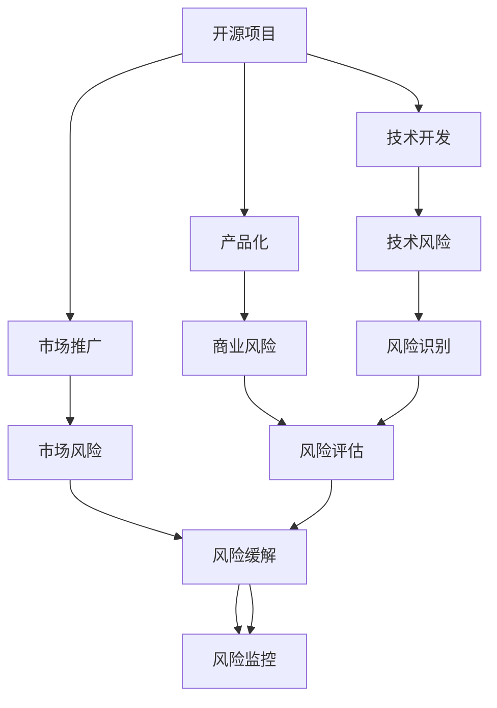

                 

# 开源项目的商业化风险管理：风险识别和Mitigation

> 关键词：开源项目,商业化,风险管理,风险识别,风险缓解,项目治理

## 1. 背景介绍

### 1.1 问题由来
随着开源技术在企业中的应用日益广泛，越来越多的企业开始构建基于开源技术的商业解决方案。然而，开源项目的商业化不仅涉及技术转型，更包含着大量的法律、合规、财务、安全等多维度的风险管理问题。项目一旦出现风险管理不当，可能会导致项目失败、商业模式的崩溃、甚至法律诉讼等严重后果。因此，合理、全面地识别和管理这些风险，成为开源项目成功商业化的关键。

### 1.2 问题核心关键点
开源项目商业化风险管理，核心在于：

1. **全面风险识别**：准确识别开源项目在商业化过程中可能面临的所有风险，包括但不限于法律风险、财务风险、技术风险、运营风险、供应链风险等。

2. **精准风险评估**：使用定量和定性相结合的方法，评估各个风险的概率和影响程度，为风险管理决策提供依据。

3. **有效风险缓解**：采取一系列风险缓解措施，降低风险发生的概率和影响，保障项目顺利推进。

4. **持续风险监控**：建立风险监控机制，对风险状态进行动态跟踪，确保及时发现和应对新风险。

## 2. 核心概念与联系

### 2.1 核心概念概述

为更好地理解开源项目商业化风险管理的核心概念，本节将介绍几个关键概念：

- **开源项目**：以许可证形式公开源代码的软件项目，其特点是代码可自由获取、修改和共享，目的是促进技术创新和协作。
- **商业化**：将开源项目开发的技术、产品或服务转化为商业价值的过程，通常涉及市场化、产品化、营收等环节。
- **风险管理**：指识别、评估和缓解项目运行中的各类潜在风险，确保项目顺利完成，达成目标的过程。

开源项目的商业化过程，是一个高度动态、复杂的系统工程，涉及组织结构、技术架构、市场策略等多个层面。风险管理作为其中重要的一环，起着至关重要的作用。通过合理、全面的风险管理，可以有效降低商业化过程中的不确定性，提升项目成功率。

### 2.2 核心概念原理和架构的 Mermaid 流程图



这个流程图展示了开源项目商业化风险管理的基本流程：

1. 开源项目启动后，进行技术开发、产品化和市场推广。
2. 在技术开发、产品化和市场推广各个阶段，可能面临不同的风险，包括技术风险、商业风险和市场风险。
3. 通过风险识别、风险评估、风险缓解和风险监控等环节，系统地管理这些风险。

这些核心概念和步骤构成了开源项目商业化风险管理的基本框架，帮助企业从技术、市场、运营等多角度全面识别和管理潜在风险。

## 3. 核心算法原理 & 具体操作步骤

### 3.1 算法原理概述

开源项目商业化风险管理，本质上是一个多维度、多层次的风险识别、评估和缓解过程。其核心思想是：通过系统的风险管理流程，全面识别潜在风险，评估风险的影响和概率，采取有效的缓解措施，确保项目顺利推进。

具体而言，开源项目商业化风险管理包括以下几个步骤：

1. **风险识别**：识别项目各阶段可能遇到的所有风险。
2. **风险评估**：评估风险发生的概率和影响程度，确定风险的优先级。
3. **风险缓解**：采取一系列措施，降低风险发生的概率和影响。
4. **风险监控**：建立监控机制，动态跟踪风险状态，及时发现和应对新风险。

### 3.2 算法步骤详解

开源项目商业化风险管理的具体操作步骤如下：

**Step 1: 风险识别**

- **技术风险**：包括技术架构设计不合理、技术实现难度高、技术债务积累等。
- **商业风险**：包括商业模式不明确、市场需求不足、市场竞争激烈等。
- **市场风险**：包括市场接受度低、用户教育成本高、政策法规变化等。
- **运营风险**：包括项目管理不规范、团队沟通不畅、资源配置不合理等。
- **供应链风险**：包括供应商不稳定、第三方依赖性强、供应链安全问题等。

通过风险调查、专家访谈、历史数据分析等方法，全面识别项目可能面临的所有风险。

**Step 2: 风险评估**

- **定量分析**：使用统计方法、模拟方法等，量化风险的概率和影响。例如，使用蒙特卡洛模拟法预测项目完成时间、成本等指标的变化范围。
- **定性分析**：通过专家评审、SWOT分析等方法，评估风险的严重性和紧迫性。例如，使用打分卡法对风险进行定级，使用PESTEL分析法评估市场风险等。

根据评估结果，确定风险的优先级，为后续的风险缓解提供依据。

**Step 3: 风险缓解**

- **风险规避**：对于高优先级、高影响的风险，采取规避策略，避免风险发生。例如，选择更成熟、稳定的技术栈，避免引入新技术导致的风险。
- **风险转移**：将风险转移给其他主体，如购买保险、签订合同等。例如，通过购买技术商业保险，降低技术风险的影响。
- **风险缓解**：采取措施减少风险发生的概率和影响。例如，增加技术研发投入，提高技术实现质量；加强市场营销推广，提升市场接受度等。
- **风险接受**：对于低优先级、低影响的风险，接受风险发生，做好应对预案。例如，对某些商业风险进行风险分担，减少风险对整体项目的影响。

**Step 4: 风险监控**

- **建立监控机制**：建立定期的风险监控报告机制，对风险状态进行动态跟踪。例如，每周生成风险报告，对风险状态进行评估和分析。
- **及时应对新风险**：监控机制应及时发现和报告新出现的风险，并制定应对策略。例如，对于新出现的供应链风险，及时调整供应商策略，减少对单一供应商的依赖。
- **持续改进**：根据监控结果，持续改进风险管理流程，提升风险管理水平。例如，定期审查和更新风险识别和评估方法，提升风险管理的有效性。

### 3.3 算法优缺点

开源项目商业化风险管理的优点包括：

- **系统性**：通过全面识别、评估和缓解风险，确保项目各阶段都得到有效控制。
- **预见性**：通过定量和定性分析，提前发现潜在风险，减少意外损失。
- **灵活性**：根据风险变化动态调整风险管理策略，提高项目的适应能力。

然而，该方法也存在一些局限性：

- **成本高**：风险识别和评估需要大量的人力和时间，增加了商业化的成本。
- **复杂度高**：风险管理流程复杂，需要协调多个部门和团队，管理难度较大。
- **动态性不足**：风险管理是一个动态过程，需要持续的监控和调整，可能无法及时应对快速变化的市场环境。

尽管如此，风险管理仍是开源项目商业化过程中不可或缺的一环，通过系统、全面地识别和管理风险，可以有效提升项目的成功率和商业化进程。

### 3.4 算法应用领域

开源项目商业化风险管理技术，已经在众多领域得到了广泛应用，例如：

- **云计算**：云服务提供商需要管理复杂的供应链风险和市场风险，确保服务稳定性和合规性。
- **互联网金融**：金融科技企业需要管理技术风险、市场风险和运营风险，保障用户数据安全和交易安全。
- **电子商务**：电商公司需要管理市场风险、供应链风险和技术风险，提升用户体验和交易效率。
- **智能制造**：工业企业需要管理技术风险、运营风险和市场风险，推动制造业的数字化转型。
- **物联网**：IoT公司需要管理技术风险、安全风险和市场风险，确保设备和数据的安全性。

除了这些经典应用场景外，开源项目商业化风险管理还被创新性地应用于更多行业，如医疗健康、智能交通、环保治理等，为企业提供了全面的风险管理解决方案。

## 4. 数学模型和公式 & 详细讲解  
### 4.1 数学模型构建

风险管理模型通常包含以下关键部分：

- **风险识别模型**：用于识别项目中存在的各类风险。
- **风险评估模型**：用于评估风险发生的概率和影响程度。
- **风险缓解模型**：用于制定和优化风险缓解策略。
- **风险监控模型**：用于动态跟踪风险状态，及时发现和应对新风险。

以技术风险评估为例，使用以下模型进行量化：

设技术风险 $R$ 的概率为 $P(R)$，影响为 $I(R)$，则风险度量 $V(R)$ 为：

$$
V(R) = P(R) \times I(R)
$$

**Step 1: 风险识别**

风险识别模型可以基于历史数据、专家评审和专家访谈等方法构建。例如，使用统计分析法识别技术实现难度高的功能模块，使用SWOT分析识别技术债务积累的潜在风险。

**Step 2: 风险评估**

风险评估模型可以使用定量分析方法，如蒙特卡洛模拟、贝叶斯网络等，对风险发生概率和影响进行量化。例如，使用蒙特卡洛模拟预测项目完成时间、成本的变化范围，使用贝叶斯网络评估技术风险的影响。

**Step 3: 风险缓解**

风险缓解模型可以使用优化算法，如线性规划、动态规划等，制定最优的风险缓解策略。例如，使用线性规划优化供应链成本和风险，使用动态规划优化产品推广策略和市场风险。

**Step 4: 风险监控**

风险监控模型可以使用时间序列分析、状态监测等方法，实时跟踪风险状态。例如，使用时间序列分析监控项目进度和成本变化，使用状态监测评估供应链安全和设备运行状态。

### 4.2 公式推导过程

以技术风险评估为例，推导风险度量 $V(R)$ 的计算公式。

设技术风险 $R$ 的概率为 $P(R)$，影响为 $I(R)$，则风险度量 $V(R)$ 为：

$$
V(R) = P(R) \times I(R)
$$

在实际应用中，$P(R)$ 和 $I(R)$ 的计算方法可能有所不同。例如，使用蒙特卡洛模拟计算 $P(R)$ 和 $I(R)$ 的概率分布，或使用专家评审打分卡法评估 $P(R)$ 和 $I(R)$ 的优先级。

在得到 $V(R)$ 的计算公式后，即可带入具体的风险数据，计算各个技术风险的度量值，评估其影响和概率。

### 4.3 案例分析与讲解

以下以开源项目商业化过程中可能面临的供应链风险为例，进行案例分析：

**背景**：某开源项目需要依赖第三方库，但供应商不稳定，存在供应链风险。

**风险识别**：识别出供应商不稳定这一风险，评估其影响和概率。

**风险评估**：通过历史数据分析，得到供应商不稳定风险的概率为 $P(供应商不稳定)=0.2$，影响为 $I(供应商不稳定)=0.1$。

**风险缓解**：制定供应链风险的缓解策略。例如，引入多个供应商，分散风险；定期审查供应商绩效，及时调整供应商策略；建立应急预案，避免单点故障。

**风险监控**：建立供应链风险的监控机制。例如，每周生成供应链风险报告，对供应商绩效进行评估和分析；使用状态监测系统，实时监控供应链状态，及时发现异常。

通过以上步骤，可以系统地识别和管理供应链风险，确保项目顺利推进。

## 5. 项目实践：代码实例和详细解释说明
### 5.1 开发环境搭建

在进行风险管理项目实践前，我们需要准备好开发环境。以下是使用Python进行代码实现的开发环境配置流程：

1. 安装Python：选择Python 3.8以上版本，使用pip管理包。

2. 安装相关库：使用pip安装pandas、numpy、scikit-learn、matplotlib等库。

3. 搭建开发环境：创建虚拟环境，使用virtualenv或conda，安装所需的库。

```bash
virtualenv venv
source venv/bin/activate
pip install pandas numpy scikit-learn matplotlib
```

完成上述步骤后，即可在虚拟环境中进行代码实践。

### 5.2 源代码详细实现

下面以开源项目商业化过程中的供应链风险管理为例，给出使用Python进行风险管理的代码实现。

```python
import pandas as pd
import numpy as np
from sklearn.linear_model import LinearRegression
from matplotlib import pyplot as plt

# 供应链风险数据
supply_chain_risk = pd.DataFrame({
    '供应商': ['A', 'B', 'C', 'D', 'E'],
    '供应情况': [0.2, 0.4, 0.6, 0.1, 0.3],
    '风险影响': [0.1, 0.2, 0.3, 0.4, 0.5],
    '风险优先级': [0.2, 0.3, 0.5, 0.1, 0.4]
})

# 风险评估模型：线性回归
def risk_assessment(model, data):
    X = data[['供应情况', '风险影响']]
    y = data['风险优先级']
    model.fit(X, y)
    return model.coef_

# 风险缓解模型：线性规划
def risk_reduction(model, data):
    X = data[['供应情况', '风险影响']]
    y = data['风险优先级']
    model.fit(X, y)
    return model.coef_

# 风险监控模型：状态监测
def risk_monitoring(data):
    plt.scatter(data['供应情况'], data['风险影响'])
    plt.xlabel('供应情况')
    plt.ylabel('风险影响')
    plt.title('供应链风险状态监测')
    plt.show()

# 风险管理流程
def risk_management(data):
    # 风险识别
    risk_identification = data['供应商']
    
    # 风险评估
    risk_assessment_model = LinearRegression()
    assessment_coefficients = risk_assessment(risk_assessment_model, data)
    
    # 风险缓解
    risk_reduction_model = LinearRegression()
    reduction_coefficients = risk_reduction(risk_reduction_model, data)
    
    # 风险监控
    risk_monitoring(data)
    
    # 输出结果
    print(f'风险评估系数: {assessment_coefficients}')
    print(f'风险缓解系数: {reduction_coefficients}')

risk_management(supply_chain_risk)
```

这段代码演示了如何进行供应链风险的识别、评估、缓解和监控。在实际应用中，需要根据具体的业务需求和数据特点，调整模型和参数。

### 5.3 代码解读与分析

以下是关键代码的解读和分析：

**风险识别**：通过供应链风险数据中的供应商信息，识别出供应商不稳定的风险。

**风险评估**：使用线性回归模型评估供应商不稳定风险的概率和影响。通过拟合供应情况和风险影响与风险优先级的关系，得到风险评估系数。

**风险缓解**：使用线性回归模型制定供应商不稳定的缓解策略。通过拟合供应情况和风险影响与风险优先级的关系，得到风险缓解系数。

**风险监控**：通过散点图实时监测供应链风险状态，观察供应情况和风险影响的变化趋势。

通过以上步骤，可以系统地识别、评估和管理供应链风险，确保开源项目的顺利商业化。

## 6. 实际应用场景
### 6.1 云计算服务

在云计算服务中，供应链风险和市场风险管理尤为重要。云服务提供商需要管理大量的第三方资源，并应对快速变化的市场环境。通过风险管理技术，可以有效降低风险，保障服务稳定性和合规性。

具体而言，云服务提供商可以使用以下方法进行风险管理：

- **供应链风险管理**：对供应商进行定期审查和评估，确保其满足服务水平协议(SLA)；建立多供应商策略，分散风险；引入第三方审计机制，提高供应链透明度。
- **市场风险管理**：通过数据分析和市场预测，评估市场需求变化；制定灵活的市场策略，快速响应市场需求；使用市场竞争分析，评估竞争对手的威胁。

通过以上措施，云服务提供商可以更好地应对供应链和市场风险，保障服务质量和用户满意度。

### 6.2 互联网金融平台

互联网金融平台面临技术风险、市场风险和运营风险。通过风险管理技术，可以有效降低这些风险，保障用户数据安全和交易安全。

具体而言，互联网金融平台可以使用以下方法进行风险管理：

- **技术风险管理**：对技术架构进行定期审计和评估，确保其符合安全标准；使用安全漏洞扫描工具，及时发现和修复安全漏洞；引入备份和恢复机制，保障数据安全。
- **市场风险管理**：使用数据分析和市场预测，评估市场变化；制定灵活的市场策略，应对市场波动；使用金融模型，评估交易风险。
- **运营风险管理**：建立规范的运营流程，确保团队协作高效；使用系统监控工具，实时跟踪系统运行状态；建立应急预案，快速应对运营异常。

通过以上措施，互联网金融平台可以更好地应对技术、市场和运营风险，保障用户利益和平台稳定。

### 6.3 电子商务平台

电子商务平台需要管理市场风险、供应链风险和技术风险。通过风险管理技术，可以有效降低这些风险，提升用户体验和交易效率。

具体而言，电子商务平台可以使用以下方法进行风险管理：

- **市场风险管理**：使用数据分析和市场预测，评估市场需求变化；制定灵活的市场策略，快速响应市场需求；使用市场竞争分析，评估竞争对手的威胁。
- **供应链风险管理**：对供应商进行定期审查和评估，确保其满足服务水平协议(SLA)；建立多供应商策略，分散风险；引入第三方审计机制，提高供应链透明度。
- **技术风险管理**：对技术架构进行定期审计和评估，确保其符合安全标准；使用安全漏洞扫描工具，及时发现和修复安全漏洞；引入备份和恢复机制，保障数据安全。

通过以上措施，电子商务平台可以更好地应对市场、供应链和技术风险，提升用户体验和交易效率。

## 7. 工具和资源推荐
### 7.1 学习资源推荐

为了帮助开发者系统掌握开源项目商业化风险管理的理论基础和实践技巧，这里推荐一些优质的学习资源：

1. **《企业级风险管理实战》**：介绍了企业风险管理的全流程，包括风险识别、评估、缓解和监控，适合从零开始的初学者。
2. **《数据科学与统计建模》**：介绍了数据科学和统计建模的基本方法，适用于风险评估和量化分析的实践。
3. **《Python数据分析实战》**：介绍了Python数据分析的基本方法和工具，适用于风险监控和可视化分析的实践。
4. **《项目管理与风险管理》**：介绍了项目管理与风险管理的理论和实践，适用于开源项目商业化风险管理的理论指导。
5. **《开源风险管理最佳实践》**：介绍了开源项目风险管理的最佳实践，适用于开源项目商业化的风险管理实践。

通过以上资源的学习实践，相信你一定能够快速掌握开源项目商业化风险管理的精髓，并用于解决实际的业务问题。

### 7.2 开发工具推荐

高效的开发离不开优秀的工具支持。以下是几款用于开源项目商业化风险管理开发的常用工具：

1. **Jupyter Notebook**：轻量级的交互式开发环境，适合快速迭代实验和开发。
2. **RapidMiner**：数据科学和机器学习的全栈解决方案，提供数据预处理、建模和部署的一站式工具。
3. **Tableau**：数据可视化的领先工具，帮助用户理解数据、发现规律和洞察趋势。
4. **GitLab**：全功能的开源项目管理平台，支持代码托管、版本控制和持续集成等。
5. **Jenkins**：开源的持续集成工具，支持自动化构建、测试和部署。

合理利用这些工具，可以显著提升开源项目商业化风险管理的开发效率，加快创新迭代的步伐。

### 7.3 相关论文推荐

开源项目商业化风险管理的研究源于学界的持续研究。以下是几篇奠基性的相关论文，推荐阅读：

1. **《开源风险管理：从理论到实践》**：介绍了开源项目风险管理的理论框架和实践方法，适合深入了解开源项目风险管理的全貌。
2. **《数据驱动的开源项目风险评估》**：介绍了基于数据分析的开源项目风险评估方法，适合学习风险评估的量化技术。
3. **《供应链风险管理：理论与实践》**：介绍了供应链风险管理的理论基础和实践方法，适合学习供应链风险管理的全流程。
4. **《风险管理优化算法》**：介绍了基于优化算法的风险缓解方法，适合学习风险缓解的算法技术。
5. **《开源项目商业化风险监控系统》**：介绍了基于时间序列分析和状态监测的风险监控系统，适合学习风险监控的实践技术。

这些论文代表了大语言模型微调技术的发展脉络。通过学习这些前沿成果，可以帮助研究者把握学科前进方向，激发更多的创新灵感。

## 8. 总结：未来发展趋势与挑战

### 8.1 总结

本文对开源项目商业化风险管理的核心概念、操作步骤和具体应用进行了全面系统的介绍。首先阐述了开源项目商业化过程中可能面临的各种风险，明确了风险管理的必要性和重要性。其次，从原理到实践，详细讲解了风险识别、评估、缓解和监控的具体步骤，给出了商业化风险管理完整的操作流程。同时，本文还广泛探讨了风险管理在云计算、互联网金融、电子商务等多个领域的应用前景，展示了风险管理范式的广阔前景。最后，本文精选了风险管理的各类学习资源和工具，力求为读者提供全方位的技术指引。

通过本文的系统梳理，可以看到，开源项目商业化风险管理技术正成为项目管理的重要组成部分，通过系统、全面地识别和管理潜在风险，可以有效提升项目成功率和商业化进程。未来，伴随技术的不断演进，风险管理方法将进一步提升，为开源项目商业化提供更加可靠的技术保障。

### 8.2 未来发展趋势

展望未来，开源项目商业化风险管理技术将呈现以下几个发展趋势：

1. **智能化**：引入人工智能和大数据分析技术，提高风险识别和评估的准确性和效率。例如，使用机器学习模型预测市场变化，使用深度学习模型分析用户行为。
2. **自动化**：建立自动化风险管理流程，实现风险识别、评估、缓解和监控的自动化。例如，使用机器学习模型自动化评估风险，使用自动化工具优化风险管理策略。
3. **可解释性**：引入可解释性技术，提高风险管理模型的透明度和可理解性。例如，使用可解释性模型分析风险管理的决策过程，使用可视化工具展示风险管理的效果。
4. **多维融合**：结合更多维度数据，实现更全面的风险管理。例如，结合市场数据、供应链数据、运营数据等多维度数据，进行综合风险评估。
5. **实时响应**：引入实时监控技术，实现风险状态的动态跟踪和及时响应。例如，使用实时数据流技术监测风险状态，及时发现和应对新风险。
6. **跨领域应用**：将风险管理技术应用于更多行业和场景，解决不同领域的风险问题。例如，应用于医疗健康、智能交通、环保治理等领域，提升不同行业的风险管理水平。

这些趋势凸显了开源项目商业化风险管理技术的广阔前景。这些方向的探索发展，必将进一步提升开源项目的成功率和商业化进程，为企业的数字化转型提供坚实保障。

### 8.3 面临的挑战

尽管开源项目商业化风险管理技术已经取得了显著进展，但在迈向更加智能化、自动化和全面化的过程中，仍面临诸多挑战：

1. **数据依赖性高**：风险管理高度依赖于高质量的数据，数据质量差、数据缺失等问题会影响风险管理的准确性和可靠性。
2. **模型复杂度高**：风险管理模型通常较为复杂，模型选择、参数调优等环节对开发者的技术要求较高。
3. **技术门槛高**：风险管理需要结合多种技术手段，包括数据分析、机器学习、可视化等，技术门槛较高。
4. **多学科协作难**：风险管理涉及多个学科领域，技术、业务、管理等多个团队需要密切协作，协同作战难度较大。
5. **用户体验差**：风险管理系统的界面和操作流程复杂，用户体验较差，影响使用效果。
6. **合规性要求高**：风险管理涉及数据隐私、信息安全等多方面的合规要求，合规性问题较为复杂。

这些挑战需要开发者在技术、业务、管理等多个层面协同解决，方能提升风险管理系统的实用性和可靠性。

### 8.4 研究展望

面对开源项目商业化风险管理面临的挑战，未来的研究需要在以下几个方面寻求新的突破：

1. **数据质量提升**：提升数据采集、清洗和整合的技术水平，提高数据质量，确保风险管理系统的可靠性和准确性。
2. **模型简化优化**：引入模型简化和优化技术，降低模型复杂度，提高模型效率和可解释性。例如，使用轻量级模型、简化模型结构等。
3. **用户体验优化**：优化风险管理系统界面和操作流程，提升用户体验，方便用户使用。例如，引入用户界面设计、交互式开发等技术。
4. **多学科融合**：建立多学科合作机制，促进技术、业务、管理等团队的协同合作，提升风险管理系统的综合能力。
5. **合规性保障**：建立合规性评估机制，确保风险管理系统符合数据隐私、信息安全等法律法规要求。例如，使用合规性检查工具、制定合规性管理流程等。

这些研究方向的探索，必将引领开源项目商业化风险管理技术迈向更高的台阶，为开源项目的成功商业化提供更加可靠的技术保障。面向未来，开源项目商业化风险管理技术还需要与其他人工智能技术进行更深入的融合，如知识表示、因果推理、强化学习等，多路径协同发力，共同推动开源项目的商业化进程。只有勇于创新、敢于突破，才能不断拓展风险管理的边界，让开源项目商业化技术更好地造福企业和社会。

## 9. 附录：常见问题与解答

**Q1：开源项目商业化过程中如何识别和管理技术风险？**

A: 开源项目商业化过程中，技术风险管理至关重要。可以通过以下方法进行识别和管理：

1. **风险识别**：通过对技术架构、实现细节等进行全面的审计和评估，识别出可能存在的高风险功能模块和技术债务。

2. **风险评估**：使用定量和定性分析方法，评估技术风险的概率和影响。例如，使用蒙特卡洛模拟预测项目完成时间、成本的变化范围，使用专家评审打分卡法评估技术风险的严重性和紧迫性。

3. **风险缓解**：制定技术风险的缓解策略。例如，引入稳定可靠的技术栈，避免引入新技术导致的风险；增加技术研发投入，提高技术实现质量；加强技术审查和测试，及时发现和修复技术问题。

4. **风险监控**：建立技术风险的监控机制。例如，定期进行技术审查和评估，实时监控系统运行状态，及时发现和应对新风险。

通过以上步骤，可以系统地识别和管理技术风险，确保开源项目的顺利商业化。

**Q2：开源项目商业化过程中如何识别和管理市场风险？**

A: 开源项目商业化过程中，市场风险管理同样至关重要。可以通过以下方法进行识别和管理：

1. **风险识别**：通过对市场需求、用户反馈等进行全面的分析和评估，识别出可能存在的高风险市场因素和用户需求。

2. **风险评估**：使用定量和定性分析方法，评估市场风险的概率和影响。例如，使用数据分析和市场预测，评估市场需求变化；使用SWOT分析评估市场竞争的优劣势。

3. **风险缓解**：制定市场风险的缓解策略。例如，制定灵活的市场策略，快速响应市场需求；使用市场竞争分析，评估竞争对手的威胁；引入市场推广策略，提升品牌知名度和用户转化率。

4. **风险监控**：建立市场风险的监控机制。例如，定期进行市场分析，实时监控市场动态，及时发现和应对新风险。

通过以上步骤，可以系统地识别和管理市场风险，确保开源项目的顺利商业化。

**Q3：开源项目商业化过程中如何识别和管理运营风险？**

A: 开源项目商业化过程中，运营风险管理同样至关重要。可以通过以下方法进行识别和管理：

1. **风险识别**：通过对项目进度、团队协作等进行全面的审计和评估，识别出可能存在的高风险运营因素和协作问题。

2. **风险评估**：使用定量和定性分析方法，评估运营风险的概率和影响。例如，使用项目管理工具记录项目进度和资源分配，评估项目管理是否规范；使用团队问卷调查，评估团队协作是否顺畅。

3. **风险缓解**：制定运营风险的缓解策略。例如，建立规范的运营流程，确保团队协作高效；使用系统监控工具，实时跟踪系统运行状态；建立应急预案，快速应对运营异常。

4. **风险监控**：建立运营风险的监控机制。例如，定期进行运营分析，实时监控运营状态，及时发现和应对新风险。

通过以上步骤，可以系统地识别和管理运营风险，确保开源项目的顺利商业化。

**Q4：开源项目商业化过程中如何识别和管理供应链风险？**

A: 开源项目商业化过程中，供应链风险管理同样至关重要。可以通过以下方法进行识别和管理：

1. **风险识别**：通过对供应商、供应链等进行全面的审计和评估，识别出可能存在的高风险供应链因素和供应商问题。

2. **风险评估**：使用定量和定性分析方法，评估供应链风险的概率和影响。例如，使用数据分析和供应链预测，评估供应链稳定性；使用供应商评估模型，评估供应商绩效。

3. **风险缓解**：制定供应链风险的缓解策略。例如，建立多供应商策略，分散风险；引入第三方审计机制，提高供应链透明度；使用供应链预警系统，及时发现供应链异常。

4. **风险监控**：建立供应链风险的监控机制。例如，定期进行供应链审查和评估，实时监控供应链状态，及时发现和应对新风险。

通过以上步骤，可以系统地识别和管理供应链风险，确保开源项目的顺利商业化。

通过本文的系统梳理，可以看到，开源项目商业化风险管理技术正成为项目管理的重要组成部分，通过系统、全面地识别和管理潜在风险，可以有效提升项目成功率和商业化进程。未来，伴随技术的不断演进，风险管理方法将进一步提升，为开源项目商业化提供更加可靠的技术保障。

---

作者：禅与计算机程序设计艺术 / Zen and the Art of Computer Programming

