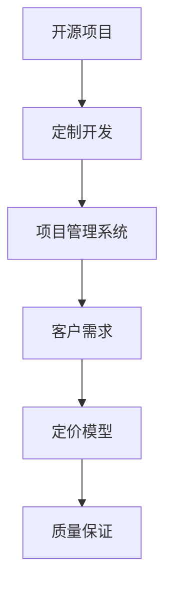

                 

# 开源项目的定制开发服务：项目管理和定价

> 关键词：开源项目,定制开发,项目管理,定价模型,客户需求,质量保证

## 1. 背景介绍

### 1.1 问题由来
随着开源软件生态的快速发展，越来越多的开发者和企业选择通过开源项目进行技术合作与软件开发。开源项目由于其灵活性、可定制性和低成本等优势，深受欢迎。然而，开源项目的开发过程复杂、资源分散，如何有效管理项目，满足客户需求，实现合理的定价，是开源项目定制开发服务的核心挑战。

### 1.2 问题核心关键点
开源项目定制开发服务的核心在于如何将通用开源技术与定制化需求相结合，实现高性价比的解决方案。其主要关注点包括：

- 项目管理：确保项目按时按质完成。
- 客户需求：理解并实现客户的具体需求。
- 成本控制：合理定价，保证利润空间。
- 质量保证：满足项目交付的最终标准。

本文将详细探讨这些关键点的具体实现方法，并通过案例分析展示其在实际项目中的应用效果。

## 2. 核心概念与联系

### 2.1 核心概念概述

为更好地理解开源项目定制开发服务，本节将介绍几个密切相关的核心概念：

- 开源项目(Open Source Project)：指在公开的源代码基础上，由社区贡献者共同开发的软件项目。典型代表包括Linux内核、Apache Web服务器等。
- 定制开发(Custom Development)：指根据客户的具体需求，对通用开源软件进行定制化修改和功能增强的过程。
- 项目管理系统(Project Management System)：指用于跟踪和控制项目进度、资源、成本等关键因素的软件工具。
- 定价模型(Pricing Model)：指根据项目需求、资源投入、质量标准等因素，确定服务价格的策略。
- 客户需求(Customer Requirements)：指客户在定制开发服务中提出的具体功能、性能、界面等要求。
- 质量保证(Quality Assurance)：指确保项目交付物符合客户预期和标准要求的过程，涉及代码审计、性能测试、用户体验测试等。

这些核心概念之间的逻辑关系可以通过以下Mermaid流程图来展示：



这个流程图展示了大语言模型的核心概念及其之间的关系：

1. 开源项目通过定制开发获得客户特定的功能增强。
2. 项目管理系统对定制开发过程进行监督和管理。
3. 客户需求引导定制开发，明确项目的目标和需求。
4. 定价模型根据资源消耗、质量要求等因素，确定服务价格。
5. 质量保证确保交付结果符合客户预期，避免交付后的质量问题。

这些概念共同构成了开源项目定制开发服务的管理框架，使其能够高效、准确地满足客户需求。

## 3. 核心算法原理 & 具体操作步骤

### 3.1 算法原理概述

开源项目定制开发服务是一个典型的定制化软件开发过程，涉及项目管理、需求分析、资源规划、质量控制等多个环节。其核心算法原理包括以下几个关键步骤：

1. 需求获取：通过访谈、文档分析等手段，全面了解客户需求。
2. 需求分析：将客户需求转化为具体的功能和性能指标。
3. 资源规划：根据需求和项目复杂度，规划开发资源和时间安排。
4. 定制开发：对开源项目进行定制化修改和功能增强。
5. 质量控制：通过代码审查、测试等手段，确保开发成果符合质量标准。
6. 项目管理：使用项目管理系统，跟踪项目进度、资源使用和成本消耗。
7. 定价决策：根据项目投入和成果，确定最终的服务价格。

### 3.2 算法步骤详解

基于以上原理，开源项目定制开发服务的具体操作步骤可以分为以下几个阶段：

**阶段1：需求获取与分析**

1. **需求获取**：
   - 与客户进行深度访谈，收集其业务需求、功能需求、性能需求等。
   - 分析客户提供的文档、用例、需求规格说明等，进一步明确具体需求。
   - 使用问卷调查、用户故事等方式，收集多角度的客户反馈。

2. **需求分析**：
   - 将客户需求转换为可执行的功能和性能指标。
   - 进行需求分解和优先级排序，确定项目开发的关键路径。
   - 制定详细的需求文档，作为项目管理和开发的依据。

**阶段2：资源规划与分配**

1. **资源规划**：
   - 根据项目需求和预计的开发周期，规划必要的开发人员、测试人员、设计师等资源。
   - 评估各资源的技能和经验水平，合理分配任务和责任。
   - 使用项目管理工具，如JIRA、Trello等，记录和跟踪资源状态。

2. **资源分配**：
   - 根据项目进度和需求变更，动态调整资源分配。
   - 定期评估资源利用率，确保资源的有效使用。
   - 考虑团队的协作和沟通效率，合理安排任务顺序。

**阶段3：定制开发与质量控制**

1. **定制开发**：
   - 在客户需求的指导下，对开源项目进行功能增强和定制化修改。
   - 使用版本控制系统，如Git，管理代码变更和版本控制。
   - 定期进行代码审查，确保代码质量和一致性。

2. **质量控制**：
   - 进行单元测试、集成测试和性能测试，确保代码质量和功能完备性。
   - 进行用户体验测试，收集用户反馈，持续改进产品。
   - 使用自动化测试工具，如Selenium、JUnit等，提高测试效率。

**阶段4：项目管理与定价决策**

1. **项目管理**：
   - 使用项目管理系统，如JIRA、Asana等，跟踪项目进度和资源使用。
   - 定期进行项目评估和状态更新，及时调整项目计划。
   - 使用甘特图、看板等工具，可视化项目进展和关键路径。

2. **定价决策**：
   - 根据项目需求和资源投入，评估定制开发的工作量和时间成本。
   - 考虑客户的具体需求和期望，制定合理的定价策略。
   - 考虑市场竞争和行业标准，设定合理的价格区间。

### 3.3 算法优缺点

开源项目定制开发服务具有以下优点：

- 灵活性高：根据客户需求灵活定制，满足特定业务场景。
- 成本低：利用开源资源和社区贡献，降低开发成本。
- 可扩展性强：开源项目具有良好的可扩展性，便于后续功能迭代。

同时，该方法也存在一定的局限性：

- 质量控制难度大：定制开发过程中，可能会引入新的问题，增加质量控制的难度。
- 项目周期长：定制开发涉及多个环节，项目周期较长。
- 客户需求不明确：客户需求可能不明确，导致开发过程中频繁变更，增加项目风险。

尽管存在这些局限性，但就目前而言，开源项目定制开发服务仍是大规模软件开发的重要方式。未来相关研究的重点在于如何进一步提高定制开发的质量控制能力，缩短项目周期，降低客户需求变动的风险。

### 3.4 算法应用领域

开源项目定制开发服务在软件开发、企业定制应用、系统集成等领域有着广泛的应用。具体而言：

- 软件开发：基于开源项目，开发满足客户业务需求的定制化软件产品。
- 企业应用：为企业定制开发特定功能的内部系统，如CRM、ERP等。
- 系统集成：集成多个开源项目和组件，构建复杂的软件系统。
- 数据分析：定制开发数据分析工具和应用，提高数据处理和分析能力。

除了这些传统应用外，开源项目定制开发服务还在新兴的云计算、物联网、人工智能等领域的落地应用中，发挥着越来越重要的作用。随着开源技术的发展和客户需求的不断变化，基于定制开发的服务将具有更广泛的应用前景。

## 4. 数学模型和公式 & 详细讲解  
### 4.1 数学模型构建

为了更好地评估和控制开源项目定制开发服务的成本和收益，本节将引入一些数学模型来描述和计算相关指标。

假设项目总成本为C，其中开发成本为D，项目管理成本为M，质量控制成本为Q。设客户期望的性能指标为P，开发完成的实际性能指标为A，客户满意度为S。则定价模型可以表示为：

$$
\text{价格} = f(C, P, A, S)
$$

其中，$f$为定价函数，用于根据成本、性能、质量和客户满意度等因素，确定最终价格。

### 4.2 公式推导过程

以下我们以二分类任务为例，推导定价函数的具体形式。

假设客户期望的性能指标为P，实际性能指标为A，期望的客户满意度为S，则定价函数可以表示为：

$$
\text{价格} = C + \alpha(P - A) + \beta(S)
$$

其中，$\alpha$和$\beta$为调节系数，用于控制成本和性能指标、客户满意度在价格中的权重。

在实践中，可以通过问卷调查、用户反馈等方式，获取客户对性能和满意度的评分。然后将评分转化为具体的数值，带入定价函数进行计算。

### 4.3 案例分析与讲解

假设某客户需要定制开发一个电商平台，要求具备高并发处理能力和良好的用户体验。该项目总成本为C=200000，其中开发成本D=150000，项目管理成本M=30000，质量控制成本Q=20000。客户期望的性能指标为P=99%，实际性能指标为A=95%。

根据定价模型，计算该项目的定价为：

$$
\text{价格} = 200000 + \alpha(99 - 95) + \beta(S)
$$

其中，假设$\alpha=0.5$，$\beta=0.2$，客户满意度评分S=4（满分5）。

计算得到：

$$
\text{价格} = 200000 + 0.5 \times 4 + 0.2 \times 4 = 200200 + 6 = 200206
$$

最终定价为200206元，考虑到一定的利润空间，定价20万元左右较为合理。

## 5. 项目实践：代码实例和详细解释说明

### 5.1 开发环境搭建

在进行开源项目定制开发服务的管理和定价实践前，我们需要准备好开发环境。以下是使用Python进行PyTorch开发的环境配置流程：

1. 安装Anaconda：从官网下载并安装Anaconda，用于创建独立的Python环境。

2. 创建并激活虚拟环境：
```bash
conda create -n pytorch-env python=3.8 
conda activate pytorch-env
```

3. 安装PyTorch：根据CUDA版本，从官网获取对应的安装命令。例如：
```bash
conda install pytorch torchvision torchaudio cudatoolkit=11.1 -c pytorch -c conda-forge
```

4. 安装各类工具包：
```bash
pip install numpy pandas scikit-learn matplotlib tqdm jupyter notebook ipython
```

完成上述步骤后，即可在`pytorch-env`环境中开始项目实践。

### 5.2 源代码详细实现

下面我们以电商平台定制开发为例，给出使用PyTorch进行项目管理和定价的PyTorch代码实现。

首先，定义项目成本和性能指标：

```python
from sympy import symbols, Rational

# 定义成本和性能指标变量
C, D, M, Q, P, A, S = symbols('C D M Q P A S')

# 定义定价函数
price = C + Rational(1, 2) * (P - A) + Rational(1, 5) * S
price
```

然后，根据具体项目数据，计算定价：

```python
# 假设项目成本和各项成本
C_value = 200000
D_value = 150000
M_value = 30000
Q_value = 20000

# 假设性能指标和客户满意度
P_value = 0.99
A_value = 0.95
S_value = 4

# 计算定价
price_value = price.subs({C: C_value, D: D_value, M: M_value, Q: Q_value, P: P_value, A: A_value, S: S_value})
price_value
```

最后，输出定价结果：

```python
print(f"该项目定价为: {price_value}元")
```

以上就是使用PyTorch进行开源项目定制开发服务管理和定价的完整代码实现。可以看到，通过简单的数学公式和符号计算，可以轻松地计算出项目的定价。

### 5.3 代码解读与分析

让我们再详细解读一下关键代码的实现细节：

**定价函数定义**：
- 使用Sympy库定义成本C、开发成本D、项目管理成本M、质量控制成本Q、客户期望的性能指标P、实际性能指标A、客户满意度S等符号变量。
- 根据定价模型的公式，定义定价函数price，其中$\alpha$和$\beta$的取值可根据实际情况进行调整。

**成本和性能指标赋值**：
- 定义项目成本和各项成本的具体数值。
- 定义客户期望的性能指标和实际性能指标的具体数值。
- 定义客户满意度的具体数值。

**定价计算**：
- 使用subs方法，将变量值代入定价函数，计算出最终的价格。
- 输出定价结果，并进行展示。

可以看到，定价函数的设计简单直接，只需要合理设置各项变量的值和权重，就可以快速计算出项目的定价。这种数学模型的方法，可以灵活地应用于各种不同的开源项目定制开发服务场景，帮助企业进行成本控制和收益评估。

## 6. 实际应用场景

### 6.1 电商平台

基于开源项目定制开发服务，电商平台可以快速部署满足客户需求的定制化功能，提高用户体验和运营效率。

在技术实现上，可以收集客户对功能、性能、界面等方面的需求，在此基础上对开源项目进行定制化修改和功能增强。例如，为电商平台添加多语言支持、个性化推荐、库存管理系统等功能，通过微调模型，提升平台的竞争力和市场占有率。

### 6.2 金融服务

金融服务领域对系统的稳定性和安全性要求极高，需要定制开发高可用、高并发、高安全性的解决方案。

在项目管理和定价上，可以基于开源项目定制开发需求，优化和增强金融系统的前端界面、后端逻辑、数据处理等模块，确保系统具备高性能、高可靠性和高安全性。通过合理的定价模型，根据客户的具体需求和投入资源，制定公平合理的项目报价。

### 6.3 医疗系统

医疗系统需要处理大量复杂的临床数据，对系统的性能和准确性要求极高。基于开源项目定制开发服务，可以开发满足医院、医生、患者需求的高效、可靠的医疗应用。

在项目管理和定价上，可以基于开源项目定制开发需求，增强系统的数据处理、图像识别、智能诊断等功能，确保系统能够快速、准确地处理临床数据，提升医疗服务的质量和效率。通过合理的定价模型，根据客户的具体需求和投入资源，制定公平合理的项目报价。

### 6.4 未来应用展望

随着开源项目定制开发服务的发展，其在更多领域的应用前景广阔。

在智慧城市治理中，基于开源项目定制开发服务，可以构建高效的智能监控、数据分析、应急指挥等系统，提高城市管理的自动化和智能化水平。

在教育领域，定制开发学习管理系统、在线教育平台等功能，满足不同层次、不同需求的教育需求，推动教育公平和质量提升。

在工业制造领域，定制开发生产管理系统、质量控制系统等功能，提升生产效率和产品质量，推动智能制造的普及和发展。

此外，在智能家居、智能交通、智能农业等新兴领域，基于开源项目定制开发服务也将发挥重要作用，推动各行各业的数字化转型升级。相信随着技术的不断进步和应用的不断拓展，开源项目定制开发服务必将在更多的场景中发挥其独特价值。

## 7. 工具和资源推荐

### 7.1 学习资源推荐

为了帮助开发者系统掌握开源项目定制开发服务的理论基础和实践技巧，这里推荐一些优质的学习资源：

1. 《Open Source Software Development》系列博文：由开源社区的知名专家撰写，全面介绍了开源项目定制开发的基础知识、方法和实践经验。

2. GitBook：GitHub推出的在线文档管理工具，提供了大量的开源项目定制开发案例和最佳实践，帮助开发者系统学习开源项目的开发和管理。

3. GitHub社区：全球最大的开源项目托管平台，汇集了大量的开源项目和开发者，通过参与开源项目贡献和交流，可以积累丰富的开发和管理经验。

4. JIRA培训课程：JIRA是常用的项目管理工具，提供丰富的培训课程和在线学习资源，帮助开发者掌握项目管理的最佳实践和技巧。

5. Scrum.org：提供专业的Scrum敏捷开发培训和认证，帮助开发者掌握敏捷开发和管理方法，提升团队协作和项目效率。

通过对这些资源的学习实践，相信你一定能够快速掌握开源项目定制开发服务的精髓，并用于解决实际的开发问题。

### 7.2 开发工具推荐

高效的开发离不开优秀的工具支持。以下是几款用于开源项目定制开发服务的常用工具：

1. GitHub：全球最大的开源项目托管平台，支持版本控制、问题跟踪、代码审查等功能的开发协作平台。

2. JIRA：提供全面的项目管理功能，支持任务分配、进度跟踪、问题管理等，帮助团队高效协同工作。

3. GitLab：集成了代码托管、CI/CD、项目管理等多种功能的开源平台，适用于中小团队和企业级开发。

4. Git：最流行的版本控制系统，支持分布式版本控制、分支管理等，是开源项目开发不可或缺的工具。

5. Docker：支持容器化应用部署的开放平台，方便快速构建、测试和部署应用程序。

6. Jenkins：流行的自动化持续集成和部署工具，支持各种编程语言和应用框架，帮助开发者快速构建CI/CD流程。

合理利用这些工具，可以显著提升开源项目定制开发服务的开发效率，加快创新迭代的步伐。

### 7.3 相关论文推荐

开源项目定制开发服务的发展离不开学界的持续研究。以下是几篇奠基性的相关论文，推荐阅读：

1. "Open Source Software Development: Principles and Practices"：阐述了开源项目开发和管理的最佳实践和原则，是理解开源项目定制开发的基础。

2. "The Economics of Open Source"：分析了开源项目在经济上的优劣势和生态系统，为开源项目定制开发服务提供了经济学上的依据。

3. "Open Source Software Development: A Survey"：全面综述了开源项目定制开发的技术和实践，介绍了各种开源项目管理工具和方法。

4. "Open Source Software Development in Practice"：通过实际案例，展示了开源项目定制开发在企业中的应用和效果，提供了可借鉴的经验。

这些论文代表了大语言模型微调技术的发展脉络。通过学习这些前沿成果，可以帮助研究者把握学科前进方向，激发更多的创新灵感。

## 8. 总结：未来发展趋势与挑战

### 8.1 总结

本文对开源项目定制开发服务进行了全面系统的介绍。首先阐述了开源项目定制开发服务的背景和重要性，明确了服务在项目管理、需求分析、成本控制和质量保证等方面的关键作用。其次，从原理到实践，详细讲解了开源项目定制开发服务的具体操作步骤和核心算法原理，并通过案例分析展示了其在实际项目中的应用效果。

通过本文的系统梳理，可以看到，开源项目定制开发服务在软件开发、企业定制应用、系统集成等领域具有重要应用价值。通过合理的项目管理和定价模型，可以确保项目按时、按质完成，同时满足客户需求，实现高效、低成本的开发过程。未来，伴随开源技术的发展和客户需求的不断变化，基于定制开发的服务将具有更广泛的应用前景。

### 8.2 未来发展趋势

展望未来，开源项目定制开发服务将呈现以下几个发展趋势：

1. 项目管理工具的智能化：随着人工智能和大数据分析技术的发展，项目管理工具将更加智能化，能够自动分析项目风险、优化资源配置，提升项目管理效率。

2. 定制开发过程的标准化：通过建立标准化的开发流程和规范，提升开发过程的可复用性和可维护性，降低开发成本和风险。

3. 开源社区的全球化：开源项目定制开发服务将更加全球化，通过跨文化的交流和合作，推动技术和知识的全球传播。

4. 定制开发服务的定制化：根据客户的具体需求和行业特性，提供更加定制化、个性化的开发服务，提升客户满意度和市场竞争力。

5. 开源技术的融合创新：结合云计算、人工智能、物联网等新兴技术，开发更加高效、智能的解决方案，推动产业数字化转型。

6. 开源项目的生态化：构建开源项目的生态系统，通过协作和共享，实现技术的持续迭代和创新，促进开源社区的长期发展。

以上趋势凸显了开源项目定制开发服务的发展潜力和应用前景。这些方向的探索发展，必将进一步提升软件开发和应用系统的效率和质量，为各个行业的数字化转型提供强大的技术支持。

### 8.3 面临的挑战

尽管开源项目定制开发服务已经取得了显著成效，但在迈向更加智能化、普适化应用的过程中，它仍面临诸多挑战：

1. 项目管理复杂度高：开源项目涉及多人协作、资源分散，项目管理难度较大。如何提升项目管理的智能化和自动化水平，是未来的一大挑战。

2. 客户需求多变：客户需求具有高度不确定性，频繁的变更可能导致项目延期和成本增加。如何平衡客户需求和项目进度，是项目管理中的重要课题。

3. 资源分配不均衡：项目资源分配不当，可能导致某些阶段资源紧张，某些阶段资源闲置。如何合理规划和分配资源，是提升项目效率的关键。

4. 质量控制难度大：开源项目定制开发中，可能会出现新的技术问题，影响项目质量。如何加强质量控制，提升交付物质量，是确保项目成功的关键。

5. 成本控制困难：开源项目定制开发服务中，成本控制难度较大，容易出现成本超支的风险。如何合理定价，控制成本，是项目管理中的重要任务。

6. 团队协作问题：开源项目涉及多团队协作，沟通协调成本高，可能导致项目进度延误。如何提升团队协作效率，是确保项目顺利进行的关键。

正视开源项目定制开发服务面临的这些挑战，积极应对并寻求突破，将是大规模软件开发的重要方向。相信随着技术的不断进步和实践的不断积累，这些挑战终将一一克服，开源项目定制开发服务必将在更多领域发挥其独特价值。

### 8.4 研究展望

面对开源项目定制开发服务所面临的种种挑战，未来的研究需要在以下几个方面寻求新的突破：

1. 探索智能化项目管理工具：结合人工智能和大数据分析技术，开发智能化的项目管理工具，自动分析项目风险、优化资源配置，提升项目管理效率。

2. 研究需求驱动的开发流程：建立需求驱动的开发流程，通过需求分析、需求变更管理，确保项目按客户需求顺利推进。

3. 开发多团队协作平台：构建多团队协作平台，通过实时沟通、协作工具，提升团队协作效率，降低沟通成本。

4. 引入持续集成和交付工具：结合CI/CD工具，实现快速、高效的持续集成和交付，提升开发和部署效率。

5. 融合新兴技术：结合云计算、人工智能、物联网等新兴技术，开发更加高效、智能的解决方案，推动产业数字化转型。

6. 构建开源社区生态：构建开源项目的生态系统，通过协作和共享，实现技术的持续迭代和创新，促进开源社区的长期发展。

这些研究方向的探索，必将引领开源项目定制开发服务走向更高的台阶，为软件开发和应用系统的未来发展提供强大的技术支持。面向未来，开源项目定制开发服务需要在技术、管理和业务等多个维度进行全面优化，方能真正实现高效、低成本、高质量的开发过程。总之，开源项目定制开发服务需要不断迭代和优化，方能不断适应市场需求和技术变化，在更多领域发挥其独特价值。

## 9. 附录：常见问题与解答

**Q1：开源项目定制开发服务是否适用于所有软件开发项目？**

A: 开源项目定制开发服务适用于大部分软件开发项目，特别是需要高度定制化的项目。但对于一些通用性较强、开发周期较短的项目，可能需要直接使用开源项目的最新版本或进行必要的增强，而非完全定制开发。

**Q2：如何确保开源项目定制开发服务的质量？**

A: 确保开源项目定制开发服务的质量，主要需要从以下几个方面入手：
1. 严格的测试流程：包括单元测试、集成测试、系统测试和用户体验测试等，确保代码质量和功能完备性。
2. 定期的代码审查：通过代码审查工具，如GitHub Code Review，确保代码规范和质量。
3. 持续集成和交付：使用CI/CD工具，如Jenkins，实现快速、高效的持续集成和交付，确保软件质量。
4. 客户反馈：通过用户反馈，及时发现和解决问题，持续改进软件质量。

**Q3：开源项目定制开发服务的定价模型如何确定？**

A: 定价模型需要根据项目需求、资源投入、质量标准等因素综合考虑，一般可以采用以下方法：
1. 成本加成法：根据项目成本，加上一定比例的利润，确定最终价格。
2. 价值定价法：根据项目对客户的具体价值，确定价格。
3. 竞争定价法：参考市场竞争状况，确定合理的定价区间。
4. 时间成本定价法：根据项目时间和资源投入，计算成本，确定最终价格。

**Q4：如何选择合适的开源项目进行定制开发？**

A: 选择合适的开源项目进行定制开发，主要需要考虑以下几个方面：
1. 项目的成熟度：选择成熟度高的开源项目，降低开发风险和成本。
2. 社区活跃度：选择社区活跃的开源项目，保证技术支持和持续迭代。
3. 项目适用性：选择适用性强的开源项目，确保项目能够快速部署和使用。
4. 许可证条款：选择符合企业法律要求的开源项目，避免版权和法律风险。

**Q5：开源项目定制开发服务是否需要配置项目管理工具？**

A: 配置项目管理工具对于开源项目定制开发服务至关重要。项目管理工具能够帮助团队协同工作，跟踪项目进度，优化资源配置，确保项目按时按质完成。常见项目管理工具包括JIRA、Trello、Asana等。

**Q6：如何提高开源项目定制开发服务的效率？**

A: 提高开源项目定制开发服务的效率，主要需要从以下几个方面入手：
1. 使用自动化工具：结合自动化测试、代码审查、持续集成和交付等工具，提升开发效率。
2. 引入敏捷开发方法：采用敏捷开发方法，如Scrum、Kanban等，提升团队协作和项目进度。
3. 引入开源社区：加入开源社区，通过交流和合作，获取技术和资源支持，提升开发效率。
4. 引入标准化流程：建立标准化的开发流程和规范，提升开发过程的可复用性和可维护性。

通过以上方法，可以有效提高开源项目定制开发服务的效率，缩短开发周期，降低开发成本。

---

作者：禅与计算机程序设计艺术 / Zen and the Art of Computer Programming

