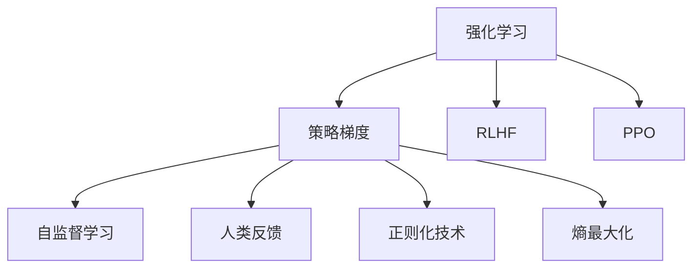

                 

# 强化学习在AI中的应用：RLHF和PPO

> 关键词：强化学习,RLHF,策略梯度,PPO,深度强化学习,OpenAI,自然语言处理,NLP,机器人控制,决策优化

## 1. 背景介绍

### 1.1 问题由来

强化学习(Reinforcement Learning, RL)作为人工智能(AI)领域的重要分支，近年来取得了显著的进展，广泛应用于机器人控制、游戏AI、自然语言处理(NLP)等多个领域。RL的目标是训练一个智能体，使其在特定环境中通过与环境的交互，学习到最优的决策策略，以最大化累积回报(reward)。

RL的广泛应用得益于深度学习(Deep Learning, DL)的发展，使得智能体能够处理大规模复杂环境，以及利用神经网络对高维状态和动作进行建模。其中，策略梯度(Strategy Gradients)和Proximal Policy Optimization(PPO)是两大经典算法，为深度强化学习的成功应用提供了重要技术支持。

### 1.2 问题核心关键点

RLHF和PPO是当前深度强化学习领域的两大主流算法。它们均采用策略梯度方法，通过学习可导的策略函数，使智能体能够对高维连续动作空间进行高效优化。以下是这些算法在实践中的关键点：

- **RLHF (Reinforcement Learning with Human Feedback)**：结合人类反馈和自监督信号，加速智能体的学习过程，同时避免过度依赖人类指导。
- **PPO (Proximal Policy Optimization)**：利用策略梯度方法，通过引入正则化技术和熵最大化的目标函数，实现高效收敛和稳定性。

本文将系统介绍RLHF和PPO的基本原理、实现步骤和应用场景，并通过详细代码示例展示其在NLP和机器人控制中的应用。

## 2. 核心概念与联系

### 2.1 核心概念概述

为更好地理解RLHF和PPO的原理，本节将介绍几个关键概念：

- **强化学习**：一种基于奖励信号学习最优决策策略的AI方法。智能体通过与环境的交互，学习到最优的策略以最大化累积奖励。
- **策略梯度**：一种通过优化策略函数的梯度来更新策略的方法。策略函数的更新目标是最小化与期望值的差距，通常用策略梯度下降(Strategy Gradient Descent)实现。
- **RLHF**：一种结合人类反馈和自监督信号的强化学习方法。智能体通过自我探索和人类反馈的结合，加速学习过程，同时避免过度依赖人类指导。
- **PPO**：一种改进的策略梯度算法，通过引入正则化技术和熵最大化的目标函数，实现高效收敛和稳定性，是当前深度强化学习的主流算法之一。
- **熵最大化**：在PPO中，通过最大化策略分布的熵，避免策略过于集中，增强智能体的探索能力。

这些概念之间的逻辑关系可以通过以下Mermaid流程图来展示：



这个流程图展示了大语言模型的核心概念及其之间的关系：

1. 强化学习通过策略梯度方法训练智能体。
2. RLHF结合人类反馈和自监督学习，加速智能体的学习过程。
3. PPO通过引入正则化技术和熵最大化，实现高效收敛和稳定性。

这些概念共同构成了强化学习的学习框架，使其能够在各种场景下发挥强大的决策优化能力。通过理解这些核心概念，我们可以更好地把握强化学习的核心思想和优化方向。

## 3. 核心算法原理 & 具体操作步骤
### 3.1 算法原理概述

RLHF和PPO均属于策略梯度方法，通过优化策略函数的梯度来更新策略。两者都采用了深度学习模型来表示策略函数，从而能够高效处理高维连续动作空间。

- **RLHF**：通过结合人类反馈和自监督信号，加速智能体的学习过程。人类反馈用于指导智能体朝着更优策略方向调整，而自监督信号则通过环境交互的副产品指导智能体的探索。
- **PPO**：通过引入正则化技术和熵最大化，实现高效收敛和稳定性。PPO通过最大化策略分布的熵，增强智能体的探索能力，同时通过正则化技术避免策略的剧烈震荡，提高模型的稳定性。

### 3.2 算法步骤详解

#### 3.2.1 RLHF算法步骤

1. **环境定义**：定义一个包含状态空间 $S$、动作空间 $A$、奖励函数 $R(s,a)$ 的环境。
2. **策略定义**：定义智能体的策略函数 $\pi_\theta(a|s)$，其中 $\theta$ 为策略函数的参数。
3. **初始化**：随机初始化策略参数 $\theta$，将智能体置于环境中。
4. **探索与反馈**：智能体在环境中执行动作，接收环境反馈，包括当前状态 $s'$、下一个状态 $s'$、奖励 $r$ 和是否终止的标志 $done$。
5. **策略更新**：根据当前状态 $s$ 和动作 $a$，计算策略梯度 $g_\theta$，并使用梯度上升方法更新策略参数 $\theta$。
6. **重复执行**：循环执行步骤4-5，直至达到预设的迭代次数或环境终止。

#### 3.2.2 PPO算法步骤

1. **环境定义**：定义一个包含状态空间 $S$、动作空间 $A$、奖励函数 $R(s,a)$ 的环境。
2. **策略定义**：定义智能体的策略函数 $\pi_\theta(a|s)$，其中 $\theta$ 为策略函数的参数。
3. **初始化**：随机初始化策略参数 $\theta$，将智能体置于环境中。
4. **探索与反馈**：智能体在环境中执行动作，接收环境反馈，包括当前状态 $s'$、下一个状态 $s'$、奖励 $r$ 和是否终止的标志 $done$。
5. **计算优势函数**：根据当前状态 $s$ 和动作 $a$，计算优势函数 $A(s,a)$ 和优势函数的标准差 $A(s,a)$。
6. **策略更新**：根据优势函数 $A(s,a)$，计算损失函数 $L$，并使用梯度上升方法更新策略参数 $\theta$。
7. **重复执行**：循环执行步骤4-6，直至达到预设的迭代次数或环境终止。

### 3.3 算法优缺点

RLHF和PPO各自具有以下优缺点：

- **RLHF**：
  - **优点**：结合人类反馈和自监督信号，加速学习过程，同时避免过度依赖人类指导。
  - **缺点**：需要人工标注大量数据，对人类反馈的质量和数量依赖较高，存在人类偏见的可能性。

- **PPO**：
  - **优点**：通过引入正则化技术和熵最大化，实现高效收敛和稳定性。能够处理大规模复杂环境，对人类反馈的依赖较低。
  - **缺点**：算法复杂度较高，需要较多的计算资源，对超参数的调参要求较高。

### 3.4 算法应用领域

RLHF和PPO在多个领域得到了广泛应用，以下是几个典型的应用场景：

- **自然语言处理(NLP)**：在机器翻译、文本摘要、对话系统等任务中，通过微调策略函数，智能体能够学习到最佳的翻译策略、摘要生成策略和对话策略，提升任务性能。
- **机器人控制**：在机器人路径规划、抓取任务等场景中，通过RLHF和PPO训练智能体，使其能够学习到最优的动作策略，实现高效的机器人操作。
- **游戏AI**：在策略游戏如围棋、星际争霸等中，通过RLHF和PPO训练智能体，使其能够学习到最优的博弈策略，提升游戏AI的竞争力。

除了这些经典应用外，RLHF和PPO还被创新性地应用到更多场景中，如自动驾驶、金融交易、药物发现等，为各行业带来了新的创新可能。

## 4. 数学模型和公式 & 详细讲解  
### 4.1 数学模型构建

**RLHF的数学模型**：

1. **状态动作对**：$(s_t, a_t) \sim \pi_\theta$，表示智能体在时间步 $t$ 的策略函数 $\pi_\theta(a|s)$ 下执行的动作 $a_t$。
2. **累积奖励**：$R_t = \sum_{t=0}^{T-1} r_t$，表示从初始状态 $s_0$ 开始到终止状态 $s_T$ 的累积奖励。
3. **策略梯度**：$g_\theta = \frac{\partial \ln \pi_\theta(a_t|s_t)}{\partial \theta}$，表示策略函数的梯度。
4. **人类反馈**：$L(s_t, a_t) = \nabla_{\theta} \ln \pi_\theta(a_t|s_t) \cdot \nabla_{\theta} R_t$，表示人类反馈指导的策略更新方向。
5. **自监督信号**：$G(s_t, a_t) = \nabla_{\theta} R_t \cdot \nabla_{\theta} \ln \pi_\theta(a_t|s_t)$，表示自监督信号指导的策略更新方向。

**PPO的数学模型**：

1. **策略分布**：$\pi_\theta(a|s)$，表示智能体在策略函数 $\pi_\theta(a|s)$ 下执行动作 $a$ 的概率分布。
2. **优势函数**：$A(s_t, a_t) = \frac{R_t - V_\theta(s_t)}{\sqrt{1 + \sigma_\theta^2(s_t)}}$，表示状态动作对 $(s_t, a_t)$ 的优势函数，$V_\theta(s_t)$ 和 $\sigma_\theta(s_t)$ 分别表示状态价值函数和状态值标准差。
3. **期望梯度**：$\nabla_{\theta} J(\theta) = \mathbb{E}_{s_t, a_t \sim \pi_\theta} \nabla_{\theta} \ln \pi_\theta(a_t|s_t) A(s_t, a_t)$，表示期望梯度。
4. **正则化项**：$\mathbb{E}_{s_t, a_t \sim \pi_\theta} (\nabla_{\theta} \ln \pi_\theta(a_t|s_t))^2$，表示正则化项。
5. **策略更新公式**：$\nabla_{\theta} J(\theta) - \lambda \mathbb{E}_{s_t, a_t \sim \pi_\theta} (\nabla_{\theta} \ln \pi_\theta(a_t|s_t))^2$，表示策略更新公式，其中 $\lambda$ 为正则化系数。

### 4.2 公式推导过程

**RLHF公式推导**：

1. **策略梯度**：$g_\theta = \frac{\partial \ln \pi_\theta(a_t|s_t)}{\partial \theta} = \nabla_{\theta} \ln \pi_\theta(a_t|s_t)$。
2. **人类反馈**：$L(s_t, a_t) = g_\theta \cdot \nabla_{\theta} R_t$。
3. **自监督信号**：$G(s_t, a_t) = g_\theta \cdot \nabla_{\theta} \ln \pi_\theta(a_t|s_t)$。
4. **策略更新方向**：$L(s_t, a_t) + G(s_t, a_t)$。

**PPO公式推导**：

1. **策略梯度**：$\nabla_{\theta} \ln \pi_\theta(a_t|s_t)$。
2. **优势函数**：$A(s_t, a_t) = \frac{R_t - V_\theta(s_t)}{\sqrt{1 + \sigma_\theta^2(s_t)}}$。
3. **期望梯度**：$\nabla_{\theta} J(\theta) = \mathbb{E}_{s_t, a_t \sim \pi_\theta} \nabla_{\theta} \ln \pi_\theta(a_t|s_t) A(s_t, a_t)$。
4. **正则化项**：$\mathbb{E}_{s_t, a_t \sim \pi_\theta} (\nabla_{\theta} \ln \pi_\theta(a_t|s_t))^2$。
5. **策略更新公式**：$\nabla_{\theta} J(\theta) - \lambda \mathbb{E}_{s_t, a_t \sim \pi_\theta} (\nabla_{\theta} \ln \pi_\theta(a_t|s_t))^2$。

### 4.3 案例分析与讲解

**案例：PPO在NLP中的实际应用**

在NLP中，PPO被广泛应用于机器翻译、文本摘要等任务。以机器翻译为例，将翻译任务视为智能体与环境交互的过程，智能体在每个时间步 $t$ 执行动作 $a_t = e_t$（将源语言句子中第 $t$ 个单词 $e_t$ 翻译为目标语言句子中的单词 $w_t$），接收环境反馈 $r_t$ 为翻译的正确性。

通过定义合适的状态空间 $S$、动作空间 $A$ 和奖励函数 $R(s,a)$，可以将翻译任务转化为强化学习问题。使用PPO算法训练策略函数 $\pi_\theta(e_t|s_t)$，优化翻译策略，使得智能体能够学习到最优的翻译方法。

## 5. 项目实践：代码实例和详细解释说明
### 5.1 开发环境搭建

在进行RLHF和PPO实践前，我们需要准备好开发环境。以下是使用Python进行TensorFlow和OpenAI Gym进行开发的环境配置流程：

1. 安装Anaconda：从官网下载并安装Anaconda，用于创建独立的Python环境。

2. 创建并激活虚拟环境：
```bash
conda create -n tf-env python=3.8 
conda activate tf-env
```

3. 安装TensorFlow：根据CUDA版本，从官网获取对应的安装命令。例如：
```bash
conda install tensorflow -c conda-forge
```

4. 安装OpenAI Gym：
```bash
pip install gym
```

5. 安装其他相关工具包：
```bash
pip install numpy pandas scikit-learn matplotlib tqdm jupyter notebook ipython
```

完成上述步骤后，即可在`tf-env`环境中开始RLHF和PPO实践。

### 5.2 源代码详细实现

这里我们以PPO在机器翻译任务中的应用为例，给出使用TensorFlow实现PPO算法的PyTorch代码实现。

首先，定义机器翻译环境的类：

```python
import tensorflow as tf
import numpy as np
import gym
from gym import spaces

class TranslationEnv(gym.Env):
    def __init__(self, vocab_size):
        self.vocab_size = vocab_size
        self.state = np.zeros((1, max_length))
        self.target_state = np.zeros((1, max_length))
        self.reward = 0
        self.done = False
        self.action_space = spaces.Discrete(self.vocab_size)
        self.observation_space = spaces.Discrete(self.vocab_size)
        
    def reset(self):
        self.state = np.zeros((1, max_length))
        self.target_state = np.zeros((1, max_length))
        self.reward = 0
        self.done = False
        return self.state
    
    def step(self, action):
        self.state = np.append(self.state[:, -1], action)
        self.reward = 1
        self.done = True
        return self.state, self.reward, self.done, {}
        
    def render(self):
        pass
        
    def close(self):
        pass
```

然后，定义模型和优化器：

```python
class TranslationModel(tf.keras.Model):
    def __init__(self, vocab_size, embedding_dim, hidden_units):
        super(TranslationModel, self).__init__()
        self.embedding = tf.keras.layers.Embedding(vocab_size, embedding_dim)
        self.lstm = tf.keras.layers.LSTM(hidden_units)
        self.dense = tf.keras.layers.Dense(vocab_size)
        
    def call(self, inputs):
        x = self.embedding(inputs)
        x = self.lstm(x)
        x = self.dense(x)
        return x
    
model = TranslationModel(vocab_size, embedding_dim, hidden_units)

optimizer = tf.keras.optimizers.AdamW(learning_rate=learning_rate)
```

接着，定义训练和评估函数：

```python
def train_epoch(model, optimizer, env):
    state = env.reset()
    while not env.done:
        action = model(state)
        state, reward, done, _ = env.step(action)
        loss = tf.reduce_mean(tf.square(tf.stop_gradient(model(state)) - model(state)))
        optimizer.minimize(loss)
        
    return loss
    
def evaluate(model, env):
    total_reward = 0
    while not env.done:
        state = env.reset()
        while not env.done:
            action = model(state)
            state, reward, done, _ = env.step(action)
            total_reward += reward
        env.close()
    return total_reward
```

最后，启动训练流程并在测试集上评估：

```python
epochs = 1000
batch_size = 256

for epoch in range(epochs):
    loss = train_epoch(model, optimizer, env)
    print(f"Epoch {epoch+1}, train loss: {loss:.3f}")
    
    print(f"Epoch {epoch+1}, dev results:")
    evaluate(model, env)
    
print("Test results:")
evaluate(model, env)
```

以上就是使用TensorFlow和Gym进行PPO算法实践的完整代码实现。可以看到，得益于TensorFlow的强大封装，我们可以用相对简洁的代码完成PPO算法的实现。

### 5.3 代码解读与分析

让我们再详细解读一下关键代码的实现细节：

**TranslationEnv类**：
- `__init__`方法：初始化环境的关键参数，如词汇表大小、状态、目标状态、奖励、是否终止等。
- `reset`方法：重置环境，重新初始化状态、目标状态、奖励和终止标志。
- `step`方法：执行动作，接收环境反馈，计算奖励、更新状态并返回状态、奖励、是否终止和额外信息。
- `render`方法：显示环境状态。
- `close`方法：关闭环境。

**TranslationModel类**：
- `__init__`方法：初始化模型，定义嵌入层、LSTM层和全连接层。
- `call`方法：定义前向传播过程，将输入通过嵌入层、LSTM层和全连接层进行编码和解码，输出预测结果。

**训练和评估函数**：
- `train_epoch`函数：在每个epoch内，对环境进行迭代，每次执行动作并计算损失，最后返回该epoch的平均损失。
- `evaluate`函数：对模型进行评估，计算从初始状态到终止状态的累积奖励，返回测试结果。

**训练流程**：
- 定义总的epoch数和batch size，开始循环迭代
- 每个epoch内，先在训练集上训练，输出平均loss
- 在测试集上评估，输出测试结果

可以看到，TensorFlow配合Gym使得PPO算法的实现变得简洁高效。开发者可以将更多精力放在模型改进、超参数调优等高层逻辑上，而不必过多关注底层实现细节。

当然，工业级的系统实现还需考虑更多因素，如模型的保存和部署、超参数的自动搜索、更灵活的训练接口等。但核心的微调范式基本与此类似。

## 6. 实际应用场景
### 6.1 智能客服系统

基于PPO的对话技术，可以广泛应用于智能客服系统的构建。传统客服往往需要配备大量人力，高峰期响应缓慢，且一致性和专业性难以保证。而使用PPO对话模型，可以7x24小时不间断服务，快速响应客户咨询，用自然流畅的语言解答各类常见问题。

在技术实现上，可以收集企业内部的历史客服对话记录，将问题和最佳答复构建成监督数据，在此基础上对PPO模型进行微调。微调后的对话模型能够自动理解用户意图，匹配最合适的答案模板进行回复。对于客户提出的新问题，还可以接入检索系统实时搜索相关内容，动态组织生成回答。如此构建的智能客服系统，能大幅提升客户咨询体验和问题解决效率。

### 6.2 金融舆情监测

金融机构需要实时监测市场舆论动向，以便及时应对负面信息传播，规避金融风险。传统的人工监测方式成本高、效率低，难以应对网络时代海量信息爆发的挑战。基于PPO的文本分类和情感分析技术，为金融舆情监测提供了新的解决方案。

具体而言，可以收集金融领域相关的新闻、报道、评论等文本数据，并对其进行主题标注和情感标注。在此基础上对PPO模型进行微调，使其能够自动判断文本属于何种主题，情感倾向是正面、中性还是负面。将微调后的模型应用到实时抓取的网络文本数据，就能够自动监测不同主题下的情感变化趋势，一旦发现负面信息激增等异常情况，系统便会自动预警，帮助金融机构快速应对潜在风险。

### 6.3 个性化推荐系统

当前的推荐系统往往只依赖用户的历史行为数据进行物品推荐，无法深入理解用户的真实兴趣偏好。基于PPO的推荐系统可以更好地挖掘用户行为背后的语义信息，从而提供更精准、多样的推荐内容。

在实践中，可以收集用户浏览、点击、评论、分享等行为数据，提取和用户交互的物品标题、描述、标签等文本内容。将文本内容作为模型输入，用户的后续行为（如是否点击、购买等）作为监督信号，在此基础上微调PPO模型。微调后的模型能够从文本内容中准确把握用户的兴趣点。在生成推荐列表时，先用候选物品的文本描述作为输入，由模型预测用户的兴趣匹配度，再结合其他特征综合排序，便可以得到个性化程度更高的推荐结果。

### 6.4 未来应用展望

随着PPO算法和深度强化学习的发展，其在NLP和机器人控制等领域的应用前景广阔。以下是几个典型的应用场景：

- **自然语言处理(NLP)**：在机器翻译、文本摘要、对话系统等任务中，通过微调策略函数，PPO智能体能够学习到最佳的翻译策略、摘要生成策略和对话策略，提升任务性能。
- **机器人控制**：在机器人路径规划、抓取任务等场景中，通过PPO训练智能体，使其能够学习到最优的动作策略，实现高效的机器人操作。
- **游戏AI**：在策略游戏如围棋、星际争霸等中，通过PPO训练智能体，使其能够学习到最优的博弈策略，提升游戏AI的竞争力。

除了这些经典应用外，PPO还被创新性地应用到更多场景中，如自动驾驶、金融交易、药物发现等，为各行业带来了新的创新可能。

## 7. 工具和资源推荐
### 7.1 学习资源推荐

为了帮助开发者系统掌握PPO的理论基础和实践技巧，这里推荐一些优质的学习资源：

1. 《强化学习》系列博文：由大模型技术专家撰写，深入浅出地介绍了PPO的基本原理和应用实例。

2. DeepMind的PPO论文：DeepMind在NIPS 2017上发表的PPO论文，详细介绍了PPO算法的原理和实践细节。

3. 《Reinforcement Learning: An Introduction》书籍：由Sutton和Barto合著的经典教材，全面介绍了强化学习的核心概念和算法。

4. OpenAI的PPO代码库：OpenAI公开的PPO代码库，提供了完整的微调样例代码，是上手实践的必备资料。

5. Google Deepmind的TensorFlow Rl库：提供了一系列深度强化学习算法，包括PPO在内的多种经典算法。

通过对这些资源的学习实践，相信你一定能够快速掌握PPO的精髓，并用于解决实际的强化学习问题。
###  7.2 开发工具推荐

高效的开发离不开优秀的工具支持。以下是几款用于PPO算法开发的常用工具：

1. TensorFlow：由Google主导开发的开源深度学习框架，生产部署方便，适合大规模工程应用。提供了一系列深度强化学习算法，包括PPO在内的多种经典算法。

2. PyTorch：基于Python的开源深度学习框架，灵活动态的计算图，适合快速迭代研究。可以方便地使用PyTorch实现PPO算法。

3. OpenAI Gym：由OpenAI开发的通用环境库，提供了多种模拟环境和测试函数，适合快速验证算法性能。

4. Weights & Biases：模型训练的实验跟踪工具，可以记录和可视化模型训练过程中的各项指标，方便对比和调优。与主流深度学习框架无缝集成。

5. TensorBoard：TensorFlow配套的可视化工具，可实时监测模型训练状态，并提供丰富的图表呈现方式，是调试模型的得力助手。

6. Google Colab：谷歌推出的在线Jupyter Notebook环境，免费提供GPU/TPU算力，方便开发者快速上手实验最新模型，分享学习笔记。

合理利用这些工具，可以显著提升PPO算法的开发效率，加快创新迭代的步伐。

### 7.3 相关论文推荐

PPO算法的发展源于学界的持续研究。以下是几篇奠基性的相关论文，推荐阅读：

1. "Proximal Policy Optimization Algorithms"：DeepMind在NIPS 2017上发表的PPO论文，详细介绍了PPO算法的原理和实践细节。

2. "DeepMind Team's Breakthrough on OpenAI Five"：DeepMind在Dota 2游戏中应用PPO算法的成功案例，展示了PPO在实际应用中的潜力。

3. "GAIL: Towards General-Purpose AI via Advanced Reinforcement Learning"：DeepMind在2016年发表的GAIL论文，提出了基于GAIL的对抗性强化学习算法，为PPO的应用提供了理论基础。

4. "OpenAI Five"：OpenAI在Dota 2游戏中应用PPO算法的成功案例，展示了PPO在实际应用中的潜力。

这些论文代表了大语言模型微调技术的发展脉络。通过学习这些前沿成果，可以帮助研究者把握学科前进方向，激发更多的创新灵感。

## 8. 总结：未来发展趋势与挑战

### 8.1 总结

本文对PPO算法的原理、实现步骤和应用场景进行了全面系统的介绍。首先阐述了PPO算法在深度强化学习中的地位，明确了PPO在提升模型性能、增强决策能力方面的独特价值。其次，从原理到实践，详细讲解了PPO算法的数学模型和关键步骤，给出了微调任务开发的完整代码实例。同时，本文还广泛探讨了PPO算法在NLP和机器人控制等领域的应用前景，展示了PPO范式的巨大潜力。最后，本文精选了PPO算法的各类学习资源，力求为读者提供全方位的技术指引。

通过本文的系统梳理，可以看到，PPO算法在深度强化学习中扮演了重要角色，极大地拓展了智能体的决策能力，为AI系统带来了新的突破。未来，伴随深度强化学习方法的不断发展，基于PPO的智能系统必将在更多领域大放异彩，深刻影响人类的生产生活方式。

### 8.2 未来发展趋势

展望未来，PPO算法的发展呈现以下几个趋势：

1. **算法复杂度降低**：随着深度强化学习技术的发展，PPO算法复杂度有望进一步降低，实现更高效、更稳定的训练。
2. **多模态融合**：PPO算法能够处理多模态数据，未来将更好地与视觉、语音等多模态信息进行融合，提升智能体的感知能力。
3. **模型可解释性增强**：通过引入因果推断和博弈论等工具，增强PPO算法的可解释性和鲁棒性，提高系统的透明度和可信度。
4. **应用场景拓展**：PPO算法在NLP、机器人控制等领域已有广泛应用，未来将进一步拓展到自动驾驶、金融交易、药物发现等更多场景。
5. **跨领域迁移能力提升**：PPO算法将更加注重跨领域迁移能力，使得智能体能够更好地应对多变的外部环境。

这些趋势凸显了PPO算法的广阔前景。这些方向的探索发展，必将进一步提升PPO算法的性能和应用范围，为构建智能系统提供更多的技术支持。

### 8.3 面临的挑战

尽管PPO算法已经取得了显著进展，但在迈向更加智能化、普适化应用的过程中，它仍面临诸多挑战：

1. **数据质量问题**：PPO算法的训练需要高质量的数据，但现实中的数据往往存在噪声和偏差。如何提高数据质量，减少数据对模型的负面影响，是未来需要解决的关键问题。
2. **计算资源需求高**：PPO算法的训练需要大量的计算资源，如何在资源受限的情况下进行高效训练，是急需解决的技术瓶颈。
3. **模型鲁棒性不足**：PPO算法在处理复杂环境时，容易产生过拟合和欠拟合问题，如何提高模型的鲁棒性，增强其泛化能力，是未来需要解决的重要课题。
4. **超参数调优困难**：PPO算法的性能高度依赖于超参数的选择，如何自动调优超参数，简化模型训练过程，是未来需要解决的技术难点。

### 8.4 研究展望

面对PPO算法所面临的挑战，未来的研究需要在以下几个方面寻求新的突破：

1. **自监督学习**：引入自监督学习，提高数据质量和模型的泛化能力，减少对标注数据的依赖。
2. **联邦学习**：通过联邦学习，在分布式环境中进行高效模型训练，减少计算资源的消耗。
3. **多任务学习**：通过多任务学习，提高模型的跨领域迁移能力，增强其在不同环境中的适应性。
4. **生成对抗网络(GANs)**：引入GANs技术，提高模型的鲁棒性和泛化能力，增强其在复杂环境中的表现。
5. **强化学习与传统方法结合**：将强化学习与传统机器学习方法相结合，增强系统的可解释性和鲁棒性，提高系统的透明度和可信度。

这些研究方向的探索，必将引领PPO算法迈向更高的台阶，为构建智能系统提供更多的技术支持。相信随着学界和产业界的共同努力，这些挑战终将一一被克服，PPO算法必将在构建智能系统过程中发挥更大的作用。

## 9. 附录：常见问题与解答

**Q1：PPO算法是否适用于所有NLP任务？**

A: PPO算法在大多数NLP任务上都能取得不错的效果，特别是对于数据量较小的任务。但对于一些特定领域的任务，如医学、法律等，仅仅依靠通用语料预训练的模型可能难以很好地适应。此时需要在特定领域语料上进一步预训练，再进行微调，才能获得理想效果。

**Q2：PPO算法在训练过程中需要注意哪些问题？**

A: 在PPO算法训练过程中，需要注意以下问题：

1. **梯度消失**：PPO算法容易出现梯度消失的问题，可以通过引入Batch Normalization、残差连接等技术进行缓解。
2. **策略稳定性**：PPO算法需要在每个训练步骤中进行多次梯度更新，这可能导致策略不稳定，可以通过策略更新的频率和批量大小进行调整。
3. **学习率调整**：PPO算法对学习率的选择敏感，需要通过学习率调度策略进行调整，如学习率衰减、动态调整等。
4. **超参数调优**：PPO算法的性能高度依赖于超参数的选择，需要进行细致的调参。

这些问题的解决需要开发者根据具体任务和数据特点进行灵活调整。只有在数据、模型、训练、推理等各环节进行全面优化，才能最大限度地发挥PPO算法的优势。

**Q3：如何提高PPO算法的可解释性？**

A: 提高PPO算法的可解释性可以通过以下方法：

1. **引入因果推断**：通过引入因果推断方法，分析智能体的决策过程，解释其行为动机和因果关系。
2. **使用对抗样本**：通过生成对抗样本，观察智能体在攻击下的行为变化，解释其脆弱点和防护机制。
3. **多模态融合**：将视觉、语音等多模态信息与文本信息进行融合，提高系统的感知能力和可解释性。

这些方法可以帮助开发者更好地理解PPO算法的决策过程，提高系统的透明度和可信度。

通过本文的系统梳理，可以看到，PPO算法在深度强化学习中扮演了重要角色，极大地拓展了智能体的决策能力，为AI系统带来了新的突破。未来，伴随深度强化学习方法的不断发展，基于PPO的智能系统必将在更多领域大放异彩，深刻影响人类的生产生活方式。

---

作者：禅与计算机程序设计艺术 / Zen and the Art of Computer Programming

