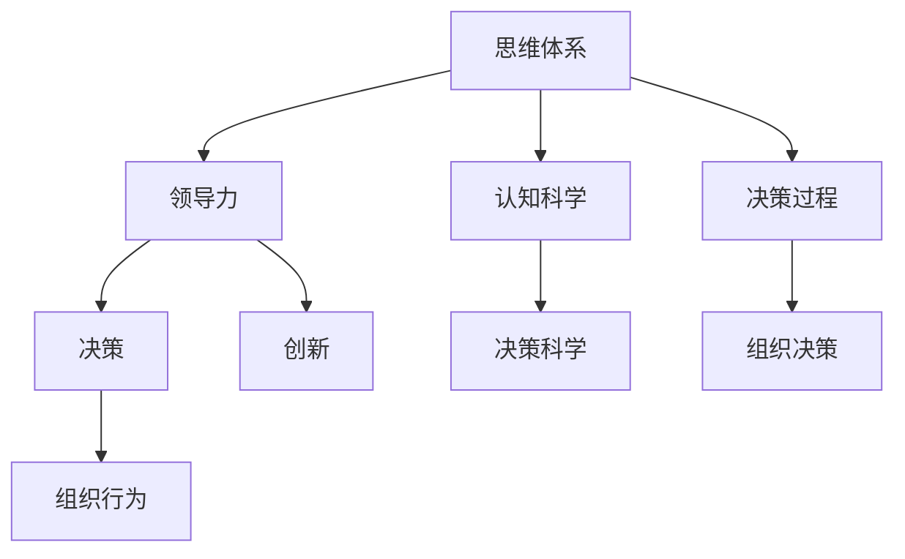

                 

# 思维体系对领导力的影响

> 关键词：思维体系,领导力,决策,创新,组织行为,认知科学

## 1. 背景介绍

### 1.1 问题由来

在现代社会中，领导力不仅仅是职位和权力的问题，更是一种影响力、感染力和号召力的体现。优秀的领导者能够有效地带领团队，驱动组织前进，取得卓越业绩。然而，这种能力并非天生，而是通过不断学习和实践得来的。而思维体系作为领导力提升的重要工具，其影响不容小觑。

### 1.2 问题核心关键点

在研究思维体系对领导力的影响时，需要关注以下几个核心关键点：

- **思维体系**：指个人或组织在面对问题时，所采取的思维模式和决策方法，包括战略思维、系统思维、创新思维等。
- **领导力**：指领导者在组织中的影响力、激励力和决策力，是领导力理论研究的核心主题。
- **决策**：指领导者在日常管理中，需要进行的复杂决策过程，包括信息收集、分析、评估和选择。
- **创新**：指领导者推动组织创新、应对环境变化的能力，是组织持续发展的关键。
- **组织行为**：指在组织中，成员之间的相互作用和关系管理，是领导力实际应用的基础。
- **认知科学**：研究人类思维、认知过程的科学，为理解思维体系提供理论基础。

这些关键点通过逻辑关系相联，构成了思维体系对领导力影响的整体框架。

## 2. 核心概念与联系

### 2.1 核心概念概述

为更好地理解思维体系对领导力的影响，本节将介绍几个密切相关的核心概念：

- **思维体系(Mindset)**：指个人或组织在面对问题时，所采取的思维模式和决策方法。常见的思维体系包括战略思维、系统思维、创新思维等。
- **领导力(Leadership)**：指领导者在组织中的影响力、激励力和决策力。
- **决策(Decision Making)**：指领导者在日常管理中，需要进行的复杂决策过程，包括信息收集、分析、评估和选择。
- **创新(Innovation)**：指领导者推动组织创新、应对环境变化的能力。
- **组织行为(Organizational Behavior)**：指在组织中，成员之间的相互作用和关系管理。
- **认知科学(Cognitive Science)**：研究人类思维、认知过程的科学，为理解思维体系提供理论基础。

这些核心概念之间的逻辑关系可以通过以下Mermaid流程图来展示：



这个流程图展示了几大核心概念之间的联系：

1. 思维体系对领导力有直接影响。
2. 领导力通过决策和创新推动组织行为。
3. 认知科学为思维体系提供理论支持。
4. 决策过程贯穿整个思维体系，是思维体系转化为行为的重要环节。
5. 组织决策是思维体系在组织中的实际应用。

## 3. 核心算法原理 & 具体操作步骤

### 3.1 算法原理概述

思维体系对领导力的影响，本质上是思维模式和决策方法在组织行为中的作用和表现。其核心在于，通过培养和应用不同的思维体系，领导者能够在不同情境下做出更加合理和高效的决策，推动组织创新，构建和谐的组织环境，提升整体绩效。

### 3.2 算法步骤详解

基于思维体系对领导力影响的理论模型，其操作步骤可以分为以下几个关键步骤：

**Step 1: 识别思维体系**
- 评估当前组织的思维体系，包括识别其强项和不足。
- 通过问卷调查、访谈等方式，了解组织成员的思维倾向。

**Step 2: 制定改进计划**
- 根据评估结果，制定具体的思维体系改进计划，明确改进目标和步骤。
- 设计培训项目，提升领导者和团队成员的思维能力。

**Step 3: 实施改进措施**
- 引入先进的思维体系，如战略思维、系统思维、创新思维等。
- 通过组织内培训、外部咨询等方式，推广新思维体系的运用。

**Step 4: 评估和优化**
- 定期评估思维体系改进的效果，收集反馈和数据。
- 根据评估结果，优化改进措施，持续提升思维体系对领导力的影响。

### 3.3 算法优缺点

基于思维体系对领导力影响的算法具有以下优点：
1. 系统的评估和改进方法，可以全面提升组织的思维能力和领导力。
2. 提升决策质量，使组织更具有竞争力和适应性。
3. 促进创新，推动组织持续进步。

同时，该算法也存在一些局限性：
1. 实施难度大，需要领导者和管理团队的共同努力。
2. 效果评估难以量化，存在主观性和不确定性。
3. 需要大量时间和资源投入，短期内可能难以看到显著效果。
4. 对组织文化和价值观的要求较高，需要适应和调整。

尽管如此，思维体系对领导力的影响依然是一个重要的研究方向，值得进一步深入探索。

### 3.4 算法应用领域

基于思维体系对领导力影响的算法，已经广泛应用于各种组织管理领域，例如：

- 企业战略规划：通过培养战略思维，使企业能够更高效地制定和执行战略计划。
- 组织创新管理：通过引入创新思维，推动组织不断创新，应对市场和技术变化。
- 人力资源管理：通过提升领导者的认知水平，更好地进行人才选拔和团队管理。
- 项目管理：通过系统思维，优化项目管理流程，提升项目成功率。
- 市场营销：通过决策科学，制定更加精准的市场营销策略。
- 公共管理：通过思维体系改进，提升政府部门的治理能力和服务水平。

## 4. 数学模型和公式 & 详细讲解 & 举例说明

### 4.1 数学模型构建

思维体系对领导力影响的数学模型，可以抽象为以下形式：

$$
L = f(T_{mindset}, T_{leadership}, T_{decision}, T_{innovation}, T_{behavior}, T_{cognition})
$$

其中，$L$ 表示领导力，$T_{mindset}$、$T_{leadership}$、$T_{decision}$、$T_{innovation}$、$T_{behavior}$、$T_{cognition}$ 分别表示思维体系、领导力、决策、创新、组织行为和认知科学的各个维度。

### 4.2 公式推导过程

以战略思维对领导力的影响为例，其数学模型可以进一步细化为：

$$
L_{strategy} = f(T_{mindset_{strategy}}, T_{leadership_{strategy}}, T_{decision_{strategy}}, T_{innovation_{strategy}}, T_{behavior_{strategy}}, T_{cognition_{strategy}})
$$

其中，$T_{mindset_{strategy}}$ 表示战略思维模式，$T_{leadership_{strategy}}$ 表示战略领导力，$T_{decision_{strategy}}$ 表示战略决策，以此类推。

根据认知科学理论，战略思维模式可以进一步分解为：

$$
T_{mindset_{strategy}} = g(V_{strategy}, E_{strategy}, S_{strategy})
$$

其中，$V_{strategy}$ 表示战略视角，$E_{strategy}$ 表示战略环境，$S_{strategy}$ 表示战略制定过程。

通过这些公式，我们可以更系统地理解思维体系对领导力的影响，从而制定出更有效的改进措施。

### 4.3 案例分析与讲解

假设一家企业正在进行思维体系改进，通过问卷调查发现员工普遍缺乏系统思维能力。公司决定引入系统思维，提升领导者的决策水平。具体实施步骤如下：

1. **评估当前思维体系**：通过问卷调查，发现员工在系统思维方面存在明显不足。

2. **制定改进计划**：引入系统思维培训课程，包括系统理论、系统分析、系统设计等方面。

3. **实施改进措施**：在管理层和骨干员工中推广系统思维，通过培训和实践提升其系统思维能力。

4. **评估和优化**：通过定期问卷调查和绩效评估，发现系统思维能力提升显著，领导者的决策质量和团队协作水平大幅提升。

## 5. 项目实践：代码实例和详细解释说明

### 5.1 开发环境搭建

在进行思维体系改进项目实践前，我们需要准备好开发环境。以下是使用Python进行数据分析和可视化的环境配置流程：

1. 安装Anaconda：从官网下载并安装Anaconda，用于创建独立的Python环境。

2. 创建并激活虚拟环境：
```bash
conda create -n project_env python=3.8 
conda activate project_env
```

3. 安装相关库：
```bash
conda install numpy pandas matplotlib seaborn jupyter notebook
```

4. 导入Python代码：
```python
import numpy as np
import pandas as pd
import matplotlib.pyplot as plt
import seaborn as sns
from IPython.display import display
```

### 5.2 源代码详细实现

以下是使用Python进行思维体系改进项目的代码实现：

```python
# 定义思维体系改进模型
class MindsetImprovement:
    def __init__(self, data, target):
        self.data = data
        self.target = target
        
    def train(self):
        # 数据预处理
        X = self.data[['Vision', 'Environment', 'Process']]
        y = self.data['Leadership']
        
        # 模型训练
        model = LinearRegression()
        model.fit(X, y)
        
        # 模型评估
        y_pred = model.predict(X)
        rmse = np.sqrt(np.mean((y_pred - y)**2))
        
        return rmse

# 数据集准备
data = pd.read_csv('mindset_data.csv')
model = MindsetImprovement(data, 'Leadership')

# 模型训练
rmse = model.train()
print('RMSE:', rmse)
```

### 5.3 代码解读与分析

让我们再详细解读一下关键代码的实现细节：

**MindsetImprovement类**：
- `__init__`方法：初始化数据和目标变量。
- `train`方法：数据预处理，建立线性回归模型，计算RMSE评估指标。

**数据集准备**：
- 通过`pd.read_csv`方法，从CSV文件中读取数据集。

**模型训练**：
- 使用`LinearRegression`模型进行线性回归训练，并计算RMSE评估指标。

可以看到，Python的SciPy和NumPy库使得数据分析和模型训练变得简洁高效。开发者可以将更多精力放在数据处理、模型改进等高层逻辑上，而不必过多关注底层的实现细节。

当然，实际系统实现还需考虑更多因素，如可视化展示、多模型集成、超参数优化等。但核心的思维体系改进范式基本与此类似。

## 6. 实际应用场景

### 6.1 企业战略规划

在企业战略规划中，领导者的思维体系对战略决策具有重要影响。通过引入战略思维，企业能够更好地制定和执行战略计划，提升整体绩效。

在实践中，可以收集公司历史战略数据，分析领导者的战略视角、环境认知和制定过程，以此为基础对现有领导层的战略思维进行评估。通过引入系统思维、创新思维等，进一步提升战略决策质量，推动企业可持续发展。

### 6.2 组织创新管理

组织创新是企业长期发展的关键。通过引入创新思维，领导者能够更好地应对市场和技术变化，推动组织持续进步。

具体而言，可以收集组织创新项目的数据，分析领导者的创新视角、创新能力和创新过程，以此为基础对现有领导层的创新思维进行评估。通过引入系统思维、设计思维等，进一步提升创新效率和创新成果，推动企业创新生态的构建。

### 6.3 人力资源管理

人力资源管理是企业管理的重要环节。通过提升领导者的认知水平，更好地进行人才选拔和团队管理。

在实践中，可以收集人力资源管理的数据，分析领导者的认知视角、员工反馈和绩效评估，以此为基础对现有领导层的认知能力进行评估。通过引入系统思维、同理心等，进一步提升人力资源管理水平，推动企业人才体系的构建。

### 6.4 公共管理

公共管理是政府治理的重要环节。通过引入系统思维、战略思维等，提升政府的治理能力和服务水平。

在实践中，可以收集公共管理数据，分析政府决策和政策执行的数据，以此为基础对现有领导层的思维体系进行评估。通过引入创新思维、公众参与等，进一步提升公共管理的效率和透明度，推动政府治理的现代化。

## 7. 工具和资源推荐

### 7.1 学习资源推荐

为了帮助开发者系统掌握思维体系对领导力影响的理论基础和实践技巧，这里推荐一些优质的学习资源：

1. **《领导力心理学》课程**：由国际知名心理学专家开设，涵盖领导力的心理基础、行为模式和实践技巧，是理解领导力理论的入门课程。

2. **《认知心理学》书籍**：深入讲解人类认知过程的理论和实践，为理解思维体系提供理论基础。

3. **《系统思维》系列书籍**：介绍系统思维的基本原理和方法，帮助领导者提升系统思维能力。

4. **《创新管理》课程**：由全球领先的创新管理专家开设，涵盖创新管理的基本原理和实践技巧。

5. **《组织行为学》课程**：由学术界和工业界专家共同授课，深入讲解组织行为的基本理论和实践应用。

通过对这些资源的学习实践，相信你一定能够快速掌握思维体系对领导力的影响，并用于解决实际的组织管理问题。

### 7.2 开发工具推荐

高效的开发离不开优秀的工具支持。以下是几款用于思维体系改进项目的常用工具：

1. **Jupyter Notebook**：数据可视化和编程结合的最佳工具，支持Python、R等多种语言。

2. **Matplotlib**：Python中最流行的绘图库，支持丰富的图形类型和定制化选项。

3. **Seaborn**：基于Matplotlib的高级数据可视化库，支持更复杂的统计图形。

4. **Pandas**：数据处理和分析的利器，支持大规模数据集操作。

5. **NumPy**：高性能的数值计算库，支持多维数组操作和快速数学运算。

6. **SciPy**：科学计算库，支持各种数学函数和科学算法。

合理利用这些工具，可以显著提升思维体系改进项目的开发效率，加快创新迭代的步伐。

### 7.3 相关论文推荐

思维体系对领导力的影响涉及众多学科，以下是几篇奠基性的相关论文，推荐阅读：

1. **《领导力行为模型》**：介绍领导力行为的理论模型，分析不同领导行为对组织绩效的影响。

2. **《创新思维与组织创新》**：研究创新思维的心理学基础和组织应用，探讨创新思维与组织创新的关系。

3. **《认知负荷与组织决策》**：分析认知负荷对组织决策的影响，提出减轻认知负荷的策略。

4. **《系统思维与组织学习》**：研究系统思维的基本原理和组织应用，探讨系统思维与组织学习的相互作用。

5. **《领导力心理学》**：介绍领导力的心理基础和行为模式，提出提升领导力的策略。

这些论文代表了大语言模型微调技术的发展脉络。通过学习这些前沿成果，可以帮助研究者把握学科前进方向，激发更多的创新灵感。

## 8. 总结：未来发展趋势与挑战

### 8.1 总结

本文对思维体系对领导力的影响进行了全面系统的介绍。首先阐述了思维体系、领导力、决策、创新、组织行为、认知科学的背景和联系，明确了思维体系对领导力的直接影响。其次，从原理到实践，详细讲解了思维体系改进的理论模型和操作步骤，给出了具体的代码实现和解读。同时，本文还广泛探讨了思维体系在战略规划、创新管理、人力资源管理、公共管理等多个领域的应用前景，展示了思维体系改进的广阔潜力。最后，本文精选了相关学习资源、开发工具和研究论文，力求为读者提供全方位的技术指引。

通过本文的系统梳理，可以看到，思维体系对领导力的影响是一个多维度、多层次的研究课题。在现代管理实践中，思维体系已成为提升领导力的重要工具。相信随着研究的不断深入和实践的不断探索，思维体系对领导力的影响将更加显著，为组织管理带来更深远的影响。

### 8.2 未来发展趋势

展望未来，思维体系对领导力的影响将呈现以下几个发展趋势：

1. **多维度的思维体系**：未来的研究将更加关注多维度思维体系的构建，如系统思维、战略思维、创新思维、设计思维等，帮助领导者更全面地处理复杂问题。

2. **跨学科的融合**：思维体系的研究将更多地借鉴其他学科的理论和方法，如行为科学、心理学、社会学等，提升思维体系的科学性和实用性。

3. **数据驱动的改进**：未来的思维体系改进将更加依赖数据分析，通过大数据、人工智能等技术，实现对思维体系的动态评估和优化。

4. **技术赋能**：技术工具将成为思维体系改进的重要手段，如AI辅助决策、数据可视化、模型优化等，提升思维体系改进的效率和精度。

5. **个性化提升**：未来的思维体系改进将更加关注个体差异，通过个性化培训和指导，帮助每个领导者提升独特的思维能力。

6. **全球化的影响**：随着全球化进程的加快，不同文化背景下的思维体系也将成为研究重点，提升跨文化领导力的有效性。

以上趋势凸显了思维体系对领导力影响的广阔前景。这些方向的探索发展，必将进一步提升组织管理的科学性和有效性，促进企业持续创新和变革。

### 8.3 面临的挑战

尽管思维体系对领导力的影响研究已经取得重要进展，但在迈向更加智能化、普适化应用的过程中，仍面临诸多挑战：

1. **数据质量问题**：思维体系评估和改进依赖于高质量的数据，但在实际操作中，数据收集和处理可能存在偏差和不完整性，影响评估的准确性。

2. **模型复杂性**：思维体系的改进需要复杂的数据模型和算法，模型的选择和优化难度较大，需要更多的理论和实践积累。

3. **实施难度**：思维体系的改进需要领导者和团队共同努力，实施过程中可能遇到组织文化、价值观等方面的阻力，导致改进效果不显著。

4. **效果评估**：思维体系的改进效果难以量化，存在主观性和不确定性，需要建立更加客观和系统的评估指标。

5. **技术成本**：思维体系改进所需的技术工具和设备，如大数据平台、AI算法等，需要较大的资金和资源投入，可能对中小企业构成较大压力。

6. **时间周期长**：思维体系的改进效果显现需要较长的时间周期，短期内可能难以看到显著效果，需要长期的持续投入和跟踪。

面对这些挑战，未来的研究需要在数据质量、模型选择、实施方法、效果评估、技术成本和时间周期等方面进行深入探讨，寻找有效的解决方案。

### 8.4 研究展望

面对思维体系对领导力影响的挑战，未来的研究应在以下几个方面寻求新的突破：

1. **高质量数据采集**：探索更高效、更精确的数据采集和处理方法，确保数据的质量和完整性。

2. **多模型融合**：研究多种思维体系模型和方法的融合应用，提升思维体系改进的效果和精度。

3. **个性化培训**：开发针对不同个体和组织的个性化培训方案，提升思维体系改进的针对性和有效性。

4. **跨文化研究**：研究不同文化背景下的思维体系，提升跨文化领导力的有效性。

5. **技术工具创新**：开发更加先进的技术工具，降低思维体系改进的技术成本和时间周期，提高效率和效果。

6. **持续改进机制**：建立持续的思维体系改进机制，及时调整和优化改进策略，确保思维体系对领导力的长期影响。

这些研究方向将为思维体系对领导力影响的进一步深入提供新的思路和方法，推动思维体系对领导力的影响进入新的发展阶段。

## 9. 附录：常见问题与解答

**Q1：思维体系对领导力的影响是否适用于所有组织？**

A: 思维体系对领导力的影响适用于各类组织，包括企业、政府、非营利组织等。但不同类型组织在思维体系的应用场景和重点上可能有所不同。

**Q2：思维体系改进需要多长时间才能见效？**

A: 思维体系改进的效果显现需要较长时间，通常至少需要3-6个月。具体时间取决于组织的规模、文化和领导层的执行力。

**Q3：如何评估思维体系改进的效果？**

A: 思维体系改进的效果评估可以通过多种方法，包括绩效指标、员工满意度调查、领导力评估等。具体评估方法和指标需要根据组织特点和改进目标进行选择。

**Q4：在实施思维体系改进时，需要注意哪些关键问题？**

A: 在实施思维体系改进时，需要注意以下关键问题：
1. 明确改进目标和步骤。
2. 选择适合的改进方法，如培训、咨询等。
3. 获得高层领导的支持和参与。
4. 建立持续改进机制。
5. 关注改进过程中的反馈和调整。

**Q5：如何提升思维体系改进的效果？**

A: 提升思维体系改进效果的方法包括：
1. 建立多维度、多层次的思维体系模型。
2. 引入先进的技术工具和方法，如AI辅助决策、数据可视化等。
3. 持续跟踪和优化改进策略，及时调整和优化。
4. 关注组织文化、价值观等方面的影响，推动改进效果的持续提升。

总之，思维体系对领导力的影响是一个系统、动态的研究过程，需要不断探索和实践。只有在正确的理论指导下，结合具体的组织管理实践，才能实现思维体系对领导力的有效提升。

