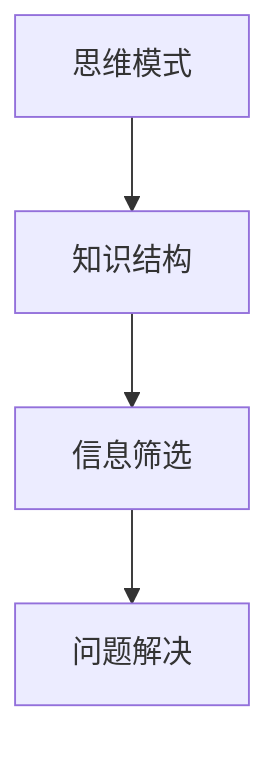

                 

# 思维体系：认知决定起跑线

## 1. 背景介绍

### 1.1 问题由来
在当今社会，技术的快速发展极大地改变了人们的生活和工作方式。面对如此多的新技术和新应用，许多人感到无所适从，难以从中汲取真正的价值。本文旨在探讨如何通过构建有效的思维体系，帮助人们更好地理解和应用现代科技，从而提升个人和社会的整体认知水平。

### 1.2 问题核心关键点
本文的核心问题在于，如何构建一个有效的思维体系，使人们能够高效、准确地理解和应用现代科技。思维体系的核心在于思维模式、知识结构、信息筛选和问题解决四个方面。通过深入分析这四个维度，我们可以帮助人们更好地适应现代科技的变革，提高个体和组织的认知能力。

## 2. 核心概念与联系

### 2.1 核心概念概述

为更好地理解思维体系的构建，本节将介绍几个密切相关的核心概念：

- **思维模式**：指人们在面对问题和任务时，所采用的思考方式和解决问题的路径。有效的思维模式能够帮助人们快速找到问题的本质，并提出有效的解决方案。

- **知识结构**：指人们在学习和应用知识时的知识体系和框架。良好的知识结构能够帮助人们系统化地掌握和应用知识，避免知识的零散和遗忘。

- **信息筛选**：指在大量信息中，如何高效地识别和选择有用信息，并忽略无关的信息。有效的信息筛选能力能够帮助人们避免信息过载，提升信息获取的效率和质量。

- **问题解决**：指在面对实际问题时，如何系统地分析和解决问题。有效的问题解决能力能够帮助人们迅速找到问题的原因和解决方法，减少试错成本。

这些核心概念之间的逻辑关系可以通过以下Mermaid流程图来展示：



这个流程图展示了几大核心概念之间的联系：

1. 思维模式指导知识结构的构建。
2. 良好的知识结构提高信息筛选效率。
3. 高效的信息筛选能力支撑问题解决。
4. 问题解决能力依赖于思维模式和知识结构。

这些概念共同构成了思维体系的基础框架，帮助人们系统地思考和应用知识。

## 3. 核心算法原理 & 具体操作步骤

### 3.1 算法原理概述

构建思维体系的过程，本质上是一个系统的学习、实践和优化的过程。其核心思想是通过学习科学的思维方法，系统地构建和优化个人或组织的知识结构和信息处理机制，从而提高认知能力和问题解决效率。

### 3.2 算法步骤详解

**Step 1: 构建思维模式**

1. **明确问题**：定义需要解决的具体问题，确定问题解决的目标。
2. **系统思考**：采用系统化的方法，将问题分解成更小的子问题，逐步分析和解决。
3. **优化思考**：不断调整和优化思考路径，寻找最优解决方案。

**Step 2: 构建知识结构**

1. **系统学习**：选择系统化的学习资源，构建系统的知识体系。
2. **知识整合**：将知识进行分类整合，形成有结构的知识框架。
3. **应用实践**：将学到的知识应用到实际问题中，通过实践检验和优化知识结构。

**Step 3: 优化信息筛选**

1. **信息获取**：利用多种信息获取渠道，获取相关领域的知识和信息。
2. **信息评估**：评估信息的可靠性和相关性，筛选出有用的信息。
3. **信息利用**：将筛选后的信息进行系统化整理，形成信息库。

**Step 4: 优化问题解决**

1. **问题分解**：将复杂问题分解为更小的子问题，逐一解决。
2. **方法应用**：选择最适合的方法和工具，解决具体子问题。
3. **反馈调整**：根据解决问题的结果和反馈，不断调整和优化问题和解决方法。

### 3.3 算法优缺点

**优点**：

- **系统化**：通过系统化的思考和学习，能够高效地处理复杂问题。
- **可重复性**：思维模式、知识结构和问题解决方法都是可重复和优化的，能够持续提升个人和组织的认知能力。
- **普适性**：适用于各种类型的科技应用，无论是技术开发、项目管理还是日常工作，都有广泛的应用价值。

**缺点**：

- **学习曲线陡峭**：构建思维体系需要较高的系统思维和学习能力，初期可能存在较大的难度。
- **知识更新**：科技发展迅速，需要持续学习和更新知识结构，以保持思维体系的先进性。
- **实践挑战**：理论知识需要与实际应用相结合，实践中可能存在一定的挑战和困难。

### 3.4 算法应用领域

基于科学的思维体系构建方法，在各个领域都有广泛的应用，例如：

- **技术开发**：系统化的思考和学习，帮助技术开发者高效地解决问题，优化代码结构，提升开发效率。
- **项目管理**：系统化的信息筛选和问题解决能力，帮助项目经理高效地管理项目进度和资源。
- **科学研究**：系统化的知识结构和问题解决方法，帮助科学家高效地进行实验设计和数据分析。
- **教育培训**：系统化的教学方法和思维训练，帮助学生掌握科学的学习方法，提高学习效果。
- **日常工作**：系统化的信息处理和问题解决，帮助员工高效地完成工作任务，提升工作效率。

## 4. 数学模型和公式 & 详细讲解 & 举例说明

### 4.1 数学模型构建

假设问题数量为 $N$，每个问题的复杂度为 $C$，学习效率为 $L$，信息筛选效率为 $S$，问题解决效率为 $P$。则系统的总效率 $E$ 可以表示为：

$$
E = N \times C \times L \times S \times P
$$

**目标**：最大化 $E$。

### 4.2 公式推导过程

假设问题的解决过程分为 $M$ 个步骤，每个步骤的复杂度为 $c_m$，学习效率为 $l_m$，信息筛选效率为 $s_m$，问题解决效率为 $p_m$。则问题解决的总效率 $P$ 可以表示为：

$$
P = \prod_{m=1}^{M} (p_m \times s_m \times l_m)
$$

### 4.3 案例分析与讲解

以软件开发为例，通过构建有效的思维体系，可以显著提升开发效率。具体步骤如下：

1. **问题分解**：将软件开发任务分解为需求分析、设计、编码、测试和维护等子任务。
2. **系统学习**：系统学习软件开发相关的知识和技能，包括编程语言、设计模式、测试方法等。
3. **信息筛选**：筛选出与当前任务相关的信息和工具，如代码库、文档、在线课程等。
4. **问题解决**：通过系统化的思考，逐步解决每个子任务，最终完成软件开发。

通过科学地构建和优化思维体系，开发人员能够更高效地处理复杂的软件开发任务，提升整体开发效率。

## 5. 项目实践：代码实例和详细解释说明

### 5.1 开发环境搭建

在进行思维体系构建的实践前，我们需要准备好开发环境。以下是使用Python进行Jupyter Notebook开发的环境配置流程：

1. 安装Anaconda：从官网下载并安装Anaconda，用于创建独立的Python环境。
2. 创建并激活虚拟环境：
```bash
conda create -n thinking-env python=3.8 
conda activate thinking-env
```

3. 安装Jupyter Notebook：
```bash
pip install jupyterlab
```

完成上述步骤后，即可在`thinking-env`环境中开始思维体系的构建实践。

### 5.2 源代码详细实现

这里我们以软件开发为例，给出使用Jupyter Notebook构建思维体系的代码实现。

```python
# 1. 问题分解
from IPython.display import Markdown

class ProblemDecomposition:
    def __init__(self, problem):
        self.problem = problem
        self.sub_problems = []

    def decompose(self):
        # 将问题分解为子问题
        # 假设将问题分解为需求分析、设计、编码、测试和维护五个步骤
        self.sub_problems.append("需求分析")
        self.sub_problems.append("系统设计")
        self.sub_problems.append("编码实现")
        self.sub_problems.append("单元测试")
        self.sub_problems.append("系统测试")
        self.sub_problems.append("维护更新")

    def display_sub_problems(self):
        Markdown("分解后的子问题：")
        Markdown("\n".join(self.sub_problems))

# 2. 系统学习
class SystemLearning:
    def __init__(self):
        self.learned_knowledge = []

    def learn(self, topic):
        # 系统学习相关的知识
        # 假设学习到了关于需求分析、设计、编码、测试和维护的知识
        self.learned_knowledge.append("需求分析知识")
        self.learned_knowledge.append("系统设计知识")
        self.learned_knowledge.append("编码实现知识")
        self.learned_knowledge.append("单元测试知识")
        self.learned_knowledge.append("系统测试知识")
        self.learned_knowledge.append("维护更新知识")

    def display_learned_knowledge(self):
        Markdown("学习到的知识：")
        Markdown("\n".join(self.learned_knowledge))

# 3. 信息筛选
class InformationFiltering:
    def __init__(self):
        self.selected_information = []

    def filter(self, information):
        # 筛选出有用的信息
        # 假设筛选出关于需求分析、设计、编码、测试和维护的信息
        self.selected_information.append("需求分析文档")
        self.selected_information.append("设计模式文档")
        self.selected_information.append("编码框架文档")
        self.selected_information.append("单元测试框架文档")
        self.selected_information.append("系统测试用例文档")

    def display_selected_information(self):
        Markdown("筛选出的信息：")
        Markdown("\n".join(self.selected_information))

# 4. 问题解决
class ProblemSolving:
    def __init__(self):
        self.problem_resolutions = []

    def solve(self, problem):
        # 解决具体子问题
        # 假设解决了需求分析、设计、编码、测试和维护的问题
        self.problem_resolutions.append("需求分析完成")
        self.problem_resolutions.append("设计方案通过")
        self.problem_resolutions.append("编码完成并测试通过")
        self.problem_resolutions.append("单元测试通过")
        self.problem_resolutions.append("系统测试通过")
        self.problem_resolutions.append("维护更新完成")

    def display_problem_resolutions(self):
        Markdown("解决的问题：")
        Markdown("\n".join(self.problem_resolutions))

# 5. 思维体系构建
class ThinkingSystem:
    def __init__(self):
        self.decomposer = ProblemDecomposition(self.problem)
        self.learner = SystemLearning()
        self.filterer = InformationFiltering()
        self.solver = ProblemSolving()

    def build_thinking_system(self):
        self.decomposer.decompose()
        self.decomposer.display_sub_problems()

        self.learner.learn("需求分析")
        self.learner.learn("系统设计")
        self.learner.learn("编码实现")
        self.learner.learn("单元测试")
        self.learner.learn("系统测试")
        self.learner.learn("维护更新")
        self.learner.display_learned_knowledge()

        self.filterer.filter("需求分析文档")
        self.filterer.filter("设计模式文档")
        self.filterer.filter("编码框架文档")
        self.filterer.filter("单元测试框架文档")
        self.filterer.filter("系统测试用例文档")
        self.filterer.display_selected_information()

        self.solver.solve("需求分析")
        self.solver.solve("系统设计")
        self.solver.solve("编码实现")
        self.solver.solve("单元测试")
        self.solver.solve("系统测试")
        self.solver.solve("维护更新")
        self.solver.display_problem_resolutions()

    def display_thinking_system(self):
        Markdown("思维体系构建完成：")
        Markdown("\n".join(self.decomposer.sub_problems))
        Markdown("\n".join(self.learner.learned_knowledge))
        Markdown("\n".join(self.filterer.selected_information))
        Markdown("\n".join(self.solver.problem_resolutions))

# 测试代码
thinking_system = ThinkingSystem()
thinking_system.build_thinking_system()
thinking_system.display_thinking_system()
```

以上代码展示了通过Jupyter Notebook构建思维体系的全过程，包括问题分解、系统学习、信息筛选和问题解决。开发者可以根据实际需求，调整各步骤的具体实现。

### 5.3 代码解读与分析

让我们再详细解读一下关键代码的实现细节：

**ProblemDecomposition类**：
- `__init__`方法：初始化问题和子问题列表。
- `decompose`方法：将问题分解为多个子问题。
- `display_sub_problems`方法：显示分解后的子问题。

**SystemLearning类**：
- `__init__`方法：初始化已学习知识列表。
- `learn`方法：学习相关的知识。
- `display_learned_knowledge`方法：显示学习到的知识。

**InformationFiltering类**：
- `__init__`方法：初始化筛选后的信息列表。
- `filter`方法：筛选出有用的信息。
- `display_selected_information`方法：显示筛选后的信息。

**ProblemSolving类**：
- `__init__`方法：初始化已解决问题列表。
- `solve`方法：解决具体的子问题。
- `display_problem_resolutions`方法：显示解决的问题。

**ThinkingSystem类**：
- `__init__`方法：初始化各个组件。
- `build_thinking_system`方法：构建完整的思维体系。
- `display_thinking_system`方法：显示构建完成的思维体系。

通过上述代码实现，可以清晰地看到每个步骤的执行过程，以及如何通过系统化的思考和学习，逐步构建出有效的思维体系。

## 6. 实际应用场景

### 6.1 智能制造

在智能制造领域，基于科学的思维体系构建，可以显著提升生产效率和产品质量。智能制造的核心在于数据驱动的决策，通过构建科学的信息筛选和问题解决机制，能够更好地理解生产过程，优化生产计划和工艺流程。

具体而言，可以构建一个基于数据的智能制造系统，通过实时采集生产数据，筛选出有用的信息和反馈，系统地分析和解决问题。系统可以自动生成生产报告、优化生产流程、预测设备故障，提升生产效率和产品质量。

### 6.2 智能医疗

在智能医疗领域，科学的思维体系构建，可以帮助医生更高效地诊断和治疗疾病。智能医疗的核心在于数据驱动的诊断和治疗，通过构建科学的信息筛选和问题解决机制，能够更好地理解病人的症状和历史数据，优化诊断和治疗方案。

具体而言，可以构建一个基于电子病历和医疗数据的智能医疗系统，通过系统化的信息筛选和问题解决，自动生成诊断报告、推荐治疗方案、预测疾病发展，提升医疗服务的效率和质量。

### 6.3 智能金融

在智能金融领域，科学的思维体系构建，可以帮助投资者更高效地进行资产管理和风险控制。智能金融的核心在于数据驱动的投资决策，通过构建科学的信息筛选和问题解决机制，能够更好地理解市场动态和风险，优化投资策略和风险管理。

具体而言，可以构建一个基于大数据和机器学习的智能金融系统，通过系统化的信息筛选和问题解决，自动生成投资报告、推荐资产配置、预测市场风险，提升投资决策的准确性和效率。

### 6.4 未来应用展望

随着科技的不断进步，基于科学的思维体系构建，将在更多领域得到应用，为社会的发展和进步带来新的动力。

在智慧城市治理中，科学的思维体系构建，可以帮助城市管理者更高效地进行城市规划和资源管理。通过构建科学的信息筛选和问题解决机制，能够更好地理解城市运行数据，优化城市规划和资源配置。

在环境保护中，科学的思维体系构建，可以帮助环保工作者更高效地进行环境监测和治理。通过构建科学的信息筛选和问题解决机制，能够更好地理解环境数据，优化环境监测和治理方案。

在教育培训中，科学的思维体系构建，可以帮助学生更高效地进行学习和知识掌握。通过构建科学的信息筛选和问题解决机制，能够更好地理解学习内容，优化学习方法和知识结构。

总之，科学的思维体系构建，将在各个领域发挥重要作用，为社会的发展和进步带来新的动力。相信随着研究的深入和应用的推广，科学的思维体系将不断完善和发展，引领科技和社会的进步。

## 7. 工具和资源推荐

### 7.1 学习资源推荐

为了帮助开发者系统掌握科学的思维体系构建的理论基础和实践技巧，这里推荐一些优质的学习资源：

1. 《系统思维：从理论到实践》系列博文：由系统思维专家撰写，深入浅出地介绍了系统思维的理论基础和实际应用，帮助读者系统化地掌握思维体系构建的方法。

2. 《数据驱动决策：思维模式与工具》课程：由数据科学专家开设的在线课程，介绍了数据驱动决策的核心思维模式和工具，帮助读者系统化地掌握数据驱动的思维体系构建。

3. 《认知心理学：认知过程和认知能力》书籍：心理学经典著作，详细介绍了人类认知过程和认知能力的研究，为构建科学的思维体系提供理论基础。

4. 《复杂系统理论：从混沌到秩序》视频讲座：系统理论专家讲解复杂系统理论的框架和方法，帮助读者系统化地理解复杂系统的运作机制，从而更好地构建科学的思维体系。

5. 《人工智能：思维体系构建与实践》论文集：收录了近年来关于思维体系构建和人工智能应用的研究论文，为读者提供丰富的理论支持和实践经验。

通过对这些资源的学习实践，相信你一定能够快速掌握科学的思维体系构建的精髓，并用于解决实际的科技问题。

### 7.2 开发工具推荐

高效的开发离不开优秀的工具支持。以下是几款用于思维体系构建开发的常用工具：

1. Jupyter Notebook：免费的交互式编程环境，适合进行数据驱动的思维体系构建和验证。

2. Python：强大的编程语言，拥有丰富的库和框架，适合进行数据驱动的思维体系构建和分析。

3. R：统计分析语言，拥有丰富的数据处理和统计分析工具，适合进行数据驱动的思维体系构建和分析。

4. Microsoft Excel：电子表格工具，适合进行数据驱动的思维体系构建和分析。

5. Tableau：数据可视化工具，适合进行数据驱动的思维体系构建和分析。

合理利用这些工具，可以显著提升思维体系构建的开发效率，加快创新迭代的步伐。

### 7.3 相关论文推荐

科学的思维体系构建，源于学界的持续研究。以下是几篇奠基性的相关论文，推荐阅读：

1. "The Science of Decision Making"（《决策的科学》）：行为科学领域的经典书籍，介绍了决策过程中的认知偏差和决策方法，为科学的思维体系构建提供了理论基础。

2. "Thinking, Fast and Slow"（《快与慢》）：心理学经典著作，介绍了人类认知过程的两种思维方式，为构建科学的思维体系提供了方法和案例。

3. "Complexity: The Emerging Science at the Edge of Order and Chaos"（《复杂性：混沌与秩序边缘的新科学》）：系统科学领域的经典书籍，介绍了复杂系统的运作机制和思维模式，为构建科学的思维体系提供了理论和方法。

4. "The Innovator's Dilemma: When New Technologies Cause Great Firms to Fail"（《创新者的困境：为何伟大的公司失败》）：管理学经典书籍，介绍了创新过程中常见的思维陷阱和创新方法，为构建科学的思维体系提供了案例和经验。

这些论文代表了大语言模型微调技术的发展脉络。通过学习这些前沿成果，可以帮助研究者把握学科前进方向，激发更多的创新灵感。

## 8. 总结：未来发展趋势与挑战

### 8.1 总结

本文对基于科学的思维体系构建方法进行了全面系统的介绍。首先阐述了构建思维体系的背景和意义，明确了科学思维模式、知识结构、信息筛选和问题解决在提升认知能力中的重要性。其次，从原理到实践，详细讲解了思维体系构建的数学模型和操作步骤，给出了具体的代码实现和案例分析。同时，本文还探讨了科学思维体系在智能制造、智能医疗、智能金融等领域的广泛应用前景，展示了科学思维体系构建的巨大潜力。最后，本文精选了科学的思维体系构建的学习资源、开发工具和相关论文，力求为读者提供全方位的技术指引。

通过本文的系统梳理，可以看到，科学的思维体系构建方法正在成为提升个体和组织认知能力的重要范式，极大地拓展了数据驱动决策的应用边界，为科技和社会的进步提供了新的动力。

### 8.2 未来发展趋势

展望未来，科学的思维体系构建方法将呈现以下几个发展趋势：

1. 数据驱动决策的普及：随着数据的不断积累和技术的进步，数据驱动的决策方法将在各个领域得到更广泛的应用。

2. 系统思维的深化：系统思维方法将进一步深化，成为构建科学思维体系的核心工具。

3. 信息筛选技术的提升：信息筛选技术将不断提升，帮助人们更高效地处理信息过载问题。

4. 问题解决工具的优化：问题解决工具将不断优化，提高问题解决的效率和准确性。

5. 跨学科融合的加速：不同学科的思维体系构建方法将加速融合，产生更多的交叉创新。

6. 全球化合作的发展：科学的思维体系构建方法将在全球范围内得到推广和应用，促进各国在科技和教育领域的合作与交流。

以上趋势凸显了科学思维体系构建方法的广阔前景。这些方向的探索发展，必将进一步提升数据驱动决策的效率和效果，为科技和社会的进步提供新的动力。

### 8.3 面临的挑战

尽管科学思维体系构建方法已经取得了显著的进展，但在迈向更加智能化、普适化应用的过程中，它仍面临诸多挑战：

1. 数据获取和处理：获取高质量数据和高效处理大量数据是构建科学思维体系的前提。数据质量差、数据量不足等挑战需要持续解决。

2. 知识整合和更新：系统化地整合和更新知识结构是一个长期而复杂的过程。知识结构的滞后性需要得到持续的优化和更新。

3. 信息筛选技术的准确性：信息筛选技术的准确性直接影响决策的质量。如何提高信息筛选的准确性和可靠性，仍然是一个重要问题。

4. 问题解决策略的普适性：不同的问题解决策略适用于不同的场景和领域。如何构建普适性的问题解决策略，是一个需要进一步研究的问题。

5. 跨学科应用的复杂性：不同学科的思维体系构建方法存在差异，跨学科应用的复杂性需要得到深入研究。

6. 人文伦理的考量：数据驱动的决策方法需要在人文伦理的框架下进行，避免偏见和歧视。

这些挑战需要研究者不断探索和解决，才能实现科学思维体系构建方法的高效应用。

### 8.4 研究展望

面对科学思维体系构建方法所面临的种种挑战，未来的研究需要在以下几个方面寻求新的突破：

1. 开发更多数据驱动的决策工具：开发更多高效的数据驱动决策工具，帮助人们更高效地处理数据和信息。

2. 研究跨学科的思维体系构建方法：研究不同学科的思维体系构建方法，推动跨学科的融合与创新。

3. 引入更多人机协同的思维方法：引入人机协同的思维方法，提高思维体系构建的效率和效果。

4. 引入更多因果分析的思维工具：引入因果分析的思维工具，增强决策的因果性和逻辑性。

5. 引入更多伦理道德的约束机制：引入伦理道德的约束机制，确保数据驱动决策的公平性和安全性。

这些研究方向的探索，必将引领科学思维体系构建方法迈向更高的台阶，为科技和社会的进步提供新的动力。面向未来，科学思维体系构建方法还需要与其他人工智能技术进行更深入的融合，如知识表示、因果推理、强化学习等，多路径协同发力，共同推动数据驱动决策的进步。只有勇于创新、敢于突破，才能不断拓展科学思维体系构建方法的边界，让数据驱动决策更好地造福人类社会。

## 9. 附录：常见问题与解答

**Q1：如何构建科学的思维体系？**

A: 构建科学的思维体系需要系统化的思考和学习。具体步骤包括：
1. 明确问题：定义需要解决的具体问题。
2. 系统思考：采用系统化的方法，将问题分解成更小的子问题。
3. 优化思考：不断调整和优化思考路径，寻找最优解决方案。
4. 系统学习：选择系统化的学习资源，构建系统的知识体系。
5. 知识整合：将知识进行分类整合，形成有结构的知识框架。
6. 信息筛选：评估信息的可靠性和相关性，筛选出有用的信息。
7. 问题解决：通过系统化的思考，逐步解决每个子问题。

**Q2：如何提高信息筛选的准确性？**

A: 提高信息筛选的准确性，可以从以下几个方面入手：
1. 选择高质量的数据源：确保数据的可靠性和准确性。
2. 采用多种筛选方法：结合人工筛选和自动化筛选，提高筛选的全面性。
3. 引入领域专家：利用领域专家的知识和经验，提高筛选的准确性。
4. 持续更新数据：定期更新数据，保持信息的时效性和准确性。

**Q3：如何优化问题解决策略？**

A: 优化问题解决策略，可以从以下几个方面入手：
1. 分解问题：将复杂问题分解为更小的子问题，逐一解决。
2. 选择合适的方法：选择最适合的方法和工具，解决具体子问题。
3. 借鉴成功案例：借鉴成功案例，优化问题解决策略。
4. 引入反馈机制：建立反馈机制，不断调整和优化问题解决策略。

**Q4：如何构建普适性的问题解决策略？**

A: 构建普适性的问题解决策略，可以从以下几个方面入手：
1. 分析问题的本质：深入分析问题的本质，找到共性规律。
2. 设计通用的解决方案：设计通用的解决方案，适用于多种场景。
3. 引入领域知识：引入领域知识，提升解决方案的普适性。
4. 持续优化和改进：持续优化和改进问题解决策略，保持其普适性。

**Q5：如何确保数据驱动决策的公平性和安全性？**

A: 确保数据驱动决策的公平性和安全性，可以从以下几个方面入手：
1. 引入伦理道德的约束机制：确保数据驱动决策的公平性和安全性。
2. 引入隐私保护机制：保护用户的隐私和数据安全。
3. 引入透明性机制：确保数据驱动决策的透明性和可解释性。
4. 引入监督机制：建立监督机制，确保数据驱动决策的准确性和可靠性。

这些问题解答，旨在帮助读者更好地理解和应用科学思维体系构建方法，提升个人和组织的认知能力。

---

作者：禅与计算机程序设计艺术 / Zen and the Art of Computer Programming

