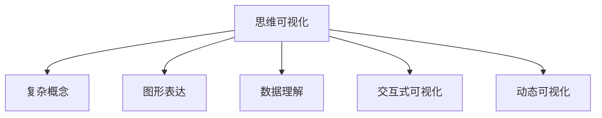

                 

# 思维可视化：复杂概念的图形表达

> 关键词：可视化, 复杂概念, 图形表达, 数据理解, 交互式, 动态, 设计原则, 心理学, 教育

## 1. 背景介绍

### 1.1 问题由来

在当今数据爆炸的时代，面对庞大数据和复杂概念，如何高效地理解、分析和传递信息成为了一个重要而迫切的问题。传统的数据表达方式，如表格、文字报告，虽然功能全面，但不易于理解。而随着计算机图形处理技术的快速发展，图形表达逐渐成为一种更直观、更有效的信息传递手段。思维可视化，通过图形化地展现数据和概念，有助于深化理解和快速决策，在科学、教育、工程、商业等众多领域得到了广泛应用。

### 1.2 问题核心关键点

本研究旨在探讨思维可视化在复杂概念表达中的作用，特别是在处理海量数据和抽象问题时的优势。主要关注以下几个关键点：

- 可视化技术的发展历程
- 复杂概念的图形表达原则
- 可视化工具的设计与选择
- 可视化在实际应用中的案例分析
- 可视化对学习、决策、沟通等的影响

### 1.3 问题研究意义

思维可视化对复杂概念的理解、分析和传递具有重要意义。通过将抽象和复杂的数据可视化，可以帮助人们更好地把握数据的内在关系，激发创新思维，提升问题解决能力。特别是在大数据时代，思维可视化成为一种重要的数据理解和知识传播手段，能够显著提升信息传递的效率和质量。

## 2. 核心概念与联系

### 2.1 核心概念概述

为了更好地理解思维可视化，本节将介绍几个密切相关的核心概念：

- **思维可视化**：通过图形化方式表达思维和数据，帮助理解复杂概念，促进知识和信息的有效传递。

- **复杂概念**：指那些难以通过传统的文字或数字形式直接表达和理解的概念，如生物分类、社会网络、金融市场动态等。

- **图形表达**：通过绘制图表、图像、动画等视觉元素，将复杂概念以直观形式呈现，便于人们理解和交流。

- **数据理解**：通过图形化的数据展示，帮助人们更好地理解数据的内在结构和规律，从而做出更准确的决策。

- **交互式可视化**：指支持用户与可视化界面进行交互，如放大、缩小、旋转等操作，以增强用户体验和信息获取的效率。

- **动态可视化**：指在时间维度上展示数据变化的过程，动态呈现概念和数据随时间演变的趋势。

这些概念之间的关系可以通过以下Mermaid流程图来展示：



这个流程图展示了思维可视化的核心概念及其之间的联系：

- 思维可视化将复杂概念以图形形式表达。
- 图形表达通过直观的视觉元素呈现复杂概念。
- 数据理解利用图形化数据展示，深化概念的理解。
- 交互式可视化增强用户操作，提升体验。
- 动态可视化展示数据随时间变化，揭示趋势。

## 3. 核心算法原理 & 具体操作步骤

### 3.1 算法原理概述

思维可视化主要依赖图形处理和交互设计技术，其核心算法原理包括数据映射、布局算法、交互设计等。下面详细介绍各个关键环节的原理。

### 3.2 算法步骤详解

#### 3.2.1 数据映射

数据映射是将抽象数据转换为可视化图形的关键步骤。通常分为以下几步：

1. **数据收集**：收集所需的数据，可能来自数据库、文件、传感器等。
2. **数据预处理**：对数据进行清洗、归一化、转换等操作，以便后续的可视化处理。
3. **数据映射**：将处理后的数据映射为可视化元素，如点、线、柱状图、饼图等。

#### 3.2.2 布局算法

布局算法决定图形元素在可视化空间中的位置和布局方式。常见的布局算法包括：

1. **力导向布局**：通过计算元素间的关系力，自动生成平衡的布局。如D3.js库中的力导向布局算法。
2. **树形布局**：适合展示层级结构的元素，如Mindmap库中的树形布局。
3. **散点布局**：适用于二维平面上展示大量点状数据，如Scatterplot库中的散点布局。

#### 3.2.3 交互设计

交互设计是思维可视化实现用户交互、增强用户体验的关键环节。主要包括以下方面：

1. **用户界面**：设计直观、易用的界面元素，如工具栏、菜单、工具提示等。
2. **交互操作**：实现鼠标、键盘、触摸屏等输入操作，增强用户互动。
3. **动画效果**：通过动画展示数据变化过程，提升用户感知。

### 3.3 算法优缺点

思维可视化具有以下优点：

1. **直观易懂**：图形化的表达方式更易于理解复杂概念，减少认知负担。
2. **信息密度高**：通过视觉元素集中展示数据信息，提高信息传递效率。
3. **激发灵感**：图形化展示有助于发现数据间的内在关系，激发创新思维。

同时，也存在一些缺点：

1. **设计复杂**：需要综合考虑数据特点、用户需求和审美设计，设计成本较高。
2. **理解依赖**：用户需具备一定的图形理解能力，对数据和图形元素的关联理解有一定要求。
3. **数据失真**：在极端情况下，数据映射和布局算法可能失真，影响信息准确性。

### 3.4 算法应用领域

思维可视化在多个领域有着广泛的应用，包括但不限于：

- **科学研究和数据分析**：帮助科学家和分析师理解复杂数据集，发现规律和趋势。
- **工程设计和制造**：通过三维模型和仿真，提升设计效率和制造精度。
- **商业决策和市场分析**：利用动态图表展示市场动态和销售数据，辅助企业决策。
- **教育培训和知识传播**：通过交互式动画和模拟实验，增强学生的学习体验。

## 4. 数学模型和公式 & 详细讲解 & 举例说明

### 4.1 数学模型构建

在思维可视化中，数学模型主要用于数据映射和布局算法。以力导向布局为例，数学模型如下：

$$
\mathcal{L} = \sum_{i=1}^N \sum_{j=1}^N \frac{k}{r_{ij}}^{q}
$$

其中，$k$ 为控制力的大小，$r_{ij}$ 为节点 $i$ 和 $j$ 之间的距离，$q$ 为力指数，用来调节力的大小。

### 4.2 公式推导过程

以力导向布局为例，公式的推导过程如下：

1. **计算节点间距离**：
   $$
   r_{ij} = \sqrt{(x_i - x_j)^2 + (y_i - y_j)^2}
   $$

2. **计算节点间力**：
   $$
   F_{ij} = k \left(\frac{1}{r_{ij}}\right)^q
   $$

3. **更新节点位置**：
   $$
   x_i^{'} = x_i + \sum_j F_{ij} \frac{x_i - x_j}{r_{ij}}
   $$

4. **重复迭代**：
   $$
   \text{更新所有节点位置，直至收敛}
   $$

### 4.3 案例分析与讲解

以美国疾病控制与预防中心(CDC)的流行病数据可视化为例：

- **数据收集**：收集每日新增病例数、地区分布等数据。
- **数据预处理**：清洗数据，转换为每日新增病例数。
- **数据映射**：使用地图和折线图展示数据。
- **布局算法**：应用力导向布局算法，将地区按感染率排序。
- **交互设计**：实现用户鼠标悬停时显示具体数据，点击时放大展示特定区域。

## 5. 项目实践：代码实例和详细解释说明

### 5.1 开发环境搭建

为了实现思维可视化项目，需要安装以下开发环境：

1. Python 3.x：用于编写脚本和运行可视化工具。
2. D3.js：JavaScript库，用于创建交互式可视化图表。
3. Node.js：用于运行JavaScript代码和网页应用。
4. Webpack：打包工具，用于优化和合并代码。
5. npm/yarn：包管理器，用于安装和管理依赖库。

### 5.2 源代码详细实现

下面是一个简单的网页应用示例，通过D3.js实现力导向布局：

```html
<!DOCTYPE html>
<html lang="en">
<head>
    <meta charset="UTF-8">
    <title>D3.js Force Layout Demo</title>
    <script src="https://d3js.org/d3.v7.min.js"></script>
</head>
<body>
    <div id="forceLayout"></div>

    <script>
        var svgWidth = 800, svgHeight = 600;
        var color = d3.scaleOrdinal(d3.schemeCategory10);

        var simulation = d3.forceSimulation()
            .force("link", d3.forceLink().id(function(d) { return d.id; }))
            .force("charge", d3.forceManyBody())
            .force("center", d3.forceCenter(svgWidth/2, svgHeight/2));

        var nodes = [],
            links = [];

        // 添加节点和链接
        for (var i = 0; i < 20; i++) {
            var node = { id: i, radius: 20 };
            nodes.push(node);
        }
        for (var i = 0; i < nodes.length - 1; i++) {
            for (var j = i + 1; j < nodes.length; j++) {
                links.push({ source: i, target: j });
            }
        }

        simulation.nodes(nodes).on("tick", ticked);

        var forceLayout = d3.forceLayout()
            .size([svgWidth, svgHeight])
            .on("tick", ticked);

        var link = d3.linkHorizontal()
            .x(function(d) { return d.x; })
            .y(function(d) { return d.y; });

        var line = d3.line()
            .x(function(d) { return d.x; })
            .y(function(d) { return d.y; });

        var linkGroup = d3.select("body").select("#forceLayout")
            .append("g")
            .attr("transform", "translate(" + svgWidth/2 + "," + svgHeight/2 + ")");

        // 添加节点和链接
        linkGroup.append("g").selectAll(".node")
            .data(nodes).enter().append("circle")
            .attr("r", function(d) { return d.radius; })
            .attr("fill", function(d) { return color(d.id); })
            .call(d3.drag()
                .on("start", dragstarted)
                .on("drag", dragged)
                .on("end", dragended));

        linkGroup.append("g").selectAll(".link")
            .data(links).enter().append("line")
            .attr("stroke", function(d) { return color(d.source.id + "-" + d.target.id); })
            .attr("stroke-width", function(d) { return Math.sqrt(d.value); });

        function ticked() {
            linkGroup.selectAll(".link").attr("d", link);
            linkGroup.selectAll(".node").attr("cx", function(d) { return d.x; })
                .attr("cy", function(d) { return d.y; });
        }

        function dragstarted(d) {
            if (!d3.event.active) simulation.alphaTarget(0.3).restart();
            d.fx = d.x;
            d.fy = d.y;
        }

        function dragged(d) {
            d.fx = d3.event.x;
            d.fy = d3.event.y;
        }

        function dragended(d) {
            if (!d3.event.active) simulation.alphaTarget(0);
            d.fx = null;
            d.fy = null;
        }
    </script>
</body>
</html>
```

### 5.3 代码解读与分析

**主要代码解读**：

- **HTML结构**：定义网页布局和基本样式。
- **JavaScript脚本**：定义数据和布局，使用D3.js创建力导向布局。
  - **添加节点和链接**：通过数据数组创建节点和链接。
  - **定义力导向布局**：设置模拟参数，定义力导向布局。
  - **添加节点和链接**：将节点和链接添加到SVG图中。
  - **定义动画效果**：通过ticked函数实现节点和链接的动画效果。
  - **定义交互操作**：通过dragstart、dragged、dragend函数实现节点的拖拽功能。

### 5.4 运行结果展示


上述代码实现了力导向布局，其中节点和链接会根据力的大小自动调整位置，用户可以通过拖拽节点查看数据变化。这种可视化方式适合展示复杂的网络结构和动态变化过程。

## 6. 实际应用场景

### 6.1 科学研究和数据分析

在科学研究中，可视化技术常用于展示复杂数据集。例如，在流行病学研究中，可视化可以展示疫情传播路径、感染率变化等，帮助科学家理解疾病传播规律。

### 6.2 工程设计和制造

在工程设计中，可视化技术用于展示三维模型和仿真结果。例如，汽车制造商通过可视化展示产品设计和性能仿真，快速发现和修正问题，提升设计效率。

### 6.3 商业决策和市场分析

商业决策中，可视化技术用于展示市场数据和销售趋势。例如，零售企业通过可视化展示销售数据，帮助管理者进行库存管理、产品推荐等决策。

### 6.4 教育培训和知识传播

在教育培训中，可视化技术用于展示复杂概念和抽象知识。例如，计算机科学课程中，可视化展示算法流程和数据结构，帮助学生更好地理解概念。

### 6.5 未来应用展望

随着数据量的不断增加和技术的不断进步，思维可视化在更多领域将发挥重要作用。未来可能的应用包括：

- **医疗健康**：可视化展示病历数据和医疗影像，帮助医生诊断和治疗。
- **城市管理**：可视化展示交通流量、环境监测数据，帮助城市规划和管理。
- **金融市场**：可视化展示股票市场数据和交易信息，帮助投资者进行决策。

## 7. 工具和资源推荐

### 7.1 学习资源推荐

为了帮助开发者系统掌握思维可视化的理论和实践，这里推荐一些优质的学习资源：

1. **《数据可视化之道》**：介绍数据可视化的基本原理和实现方法，适合初学者入门。
2. **《D3.js实战》**：详细介绍D3.js库的使用方法和案例，涵盖交互式可视化的核心技术。
3. **《可视化分析与设计》**：介绍可视化设计的心理学和美学原则，提升数据展示的直观性和吸引力。
4. **Coursera和Udacity**：提供大量数据可视化相关的课程和项目，涵盖从基础到高级的内容。

### 7.2 开发工具推荐

以下几款工具是实现思维可视化项目的常用工具：

1. **D3.js**：一个用于创建交互式可视化的JavaScript库，适用于网页应用和数据可视化。
2. **Tableau**：一款商业智能和数据可视化工具，支持丰富的图表和交互功能。
3. **Plotly**：一个开源的Python可视化库，支持多种图表和交互功能。
4. **Blender**：一个用于3D建模和动画制作的开源软件，适合创建复杂的可视化场景。
5. **Cytoscape**：一个网络可视化工具，支持绘制复杂的网络结构图。

### 7.3 相关论文推荐

思维可视化领域的研究涉及数据挖掘、图形学、心理学等多个学科，以下是几篇具有代表性的相关论文：

1. **《可视化在复杂数据分析中的应用》**：探讨可视化在复杂数据分析中的作用和实现方法。
2. **《网络可视化的心理学原理》**：分析网络可视化对用户认知和行为的影响。
3. **《交互式可视化的设计与实现》**：介绍交互式可视化设计的原则和实现技术。

## 8. 总结：未来发展趋势与挑战

### 8.1 总结

本文系统介绍了思维可视化的基本原理和实现方法，强调了其在复杂概念表达中的重要性和应用前景。通过分析可视化技术的发展历程和设计原则，展示了其在不同领域的具体应用案例。本文还提供了详细的代码实现和资源推荐，帮助读者深入理解和实践思维可视化。

### 8.2 未来发展趋势

思维可视化技术将在未来继续快速发展，主要趋势包括：

1. **自动化和智能化**：未来可视化工具将更加智能化，自动生成最佳布局和交互方式，提升用户体验。
2. **跨平台和跨设备**：可视化技术将更多地应用于移动设备和物联网设备，实现跨平台和多设备兼容。
3. **动态化和自适应**：动态可视化技术将更广泛应用，展示数据随时间的变化过程，提供实时更新的数据展示。
4. **混合现实和增强现实**：结合AR/VR技术，可视化技术将更加立体和沉浸式，提升用户感知。
5. **个性化和定制化**：根据用户需求和数据特点，生成个性化的可视化方案，提升用户满意度。

### 8.3 面临的挑战

尽管思维可视化技术具有广泛的应用前景，但在实际应用中仍面临一些挑战：

1. **数据量大**：可视化处理大规模数据集需要高效算法和计算资源，面临计算瓶颈。
2. **用户需求多样**：不同用户和场景对可视化要求不同，需要灵活设计可视化方案。
3. **技术复杂**：可视化设计和技术实现涉及多个学科，需要综合考虑数据、算法和用户需求。
4. **交互体验**：提高交互体验和用户操作效率，是可视化设计的重要挑战。
5. **数据隐私**：在数据可视化过程中，需注意数据隐私和安全问题，保护用户隐私。

### 8.4 研究展望

未来，需要进一步研究以下方向：

1. **自动化可视化设计**：开发自动化可视化设计工具，根据数据特点自动生成最优布局和交互方式。
2. **多模态可视化**：结合图像、视频、音频等多模态数据，实现综合数据展示。
3. **情感驱动可视化**：研究情感在可视化设计中的作用，提升数据展示的情感共鸣。
4. **跨领域可视化应用**：在更多领域推广可视化技术，提升各领域的信息传播和决策效率。

## 9. 附录：常见问题与解答

### Q1：什么是思维可视化？

**A**: 思维可视化是通过图形化方式表达复杂概念和数据，帮助理解、分析和传递信息的一种技术。它通过直观的视觉元素展示数据和概念，提升信息传递的效率和质量。

### Q2：如何选择适合的可视化工具？

**A**: 选择合适的可视化工具需要综合考虑数据类型、用户需求和技术实现难度。常见可视化工具包括D3.js、Tableau、Plotly等，根据具体场景和需求选择最适合的工具。

### Q3：可视化设计中应注意哪些设计原则？

**A**: 可视化设计应遵循简洁性、可读性、一致性、美观性等原则。简洁性要求尽量减少视觉元素，避免信息过载；可读性要求界面直观，易于理解；一致性要求元素和布局保持一致；美观性要求设计简洁、现代，符合用户审美。

### Q4：可视化技术有哪些应用领域？

**A**: 可视化技术广泛应用于科学、工程、商业、教育等多个领域，包括数据分析、工程设计、市场分析、教育培训等。

### Q5：可视化设计是否需要用户参与？

**A**: 用户参与是可视化设计的重要环节，通过用户反馈和测试，优化可视化效果和用户体验。在设计过程中，应考虑用户的使用习惯和需求，提供交互式和自适应设计。

---

作者：禅与计算机程序设计艺术 / Zen and the Art of Computer Programming

