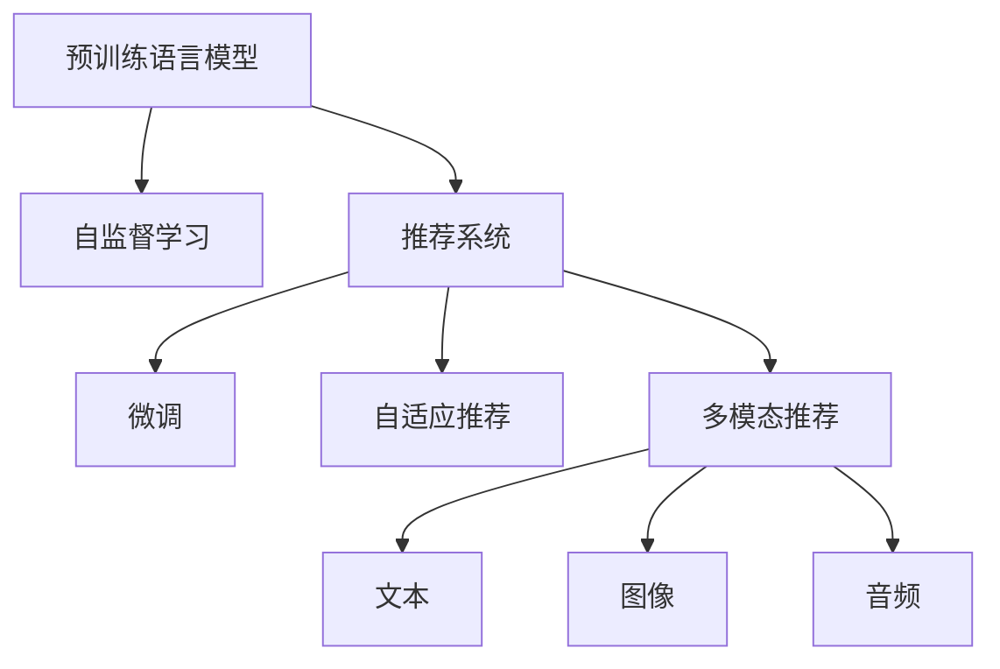

                 

# 总结与展望：大模型在推荐系统中的未来趋势

## 1. 背景介绍

### 1.1 问题由来
推荐系统一直是互联网应用的核心理论和技术领域，其核心目标是通过分析用户的历史行为，预测用户未来的兴趣，从而为用户推荐最合适的商品或内容。传统推荐系统主要依赖用户行为数据进行建模，这种方法对于历史行为丰富的用户（如电商用户）效果显著，但对于新用户或行为数据较少的用户，推荐的准确性和覆盖性会大打折扣。

近年来，随着深度学习和大模型的兴起，推荐系统开始尝试利用预训练语言模型来提升推荐性能。预训练语言模型在处理大规模文本数据、捕捉丰富语义信息方面的优势，使它在推荐系统中具备了更大的潜力。通过预训练模型与推荐系统的结合，可以有效缓解冷启动问题，提升推荐系统的泛化能力和个性化程度。

### 1.2 问题核心关键点
预训练语言模型在推荐系统中的关键点在于：

- **模型泛化能力**：预训练模型在大规模文本数据上学习到的通用语言知识，可以提升推荐系统对于新用户的预测准确性和覆盖性。
- **特征表示**：预训练模型可以学习到更加丰富和多样的用户和物品特征，提升推荐系统的个性化程度。
- **多模态融合**：通过引入文本、图像、音频等多种模态的信息，可以构建更加全面和准确的推荐模型。
- **推荐模型创新**：基于预训练模型的推荐系统，可以探索新的推荐模型范式，如自监督推荐、深度学习推荐等，提升推荐效果。
- **数据利用**：通过预训练模型，可以利用非结构化数据，提升推荐系统的用户覆盖和推荐效果。

## 2. 核心概念与联系

### 2.1 核心概念概述

为更好地理解预训练语言模型在推荐系统中的应用，本节将介绍几个关键概念：

- **预训练语言模型(Pre-trained Language Model, PLM)**：指在大规模无标签文本数据上预训练的通用语言模型，如BERT、GPT-3等。通过预训练，模型学习到了丰富的语言知识和语义表示，可用于下游任务的微调。
- **推荐系统(Recommendation System)**：指根据用户的历史行为数据和特征，推荐系统算法自动为用户推荐商品或内容的技术系统。推荐系统可以分为基于协同过滤、基于内容、混合推荐等不同类型。
- **微调(Fine-tuning)**：指在大规模预训练模型的基础上，通过微调优化模型参数，以适应特定的推荐任务，提升模型性能。
- **自监督学习(Self-supervised Learning)**：指利用无标签数据进行模型训练，自动发现并学习模型参数的技术。预训练语言模型大多采用自监督学习方式进行训练。
- **多模态推荐(Multimodal Recommendation)**：指在推荐过程中，引入多种模态（如文本、图像、音频等）的特征，构建更加全面的推荐模型。
- **自适应推荐(Adaptive Recommendation)**：指推荐系统能够根据用户的实时行为和反馈，动态调整推荐策略，提升推荐效果。

这些概念之间的关系可以通过以下Mermaid流程图来展示：



这个流程图展示了大模型在推荐系统中的关键概念及其相互关系：

1. 预训练语言模型通过自监督学习获得基础能力。
2. 推荐系统使用微调后的模型，结合用户行为数据，构建推荐策略。
3. 自适应推荐系统可以根据用户实时行为动态调整推荐策略。
4. 多模态推荐系统引入多种模态特征，提升推荐模型的全面性。

## 3. 核心算法原理 & 具体操作步骤
### 3.1 算法原理概述

基于预训练语言模型的推荐系统，其核心思想是利用预训练模型作为特征提取器，结合用户行为数据进行微调，得到适应特定推荐任务的模型。具体步骤如下：

1. 收集用户的行为数据，包括点击、浏览、评分等，构建推荐系统的训练集。
2. 使用预训练语言模型，如BERT、GPT等，在大规模无标签文本数据上进行预训练，学习语言的通用表示。
3. 将预训练模型作为特征提取器，使用微调技术优化模型参数，使其能够准确预测用户对物品的兴趣评分。
4. 根据优化后的模型，构建推荐策略，为用户推荐最相关的物品。

### 3.2 算法步骤详解

基于预训练语言模型的推荐系统通常分为以下几个关键步骤：

**Step 1: 数据准备**
- 收集用户的历史行为数据，如浏览记录、点击记录、评分等，构建推荐系统的训练集。
- 将物品的描述、标题等非结构化文本信息进行编码，作为模型的输入。

**Step 2: 预训练模型选择**
- 选择合适的预训练语言模型，如BERT、GPT等，作为特征提取器。
- 将预训练模型在大规模无标签文本数据上进行预训练，学习语言的通用表示。

**Step 3: 微调模型**
- 设计微调的目标函数，如均方误差损失、交叉熵损失等。
- 使用微调后的模型，结合用户行为数据，预测用户对物品的兴趣评分。
- 根据优化目标，使用梯度下降等优化算法更新模型参数。

**Step 4: 推荐策略构建**
- 根据微调后的模型，构建推荐策略，如基于点乘相似度、注意力机制等。
- 使用构建好的推荐策略，为用户推荐最相关的物品。

**Step 5: 系统集成与评估**
- 将推荐系统集成到实际应用中，进行实时推荐。
- 使用评价指标如召回率、准确率、覆盖率等，评估推荐系统的性能。

### 3.3 算法优缺点

基于预训练语言模型的推荐系统具有以下优点：

- **泛化能力强**：预训练模型在处理大规模无标签数据时，学习到了丰富的语言知识和语义表示，能够适应各种推荐任务。
- **特征表示丰富**：通过预训练模型，可以学习到更加丰富和多样的用户和物品特征，提升推荐系统的个性化程度。
- **推荐效果提升**：利用预训练模型的语言理解和生成能力，可以提升推荐系统的预测准确性和覆盖性。

同时，该方法也存在以下局限性：

- **计算资源需求高**：预训练语言模型需要消耗大量计算资源，在微调阶段同样需要较高的计算资源。
- **数据依赖性强**：微调模型的性能很大程度上取决于训练数据的质量和数量，数据偏差可能导致推荐不公平。
- **模型复杂度高**：大模型的参数量较大，需要更高的内存和存储资源。
- **解释性不足**：预训练语言模型的决策过程较为复杂，缺乏可解释性，难以进行调试和优化。

### 3.4 算法应用领域

基于预训练语言模型的推荐系统已经在电商、新闻、视频等多个领域得到了广泛应用，提升了推荐系统的性能和效果。

- **电商推荐**：利用用户的历史浏览、购买记录，结合预训练语言模型进行商品推荐。可以显著提升用户购买转化率。
- **新闻推荐**：通过用户对新闻的阅读行为，结合预训练语言模型进行个性化新闻推荐，提升用户阅读体验。
- **视频推荐**：根据用户对视频的观看行为，结合预训练语言模型进行视频内容推荐，提高用户观看满意度。
- **音乐推荐**：通过用户对音乐曲目的听歌行为，结合预训练语言模型进行音乐推荐，提升用户听歌体验。
- **图书推荐**：根据用户的阅读历史，结合预训练语言模型进行图书推荐，提高用户阅读效率和兴趣。

## 4. 数学模型和公式 & 详细讲解 & 举例说明

### 4.1 数学模型构建

基于预训练语言模型的推荐系统，其数学模型可以表示为：

$$
\hat{y}_{i,j} = f(\mathbf{x}_i; \theta)
$$

其中，$\hat{y}_{i,j}$ 表示用户 $i$ 对物品 $j$ 的兴趣评分，$\mathbf{x}_i$ 为用户的特征向量，$\theta$ 为预训练语言模型微调后的参数。$f(\cdot)$ 为模型预测函数，通常采用多层感知机、注意力机制等。

### 4.2 公式推导过程

以基于注意力机制的推荐模型为例，其推导过程如下：

1. 使用预训练语言模型，将物品 $j$ 的描述 $x_j$ 转换为特征向量 $\mathbf{v}_j$。
2. 使用注意力机制，计算用户 $i$ 和物品 $j$ 之间的相似度 $a_{i,j}$。
3. 将相似度 $a_{i,j}$ 与物品 $j$ 的特征向量 $\mathbf{v}_j$ 进行加权求和，得到用户 $i$ 对物品 $j$ 的兴趣评分 $\hat{y}_{i,j}$。

数学公式可以表示为：

$$
a_{i,j} = \frac{\exp(\mathbf{q}_i \cdot \mathbf{v}_j)}{\sum_{k=1}^K \exp(\mathbf{q}_i \cdot \mathbf{v}_k)}
$$

$$
\hat{y}_{i,j} = \sum_{j=1}^K a_{i,j} \cdot v_{j,j}
$$

其中，$\mathbf{q}_i$ 为用户 $i$ 的特征向量，$\mathbf{v}_j$ 为物品 $j$ 的特征向量。

### 4.3 案例分析与讲解

以音乐推荐系统为例，假设用户 $i$ 的历史听歌记录为 $\{(x_1, y_1), (x_2, y_2), \cdots, (x_m, y_m)\}$，其中 $x_t$ 为第 $t$ 首音乐的标题，$y_t$ 为是否听歌。音乐 $j$ 的标题为 $x_j$。

在微调阶段，使用预训练语言模型对音乐标题 $x_j$ 进行编码，得到特征向量 $\mathbf{v}_j$。然后，使用注意力机制计算用户 $i$ 和音乐 $j$ 之间的相似度 $a_{i,j}$，并根据相似度计算用户 $i$ 对音乐 $j$ 的兴趣评分 $\hat{y}_{i,j}$。最后，根据评分 $\hat{y}_{i,j}$ 为用户推荐最相关的音乐。

## 5. 项目实践：代码实例和详细解释说明
### 5.1 开发环境搭建

在进行推荐系统开发前，需要准备相应的开发环境：

1. 安装Python：从官网下载并安装Python，创建虚拟环境，用于隔离不同项目之间的依赖。
```bash
python3 -m venv music-recommender-env
source music-recommender-env/bin/activate
```

2. 安装相关库：使用pip安装TensorFlow、Keras、NumPy、Pandas等常用库。
```bash
pip install tensorflow keras numpy pandas
```

3. 配置GPU：确保GPU驱动正常安装，可以使用NVIDIA Tools Extension (NTX)工具进行配置。
```bash
sudo nvidia-smi
```

### 5.2 源代码详细实现

以下是基于预训练语言模型的音乐推荐系统代码实现：

```python
import tensorflow as tf
from tensorflow.keras.models import Sequential
from tensorflow.keras.layers import Dense, Input, Embedding, LSTM, Bidirectional, TimeDistributed, Dot
from tensorflow.keras.optimizers import Adam
from tensorflow.keras.losses import MeanSquaredError
from transformers import TFAutoModelForSequenceClassification, AutoTokenizer
import pandas as pd
import numpy as np

# 加载预训练语言模型
model = TFAutoModelForSequenceClassification.from_pretrained('bert-base-uncased')
tokenizer = AutoTokenizer.from_pretrained('bert-base-uncased')

# 构建推荐模型
def build_model():
    input_seq = Input(shape=(MAX_SEQUENCE_LENGTH,))
    tokenized_input = tokenizer(input_seq, return_tensors='tf')
    attention_output = model(tokenized_input['input_ids'], attention_mask=tokenized_input['attention_mask'])
    item_score = tf.reduce_sum(attention_output, axis=1)
    model = Sequential()
    model.add(Dense(64, activation='relu', input_shape=(item_score.shape[1],)))
    model.add(Dense(1, activation='sigmoid'))
    model.compile(optimizer=Adam(learning_rate=0.001), loss=MeanSquaredError(), metrics=['mae'])
    return model

# 加载训练数据
train_data = pd.read_csv('music_train.csv')
val_data = pd.read_csv('music_val.csv')

# 构建训练和验证数据集
def load_data(data, tokenizer, max_len):
    sequences = []
    labels = []
    for idx, row in data.iterrows():
        sequences.append(tokenizer.encode(row[0], max_length=max_len, padding='max_length', truncation=True))
        labels.append(1 if row[1] else 0)
    return sequences, labels

train_sequences, train_labels = load_data(train_data, tokenizer, MAX_SEQUENCE_LENGTH)
val_sequences, val_labels = load_data(val_data, tokenizer, MAX_SEQUENCE_LENGTH)

# 构建推荐模型
model = build_model()

# 训练模型
model.fit(train_sequences, train_labels, batch_size=BATCH_SIZE, epochs=10, validation_data=(val_sequences, val_labels))

# 评估模型
model.evaluate(val_sequences, val_labels)
```

代码详细解读与分析：

1. 加载预训练语言模型：使用Hugging Face的TFAutoModelForSequenceClassification加载BERT模型。
2. 构建推荐模型：将预训练模型输出作为输入，使用多层感知机进行分类。
3. 加载训练数据：将音乐标题和是否听过作为输入，使用tokenizer进行编码。
4. 构建训练和验证数据集：将编码后的序列和标签作为训练和验证数据集。
5. 训练模型：使用Adam优化器进行训练，评估模型效果。

### 5.3 代码解读与分析

以上代码实现了基于预训练语言模型的音乐推荐系统，其关键点包括：

1. 预训练语言模型的加载：使用TFAutoModelForSequenceClassification加载预训练的BERT模型。
2. 推荐模型的构建：使用多层感知机构建推荐模型，将预训练模型的输出作为输入。
3. 数据加载和预处理：使用tokenizer将音乐标题编码，构建训练和验证数据集。
4. 模型训练和评估：使用Adam优化器进行训练，评估模型在验证集上的表现。

## 6. 实际应用场景

### 6.1 智能推荐系统

基于预训练语言模型的推荐系统已经在电商、新闻、视频等多个领域得到了广泛应用，提升了推荐系统的性能和效果。

- **电商推荐**：利用用户的历史浏览、购买记录，结合预训练语言模型进行商品推荐。可以显著提升用户购买转化率。
- **新闻推荐**：通过用户对新闻的阅读行为，结合预训练语言模型进行个性化新闻推荐，提升用户阅读体验。
- **视频推荐**：根据用户对视频的观看行为，结合预训练语言模型进行视频内容推荐，提高用户观看满意度。
- **音乐推荐**：通过用户对音乐曲目的听歌行为，结合预训练语言模型进行音乐推荐，提升用户听歌体验。
- **图书推荐**：根据用户的阅读历史，结合预训练语言模型进行图书推荐，提高用户阅读效率和兴趣。

### 6.2 未来应用展望

随着预训练语言模型和推荐系统的不断发展，基于大模型的推荐系统将呈现以下几个趋势：

1. **模型规模持续增大**：随着算力成本的下降和数据规模的扩张，预训练语言模型的参数量还将持续增长。超大规模语言模型蕴含的丰富语言知识，有望支撑更加复杂多变的推荐任务。
2. **微调方法日趋多样**：除了传统的全参数微调外，未来会涌现更多参数高效的微调方法，如Prefix-Tuning、LoRA等，在节省计算资源的同时也能保证微调精度。
3. **持续学习成为常态**：随着数据分布的不断变化，微调模型也需要持续学习新知识以保持性能。如何在不遗忘原有知识的同时，高效吸收新样本信息，将成为重要的研究课题。
4. **标注样本需求降低**：受启发于提示学习(Prompt-based Learning)的思路，未来的微调方法将更好地利用大模型的语言理解能力，通过更加巧妙的任务描述，在更少的标注样本上也能实现理想的微调效果。
5. **多模态推荐崛起**：当前的推荐主要聚焦于纯文本数据，未来会进一步拓展到图像、视频、语音等多模态数据微调。多模态信息的融合，将显著提升推荐系统的用户覆盖和推荐效果。
6. **推荐模型创新**：基于预训练模型的推荐系统，可以探索新的推荐模型范式，如自监督推荐、深度学习推荐等，提升推荐效果。

## 7. 工具和资源推荐
### 7.1 学习资源推荐

为了帮助开发者系统掌握预训练语言模型在推荐系统中的应用，这里推荐一些优质的学习资源：

1. **《Recommender Systems: Algorithms and Architectures》**：由Christian Borgelt、Alexander Shostak等人编写，深入浅出地介绍了推荐系统的算法和架构，涵盖了基于协同过滤、基于内容、混合推荐等多种方法。
2. **《Practical Deep Learning for Coders》**：由Keras开发者François Chollet编写，适合有一定编程基础的读者，通过大量代码实现介绍了深度学习在推荐系统中的应用。
3. **《Reinforcement Learning in Recommendation Systems》**：由Takayuki Nakae编写，介绍了强化学习在推荐系统中的应用，涵盖离线策略优化、在线学习等方法。
4. **《Deep Learning for Recommender Systems》**：由Isuru Fernando等人编写，介绍了深度学习在推荐系统中的应用，包括自监督学习、注意力机制等方法。

通过对这些资源的学习实践，相信你一定能够快速掌握预训练语言模型在推荐系统中的应用。

### 7.2 开发工具推荐

高效的开发离不开优秀的工具支持。以下是几款用于预训练语言模型推荐系统开发的常用工具：

1. **TensorFlow**：由Google主导开发的开源深度学习框架，生产部署方便，适合大规模工程应用。
2. **Keras**：基于TensorFlow的高级深度学习框架，提供了丰富的模型构建接口，适合快速迭代研究。
3. **Hugging Face Transformers**：由Hugging Face开发的NLP工具库，集成了众多预训练语言模型，支持TensorFlow和PyTorch，是推荐系统开发的重要工具。
4. **Gensim**：用于文本处理和建模的Python库，支持多种文本处理算法，如词嵌入、主题建模等。
5. **Scikit-learn**：用于数据预处理、模型评估的Python库，提供了多种机器学习算法和评估指标。

合理利用这些工具，可以显著提升预训练语言模型推荐系统的开发效率，加快创新迭代的步伐。

### 7.3 相关论文推荐

预训练语言模型在推荐系统的发展源于学界的持续研究。以下是几篇奠基性的相关论文，推荐阅读：

1. **"Recommender Systems in Big Data Analytics"**：由Bharat Agrawal等人编写，介绍了推荐系统在大数据环境中的应用，涵盖协同过滤、内容推荐、混合推荐等方法。
2. **"Adaptive Recommender Systems"**：由Xuefeng Zhang、Jianbin Dai等人编写，介绍了自适应推荐系统在用户行为变化情况下的推荐策略。
3. **"Multimodal Recommender Systems: A Survey"**：由Bharat Agrawal等人编写，介绍了多模态推荐系统的研究方向和应用场景，涵盖视觉、语音、文本等多模态数据的融合。
4. **"Adaptive and Online Learning for Recommender Systems"**：由Takayuki Nakae等人编写，介绍了在线学习和自适应推荐算法在推荐系统中的应用。
5. **"Deep Learning for Recommendation Systems"**：由Isuru Fernando等人编写，介绍了深度学习在推荐系统中的应用，涵盖神经网络、自监督学习等方法。

这些论文代表了大模型在推荐系统的发展脉络。通过学习这些前沿成果，可以帮助研究者把握学科前进方向，激发更多的创新灵感。

## 8. 总结：未来发展趋势与挑战

### 8.1 研究成果总结

本文对基于预训练语言模型的推荐系统进行了全面系统的介绍。首先阐述了推荐系统的背景和预训练语言模型在其中的作用，明确了大模型在推荐系统中的独特价值。其次，从原理到实践，详细讲解了预训练语言模型在推荐系统中的应用，给出了推荐系统开发的完整代码实例。同时，本文还广泛探讨了预训练语言模型在推荐系统中的应用前景，展示了其广阔的应用前景。

通过本文的系统梳理，可以看到，基于预训练语言模型的推荐系统已经在多个领域得到了广泛应用，显著提升了推荐系统的性能和效果。未来，伴随预训练语言模型和推荐系统的不断发展，推荐系统必将在更广阔的应用领域大放异彩。

### 8.2 未来发展趋势

展望未来，预训练语言模型在推荐系统的发展趋势如下：

1. **模型规模持续增大**：随着算力成本的下降和数据规模的扩张，预训练语言模型的参数量还将持续增长。超大规模语言模型蕴含的丰富语言知识，有望支撑更加复杂多变的推荐任务。
2. **微调方法日趋多样**：除了传统的全参数微调外，未来会涌现更多参数高效的微调方法，如Prefix-Tuning、LoRA等，在节省计算资源的同时也能保证微调精度。
3. **持续学习成为常态**：随着数据分布的不断变化，微调模型也需要持续学习新知识以保持性能。如何在不遗忘原有知识的同时，高效吸收新样本信息，将成为重要的研究课题。
4. **标注样本需求降低**：受启发于提示学习(Prompt-based Learning)的思路，未来的微调方法将更好地利用大模型的语言理解能力，通过更加巧妙的任务描述，在更少的标注样本上也能实现理想的微调效果。
5. **多模态推荐崛起**：当前的推荐主要聚焦于纯文本数据，未来会进一步拓展到图像、视频、语音等多模态数据微调。多模态信息的融合，将显著提升推荐系统的用户覆盖和推荐效果。
6. **推荐模型创新**：基于预训练模型的推荐系统，可以探索新的推荐模型范式，如自监督推荐、深度学习推荐等，提升推荐效果。

### 8.3 面临的挑战

尽管基于预训练语言模型的推荐系统已经取得了显著成效，但在迈向更加智能化、普适化应用的过程中，仍面临以下挑战：

1. **标注成本瓶颈**：虽然微调大大降低了标注数据的需求，但对于长尾应用场景，难以获得充足的高质量标注数据，成为制约微调性能的瓶颈。如何进一步降低微调对标注样本的依赖，将是一大难题。
2. **模型鲁棒性不足**：当前微调模型面对域外数据时，泛化性能往往大打折扣。对于测试样本的微小扰动，微调模型的预测也容易发生波动。如何提高微调模型的鲁棒性，避免灾难性遗忘，还需要更多理论和实践的积累。
3. **推理效率有待提高**：大规模语言模型虽然精度高，但在实际部署时往往面临推理速度慢、内存占用大等效率问题。如何在保证性能的同时，简化模型结构，提升推理速度，优化资源占用，将是重要的优化方向。
4. **可解释性亟需加强**：当前微调模型较为复杂，缺乏可解释性，难以进行调试和优化。对于医疗、金融等高风险应用，算法的可解释性和可审计性尤为重要。如何赋予微调模型更强的可解释性，将是亟待攻克的难题。
5. **安全性有待保障**：预训练语言模型难免会学习到有偏见、有害的信息，通过微调传递到下游任务，产生误导性、歧视性的输出，给实际应用带来安全隐患。如何从数据和算法层面消除模型偏见，避免恶意用途，确保输出的安全性，也将是重要的研究课题。

### 8.4 研究展望

面对预训练语言模型在推荐系统面临的挑战，未来的研究需要在以下几个方面寻求新的突破：

1. **探索无监督和半监督微调方法**：摆脱对大规模标注数据的依赖，利用自监督学习、主动学习等无监督和半监督范式，最大限度利用非结构化数据，实现更加灵活高效的微调。
2. **研究参数高效和计算高效的微调范式**：开发更加参数高效的微调方法，在固定大部分预训练参数的同时，只更新极少量的任务相关参数。同时优化微调模型的计算图，减少前向传播和反向传播的资源消耗，实现更加轻量级、实时性的部署。
3. **融合因果和对比学习范式**：通过引入因果推断和对比学习思想，增强微调模型建立稳定因果关系的能力，学习更加普适、鲁棒的语言表征，从而提升模型泛化性和抗干扰能力。
4. **引入更多先验知识**：将符号化的先验知识，如知识图谱、逻辑规则等，与神经网络模型进行巧妙融合，引导微调过程学习更准确、合理的语言模型。同时加强不同模态数据的整合，实现视觉、语音等多模态信息与文本信息的协同建模。
5. **结合因果分析和博弈论工具**：将因果分析方法引入微调模型，识别出模型决策的关键特征，增强输出解释的因果性和逻辑性。借助博弈论工具刻画人机交互过程，主动探索并规避模型的脆弱点，提高系统稳定性。
6. **纳入伦理道德约束**：在模型训练目标中引入伦理导向的评估指标，过滤和惩罚有偏见、有害的输出倾向。同时加强人工干预和审核，建立模型行为的监管机制，确保输出符合人类价值观和伦理道德。

这些研究方向的探索，必将引领预训练语言模型推荐技术迈向更高的台阶，为构建安全、可靠、可解释、可控的智能系统铺平道路。面向未来，预训练语言模型推荐技术还需要与其他人工智能技术进行更深入的融合，如知识表示、因果推理、强化学习等，多路径协同发力，共同推动自然语言理解和智能交互系统的进步。只有勇于创新、敢于突破，才能不断拓展语言模型的边界，让智能技术更好地造福人类社会。

## 9. 附录：常见问题与解答

**Q1: 预训练语言模型如何应用于推荐系统？**

A: 预训练语言模型可以应用于推荐系统的特征提取阶段。首先，使用预训练语言模型对用户和物品的描述进行编码，得到特征向量。然后，结合用户行为数据，通过微调优化模型参数，构建推荐策略。最终，使用优化后的模型为用户推荐最相关的物品。

**Q2: 预训练语言模型推荐系统的优点和缺点是什么？**

A: 预训练语言模型推荐系统的优点包括：
1. **泛化能力强**：预训练模型在处理大规模无标签数据时，学习到了丰富的语言知识和语义表示，能够适应各种推荐任务。
2. **特征表示丰富**：通过预训练模型，可以学习到更加丰富和多样的用户和物品特征，提升推荐系统的个性化程度。
3. **推荐效果提升**：利用预训练模型的语言理解和生成能力，可以提升推荐系统的预测准确性和覆盖性。

缺点包括：
1. **计算资源需求高**：预训练语言模型需要消耗大量计算资源，在微调阶段同样需要较高的计算资源。
2. **数据依赖性强**：微调模型的性能很大程度上取决于训练数据的质量和数量，数据偏差可能导致推荐不公平。
3. **模型复杂度高**：大模型的参数量较大，需要更高的内存和存储资源。
4. **解释性不足**：预训练语言模型的决策过程较为复杂，缺乏可解释性，难以进行调试和优化。

**Q3: 推荐系统中的推荐算法有哪些？**

A: 推荐系统中的推荐算法主要包括以下几类：
1. **协同过滤算法**：基于用户行为数据的相似度计算，推荐与用户历史行为相似的物品。
2. **基于内容的推荐算法**：利用物品的特征向量，推荐与用户历史行为相似的物品。
3. **混合推荐算法**：综合多种推荐方法，提高推荐效果。
4. **深度学习推荐算法**：利用深度学习模型，如卷积神经网络、循环神经网络等，提高推荐效果。
5. **自适应推荐算法**：根据用户实时行为动态调整推荐策略。

这些推荐算法各有优缺点，需要根据具体应用场景进行选择和优化。

**Q4: 推荐系统中的预训练语言模型如何选择？**

A: 推荐系统中的预训练语言模型选择应考虑以下因素：
1. **模型规模**：超大规模语言模型蕴含的丰富语言知识，有望支撑更加复杂多变的推荐任务。
2. **微调效果**：不同预训练模型在不同任务上的微调效果可能有所不同，需要根据具体任务进行选择。
3. **计算资源**：小规模模型可以节省计算资源，但可能无法处理复杂任务。大规模模型虽然效果好，但需要更高的计算资源。
4. **模型性能**：综合考虑模型的预测准确性、鲁棒性、可解释性等因素。

常见的预训练语言模型包括BERT、GPT、T5等，需要根据具体需求进行选择。

**Q5: 推荐系统中的预训练语言模型有哪些优点和缺点？**

A: 推荐系统中的预训练语言模型优点包括：
1. **泛化能力强**：预训练模型在处理大规模无标签数据时，学习到了丰富的语言知识和语义表示，能够适应各种推荐任务。
2. **特征表示丰富**：通过预训练模型，可以学习到更加丰富和多样的用户和物品特征，提升推荐系统的个性化程度。
3. **推荐效果提升**：利用预训练模型的语言理解和生成能力，可以提升推荐系统的预测准确性和覆盖性。

缺点包括：
1. **计算资源需求高**：预训练语言模型需要消耗大量计算资源，在微调阶段同样需要较高的计算资源。
2. **数据依赖性强**：微调模型的性能很大程度上取决于训练数据的质量和数量，数据偏差可能导致推荐不公平。
3. **模型复杂度高**：大模型的参数量较大，需要更高的内存和存储资源。
4. **解释性不足**：预训练语言模型的决策过程较为复杂，缺乏可解释性，难以进行调试和优化。

**Q6: 推荐系统中的预训练语言模型有哪些应用场景？**

A: 推荐系统中的预训练语言模型已经在电商、新闻、视频等多个领域得到了广泛应用，提升了推荐系统的性能和效果。
1. **电商推荐**：利用用户的历史浏览、购买记录，结合预训练语言模型进行商品推荐。可以显著提升用户购买转化率。
2. **新闻推荐**：通过用户对新闻的阅读行为，结合预训练语言模型进行个性化新闻推荐，提升用户阅读体验。
3. **视频推荐**：根据用户对视频的观看行为，结合预训练语言模型进行视频内容推荐，提高用户观看满意度。
4. **音乐推荐**：通过用户对音乐曲目的听歌行为，结合预训练语言模型进行音乐推荐，提升用户听歌体验。
5. **图书推荐**：根据用户的阅读历史，结合预训练语言模型进行图书推荐，提高用户阅读效率和兴趣。

通过本文的系统梳理，可以看到，基于预训练语言模型的推荐系统已经在多个领域得到了广泛应用，显著提升了推荐系统的性能和效果。未来，伴随预训练语言模型和推荐系统的不断发展，推荐系统必将在更广阔的应用领域大放异彩。

