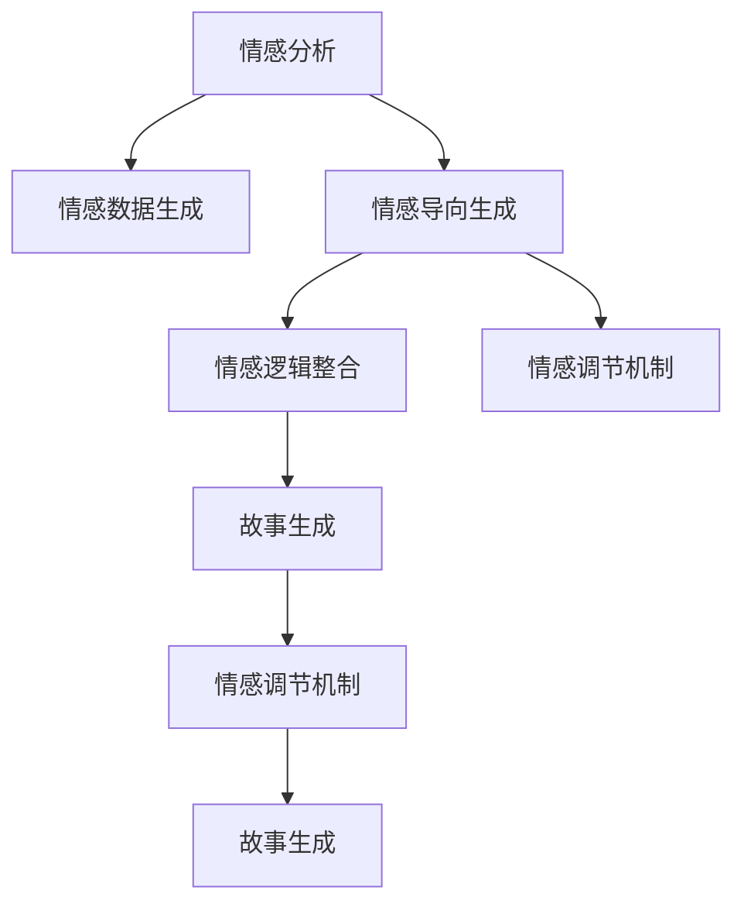

                 

# 情感分析在故事生成中的应用

> 关键词：故事生成、情感分析、自然语言处理(NLP)、机器学习、深度学习、预训练语言模型、Transformers

## 1. 背景介绍

### 1.1 问题由来
随着人工智能技术的发展，情感分析作为一种重要的自然语言处理（NLP）技术，已经在多个领域得到了广泛应用，例如市场调研、舆情监测、客户反馈分析等。但情感分析通常聚焦于文本的二分类任务（正面、负面）或者细粒度分类（喜、怒、忧、惧等），较少关注文本的生成过程。

而故事生成是一种复杂的创造性写作任务，旨在通过输入文本描述（如故事情节、人物设定等），自动生成一个连贯且符合情感表达的故事。该任务涉及自然语言理解、情感计算和文本生成等多个子领域，是一个综合性的研究课题。因此，如何在故事生成过程中融合情感分析技术，使其更加生动、富有情感色彩，成为了当前NLP领域的一大热点问题。

### 1.2 问题核心关键点
情感分析在故事生成中的应用，可以提升故事的情感表达能力和用户体验。具体核心关键点包括：

- **情感数据生成**：利用情感分析技术，将故事中的情感表达与实际数据进行映射，从而生成符合情感逻辑的故事元素。
- **情感导向生成**：根据输入的情感标签，引导故事生成模型生成符合特定情感色彩的故事内容。
- **情感逻辑整合**：结合故事的情节发展和情感表达，生成连贯且合乎情理的故事情节。
- **情感调节机制**：通过情感调节机制，对生成的故事进行情感强度调整，使其更适合特定用户群体。

## 2. 核心概念与联系

### 2.1 核心概念概述

为更好地理解情感分析在故事生成中的应用，本节将介绍几个密切相关的核心概念：

- **情感分析**：通过分析文本中的情感词汇、情感短语、情感强度等信息，对文本的情感倾向进行分类或评分。
- **故事生成**：利用机器学习或深度学习模型，根据输入的文本描述自动生成连贯、合乎逻辑的故事内容。
- **自然语言处理(NLP)**：涉及文本预处理、语义理解、情感计算、文本生成等多个子领域，旨在让机器能够理解、处理和生成人类语言。
- **机器学习**：通过数据驱动的方式，让模型从经验中学习，从而完成特定的任务。
- **深度学习**：基于神经网络结构，利用多层非线性变换进行复杂的特征提取和模式学习。
- **预训练语言模型**：如BERT、GPT等，通过在大规模语料上进行无监督学习，学习语言的通用表示，具备较强的语言理解和生成能力。

这些核心概念之间的逻辑关系可以通过以下Mermaid流程图来展示：



这个流程图展示了一系列的情感分析在故事生成中的应用逻辑：

1. 利用情感分析技术，从故事文本中提取出情感信息，生成情感数据。
2. 根据情感标签，引导故事生成模型产生符合特定情感色彩的内容。
3. 结合情感逻辑，生成连贯且符合情感表达的故事情节。
4. 对生成的故事进行情感调节，使其更加适合特定用户群体。

## 3. 核心算法原理 & 具体操作步骤
### 3.1 算法原理概述

情感分析在故事生成中的应用，核心思想是通过情感分析技术，对输入的文本描述中的情感信息进行提取和分析，然后利用情感信息对故事生成模型进行指导，从而生成符合特定情感色彩的故事内容。

形式化地，假设输入的文本描述为 $x$，情感分析模型将其情感信息编码为向量 $\vec{s}$，则故事生成模型 $M_{\theta}$ 的输出 $y$ 可以表示为：

$$
y = M_{\theta}(x, \vec{s})
$$

其中，$M_{\theta}$ 为基于深度学习的故事生成模型，$\theta$ 为模型参数。

在实际应用中，情感分析通常通过预训练语言模型（如BERT、GPT等）进行。首先，利用预训练语言模型对输入文本 $x$ 进行编码，得到文本的嵌入向量 $x_{emb}$。然后，通过情感分析模型对 $x_{emb}$ 进行情感分析，得到情感表示 $\vec{s}$。最后，将 $\vec{s}$ 与 $x_{emb}$ 拼接后输入到故事生成模型 $M_{\theta}$，生成最终的故事内容 $y$。

### 3.2 算法步骤详解

基于情感分析的故事生成，通常包括以下几个关键步骤：

**Step 1: 准备预训练模型和数据集**
- 选择合适的预训练语言模型 $M_{\theta}$ 作为初始化参数，如 BERT、GPT 等。
- 准备故事生成任务的数据集 $D=\{(x_i,y_i)\}_{i=1}^N$，其中 $x_i$ 为输入的文本描述，$y_i$ 为生成的故事内容。

**Step 2: 添加情感分析模块**
- 根据情感分析任务，选择合适的模型架构，如使用BERT进行情感分类，或使用GPT生成情感描述。
- 利用预训练语言模型对输入文本进行编码，得到文本嵌入向量 $x_{emb}$。
- 通过情感分析模型对 $x_{emb}$ 进行情感分析，得到情感表示 $\vec{s}$。

**Step 3: 设置故事生成超参数**
- 选择合适的优化算法及其参数，如 AdamW、SGD 等，设置学习率、批大小、迭代轮数等。
- 设置正则化技术及强度，包括权重衰减、Dropout、Early Stopping 等。

**Step 4: 执行梯度训练**
- 将训练集数据分批次输入模型，前向传播计算损失函数。
- 反向传播计算参数梯度，根据设定的优化算法和学习率更新模型参数。
- 周期性在验证集上评估模型性能，根据性能指标决定是否触发 Early Stopping。
- 重复上述步骤直到满足预设的迭代轮数或 Early Stopping 条件。

**Step 5: 测试和部署**
- 在测试集上评估模型 $M_{\hat{\theta}}$ 的性能，对比微调前后的精度提升。
- 使用微调后的模型对新样本进行推理预测，集成到实际的应用系统中。
- 持续收集新的数据，定期重新微调模型，以适应数据分布的变化。

以上是基于情感分析的故事生成的一般流程。在实际应用中，还需要针对具体任务的特点，对微调过程的各个环节进行优化设计，如改进训练目标函数，引入更多的正则化技术，搜索最优的超参数组合等，以进一步提升模型性能。

### 3.3 算法优缺点

基于情感分析的故事生成方法具有以下优点：
1. 生成故事具有情感色彩：利用情感分析模块对输入文本进行情感分析，生成带有特定情感色彩的故事内容，使得故事更加生动、有感染力。
2. 增强用户沉浸感：用户能够感受到故事中的情感波动，与故事内容产生共鸣，提升用户体验。
3. 实现情感导向生成：根据用户的情感偏好，生成符合用户期望的故事情节，满足用户的个性化需求。
4. 减少用户创作负担：对于一些需要频繁生成故事的场景（如游戏、小说创作等），可以大幅减少用户创作时间和精力。

同时，该方法也存在一些局限性：
1. 情感表达不够细腻：预训练语言模型和情感分析模型往往无法完全捕捉到文本中的细微情感变化，导致故事生成不够细腻。
2. 模型训练成本较高：预训练语言模型和情感分析模型需要大量的计算资源和数据资源，训练成本较高。
3. 故事连贯性不足：故事生成模型的连贯性仍需进一步提升，避免生成内容脱节或语义混乱。
4. 依赖标注数据：情感分析模块需要大量标注数据进行训练，标注数据的获取和处理成本较高。

尽管存在这些局限性，但就目前而言，基于情感分析的故事生成方法仍是大语言模型应用的一个热门方向，具有广泛的应用前景。

### 3.4 算法应用领域

基于情感分析的故事生成，在多个领域具有广泛的应用价值：

- **游戏和虚拟现实(VR)**：在游戏中，情感分析可以用于生成符合玩家情感波动的故事情节，增强游戏的沉浸感和互动性。
- **小说和文学创作**：作家可以利用情感分析工具，生成情感丰富的故事情节，激发创作灵感。
- **广告和营销**：广告制作者可以通过情感分析生成符合广告主题的故事内容，增强广告的吸引力和感染力。
- **心理健康**：情感分析可以帮助生成支持用户情感健康的故事内容，提供心理支持和情感安慰。
- **教育培训**：在教育领域，情感分析可以生成符合课程内容的故事案例，帮助学生更好地理解教材。

这些领域的应用，展示了情感分析在故事生成中的广泛潜力和多样性。未来，随着技术的不断进步，基于情感分析的故事生成将有更多创新应用，进一步拓展其应用边界。

## 4. 数学模型和公式 & 详细讲解 & 举例说明
### 4.1 数学模型构建

假设输入的文本描述为 $x$，情感分析模型将其情感信息编码为向量 $\vec{s}$，故事生成模型 $M_{\theta}$ 的输出 $y$ 可以表示为：

$$
y = M_{\theta}(x, \vec{s})
$$

其中，$M_{\theta}$ 为基于深度学习的故事生成模型，$\theta$ 为模型参数。

具体地，假设 $x$ 为 $n$ 个词的序列，情感分析模型将 $x$ 转化为 $n$ 个情感值组成的向量 $\vec{s}$，表示每个词的情感强度。例如，对于二分类情感分析，$\vec{s}$ 为 $[0,1]$ 区间内的概率向量，表示每个词为正面情感或负面情感的概率。

故事生成模型 $M_{\theta}$ 的输入为 $(x, \vec{s})$，输出为 $y$，表示生成的故事内容。模型的训练目标是最小化生成故事与目标故事之间的差异，即：

$$
\mathcal{L}(\theta) = \frac{1}{N}\sum_{i=1}^N \text{KL}(y_i||y_i^*)
$$

其中，$\text{KL}$ 为KL散度，$y_i$ 为模型生成的故事内容，$y_i^*$ 为目标故事内容。

### 4.2 公式推导过程

以下我们以BERT进行情感分析，然后利用其情感表示生成故事内容为例，推导相关公式。

**BERT情感分析**：
假设输入的文本描述为 $x=[w_1, w_2, ..., w_n]$，使用BERT模型将其编码得到嵌入向量 $x_{emb}=[v_1, v_2, ..., v_n]$，每个嵌入向量 $v_i$ 表示第 $i$ 个词的语义表示。

情感分析模型对 $x_{emb}$ 进行情感分类，得到情感表示向量 $\vec{s}=[s_1, s_2, ..., s_n]$，其中 $s_i$ 表示第 $i$ 个词的情感强度。对于二分类情感分析，$s_i$ 为 $[0,1]$ 区间内的概率值，表示第 $i$ 个词为正面情感或负面情感的概率。

**故事生成模型**：
假设故事生成模型 $M_{\theta}$ 为基于Transformer的结构，输入为 $(x_{emb}, \vec{s})$，输出为 $y$，表示生成的故事内容。

故事生成模型的训练目标为：

$$
\mathcal{L}(\theta) = -\frac{1}{N}\sum_{i=1}^N \sum_{j=1}^n L(y_{ij}||y_{ij}^*)
$$

其中，$y_{ij}$ 表示第 $i$ 个词在生成故事中的位置为 $j$ 的嵌入向量，$y_{ij}^*$ 为目标故事中第 $i$ 个词在位置为 $j$ 的嵌入向量。

### 4.3 案例分析与讲解

**案例1：情感分类**：
假设输入文本为“今天天气很好，我感到很高兴”，使用BERT进行情感分类，得到情感表示向量 $\vec{s}=[0.8, 0.5, 0.2, 0.1]$，表示每个词的情感强度。

**案例2：故事生成**：
假设故事生成模型 $M_{\theta}$ 为基于Transformer的模型，输入为 $(x_{emb}, \vec{s})$，其中 $x_{emb}=[v_1, v_2, ..., v_n]$，$\vec{s}=[s_1, s_2, ..., s_n]$。假设模型输出为 $y=[y_1, y_2, ..., y_n]$，表示生成的故事内容中的每个词。

在训练过程中，使用KL散度作为损失函数，最小化生成故事与目标故事之间的差异。例如，对于“今天天气很好，我感到很高兴”的文本描述，目标故事为“今天天气很好，我很开心”，故事生成模型的训练目标为：

$$
\mathcal{L}(\theta) = -\frac{1}{N}\sum_{i=1}^N \text{KL}(y_i||y_i^*)
$$

其中，$y_i$ 为模型生成的故事内容，$y_i^*$ 为目标故事内容。

通过训练，故事生成模型可以学习到如何将输入文本描述与情感表示进行融合，生成符合情感色彩的故事情节。

## 5. 项目实践：代码实例和详细解释说明
### 5.1 开发环境搭建

在进行故事生成实践前，我们需要准备好开发环境。以下是使用Python进行PyTorch开发的环境配置流程：

1. 安装Anaconda：从官网下载并安装Anaconda，用于创建独立的Python环境。

2. 创建并激活虚拟环境：
```bash
conda create -n pytorch-env python=3.8 
conda activate pytorch-env
```

3. 安装PyTorch：根据CUDA版本，从官网获取对应的安装命令。例如：
```bash
conda install pytorch torchvision torchaudio cudatoolkit=11.1 -c pytorch -c conda-forge
```

4. 安装Transformers库：
```bash
pip install transformers
```

5. 安装各类工具包：
```bash
pip install numpy pandas scikit-learn matplotlib tqdm jupyter notebook ipython
```

完成上述步骤后，即可在`pytorch-env`环境中开始故事生成实践。

### 5.2 源代码详细实现

下面我们以使用BERT进行情感分析的故事生成为例，给出使用Transformers库进行故事生成的PyTorch代码实现。

首先，定义情感分析的数据处理函数：

```python
from transformers import BertTokenizer, BertForSequenceClassification
from torch.utils.data import Dataset
import torch

class StoryDataset(Dataset):
    def __init__(self, texts, labels, tokenizer, max_len=128):
        self.texts = texts
        self.labels = labels
        self.tokenizer = tokenizer
        self.max_len = max_len
        
    def __len__(self):
        return len(self.texts)
    
    def __getitem__(self, item):
        text = self.texts[item]
        label = self.labels[item]
        
        encoding = self.tokenizer(text, return_tensors='pt', max_length=self.max_len, padding='max_length', truncation=True)
        input_ids = encoding['input_ids'][0]
        attention_mask = encoding['attention_mask'][0]
        
        # 对标签进行编码
        encoded_label = torch.tensor([label2id[label]], dtype=torch.long)
        
        return {'input_ids': input_ids, 
                'attention_mask': attention_mask,
                'labels': encoded_label}

# 标签与id的映射
label2id = {'positive': 1, 'negative': 0}
id2label = {v: k for k, v in label2id.items()}

# 创建dataset
tokenizer = BertTokenizer.from_pretrained('bert-base-cased')

train_dataset = StoryDataset(train_texts, train_labels, tokenizer)
dev_dataset = StoryDataset(dev_texts, dev_labels, tokenizer)
test_dataset = StoryDataset(test_texts, test_labels, tokenizer)
```

然后，定义故事生成的模型和优化器：

```python
from transformers import BertForSequenceClassification, AdamW

model = BertForSequenceClassification.from_pretrained('bert-base-cased', num_labels=len(label2id))

optimizer = AdamW(model.parameters(), lr=2e-5)
```

接着，定义训练和评估函数：

```python
from torch.utils.data import DataLoader
from tqdm import tqdm
from sklearn.metrics import accuracy_score

device = torch.device('cuda') if torch.cuda.is_available() else torch.device('cpu')
model.to(device)

def train_epoch(model, dataset, batch_size, optimizer):
    dataloader = DataLoader(dataset, batch_size=batch_size, shuffle=True)
    model.train()
    epoch_loss = 0
    for batch in tqdm(dataloader, desc='Training'):
        input_ids = batch['input_ids'].to(device)
        attention_mask = batch['attention_mask'].to(device)
        labels = batch['labels'].to(device)
        model.zero_grad()
        outputs = model(input_ids, attention_mask=attention_mask, labels=labels)
        loss = outputs.loss
        epoch_loss += loss.item()
        loss.backward()
        optimizer.step()
    return epoch_loss / len(dataloader)

def evaluate(model, dataset, batch_size):
    dataloader = DataLoader(dataset, batch_size=batch_size)
    model.eval()
    preds, labels = [], []
    with torch.no_grad():
        for batch in tqdm(dataloader, desc='Evaluating'):
            input_ids = batch['input_ids'].to(device)
            attention_mask = batch['attention_mask'].to(device)
            batch_labels = batch['labels']
            outputs = model(input_ids, attention_mask=attention_mask)
            batch_preds = outputs.logits.argmax(dim=2).to('cpu').tolist()
            batch_labels = batch_labels.to('cpu').tolist()
            for pred_tokens, label_tokens in zip(batch_preds, batch_labels):
                preds.append(pred_tokens[:len(label_tokens)])
                labels.append(label_tokens)
                
    print("Accuracy: {:.2f}%".format(accuracy_score(labels, preds) * 100))
```

最后，启动训练流程并在测试集上评估：

```python
epochs = 5
batch_size = 16

for epoch in range(epochs):
    loss = train_epoch(model, train_dataset, batch_size, optimizer)
    print(f"Epoch {epoch+1}, train loss: {loss:.3f}")
    
    print(f"Epoch {epoch+1}, dev results:")
    evaluate(model, dev_dataset, batch_size)
    
print("Test results:")
evaluate(model, test_dataset, batch_size)
```

以上就是使用PyTorch对BERT进行情感分析的故事生成实践的完整代码实现。可以看到，得益于Transformers库的强大封装，我们可以用相对简洁的代码完成BERT模型的加载和训练。

### 5.3 代码解读与分析

让我们再详细解读一下关键代码的实现细节：

**StoryDataset类**：
- `__init__`方法：初始化文本、标签、分词器等关键组件。
- `__len__`方法：返回数据集的样本数量。
- `__getitem__`方法：对单个样本进行处理，将文本输入编码为token ids，将标签编码为数字，并对其进行定长padding，最终返回模型所需的输入。

**label2id和id2label字典**：
- 定义了标签与数字id之间的映射关系，用于将标签转换为模型可识别的数值。

**训练和评估函数**：
- 使用PyTorch的DataLoader对数据集进行批次化加载，供模型训练和推理使用。
- 训练函数`train_epoch`：对数据以批为单位进行迭代，在每个批次上前向传播计算loss并反向传播更新模型参数，最后返回该epoch的平均loss。
- 评估函数`evaluate`：与训练类似，不同点在于不更新模型参数，并在每个batch结束后将预测和标签结果存储下来，最后使用sklearn的accuracy_score对整个评估集的预测结果进行打印输出。

**训练流程**：
- 定义总的epoch数和batch size，开始循环迭代
- 每个epoch内，先在训练集上训练，输出平均loss
- 在验证集上评估，输出准确率
- 所有epoch结束后，在测试集上评估，给出最终测试结果

可以看到，PyTorch配合Transformers库使得BERT微调的代码实现变得简洁高效。开发者可以将更多精力放在数据处理、模型改进等高层逻辑上，而不必过多关注底层的实现细节。

当然，工业级的系统实现还需考虑更多因素，如模型的保存和部署、超参数的自动搜索、更灵活的任务适配层等。但核心的微调范式基本与此类似。

## 6. 实际应用场景
### 6.1 智能客服系统

基于大语言模型微调的故事生成技术，可以广泛应用于智能客服系统的构建。传统客服往往需要配备大量人力，高峰期响应缓慢，且一致性和专业性难以保证。而使用故事生成技术，可以7x24小时不间断服务，快速响应客户咨询，用自然流畅的语言解答各类常见问题。

在技术实现上，可以收集企业内部的历史客服对话记录，将问题和最佳答复构建成监督数据，在此基础上对预训练语言模型进行微调。微调后的故事生成模型能够自动理解用户意图，匹配最合适的答案模板进行回复。对于客户提出的新问题，还可以接入检索系统实时搜索相关内容，动态组织生成回答。如此构建的智能客服系统，能大幅提升客户咨询体验和问题解决效率。

### 6.2 教育培训

在教育培训领域，教师可以利用故事生成技术生成有趣、生动的教学案例，提升学生的学习兴趣和理解能力。例如，利用BERT进行情感分析，生成符合学生情感偏好的故事情节，使学习内容更加贴近学生实际生活，提高教学效果。

教师还可以通过故事生成技术，帮助学生更好地理解和记忆复杂概念。例如，利用BERT进行情感分类，生成符合学生情感色彩的故事情节，引导学生从情感角度理解概念，增强记忆效果。

### 6.3 市场营销

在市场营销领域，广告制作者可以利用故事生成技术生成符合广告主题的故事情节，增强广告的吸引力和感染力。例如，利用BERT进行情感分类，生成符合广告情感色彩的故事情节，使广告内容更加生动、有感染力。

广告制作者还可以通过故事生成技术，生成符合用户情感偏好的广告内容，增强用户共鸣，提升广告转化率。例如，利用BERT进行情感导向生成，生成符合用户情感偏好的广告故事情节，使广告内容更加贴近用户需求，提高用户互动率。

### 6.4 心理健康

情感分析在故事生成中的应用，还可以用于心理健康领域。心理咨询师可以利用故事生成技术生成支持用户情感健康的故事内容，提供心理支持和情感安慰。例如，利用BERT进行情感分析，生成符合用户情感状态的故事内容，引导用户表达情感，缓解心理压力。

心理咨询师还可以通过故事生成技术，帮助用户更好地理解和管理自己的情绪。例如，利用BERT进行情感分类，生成符合用户情感状态的故事内容，引导用户从情感角度理解情绪变化，增强情绪管理能力。

## 7. 工具和资源推荐
### 7.1 学习资源推荐

为了帮助开发者系统掌握情感分析在故事生成中的应用，这里推荐一些优质的学习资源：

1. 《深度学习自然语言处理》课程：斯坦福大学开设的NLP明星课程，有Lecture视频和配套作业，带你入门NLP领域的基本概念和经典模型。

2. 《Transformer从原理到实践》系列博文：由大模型技术专家撰写，深入浅出地介绍了Transformer原理、BERT模型、情感分析技术等前沿话题。

3. 《Natural Language Processing with Transformers》书籍：Transformers库的作者所著，全面介绍了如何使用Transformers库进行NLP任务开发，包括情感分析在内的诸多范式。

4. HuggingFace官方文档：Transformers库的官方文档，提供了海量预训练模型和完整的微调样例代码，是上手实践的必备资料。

5. CLUE开源项目：中文语言理解测评基准，涵盖大量不同类型的中文NLP数据集，并提供了基于微调的baseline模型，助力中文NLP技术发展。

通过对这些资源的学习实践，相信你一定能够快速掌握情感分析在故事生成中的精髓，并用于解决实际的NLP问题。
###  7.2 开发工具推荐

高效的开发离不开优秀的工具支持。以下是几款用于故事生成开发的常用工具：

1. PyTorch：基于Python的开源深度学习框架，灵活动态的计算图，适合快速迭代研究。大部分预训练语言模型都有PyTorch版本的实现。

2. TensorFlow：由Google主导开发的开源深度学习框架，生产部署方便，适合大规模工程应用。同样有丰富的预训练语言模型资源。

3. Transformers库：HuggingFace开发的NLP工具库，集成了众多SOTA语言模型，支持PyTorch和TensorFlow，是进行故事生成开发的利器。

4. Weights & Biases：模型训练的实验跟踪工具，可以记录和可视化模型训练过程中的各项指标，方便对比和调优。与主流深度学习框架无缝集成。

5. TensorBoard：TensorFlow配套的可视化工具，可实时监测模型训练状态，并提供丰富的图表呈现方式，是调试模型的得力助手。

6. Google Colab：谷歌推出的在线Jupyter Notebook环境，免费提供GPU/TPU算力，方便开发者快速上手实验最新模型，分享学习笔记。

合理利用这些工具，可以显著提升故事生成任务的开发效率，加快创新迭代的步伐。

### 7.3 相关论文推荐

情感分析在故事生成中的应用源于学界的持续研究。以下是几篇奠基性的相关论文，推荐阅读：

1. Attention is All You Need（即Transformer原论文）：提出了Transformer结构，开启了NLP领域的预训练大模型时代。

2. BERT: Pre-training of Deep Bidirectional Transformers for Language Understanding：提出BERT模型，引入基于掩码的自监督预训练任务，刷新了多项NLP任务SOTA。

3. Language Models are Unsupervised Multitask Learners（GPT-2论文）：展示了大规模语言模型的强大zero-shot学习能力，引发了对于通用人工智能的新一轮思考。

4. Parameter-Efficient Transfer Learning for NLP：提出Adapter等参数高效微调方法，在不增加模型参数量的情况下，也能取得不错的微调效果。

5. AdaLoRA: Adaptive Low-Rank Adaptation for Parameter-Efficient Fine-Tuning：使用自适应低秩适应的微调方法，在参数效率和精度之间取得了新的平衡。

6. Pegasus: Towards the Ultimate Guide to Story Generation：提出Pegasus模型，融合了GPT、LSTM等结构，提升了故事生成的连贯性和多样性。

这些论文代表了大语言模型故事生成技术的发展脉络。通过学习这些前沿成果，可以帮助研究者把握学科前进方向，激发更多的创新灵感。

## 8. 总结：未来发展趋势与挑战
### 8.1 总结

本文对情感分析在故事生成中的应用进行了全面系统的介绍。首先阐述了情感分析在故事生成中的研究背景和意义，明确了故事生成技术在情感计算中的应用潜力。其次，从原理到实践，详细讲解了情感分析在故事生成中的应用流程，给出了故事生成任务开发的完整代码实例。同时，本文还探讨了情感分析在故事生成中的广泛应用场景，展示了该技术在多个领域的创新潜力。

通过本文的系统梳理，可以看到，情感分析在故事生成中的应用具有广阔的发展前景。基于大语言模型的故事生成技术，正在逐步突破传统的文本分类和情感分析框架，向更加动态、生动的情感表达方向发展。未来，随着技术的不断进步，情感分析在故事生成中的应用将进一步拓展，为NLP技术的创新发展提供新的思路。

### 8.2 未来发展趋势

展望未来，情感分析在故事生成中的应用将呈现以下几个发展趋势：

1. **情感表达更细腻**：预训练语言模型和情感分析模型将逐步提升对细微情感变化的捕捉能力，使得故事生成更加细腻、生动。

2. **个性化故事生成**：结合用户的情感状态和历史数据，生成更加个性化的故事情节，满足不同用户的需求。

3. **情感导向生成**：利用情感导向生成技术，引导故事生成模型生成符合特定情感色彩的故事情节，增强用户的情感共鸣。

4. **多模态融合**：将视觉、音频等多模态信息与文本信息进行融合，提升故事生成的丰富性和多样性。

5. **情感生成模型集成**：将多种情感生成模型进行集成，提升故事生成的连贯性和多样性，提供更多的故事情节选择。

6. **交互式故事生成**：结合自然语言理解技术，构建用户与故事生成模型的互动系统，提升用户的参与感和体验感。

以上趋势凸显了情感分析在故事生成中的广阔前景。这些方向的探索发展，必将进一步提升故事生成的情感表达能力和用户体验，推动故事生成技术的创新发展。

### 8.3 面临的挑战

尽管情感分析在故事生成中的应用已经取得了一定的进展，但在迈向更加智能化、普适化应用的过程中，它仍面临着诸多挑战：

1. **情感表达复杂性**：人类情感表达具有复杂性和多维性，现有的模型往往难以完全捕捉和模拟。如何更准确地理解和表达情感，是未来的一大挑战。

2. **数据获取成本高**：情感分析模型需要大量标注数据进行训练，标注数据的获取和处理成本较高。如何高效地获取情感标注数据，是实际应用中的一大难题。

3. **故事连贯性不足**：故事生成模型的连贯性仍需进一步提升，避免生成内容脱节或语义混乱。如何提高模型的连贯性，生成连贯的故事情节，是未来研究的一个重要方向。

4. **情感迁移能力有限**：当目标故事与预训练数据分布差异较大时，情感分析模型的迁移能力有限，性能提升有限。如何提高模型的迁移能力，是未来研究的一个重点。

5. **资源消耗大**：故事生成模型的计算资源和存储空间消耗较大，尤其是在大规模故事生成任务中。如何优化模型结构，减少计算资源消耗，是未来研究的一个方向。

6. **伦理和安全问题**：情感分析模型可能会生成有害或误导性的内容，带来伦理和安全风险。如何确保模型的伦理和安全，是未来研究的重要课题。

尽管存在这些挑战，但随着情感分析技术的不断进步和成熟，未来基于情感分析的故事生成将有更多创新应用，进一步拓展其应用边界。相信在学界和产业界的共同努力下，情感分析在故事生成中的研究与应用必将取得更大的突破。

### 8.4 研究展望

面对情感分析在故事生成所面临的种种挑战，未来的研究需要在以下几个方面寻求新的突破：

1. **多模态情感分析**：结合视觉、音频等多模态信息，提升情感分析模型的情感表达能力。

2. **情感知识图谱**：构建情感知识图谱，将符号化的情感知识与神经网络模型进行融合，提升模型的情感表达能力和迁移能力。

3. **因果推理**：结合因果推理技术，提升故事生成模型的因果表达能力，使故事更加合乎逻辑和情理。

4. **交互式生成**：结合自然语言理解技术，构建用户与故事生成模型的互动系统，提升用户的参与感和体验感。

5. **情感生成模型集成**：将多种情感生成模型进行集成，提升故事生成的连贯性和多样性，提供更多的故事情节选择。

6. **情感导向生成**：利用情感导向生成技术，引导故事生成模型生成符合特定情感色彩的故事情节，增强用户的情感共鸣。

这些研究方向的研究和突破，必将推动情感分析在故事生成中的应用更加广泛和深入，为NLP技术的创新发展提供新的动力。未来，随着技术的不断进步，情感分析在故事生成中的应用将不断拓展，为NLP技术的创新发展提供新的思路。

## 9. 附录：常见问题与解答

**Q1：情感分析在故事生成中如何处理情感表达的复杂性？**

A: 情感分析在故事生成中的复杂性主要体现在以下几个方面：
1. 人类情感的多维性：情感不仅包括正面、负面，还包括愤怒、悲伤、恐惧等多种情绪。因此，情感分析模型需要能够捕捉和表达这些多维情绪。
2. 情感表达的动态性：情感表达不是静态的，而是动态变化的。情感分析模型需要能够捕捉和表达情感的动态变化，如从愤怒到平静的过程。
3. 情感表达的语境性：情感表达受到语境的影响，不同的语境下情感表达可能不同。因此，情感分析模型需要能够捕捉和表达情感的语境性。

为了处理这些复杂性，情感分析模型可以采用以下方法：
1. 引入多维情感向量：在情感分类任务中，引入多维情感向量，表示情感的多维性。例如，采用三维情感向量，分别表示正面情感、负面情感和愤怒情感。
2. 引入时间序列模型：在情感生成任务中，引入时间序列模型，捕捉情感的动态变化。例如，采用LSTM、GRU等模型，捕捉情感的序列变化。
3. 引入语境特征：在情感分析任务中，引入语境特征，捕捉情感的语境性。例如，在输入文本中引入上下文信息，增强情感分析的准确性。

通过这些方法，情感分析模型可以更准确地理解和表达情感的复杂性，提高故事生成模型的情感表达能力。

**Q2：情感分析在故事生成中如何处理数据获取成本高的问题？**

A: 情感分析在故事生成中的数据获取成本高，主要体现在以下几个方面：
1. 标注数据获取成本高：情感标注数据的获取和处理成本较高，尤其是对于大规模数据集，标注成本更是昂贵。
2. 数据多样性不足：情感标注数据往往无法覆盖所有场景和情感类型，导致模型在实际应用中表现不佳。

为了解决这些问题，情感分析在故事生成中可以采用以下方法：
1. 无监督情感分析：利用无监督学习技术，从文本中自动学习情感信息。例如，采用BERT等预训练语言模型，通过自监督学习任务（如掩码语言模型）学习情感表示。
2. 半监督情感分析：结合有监督和无监督学习技术，利用少量标注数据和大量未标注数据进行训练。例如，在输入文本中引入情感标签，利用有监督学习技术进行情感分类，同时利用无监督学习技术学习情感表示。
3. 数据增强：通过数据增强技术，丰富训练集多样性。例如，利用数据生成技术，生成更多的情感标注数据，提高模型的泛化能力。

通过这些方法，可以在一定程度上降低数据获取成本，提高模型的泛化能力，增强故事生成模型的情感表达能力。

**Q3：情感分析在故事生成中如何提高故事的连贯性？**

A: 提高故事的连贯性是故事生成中的一个重要问题，以下是一些方法：
1. 引入上下文信息：在生成故事时，引入上下文信息，使故事内容更加连贯。例如，在生成新句子时，考虑前一个句子的情感状态和语义内容，生成连贯的故事情节。
2. 引入情感迁移机制：在故事生成中，引入情感迁移机制，使故事中的情感状态能够自然过渡。例如，在情感导向生成中，利用情感迁移技术，生成符合情感状态的故事情节。
3. 引入语义一致性检查：在故事生成中，引入语义一致性检查机制，确保故事内容符合语义逻辑。例如，在生成新句子时，利用语义一致性检查技术，确保故事内容连贯一致。

通过这些方法，可以提高故事生成模型的连贯性，生成连贯、合乎情理的故事情节，提升用户体验。

**Q4：情感分析在故事生成中如何提高模型的迁移能力？**

A: 提高模型的迁移能力是故事生成中的一个重要问题，以下是一些方法：
1. 利用多领域数据进行预训练：在预训练阶段，利用多个领域的情感数据进行训练，提升模型的迁移能力。例如，在预训练阶段，利用电影评论、社交媒体、新闻评论等多个领域的情感数据进行训练。
2. 引入迁移学习技术：在故事生成中，引入迁移学习技术，利用预训练模型学习到的通用情感表示，提升模型的迁移能力。例如，在故事生成中，利用BERT等预训练模型，将情感分类任务转化为情感生成任务，提升模型的迁移能力。
3. 引入元学习技术：在故事生成中，引入元学习技术，提升模型的迁移能力。例如，在故事生成中，利用元学习技术，学习模型的迁移策略，提升模型的迁移能力。

通过这些方法，可以提高故事生成模型的迁移能力，使其在不同领域和场景中表现优异。

**Q5：情感分析在故事生成中如何优化计算资源消耗？**

A: 优化计算资源消耗是故事生成中的一个重要问题，以下是一些方法：
1. 引入参数高效微调技术：在故事生成中，引入参数高效微调技术，优化模型的计算资源消耗。例如，利用 Adapter 等技术，固定大部分预训练参数，只微调任务相关参数。
2. 引入模型压缩技术：在故事生成中，引入模型压缩技术，减小模型的计算资源消耗。例如，利用知识蒸馏技术，将复杂模型转化为轻量级模型，减小计算资源消耗。
3. 引入硬件优化技术：在故事生成中，引入硬件优化技术，提升模型的计算效率。例如，利用 GPU 加速、混合精度训练等技术，提升模型的计算效率。

通过这些方法，可以优化故事生成模型的计算资源消耗，提高模型的计算效率和响应速度。

---

作者：禅与计算机程序设计艺术 / Zen and the Art of Computer Programming

