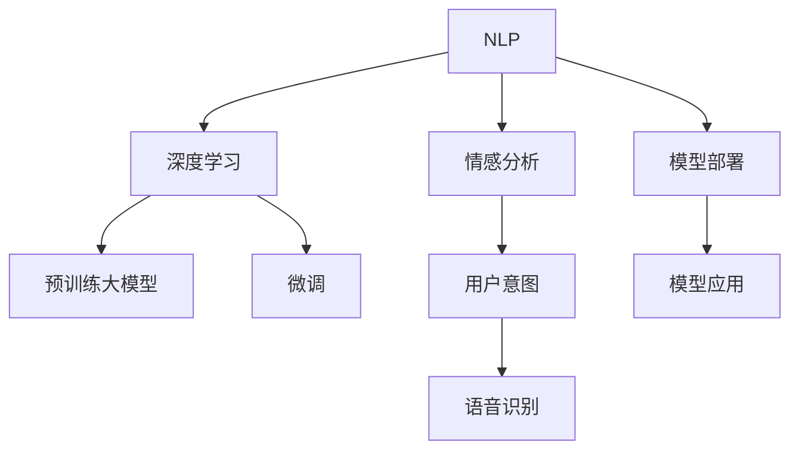

                 

# 情感分析：AI理解用户意图的新维度

> 关键词：情感分析, 自然语言处理(NLP), 深度学习, 机器学习, 情感分类, 用户意图, 语音识别

## 1. 背景介绍

### 1.1 问题由来
情感分析是自然语言处理(NLP)领域的一个关键任务，旨在自动理解文本中的情感倾向，如正面、负面、中性等。近年来，随着深度学习和大数据技术的飞速发展，情感分析技术在电商评论、社交媒体、客户服务等领域得到了广泛应用。情感分析不仅能提高用户体验，还能帮助企业及时响应客户反馈，优化产品和服务，提升品牌形象。

然而，传统的情感分析方法往往依赖于人工标注的情感词典和规则，难以处理复杂的情感表达和语义变化。此外，基于规则的情感分析系统缺乏灵活性和可扩展性，无法适应新兴语言和不断变化的用户需求。因此，基于深度学习的情感分析方法逐渐成为主流，通过预训练大模型进行情感分类，可以显著提升模型的精度和泛化能力。

### 1.2 问题核心关键点
基于深度学习的情感分析方法主要基于两大核心技术：预训练大模型和微调技术。预训练大模型通过大规模无标签数据进行自监督学习，学习通用的语言表示，具备强大的语言理解和生成能力。微调技术则将预训练模型视作初始化参数，通过有标签数据进行进一步优化，使其适应特定任务的需求。

预训练大模型和微调技术相互依存，共同构成了深度学习情感分析的主要技术框架。预训练模型提供了丰富的语言背景知识，而微调技术则根据具体任务进一步细化模型，提升模型性能。预训练模型的选择和微调策略的设计，直接影响到情感分析的效果和应用范围。

### 1.3 问题研究意义
研究情感分析技术，对于提升用户体验、优化企业运营、推动人工智能技术在更多行业的应用具有重要意义：

1. **提升用户体验**：自动化的情感分析可以实时监测用户的情感反馈，快速响应负面情感，提供更好的服务体验。
2. **优化企业运营**：情感分析能够帮助企业了解市场和客户需求，及时调整产品策略，提升竞争力。
3. **推动AI应用**：情感分析作为NLP领域的重要技术，能够为更多AI应用场景提供支持，如智能客服、广告推荐等。
4. **促进技术创新**：情感分析的研究有助于推动深度学习、自然语言处理等前沿技术的发展，加速AI技术的落地应用。

## 2. 核心概念与联系

### 2.1 核心概念概述

为更好地理解基于深度学习的情感分析方法，本节将介绍几个密切相关的核心概念：

- **自然语言处理(NLP)**：研究如何使计算机理解和生成人类语言的学科，情感分析是其中的重要任务。
- **深度学习**：基于多层神经网络的机器学习方法，能够处理复杂的非线性关系，广泛应用于图像、语音、文本等领域。
- **预训练大模型**：通过大规模无标签数据进行自监督学习，学习通用的语言表示，如BERT、GPT等。
- **微调(Fine-tuning)**：在预训练模型的基础上，通过有标签数据进一步优化模型，使其适应特定任务的需求。
- **情感分类**：将文本中的情感分类为正面、负面、中性等类别，是情感分析的主要目标。
- **用户意图**：指用户通过文本表达的意图和需求，情感分析能够帮助系统理解用户的情感倾向，从而提供更个性化的服务。
- **语音识别**：将语音信号转化为文本，再通过情感分析系统进行情感分类，实现语音情感分析。

这些核心概念之间的逻辑关系可以通过以下Mermaid流程图来展示：



这个流程图展示了大语言模型的核心概念及其之间的关系：

1. NLP通过自然语言处理技术，研究如何使计算机理解和生成语言。
2. 深度学习为NLP提供了强大的计算工具，能够处理复杂的非线性关系。
3. 预训练大模型通过自监督学习，学习通用的语言表示，为情感分析提供初始化的参数。
4. 微调技术在预训练模型的基础上，进一步优化模型，适应特定任务的需求。
5. 情感分析系统能够理解文本中的情感倾向，进行情感分类。
6. 用户意图指用户通过文本表达的意图和需求，情感分析能够帮助系统理解用户的情感倾向，从而提供更个性化的服务。
7. 语音识别将语音信号转化为文本，再通过情感分析系统进行情感分类。
8. 模型部署和应用将情感分析模型集成到实际的应用系统中，为用户提供服务。

这些概念共同构成了情感分析的技术框架，使得情感分析能够广泛应用于各种NLP任务中。

## 3. 核心算法原理 & 具体操作步骤

### 3.1 算法原理概述

基于深度学习的情感分析，其核心思想是通过预训练大模型和微调技术，将文本中的情感分类为正面、负面、中性等类别。具体步骤如下：

1. **数据准备**：收集情感标注数据集，通常包括文本和相应的情感标签。
2. **预训练模型选择**：选择预训练大模型作为初始化参数，如BERT、GPT等。
3. **任务适配**：在预训练模型的基础上，添加任务适配层，如线性分类器、Attention机制等。
4. **微调优化**：使用标注数据对模型进行微调，最小化损失函数，提升模型性能。
5. **模型评估**：在测试集上评估微调后的模型性能，比较微调前后效果。

### 3.2 算法步骤详解

#### 3.2.1 数据准备
情感分析的数据准备通常包括文本数据和情感标签。文本数据可以是社交媒体评论、电商产品评论、用户反馈等，情感标签通常为正面、负面、中性等。

以下是一个简单的情感数据集：

| 文本数据 | 情感标签 |
| -------- | -------- |
| 产品非常好，服务也很到位 | 正面 |
| 服务态度很差，产品也不行 | 负面 |
| 还可以，没有特别突出的地方 | 中性 |

#### 3.2.2 预训练模型选择
选择适合的预训练大模型是情感分析成功的关键。目前主流的预训练模型包括BERT、GPT、XLNet等。这里以BERT为例，介绍预训练模型的选择和微调过程。

BERT是一种基于Transformer结构的预训练模型，通过大规模无标签文本数据进行预训练，学习到丰富的语言表示。在微调前，我们通常使用BERT-base模型，其包含12个隐层和768个隐单元，适合进行大规模的情感分析任务。

#### 3.2.3 任务适配
在预训练模型的基础上，添加任务适配层，如线性分类器、Attention机制等，以适应情感分类任务。以下是一个简单的例子：

```python
from transformers import BertForSequenceClassification

model = BertForSequenceClassification.from_pretrained('bert-base-cased', num_labels=3)
```

这里的`num_labels=3`表示情感分类有3个类别（正面、负面、中性）。

#### 3.2.4 微调优化
在预训练模型的基础上，使用标注数据进行微调。微调过程中，通常采用AdamW优化器，设定合适的学习率，如2e-5。以下是一个简单的微调过程：

```python
from transformers import AdamW

optimizer = AdamW(model.parameters(), lr=2e-5)
```

#### 3.2.5 模型评估
在微调后，使用测试集评估模型性能。通常使用准确率、F1-score、ROC曲线等指标评估模型效果。以下是一个简单的评估过程：

```python
from sklearn.metrics import classification_report

eval_results = model.evaluate(dev_dataset)
print(classification_report(eval_results))
```

### 3.3 算法优缺点

基于深度学习的情感分析方法具有以下优点：

1. **高效准确**：通过预训练大模型和微调技术，情感分析能够高效、准确地进行情感分类。
2. **适应性强**：能够处理复杂的情感表达和语义变化，适应不同领域的情感分析需求。
3. **可扩展性高**：适用于多种数据来源和应用场景，如电商评论、社交媒体、客户服务等。

同时，该方法也存在一些局限性：

1. **数据依赖性高**：情感分析的效果很大程度上依赖于标注数据的质量和数量，标注数据的获取成本较高。
2. **模型复杂度高**：预训练大模型和微调过程涉及复杂的计算和参数更新，需要高性能的计算资源。
3. **对抗攻击脆弱**：情感分析模型容易受到对抗样本攻击，导致模型输出不稳定。
4. **缺乏可解释性**：深度学习模型的决策过程难以解释，缺乏透明性和可信度。

尽管存在这些局限性，但就目前而言，基于深度学习的情感分析方法仍是最主流范式。未来相关研究的重点在于如何进一步降低对标注数据的依赖，提高模型的鲁棒性和可解释性，同时兼顾高性能和高效性。

### 3.4 算法应用领域

基于深度学习的情感分析方法，在电商评论、社交媒体、客户服务等领域得到了广泛应用，具体如下：

#### 3.4.1 电商评论情感分析
电商评论情感分析旨在分析用户对产品或服务的情感倾向，帮助电商平台优化产品推荐、价格调整等策略。通过情感分析，电商平台能够了解用户的满意度和需求，从而提供更好的用户体验。

#### 3.4.2 社交媒体情感分析
社交媒体情感分析能够监测用户在社交平台上的情感表达，及时发现负面情感，采取应对措施。例如，品牌可以通过情感分析监测用户的反馈，及时调整营销策略，提升品牌形象。

#### 3.4.3 客户服务情感分析
客户服务情感分析能够实时监测客户的情感反馈，快速响应负面情感，提升客户满意度。例如，客服系统可以自动分析客户的投诉和建议，提供更个性化的服务。

#### 3.4.4 金融舆情监测
金融舆情监测能够实时监测金融市场的情感变化，及时发现潜在的风险。例如，金融机构可以通过情感分析监测市场的情绪变化，调整投资策略，规避风险。

#### 3.4.5 健康医疗情感分析
健康医疗情感分析能够监测患者的情感状态，及时发现负面情绪，提供心理支持和医疗建议。例如，心理健康平台可以通过情感分析监测用户的情感变化，提供针对性的心理干预。

## 4. 数学模型和公式 & 详细讲解  
### 4.1 数学模型构建

情感分析的数学模型主要包括以下几个部分：

1. **输入表示**：将输入文本表示为向量形式，通常使用BERT或GPT等预训练模型。
2. **任务适配层**：在预训练模型的基础上，添加任务适配层，如线性分类器、Attention机制等。
3. **损失函数**：定义损失函数，衡量模型预测输出与真实标签之间的差异。
4. **优化目标**：最小化损失函数，更新模型参数，提升模型性能。

以BERT为例，其情感分析模型可以表示为：

$$
\mathcal{L}(\theta) = \frac{1}{N} \sum_{i=1}^N -y_i \log Sigmoid(h(x_i;\theta)) - (1-y_i) \log (1-Sigmoid(h(x_i;\theta)))
$$

其中，$h(x_i;\theta)$表示模型对输入文本$x_i$的预测输出，$y_i$表示真实标签。$Sigmoid$函数将输出映射到0和1之间，表示情感为正面或负面。

### 4.2 公式推导过程

情感分析的公式推导过程主要涉及以下几个步骤：

1. **文本表示**：将输入文本转化为BERT或GPT等预训练模型的表示向量。
2. **任务适配层**：在预训练模型的基础上，添加线性分类器或Attention机制，输出情感概率。
3. **损失函数**：定义交叉熵损失函数，衡量模型预测输出与真实标签之间的差异。
4. **优化目标**：最小化损失函数，更新模型参数，提升模型性能。

以下是一个简单的例子：

1. 文本表示：使用BERT模型将输入文本转化为768维的向量表示。
2. 任务适配层：在BERT模型的基础上，添加线性分类器，输出情感概率。
3. 损失函数：定义交叉熵损失函数，衡量模型预测输出与真实标签之间的差异。
4. 优化目标：最小化损失函数，更新模型参数，提升模型性能。

### 4.3 案例分析与讲解

以电商评论情感分析为例，分析模型训练和评估过程。假设我们有一个包含1000条评论的数据集，其中有600条是正面评价，400条是负面评价。我们可以将每条评论转化为BERT模型的表示向量，通过线性分类器输出情感概率。使用交叉熵损失函数，最小化损失函数，更新模型参数，提升模型性能。以下是一个简单的实现：

```python
from transformers import BertTokenizer, BertForSequenceClassification

tokenizer = BertTokenizer.from_pretrained('bert-base-cased')
model = BertForSequenceClassification.from_pretrained('bert-base-cased', num_labels=2)

input_ids = tokenizer.encode(train_texts, add_special_tokens=True)
attention_masks = [[1] * len(seq) for seq in input_ids]

labels = torch.tensor([1 if label == 'positive' else 0 for label in train_labels])
outputs = model(input_ids, attention_masks=attention_masks, labels=labels)
loss = outputs.loss

optimizer = AdamW(model.parameters(), lr=2e-5)
optimizer.zero_grad()
loss.backward()
optimizer.step()

eval_results = model.evaluate(dev_dataset)
print(classification_report(eval_results))
```

## 5. 项目实践：代码实例和详细解释说明

### 5.1 开发环境搭建

在进行情感分析实践前，我们需要准备好开发环境。以下是使用Python进行PyTorch开发的环境配置流程：

1. 安装Anaconda：从官网下载并安装Anaconda，用于创建独立的Python环境。

2. 创建并激活虚拟环境：
```bash
conda create -n pytorch-env python=3.8 
conda activate pytorch-env
```

3. 安装PyTorch：根据CUDA版本，从官网获取对应的安装命令。例如：
```bash
conda install pytorch torchvision torchaudio cudatoolkit=11.1 -c pytorch -c conda-forge
```

4. 安装相关库：
```bash
pip install transformers sklearn pandas numpy jupyter notebook ipython
```

完成上述步骤后，即可在`pytorch-env`环境中开始情感分析实践。

### 5.2 源代码详细实现

下面以电商评论情感分析为例，给出使用Transformers库对BERT模型进行情感分析的PyTorch代码实现。

首先，定义情感分类数据集：

```python
from transformers import BertTokenizer
from torch.utils.data import Dataset
import torch

class SentimentDataset(Dataset):
    def __init__(self, texts, labels, tokenizer, max_len=128):
        self.texts = texts
        self.labels = labels
        self.tokenizer = tokenizer
        self.max_len = max_len
        
    def __len__(self):
        return len(self.texts)
    
    def __getitem__(self, item):
        text = self.texts[item]
        label = self.labels[item]
        
        encoding = self.tokenizer(text, return_tensors='pt', max_length=self.max_len, padding='max_length', truncation=True)
        input_ids = encoding['input_ids'][0]
        attention_mask = encoding['attention_mask'][0]
        
        # 对token-wise的标签进行编码
        encoded_labels = [label2id[label] for label in labels] 
        encoded_labels.extend([label2id['O']] * (self.max_len - len(encoded_labels)))
        labels = torch.tensor(encoded_labels, dtype=torch.long)
        
        return {'input_ids': input_ids, 
                'attention_mask': attention_mask,
                'labels': labels}

# 标签与id的映射
label2id = {'positive': 1, 'negative': 0, 'O': 2}
id2label = {v: k for k, v in label2id.items()}
```

然后，定义模型和优化器：

```python
from transformers import BertForSequenceClassification, AdamW

model = BertForSequenceClassification.from_pretrained('bert-base-cased', num_labels=len(label2id))

optimizer = AdamW(model.parameters(), lr=2e-5)
```

接着，定义训练和评估函数：

```python
from torch.utils.data import DataLoader
from tqdm import tqdm
from sklearn.metrics import classification_report

device = torch.device('cuda') if torch.cuda.is_available() else torch.device('cpu')
model.to(device)

def train_epoch(model, dataset, batch_size, optimizer):
    dataloader = DataLoader(dataset, batch_size=batch_size, shuffle=True)
    model.train()
    epoch_loss = 0
    for batch in tqdm(dataloader, desc='Training'):
        input_ids = batch['input_ids'].to(device)
        attention_mask = batch['attention_mask'].to(device)
        labels = batch['labels'].to(device)
        model.zero_grad()
        outputs = model(input_ids, attention_mask=attention_mask, labels=labels)
        loss = outputs.loss
        epoch_loss += loss.item()
        loss.backward()
        optimizer.step()
    return epoch_loss / len(dataloader)

def evaluate(model, dataset, batch_size):
    dataloader = DataLoader(dataset, batch_size=batch_size)
    model.eval()
    preds, labels = [], []
    with torch.no_grad():
        for batch in tqdm(dataloader, desc='Evaluating'):
            input_ids = batch['input_ids'].to(device)
            attention_mask = batch['attention_mask'].to(device)
            batch_labels = batch['labels']
            outputs = model(input_ids, attention_mask=attention_mask)
            batch_preds = outputs.logits.argmax(dim=2).to('cpu').tolist()
            batch_labels = batch_labels.to('cpu').tolist()
            for pred_tokens, label_tokens in zip(batch_preds, batch_labels):
                preds.append(pred_tokens[:len(label_tokens)])
                labels.append(label_tokens)
                
    print(classification_report(labels, preds))
```

最后，启动训练流程并在测试集上评估：

```python
epochs = 5
batch_size = 16

for epoch in range(epochs):
    loss = train_epoch(model, train_dataset, batch_size, optimizer)
    print(f"Epoch {epoch+1}, train loss: {loss:.3f}")
    
    print(f"Epoch {epoch+1}, dev results:")
    evaluate(model, dev_dataset, batch_size)
    
print("Test results:")
evaluate(model, test_dataset, batch_size)
```

以上就是使用PyTorch对BERT进行电商评论情感分析的完整代码实现。可以看到，得益于Transformers库的强大封装，我们可以用相对简洁的代码完成BERT模型的加载和情感分析。

### 5.3 代码解读与分析

让我们再详细解读一下关键代码的实现细节：

**SentimentDataset类**：
- `__init__`方法：初始化文本、标签、分词器等关键组件。
- `__len__`方法：返回数据集的样本数量。
- `__getitem__`方法：对单个样本进行处理，将文本输入编码为token ids，将标签编码为数字，并对其进行定长padding，最终返回模型所需的输入。

**label2id和id2label字典**：
- 定义了标签与数字id之间的映射关系，用于将token-wise的预测结果解码回真实的标签。

**训练和评估函数**：
- 使用PyTorch的DataLoader对数据集进行批次化加载，供模型训练和推理使用。
- 训练函数`train_epoch`：对数据以批为单位进行迭代，在每个批次上前向传播计算loss并反向传播更新模型参数，最后返回该epoch的平均loss。
- 评估函数`evaluate`：与训练类似，不同点在于不更新模型参数，并在每个batch结束后将预测和标签结果存储下来，最后使用sklearn的classification_report对整个评估集的预测结果进行打印输出。

**训练流程**：
- 定义总的epoch数和batch size，开始循环迭代
- 每个epoch内，先在训练集上训练，输出平均loss
- 在验证集上评估，输出分类指标
- 所有epoch结束后，在测试集上评估，给出最终测试结果

可以看到，PyTorch配合Transformers库使得BERT情感分析的代码实现变得简洁高效。开发者可以将更多精力放在数据处理、模型改进等高层逻辑上，而不必过多关注底层的实现细节。

当然，工业级的系统实现还需考虑更多因素，如模型的保存和部署、超参数的自动搜索、更灵活的任务适配层等。但核心的情感分析范式基本与此类似。

## 6. 实际应用场景
### 6.1 智能客服系统

基于情感分析技术的智能客服系统，可以实时监测客户情感，自动生成回复，提升客户满意度。传统客服往往需要配备大量人力，高峰期响应缓慢，且一致性和专业性难以保证。使用情感分析技术，可以7x24小时不间断服务，快速响应客户咨询，用自然流畅的语言解答各类常见问题。

在技术实现上，可以收集企业内部的历史客服对话记录，将问题和最佳答复构建成监督数据，在此基础上对预训练情感分析模型进行微调。微调后的情感分析模型能够自动理解用户情感，匹配最合适的答复模板进行回复。对于客户提出的新问题，还可以接入检索系统实时搜索相关内容，动态组织生成回答。如此构建的智能客服系统，能大幅提升客户咨询体验和问题解决效率。

### 6.2 金融舆情监测

金融机构需要实时监测市场舆论动向，以便及时应对负面信息传播，规避金融风险。传统的人工监测方式成本高、效率低，难以应对网络时代海量信息爆发的挑战。基于情感分析技术的金融舆情监测，为金融舆情监测提供了新的解决方案。

具体而言，可以收集金融领域相关的新闻、报道、评论等文本数据，并对其进行情感标注。在此基础上对预训练情感分析模型进行微调，使其能够自动判断文本属于何种情感，情感倾向是正面、负面还是中性。将微调后的模型应用到实时抓取的网络文本数据，就能够自动监测不同情感的变化趋势，一旦发现负面情感激增等异常情况，系统便会自动预警，帮助金融机构快速应对潜在风险。

### 6.3 个性化推荐系统

当前的推荐系统往往只依赖用户的历史行为数据进行物品推荐，无法深入理解用户的真实兴趣偏好。基于情感分析技术的个性化推荐系统，能够更好地挖掘用户情感背后的兴趣点。

在实践中，可以收集用户浏览、点击、评论、分享等行为数据，提取和用户交互的物品标题、描述、标签等文本内容。将文本内容作为模型输入，用户的后续行为（如是否点击、购买等）作为监督信号，在此基础上微调预训练情感分析模型。微调后的模型能够从文本内容中准确把握用户的兴趣点。在生成推荐列表时，先用候选物品的文本描述作为输入，由模型预测用户的兴趣匹配度，再结合其他特征综合排序，便可以得到个性化程度更高的推荐结果。

### 6.4 未来应用展望

随着情感分析技术的不断发展，其在更多领域的应用前景将更加广阔：

1. **智慧医疗**：基于情感分析技术的医疗问答、病历分析、药物研发等应用将提升医疗服务的智能化水平，辅助医生诊疗，加速新药开发进程。
2. **智能教育**：情感分析能够应用于作业批改、学情分析、知识推荐等方面，因材施教，促进教育公平，提高教学质量。
3. **智慧城市治理**：情感分析能够应用于城市事件监测、舆情分析、应急指挥等环节，提高城市管理的自动化和智能化水平，构建更安全、高效的未来城市。
4. **营销广告**：基于情感分析技术的广告推荐系统能够更好地理解用户情感，提升广告效果和用户转化率。
5. **心理健康**：情感分析能够监测用户的情感状态，及时发现负面情绪，提供心理支持和医疗建议。

总之，情感分析技术在未来的应用场景将更加多样，其对人类社会的贡献也将更加深远。

## 7. 工具和资源推荐
### 7.1 学习资源推荐

为了帮助开发者系统掌握情感分析的理论基础和实践技巧，这里推荐一些优质的学习资源：

1. **《自然语言处理综论》**：斯坦福大学提供的免费在线课程，涵盖NLP的基本概念和常用技术。
2. **《深度学习》**：Ian Goodfellow等人所著的经典教材，详细介绍了深度学习的基本原理和实践技巧。
3. **《Transformers从原理到实践》系列博文**：由大模型技术专家撰写，深入浅出地介绍了Transformer原理、BERT模型、情感分析技术等前沿话题。
4. **《自然语言处理与深度学习》**：北京大学出版社出版的经典教材，涵盖NLP的基本概念和深度学习应用。
5. **《Handbook of Computational Linguistics》**：该手册由NLP领域的顶尖学者共同编写，全面介绍了NLP的前沿技术和应用。

通过对这些资源的学习实践，相信你一定能够快速掌握情感分析的精髓，并用于解决实际的NLP问题。

### 7.2 开发工具推荐

高效的开发离不开优秀的工具支持。以下是几款用于情感分析开发的常用工具：

1. **PyTorch**：基于Python的开源深度学习框架，灵活动态的计算图，适合快速迭代研究。
2. **TensorFlow**：由Google主导开发的开源深度学习框架，生产部署方便，适合大规模工程应用。
3. **HuggingFace Transformers**：提供了丰富的预训练模型和微调方法，是进行情感分析任务开发的利器。
4. **Jupyter Notebook**：一个交互式的数据科学工具，支持代码编写、可视化展示，适合进行情感分析模型的实验和研究。
5. **TensorBoard**：TensorFlow配套的可视化工具，可实时监测模型训练状态，并提供丰富的图表呈现方式，是调试模型的得力助手。

合理利用这些工具，可以显著提升情感分析任务的开发效率，加快创新迭代的步伐。

### 7.3 相关论文推荐

情感分析的研究源于学界的持续研究。以下是几篇奠基性的相关论文，推荐阅读：

1. **"Attention is All You Need"**：提出了Transformer结构，开启了NLP领域的预训练大模型时代。
2. **"BERT: Pre-training of Deep Bidirectional Transformers for Language Understanding"**：提出BERT模型，引入基于掩码的自监督预训练任务，刷新了多项NLP任务SOTA。
3. **"Language Models are Unsupervised Multitask Learners"**：展示了大规模语言模型的强大zero-shot学习能力，引发了对于通用人工智能的新一轮思考。
4. **"Prompt-based Learning"**：引入基于连续型Prompt的微调范式，为如何充分利用预训练知识提供了新的思路。
5. **"Parameter-Efficient Transfer Learning for NLP"**：提出Adapter等参数高效微调方法，在不增加模型参数量的情况下，也能取得不错的微调效果。

这些论文代表了大语言模型情感分析的发展脉络。通过学习这些前沿成果，可以帮助研究者把握学科前进方向，激发更多的创新灵感。

## 8. 总结：未来发展趋势与挑战

### 8.1 总结

本文对基于深度学习的情感分析技术进行了全面系统的介绍。首先阐述了情感分析技术的研究背景和意义，明确了情感分析在提升用户体验、优化企业运营、推动人工智能技术在更多行业的应用方面的重要性。其次，从原理到实践，详细讲解了情感分析的数学原理和关键步骤，给出了情感分析任务开发的完整代码实例。同时，本文还广泛探讨了情感分析在智能客服、金融舆情、个性化推荐等多个行业领域的应用前景，展示了情感分析范式的巨大潜力。最后，本文精选了情感分析技术的各类学习资源，力求为读者提供全方位的技术指引。

通过本文的系统梳理，可以看到，基于深度学习的情感分析技术正在成为NLP领域的重要范式，极大地拓展了情感分析的应用边界，催生了更多的落地场景。受益于大规模语料的预训练，情感分析模型以更低的时间和标注成本，在小样本条件下也能取得不俗的效果，有力推动了NLP技术的产业化进程。未来，伴随预训练语言模型和情感分析方法的持续演进，相信NLP技术将在更广阔的应用领域大放异彩，深刻影响人类的生产生活方式。

### 8.2 未来发展趋势

展望未来，情感分析技术将呈现以下几个发展趋势：

1. **模型规模持续增大**：随着算力成本的下降和数据规模的扩张，预训练语言模型的参数量还将持续增长。超大规模语言模型蕴含的丰富语言知识，有望支撑更加复杂多变的情感分析任务。
2. **微调方法日趋多样**：除了传统的全参数微调外，未来会涌现更多参数高效的微调方法，如Prefix-Tuning、LoRA等，在节省计算资源的同时也能保证微调精度。
3. **持续学习成为常态**：随着数据分布的不断变化，情感分析模型也需要持续学习新知识以保持性能。如何在不遗忘原有知识的同时，高效吸收新样本信息，将成为重要的研究课题。
4. **标注样本需求降低**：受启发于提示学习(Prompt-based Learning)的思路，未来的情感分析方法将更好地利用大模型的语言理解能力，通过更加巧妙的任务描述，在更少的标注样本上也能实现理想的情感分析效果。
5. **多模态情感分析崛起**：当前的情感分析主要聚焦于纯文本数据，未来会进一步拓展到图像、视频、语音等多模态数据情感分析。多模态信息的融合，将显著提升情感分析模型对现实世界的理解和建模能力。
6. **模型通用性增强**：经过海量数据的预训练和多领域任务的微调，未来的情感分析模型将具备更强大的常识推理和跨领域迁移能力，逐步迈向通用人工智能(AGI)的目标。

以上趋势凸显了情感分析技术的广阔前景。这些方向的探索发展，必将进一步提升NLP系统的性能和应用范围，为人类认知智能的进化带来深远影响。

### 8.3 面临的挑战

尽管情感分析技术已经取得了瞩目成就，但在迈向更加智能化、普适化应用的过程中，它仍面临着诸多挑战：

1. **标注成本瓶颈**：情感分析的效果很大程度上依赖于标注数据的质量和数量，获取高质量标注数据的成本较高。如何进一步降低情感分析对标注数据的依赖，将是一大难题。
2. **模型鲁棒性不足**：当前情感分析模型面对域外数据时，泛化性能往往大打折扣。对于测试样本的微小扰动，情感分析模型的预测也容易发生波动。如何提高情感分析模型的鲁棒性，避免灾难性遗忘，还需要更多理论和实践的积累。
3. **推理效率有待提高**：大规模情感分析模型虽然精度高，但在实际部署时往往面临推理速度慢、内存占用大等效率问题。如何在保证性能的同时，简化模型结构，提升推理速度，优化资源占用，将是重要的优化方向。
4. **可解释性亟需加强**：当前情感分析模型更像是"黑盒"系统，难以解释其内部工作机制和决策逻辑。对于医疗、金融等高风险应用，算法的可解释性和可审计性尤为重要。如何赋予情感分析模型更强的可解释性，将是亟待攻克的难题。
5. **安全性有待保障**：预训练情感分析模型难免会学习到有偏见、有害的信息，通过情感分析传递到下游任务，产生误导性、歧视性的输出，给实际应用带来安全隐患。如何从数据和算法层面消除模型偏见，避免恶意用途，确保输出的安全性，也将是重要的研究课题。
6. **知识整合能力不足**：现有的情感分析模型往往局限于任务内数据，难以灵活吸收和运用更广泛的先验知识。如何让情感分析过程更好地与外部知识库、规则库等专家知识结合，形成更加全面、准确的信息整合能力，还有很大的想象空间。

正视情感分析面临的这些挑战，积极应对并寻求突破，将是大语言模型情感分析走向成熟的必由之路。相信随着学界和产业界的共同努力，这些挑战终将一一被克服，情感分析技术必将在构建人机协同的智能时代中扮演越来越重要的角色。

### 8.4 研究展望

面对情感分析所面临的种种挑战，未来的研究需要在以下几个方面寻求新的突破：

1. **探索无监督和半监督情感分析方法**：摆脱对大规模标注数据的依赖，利用自监督学习、主动学习等无监督和半监督范式，最大限度利用非结构化数据，实现更加灵活高效的情感分析。
2. **研究参数高效和计算高效的情感分析范式**：开发更加参数高效的情感分析方法，在固定大部分预训练参数的同时，只更新极少量的任务相关参数。同时优化情感分析模型的计算图，减少前向传播和反向传播的资源消耗，实现更加轻量级、实时性的部署。
3. **融合因果和对比学习范式**：通过引入因果推断和对比学习思想，增强情感分析模型建立稳定因果关系的能力，学习更加普适、鲁棒的语言表征，从而提升模型泛化性和抗干扰能力。
4. **引入更多先验知识**：将符号化的先验知识，如知识图谱、逻辑规则等，与神经网络模型进行巧妙融合，引导情感分析过程学习更准确、合理的语言模型。同时加强不同模态数据的整合，实现视觉、语音等多模态信息与文本信息的协同建模。
5. **结合因果分析和博弈论工具**：将因果分析方法引入情感分析模型，识别出模型决策的关键特征，增强输出解释的因果性和逻辑性。借助博弈论工具刻画人机交互过程，主动探索并规避模型的脆弱点，提高系统稳定性。
6. **纳入伦理道德约束**：在模型训练目标中引入伦理导向的评估指标，过滤和惩罚有偏见、有害的输出倾向。同时加强人工干预和审核，建立模型行为的监管机制，确保输出符合人类价值观和伦理道德。

这些研究方向的探索，必将引领情感分析技术迈向更高的台阶，为构建安全、可靠、可解释、可控的智能系统铺平道路。面向未来，情感分析技术还需要与其他人工智能技术进行更深入的融合，如知识表示、因果推理、强化学习等，多路径协同发力，共同推动自然语言理解和智能交互系统的进步。只有勇于创新、敢于突破，才能不断拓展情感分析的边界，让智能技术更好地造福人类社会。

## 9. 附录：常见问题与解答

**Q1：情感分析是否适用于所有NLP任务？**

A: 情感分析在大多数NLP任务上都能取得不错的效果，特别是对于数据量较小的任务。但对于一些特定领域的任务，如医学、法律等，仅仅依靠通用语料预训练的模型可能难以很好地适应。此时需要在特定领域语料上进一步预训练，再进行微调，才能获得理想效果。此外，对于一些需要时效性、个性化很强的任务，如对话、推荐等，情感分析方法也需要针对性的改进优化。

**Q2：如何选择合适的学习率？**

A: 情感分析的学习率一般要比预训练时小1-2个数量级，如果使用过大的学习率，容易破坏预训练权重，导致过拟合。一般建议从1e-5开始调参，逐步减小学习率，直至收敛。也可以使用warmup策略，在开始阶段使用较小的学习率，再逐渐过渡到预设值。需要注意的是，不同的优化器(如AdamW、Adafactor等)以及不同的学习率调度策略，可能需要设置不同的学习率阈值。

**Q3：情感分析在哪些应用场景中表现出色？**

A: 情感分析在电商评论、社交媒体、客户服务等领域表现出色。在这些场景中，情感分析能够实时监测用户的情感反馈，快速响应负面情感，提供更好的服务体验。

**Q4：情感分析对标注数据的质量和数量有哪些要求？**

A: 情感分析的效果很大程度上依赖于标注数据的质量和数量。标注数据需要覆盖不同的情感表达，避免偏向性和歧义性。标注数据量越大，情感分析的泛化能力越强，但标注数据的获取成本也越高。

**Q5：情感分析模型在落地部署时需要注意哪些问题？**

A: 将情感分析模型转化为实际应用，还需要考虑以下因素：
1. 模型裁剪：去除不必要的层和参数，减小模型尺寸，加快推理速度
2. 量化加速：将浮点模型转为定点模型，压缩存储空间，提高计算效率
3. 服务化封装：将模型封装为标准化服务接口，便于集成调用
4. 弹性伸缩：根据请求流量动态调整资源配置，平衡服务质量和成本
5. 监控告警：实时采集系统指标，设置异常告警阈值，确保服务稳定性
6. 安全防护：采用访问鉴权、数据脱敏等措施，保障数据和模型安全

大语言模型情感分析为NLP应用开启了广阔的想象空间，但如何将强大的性能转化为稳定、高效、安全的业务价值，还需要工程实践的不断打磨。唯有从数据、算法、工程、业务等多个维度协同发力，才能真正实现情感分析技术在垂直行业的规模化落地。总之，情感分析需要开发者根据具体任务，不断迭代和优化模型、数据和算法，方能得到理想的效果。

---

作者：禅与计算机程序设计艺术 / Zen and the Art of Computer Programming

