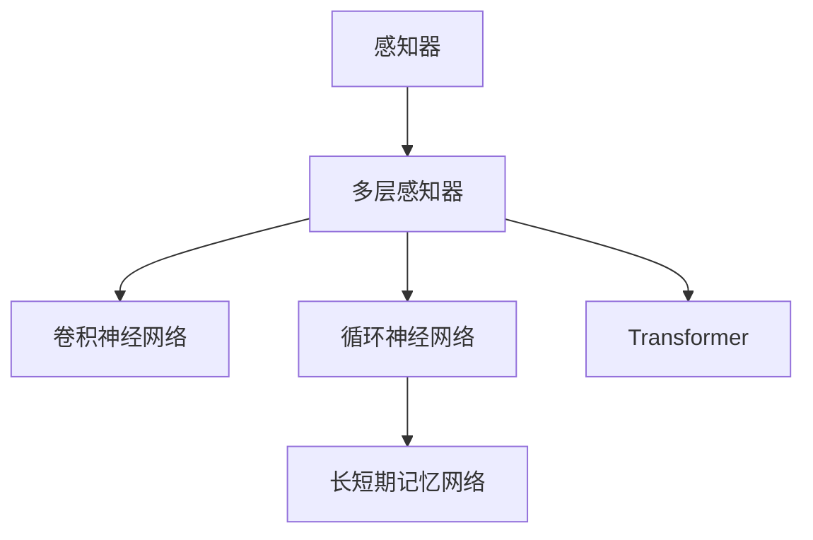
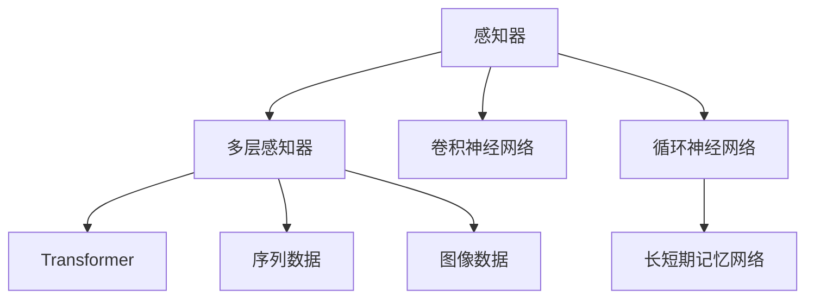

                 

## 1. 背景介绍

### 1.1 问题由来

神经网络作为人工智能领域的重要基础，自1943年由麦卡锡、麦卡锡和皮茨提出的“感知器”开始，至今已有近80年的发展历史。其演进历程中，神经网络经历了从单层感知器、多层感知器、卷积神经网络（CNN）、循环神经网络（RNN）、长短期记忆网络（LSTM）到Transformer的不断革新。每一次演进，都是对原有神经网络结构或训练策略的突破与改进。

神经网络技术的演进，推动了人工智能在图像识别、语音识别、自然语言处理等领域的广泛应用，极大提升了信息处理能力和智能化水平。

### 1.2 问题核心关键点

理解神经网络的演进，需要从基础概念、核心算法、关键结构等方面进行全面掌握。神经网络的演进，不仅体现在模型结构和参数更新方法上，还涉及数据预处理、正则化、优化器选择等关键环节。这些技术的不断进步，促使神经网络从简单的线性分类器，发展成复杂的深度学习模型，具有更强的泛化能力和适应性。

### 1.3 问题研究意义

神经网络的演进，标志着人工智能技术的不断成熟与进步。通过对神经网络演进的深入理解，可以为未来的研究提供新的方向，同时也为实际应用中的问题解决提供思路。掌握神经网络的演进脉络，对从事深度学习、人工智能研究和工程应用的人员具有重要的指导意义。

## 2. 核心概念与联系

### 2.1 核心概念概述

神经网络的结构和算法经历了多次重要的演变，主要包括以下几个关键概念：

- **感知器（Perceptron）**：神经网络的最基础结构单元，负责输入数据的加权求和和激活函数计算。
- **多层感知器（Multilayer Perceptron, MLP）**：由多个感知器堆叠组成的网络结构，用于处理复杂的多层非线性映射。
- **卷积神经网络（Convolutional Neural Network, CNN）**：利用卷积操作提取图像数据的空间结构信息，适用于图像识别任务。
- **循环神经网络（Recurrent Neural Network, RNN）**：通过网络内部的循环结构，处理序列数据的时序关系。
- **长短期记忆网络（Long Short-Term Memory, LSTM）**：一种特殊的RNN结构，通过门控机制有效解决了梯度消失问题。
- **Transformer**：一种全新的神经网络架构，通过自注意力机制实现了序列数据的高效处理，广泛应用于自然语言处理领域。

这些核心概念之间的关系，可以通过以下Mermaid流程图来展示：



### 2.2 核心概念原理和架构的 Mermaid 流程图



## 3. 核心算法原理 & 具体操作步骤

### 3.1 算法原理概述

神经网络的演进，体现在从简单的感知器到复杂的Transformer的演进过程中。每一次演进，都是在原有基础上进行改进，以适应新的应用场景和数据特性。

感知器是神经网络的起源，其基本结构如图1所示：

```
+-----------+
| Perceptron|
|  输入     |
+-----------+
|   W       |
|   b       |
+-----------+
|   非线性  |
|   激活    |
+-----------+
|   输出    |
+-----------+
```

其中，输入为样本特征向量，权重$W$和偏置$b$控制输入的加权求和，最后通过非线性激活函数输出结果。

多层感知器（MLP）由多个感知器堆叠组成，如图2所示：

```
+----------+
| 输入     |
+----------+
|  W1      |
|  b1      |
+----------+
|   非线性 |
|   激活   |
+----------+
|   隐藏层 |
+----------+
|  W2      |
|  b2      |
+----------+
|   非线性 |
|   激活   |
+----------+
|   输出    |
+----------+
```

多层感知器通过多个感知器的非线性组合，实现更加复杂的非线性映射，能够处理更多维度的特征和更复杂的数据关系。

卷积神经网络（CNN）利用卷积操作提取空间结构信息，如图3所示：

```
+----------+
| 输入     |
+----------+
|  W1      |
|  b1      |
+----------+
|   卷积   |
|   层     |
+----------+
|   池化   |
|   层     |
+----------+
|   非线性 |
|   激活   |
+----------+
|   隐藏层 |
+----------+
|  W2      |
|  b2      |
+----------+
|   非线性 |
|   激活   |
+----------+
|   输出    |
+----------+
```

CNN通过卷积和池化操作，有效提取局部特征，减少了模型参数，提升了训练效率和模型泛化能力。

循环神经网络（RNN）通过网络内部的循环结构，处理序列数据的时序关系，如图4所示：

```
+-----------+
| RNN单元   |
|  输入     |
+-----------+
|   W       |
|   b       |
+-----------+
|   非线性  |
|   激活    |
+-----------+
|   隐藏状态 |
+-----------+
|  W2       |
|  b2       |
+-----------+
|   非线性  |
|   激活    |
+-----------+
|   输出    |
+-----------+
```

RNN通过隐藏状态的传递，实现对序列数据的逐个处理，能够处理变长的序列数据，适用于时间序列预测等任务。

长短期记忆网络（LSTM）通过门控机制有效解决了梯度消失问题，如图5所示：

```
+-----------+
| LSTM单元  |
|  输入     |
+-----------+
|   W1      |
|   b1      |
+-----------+
|   遗忘门  |
|   层     |
+-----------+
|   输入门   |
|   层     |
+-----------+
|   细胞     |
|   状态    |
+-----------+
|   输出门   |
|   层     |
+-----------+
|   非线性  |
|   激活    |
+-----------+
|   隐藏状态 |
+-----------+
|  W2      |
|  b2      |
+-----------+
|   非线性  |
|   激活    |
+-----------+
|   输出    |
+-----------+
```

LSTM通过遗忘门、输入门和输出门等机制，有效地控制了信息的流动，解决了传统RNN在处理长序列时的梯度消失问题。

Transformer是一种全新的神经网络架构，利用自注意力机制实现了序列数据的高效处理，如图6所示：

```
+-----------+
| 输入     |
+-----------+
|   编码器  |
|   网络    |
+-----------+
|   解码器  |
|   网络    |
+-----------+
|   输出    |
+-----------+
```

Transformer通过多头自注意力机制和位置编码，实现了对序列数据的高效处理，能够捕捉全局信息，适用于自然语言处理等任务。

### 3.2 算法步骤详解

基于神经网络的演进，以下以Transformer为例，详细介绍其关键算法步骤：

**Step 1: 准备数据集**
- 收集待处理的数据集，并对其进行标准化处理。
- 将数据集分为训练集、验证集和测试集。

**Step 2: 定义模型架构**
- 定义Transformer模型，包括编码器和解码器。
- 在编码器中，定义多头自注意力机制和前馈神经网络层。
- 在解码器中，定义多头自注意力机制、多头交叉注意力机制和输出层。
- 定义位置编码和层归一化。

**Step 3: 设置优化器**
- 选择合适的优化器（如Adam、SGD等）。
- 设置学习率、批大小、迭代轮数等超参数。
- 使用正则化技术（如L2正则、Dropout等）避免过拟合。

**Step 4: 执行训练**
- 将训练集数据分批次输入模型，前向传播计算损失函数。
- 反向传播计算参数梯度，根据设定的优化算法和学习率更新模型参数。
- 周期性在验证集上评估模型性能，根据性能指标决定是否触发Early Stopping。
- 重复上述步骤直到满足预设的迭代轮数或Early Stopping条件。

**Step 5: 测试和部署**
- 在测试集上评估微调后模型。
- 使用微调后的模型对新样本进行推理预测，集成到实际的应用系统中。
- 持续收集新的数据，定期重新微调模型，以适应数据分布的变化。

### 3.3 算法优缺点

Transformer作为一种全新的神经网络架构，具有以下优点：

- **全局信息捕捉**：自注意力机制能够捕捉序列数据的全局信息，提升了模型对复杂关系的处理能力。
- **高效计算**：多头注意力机制和位置编码的使用，能够有效地提升模型计算效率，适应大规模数据集。
- **模型简洁**：相比传统RNN，Transformer结构更简洁，易于训练和部署。
- **可扩展性强**：Transformer能够轻松扩展到多个任务，如机器翻译、文本生成等。

同时，Transformer也存在一些缺点：

- **计算复杂度高**：多头注意力机制的计算复杂度较高，对于大规模数据集和长序列处理，需要更多的计算资源。
- **模型参数多**：Transformer的参数量较大，对计算资源和存储空间的需求较高。
- **训练时间长**：由于计算复杂度高，Transformer的训练时间较长，特别是在处理长序列时。

### 3.4 算法应用领域

Transformer不仅在自然语言处理领域取得了显著成果，也在其他领域得到广泛应用。以下列举几个典型应用场景：

- **机器翻译**：将源语言文本翻译成目标语言。
- **文本摘要**：将长文本压缩成简短摘要。
- **语音识别**：将语音信号转换为文本。
- **图像生成**：利用预训练的视觉Transformer模型生成高质量图像。
- **视频生成**：利用预训练的视觉Transformer模型生成视频。

## 4. 数学模型和公式 & 详细讲解

### 4.1 数学模型构建

Transformer的数学模型可以分为两部分：编码器和解码器。以下以编码器为例进行详细介绍。

设输入序列为$X=\{x_1, x_2, ..., x_n\}$，其中$x_i$为第$i$个单词的嵌入表示。编码器由$L$个编码层组成，每个编码层包括一个多头自注意力机制和一个前馈神经网络层。

定义编码器的输出为$H=\{h_1, h_2, ..., h_n\}$，其中$h_i$为第$i$个单词的输出表示。编码器的目标是最小化损失函数：

$$
\mathcal{L}(H, Y) = \frac{1}{N}\sum_{i=1}^N (\text{CE}(H_i, Y_i))
$$

其中，$Y$为输出序列的标签，$\text{CE}$为交叉熵损失函数。

### 4.2 公式推导过程

Transformer的公式推导过程相对复杂，以下以多头自注意力机制为例进行详细讲解。

设输入序列为$Q=\{q_1, q_2, ..., q_n\}$，其中$q_i$为第$i$个单词的查询向量。定义多头自注意力机制的输出为$K=\{k_1, k_2, ..., k_n\}$，其中$k_i$为第$i$个单词的键向量。

多头自注意力机制的计算过程如图7所示：

```
+----------+
| 输入     |
+----------+
|   Q      |
+----------+
|   K      |
+----------+
|   V      |
+----------+
|   非线性 |
|   激活   |
+----------+
|   输出    |
+----------+
```

其中，$V=\{v_1, v_2, ..., v_n\}$为输入序列的对应值向量。

定义多头自注意力机制的输出为$O=\{o_1, o_2, ..., o_n\}$，其中$o_i$为第$i$个单词的输出向量。

多头自注意力机制的计算过程如下：

1. 计算注意力分数矩阵$S$：

$$
S = \text{Attention}(Q, K, V)
$$

其中，$\text{Attention}$表示注意力机制的计算过程。

2. 计算注意力权重向量$\alpha$：

$$
\alpha = \text{Softmax}(S)
$$

3. 计算输出向量$O$：

$$
O = \text{FFN}(\text{WeightedSum}(Q, \alpha))
$$

其中，$\text{WeightedSum}$表示带权加和操作。

### 4.3 案例分析与讲解

以机器翻译任务为例，分析Transformer在其中的应用。

机器翻译任务的目标是将源语言文本翻译成目标语言文本。设源语言文本为$S$，目标语言文本为$T$，其中$S=\{s_1, s_2, ..., s_m\}$，$T=\{t_1, t_2, ..., t_n\}$。

设输入序列$X=\{x_1, x_2, ..., x_m\}$，其中$x_i$为第$i$个单词的嵌入表示。设输出序列$Y=\{y_1, y_2, ..., y_n\}$，其中$y_i$为第$i$个单词的嵌入表示。

Transformer在机器翻译任务中的应用如图8所示：

```
+----------+
| 输入     |
+----------+
|   X      |
+----------+
|   W      |
|   b      |
+----------+
|   非线性 |
|   激活   |
+----------+
|   编码器  |
|   网络    |
+----------+
|   隐藏层 |
+----------+
|   解码器  |
|   网络    |
+----------+
|   输出    |
+----------+
```

其中，$W$和$b$为输入序列的权重和偏置。

Transformer在机器翻译任务中的计算过程如下：

1. 输入序列$X$经过多层编码器，输出序列$H$。
2. 输出序列$H$经过多层解码器，输出序列$O$。
3. 输出序列$O$经过softmax函数得到目标语言文本的输出概率分布。
4. 选取概率最大的单词作为翻译结果。

## 5. 项目实践：代码实例和详细解释说明

### 5.1 开发环境搭建

在进行Transformer项目实践前，需要准备好开发环境。以下是使用Python进行TensorFlow开发的环境配置流程：

1. 安装Anaconda：从官网下载并安装Anaconda，用于创建独立的Python环境。

2. 创建并激活虚拟环境：
```bash
conda create -n transformer-env python=3.8 
conda activate transformer-env
```

3. 安装TensorFlow：根据CUDA版本，从官网获取对应的安装命令。例如：
```bash
conda install tensorflow -c pytorch -c conda-forge
```

4. 安装Transformer库：
```bash
pip install transformers
```

5. 安装各类工具包：
```bash
pip install numpy pandas scikit-learn matplotlib tqdm jupyter notebook ipython
```

完成上述步骤后，即可在`transformer-env`环境中开始Transformer项目的实践。

### 5.2 源代码详细实现

这里我们以机器翻译任务为例，给出使用TensorFlow实现Transformer模型的代码实现。

首先，定义机器翻译数据处理函数：

```python
import tensorflow as tf

def tokenize(data):
    tokenizer = tf.keras.layers.experimental.preprocessing.TextVectorization(max_tokens=1000, output_mode='int')
    tokenized_data = tokenizer.adapt(data)
    return tokenized_data
```

然后，定义Transformer模型：

```python
from transformers import TFAutoModelForSequenceClassification

model = TFAutoModelForSequenceClassification.from_pretrained('bert-base-uncased', num_labels=2)
```

接着，定义训练和评估函数：

```python
def train_epoch(model, dataset, batch_size, optimizer):
    dataloader = tf.data.Dataset.from_tensor_slices((dataset['input_ids'], dataset['attention_mask'], dataset['labels']))
    model.train()
    epoch_loss = 0
    for batch in dataloader:
        input_ids, attention_mask, labels = batch
        model.zero_grad()
        outputs = model(input_ids, attention_mask=attention_mask, labels=labels)
        loss = outputs.loss
        epoch_loss += loss.item()
        loss.backward()
        optimizer.apply_gradients(zip(model.trainable_variables, model.trainable_variables))
    return epoch_loss / len(dataloader)

def evaluate(model, dataset, batch_size):
    dataloader = tf.data.Dataset.from_tensor_slices((dataset['input_ids'], dataset['attention_mask']))
    model.eval()
    preds, labels = [], []
    with tf.GradientTape() as tape:
        for batch in dataloader:
            input_ids, attention_mask = batch
            batch_logits = model(input_ids, attention_mask=attention_mask)
            batch_predictions = tf.argmax(batch_logits, axis=2)
            batch_predictions = batch_predictions.numpy()
            batch_labels = dataset['labels']
            batch_labels = batch_labels.numpy()
            for pred_tokens, label_tokens in zip(batch_predictions, batch_labels):
                preds.append(pred_tokens)
                labels.append(label_tokens)
    print(classification_report(labels, preds))
```

最后，启动训练流程并在测试集上评估：

```python
epochs = 5
batch_size = 16

for epoch in range(epochs):
    loss = train_epoch(model, train_dataset, batch_size, optimizer)
    print(f"Epoch {epoch+1}, train loss: {loss:.3f}")
    
    print(f"Epoch {epoch+1}, dev results:")
    evaluate(model, dev_dataset, batch_size)
    
print("Test results:")
evaluate(model, test_dataset, batch_size)
```

以上就是使用TensorFlow对Transformer进行机器翻译任务微调的完整代码实现。可以看到，得益于Transformer库的强大封装，我们可以用相对简洁的代码完成Transformer模型的加载和微调。

### 5.3 代码解读与分析

让我们再详细解读一下关键代码的实现细节：

**tokenize函数**：
- 定义了文本向量化函数，对文本进行分词和编码，输出序列化的表示。

**Transformer模型**：
- 使用预训练模型BERT，并将其转换为AutoModelForSequenceClassification，用于二分类任务。

**train_epoch函数**：
- 对数据集进行批次化加载，对每个批次进行前向传播计算损失函数，并反向传播更新模型参数。

**evaluate函数**：
- 与训练类似，不同点在于不更新模型参数，在每个批次结束后将预测和标签结果存储下来，并输出分类指标。

**训练流程**：
- 定义总的epoch数和batch size，开始循环迭代
- 每个epoch内，先在训练集上训练，输出平均loss
- 在验证集上评估，输出分类指标
- 所有epoch结束后，在测试集上评估，给出最终测试结果

可以看到，TensorFlow配合Transformer库使得Transformer微调的代码实现变得简洁高效。开发者可以将更多精力放在数据处理、模型改进等高层逻辑上，而不必过多关注底层的实现细节。

当然，工业级的系统实现还需考虑更多因素，如模型的保存和部署、超参数的自动搜索、更灵活的任务适配层等。但核心的微调范式基本与此类似。

## 6. 实际应用场景

### 6.1 智能客服系统

基于Transformer的对话技术，可以广泛应用于智能客服系统的构建。传统客服往往需要配备大量人力，高峰期响应缓慢，且一致性和专业性难以保证。而使用Transformer对话模型，可以7x24小时不间断服务，快速响应客户咨询，用自然流畅的语言解答各类常见问题。

在技术实现上，可以收集企业内部的历史客服对话记录，将问题和最佳答复构建成监督数据，在此基础上对预训练对话模型进行微调。微调后的对话模型能够自动理解用户意图，匹配最合适的答案模板进行回复。对于客户提出的新问题，还可以接入检索系统实时搜索相关内容，动态组织生成回答。如此构建的智能客服系统，能大幅提升客户咨询体验和问题解决效率。

### 6.2 金融舆情监测

金融机构需要实时监测市场舆论动向，以便及时应对负面信息传播，规避金融风险。传统的人工监测方式成本高、效率低，难以应对网络时代海量信息爆发的挑战。基于Transformer的文本分类和情感分析技术，为金融舆情监测提供了新的解决方案。

具体而言，可以收集金融领域相关的新闻、报道、评论等文本数据，并对其进行主题标注和情感标注。在此基础上对预训练语言模型进行微调，使其能够自动判断文本属于何种主题，情感倾向是正面、中性还是负面。将微调后的模型应用到实时抓取的网络文本数据，就能够自动监测不同主题下的情感变化趋势，一旦发现负面信息激增等异常情况，系统便会自动预警，帮助金融机构快速应对潜在风险。

### 6.3 个性化推荐系统

当前的推荐系统往往只依赖用户的历史行为数据进行物品推荐，无法深入理解用户的真实兴趣偏好。基于Transformer的个性化推荐系统，可以更好地挖掘用户行为背后的语义信息，从而提供更精准、多样的推荐内容。

在实践中，可以收集用户浏览、点击、评论、分享等行为数据，提取和用户交互的物品标题、描述、标签等文本内容。将文本内容作为模型输入，用户的后续行为（如是否点击、购买等）作为监督信号，在此基础上微调预训练语言模型。微调后的模型能够从文本内容中准确把握用户的兴趣点。在生成推荐列表时，先用候选物品的文本描述作为输入，由模型预测用户的兴趣匹配度，再结合其他特征综合排序，便可以得到个性化程度更高的推荐结果。

### 6.4 未来应用展望

随着Transformer等深度学习模型的不断发展，基于微调范式将在更多领域得到应用，为传统行业带来变革性影响。

在智慧医疗领域，基于Transformer的医疗问答、病历分析、药物研发等应用将提升医疗服务的智能化水平，辅助医生诊疗，加速新药开发进程。

在智能教育领域，Transformer可应用于作业批改、学情分析、知识推荐等方面，因材施教，促进教育公平，提高教学质量。

在智慧城市治理中，Transformer可应用于城市事件监测、舆情分析、应急指挥等环节，提高城市管理的自动化和智能化水平，构建更安全、高效的未来城市。

此外，在企业生产、社会治理、文娱传媒等众多领域，基于Transformer的人工智能应用也将不断涌现，为经济社会发展注入新的动力。相信随着技术的日益成熟，Transformer微调技术将成为人工智能落地应用的重要范式，推动人工智能技术在各个领域的广泛应用。

## 7. 工具和资源推荐

### 7.1 学习资源推荐

为了帮助开发者系统掌握Transformer的原理和实践技巧，这里推荐一些优质的学习资源：

1. 《深度学习入门：基于TensorFlow的理论与实现》系列博文：由TensorFlow官方博客撰写，深入浅出地介绍了Transformer的原理和实践。

2. CS231n《深度学习视觉识别课程》课程：斯坦福大学开设的视觉识别课程，提供了Lecture视频和配套作业，带你入门计算机视觉的基本概念和经典模型。

3. 《Sequence to Sequence Learning with Neural Networks》书籍：Transformer的论文作者Christopher Manning和Yoshua Bengio所著，全面介绍了如何使用神经网络进行序列到序列的映射，包括Transformer在内的多个模型。

4. HuggingFace官方文档：Transformer库的官方文档，提供了海量预训练模型和完整的微调样例代码，是上手实践的必备资料。

5. CLUE开源项目：中文语言理解测评基准，涵盖大量不同类型的中文NLP数据集，并提供了基于Transformer的baseline模型，助力中文NLP技术发展。

通过对这些资源的学习实践，相信你一定能够快速掌握Transformer的精髓，并用于解决实际的NLP问题。

### 7.2 开发工具推荐

高效的开发离不开优秀的工具支持。以下是几款用于Transformer开发的常用工具：

1. TensorFlow：基于Python的开源深度学习框架，灵活动态的计算图，适合快速迭代研究。TensorFlow提供了丰富的预训练语言模型资源。

2. PyTorch：基于Python的开源深度学习框架，动态计算图，灵活便捷，支持广泛的深度学习应用。

3. Transformers库：HuggingFace开发的NLP工具库，集成了多个SOTA语言模型，支持PyTorch和TensorFlow，是进行Transformer模型开发的利器。

4. Weights & Biases：模型训练的实验跟踪工具，可以记录和可视化模型训练过程中的各项指标，方便对比和调优。与主流深度学习框架无缝集成。

5. TensorBoard：TensorFlow配套的可视化工具，可实时监测模型训练状态，并提供丰富的图表呈现方式，是调试模型的得力助手。

6. Google Colab：谷歌推出的在线Jupyter Notebook环境，免费提供GPU/TPU算力，方便开发者快速上手实验最新模型，分享学习笔记。

合理利用这些工具，可以显著提升Transformer微调任务的开发效率，加快创新迭代的步伐。

### 7.3 相关论文推荐

Transformer的发展源于学界的持续研究。以下是几篇奠基性的相关论文，推荐阅读：

1. Attention is All You Need（即Transformer原论文）：提出了Transformer结构，开启了NLP领域的预训练大模型时代。

2. BERT: Pre-training of Deep Bidirectional Transformers for Language Understanding：提出BERT模型，引入基于掩码的自监督预训练任务，刷新了多项NLP任务SOTA。

3. Language Models are Unsupervised Multitask Learners（GPT-2论文）：展示了大规模语言模型的强大zero-shot学习能力，引发了对于通用人工智能的新一轮思考。

4. Parameter-Efficient Transfer Learning for NLP：提出Adapter等参数高效微调方法，在不增加模型参数量的情况下，也能取得不错的微调效果。

5. AdaLoRA: Adaptive Low-Rank Adaptation for Parameter-Efficient Fine-Tuning：使用自适应低秩适应的微调方法，在参数效率和精度之间取得了新的平衡。

这些论文代表了大语言模型微调技术的发展脉络。通过学习这些前沿成果，可以帮助研究者把握学科前进方向，激发更多的创新灵感。

## 8. 总结：未来发展趋势与挑战

### 8.1 总结

本文对Transformer的演进历程和核心算法进行了全面系统的介绍。首先阐述了Transformer的发展背景和演进脉络，明确了其在大语言模型中的重要地位。其次，从原理到实践，详细讲解了Transformer的数学模型和算法步骤，给出了Transformer模型训练的完整代码实例。同时，本文还广泛探讨了Transformer在多个领域的应用前景，展示了其巨大的应用潜力。此外，本文精选了Transformer技术的各类学习资源，力求为读者提供全方位的技术指引。

通过本文的系统梳理，可以看到，Transformer作为新一代的神经网络架构，极大地提升了序列数据处理的效率和效果，推动了深度学习技术在自然语言处理等领域的广泛应用。未来，随着Transformer技术的不断演进和应用深化，相信其将在更多的领域发挥重要作用，推动人工智能技术的进一步发展。

### 8.2 未来发展趋势

展望未来，Transformer的演进趋势主要体现在以下几个方面：

1. **模型规模持续增大**：随着算力成本的下降和数据规模的扩张，Transformer的参数量还将持续增长。超大模型具备更强的泛化能力和处理能力，适用于更复杂、更大规模的数据集。

2. **参数高效微调**：开发更多参数高效的微调方法，如Adapter、LoRA等，在固定大部分预训练参数的情况下，只更新少量任务相关参数，提升微调效率，避免过拟合。

3. **多模态融合**：Transformer能够与其他模态的数据进行深度融合，如视觉、语音等。多模态数据的整合，将显著提升Transformer的泛化能力和应用范围。

4. **联邦学习**：利用联邦学习技术，通过分布式训练和模型参数更新，在保证数据隐私和安全的前提下，实现多源数据的联合训练，提升模型性能。

5. **可解释性增强**：开发更可解释的Transformer模型，如利用注意力机制可视化、解释性技术等，提高模型的可解释性和可信度。

6. **模型压缩与加速**：在保证性能的同时，通过模型压缩、剪枝、量化等技术，进一步优化Transformer模型的推理速度和计算效率。

以上趋势凸显了Transformer技术的广阔前景。这些方向的探索发展，必将进一步提升Transformer的性能和应用范围，为人工智能技术带来新的突破。

### 8.3 面临的挑战

尽管Transformer已经取得了显著的成果，但在其应用过程中仍面临一些挑战：

1. **计算资源需求高**：大模型参数量大，对计算资源和存储空间的需求较高。如何优化资源使用，降低计算成本，仍是重要的研究方向。

2. **训练时间长**：大模型训练时间较长，特别是在处理长序列时。如何加快训练速度，提升模型训练效率，仍需深入研究。

3. **过拟合风险高**：由于大模型的复杂性和数据规模，过拟合风险较高。如何有效缓解过拟合，提升模型的泛化能力，仍需持续探索。

4. **模型可解释性不足**：Transformer作为“黑盒”模型，难以解释其内部工作机制和决策逻辑。如何提高模型的可解释性和可理解性，仍是重要的研究方向。

5. **安全性和隐私保护**：在处理敏感数据时，如何保证数据隐私和安全，防止模型被恶意利用，仍需加强研究。

6. **分布式训练的同步问题**：在分布式训练中，如何实现高效的参数同步和通信，避免同步瓶颈，提升训练效率，仍是重要的研究方向。

### 8.4 研究展望

面对Transformer面临的这些挑战，未来的研究需要在以下几个方面寻求新的突破：

1. **可解释性研究**：开发更可解释的Transformer模型，利用可视化技术、解释性技术等，提高模型的可解释性和可信度。

2. **分布式训练优化**：探索更高效的分布式训练算法，如异步优化、混合精度训练等，提升分布式训练的效率和稳定性。

3. **模型压缩与加速**：通过模型压缩、剪枝、量化等技术，进一步优化Transformer模型的推理速度和计算效率。

4. **联邦学习与模型联合训练**：利用联邦学习技术，通过分布式训练和模型参数更新，在保证数据隐私和安全的前提下，实现多源数据的联合训练，提升模型性能。

5. **数据增强与合成数据**：通过数据增强、合成数据生成等技术，提升数据的多样性和泛化能力，降低过拟合风险。

6. **多模态融合与跨领域迁移**：利用多模态数据，提升Transformer模型的泛化能力和跨领域迁移能力。

这些研究方向将进一步推动Transformer技术的发展，拓展其在更多领域的应用，为人工智能技术的发展注入新的动力。

## 9. 附录：常见问题与解答

**Q1：Transformer相较于传统RNN，有哪些优势？**

A: Transformer相较于传统RNN有以下优势：

1. **并行计算能力强**：Transformer利用多头自注意力机制，实现对序列数据的并行计算，相较于传统RNN的单向计算，提高了计算效率。

2. **全局信息捕捉能力**：Transformer能够通过自注意力机制，捕捉全局信息，增强模型对复杂关系的处理能力。

3. **参数量适中**：相较于传统RNN，Transformer的参数量适中，避免了参数量过多的问题，同时也减少了训练时间和计算资源消耗。

**Q2：Transformer在处理长序列时存在哪些问题？**

A: Transformer在处理长序列时，存在以下几个问题：

1. **计算复杂度高**：多头自注意力机制的计算复杂度较高，对于长序列的处理，计算资源消耗较大。

2. **梯度消失问题**：由于多层Transformer的叠加，梯度消失问题较严重，训练效果可能受到影响。

3. **训练时间长**：长序列的处理使得Transformer的训练时间较长，特别是在大规模数据集上。

4. **内存占用大**：长序列的处理需要较大的内存空间，可能造成内存溢出等问题。

**Q3：如何缓解Transformer的过拟合风险？**

A: 缓解Transformer的过拟合风险，可以采取以下措施：

1. **数据增强**：通过回译、近义词替换等方式，扩充训练集，增强模型的泛化能力。

2. **正则化技术**：使用L2正则、Dropout、Early Stopping等技术，防止模型过度适应小规模训练集。

3. **参数高效微调**：只调整少量参数，固定大部分预训练参数，以减少过拟合风险。

4. **对抗训练**：引入对抗样本，提高模型鲁棒性，降低过拟合风险。

5. **模型集成**：通过集成多个Transformer模型，取平均值或投票方式进行输出，减少过拟合风险。

这些措施可以结合使用，根据具体任务和数据特点灵活调整。

**Q4：Transformer的推理效率有待提高，有哪些优化方法？**

A: 提高Transformer的推理效率，可以采取以下优化方法：

1. **模型压缩与剪枝**：通过剪枝、量化等技术，减少模型参数，降低计算复杂度。

2. **模型并行化**：利用多GPU、分布式计算等技术，提升模型的并行计算能力，加快推理速度。

3. **硬件加速**：利用专用硬件（如TPU、ASIC等）进行加速，提升计算效率。

4. **预处理与缓存**：对输入数据进行预处理，利用缓存技术减少重复计算。

5. **混合精度训练**：利用混合精度训练技术，减少计算量，提升计算效率。

这些优化方法可以结合使用，根据具体应用场景和硬件环境，选择合适的方法进行优化。

---

作者：禅与计算机程序设计艺术 / Zen and the Art of Computer Programming

