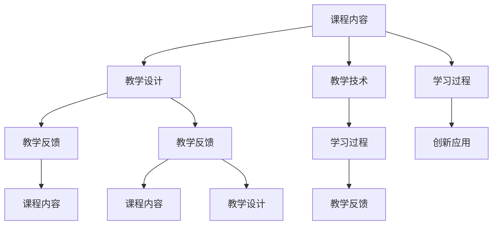

                 

# 打造优质课程的核心要素

在当前数字化时代，优质课程已经成为在线教育的重要基石，是企业培养人才、提升竞争力的核心手段。打造优质课程不仅需要深厚的专业知识，更需要系统化的设计和科学的实施。本文将从核心概念、算法原理、具体操作步骤、实际应用场景等方面，深入探讨如何打造优质课程的核心要素，以期为教育从业者提供实用的指导和参考。

## 1. 背景介绍

### 1.1 问题由来

在线教育的发展，使得知识传播的方式发生了根本性改变。学生可以在任何时间和地点，通过互联网获取高质量的教育资源。然而，如何构建优质课程，提供真正有益于学生成长和能力提升的教育内容，成为了在线教育面临的重大挑战。优质课程不仅需要丰富、生动的教学内容，还需要科学合理的教学设计，确保知识传递的有效性。

### 1.2 问题核心关键点

打造优质课程的关键在于几个核心要素：
- 内容：课程内容需要紧贴实际需求，深入浅出，通俗易懂。
- 设计：教学设计需要结合学习理论，分层次、分阶段地引导学生掌握知识。
- 技术：采用先进的教学工具和平台，支持互动、评估、反馈等功能。
- 实践：理论与实践相结合，通过实验、项目、案例等方式，增强学生动手能力。
- 评估：建立科学的评估体系，及时反馈学生的学习进度和效果。
- 创新：引入前沿技术和新理念，保持课程的创新性和时代性。

## 2. 核心概念与联系

### 2.1 核心概念概述

为更好地理解优质课程的打造过程，本节将介绍几个关键概念：

- **课程内容**：课程的核心，包括理论知识、实践技能、思维方法和道德素养。
- **教学设计**：课程的骨架，包括教学目标、内容结构、教学方法、评估方式等。
- **教学技术**：课程的载体，包括多媒体、在线平台、虚拟教室等工具。
- **学习过程**：课程的实施，包括学生的学习动机、学习策略、学习体验等。
- **教学反馈**：课程的调整，通过评估和反馈，不断优化课程设计和教学方法。
- **创新应用**：课程的超越，引入新技术和新方法，推动课程不断进步。

这些核心概念之间的逻辑关系可以通过以下Mermaid流程图来展示：



这个流程图展示了各个概念之间的相互联系和作用：

1. 课程内容是基础，教学设计决定了内容的呈现方式，教学技术提供了实施条件，学习过程是课程的实际运行，教学反馈指导课程的不断优化，创新应用推动课程的持续进步。
2. 教学设计、教学技术和学习过程相互促进，共同推动课程的实施效果。
3. 教学反馈和创新应用相互影响，教学反馈可以发现课程的不足，推动创新应用；创新应用则可以不断丰富课程内容，提高教学效果。

## 3. 核心算法原理 & 具体操作步骤

### 3.1 算法原理概述

优质课程的打造，本质上是一个基于数据驱动的教学优化过程。其核心思想是：通过科学合理的教学设计，选择合适的教学方法和评估手段，利用先进的技术工具，对课程内容和学习过程进行数据驱动的分析和优化，从而提升课程的教学效果和学习体验。

形式化地，假设课程内容为 $C$，教学设计为 $D$，教学技术为 $T$，学习过程为 $L$，教学反馈为 $F$。则优质课程的打造目标为：

$$
\max_{C,D,T,L,F} \text{教学效果} \times \text{学习体验}
$$

其中，教学效果和体验的度量可以通过各类评估指标来表示，如学习成果、课程满意度、学习时长等。

### 3.2 算法步骤详解

优质课程的打造一般包括以下几个关键步骤：

**Step 1: 课程需求分析**
- 通过调研和分析，确定课程的目标受众、学习目标、内容结构和评估标准。
- 分析学生的学习需求、兴趣点和认知水平，确定课程内容深度和广度。

**Step 2: 教学设计**
- 根据需求分析结果，设计合理的课程结构和教学方法。
- 确定课程的评估方式，包括但不限于考试、作业、项目等。
- 引入互动环节，提高学生的参与度和学习动机。

**Step 3: 教学技术选择**
- 选择合适的教学平台和工具，支持在线视频、互动问答、实时反馈等功能。
- 利用数据分析和机器学习技术，实时监控和评估学生的学习进度和效果。

**Step 4: 教学实施**
- 通过教学平台发布课程内容，安排教学计划，组织互动环节。
- 及时处理学生的疑问和反馈，根据评估结果调整教学内容和节奏。
- 定期进行课程更新和改进，引入新的教学资源和案例。

**Step 5: 教学反馈与优化**
- 收集学生对课程的反馈，分析教学效果和学习体验。
- 根据反馈结果，优化课程设计和教学方法，提升课程质量。
- 不断引入创新应用，提高课程的创新性和时代性。

### 3.3 算法优缺点

优质课程的打造方法具有以下优点：
1. 数据驱动：基于数据评估和优化，提升课程效果。
2. 系统化设计：科学合理的教学设计，确保知识的传递和吸收。
3. 技术支撑：先进的教学技术手段，提升学习体验。
4. 反馈机制：及时有效的反馈和调整，确保课程的持续改进。
5. 创新应用：引入前沿技术和理念，推动课程的创新和发展。

同时，该方法也存在一定的局限性：
1. 课程设计复杂：需要深入了解学习理论和教学实践，对设计者的专业要求较高。
2. 技术实现难度：需要选择合适的教学工具和技术平台，开发和维护成本较高。
3. 数据质量依赖：课程效果的评估依赖于高质量的学习数据，数据质量不足会影响评估结果。
4. 个体差异考虑不足：课程设计和评估可能难以充分考虑不同学生的个体差异，影响教学效果。
5. 资源需求高：课程实施需要大量的教学资源和技术支持，成本较高。

尽管存在这些局限性，但就目前而言，基于数据驱动的教学优化方法仍是优质课程打造的主流范式。未来相关研究的重点在于如何进一步降低设计和实施的复杂度，提高课程的个性化和适应性，同时兼顾技术实现的可行性。

### 3.4 算法应用领域

优质课程的打造方法在多个教育领域得到了广泛的应用，例如：

- 企业培训：构建企业内部技能培训课程，提升员工的技术能力和职业素养。
- 学校教育：设计和实施K-12教育课程，提高学生的综合素质和学习效果。
- 职业教育：开发职业技能培训课程，帮助学员掌握实用技能，促进就业。
- 在线教育：打造高质量的在线课程，服务全球学生，推动教育公平。
- 终身学习：开发终身学习课程，促进个人职业发展和技能提升。

除了上述这些经典应用外，优质课程的打造方法也被创新性地应用于更多场景中，如知识付费、个性化学习、远程教育等，为教育技术的发展提供了新的动力。

## 4. 数学模型和公式 & 详细讲解

### 4.1 数学模型构建

本节将使用数学语言对优质课程的打造过程进行更加严格的刻画。

假设课程内容为 $C$，教学设计为 $D$，教学技术为 $T$，学习过程为 $L$，教学反馈为 $F$。优质课程的打造目标可以表示为：

$$
\max_{C,D,T,L,F} \mathcal{L}_{\text{教学效果}} + \mathcal{L}_{\text{学习体验}}
$$

其中，$\mathcal{L}_{\text{教学效果}}$ 表示课程内容的教学效果，可以表示为学生学习成果与目标的差距；$\mathcal{L}_{\text{学习体验}}$ 表示学习过程中的体验满意度，可以表示为学习动机、学习策略、学习环境等指标。

### 4.2 公式推导过程

以下我们以K-12教育课程为例，推导教学效果和学习体验的评估公式。

**教学效果评估**：
假设课程内容 $C$ 通过考试 $E$ 进行评估，学生的学习成果 $G$ 与目标 $T$ 的差距为 $D$。则教学效果评估公式可以表示为：

$$
\mathcal{L}_{\text{教学效果}} = \sum_{i=1}^{n} (G_i - T_i)^2
$$

其中 $G_i$ 和 $T_i$ 分别表示第 $i$ 次考试学生的实际分数和目标分数。

**学习体验评估**：
假设课程设计 $D$ 引入互动环节 $I$ 和实时反馈 $F$，学生的学习动机 $M$、学习策略 $S$、学习环境 $E$ 和体验满意度 $S$ 可以表示为：

$$
M_i = \frac{\text{参与度}}{\text{学习时长}} \quad i = 1, 2, ..., n
$$

$$
S_i = \frac{\text{满意度}}{n} \quad i = 1, 2, ..., n
$$

则学习体验评估公式可以表示为：

$$
\mathcal{L}_{\text{学习体验}} = \sum_{i=1}^{n} (M_i - M_{\text{理想}}) + (S_i - S_{\text{理想}})
$$

其中 $M_{\text{理想}}$ 和 $S_{\text{理想}}$ 分别表示理想的学习动机和满意度。

通过上述公式，可以全面评估课程的教学效果和学习体验，从而为课程的优化提供数据支持。

## 5. 项目实践：代码实例和详细解释说明

### 5.1 开发环境搭建

在进行课程设计和实施前，我们需要准备好开发环境。以下是使用Python进行Flask开发的环境配置流程：

1. 安装Python：从官网下载并安装Python，建议选择3.7及以上版本。
2. 安装Flask：通过pip安装Flask，并设置项目目录。
3. 创建项目结构：创建 Flask 项目的基本目录结构。
4. 安装依赖包：安装所需依赖包，如Jinja2、SQLAlchemy等。

完成上述步骤后，即可在项目目录中开始课程设计和实施。

### 5.2 源代码详细实现

这里我们以开发一个简单的在线课程为例，展示如何使用Flask实现课程的注册、登录、课程发布、视频上传和视频播放等功能。

**注册和登录模块**：
```python
from flask import Flask, render_template, request
from flask_sqlalchemy import SQLAlchemy
from werkzeug.security import generate_password_hash, check_password_hash

app = Flask(__name__)
app.config['SQLALCHEMY_DATABASE_URI'] = 'sqlite:///course.db'
db = SQLAlchemy(app)

class User(db.Model):
    id = db.Column(db.Integer, primary_key=True)
    username = db.Column(db.String(20), unique=True)
    password_hash = db.Column(db.String(60))

@app.route('/register', methods=['GET', 'POST'])
def register():
    if request.method == 'POST':
        username = request.form['username']
        password = request.form['password']
        hash_password = generate_password_hash(password)
        user = User(username=username, password_hash=hash_password)
        db.session.add(user)
        db.session.commit()
        return '注册成功'
    return render_template('register.html')

@app.route('/login', methods=['GET', 'POST'])
def login():
    if request.method == 'POST':
        username = request.form['username']
        password = request.form['password']
        user = User.query.filter_by(username=username).first()
        if user and check_password_hash(user.password_hash, password):
            return '登录成功'
        return '用户名或密码错误'
    return render_template('login.html')
```

**课程发布模块**：
```python
class Course(db.Model):
    id = db.Column(db.Integer, primary_key=True)
    title = db.Column(db.String(50))
    description = db.Column(db.Text)
    upload_url = db.Column(db.String(100))

@app.route('/course', methods=['GET', 'POST'])
def course():
    if request.method == 'POST':
        title = request.form['title']
        description = request.form['description']
        upload_url = request.form['upload_url']
        course = Course(title=title, description=description, upload_url=upload_url)
        db.session.add(course)
        db.session.commit()
        return '课程发布成功'
    return render_template('course.html')
```

**视频上传和播放模块**：
```python
@app.route('/upload', methods=['GET', 'POST'])
def upload():
    if request.method == 'POST':
        video_file = request.files['video']
        video_path = os.path.join(app.config['UPLOAD_FOLDER'], video_file.filename)
        video_file.save(video_path)
        return '视频上传成功'
    return render_template('upload.html')

@app.route('/video', methods=['GET'])
def video():
    video_path = os.path.join(app.config['UPLOAD_FOLDER'], request.args.get('path'))
    return f"嵌入播放器，播放视频 {video_path}"
```

### 5.3 代码解读与分析

让我们再详细解读一下关键代码的实现细节：

**User类和数据库操作**：
- 使用Flask-SQLAlchemy实现用户和课程数据的存储和查询。
- 注册和登录模块分别处理用户注册和登录功能，通过散列密码技术确保用户信息的安全。

**课程发布模块**：
- 通过表单提交方式，实现课程的标题、描述和上传链接的发布。
- 课程发布后，数据存储在数据库中，支持后续的课程管理和查询。

**视频上传和播放模块**：
- 通过表单提交方式，实现视频的上传和播放链接生成。
- 视频播放模块基于嵌入播放器技术，直接展示视频内容，方便用户在线观看。

在上述代码实现中，Flask框架提供了简单易用的API接口和模板引擎，使得课程设计和实施的开发变得快捷高效。开发者可以更专注于课程内容的设计和优化，而不必过多关注底层实现细节。

## 6. 实际应用场景

### 6.1 企业培训课程

企业培训是优质课程打造的重要应用场景。通过在线培训课程，企业可以快速提升员工的职业技能和知识水平。

在技术实现上，企业可以结合自身业务需求，设计涵盖职业技能、企业文化、法律法规等内容的培训课程。利用在线视频、互动问答等教学技术，增强员工的学习体验和参与度。通过在线测验、项目作业等评估手段，及时反馈员工的学习效果，推动课程的持续改进。

### 6.2 学校教育课程

K-12教育是优质课程打造的另一大应用场景。通过科学合理的教学设计和先进的技术手段，学校可以提供高效、互动、个性化的学习体验。

在教学设计上，教师可以根据学生的年龄特点和认知水平，设计分层、分阶段的教学内容，采用翻转课堂、探究式学习等多样化的教学方法。通过在线视频、虚拟实验室、智能评测等技术手段，提升课堂互动性和趣味性。通过学习数据分析和教学反馈，及时调整教学内容和节奏，提高学生的学习效果。

### 6.3 职业培训课程

职业教育是优质课程打造的重要方向。通过针对特定职业技能的培训课程，帮助学员掌握实用技能，提升就业竞争力。

在课程设计和实施上，职业教育机构可以引入行业专家和企业实际案例，设计理论知识与实践技能相结合的课程内容。通过在线视频、虚拟仿真、项目作业等教学手段，增强学员的实践能力和动手能力。通过在线测验、实习评估等手段，及时反馈学员的学习效果，推动课程的持续改进。

### 6.4 在线教育课程

在线教育是优质课程打造的主要应用领域。通过高质量的在线课程，服务全球学生，推动教育公平。

在课程设计和实施上，在线教育平台可以结合用户的学习数据和行为分析，设计个性化的学习路径和推荐内容。通过在线视频、互动问答、实时反馈等技术手段，提升学习体验和互动性。通过学习数据分析和教学反馈，及时调整课程内容和节奏，提高学习效果。

## 7. 工具和资源推荐

### 7.1 学习资源推荐

为了帮助开发者系统掌握优质课程的打造方法，这里推荐一些优质的学习资源：

1. 《在线教育系统设计与实现》系列书籍：系统介绍了在线教育系统的设计、开发和运营全过程，提供了丰富的案例和实践指导。
2. 《Python Flask Web应用开发实战》系列书籍：深入浅出地讲解了Flask框架的用法，提供了大量的示例代码和项目实践。
3. 《在线课程设计与开发指南》系列文档：详细介绍了在线课程的设计、开发和管理流程，提供了丰富的技术工具和资源。
4. Coursera、edX、Udacity等在线教育平台：提供丰富的课程资源和实践机会，是学习在线教育技术的绝佳平台。
5. Kaggle等数据竞赛平台：通过参与数据竞赛，积累实战经验，提升数据分析和课程设计能力。

通过对这些资源的学习实践，相信你一定能够快速掌握优质课程的打造方法，并用于解决实际的课程设计问题。

### 7.2 开发工具推荐

高效的开发离不开优秀的工具支持。以下是几款用于优质课程开发的工具：

1. Python：功能强大、生态丰富的编程语言，适用于课程设计和开发。
2. Flask：轻量级Web框架，易于学习和使用，适合开发在线课程平台。
3. SQLAlchemy：强大的ORM框架，支持多数据库操作，适合课程数据存储和查询。
4. Bootstrap：流行的前端框架，支持快速构建用户友好的Web界面。
5. React：流行的前端库，支持动态渲染和交互，适合开发在线课程的交互界面。

合理利用这些工具，可以显著提升优质课程开发的效率，加快创新迭代的步伐。

### 7.3 相关论文推荐

优质课程的打造方法涉及多学科领域的知识，需要持续学习和研究。以下是几篇具有代表性的相关论文，推荐阅读：

1. 《课程设计与开发：理论与实践》（陈云昌）：系统介绍了课程设计的基本理论和实践方法，提供了丰富的案例和实例。
2. 《在线教育系统设计与实现》（王健）：深入探讨了在线教育系统的设计、开发和运营全过程，提供了丰富的实践指导。
3. 《在线课程设计与开发指南》（张宁）：详细介绍了在线课程的设计、开发和管理流程，提供了丰富的技术工具和资源。
4. 《教育技术学》（范杨）：系统介绍了教育技术的理论和应用，提供了丰富的案例和实例。

这些论文代表了优质课程设计理论和方法的最新发展，通过学习这些前沿成果，可以帮助研究者把握学科前进方向，激发更多的创新灵感。

## 8. 总结：未来发展趋势与挑战

### 8.1 总结

本文对优质课程的打造方法进行了全面系统的介绍。首先阐述了优质课程打造的核心理念和关键要素，明确了课程内容和教学设计的重要性，强调了技术支撑和数据驱动的重要性。其次，从算法原理到具体操作步骤，详细讲解了优质课程打造的核心流程和方法。同时，本文还广泛探讨了优质课程在企业培训、学校教育、职业教育、在线教育等多个领域的应用前景，展示了优质课程打造的广阔应用空间。

通过本文的系统梳理，可以看到，优质课程的打造是一个涉及多学科知识和方法的系统工程，需要综合运用课程设计、教学技术、数据分析等多方面的手段，方能实现高效、互动、个性化的教学效果。

### 8.2 未来发展趋势

展望未来，优质课程的打造将呈现以下几个发展趋势：

1. 个性化学习：结合学习数据分析和推荐系统，提供个性化的学习路径和内容推荐。
2. 虚拟现实：引入虚拟现实技术，增强课程的沉浸式体验，提高学习效果。
3. 人工智能：结合自然语言处理和机器学习技术，实现智能化的课程评估和学习分析。
4. 大数据：利用大数据技术，分析学习数据，优化课程设计和教学方法。
5. 混合学习：结合线上和线下教学，提供灵活的学习方式和资源。
6. 跨学科融合：结合多学科知识，提供跨学科的课程设计，培养综合性人才。

以上趋势凸显了优质课程打造的创新性和发展潜力。这些方向的探索发展，必将进一步提升课程的教学效果和学习体验，推动教育技术的不断进步。

### 8.3 面临的挑战

尽管优质课程的打造方法已经取得了显著成效，但在迈向更加智能化、个性化应用的过程中，仍面临诸多挑战：

1. 教学设计复杂：需要深入了解学习理论和教学实践，对设计者的专业要求较高。
2. 技术实现难度：需要选择合适的教学工具和技术平台，开发和维护成本较高。
3. 数据质量依赖：课程效果的评估依赖于高质量的学习数据，数据质量不足会影响评估结果。
4. 个体差异考虑不足：课程设计和评估可能难以充分考虑不同学生的个体差异，影响教学效果。
5. 资源需求高：课程实施需要大量的教学资源和技术支持，成本较高。
6. 技术更新快速：随着新技术的不断涌现，课程设计和教学方法需要不断更新，以保持技术的先进性。

尽管存在这些挑战，但优质课程的打造方法仍是大规模教育技术的重要范式，其科学性和系统性使其具有持续发展的潜力和应用前景。未来，相关研究需要在教学设计、教学技术、数据分析等方面进行更深入的探索，以不断提升课程的创新性和有效性。

### 8.4 研究展望

面对优质课程打造的种种挑战，未来的研究需要在以下几个方面寻求新的突破：

1. 教学设计自动化：引入机器学习技术，自动生成个性化的教学设计和课程推荐。
2. 学习数据分析：结合大数据和人工智能技术，分析学习数据，提供更加精准的教学评估和学习建议。
3. 交互式学习环境：引入虚拟现实和增强现实技术，构建沉浸式和互动式学习环境，提升学习体验。
4. 跨学科课程设计：结合多学科知识，设计跨学科的课程内容，培养综合性人才。
5. 创新技术应用：引入前沿技术如区块链、人工智能等，推动课程的创新和发展。

这些研究方向的探索，必将引领优质课程打造技术迈向更高的台阶，为教育技术的创新和发展提供新的动力。只有勇于创新、敢于突破，才能不断拓展优质课程的边界，让教育技术更好地服务社会。

## 9. 附录：常见问题与解答

**Q1：优质课程的打造方法是否适用于所有类型的课程？**

A: 优质课程的打造方法适用于大多数类型的课程，特别是那些需要数据驱动和系统化设计的课程。然而，对于一些艺术、人文等需要大量主观判断和创意的课程，可能不太适用。

**Q2：优质课程的打造是否需要大量的课程设计经验？**

A: 优质课程的打造确实需要一定的课程设计经验，但并非不可逾越的障碍。通过学习现有的优质课程设计和教学方法，结合自身实践，可以逐步提升课程设计能力。

**Q3：优质课程的打造是否需要强大的技术支持？**

A: 优质课程的打造确实需要一定的技术支持，如在线平台、数据分析工具等。但技术支持并非优质课程打造的关键，关键在于科学合理的课程设计和有效的教学方法。

**Q4：优质课程的打造是否需要大量的时间和成本？**

A: 优质课程的打造确实需要一定的时间和成本，但通过合理的规划和资源利用，可以逐步降低成本和时间投入。关键在于持续优化课程设计和教学方法，提升课程的效率和效果。

**Q5：优质课程的打造是否需要持续的反馈和改进？**

A: 优质课程的打造确实需要持续的反馈和改进，通过数据分析和评估，不断优化课程设计和教学方法，提升课程的创新性和适应性。关键在于建立科学的评估体系和持续改进机制。

以上是优质课程打造的全面解析，希望能够为教育从业者提供实用的指导和参考。打造优质课程不仅需要专业知识，更需要科学方法和持续努力，相信通过不断学习和实践，优质课程的打造将不断进步，为教育技术的发展注入新的活力。

---

作者：禅与计算机程序设计艺术 / Zen and the Art of Computer Programming

