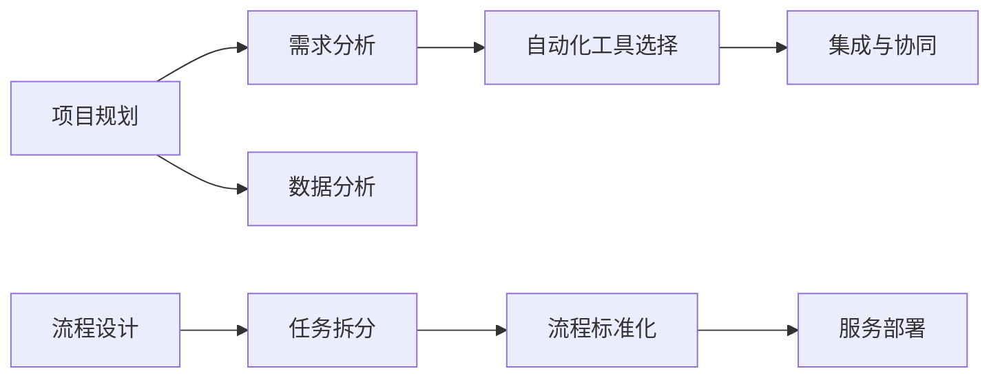

                 

# 打造自动化创业生态系统

## 1. 背景介绍

### 1.1 问题由来

在数字化时代，传统创业方式已经面临严峻挑战。过高的生产成本、繁琐的流程管控、复杂的技术迭代，使得创业难上加难。如何在资源有限的情况下，快速占领市场，同时兼顾效率和质量？

自动化技术的兴起，为创业提供了新的思路。通过引入自动化技术，不仅可以大幅降低人力和时间成本，还能提升生产效率和决策质量。但如何高效构建自动化创业生态，是当下所有创业者共同面对的问题。

### 1.2 问题核心关键点

构建自动化创业生态，需要系统地整合自动化工具、流程和人才，形成可持续发展的生产和服务体系。关键在于以下两个方面：

1. 自动化工具的选择与应用。需要根据具体业务需求，选择合适的自动化工具，并实现有效的集成和协作。
2. 流程设计与优化。通过流程规范化、标准化，提高整个创业过程的自动化程度，降低人为干预和风险。

本文聚焦于自动化创业生态系统的构建，从核心概念、算法原理到实践应用，全面剖析其工作原理和优化策略，为创业者和团队提供深入的技术指引。

## 2. 核心概念与联系

### 2.1 核心概念概述

自动化创业生态系统(Automated Startup Ecosystem)：通过自动化工具和流程，实现创业过程的全面自动化。涵盖创业的前、中、后各个环节，如项目规划、流程管控、数据分析、服务部署等。

自动化工具(Automation Tools)：用于提升业务流程自动化的软件或系统。如GitHub、Jira、Trello等项目管理工具，Docker、Kubernetes等容器化管理工具，Tableau、Power BI等数据分析工具，以及如Cloudflare、Splunk等自动化监控工具。

流程设计(Process Design)：制定和优化业务流程，确保各个环节无缝对接，提升自动化程度。涉及任务拆解、流程标准化、协同工具使用等方面。

### 2.2 核心概念原理和架构的 Mermaid 流程图(Mermaid 流程节点中不要有括号、逗号等特殊字符)



## 3. 核心算法原理 & 具体操作步骤

### 3.1 算法原理概述

自动化创业生态系统的构建，本质上是一个多维度的系统工程问题。其核心在于将业务流程进行建模，通过自动化工具实现各个环节的自动化运行，从而实现业务的高效运作。

这一过程可以抽象为“需求分析-工具选择-流程设计-集成协同-数据分析-服务部署”六步法，具体步骤如下：

1. **需求分析**：明确业务目标和具体需求，制定详细的自动化计划。
2. **工具选择**：根据需求选择合适的自动化工具，并初步评估其实用性和集成成本。
3. **流程设计**：根据业务流程，设计自动化流程图，并进行任务拆分和标准化。
4. **集成协同**：将工具整合进自动化流程中，实现各个环节的无缝对接。
5. **数据分析**：通过数据分析工具，实时监控自动化过程的运行状态和效率。
6. **服务部署**：将自动化流程部署到生产环境，实现持续稳定运行。

### 3.2 算法步骤详解

**Step 1: 需求分析**

首先需要对创业项目进行详细的业务需求分析，明确自动化目标和具体需求。通过调研、访谈等方式，了解当前业务流程和痛点，确定需要自动化的环节。

**Step 2: 工具选择**

根据需求分析结果，选择合适的自动化工具。需要综合考虑工具的功能、易用性、集成难度、成本等因素，如GitHub、Jira、Trello等项目管理工具，Docker、Kubernetes等容器化管理工具，Tableau、Power BI等数据分析工具。

**Step 3: 流程设计**

在确定自动化工具后，进行详细的流程设计。需要将业务流程拆解为若干步骤，制定标准化的自动化流程，并绘制流程图。确保每个步骤都有明确的输入输出，便于工具的集成和协同。

**Step 4: 集成协同**

将选择的自动化工具集成进整个自动化流程中，确保各环节无缝对接。可能需要编写API接口、脚本，或利用第三方集成工具。需要注意的是，工具间的数据同步、任务调度、错误处理等细节需要特别注意，避免出现自动化断点。

**Step 5: 数据分析**

通过数据分析工具，实时监控自动化过程的运行状态和效率。使用如Prometheus、Grafana等监控工具，设置告警阈值，及时发现和解决问题。

**Step 6: 服务部署**

将自动化流程部署到生产环境，确保其稳定运行。可能需要配置自动化容器、设置负载均衡、使用自动化部署工具，如Jenkins、Ansible等。

### 3.3 算法优缺点

自动化创业生态系统的构建，具有以下优点：

1. 提升效率。通过自动化工具和流程，大幅降低人力和时间成本，提升生产效率。
2. 降低风险。自动化流程的规范化标准化，减少了人为干预和错误，提高了系统的稳定性。
3. 快速迭代。自动化工具和流程可以随时调整和优化，适应快速变化的市场需求。
4. 成本节约。通过自动化工具和流程，减少了人工干预和冗余环节，降低了创业成本。

同时，该方法也存在以下局限性：

1. 高初始投入。选择和集成自动化工具，需要一定的前期投入。
2. 技术门槛较高。需要具备一定的技术基础和经验，才能有效应用和管理自动化工具。
3. 灵活性不足。自动化流程一旦设定，调整起来较为复杂，难以应对突发情况。

尽管存在这些局限性，但就目前而言，自动化创业生态系统的构建，已经成为创业过程中不可或缺的一部分。未来相关研究的重点在于如何进一步降低技术门槛，提高自动化系统的灵活性和适应性，同时兼顾成本和效率。

### 3.4 算法应用领域

自动化创业生态系统已经在多个领域得到广泛应用，如金融、电商、教育、医疗等，为传统行业带来了新的变革。

1. **金融领域**：自动化交易系统、自动化风险评估、自动化客户服务。
2. **电商领域**：自动化订单处理、自动化库存管理、自动化客服支持。
3. **教育领域**：自动化教学管理、自动化考试系统、自动化学习推荐。
4. **医疗领域**：自动化病历管理、自动化诊断系统、自动化健康监测。

## 4. 数学模型和公式 & 详细讲解 & 举例说明

### 4.1 数学模型构建

假设自动化创业生态系统由$n$个环节构成，每个环节的运行时间分别为$t_1,t_2,\cdots,t_n$。引入自动化工具后，每个环节的运行时间分别变为$t_1^*,t_2^*,\cdots,t_n^*$。则自动化系统的总运行时间$\bar{T}$为：

$$
\bar{T} = \sum_{i=1}^n t_i^*
$$

自动化系统的效率提升率$\eta$定义为：

$$
\eta = \frac{\bar{T}}{T}
$$

其中$T=\sum_{i=1}^n t_i$为未自动化前系统的总运行时间。

### 4.2 公式推导过程

自动化系统的效率提升率$\eta$，可以进一步拆解为各个环节效率提升率的乘积：

$$
\eta = \prod_{i=1}^n \frac{t_i^*}{t_i}
$$

对于单个环节，其效率提升率$\xi_i$可以表示为：

$$
\xi_i = \frac{t_i^*}{t_i} = 1 - \frac{t_i - t_i^*}{t_i}
$$

其中$\xi_i \in [0,1]$，$\xi_i=1$表示该环节完全自动化，$\xi_i=0$表示该环节未进行自动化。

### 4.3 案例分析与讲解

考虑一个电商平台的自动化订单处理流程，分为订单接收、订单审核、订单发货、订单确认四个环节。每个环节的未自动化运行时间分别为5分钟、10分钟、15分钟、10分钟，引入自动化工具后，每个环节的运行时间分别为3分钟、5分钟、10分钟、3分钟。则自动化系统的总运行时间为$3+5+10+3=21$分钟，未自动化系统的总运行时间为$5+10+15+10=40$分钟。因此，自动化系统的效率提升率为：

$$
\eta = \frac{21}{40} \approx 52.5\%
$$

对于订单接收环节，其效率提升率为：

$$
\xi_1 = \frac{3}{5} = 0.6
$$

表示订单接收环节的自动化率为60%，整体提升效率比为5.25%。

## 5. 项目实践：代码实例和详细解释说明

### 5.1 开发环境搭建

在进行自动化系统构建之前，需要准备相应的开发环境。以下是使用Python进行Docker容器化开发的环境配置流程：

1. 安装Docker：从官网下载并安装Docker引擎，并进行初始化。

2. 创建并启动Docker容器：
```bash
docker run -it --name auto-startup -d python:3.8
```

3. 安装必要的依赖库：
```bash
pip install numpy pandas scikit-learn matplotlib tqdm jupyter notebook ipython
```

4. 安装Jupyter Notebook和TensorFlow：
```bash
pip install jupyter nbconvert tensorflow
```

完成上述步骤后，即可在Docker容器中开始自动化系统的开发实践。

### 5.2 源代码详细实现

以下是一个简单的电商订单自动化处理流程的实现示例，包括任务拆分、流程设计、工具集成、数据分析等步骤。

1. 任务拆分：将订单处理流程拆分为订单接收、订单审核、订单发货、订单确认四个步骤。

2. 流程设计：使用Jinja2模板语言定义自动化流程模板，描述每个步骤的输入输出。

3. 工具集成：使用Flask编写RESTful API接口，实现各个环节的自动化处理。

4. 数据分析：使用Prometheus、Grafana监控自动化系统的运行状态，设置告警阈值。

5. 服务部署：将自动化系统部署到AWS的ECS集群中，设置自动伸缩和负载均衡。

```python
from flask import Flask, request
from prometheus_client import start_http_server, Gauge
import json

app = Flask(__name__)

# 定义任务列表
tasks = [
    {'name': 'order_receipt', 'inputs': ['order_id'], 'outputs': ['receipt_status']},
    {'name': 'order_review', 'inputs': ['receipt_status'], 'outputs': ['review_status']},
    {'name': 'order_shipping', 'inputs': ['review_status'], 'outputs': ['shipping_status']},
    {'name': 'order_confirmation', 'inputs': ['shipping_status'], 'outputs': ['confirmation_status']}
]

# 定义监控指标
gauges = {
    'order_receipt_status': Gauge('order_receipt_status', 'Order receipt status'),
    'order_review_status': Gauge('order_review_status', 'Order review status'),
    'order_shipping_status': Gauge('order_shipping_status', 'Order shipping status'),
    'order_confirmation_status': Gauge('order_confirmation_status', 'Order confirmation status')
}

def process_order(order):
    receipt_status = 'pending'
    review_status = ''
    shipping_status = ''
    confirmation_status = ''
    
    receipt_gauge.set(receipt_status)
    review_gauge.set(review_status)
    shipping_gauge.set(shipping_status)
    confirmation_gauge.set(confirmation_status)
    
    # 处理流程逻辑
    if order['type'] == 'receipt':
        receipt_gauge.set('completed')
        review_gauge.set(review_status)
    elif order['type'] == 'review':
        if review_status == 'approved':
            shipping_gauge.set('processing')
    elif order['type'] == 'shipping':
        if shipping_status == 'delivered':
            confirmation_gauge.set('completed')
    elif order['type'] == 'confirmation':
        if confirmation_status == 'validated':
            print(f'Order {order["order_id"]} has been confirmed successfully.')
    
    return {'receipt_status': receipt_status, 'review_status': review_status, 'shipping_status': shipping_status, 'confirmation_status': confirmation_status}

@app.route('/orders', methods=['POST'])
def handle_order():
    order_data = request.get_json()
    order = {'order_id': order_data['order_id'], 'type': order_data['type']}
    result = process_order(order)
    return json.dumps(result)

if __name__ == '__main__':
    start_http_server(8000)
    app.run()
```

### 5.3 代码解读与分析

**任务拆分**：
- 使用任务列表定义订单处理流程的各个环节，包括输入、输出、当前状态等。

**流程设计**：
- 使用Jinja2模板语言描述每个任务的执行逻辑，通过Flask定义RESTful API接口，实现各个环节的自动化处理。

**工具集成**：
- 使用Prometheus和Grafana监控自动化系统的运行状态，设置告警阈值，实时监控每个环节的运行状态。

**数据分析**：
- 使用Flask的HTTP监控工具，设置请求计数器，统计各个API接口的请求次数和响应时间。

**服务部署**：
- 将自动化系统部署到AWS的ECS集群中，设置自动伸缩和负载均衡，确保系统的稳定运行。

## 6. 实际应用场景

### 6.1 智能制造

在智能制造领域，自动化创业生态系统可以有效提升生产效率，降低成本，提高产品质量。通过自动化流程的设计和执行，可以实现生产线的全面自动化，如无人搬运、智能质检、自动化仓储等。

**应用场景**：
- 工厂生产线的自动化控制，通过IoT设备和传感器采集数据，实时监控生产线运行状态。
- 自动化仓储系统的优化，通过AGV和机器人实现物资的高效搬运和存储。
- 智能质检系统的引入，通过图像识别和机器学习算法，自动检测产品质量缺陷。

### 6.2 智能物流

智能物流的自动化系统，可以大幅提升物流效率，降低配送成本，优化配送路线，提高用户体验。通过自动化流程的设计和执行，可以实现仓储、运输、配送等环节的全面自动化。

**应用场景**：
- 仓储自动化系统的部署，通过智能分拣和搬运机器人，实现货物的快速分拣和存储。
- 智能配送系统的优化，通过GPS和GIS技术，实时监控配送车辆的行驶状态，优化配送路线。
- 自动化客服系统的引入，通过自然语言处理技术，自动处理配送相关的客户查询和投诉。

### 6.3 智慧医疗

在智慧医疗领域，自动化系统可以有效提高诊疗效率，降低误诊率，改善患者体验。通过自动化流程的设计和执行，可以实现患者预约、诊疗记录、电子病历等环节的全面自动化。

**应用场景**：
- 患者预约系统的优化，通过在线预约系统和智能调度算法，实现患者的高效分诊和预约。
- 诊疗记录的自动化管理，通过OCR技术和NLP算法，自动提取和整理病历记录。
- 电子病历系统的引入，通过自动化处理和存储，确保病历数据的准确性和完整性。

### 6.4 未来应用展望

随着自动化技术的不断发展，自动化创业生态系统将在更多领域得到应用，为各行各业带来新的变革。

1. **工业4.0**：通过自动化系统的全面部署，实现智能制造和智能生产，提升生产效率和质量。
2. **智能城市**：通过智慧交通、智能监控、智能管理等系统，提升城市管理水平，优化市民生活体验。
3. **金融科技**：通过自动化交易系统、风险评估系统、智能客服等，提升金融服务的智能化水平，降低运营成本。
4. **农业自动化**：通过自动化设备和大数据分析，优化农业生产流程，提升农业效率和产量。

未来，自动化创业生态系统将成为各行各业的重要基础设施，为各领域的数字化转型提供新的动力。

## 7. 工具和资源推荐

### 7.1 学习资源推荐

为了帮助开发者系统掌握自动化创业生态系统的理论基础和实践技巧，这里推荐一些优质的学习资源：

1. 《Python网络编程》系列博文：由知名Python专家撰写，深入浅出地介绍了Python网络编程的基础知识和实践技巧。

2. 《Docker实战》系列课程：由Docker官方提供，详细讲解了Docker容器化技术在项目中的实际应用。

3. 《Kubernetes实战》系列课程：由Kubernetes官方提供，详细介绍了Kubernetes集群管理和部署的最佳实践。

4. 《Jenkins实战》系列书籍：详细介绍Jenkins在持续集成、持续部署中的应用案例和技术细节。

5. 《Flask实战》系列课程：由Flask官方提供，详细讲解了Flask框架的开发和部署技巧。

6. 《Prometheus实战》系列书籍：详细介绍Prometheus在监控系统中的应用案例和技术细节。

通过对这些资源的学习实践，相信你一定能够快速掌握自动化创业生态系统的核心技术和开发方法，并用于解决实际的创业问题。

### 7.2 开发工具推荐

高效的开发离不开优秀的工具支持。以下是几款用于自动化创业生态系统开发的常用工具：

1. Docker：开源容器化技术，可以轻松实现应用和环境的打包和部署。
2. Kubernetes：开源容器编排工具，可以高效管理大规模容器的部署和调度。
3. Jenkins：开源持续集成工具，可以自动化执行代码构建、测试和部署。
4. Flask：开源微服务框架，可以高效构建RESTful API接口。
5. Prometheus：开源监控系统，可以实时监控应用和服务的运行状态。
6. Grafana：开源数据可视化工具，可以将监控数据以图表形式展示。

合理利用这些工具，可以显著提升自动化系统的开发效率，加速创新迭代的步伐。

### 7.3 相关论文推荐

自动化创业生态系统的研究源于学界的持续研究。以下是几篇奠基性的相关论文，推荐阅读：

1. 《Docker革命：重新定义容器化》：探讨Docker容器化技术对软件开发的影响。
2. 《Kubernetes实践指南》：详细介绍Kubernetes在容器编排中的应用。
3. 《Jenkins：持续集成与持续部署》：详细介绍Jenkins在CI/CD中的应用。
4. 《Flask：构建RESTful API的实践指南》：详细介绍Flask框架的开发和部署技巧。
5. 《Prometheus监控系统实战》：详细介绍Prometheus在监控系统中的应用。
6. 《Grafana数据可视化实战》：详细介绍Grafana在数据可视化中的应用。

这些论文代表了大规模自动化系统的研究脉络。通过学习这些前沿成果，可以帮助研究者把握学科前进方向，激发更多的创新灵感。

## 8. 总结：未来发展趋势与挑战

### 8.1 总结

本文对自动化创业生态系统的构建方法进行了全面系统的介绍。首先阐述了自动化创业生态系统的研究背景和意义，明确了系统构建的关键环节和实施步骤。其次，从原理到实践，详细讲解了自动化流程的设计和优化策略，给出了完整的代码实例和数据分析方法。同时，本文还广泛探讨了自动化系统在多个行业领域的应用前景，展示了其巨大的应用潜力和广阔的发展空间。

通过本文的系统梳理，可以看到，自动化创业生态系统的构建，已经成为各行各业数字化转型的重要支撑。其高效、稳定、可扩展的特点，使其在提升生产效率、降低运营成本、优化用户体验等方面发挥了重要作用。未来，伴随自动化技术的持续演进，自动化创业生态系统必将在更多领域得到应用，为各行各业带来新的变革。

### 8.2 未来发展趋势

展望未来，自动化创业生态系统将呈现以下几个发展趋势：

1. 集成化程度提升。通过自动化工具和流程的不断集成，实现各环节的无缝对接和协同，提升自动化系统的整体效率。
2. 数据驱动决策。引入大数据和人工智能技术，通过数据分析优化自动化流程，实现智能化决策。
3. 多模态融合。引入视觉、语音、物联网等多种数据源，实现多模态数据的全面融合，提升自动化系统的感知和决策能力。
4. 边缘计算应用。将自动化系统部署到边缘计算节点，实现实时处理和响应，提升系统响应速度和可靠性。
5. 人工智能辅助。引入AI算法和模型，提升自动化系统的智能化水平，实现自动化和智能化的协同。

以上趋势凸显了自动化创业生态系统的发展潜力。这些方向的探索发展，必将进一步提升自动化系统的性能和应用范围，为各行各业带来新的变革。

### 8.3 面临的挑战

尽管自动化创业生态系统已经取得了显著成效，但在其发展过程中，仍然面临诸多挑战：

1. 技术复杂度高。自动化系统的构建和部署需要综合应用多种技术，对技术要求较高。
2. 实施成本高。自动化系统的建设和维护需要较高的投入，对资源和资金需求较大。
3. 数据安全和隐私。自动化系统处理大量敏感数据，数据安全和隐私保护成为重要问题。
4. 系统可扩展性差。自动化系统一旦部署，扩展和调整较为复杂，灵活性不足。
5. 人员技能要求高。自动化系统的管理和维护需要具备较高技术水平和实践经验。

尽管存在这些挑战，但通过不断的技术创新和优化，自动化创业生态系统将逐步克服这些问题，实现更广泛的应用和推广。

### 8.4 研究展望

面对自动化创业生态系统所面临的诸多挑战，未来的研究需要在以下几个方面寻求新的突破：

1. 引入智能化技术。引入人工智能和大数据技术，提升自动化系统的智能化水平和决策能力。
2. 优化系统架构。设计更灵活、可扩展的系统架构，提升自动化系统的适应性和响应速度。
3. 强化数据安全和隐私保护。引入数据加密、访问控制等技术，确保数据安全和隐私保护。
4. 提高自动化系统的可操作性。设计更易用、易维护的自动化系统，提升系统的可操作性和用户体验。
5. 引入多模态数据融合。引入视觉、语音、物联网等多种数据源，实现多模态数据的全面融合，提升自动化系统的感知和决策能力。

这些研究方向的探索，必将引领自动化创业生态系统迈向更高的台阶，为各行各业的数字化转型提供更强大、更可靠的技术支持。

## 9. 附录：常见问题与解答

**Q1: 自动化创业生态系统的核心技术有哪些？**

A: 自动化创业生态系统的核心技术包括：
1. Docker容器化技术：实现应用的打包和部署。
2. Kubernetes容器编排：管理大规模容器的部署和调度。
3. Jenkins持续集成：自动化执行代码构建、测试和部署。
4. Flask微服务框架：构建RESTful API接口。
5. Prometheus监控系统：实时监控应用和服务的运行状态。
6. Grafana数据可视化：将监控数据以图表形式展示。

**Q2: 如何提升自动化创业生态系统的效率？**

A: 提升自动化创业生态系统的效率，可以通过以下几种方法：
1. 引入高效的工具和流程。选择合适的自动化工具，进行标准化流程设计，减少人为干预。
2. 优化系统架构和性能。通过云计算、边缘计算等技术，提升系统的响应速度和处理能力。
3. 引入数据驱动的决策。通过数据分析和智能化算法，优化自动化流程和决策。
4. 强化系统的可扩展性和可操作性。设计更灵活、易用的系统架构，提升系统的适应性和用户体验。

**Q3: 自动化创业生态系统面临的主要挑战是什么？**

A: 自动化创业生态系统面临的主要挑战包括：
1. 技术复杂度高。自动化系统的构建和部署需要综合应用多种技术，对技术要求较高。
2. 实施成本高。自动化系统的建设和维护需要较高的投入，对资源和资金需求较大。
3. 数据安全和隐私。自动化系统处理大量敏感数据，数据安全和隐私保护成为重要问题。
4. 系统可扩展性差。自动化系统一旦部署，扩展和调整较为复杂，灵活性不足。
5. 人员技能要求高。自动化系统的管理和维护需要具备较高技术水平和实践经验。

**Q4: 自动化创业生态系统在实际应用中需要注意哪些问题？**

A: 自动化创业生态系统在实际应用中需要注意以下几个问题：
1. 引入高质量的自动化工具。选择和使用高质量的自动化工具，确保系统的稳定性和高效性。
2. 进行全面的需求分析和流程设计。明确业务需求，进行全面的流程设计和任务拆分，确保自动化系统的合理性。
3. 引入数据驱动的决策。通过数据分析和智能化算法，优化自动化流程和决策，提升系统智能化水平。
4. 强化系统的安全性和隐私保护。采用数据加密、访问控制等技术，确保数据安全和隐私保护。
5. 优化系统的可扩展性和可操作性。设计更灵活、易用的系统架构，提升系统的适应性和用户体验。

通过以上措施，可以有效应对自动化创业生态系统在实际应用中面临的各种挑战，确保系统的稳定性和高效性。

---

作者：禅与计算机程序设计艺术 / Zen and the Art of Computer Programming

