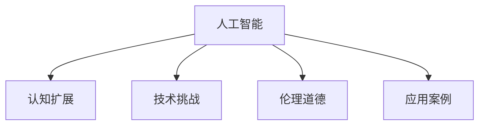

                 

# 扩展认知：人工智能的真正挑战

> 关键词：人工智能,认知扩展,技术挑战,未来展望,应用案例

## 1. 背景介绍

### 1.1 问题由来
随着人工智能技术的不断进步，我们正处在认知扩展的门槛上。人工智能不仅能处理海量数据、自动化复杂任务，还能辅助人类理解和探索未知领域。然而，人工智能技术在带来便利的同时，也带来了新的挑战和问题。

### 1.2 问题核心关键点
本文将探讨人工智能扩展认知所面临的诸多挑战，如数据隐私、模型可解释性、算法偏见、伦理道德等。我们将通过一系列实例和案例，展现人工智能如何真正改变我们的认知模式和生活方式。

### 1.3 问题研究意义
研究人工智能的挑战，对于推动技术进步、保障社会安全、促进人类认知发展具有重要意义：

1. **技术进步**：理解并克服人工智能的瓶颈，可以推动技术边界不断突破，加速科技进步。
2. **社会安全**：确保人工智能系统的安全性和可靠性，避免因技术滥用带来的风险。
3. **认知发展**：借助人工智能工具，扩展人类的认知能力，提升学习和创造的效率。

## 2. 核心概念与联系

### 2.1 核心概念概述

为更好地理解人工智能扩展认知的挑战，本节将介绍几个密切相关的核心概念：

- **人工智能(AI)**：指通过算法和模型实现的智能系统，能够模拟人类的智能行为。
- **认知扩展**：指通过人工智能工具和技术，扩展人类的认知边界，提升信息处理和知识应用的能力。
- **技术挑战**：指在实现认知扩展过程中遇到的各种技术难题，包括算法复杂性、数据处理、资源限制等。
- **伦理道德**：指在使用人工智能技术时需要考虑的伦理问题，如隐私保护、公平性、责任归属等。
- **应用案例**：具体展示人工智能在各个领域的应用，如医疗、教育、商业等。

这些概念之间的逻辑关系可以通过以下Mermaid流程图来展示：



这个流程图展示了一系列核心概念及其之间的关系：

1. 人工智能通过算法和技术手段，实现认知扩展。
2. 认知扩展带来了各种技术挑战，需要不断克服。
3. 在认知扩展的过程中，还需考虑伦理道德问题。
4. 通过实际应用案例，展示认知扩展的具体实践。

这些概念共同构成了人工智能扩展认知的核心框架，帮助我们全面理解人工智能技术的发展和应用。

## 3. 核心算法原理 & 具体操作步骤
### 3.1 算法原理概述

人工智能扩展认知的过程，本质上是通过算法和模型，不断优化和扩展人类的认知能力。其核心思想是：

- **数据驱动**：利用大数据和深度学习算法，从海量数据中提取知识，进行模式识别和预测。
- **算法优化**：通过不断改进算法模型，提高其精确性和泛化能力，从而实现更高效、更智能的认知扩展。
- **人机协同**：结合人类的判断和经验，提升人工智能系统的可靠性和鲁棒性。

### 3.2 算法步骤详解

人工智能扩展认知的一般流程包括：

**Step 1: 数据采集与预处理**
- 收集相关领域的大量数据，如医疗记录、教育资源、商业交易等。
- 进行数据清洗、特征提取和标准化处理，以提高数据质量和模型性能。

**Step 2: 模型选择与训练**
- 选择合适的深度学习模型，如卷积神经网络(CNN)、循环神经网络(RNN)、Transformer等。
- 使用训练集数据对模型进行训练，调整模型参数，优化损失函数。
- 应用正则化技术，如L2正则、Dropout、Early Stopping等，避免过拟合。

**Step 3: 模型评估与优化**
- 在验证集上评估模型性能，使用准确率、召回率、F1分数等指标。
- 根据评估结果，调整模型结构、超参数，进行模型优化。

**Step 4: 应用部署与迭代**
- 将优化后的模型部署到实际应用场景中，进行测试和运行。
- 收集用户反馈和实际运行数据，进行模型微调和优化。

### 3.3 算法优缺点

人工智能扩展认知的算法具有以下优点：

1. **效率高**：能够处理海量数据，快速提取知识，提升信息处理效率。
2. **精度高**：通过深度学习和优化算法，提高预测和决策的准确性。
3. **可扩展性**：模型可以根据新的数据进行迭代和优化，不断扩展认知能力。

同时，这些算法也存在一些缺点：

1. **数据依赖**：依赖于大量高质量的数据，数据采集和预处理复杂。
2. **模型复杂**：深度学习模型参数量大，计算资源消耗大。
3. **可解释性差**：黑盒模型难以解释决策过程，缺乏透明性。
4. **偏见问题**：训练数据中的偏见可能传递到模型中，影响公平性和鲁棒性。

### 3.4 算法应用领域

人工智能扩展认知的算法已在多个领域得到了广泛应用，包括：

- **医疗健康**：利用深度学习进行疾病预测、图像诊断、药物研发等。
- **教育培训**：通过智能推荐系统、虚拟辅导教师等，提升教育质量和个性化学习体验。
- **金融服务**：使用算法进行风险评估、欺诈检测、投资策略等。
- **商业智能**：通过数据挖掘和模式识别，优化供应链管理、客户服务、市场营销等。
- **自动驾驶**：利用感知和决策算法，实现车辆的自动驾驶和导航。

## 4. 数学模型和公式 & 详细讲解 & 举例说明

### 4.1 数学模型构建

在人工智能扩展认知的过程中，数学模型扮演着关键角色。以医疗健康领域的疾病预测为例，数学模型的构建过程如下：

**输入**：患者的病历数据、体检结果、基因信息等。
**输出**：疾病风险预测结果，如心脏病、癌症等。

定义疾病预测模型的损失函数为：

$$
L = \frac{1}{N} \sum_{i=1}^N \ell(M(y_i), y_i)
$$

其中 $N$ 为样本数量，$\ell$ 为损失函数，$M(y_i)$ 为模型输出，$y_i$ 为真实标签。

常用的损失函数包括均方误差(MSE)、交叉熵(Cross-Entropy)等。例如，对于二分类问题，可以使用交叉熵损失函数：

$$
\ell(M(y_i), y_i) = -(y_i \log M(y_i) + (1-y_i) \log (1-M(y_i)))
$$

### 4.2 公式推导过程

以二分类问题为例，模型输出的概率为 $M(y_i) = \sigma(W^T x_i + b)$，其中 $W$ 为权重矩阵，$b$ 为偏置项，$\sigma$ 为sigmoid函数。

将模型输出代入交叉熵损失函数，得：

$$
\ell(M(y_i), y_i) = -(y_i \log \sigma(W^T x_i + b) + (1-y_i) \log (1-\sigma(W^T x_i + b)))
$$

通过对上述公式进行微分和优化，可以得到模型参数的更新公式：

$$
\frac{\partial L}{\partial W} = \frac{1}{N} \sum_{i=1}^N [(y_i - M(y_i)) x_i]
$$

$$
\frac{\partial L}{\partial b} = \frac{1}{N} \sum_{i=1}^N [(y_i - M(y_i))]
$$

其中 $x_i$ 为输入特征向量。

### 4.3 案例分析与讲解

以医疗健康领域的疾病预测为例，我们可以使用上述数学模型对患者数据进行疾病风险预测。具体步骤如下：

1. **数据收集**：从医院和体检中心收集患者的病历数据、基因信息等。
2. **数据预处理**：清洗数据，去除缺失值和异常值，提取关键特征。
3. **模型训练**：使用训练集数据对模型进行训练，调整权重和偏置。
4. **模型评估**：在验证集上评估模型性能，调整模型参数。
5. **模型应用**：将优化后的模型部署到实际医疗系统中，进行疾病风险预测。

## 5. 项目实践：代码实例和详细解释说明

### 5.1 开发环境搭建

在进行项目实践前，我们需要准备好开发环境。以下是使用Python进行TensorFlow开发的环境配置流程：

1. 安装Anaconda：从官网下载并安装Anaconda，用于创建独立的Python环境。
2. 创建并激活虚拟环境：
```bash
conda create -n tf-env python=3.8 
conda activate tf-env
```

3. 安装TensorFlow：根据CUDA版本，从官网获取对应的安装命令。例如：
```bash
conda install tensorflow -c tf -c conda-forge
```

4. 安装各类工具包：
```bash
pip install numpy pandas scikit-learn matplotlib tqdm jupyter notebook ipython
```

完成上述步骤后，即可在`tf-env`环境中开始项目实践。

### 5.2 源代码详细实现

这里我们以医疗健康领域的疾病预测为例，给出使用TensorFlow对深度学习模型进行训练的PyTorch代码实现。

```python
import tensorflow as tf
from tensorflow.keras.layers import Dense, Dropout
from tensorflow.keras.models import Sequential
from tensorflow.keras.optimizers import Adam

# 定义模型结构
model = Sequential([
    Dense(64, activation='relu', input_shape=(8,)),
    Dropout(0.5),
    Dense(32, activation='relu'),
    Dropout(0.5),
    Dense(1, activation='sigmoid')
])

# 定义损失函数和优化器
loss_fn = tf.keras.losses.BinaryCrossentropy()
optimizer = Adam(learning_rate=0.001)

# 编译模型
model.compile(optimizer=optimizer, loss=loss_fn, metrics=['accuracy'])

# 训练模型
model.fit(train_data, train_labels, epochs=10, batch_size=32)

# 评估模型
model.evaluate(test_data, test_labels)
```

可以看到，通过TensorFlow的高级API，我们可以用相对简洁的代码完成深度学习模型的训练和评估。TensorFlow的强大计算图机制和丰富的工具库，使得深度学习模型开发更加高效便捷。

### 5.3 代码解读与分析

让我们再详细解读一下关键代码的实现细节：

**Sequential模型**：
- `Sequential`：一种线性堆叠模型，通过添加各层来构建深度学习模型。
- `Dense`：全连接层，通过计算矩阵乘法和激活函数实现特征提取。
- `Dropout`：正则化层，随机丢弃一部分神经元，防止过拟合。
- `Adam`：优化器，自适应地调整学习率，提高模型收敛速度。

**损失函数和评估指标**：
- `BinaryCrossentropy`：二分类问题的交叉熵损失函数。
- `Accuracy`：准确率评估指标，衡量模型预测的正确率。

**模型编译和训练**：
- `compile`：定义模型的优化器、损失函数和评估指标。
- `fit`：在训练集上进行模型训练，调整模型参数。

**模型评估和应用**：
- `evaluate`：在测试集上评估模型性能。
- 实际应用时，将模型封装成API接口，便于集成调用。

通过代码实践，可以看到TensorFlow的高效性和灵活性，可以快速构建和训练深度学习模型。但实际应用中，还需要考虑更多因素，如模型优化、超参数调优、模型部署等。

## 6. 实际应用场景
### 6.1 智能医疗系统

人工智能扩展认知在医疗领域的应用，可以显著提升医疗服务的质量和效率。智能医疗系统通过数据分析、模式识别、自然语言处理等技术，实现疾病预测、诊断、治疗、个性化医疗等功能。

例如，智能医疗系统可以基于患者的病历数据，利用深度学习模型进行疾病风险预测，早期发现潜在健康问题，提升诊断准确性。此外，智能医疗系统还可以从海量医学文献中提取知识，辅助医生制定个性化治疗方案，提升治疗效果。

### 6.2 教育培训

人工智能扩展认知在教育领域的应用，可以提供更加个性化、高效的学习体验。智能教育系统通过分析学生的学习行为、认知特点，推荐合适的学习内容、训练难度，提升学习效果。

例如，智能教育系统可以基于学生的答题数据，利用深度学习模型进行学习风格分析，推荐个性化的学习资源和练习题目，帮助学生克服学习难点，提升学习成绩。此外，智能教育系统还可以自动化批改作业、分析试卷，减轻教师负担，提升教学质量。

### 6.3 金融服务

人工智能扩展认知在金融领域的应用，可以提供更加智能、高效的金融服务。智能金融系统通过数据分析、风险评估、欺诈检测等技术，提升金融风险控制和客户服务水平。

例如，智能金融系统可以基于客户的交易数据，利用深度学习模型进行信用评估、风险预测，降低贷款违约率，提升金融产品的竞争力。此外，智能金融系统还可以从新闻、社交媒体等大数据中提取信息，实时监测市场动向，辅助投资决策，提升投资收益。

### 6.4 未来应用展望

随着人工智能技术的不断发展，基于扩展认知的智能系统将在更多领域得到应用，为各行各业带来变革性影响。

在智慧城市治理中，智能交通、智能安防、智能环保等系统，将大幅提升城市管理的智能化水平，构建更安全、高效、可持续的未来城市。

在企业生产中，智能制造、智能供应链、智能客服等系统，将提升生产效率，降低运营成本，提高客户满意度。

在科学研究中，人工智能扩展认知将加速科学发现、数据分析、实验设计等过程，推动科学研究进入新纪元。

未来，人工智能扩展认知技术将与更多前沿技术进行融合，如量子计算、生物计算、元宇宙等，为人类社会带来更多创新和突破。

## 7. 工具和资源推荐
### 7.1 学习资源推荐

为了帮助开发者系统掌握人工智能扩展认知的理论基础和实践技巧，这里推荐一些优质的学习资源：

1. 《深度学习》系列书籍：由Yoshua Bengio、Ian Goodfellow、Aaron Courville等顶级专家所著，全面介绍了深度学习的原理和应用，是人工智能领域的经典教材。

2. 《机器学习实战》系列课程：由著名数据科学家Andrew Ng主讲，涵盖了机器学习、深度学习、强化学习等领域的核心知识。

3. 《TensorFlow实战》书籍：由TensorFlow团队成员撰写，详细介绍了TensorFlow的使用方法和应用场景，是TensorFlow开发者的必备参考资料。

4. 《Python机器学习》书籍：由Sebastian Raschka和Vahid Mirjalili撰写，介绍了机器学习算法的Python实现，适合实战开发者阅读。

5. arXiv：谷歌推出的学术论文发布平台，汇聚了大量前沿的研究论文，是跟踪人工智能领域最新进展的重要来源。

通过对这些资源的学习实践，相信你一定能够快速掌握人工智能扩展认知的精髓，并用于解决实际的AI问题。

### 7.2 开发工具推荐

高效的开发离不开优秀的工具支持。以下是几款用于人工智能扩展认知开发的常用工具：

1. TensorFlow：由Google主导开发的开源深度学习框架，生产部署方便，适合大规模工程应用。

2. PyTorch：基于Python的开源深度学习框架，灵活动态的计算图，适合快速迭代研究。

3. Jupyter Notebook：基于Web的交互式开发环境，支持Python、R等多种编程语言，适合数据科学、机器学习等领域。

4. Scikit-learn：Python科学计算库，提供了丰富的机器学习算法和工具，适合数据分析、模型训练等任务。

5. Weights & Biases：模型训练的实验跟踪工具，可以记录和可视化模型训练过程中的各项指标，方便对比和调优。

6. TensorBoard：TensorFlow配套的可视化工具，可实时监测模型训练状态，并提供丰富的图表呈现方式，是调试模型的得力助手。

合理利用这些工具，可以显著提升人工智能扩展认知任务的开发效率，加快创新迭代的步伐。

### 7.3 相关论文推荐

人工智能扩展认知的研究源于学界的持续研究。以下是几篇奠基性的相关论文，推荐阅读：

1. "Deep Learning" by Ian Goodfellow, Yoshua Bengio, and Aaron Courville：全面介绍了深度学习的原理和应用，是人工智能领域的经典教材。

2. "Natural Language Processing in Practice" by Christopher Manning and Hinrich Schütze：详细介绍了自然语言处理技术在各行各业中的应用，展示了人工智能扩展认知的实际案例。

3. "AI Superpowers: China, Silicon Valley, and the New World Order" by Kai-Fu Lee：探讨了人工智能技术的发展趋势和应用前景，提供了丰富的案例和数据支持。

4. "Superintelligence: Paths, Dangers, Strategies" by Nick Bostrom：深入探讨了人工智能的伦理和道德问题，为人工智能扩展认知提供了重要的思考。

这些论文代表了大语言模型微调技术的发展脉络。通过学习这些前沿成果，可以帮助研究者把握学科前进方向，激发更多的创新灵感。

## 8. 总结：未来发展趋势与挑战
### 8.1 总结

本文对人工智能扩展认知所面临的诸多挑战进行了全面系统的介绍。首先阐述了人工智能扩展认知的核心理论和实践方法，明确了认知扩展在提升人类智能方面的重要价值。其次，从技术细节到应用场景，详细讲解了人工智能扩展认知的各个环节，给出了实际的代码实现和案例分析。同时，本文还探讨了人工智能扩展认知的未来发展趋势和潜在挑战，展示了其广阔的应用前景。

通过本文的系统梳理，可以看到，人工智能扩展认知正处于技术突破和应用扩展的黄金时期，具备强大的发展潜力和广泛的应用场景。未来，随着人工智能技术的不断进步，人工智能扩展认知将在更多领域得到应用，为人类社会带来深刻变革。

### 8.2 未来发展趋势

展望未来，人工智能扩展认知技术将呈现以下几个发展趋势：

1. **技术创新**：随着深度学习、自然语言处理等技术的不断发展，人工智能扩展认知将具备更强的理解和处理能力，应用于更多复杂场景。

2. **应用拓展**：人工智能扩展认知将在更多领域得到应用，如医疗健康、教育培训、金融服务、智能制造等，提升各行各业的效率和质量。

3. **人机协同**：人工智能扩展认知将更好地与人类协作，实现任务共担，提升智能系统的可靠性和鲁棒性。

4. **伦理道德**：随着人工智能扩展认知的应用范围扩大，伦理道德问题将日益突出，需要建立更完善的法律法规和伦理框架。

5. **隐私保护**：人工智能扩展认知将面临数据隐私和安全问题，需要采取更先进的数据保护措施和技术手段。

以上趋势凸显了人工智能扩展认知技术的广阔前景，这些方向的探索发展，必将进一步拓展人工智能的应用边界，提升人类社会的智能水平。

### 8.3 面临的挑战

尽管人工智能扩展认知技术已经取得了显著成就，但在迈向更加智能化、普适化应用的过程中，它仍面临诸多挑战：

1. **数据隐私**：人工智能扩展认知需要大量数据支持，但数据隐私问题日益突出，如何保护用户隐私成为一大挑战。

2. **模型可解释性**：复杂模型难以解释其决策过程，缺乏透明性，需要发展更好的可解释性技术。

3. **算法偏见**：训练数据中的偏见可能传递到模型中，影响公平性和鲁棒性，需要采取更有效的算法偏见消除方法。

4. **资源限制**：深度学习模型参数量大，计算资源消耗大，需要优化算法和资源配置，降低资源成本。

5. **伦理道德**：人工智能扩展认知涉及伦理道德问题，需要建立更完善的法律法规和伦理框架，确保技术应用的公平性和合法性。

6. **安全防护**：智能系统面临黑客攻击、数据泄露等安全威胁，需要加强安全防护措施，确保系统的安全性。

7. **知识整合**：现有模型往往局限于特定领域，难以灵活吸收和运用更广泛的先验知识，需要加强跨领域知识整合能力。

这些挑战凸显了人工智能扩展认知技术的发展瓶颈，需要全社会的共同努力，才能推动技术的不断进步。

### 8.4 研究展望

面对人工智能扩展认知所面临的挑战，未来的研究需要在以下几个方面寻求新的突破：

1. **数据隐私保护**：发展更好的数据匿名化、差分隐私等技术，保护用户隐私。

2. **模型可解释性**：发展更好的模型可视化、特征解释等技术，提升模型的透明性。

3. **算法偏见消除**：发展更好的算法偏见检测和消除方法，提升模型的公平性和鲁棒性。

4. **资源优化**：开发更高效的模型压缩、稀疏化存储等技术，降低资源成本。

5. **伦理道德框架**：建立更完善的法律法规和伦理框架，确保技术应用的公平性和合法性。

6. **知识整合能力**：将符号化的先验知识与神经网络模型进行融合，增强模型的知识整合能力。

这些研究方向的探索，必将推动人工智能扩展认知技术迈向更高的台阶，为构建安全、可靠、可解释、可控的智能系统铺平道路。面向未来，人工智能扩展认知技术还需要与其他前沿技术进行更深入的融合，如知识表示、因果推理、强化学习等，多路径协同发力，共同推动自然语言理解和智能交互系统的进步。

## 9. 附录：常见问题与解答

**Q1：人工智能扩展认知能否应用到所有领域？**

A: 人工智能扩展认知技术适用于大多数领域，但其效果和应用范围取决于数据的数量和质量。对于数据量较小、领域特性明显的任务，可能需要进一步的领域适应和优化。

**Q2：如何避免人工智能扩展认知中的偏见问题？**

A: 避免人工智能扩展认知中的偏见问题，需要从数据采集、模型训练、结果评估等多个环节进行全面考虑。具体措施包括：
- 数据采集：采集多样化的数据，避免数据集中性问题。
- 数据清洗：去除偏见数据，保持数据平衡性。
- 模型训练：使用公平性约束，防止模型学习偏见。
- 结果评估：引入公平性指标，评估模型输出公平性。

**Q3：人工智能扩展认知中的数据隐私问题如何解决？**

A: 解决人工智能扩展认知中的数据隐私问题，需要采取多种技术手段，如数据匿名化、差分隐私、联邦学习等。具体措施包括：
- 数据匿名化：去除或加密敏感数据，保护用户隐私。
- 差分隐私：在数据收集和处理过程中加入噪声，保护用户隐私。
- 联邦学习：在分布式系统中，使用加密通信技术，保护数据隐私。

**Q4：如何提升人工智能扩展认知中的模型可解释性？**

A: 提升人工智能扩展认知中的模型可解释性，需要发展更好的模型可视化、特征解释、因果分析等技术。具体措施包括：
- 模型可视化：绘制模型内部的特征权重，展示模型关键特征。
- 特征解释：解释模型输出的关键特征和原因，增强模型的透明性。
- 因果分析：分析模型输出的因果关系，理解模型决策逻辑。

**Q5：人工智能扩展认知中的伦理道德问题如何解决？**

A: 解决人工智能扩展认知中的伦理道德问题，需要建立更完善的法律法规和伦理框架。具体措施包括：
- 法律法规：制定相关法律法规，规范人工智能技术应用。
- 伦理框架：建立伦理审查机制，评估技术应用的道德性。
- 透明公开：公开人工智能算法的决策过程，接受社会监督。

通过这些措施，可以最大限度地保护用户隐私、提升模型透明性、确保技术应用合法合规，推动人工智能扩展认知技术的健康发展。

---

作者：禅与计算机程序设计艺术 / Zen and the Art of Computer Programming

