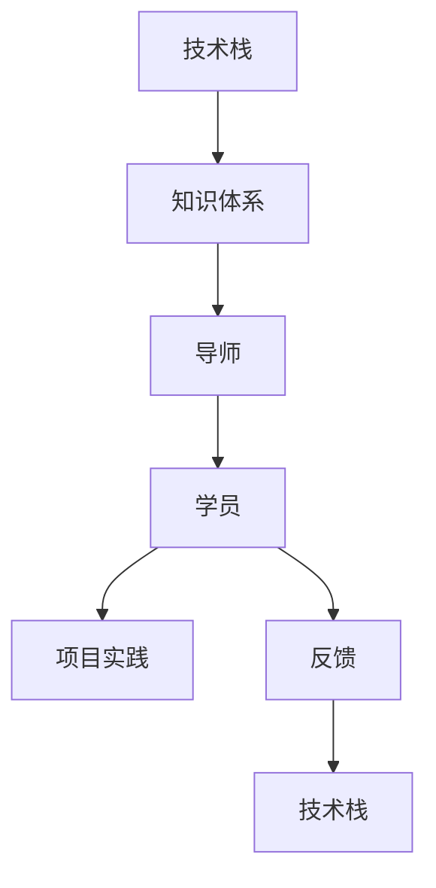

                 

# 技术mentoring：构建程序员成长加速器项目

> 关键词：技术mentoring, 程序员成长, 加速器项目, 软件开发, 技能提升, 技术栈, 职业规划

## 1. 背景介绍

### 1.1 问题由来
在当今快速发展的技术时代，软件开发从业者需要不断学习和适应新技术、新工具，才能在竞争激烈的职场中保持竞争力。然而，技术不断更新换代，开发人员往往感到学习压力巨大。为了解决这一问题，技术mentoring项目应运而生。技术mentoring旨在为开发者提供系统化的知识体系和成长路径，通过持续的指导和反馈，帮助他们提升技术能力和职业素养。

### 1.2 问题核心关键点
技术mentoring项目涉及多个核心关键点：
- **知识体系构建**：选择合适的知识体系框架，包含关键技术和概念。
- **导师与学员匹配**：挑选合适的导师，确保知识传递的高效性和匹配度。
- **交互与反馈**：通过定期的技术交流和代码评审，及时反馈和纠正学员的技术问题。
- **项目实践**：通过实际项目实践，让学员将所学知识应用到实际开发中。
- **职业规划**：提供职业发展建议，帮助学员制定个人发展目标和路径。

## 2. 核心概念与联系

### 2.1 核心概念概述

技术mentoring项目涉及多个核心概念，这些概念共同构成了其完整的体系：

- **技术栈(Technology Stack)**：指用于实现特定功能或应用的编程语言、框架、工具和库的组合。例如，Java后端、React前端、Kubernetes容器等。
- **知识体系(Knowledge Base)**：涵盖软件开发的各个方面，包括基础编程语言、数据结构与算法、数据库、设计模式、软件工程、网络安全等。
- **导师(Mentor)**：拥有丰富开发经验和技术能力的专业人士，能够指导学员解决技术问题，提供职业建议。
- **学员(Learner)**：希望通过技术mentoring提升技能和职业素养的软件开发者。
- **项目实践(Project Practice)**：通过实际开发项目，让学员将理论知识转化为实践经验。
- **反馈(Feedback)**：导师和学员之间的交流，包括代码评审、技术讨论、职业规划等，帮助学员不断改进。

这些概念之间的逻辑关系可以通过以下Mermaid流程图来展示：



这个流程图展示出了技术mentoring项目的基本流程：

1. 通过技术栈和知识体系的学习，构建起基础的编程能力和开发思路。
2. 配备合适的导师，为学员提供个性化的指导和反馈。
3. 学员在导师指导下，通过项目实践应用所学知识。
4. 在项目实践中，学员不断接受反馈，优化技术能力。
5. 最终，学员的能力和技术栈得到提升，准备迎接新的挑战。

## 3. 核心算法原理 & 具体操作步骤
### 3.1 算法原理概述

技术mentoring项目的主要算法原理是基于反馈循环的持续学习模型。其核心思想是通过导师与学员之间的持续交互，不断调整和优化学员的学习路径和技术能力。这种模型可以近似表示为：

$$
\text{学员能力提升} = f(\text{知识体系}, \text{项目实践}, \text{反馈})
$$

其中，$f$ 表示一个复杂的映射函数，反映出学员能力提升的动态过程。

### 3.2 算法步骤详解

技术mentoring项目的具体操作步骤如下：

**Step 1: 确定知识体系**
- 根据目标职位和公司需求，选择合适的编程语言、框架和工具。
- 构建系统的知识体系框架，涵盖基础编程、数据结构、算法、设计模式、软件工程、网络安全等。

**Step 2: 匹配导师和学员**
- 挑选经验丰富的导师，确保导师与学员技术能力和职业规划相匹配。
- 通过面试和评估，确保导师能够为学员提供有效的指导和反馈。

**Step 3: 制定学习计划**
- 根据学员的技术水平和学习目标，制定个性化的学习计划。
- 包括基础编程语言、框架、工具的学习路径，以及项目实践和职业规划的具体安排。

**Step 4: 开展项目实践**
- 为学员提供实际项目，涵盖从需求分析到代码实现的全过程。
- 确保项目具有挑战性，能够涵盖多种技术和概念。

**Step 5: 进行技术交流和反馈**
- 定期进行技术交流会议，讨论项目进展、技术问题和职业规划。
- 通过代码评审、技术讨论等方式，及时反馈和纠正学员的技术问题。

**Step 6: 持续优化和调整**
- 根据学员的反馈和学习进展，调整学习计划和技术指导。
- 确保学员不断获得新的知识和技能，适应技术发展的最新趋势。

### 3.3 算法优缺点

技术mentoring项目具有以下优点：
1. **系统性**：通过构建完整的知识体系和学习计划，系统性地提升学员的技术能力。
2. **实践性**：通过实际项目实践，让学员将理论知识转化为实践经验。
3. **指导性**：通过导师的指导和反馈，帮助学员解决技术问题，明确职业方向。
4. **灵活性**：根据学员的学习进展和需求，灵活调整学习计划和技术指导。

同时，该方法也存在一定的局限性：
1. **时间成本高**：需要投入大量时间和精力进行系统学习，可能影响学员的日常工作。
2. **资源需求大**：需要配备经验丰富的导师，且需投入项目开发资源。
3. **匹配难度大**：找到合适的导师和学员匹配，需要时间和协调。
4. **适用性有限**：对于已有一定技术基础的开发者，可能存在重复学习的问题。

尽管存在这些局限性，但就目前而言，技术mentoring项目仍是大规模技术培训和职业发展的有效方式。未来相关研究的重点在于如何进一步优化匹配过程，降低时间和资源成本，同时兼顾个性化和系统性。

### 3.4 算法应用领域

技术mentoring项目在多个领域得到了广泛应用：

- **企业培训**：为员工提供系统化的技术培训，提升整体技术能力和团队协作。
- **职业发展**：为求职者提供职业规划和发展建议，帮助他们顺利进入目标行业。
- **开源社区**：为开源项目贡献者提供技术指导和代码评审，提升项目质量和贡献者技术水平。
- **高等教育**：为大学生和研究生提供课程设计和技术实践，帮助他们掌握现代软件开发技术。

## 4. 数学模型和公式 & 详细讲解 & 举例说明

### 4.1 数学模型构建

假设技术mentoring项目的知识体系包含 $k$ 个知识点，每个知识点 $i$ 的权重为 $w_i$。学员通过学习获得的技术能力为 $C$，项目实践的效果为 $P$，导师提供的反馈质量为 $F$。则技术能力的提升可以表示为：

$$
C = \sum_{i=1}^k w_iC_i + \alpha P + \beta F
$$

其中 $C_i$ 表示学员在知识点 $i$ 上掌握的能力，$\alpha$ 和 $\beta$ 是学习效率和反馈效果的系数。

### 4.2 公式推导过程

为了简化模型，我们可以将上述公式进一步简化为：

$$
C = \sum_{i=1}^k w_iC_i + P + F
$$

在实际应用中，我们可以进一步考虑学员的技术水平和学习目标，引入时间 $t$ 和迭代次数 $n$ 的变量：

$$
C = \sum_{i=1}^k w_iC_i + \alpha t^n P + \beta t^n F
$$

其中 $t$ 表示时间或迭代次数的增长因子，$\alpha$ 和 $\beta$ 分别表示时间增长和技术提升的速率。

### 4.3 案例分析与讲解

假设学员 $E$ 在知识体系 $K$ 上的初始能力为 $C_0$，导师 $M$ 提供的反馈质量为 $F_0$。通过 $n$ 次迭代，学员在 $k$ 个知识点上掌握了 $C_k$ 的技术能力。则学员最终获得的总技术能力 $C_{\text{total}}$ 可以表示为：

$$
C_{\text{total}} = C_0 + \sum_{i=1}^k w_iC_i + \alpha \sum_{n=1}^N t^n P_n + \beta \sum_{n=1}^N t^n F_n
$$

其中 $P_n$ 和 $F_n$ 分别表示第 $n$ 次迭代的项目实践和反馈效果。

通过上述公式，我们可以看到，技术能力的提升不仅取决于知识体系的学习，还受到项目实践和反馈效果的显著影响。因此，技术mentoring项目需要全面考虑这三个因素，以确保学员能够获得最佳的学习效果。

## 5. 项目实践：代码实例和详细解释说明

### 5.1 开发环境搭建

在进行技术mentoring项目实践前，我们需要准备好开发环境。以下是使用Python进行PyTorch开发的环境配置流程：

1. 安装Anaconda：从官网下载并安装Anaconda，用于创建独立的Python环境。

2. 创建并激活虚拟环境：
```bash
conda create -n pytorch-env python=3.8 
conda activate pytorch-env
```

3. 安装PyTorch：根据CUDA版本，从官网获取对应的安装命令。例如：
```bash
conda install pytorch torchvision torchaudio cudatoolkit=11.1 -c pytorch -c conda-forge
```

4. 安装各类工具包：
```bash
pip install numpy pandas scikit-learn matplotlib tqdm jupyter notebook ipython
```

完成上述步骤后，即可在`pytorch-env`环境中开始项目实践。

### 5.2 源代码详细实现

这里我们以构建一个基础的Web应用为例，展示技术mentoring项目的具体实现过程。

首先，定义基本的Web框架：

```python
from flask import Flask, request, jsonify

app = Flask(__name__)

@app.route('/', methods=['GET', 'POST'])
def index():
    if request.method == 'POST':
        # 处理请求
        return jsonify({'message': '处理成功'})
    else:
        # 显示欢迎页面
        return '欢迎访问Web应用！'

if __name__ == '__main__':
    app.run(debug=True)
```

然后，通过Flask提供简单的Web接口，处理HTTP请求：

```python
from flask import Flask, request, jsonify

app = Flask(__name__)

@app.route('/api/hello', methods=['GET'])
def hello():
    return jsonify({'message': 'Hello, world!'})

@app.route('/api/calculate', methods=['POST'])
def calculate():
    data = request.json
    result = data['x'] + data['y']
    return jsonify({'result': result})

if __name__ == '__main__':
    app.run(debug=True)
```

最后，运行应用程序并访问：

```bash
python app.py
```

在浏览器中访问 `http://localhost:5000`，可以看到基本的Web应用示例。

### 5.3 代码解读与分析

让我们再详细解读一下关键代码的实现细节：

**Flask框架**：
- `Flask` 是一个轻量级的Web应用框架，易于上手且功能丰富。
- `@app.route` 装饰器用于定义路由和处理HTTP请求。
- `request` 对象用于获取请求信息，`jsonify` 用于将Python字典转换为JSON格式的响应。

**HTTP请求处理**：
- 通过 `@app.route` 定义 `/` 路由，处理GET请求并返回欢迎页面。
- 通过 `@app.route` 定义 `/api/hello` 和 `/api/calculate` 路由，处理HTTP请求并返回JSON格式的响应。

**运行和访问**：
- 使用 `python app.py` 运行Flask应用，通过 `http://localhost:5000` 访问Web页面。

可以看到，Flask框架提供了强大的Web开发能力，使得Web应用的开发和部署变得简单高效。在技术mentoring项目中，学员可以通过类似这样的项目实践，快速掌握Web开发的基本概念和技术栈。

当然，工业级的系统实现还需考虑更多因素，如数据库集成、安全性、部署架构等。但核心的技术 mentoring范式基本与此类似。

## 6. 实际应用场景

### 6.1 企业内部培训

技术mentoring项目在企业内部培训中得到了广泛应用。通过系统化的技术培训和职业规划，企业可以快速提升员工的技术能力，增强团队协作，提升整体技术水平。

在实践过程中，企业可以根据具体需求，设计定制化的技术栈和知识体系，确保培训内容与实际工作紧密结合。通过导师的指导和反馈，帮助员工不断改进，快速适应新的技术要求。

### 6.2 高校教育

技术mentoring项目在大学教育中同样具有重要价值。通过与企业合作，高校可以为学生提供行业前沿的技术培训，帮助他们掌握现代软件开发技术，增强就业竞争力。

在教学过程中，教师可以通过项目实践，引导学生应用所学知识，解决实际问题。通过导师的指导和反馈，帮助学生不断优化技术能力，为未来的职业发展奠定坚实基础。

### 6.3 开源社区贡献

技术mentoring项目在开源社区中也有广泛的应用。通过技术指导和代码评审，社区贡献者可以快速掌握最新技术，提升项目质量，增强社区活力。

在实践中，导师可以针对项目中的技术问题，提供专业的指导和解决方案。通过代码评审和反馈，帮助贡献者不断改进代码质量，提升项目整体水平。

### 6.4 职业发展规划

技术mentoring项目还可以为求职者提供职业发展规划。通过系统的技术培训和职业指导，帮助他们明确职业目标，提升职业素养，顺利进入目标行业。

在指导过程中，导师可以根据求职者的兴趣和能力，提供个性化的职业建议和规划。通过项目实践和职业指导，帮助他们全面提升技术能力和职业素养，为未来的职业生涯打下坚实基础。

## 7. 工具和资源推荐

### 7.1 学习资源推荐

为了帮助开发者系统掌握技术mentoring的理论基础和实践技巧，这里推荐一些优质的学习资源：

1. **《Flask Web开发实战》**：系统介绍Flask框架的使用和项目实践，适合初学者和进阶开发者。
2. **《Python网络编程》**：讲解Python在网络编程中的应用，涵盖HTTP请求、RESTful API等核心概念。
3. **《软件设计模式》**：系统介绍常用的设计模式及其应用场景，提升软件设计能力。
4. **《深入理解计算机系统》**：讲解计算机系统的基础知识和原理，提升系统设计和性能调优能力。
5. **Coursera《Python for Data Science》课程**：介绍Python在数据科学中的应用，涵盖数据处理、机器学习等技术。

通过对这些资源的学习实践，相信你一定能够快速掌握技术mentoring的核心思想和实践方法。

### 7.2 开发工具推荐

高效的开发离不开优秀的工具支持。以下是几款用于技术mentoring项目开发的常用工具：

1. **PyTorch**：基于Python的开源深度学习框架，灵活动态的计算图，适合快速迭代研究。
2. **Flask**：轻量级的Web框架，易于上手且功能丰富，适合开发Web应用。
3. **Jupyter Notebook**：强大的交互式开发环境，支持代码编写、数据处理和可视化。
4. **Git**：版本控制工具，支持多人协作开发和项目管理。
5. **Docker**：容器化部署工具，方便应用在不同环境下的快速部署和迁移。

合理利用这些工具，可以显著提升技术mentoring项目的开发效率，加快创新迭代的步伐。

### 7.3 相关论文推荐

技术mentoring项目的发展源于学界的持续研究。以下是几篇奠基性的相关论文，推荐阅读：

1. **《技术传承：软件工程师之间知识传递的模型》**：讨论了技术传承的理论基础和实际应用，为技术mentoring提供了重要的理论支持。
2. **《Mentor and Mentee: A Decade of Research》**：总结了过去十年技术mentoring的研究成果，为未来研究提供了宝贵的参考。
3. **《技术传承的实践：基于协作的项目学习》**：介绍了技术传承在实际项目中的应用案例，展示了技术mentoring的实际效果。

这些论文代表了大规模技术培训和职业发展的最新研究进展，值得深入学习。

## 8. 总结：未来发展趋势与挑战

### 8.1 总结

本文对技术mentoring项目的系统介绍和实践方法进行了全面系统的讨论。首先阐述了技术mentoring项目的背景和核心关键点，明确了其系统性和实践性。其次，通过数学模型和公式，详细讲解了技术mentoring项目的算法原理和操作步骤。最后，展示了技术mentoring项目在企业培训、高校教育、开源社区贡献等方面的广泛应用。

通过本文的系统梳理，可以看到，技术mentoring项目在提升软件开发人员的技术能力和职业素养方面具有重要价值。其系统性、实践性和指导性，使得技术培训和职业发展变得更加高效和科学。未来，技术mentoring项目需要在技术栈匹配、导师和学员匹配等方面进一步优化，以应对快速发展的技术环境和实际需求。

### 8.2 未来发展趋势

展望未来，技术mentoring项目的发展趋势如下：

1. **自动化和智能化**：通过AI技术，实现技术培训和职业规划的自动化和智能化，提升培训效率和效果。
2. **实时反馈和调整**：通过实时数据分析和反馈机制，动态调整技术培训和学习计划，适应学员的学习进展。
3. **跨平台和跨语言**：实现技术培训和职业规划的跨平台和跨语言支持，提升培训的普适性。
4. **社区化和开源化**：通过社区化和技术共享，实现技术培训和职业规划的开放式协作，提升培训的覆盖面和影响力。

以上趋势凸显了技术mentoring项目的广阔前景，为大规模技术培训和职业发展提供了新的方向。

### 8.3 面临的挑战

尽管技术mentoring项目已经取得了诸多成果，但在迈向更加智能化和普适化的过程中，仍面临诸多挑战：

1. **时间和资源成本**：技术培训和职业规划需要大量的时间和资源投入，对企业和高校等机构形成一定的压力。
2. **匹配难度大**：找到合适的导师和学员匹配，需要时间和协调，且匹配质量直接影响培训效果。
3. **适应性有限**：对于已有一定技术基础的开发者，可能存在重复学习的问题，培训内容需要更加灵活和针对化。
4. **效果评估难**：技术培训的效果评估难以量化，如何确保培训的实际效果和价值，还需要更多实证研究。

### 8.4 研究展望

面对技术mentoring项目所面临的挑战，未来的研究需要在以下几个方面寻求新的突破：

1. **个性化培训模型**：开发更加个性化和智能化的培训模型，根据学员的学习进展和需求，动态调整培训内容和进度。
2. **混合培训模式**：结合线上和线下培训模式，实现灵活高效的技术培训和职业规划。
3. **跨领域合作**：与教育机构、企业和研究机构进行跨领域合作，提升技术培训的覆盖面和影响力。
4. **技术评估体系**：建立科学的技术评估体系，量化技术培训的效果和价值，为未来研究提供参考。

这些研究方向的探索，将推动技术mentoring项目向更加智能化和普适化的方向发展，为软件开发人员的技术提升和职业发展提供更加全面和高效的支持。

## 9. 附录：常见问题与解答

**Q1：技术mentoring项目如何选择合适的导师？**

A: 选择合适的导师是技术mentoring项目成功的关键。一般而言，导师应该具备丰富的开发经验和技术能力，对目标领域有深入理解，且具有良好的沟通能力和指导经验。可以通过内部推荐、公开招聘等方式，找到合适的导师。

**Q2：学员如何准备技术mentoring项目？**

A: 学员在参与技术mentoring项目前，需要具备一定的基础知识和开发能力。一般而言，学员需要掌握基础编程语言、数据结构与算法、设计模式等核心技术。此外，学员还需要具备良好的学习态度和合作精神，积极参与项目实践和反馈交流。

**Q3：技术mentoring项目如何确保培训效果？**

A: 确保培训效果的关键在于科学的设计和系统的实施。具体措施包括：
1. 制定个性化的学习计划，涵盖基础编程、项目实践和职业规划。
2. 定期进行技术交流和反馈，及时纠正学员的技术问题。
3. 采用项目实践和代码评审等方式，确保学员在实际项目中掌握所学知识。

**Q4：技术mentoring项目如何实现技术栈匹配？**

A: 技术栈匹配是技术mentoring项目的重要环节，需要根据学员的兴趣和职业目标，选择合适的编程语言、框架和工具。具体措施包括：
1. 在项目初期进行技术栈调研，了解学员的技术背景和兴趣方向。
2. 根据学员的需求，选择合适的技术栈和知识体系，确保培训内容与实际工作紧密结合。

**Q5：技术mentoring项目如何实现跨平台和跨语言支持？**

A: 实现跨平台和跨语言支持，需要采用通用化和标准化的开发工具和框架，确保培训内容在不同平台和语言之间的迁移和应用。具体措施包括：
1. 选择通用化和标准化的开发工具和框架，如Flask、Django、Python等。
2. 确保培训内容涵盖多种编程语言和技术栈，提升培训的普适性。

通过这些措施，技术mentoring项目可以更好地适应实际需求，提升培训效果和覆盖面。

---

作者：禅与计算机程序设计艺术 / Zen and the Art of Computer Programming

