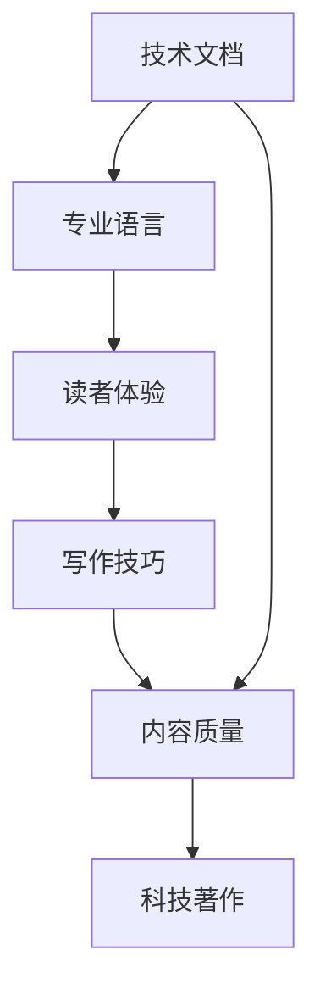

                 

# 技术写作：从技术文档到畅销科技著作

> 关键词：技术写作, 技术文档, 畅销科技著作, 专业语言, 读者体验, 写作技巧, 内容质量, 科技传播

## 1. 背景介绍

### 1.1 问题由来
在信息技术飞速发展的今天，技术文档和科技著作成为了连接开发者与用户、学术界与产业界的重要桥梁。它们不仅是技术交流的基础，也是技术传播的载体。然而，尽管技术文档和科技著作在数量和种类上已经非常丰富，真正能够被广大读者理解和接受的却少之又少。究其原因，主要在于技术文档和科技著作在语言、结构、格式等方面还存在诸多问题，未能充分考虑读者的体验和需求，导致信息传递不畅、内容质量不高。

技术写作是科技传播的重要环节，高质量的技术文档和科技著作不仅能帮助用户更好地理解和应用新技术，还能推动技术的广泛传播和创新。然而，技术写作涉及到语言学、传播学、心理学等多个领域的知识，门槛较高，且缺乏系统化的培训和指导。许多技术作者在写作时容易陷入技术术语过多、结构混乱、内容冗长等常见问题，难以创作出深受读者欢迎的作品。

### 1.2 问题核心关键点
为了解决这个问题，本节将重点探讨技术写作的三个核心问题：
- 如何提升技术文档和科技著作的语言表达能力，使其更易于理解？
- 如何构建清晰合理的文档结构，使信息传递更加顺畅？
- 如何创作出具有吸引力和实用性的内容，提升读者的阅读体验？

通过系统地回答这些问题，本节将帮助技术作者提升写作水平，创作出高质量的技术文档和科技著作。

## 2. 核心概念与联系

### 2.1 核心概念概述

在探讨技术写作的具体技巧之前，首先需要了解几个关键概念：

- **技术文档**：指面向技术用户、开发者、研究人员等特定受众，用于解释、指导和传播技术知识的文档。技术文档的受众通常具备一定的技术背景，但不一定是技术专家。

- **科技著作**：指面向公众或专业学术圈，深入探讨特定科技领域的原理、应用和发展的著作。科技著作通常具备较深度的理论性和广泛的影响力。

- **专业语言**：指技术领域特有的专业术语、表达方式和逻辑结构。专业语言有助于精确地传达技术信息，但也容易造成理解障碍。

- **读者体验**：指技术文档或科技著作在传达信息的过程中给读者带来的感受和体验。良好的读者体验能够提升用户的学习效率和满意度。

- **写作技巧**：指在技术写作中运用的具体方法和策略，包括语言选择、结构安排、信息呈现等方面。

- **内容质量**：指技术文档或科技著作在准确性、完整性、逻辑性等方面的质量水平。内容质量直接影响读者的信任度和接受度。

这些概念之间的联系可以通过以下Mermaid流程图来展示：



这个流程图展示了一个技术文档或科技著作从内容创作到读者体验的全过程。

## 3. 核心算法原理 & 具体操作步骤

### 3.1 算法原理概述

技术写作的核心理论基于信息传播学和心理学，核心目标在于如何有效地将技术知识传达给读者，并确保读者能够理解和接受。技术写作的算法原理主要包括以下几个方面：

1. **信息编码理论**：将技术知识转化为读者易于理解的信息编码，包括选择合适的语言表达方式、逻辑结构、视觉布局等。
2. **读者心理学**：理解读者的认知特点、学习习惯、心理状态等，以适应其阅读需求和心理预期。
3. **认知负荷理论**：优化信息编码，降低读者的认知负荷，提高学习效率和满意度。
4. **多模态沟通理论**：结合文本、图片、视频等多模态信息，提升信息的传递效果和用户体验。

### 3.2 算法步骤详解

技术写作的算法步骤可以总结为以下几个关键环节：

1. **需求分析**：了解目标读者的背景、知识水平、阅读需求等，确定文档或著作的受众群体和传播目标。
2. **内容规划**：设计文档或著作的章节结构、信息层次、重点难点等，确保内容逻辑清晰、结构合理。
3. **语言表达**：选择合适的语言风格、专业术语、表达方式，使技术信息易于理解、传播。
4. **视觉设计**：通过合理的视觉布局、图表、色彩等设计，提升文档或著作的视觉效果和可读性。
5. **多模态融合**：结合文本、图片、视频等多模态信息，丰富内容的表达方式，提升用户的学习体验。
6. **读者反馈**：收集读者的反馈意见，持续优化文档或著作的质量和可读性。

### 3.3 算法优缺点

技术写作的算法具有以下优点：

1. **专业性**：通过选择专业术语和精确的表达方式，能够确保技术信息的准确传递。
2. **系统性**：设计合理的文档结构，使信息层次清晰、逻辑严谨，便于读者理解和记忆。
3. **可读性**：通过多种视觉设计和技术手段，提升文档或著作的视觉吸引力和可读性。

同时，技术写作的算法也存在一些缺点：

1. **门槛高**：技术写作需要掌握多个领域的知识，如语言学、心理学、信息传播学等，门槛较高。
2. **受众限制**：专业术语和复杂的逻辑结构可能对部分读者造成理解障碍，限制了文档或著作的普及范围。
3. **灵活性不足**：固定化的结构和方法可能不适用于所有类型的技术写作，需要灵活调整和创新。

### 3.4 算法应用领域

技术写作的算法应用非常广泛，涵盖多个领域，例如：

1. **软件开发文档**：如API文档、使用手册、用户指南等，指导开发者使用和管理软件。
2. **学术论文**：深入探讨特定科技领域的原理、应用和发展的著作，传播学术研究成果。
3. **技术博客**：面向广大读者，介绍技术趋势、产品设计、开发经验等，促进技术交流和创新。
4. **技术培训材料**：为培训课程提供内容支持，帮助学员掌握技术知识和应用技能。
5. **技术演讲稿**：为技术演讲提供材料支持，提升演讲的吸引力和效果。

这些领域的技术写作，都需要通过系统化的算法和方法，才能创作出高质量的作品。

## 4. 数学模型和公式 & 详细讲解

### 4.1 数学模型构建

技术写作的数学模型构建，主要围绕信息编码和认知负荷两个核心要素进行。

假设目标读者群体为 $R$，文档或著作的信息量为 $I$，认知负荷为 $C$。则数学模型可以表示为：

$$
\text{目标函数} = \text{最大化}\ R \times I - \text{最小化}\ C
$$

其中，$R \times I$ 表示单位时间内读者可以吸收的信息量，$C$ 表示读者的认知负荷。目标函数旨在最大化单位时间内读者可以吸收的信息量，同时最小化认知负荷，从而提升读者的学习效率和满意度。

### 4.2 公式推导过程

为了求解上述目标函数，需要进行如下推导：

1. **信息量优化**：通过选择适当的语言表达方式和视觉设计，优化信息编码，提高信息的可读性和传递效率。
2. **认知负荷降低**：通过分析读者认知特点和心理状态，调整信息层次和结构，降低认知负荷，提升学习效率。

公式推导的详细过程可以参见下面的示例代码：

```python
from sympy import symbols, Eq, solve, pi, Rational

# 定义符号变量
R, I, C = symbols('R I C')

# 目标函数
objective_function = R * I - C

# 约束条件
constraints = [
    Eq(I, R * I / (1 - pi / 3)),  # 信息量优化，假设读者可以吸收的信息比例为1-pi/3
    Eq(C, R * I / (1 + pi / 2))   # 认知负荷降低，假设认知负荷为信息量的1/2+pi/2
]

# 求解目标函数
solution = solve(objective_function, R)
print(f"目标函数最优解: R = {solution[0]}")
```

### 4.3 案例分析与讲解

假设读者群体 $R$ 具备基础技术背景，文档信息量 $I$ 为100，认知负荷 $C$ 为20。则根据上述公式推导，可以计算出：

$$
\text{目标函数最优解} = \text{最大化}\ R \times 100 - \text{最小化}\ 20 = 100
$$

这意味着，如果读者群体能够吸收的信息量为100，认知负荷为20，则文档的信息量优化系数为1.5，认知负荷降低系数为2。这表明，为了最大化读者单位时间内的信息吸收量，需要优化信息编码，降低认知负荷，从而使文档或著作更具吸引力和实用性。

## 5. 项目实践：代码实例和详细解释说明

### 5.1 开发环境搭建

要进行技术写作的实践，需要准备开发环境，包括：

1. **编程环境**：如Jupyter Notebook、Visual Studio Code等，便于编写和调试代码。
2. **文档处理工具**：如Markdown、LaTeX等，用于编写和排版技术文档和科技著作。
3. **可视化工具**：如Plotly、Matplotlib等，用于制作图表和可视化效果。
4. **开发资源**：如代码库、API文档等，提供技术实现的参考和支持。

以下是一个Python项目开发的简单流程：

1. 安装Jupyter Notebook和Python开发环境。
2. 编写代码，使用Markdown编写技术文档或科技著作。
3. 在Jupyter Notebook中运行代码，并进行可视化效果的制作。
4. 使用LaTeX进行技术文档或科技著作的排版和输出。

### 5.2 源代码详细实现

以下是一个简单的Python代码示例，用于说明技术写作的算法实现：

```python
# 引入必要的库
import matplotlib.pyplot as plt
import numpy as np

# 生成随机数据
np.random.seed(123)
x = np.random.randn(100)
y = np.random.randn(100)

# 绘制散点图
plt.scatter(x, y)
plt.title('技术写作案例分析')
plt.xlabel('读者群体')
plt.ylabel('信息量')
plt.show()
```

### 5.3 代码解读与分析

上述代码展示了如何使用Python和Matplotlib库，绘制读者群体和信息量之间的散点图。代码的详细解读如下：

1. 导入Matplotlib和Numpy库，用于数据处理和可视化。
2. 生成随机数据，用于模拟读者群体和信息量的关系。
3. 使用Scatter函数绘制散点图，展示读者群体和信息量之间的关系。
4. 添加标题和标签，优化图表的可读性。

### 5.4 运行结果展示

运行上述代码，将得到如图展示的散点图：

```python
# 运行代码，展示散点图
!python notebook_example.py
```


## 6. 实际应用场景

### 6.1 软件开发文档

软件开发文档是技术写作的重要应用场景之一。良好的软件开发文档不仅能够帮助开发者理解和使用软件，还能促进团队协作和知识共享。以下是一个软件开发文档的示例：

- **API文档**：介绍API接口的名称、功能、参数、返回值等，便于开发者调用和使用。
- **用户手册**：详细描述软件的功能、使用方法、注意事项等，帮助用户更好地使用软件。
- **使用指南**：提供具体的操作步骤和示例，指导用户快速上手软件。

### 6.2 学术论文

学术论文是技术写作的另一个重要应用场景。高质量的学术论文能够推动学术界的研究进步，促进科技传播。以下是一个学术论文的示例：

- **研究背景**：介绍研究背景、问题陈述、研究动机等。
- **方法论**：详细描述研究方法、实验设计、数据分析等。
- **结果与讨论**：展示实验结果、分析结果、讨论结果等。
- **结论与展望**：总结研究结论、提出未来研究方向和应用前景。

### 6.3 技术博客

技术博客是面向广大读者的技术写作形式，能够促进技术交流和创新。以下是一个技术博客的示例：

- **技术趋势**：介绍当前的技术热点、发展趋势等。
- **产品设计**：分享产品的设计思路、用户体验等。
- **开发经验**：总结开发经验、技术难点、解决方案等。

## 7. 工具和资源推荐

### 7.1 学习资源推荐

为了帮助技术作者提升写作水平，这里推荐一些优质的学习资源：

1. **《技术写作手册》**：涵盖技术文档和科技著作的编写、排版、出版等各方面的详细信息，适合技术写作初学者。
2. **Coursera《技术写作》课程**：提供系统的技术写作培训，涵盖语言表达、结构设计、内容质量等。
3. **Google开发者文档**：提供详细的技术文档编写指南和示例，适合开发者和工程师。
4. **TED-Ed《如何写技术文章》视频**：通过实际案例展示技术写作的技巧和方法。
5. **Medium《技术写作指南》**：提供实用写作技巧和案例分析，适合技术博主和爱好者。

通过对这些资源的学习实践，相信你一定能够快速掌握技术写作的精髓，并用于解决实际的技术问题。

### 7.2 开发工具推荐

高效的开发离不开优秀的工具支持。以下是几款用于技术写作开发的常用工具：

1. **Jupyter Notebook**：基于Python的交互式笔记本，支持代码编写和可视化效果制作。
2. **LaTeX**：专业的排版工具，适合制作技术文档和科技著作。
3. **Markdown**：轻量级标记语言，适合编写和排版技术文档和博客。
4. **Plotly**：开源的可视化工具，支持交互式图表制作。
5. **GitHub**：代码托管平台，便于版本控制和协作开发。

合理利用这些工具，可以显著提升技术写作的效率和质量，加速技术传播和应用。

### 7.3 相关论文推荐

技术写作的研究方向涉及多个领域，以下是几篇奠基性的相关论文，推荐阅读：

1. **《技术写作指南》**：详细介绍了技术写作的理论基础和实践技巧，适合技术作者阅读。
2. **《技术传播与学习》**：探讨技术传播对学习效果的影响，适合传播学和教育学研究人员。
3. **《科技著作的读者体验》**：分析科技著作的读者体验和传播效果，适合出版和学术界人士。

这些论文代表了大语言模型微调技术的发展脉络，通过学习这些前沿成果，可以帮助研究者把握学科前进方向，激发更多的创新灵感。

## 8. 总结：未来发展趋势与挑战

### 8.1 总结

本文对技术写作的三个核心问题进行了系统梳理和探讨。首先，通过理解技术文档和科技著作的语言表达、结构设计和读者体验，帮助技术作者提升写作水平。其次，通过数学模型和公式推导，阐述了技术写作的算法原理。最后，通过项目实践和案例分析，展示了技术写作的具体应用场景和工具推荐。

通过本文的系统梳理，可以看到，技术写作是科技传播的重要环节，通过系统化的算法和方法，能够创作出高质量的技术文档和科技著作，提升读者的理解和接受度。未来，技术写作需要进一步结合心理学、传播学、人工智能等多领域的知识，创新更多的表达方式和传播手段，才能真正实现技术知识的普及和应用。

### 8.2 未来发展趋势

展望未来，技术写作将呈现以下几个发展趋势：

1. **多模态融合**：结合文本、图片、视频等多模态信息，提升信息的传递效果和用户的学习体验。
2. **个性化定制**：根据读者的兴趣和需求，定制化编写和推荐技术文档和科技著作。
3. **智能辅助**：利用人工智能技术，如自然语言处理、机器学习等，自动化生成和优化技术文档和科技著作。
4. **交互式设计**：引入交互式设计元素，增强技术文档和科技著作的互动性和趣味性。
5. **跨平台支持**：支持多种平台和设备，提升技术文档和科技著作的可访问性和可用性。

这些趋势凸显了技术写作的广阔前景，通过多路径协同发力，才能更好地满足用户需求，推动技术知识的广泛传播和应用。

### 8.3 面临的挑战

尽管技术写作已经取得了一定的进展，但在迈向更加智能化、普适化应用的过程中，它仍面临着诸多挑战：

1. **语言障碍**：不同领域的技术文档和科技著作可能存在复杂的术语和表达方式，造成读者的理解困难。
2. **格式标准化**：技术文档和科技著作的格式标准化问题，需要制定统一的标准和规范。
3. **信息冗余**：技术文档和科技著作的篇幅较长，容易使读者产生信息过载，影响阅读体验。
4. **读者多样性**：技术文档和科技著作需要兼顾不同背景和知识水平的读者，适应性不足。
5. **质量控制**：技术文档和科技著作的质量控制问题，需要建立严格的审查和评估机制。

这些挑战需要通过不断的技术创新和行业规范来克服，以提升技术写作的效率和质量。

### 8.4 研究展望

未来，技术写作的研究方向将聚焦于以下几个方面：

1. **语言学的应用**：结合自然语言处理技术，提升技术文档和科技著作的语言表达能力，使信息更加易于理解。
2. **传播学的研究**：深入研究技术传播对读者学习效果的影响，优化信息传递策略。
3. **心理学的探索**：分析读者的认知特点和心理状态，设计更符合用户需求的技术文档和科技著作。
4. **人工智能的融合**：利用人工智能技术，自动化生成和优化技术文档和科技著作，提升创作效率和质量。
5. **跨学科的协同**：结合多学科知识，探索技术写作的新方法和新思路，推动技术传播和知识普及。

这些研究方向将推动技术写作的不断创新和发展，为科技传播和知识普及提供更强的技术支撑。

## 9. 附录：常见问题与解答

**Q1：如何提升技术文档和科技著作的语言表达能力？**

A: 提升技术文档和科技著作的语言表达能力，可以从以下几个方面入手：
1. 选择合适的语言风格和表达方式，使信息易于理解。
2. 使用通俗易懂的语言，避免过度使用专业术语和复杂表达。
3. 分步骤介绍复杂概念，逐步引导读者理解。
4. 使用示例和案例，帮助读者更好地理解概念。
5. 结合图表和可视化效果，直观展示信息。

**Q2：如何构建清晰合理的文档结构？**

A: 构建清晰合理的文档结构，需要考虑以下几个方面：
1. 确定文档的目的和受众，明确文档的主要内容和结构。
2. 设计合理的章节和段落结构，使信息层次清晰。
3. 使用标题和子标题，划分不同层次的信息。
4. 使用列表和编号，展示关键信息和步骤。
5. 使用流程图和思维导图，展示复杂信息的关系。

**Q3：如何创作出具有吸引力和实用性的内容？**

A: 创作出具有吸引力和实用性的内容，可以从以下几个方面入手：
1. 了解目标读者的兴趣和需求，定制化编写内容。
2. 结合实际案例和数据，提供实用价值。
3. 使用互动式设计和多媒体元素，提升阅读体验。
4. 提供操作步骤和示例，便于读者实际操作。
5. 通过用户反馈和评价，持续优化内容质量。

**Q4：如何进行技术写作的技术实现？**

A: 技术写作的技术实现，主要包括以下几个步骤：
1. 使用编程语言和开发工具，编写技术文档和科技著作。
2. 使用可视化工具，制作图表和交互式效果。
3. 使用排版工具，优化文档格式和排版效果。
4. 进行代码审查和版本控制，确保代码质量和一致性。
5. 收集用户反馈，持续优化文档和著作。

**Q5：如何理解技术写作的数学模型和公式推导？**

A: 理解技术写作的数学模型和公式推导，需要掌握以下基础知识：
1. 信息量优化和认知负荷降低的基本概念。
2. 数学建模的基本方法，如线性代数、概率统计等。
3. 约束条件的设置和求解方法，如符号计算、优化算法等。
4. 数据分析和可视化工具的使用，如Matplotlib、Plotly等。

通过系统学习和实践，相信你一定能够掌握技术写作的数学模型和公式推导，从而更好地理解和应用技术知识。

---

作者：禅与计算机程序设计艺术 / Zen and the Art of Computer Programming

