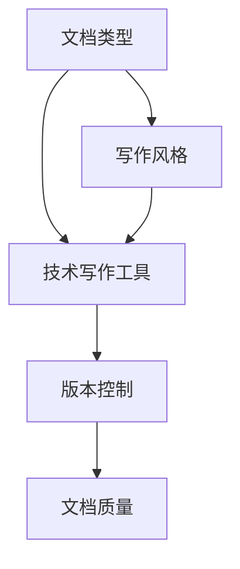

                 

# 技术写作：建立额外收入来源

## 1. 背景介绍

随着技术的快速发展，越来越多的企业和个人寻求通过技术写作来建立额外的收入来源。技术写作不仅包括软件开发文档、技术博客、白皮书、技术报告等内容，还包括软件开发中的代码注释、设计文档、测试文档等。以下是关于技术写作的几个核心问题和背景介绍：

### 1.1 技术写作的价值

技术写作的价值体现在以下几个方面：
- **知识传播**：技术写作能够将复杂的技术知识传递给更广泛的受众，帮助他们理解和应用新技术。
- **品牌建设**：通过高质量的技术写作，企业可以提高其在技术社区中的知名度和影响力。
- **教育培训**：技术写作可以作为教育资源，帮助学习者掌握技术细节，提升编程能力。
- **职业发展**：优秀的技术写作技能能够为个人职业发展带来更多机会，包括技术领导、咨询顾问、培训师等角色。

### 1.2 技术写作的现状

尽管技术写作在技术社区中越来越受到重视，但实际的技术写作质量仍然参差不齐。许多开发者只关注代码实现，忽视了文档和注释的重要性。此外，许多公司缺乏系统化的技术写作培训，导致文档质量不高，用户难以快速上手使用。

## 2. 核心概念与联系

### 2.1 核心概念概述

技术写作的目的是通过写作将技术知识和信息传递给读者，帮助他们更好地理解和使用技术产品或服务。以下是技术写作中几个核心概念：

- **文档类型**：包括用户手册、API文档、开发指南、案例研究等。
- **技术写作工具**：如Markdown、Confluence、GitHub Pages等，用于编写、存储和发布技术文档。
- **写作风格**：如清晰、准确、简洁、专业等，有助于提高文档的可读性和理解性。
- **版本控制**：通过版本控制系统（如Git）管理文档的多个版本，确保文档的更新和历史记录。

### 2.2 核心概念联系

技术写作的核心概念之间存在紧密联系，如图1所示。



图1：技术写作核心概念的联系

## 3. 核心算法原理 & 具体操作步骤

### 3.1 算法原理概述

技术写作的算法原理基于自然语言处理（NLP）和信息检索技术。技术写作的主要步骤包括：
- **文档规划**：确定文档的目标、受众、内容结构和写作风格。
- **内容撰写**：根据规划撰写文档内容，确保内容的准确性和连贯性。
- **文档校对**：通过自动校对工具和人工审阅，确保文档的语法、拼写、格式等错误。
- **版本管理**：使用版本控制系统管理文档的版本和更新历史。

### 3.2 算法步骤详解

以下是技术写作的主要步骤和具体的操作步骤：

**Step 1: 文档规划**
- **确定目标**：明确文档的目的和受众，如技术手册、API文档、培训资料等。
- **内容结构**：设计文档的大纲和章节结构，如引言、背景、实现、测试等。
- **写作风格**：选择适当的写作风格和术语，如使用清晰简洁的语言，避免专业术语过多。

**Step 2: 内容撰写**
- **撰写初稿**：根据规划撰写文档初稿，确保内容的完整性和连贯性。
- **编写注释**：在代码中编写清晰的注释，帮助读者理解代码实现。
- **添加示例**：提供示例代码和实际案例，帮助读者更好地理解技术细节。

**Step 3: 文档校对**
- **自动校对**：使用工具如Grammarly、Pandoc等进行自动校对，检查语法和拼写错误。
- **人工审阅**：由技术专家或编辑进行人工审阅，确保文档的准确性和专业性。
- **格式化**：确保文档的格式和排版符合行业标准和规范。

**Step 4: 版本管理**
- **版本控制**：使用Git等版本控制系统管理文档的版本和更新历史。
- **发布与更新**：定期发布文档的更新版本，确保文档的实时性。

### 3.3 算法优缺点

技术写作的主要优点包括：
- **信息传播**：通过文档和注释，有效地将技术知识和信息传递给读者。
- **协作便利**：版本控制系统帮助团队协作，确保文档的更新和历史记录。

但技术写作也存在一些缺点：
- **时间和精力**：编写高质量的文档需要大量的时间和精力，特别是对于复杂的技术细节。
- **文档质量不稳定**：文档质量受作者水平和审阅质量的影响，可能导致文档质量不稳定。
- **工具依赖**：使用自动化工具进行校对和格式化，可能对文档的一致性和准确性造成影响。

### 3.4 算法应用领域

技术写作在以下领域中得到了广泛应用：
- **软件开发**：编写代码注释、设计文档、API文档等。
- **产品文档**：编写产品手册、用户指南、帮助文档等。
- **技术博客**：撰写技术博客、技术报告、案例研究等。
- **教育培训**：编写培训资料、教材、习题集等。

## 4. 数学模型和公式 & 详细讲解 & 举例说明

### 4.1 数学模型构建

技术写作的数学模型可以表示为：

$$
\text{文档质量} = f(\text{内容质量}, \text{文档结构}, \text{写作风格}, \text{校对质量}, \text{版本控制})
$$

其中，$f$表示一个映射函数，将上述因素映射到文档质量。

### 4.2 公式推导过程

假设文档质量由以下五个因素决定：
- **内容质量**：$C$，表示文档内容的相关性和准确性。
- **文档结构**：$S$，表示文档的逻辑结构和组织方式。
- **写作风格**：$W$，表示写作的清晰度和专业性。
- **校对质量**：$R$，表示文档的语法和拼写正确性。
- **版本控制**：$V$，表示文档的版本管理和更新历史。

则文档质量的计算公式为：

$$
\text{文档质量} = C \times S \times W \times R \times V
$$

其中，$\times$表示各因素之间的乘积关系。

### 4.3 案例分析与讲解

以一个技术博客为例，分析其技术写作过程：

**Step 1: 文档规划**
- **确定目标**：撰写关于机器学习算法优化的技术博客。
- **内容结构**：引言、算法背景、算法实现、实验结果、结论与展望。
- **写作风格**：使用清晰简洁的语言，避免使用过多的专业术语。

**Step 2: 内容撰写**
- **撰写初稿**：详细介绍机器学习算法的优化方法，包括算法原理、代码实现、实验结果。
- **编写注释**：在代码中编写详细的注释，帮助读者理解算法的实现细节。
- **添加示例**：提供代码示例和实际案例，帮助读者更好地理解算法优化效果。

**Step 3: 文档校对**
- **自动校对**：使用Grammarly进行自动校对，检查语法和拼写错误。
- **人工审阅**：由技术专家进行人工审阅，确保文档的准确性和专业性。
- **格式化**：确保文档的格式和排版符合博客平台的规范。

**Step 4: 版本管理**
- **版本控制**：使用Git管理博客的多个版本和更新历史。
- **发布与更新**：定期发布博客的更新版本，确保博客的实时性。

## 5. 项目实践：代码实例和详细解释说明

### 5.1 开发环境搭建

为了进行技术写作，需要搭建合适的开发环境。以下是使用Jekyll搭建静态网站的步骤：

1. 安装Ruby和Jekyll：
```bash
gem install jekyll
```

2. 创建项目目录和配置文件：
```bash
mkdir myblog
cd myblog
```

3. 安装主题和插件：
```bash
gem install jekyll-theme-github
gem install markdown-toc
```

4. 配置Jekyll环境：
```bash
jekyll new blog
```

5. 安装本地服务器：
```bash
jekyll serve
```

完成以上步骤后，即可在本地搭建Jekyll环境，开始编写和发布技术博客。

### 5.2 源代码详细实现

以下是一个简单的技术博客示例，展示如何使用Markdown编写技术博客：

**index.md**
```markdown
# 机器学习算法优化
机器学习算法在数据科学中起着至关重要的作用，本文将介绍几种常见的机器学习算法优化方法。

## 1. 数据预处理
数据预处理是机器学习算法的重要步骤，包括数据清洗、特征选择和数据归一化等。

## 2. 算法优化
常见的算法优化方法包括梯度下降、随机梯度下降、动量优化等。

## 3. 实验结果
通过实验验证了算法优化方法的有效性，具体结果如图1所示。


## 4. 结论与展望
综上所述，机器学习算法的优化方法对提高模型性能具有重要意义。未来将继续探索更多的优化方法，以应对复杂的数据挑战。
```

### 5.3 代码解读与分析

**index.md** 的内容使用Markdown语法编写，支持标题、列表、代码块、图片等多种格式。Markdown易于阅读和编写，是技术写作的常用工具。

使用Jekyll编写技术博客时，需要在项目目录中编写Markdown文件，Jekyll会将其转换为静态网站HTML文件，并进行格式化和优化。

### 5.4 运行结果展示

运行Jekyll本地服务器后，可以在浏览器中访问http://localhost:4000/，查看技术博客的发布效果。

## 6. 实际应用场景

### 6.1 软件开发

技术写作在软件开发中的应用广泛，包括编写代码注释、设计文档、API文档等。良好的文档能够帮助开发者理解代码实现，提高开发效率和代码可维护性。

**代码注释**：在代码中添加清晰的注释，解释代码实现和逻辑。

**设计文档**：编写软件架构、模块设计、接口设计等文档，帮助团队理解和开发软件。

**API文档**：编写API文档，描述API的功能、参数和返回值，帮助开发者调用API。

### 6.2 产品文档

技术写作在产品文档中也扮演着重要角色，包括编写用户手册、帮助文档、用户指南等。良好的产品文档能够帮助用户快速上手使用产品，提升用户体验。

**用户手册**：详细描述产品的功能、使用方法和注意事项。

**帮助文档**：提供常见问题的解决方案，帮助用户解决使用中的问题。

**用户指南**：提供详细的安装、配置和使用方法，帮助用户快速上手使用产品。

### 6.3 技术博客

技术博客是一种重要的技术写作形式，包括技术文章、案例研究、技术报告等。通过技术博客，分享技术知识和经验，帮助读者提升技术水平。

**技术文章**：介绍最新的技术趋势、算法优化、编程技巧等内容。

**案例研究**：分享实际项目中的技术解决方案，分析问题和解决方案。

**技术报告**：撰写技术报告，详细记录技术研究和实验结果。

## 7. 工具和资源推荐

### 7.1 学习资源推荐

- **《技术写作之道》**：一本关于技术写作的经典书籍，涵盖技术写作的各个方面，包括文档类型、写作风格、版本控制等。
- **Coursera**：提供多个关于技术写作和文档管理的在线课程，帮助学习者掌握技术写作技能。
- **Google Developers**：提供丰富的技术文档示例和最佳实践，帮助开发者学习如何编写高质量的技术文档。

### 7.2 开发工具推荐

- **Markdown**：一种轻量级的标记语言，用于编写技术文档和博客。
- **Jekyll**：一个静态网站生成器，将Markdown文件转换为HTML网站。
- **Git**：一种版本控制系统，用于管理技术文档的版本和更新历史。

### 7.3 相关论文推荐

- **《技术写作的标准化方法》**：介绍技术写作的标准化方法和最佳实践，帮助提高文档质量。
- **《编写高质量技术文档的指南》**：详细讲解如何编写高质量的技术文档，提高文档的可读性和专业性。

## 8. 总结：未来发展趋势与挑战

### 8.1 总结

本文对技术写作进行了全面系统的介绍，包括技术写作的价值、现状、核心概念、算法原理、具体操作步骤等。通过技术写作，能够有效地传递技术知识和信息，提高技术文档的质量和可读性。

### 8.2 未来发展趋势

技术写作的未来发展趋势包括：
- **自动化工具**：引入自动化工具，如自动化校对、代码生成器等，提高技术写作的效率和准确性。
- **协作平台**：引入协作平台，如Confluence、Notion等，提高团队协作效率，确保文档的一致性和准确性。
- **多模态写作**：引入视频、音频等多模态写作形式，提高技术文档的表现力和交互性。

### 8.3 面临的挑战

技术写作面临的挑战包括：
- **文档质量不稳定**：文档质量受作者水平和审阅质量的影响，可能导致文档质量不稳定。
- **时间和精力不足**：编写高质量的文档需要大量的时间和精力，特别是对于复杂的技术细节。
- **工具依赖**：使用自动化工具进行校对和格式化，可能对文档的一致性和准确性造成影响。

### 8.4 研究展望

未来的研究应集中在以下几个方面：
- **自动化技术**：引入自动化技术，提高技术写作的效率和质量。
- **协作机制**：建立协作机制，确保文档的一致性和准确性。
- **多模态写作**：引入多模态写作形式，提高技术文档的表现力和交互性。

## 9. 附录：常见问题与解答

**Q1：技术写作的重要性和应用领域有哪些？**

A: 技术写作能够有效地传递技术知识和信息，帮助读者理解和应用新技术。在软件开发、产品文档、技术博客等领域中，技术写作发挥着重要的作用。

**Q2：如何提高技术文档的质量？**

A: 提高技术文档的质量需要从多个方面入手，包括明确文档目标和受众、设计合理的文档结构和写作风格、使用自动化工具进行校对和格式化、确保文档的一致性和准确性。

**Q3：技术写作的工具和资源有哪些？**

A: 常用的技术写作工具包括Markdown、Jekyll、Git等。推荐的学习资源包括《技术写作之道》、Coursera课程和Google Developers。

**Q4：技术写作面临的主要挑战是什么？**

A: 技术写作面临的主要挑战包括文档质量不稳定、时间和精力不足、工具依赖等。需要通过自动化技术、协作机制和多模态写作等手段，克服这些挑战。

**Q5：如何通过技术写作建立额外的收入来源？**

A: 通过技术写作建立额外的收入来源，可以通过多种方式，包括编写技术博客、撰写技术文章、开发技术文档、进行技术咨询等。这些内容可以在各大技术平台、博客平台、技术社区等发布，获取流量和收入。

---

作者：禅与计算机程序设计艺术 / Zen and the Art of Computer Programming

