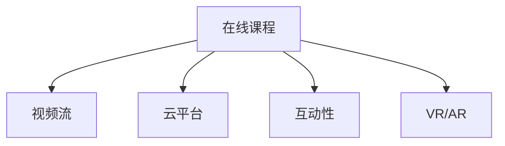

                 

# 技术分享：从线下会议到在线课程

> 关键词：在线课程,远程教育,技术分享,在线会议,视频流,云平台,互动性

## 1. 背景介绍

### 1.1 问题由来

随着数字化时代的到来，技术的快速发展和信息的瞬息万变，传统的线下会议已经无法满足现代社会的知识传播和信息交流需求。在线课程作为一种新型教育形式，逐渐成为教育领域的一大趋势。它不仅打破了时间和空间的限制，还为学习者提供了更加灵活和高效的学习方式。

### 1.2 问题核心关键点

在线课程的普及和发展，依托于技术进步和教育理念的创新。其核心关键点包括：

- **技术平台**：包括视频流传输、云平台搭建、互动性设计等。这些技术平台保证了在线课程的稳定性和互动性。
- **内容设计**：如何设计优质的课程内容，吸引并保持学习者的注意力，是在线课程成功的关键。
- **用户交互**：包括问题回答、作业提交、实时讨论等，增强学习者的参与感和体验感。
- **技术保障**：如网络稳定性、数据安全、隐私保护等，确保在线课程的顺利进行。

## 2. 核心概念与联系

### 2.1 核心概念概述

为更好地理解在线课程的技术实现，本节将介绍几个核心概念及其联系：

- **在线课程**：通过互联网平台，以视频、文本、音频等形式提供教学内容，供学习者自主学习的一种教育形式。
- **视频流**：利用网络技术实现视频的实时传输，是实现在线课程互动的基础。
- **云平台**：提供在线课程所需的计算资源和存储服务，如云服务器、数据库等。
- **互动性**：通过在线讨论、作业提交、互动答疑等方式，增强学习者的参与感和体验感。
- **虚拟现实(VR)与增强现实(AR)**：结合VR和AR技术，提供沉浸式和交互式的学习体验。

这些概念之间的关系可以通过以下Mermaid流程图来展示：



这个流程图展示了在线课程的核心概念及其之间的关系：在线课程通过视频流技术实现教学内容的传输，依托云平台提供计算和存储服务，增强互动性提升学习体验，并通过VR/AR技术提供更加丰富和沉浸式的学习体验。

## 3. 核心算法原理 & 具体操作步骤
### 3.1 算法原理概述

在线课程的技术实现涉及多个领域，包括计算机网络、云计算、多媒体技术等。其核心算法原理主要包括以下几个方面：

- **视频编解码**：对视频进行压缩和解压缩，保证视频流传输的流畅性和稳定性。
- **流媒体传输**：利用网络技术实现视频的实时传输，确保学习者能够及时获取教学内容。
- **云平台搭建**：使用云服务提供计算和存储资源，支持在线课程的运行和扩展。
- **互动技术**：通过实时聊天、作业提交、讨论区等方式增强学习者的参与感。
- **数据安全和隐私保护**：采用加密技术、访问控制等手段，保障学习者的数据安全和隐私。

### 3.2 算法步骤详解

以下是实现在线课程的核心步骤：

**Step 1: 视频流传输技术**

- **视频采集与编码**：使用摄像头或屏幕录制软件，采集教学内容。通过编解码器（如H.264、H.265等）对视频进行压缩，生成视频流。
- **流媒体服务器**：搭建流媒体服务器，接收并处理视频流，实现实时传输。

**Step 2: 云平台搭建**

- **计算资源管理**：使用云服务提供商（如AWS、阿里云、腾讯云等）提供的云服务器和存储服务，搭建在线课程的平台。
- **数据库设计**：设计数据库结构，存储用户信息、课程数据、作业提交等数据。

**Step 3: 互动技术实现**

- **实时聊天**：集成实时聊天工具（如WebRTC、SignalR等），实现教师和学生之间的实时交流。
- **作业提交与评分**：搭建作业提交系统，自动评分和反馈。
- **互动答疑**：通过问答平台（如Discord、Slack等），实现实时答疑。

**Step 4: 数据安全和隐私保护**

- **数据加密**：采用AES、RSA等加密算法，保护用户数据的安全。
- **访问控制**：实现用户登录认证、权限管理等，防止非法访问。
- **隐私保护**：采用匿名化处理、去标识化技术，保护用户隐私。

**Step 5: 用户体验优化**

- **界面设计**：设计简洁易用的用户界面，提升学习者的使用体验。
- **交互优化**：优化互动环节，提升学习者的参与感和满意度。

### 3.3 算法优缺点

在线课程技术实现了教育形式的创新，具有以下优点：

- **灵活性高**：学习者可以根据自己的时间安排进行学习，不受时间和地点的限制。
- **资源丰富**：在线课程可以提供海量的学习资源，包括视频、文本、音频等，满足不同学习者的需求。
- **互动性强**：通过实时聊天、讨论区等方式，增强学习者的参与感和体验感。

同时，该技术也存在一些缺点：

- **技术门槛高**：需要具备一定的计算机网络、云计算等技术背景。
- **网络依赖性强**：依赖稳定的网络连接，在网络不稳定的情况下，影响学习效果。
- **交互性不足**：相较于线下课程，实时互动性可能略显不足，难以形成良好的师生互动氛围。

### 3.4 算法应用领域

在线课程技术已经在教育、培训、企业内训等多个领域得到了广泛应用，具体应用场景包括：

- **高校课程**：如MOOCs（大规模在线开放课程），通过网络平台提供大量优质的教学资源。
- **企业内训**：如职业培训课程，利用在线平台进行技能培训和知识传递。
- **医疗教育**：如远程医疗课程，提供在线诊疗、护理等知识培训。
- **K-12教育**：如在线课堂，提供在线辅导、作业答疑等支持。
- **成人教育**：如职业提升课程，满足在职人士的学习需求。

这些应用场景展示了在线课程技术的强大生命力和广泛应用前景。

## 4. 数学模型和公式 & 详细讲解  
### 4.1 数学模型构建

在线课程的实现涉及到多个技术领域的数学模型，以下以视频流传输为例进行详细讲解。

假设视频流的数据率为 $R$，带宽为 $B$，帧率为 $f$，视频压缩后的比特率为 $P$，则视频流的传输速率 $T$ 可表示为：

$$
T = \frac{R}{f}
$$

其中，$R$ 为实际传输速率，$f$ 为视频帧率。在传输过程中，由于网络拥塞、延迟等因素，实际传输速率 $R$ 可能小于理论速率 $B/P$。因此，需要在传输过程中进行流量控制和拥塞控制，确保视频流传输的稳定性和流畅性。

### 4.2 公式推导过程

在视频流传输中，采用拥塞控制算法（如TCP、UDP等）调节传输速率，确保网络资源得到合理利用。常见的拥塞控制算法包括：

- **TCP拥塞控制**：采用拥塞窗口、慢启动、拥塞避免等策略，避免网络拥塞。
- **UDP无状态传输**：不保证数据传输的可靠性，但传输速度较快，适用于实时性要求高的应用。

以TCP为例，其拥塞控制算法的基本思路为：

1. 初始化拥塞窗口 $w$，并设置慢启动阈值 $ssthresh$。
2. 发送数据包，根据网络响应调整拥塞窗口 $w$。
3. 当网络响应变差时，减小拥塞窗口 $w$。
4. 当网络响应恢复正常时，增大拥塞窗口 $w$。

其中，慢启动算法在开始时逐步增大拥塞窗口 $w$，避免网络拥塞。拥塞避免算法在网络响应变差时，逐步减小拥塞窗口 $w$，防止网络崩溃。

### 4.3 案例分析与讲解

以YouTube视频流为例，其采用自适应流控制技术（AFC）实现视频的流畅传输。AFC技术根据网络状况动态调整视频流传输速率，确保用户体验。具体步骤如下：

1. 客户端向服务器发送带宽测试数据包，获取当前网络状况。
2. 服务器根据网络状况，调整视频流的传输速率。
3. 客户端根据传输速率，调整视频流的解码和显示。

通过AFC技术，YouTube能够根据网络状况动态调整视频流传输速率，避免网络拥塞，确保视频的流畅传输。

## 5. 项目实践：代码实例和详细解释说明
### 5.1 开发环境搭建

在进行在线课程开发前，我们需要准备好开发环境。以下是使用Python进行Django开发的环境配置流程：

1. 安装Python：从官网下载并安装Python，并设置环境变量。
2. 安装Django：使用pip安装Django框架。
3. 安装相关库：安装所需的库（如numpy、pandas、opencv等）。
4. 搭建云服务器：选择合适的云服务提供商，搭建云服务器。
5. 配置数据库：安装数据库（如MySQL、PostgreSQL等），并配置数据库连接。

完成上述步骤后，即可在云服务器上搭建在线课程平台。

### 5.2 源代码详细实现

这里我们以视频流传输为例，展示Django框架下的代码实现。

```python
from django.http import StreamingHttpResponse
from django.views.decorators.csrf import csrf_exempt
import av

@csrf_exempt
def video_stream(request):
    video_file = open('video.mp4', 'rb')
    video = av.open(video_file)
    container = video.streams.muxed[0]
    start_time = 0
    duration = video.duration
    last_timestamp = 0

    while True:
        for stream in video.streams:
            if stream.type == container.type:
                buffer = stream.read_frame()
                if not buffer:
                    break
                timestamp = bufferpts / 1000.0
                if timestamp >= start_time:
                    yield 'video/mpeg; codecs="%s"' % container.codec.name
                    yield buffer

    video_file.close()
```

上述代码实现了对视频流的实时读取和流传输。其中，`av.open`函数用于打开视频文件，`stream.read_frame()`函数用于读取视频帧，`yield`语句用于生成视频流。

### 5.3 代码解读与分析

让我们再详细解读一下关键代码的实现细节：

**视频流传输类**：
- `video_stream`函数：定义了视频流的生成和流传输。
- `av.open`函数：打开视频文件，生成视频流。
- `stream.read_frame()`函数：读取视频帧，逐帧传输。
- `yield`语句：用于生成视频流，确保数据流传输的稳定性。

**接口实现**：
- `@csrf_exempt`装饰器：开启跨站请求伪造(CSRF)保护。
- `request`对象：接收请求数据，返回响应数据。

**视频流处理**：
- 打开视频文件，并生成视频流。
- 逐帧读取视频流，并生成流数据。
- 通过`yield`语句生成视频流，确保数据流传输的连续性和稳定性。

**视频流传输**：
- 定义视频流处理函数，实现视频流的实时传输。
- 生成视频流，并返回给客户端。

在实际应用中，需要对视频流处理函数进行优化，确保在网络不稳定的情况下，仍能保证视频流传输的流畅性。

### 5.4 运行结果展示

运行上述代码后，即可在Django的Web服务器上访问在线视频流，展示视频流的实时传输效果。

## 6. 实际应用场景
### 6.1 高校在线课程

在线课程技术已经被高校广泛应用，如MOOCs（大规模在线开放课程）。例如，斯坦福大学的CS101课程，通过Coursera平台提供，吸引了全球数万名学习者参与。MOOCs课程通过网络平台提供丰富的教学资源，满足了全球学习者的学习需求。

**应用场景**：
- 学生可以根据自己的时间安排，自主选择课程。
- 提供丰富的教学视频、文本、作业等资源。
- 通过在线平台，与教师和同学进行互动。

**技术实现**：
- 搭建流媒体服务器，提供视频流传输。
- 搭建云平台，提供计算和存储资源。
- 设计用户界面，提供简洁易用的学习体验。

### 6.2 企业内训

在线课程技术在企业内训中也得到了广泛应用。企业可以通过在线平台，提供员工技能培训和职业发展课程，提升员工的技能水平和职业素养。

**应用场景**：
- 企业内训课程，提供技能培训和知识传递。
- 通过在线平台，方便员工自主学习和参与。
- 提供作业答疑、互动讨论等支持。

**技术实现**：
- 搭建流媒体服务器，提供视频流传输。
- 搭建云平台，提供计算和存储资源。
- 设计用户界面，提供互动性强的学习体验。

### 6.3 医疗教育

在线课程技术在医疗教育中也得到了广泛应用，通过远程医疗课程，提供医疗知识培训和技能提升。

**应用场景**：
- 远程医疗课程，提供在线诊疗、护理等知识培训。
- 通过在线平台，方便医疗人员自主学习和参与。
- 提供作业答疑、互动讨论等支持。

**技术实现**：
- 搭建流媒体服务器，提供视频流传输。
- 搭建云平台，提供计算和存储资源。
- 设计用户界面，提供互动性强的学习体验。

### 6.4 未来应用展望

随着在线课程技术的不断发展，未来将呈现以下几个发展趋势：

1. **虚拟现实(VR)与增强现实(AR)**：结合VR和AR技术，提供更加丰富和沉浸式的学习体验。
2. **人工智能(AI)**：引入AI技术，实现个性化学习推荐和智能辅导，提升学习效果。
3. **区块链技术**：采用区块链技术，保障学习数据的安全和透明性，确保学习过程的公平和可信。
4. **多模态学习**：结合文本、视频、音频等多种模态数据，提供多维度的学习支持。
5. **全球化教育**：通过在线课程，实现全球化教育资源的共享和流动，促进教育公平。

这些趋势展示了在线课程技术的广阔前景，相信未来在线课程将不断扩展应用场景，为全球学习者提供更加丰富和高效的学习方式。

## 7. 工具和资源推荐
### 7.1 学习资源推荐

为了帮助开发者系统掌握在线课程的技术实现，这里推荐一些优质的学习资源：

1. **Django官方文档**：Django官方提供的详细文档，介绍了Django框架的使用和开发技巧。
2. **WebRTC官方文档**：WebRTC官方提供的详细文档，介绍了WebRTC的实现原理和API接口。
3. **云计算平台官方文档**：如AWS、阿里云、腾讯云等平台提供的详细文档，介绍了云计算资源的使用和管理。
4. **在线课程平台案例**：如Coursera、edX、Udemy等平台的开源代码，提供了在线课程平台的实现细节。
5. **视频流传输技术**：如FFmpeg、GStreamer等开源工具，提供了视频流传输的技术支持。

通过对这些资源的学习实践，相信你一定能够快速掌握在线课程的技术实现，并用于解决实际的问题。

### 7.2 开发工具推荐

高效的开发离不开优秀的工具支持。以下是几款用于在线课程开发的常用工具：

1. **Django**：Python的开源Web框架，灵活的URL路由和模板系统，适合Web应用开发。
2. **WebRTC**：WebRTC开源库，支持浏览器端的实时视频、音频传输。
3. **AWS云服务**：提供计算、存储、网络等全面的云服务，适合搭建在线课程平台。
4. **MySQL数据库**：开源关系型数据库，适合存储用户信息和课程数据。
5. **Django-RQ**：Django队列任务管理工具，支持异步任务处理，提升系统效率。

合理利用这些工具，可以显著提升在线课程开发的效率，加快创新迭代的步伐。

### 7.3 相关论文推荐

在线课程技术的不断发展源于学界的持续研究。以下是几篇奠基性的相关论文，推荐阅读：

1. **MPEG-4 AVC**：提出MPEG-4 AVC编码标准，定义了视频压缩的详细规范，为视频流传输奠定了基础。
2. **HTTP Live Streaming**：提出HTTP Live Streaming技术，通过Web标准实现视频流的实时传输，推动了在线视频的发展。
3. **WebRTC实现原理**：详细介绍WebRTC的实现原理和API接口，为实时音视频传输提供了技术支持。
4. **云计算资源管理**：研究云计算资源的优化管理方法，为在线课程平台的稳定运行提供了保障。
5. **多模态学习模型**：研究多模态数据的融合和表示方法，为在线课程的多维度学习提供了支持。

这些论文代表了大规模在线教育的发展脉络。通过学习这些前沿成果，可以帮助研究者把握学科前进方向，激发更多的创新灵感。

## 8. 总结：未来发展趋势与挑战
### 8.1 总结

本文对在线课程的技术实现进行了全面系统的介绍。首先阐述了在线课程的背景和意义，明确了在线课程技术的核心关键点。其次，从原理到实践，详细讲解了在线课程的数学模型和核心算法。最后，通过项目实践展示了在线课程的开发流程和技术实现。

通过本文的系统梳理，可以看到，在线课程技术已经实现了教育形式的创新，为全球学习者提供了更加灵活和高效的学习方式。未来在线课程技术将在多个领域得到更广泛的应用，带来更加丰富的学习体验。

### 8.2 未来发展趋势

展望未来，在线课程技术将呈现以下几个发展趋势：

1. **多模态学习**：结合文本、视频、音频等多种模态数据，提供多维度的学习支持，提升学习效果。
2. **虚拟现实(VR)与增强现实(AR)**：通过VR和AR技术，提供沉浸式和交互式的学习体验，增强学习者的参与感和体验感。
3. **人工智能(AI)**：引入AI技术，实现个性化学习推荐和智能辅导，提升学习效果。
4. **区块链技术**：采用区块链技术，保障学习数据的安全和透明性，确保学习过程的公平和可信。
5. **全球化教育**：通过在线课程，实现全球化教育资源的共享和流动，促进教育公平。

这些趋势展示了在线课程技术的广阔前景，相信未来在线课程将不断扩展应用场景，为全球学习者提供更加丰富和高效的学习方式。

### 8.3 面临的挑战

尽管在线课程技术已经取得了瞩目成就，但在迈向更加智能化、普适化应用的过程中，它仍面临着诸多挑战：

1. **技术门槛高**：需要具备一定的计算机网络、云计算等技术背景，对开发者和用户都提出了较高的要求。
2. **网络依赖性强**：依赖稳定的网络连接，在网络不稳定的情况下，影响学习效果。
3. **互动性不足**：相较于线下课程，实时互动性可能略显不足，难以形成良好的师生互动氛围。
4. **数据安全和隐私保护**：在线课程涉及大量的用户数据，数据安全和隐私保护是关键问题。
5. **学习体验提升**：如何在保证技术实现的基础上，提升学习者的使用体验，增加学习者的参与感和满意度，是未来的重要课题。

### 8.4 研究展望

面对在线课程技术所面临的挑战，未来的研究需要在以下几个方面寻求新的突破：

1. **技术优化和资源管理**：开发更高效、更稳定、更安全的技术实现，提升在线课程的可用性和用户体验。
2. **多模态数据融合**：研究多模态数据的表示和融合方法，提升学习效果。
3. **智能辅导和个性化推荐**：引入AI技术，实现智能辅导和个性化推荐，提升学习效果。
4. **数据安全和隐私保护**：采用先进的加密和匿名化技术，保障用户数据的安全和隐私。
5. **全球化教育**：研究全球化教育资源的共享和流动机制，推动教育公平。

这些研究方向将引领在线课程技术的不断发展，为全球学习者提供更加丰富和高效的学习方式。

## 9. 附录：常见问题与解答

**Q1：在线课程技术是否适用于所有领域？**

A: 在线课程技术适用于各种教育培训领域，如高校课程、企业内训、医疗教育等。但对于一些需要高精度、高交互的场景，如实验室实验、现场操作等，在线课程仍有一定的局限性。

**Q2：在线课程技术是否会影响学习效果？**

A: 在线课程技术能够提供丰富的学习资源和灵活的学习方式，但学习效果受到多种因素的影响，如学习者的自律性、网络环境等。因此，选择合适的课程和合适的学习方式是关键。

**Q3：在线课程技术如何保障数据安全和隐私保护？**

A: 在线课程技术需要采用先进的加密和匿名化技术，保障用户数据的安全和隐私。同时，采用访问控制和权限管理等手段，防止非法访问和数据泄露。

**Q4：在线课程技术如何提升互动性？**

A: 在线课程技术可以通过实时聊天、作业提交、互动答疑等方式，增强学习者的参与感和体验感。同时，引入VR和AR技术，提供更加丰富和沉浸式的学习体验。

**Q5：在线课程技术如何实现个性化学习？**

A: 在线课程技术可以通过引入AI技术，实现个性化学习推荐和智能辅导，提升学习效果。同时，根据学习者的反馈和行为数据，动态调整学习内容和难度，满足不同学习者的需求。

---

作者：禅与计算机程序设计艺术 / Zen and the Art of Computer Programming

