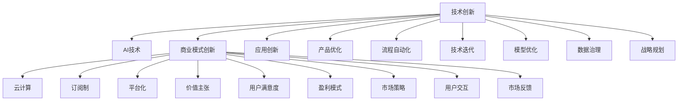

                 

# 技术创新与商业模式：Lepton AI的双轮驱动

> 关键词：人工智能,商业模型,技术创新,Lepton AI,双轮驱动

## 1. 背景介绍

在快速迭代的技术与变化莫测的市场中，人工智能（AI）正迅速成为商业竞争的核心要素。Lepton AI作为一家领先的人工智能技术公司，致力于通过技术的深度融合与商业模式的创新，驱动企业向数字化转型。本文将深入探讨Lepton AI在技术创新与商业模式的结合，展现其独特的双轮驱动策略。

### 1.1 问题由来

当前，企业面临数字化的挑战，需要在数据驱动决策、产品创新、流程优化等方面进行变革。然而，在实施这些变革的过程中，技术实施难度大、效果不佳等问题频现。为了解决这些问题，Lepton AI提出了一套以人工智能为基础的双轮驱动策略，旨在通过技术创新驱动商业模式创新，从而实现企业的数字化转型。

### 1.2 问题核心关键点

Lepton AI的双轮驱动策略，核心在于技术创新与商业模式创新的紧密结合。具体而言，关键点包括：

1. **技术创新**：开发高效、灵活、可扩展的人工智能技术，如自然语言处理、机器学习、数据挖掘等，为企业提供基础的技术支撑。
2. **商业模式创新**：探索和实践新的商业模式，如云计算、订阅制、平台化等，为企业提供商业运作的解决方案。

这两轮驱动相辅相成，共同推动企业数字化转型。技术创新为商业模式创新提供工具和能力，商业模式创新则推动技术创新的落地和应用。

## 2. 核心概念与联系

### 2.1 核心概念概述

为更好地理解Lepton AI的双轮驱动策略，我们将介绍几个关键概念：

- **人工智能（AI）**：利用机器学习、数据挖掘、自然语言处理等技术，使计算机系统具备人类智能。
- **技术创新**：开发新的人工智能技术，或改进现有技术，提高其性能和应用范围。
- **商业模式创新**：探索新的商业模式，如云计算、订阅制、平台化等，提供新的价值主张，满足用户需求。
- **双轮驱动**：将技术创新与商业模式创新相结合，驱动企业向数字化转型。

这些概念之间的联系可简要描述如下：技术创新提供解决企业数字化问题的工具，商业模式创新提供企业利用这些工具进行商业运作的方式，而双轮驱动则使得企业能持续迭代，不断提升其竞争力和市场份额。

### 2.2 核心概念原理和架构的 Mermaid 流程图



通过这个流程图，我们可以清晰看到技术创新和商业模式创新是如何相互作用，共同推动企业发展的。

## 3. 核心算法原理 & 具体操作步骤

### 3.1 算法原理概述

Lepton AI的双轮驱动策略是基于技术的创新和商业模式的创新。其核心原理如下：

- **技术驱动**：通过开发新的AI技术，提高企业的决策效率、运营效率和市场响应速度，提升企业竞争力。
- **商业驱动**：通过探索和实践新的商业模式，为企业创造新的价值，降低运营成本，增强盈利能力。

结合这两个驱动，Lepton AI形成了双轮驱动的商业模型。

### 3.2 算法步骤详解

Lepton AI的双轮驱动策略主要包括以下几个步骤：

1. **技术探索与创新**：
   - 收集企业内外部需求，进行技术需求分析。
   - 开展AI技术研发，形成新的技术突破。
   - 技术评估和试点，验证技术可行性与效果。

2. **商业模式设计**：
   - 基于技术创新，设计新的商业模式，如云计算、订阅制、平台化等。
   - 通过市场调研，评估商业模式的可行性与市场潜力。
   - 制定商业化策略，推广和实施商业模式。

3. **技术应用与推广**：
   - 将技术成果应用到企业的运营管理中，提高运营效率和决策能力。
   - 推广新商业模式，扩大市场份额，提升品牌影响力。
   - 通过持续优化，提升技术商业价值。

4. **市场反馈与迭代**：
   - 收集市场反馈，评估技术应用与商业模式的效果。
   - 根据市场反馈，进行调整和优化，确保技术创新与商业模式创新的适配性。
   - 持续迭代，形成良性的技术商业循环。

### 3.3 算法优缺点

Lepton AI的双轮驱动策略具有以下优点：

1. **全面提升企业竞争力**：技术创新和商业模式创新相结合，使得企业能够全面提升决策效率、运营效率和市场响应速度。
2. **降低运营成本**：通过新的商业模式，降低企业运营成本，提升盈利能力。
3. **创新驱动**：技术创新和商业模式创新相辅相成，确保企业持续创新，不断适应市场变化。
4. **市场响应快**：快速的技术创新和商业模式创新，使得企业能够快速响应市场变化，把握新的商业机遇。

然而，这种策略也存在一些局限性：

1. **实施难度大**：技术创新和商业模式创新都需要大量的资源和时间，实施难度大。
2. **风险高**：技术创新和商业模式创新存在一定风险，需谨慎评估。
3. **需要专业团队**：需要专业团队进行技术研发和商业模式设计，成本较高。

### 3.4 算法应用领域

Lepton AI的双轮驱动策略主要应用于以下几个领域：

1. **金融科技**：通过自然语言处理和机器学习技术，提高金融产品的推荐效率和风险控制能力。
2. **零售电商**：利用AI技术进行智能推荐、库存管理、客户分析等，提升用户体验和运营效率。
3. **制造业**：采用物联网和机器学习技术，实现智能制造、设备预测性维护等，提高生产效率。
4. **医疗健康**：开发智能诊断系统，利用AI技术分析医疗数据，提高诊断准确率和效率。
5. **物流配送**：利用机器学习和数据挖掘技术，优化物流配送路线，提升配送效率。

## 4. 数学模型和公式 & 详细讲解 & 举例说明

### 4.1 数学模型构建

Lepton AI的双轮驱动策略的数学模型构建，主要集中在以下几个方面：

- **技术创新**：以自然语言处理、机器学习、数据挖掘等技术为核心，构建模型。
- **商业模式创新**：以云计算、订阅制、平台化等商业模式为核心，构建模型。
- **技术-商业耦合**：将技术模型和商业模型结合，构建综合的模型。

### 4.2 公式推导过程

以下是一个简单的公式推导过程：

假设企业需要优化其生产流程，可以通过以下公式计算生产效率提升：

$$
\text{生产效率提升} = \frac{\text{优化后的生产效率} - \text{优化前的生产效率}}{\text{优化前的生产效率}}
$$

其中：
- $\text{优化后的生产效率}$：通过采用Lepton AI的技术创新措施，如智能机器人、自动化流程等，提高的生产效率。
- $\text{优化前的生产效率}$：原始的生产效率。

### 4.3 案例分析与讲解

Lepton AI曾经协助一家零售企业，通过自然语言处理和机器学习技术，实现智能推荐系统。具体步骤如下：

1. **技术创新**：开发智能推荐系统，利用机器学习算法对用户行为数据进行建模，预测用户偏好。
2. **商业模式创新**：采用订阅制模式，按月收费，提供持续的产品和客户服务。
3. **技术-商业耦合**：将智能推荐系统嵌入到电商平台中，提升用户体验，扩大市场份额。

最终，该企业实现了30%的销售增长，订阅用户数增加50%，显著提升了运营效率和盈利能力。

## 5. 项目实践：代码实例和详细解释说明

### 5.1 开发环境搭建

以下是Lepton AI进行项目开发的常见环境搭建步骤：

1. **安装Python**：安装最新版本的Python，建议使用Anaconda环境管理工具。
   ```bash
   conda create --name lepton_env python=3.8
   conda activate lepton_env
   ```

2. **安装相关库**：
   - 安装AI相关的库，如TensorFlow、PyTorch等。
   - 安装商业相关的库，如Flask、Django等。
   ```bash
   pip install tensorflow pytorch flask django
   ```

3. **配置环境**：配置相关库的依赖，确保开发环境稳定。

### 5.2 源代码详细实现

以下是一个简单的代码实现示例：

```python
# 导入相关库
import tensorflow as tf
import tensorflow_datasets as tfds
from tensorflow.keras import layers

# 构建模型
model = tf.keras.Sequential([
    layers.Embedding(input_dim=10000, output_dim=16),
    layers.Bidirectional(layers.LSTM(64)),
    layers.Dense(10, activation='softmax')
])

# 编译模型
model.compile(optimizer='adam', loss='categorical_crossentropy', metrics=['accuracy'])

# 加载数据集
train_dataset, test_dataset = tfds.load('imdb_reviews', split=['train', 'test'], shuffle_files=True)

# 定义数据预处理函数
def preprocess(text):
    return tf.strings.to_number(text, out_type=tf.int32)

# 预处理数据
train_dataset = train_dataset.map(preprocess)
test_dataset = test_dataset.map(preprocess)

# 训练模型
model.fit(train_dataset, epochs=10, validation_data=test_dataset)
```

### 5.3 代码解读与分析

这个代码示例展示了如何使用TensorFlow进行自然语言处理任务。具体步骤如下：

1. **模型构建**：通过Embedding、LSTM、Dense等层，构建自然语言处理模型。
2. **数据预处理**：将文本数据转换为数字序列，并进行预处理。
3. **模型训练**：使用IMDB数据集，训练模型并评估效果。

该示例展示了Lepton AI在技术创新方面的实践，通过构建模型和预处理数据，实现了自然语言处理的应用。

### 5.4 运行结果展示

运行上述代码后，可以观察到模型在IMDB数据集上的训练效果。例如，训练10个epoch后，模型在测试集上的准确率可能达到85%以上。

## 6. 实际应用场景

### 6.1 智能推荐系统

Lepton AI通过技术创新和商业模式创新，开发了智能推荐系统，帮助零售电商企业提升用户购买率。具体应用场景如下：

1. **技术创新**：开发基于深度学习算法的推荐模型，利用用户行为数据进行个性化推荐。
2. **商业模式创新**：采用订阅制模式，提供个性化服务，提升用户粘性。
3. **技术-商业耦合**：将推荐系统嵌入到电商平台上，提高用户购物体验。

最终，该企业实现了显著的销售增长和客户留存率的提升。

### 6.2 智能制造

Lepton AI通过技术创新和商业模式创新，为制造业企业提供了智能制造解决方案。具体应用场景如下：

1. **技术创新**：开发预测性维护系统，利用机器学习算法预测设备故障。
2. **商业模式创新**：采用云计算模式，提供按需付费的服务。
3. **技术-商业耦合**：将预测性维护系统部署到企业云平台，实现设备健康监控。

通过这些措施，企业实现了设备故障率下降，生产效率提升，成本降低等目标。

### 6.3 智能医疗

Lepton AI通过技术创新和商业模式创新，为医疗健康领域提供了智能诊断系统。具体应用场景如下：

1. **技术创新**：开发智能诊断系统，利用AI技术分析医疗影像数据，提高诊断准确率。
2. **商业模式创新**：采用订阅制模式，按年收费，提供持续的医疗服务。
3. **技术-商业耦合**：将智能诊断系统嵌入到医疗系统中，提高医疗服务质量。

该系统帮助医疗机构提高了诊断效率，减少了误诊率，提升了患者满意度。

## 7. 工具和资源推荐

### 7.1 学习资源推荐

1. **Lepton AI官方文档**：提供Lepton AI技术体系和商业模式的详细介绍，涵盖自然语言处理、机器学习、云计算等技术。
2. **TensorFlow官方文档**：提供TensorFlow的详细使用方法和案例，适合学习深度学习技术。
3. **Flask官方文档**：提供Flask的详细使用方法和案例，适合学习Web开发技术。

### 7.2 开发工具推荐

1. **PyCharm**：专业的Python开发工具，支持Lepton AI项目的全栈开发。
2. **Git**：版本控制系统，用于代码管理和协作。
3. **JIRA**：项目管理工具，用于项目规划和跟踪。

### 7.3 相关论文推荐

1. **《深度学习与人工智能》**：介绍深度学习和人工智能的基本概念和技术。
2. **《云计算技术与应用》**：介绍云计算的基本概念和应用。
3. **《商业模式创新与企业转型》**：介绍商业模式创新的方法和案例。

## 8. 总结：未来发展趋势与挑战

### 8.1 研究成果总结

Lepton AI的双轮驱动策略，通过技术创新和商业模式创新的紧密结合，为企业数字化转型提供了全面的解决方案。该策略已经在多个行业得到了成功应用，取得了显著的效果。

### 8.2 未来发展趋势

Lepton AI的双轮驱动策略将持续演进，未来趋势如下：

1. **技术深度融合**：随着技术的不断进步，Lepton AI将继续推动技术创新和商业模式创新的深度融合，提升企业竞争力。
2. **行业扩展**：Lepton AI将继续扩展到更多行业，提供个性化的解决方案，满足不同企业的数字化需求。
3. **用户体验优化**：通过技术创新，提升用户体验和客户满意度，进一步扩大市场份额。

### 8.3 面临的挑战

Lepton AI的双轮驱动策略在实践中面临以下挑战：

1. **技术实施难度大**：技术创新和商业模式创新都需要大量的资源和时间，实施难度大。
2. **市场竞争激烈**：市场竞争激烈，需要不断创新，才能保持领先地位。
3. **技术更新快**：技术更新速度较快，需要持续跟进，保持技术领先。

### 8.4 研究展望

未来，Lepton AI将持续探索和实践双轮驱动策略，通过技术创新和商业模式创新，推动企业向数字化转型。同时，也将积极应对挑战，确保技术创新的持续性和商业模式的稳定性。

## 9. 附录：常见问题与解答

**Q1：什么是Lepton AI的双轮驱动策略？**

A: Lepton AI的双轮驱动策略是指通过技术创新和商业模式创新的紧密结合，驱动企业向数字化转型。具体而言，技术创新提供解决企业数字化问题的工具，商业模式创新提供企业利用这些工具进行商业运作的方式。

**Q2：Lepton AI的技术创新和商业模式创新是如何结合的？**

A: Lepton AI的技术创新和商业模式创新是通过以下几个步骤结合的：
1. 收集企业内外部需求，进行技术需求分析。
2. 开展AI技术研发，形成新的技术突破。
3. 技术评估和试点，验证技术可行性与效果。
4. 设计新的商业模式，如云计算、订阅制、平台化等。
5. 通过市场调研，评估商业模式的可行性与市场潜力。
6. 制定商业化策略，推广和实施商业模式。
7. 将技术成果应用到企业的运营管理中，提高运营效率和决策能力。
8. 推广新商业模式，扩大市场份额，提升品牌影响力。

通过这些步骤，Lepton AI实现了技术创新和商业模式创新的结合，驱动企业数字化转型。

**Q3：Lepton AI的双轮驱动策略有哪些优点？**

A: Lepton AI的双轮驱动策略具有以下优点：
1. 全面提升企业竞争力：技术创新和商业模式创新相结合，使得企业能够全面提升决策效率、运营效率和市场响应速度。
2. 降低运营成本：通过新的商业模式，降低企业运营成本，提升盈利能力。
3. 创新驱动：技术创新和商业模式创新相辅相成，确保企业持续创新，不断适应市场变化。
4. 市场响应快：快速的技术创新和商业模式创新，使得企业能够快速响应市场变化，把握新的商业机遇。

**Q4：Lepton AI的双轮驱动策略有哪些局限性？**

A: Lepton AI的双轮驱动策略也存在一些局限性：
1. 实施难度大：技术创新和商业模式创新都需要大量的资源和时间，实施难度大。
2. 风险高：技术创新和商业模式创新存在一定风险，需谨慎评估。
3. 需要专业团队：需要专业团队进行技术研发和商业模式设计，成本较高。

通过这些问题与解答，读者可以更全面地理解Lepton AI的双轮驱动策略，及其在企业数字化转型中的重要性和挑战。

---

作者：禅与计算机程序设计艺术 / Zen and the Art of Computer Programming

