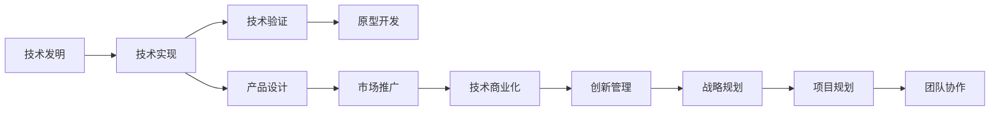

                 

# 技术创新：从发明到商业化全过程

> 关键词：技术创新, 发明过程, 商业化路径, 创新管理, 成功要素

## 1. 背景介绍

技术创新是推动经济发展和社会进步的核心驱动力。从基础研究到应用推广，技术创新的每一步都需要精心设计和管理。本文将从技术创新的不同阶段入手，系统分析从发明到商业化的全过程，以及成功实现技术创新的关键要素和战略。

### 1.1 问题由来
技术创新是所有产业升级和市场竞争力的核心要素。然而，技术从实验室走向市场，往往面临诸多挑战。从基础研究到实际应用，技术创新的路径既复杂又充满了不确定性。如何理解技术创新的全过程，合理制定战略和规划，实现技术发明到商业化的成功转型，是本文探讨的重点。

### 1.2 问题核心关键点
技术创新的核心在于如何系统地将一项创新性技术转化为可应用的商业模式和产品，实现其商业化价值。这涉及多个关键环节：从基础研究，到原型开发，再到市场推广，每个阶段都需要精细化的管理和执行策略。

- 基础研究：理解技术原理，攻克核心技术难题。
- 原型开发：设计可行的技术方案和产品原型。
- 技术验证：通过实验和测试验证技术的可行性和可靠性。
- 市场推广：制定有效的市场推广策略，实现商业化落地。

本文将从这些关键点出发，全面探讨技术创新过程的各个环节，为读者提供系统性的技术创新方法和成功案例分析。

## 2. 核心概念与联系

### 2.1 核心概念概述

为了更好地理解技术创新从发明到商业化的全过程，我们需要先对几个核心概念进行清晰的定义和理解：

- **技术创新**：指创造和应用新技术来解决现有问题或创造新价值的过程。包括基础研究、技术开发、产品设计、市场推广等环节。
- **技术发明**：指通过科学研究和技术研发，创造全新的技术产品或方法。
- **技术实现**：指将技术发明转化为实际应用的工程实践过程，包括原型开发、实验验证、产品设计等。
- **技术商业化**：指将技术实现产品化，推向市场，获取商业回报的过程。
- **创新管理**：指系统管理技术创新的各个环节，包括战略规划、项目管理、团队协作等。

这些概念之间的关系可以通过以下Mermaid流程图来展示：



这个流程图展示技术创新的主要流程和关键节点：

1. 技术发明：通过基础研究，创造新技术。
2. 技术实现：通过原型开发和技术验证，将新技术转化为可行的产品。
3. 市场推广：将产品推向市场，实现商业化。
4. 创新管理：系统管理各个环节，确保技术创新成功。

接下来，我们将在下一节详细讨论这些关键概念的原理和架构。

## 3. 核心算法原理 & 具体操作步骤
### 3.1 算法原理概述

技术创新的整个过程可以分为多个步骤，每个步骤都有其特定的算法和策略。我们将逐一介绍这些关键步骤的算法原理和具体操作步骤。

### 3.2 算法步骤详解

#### 3.2.1 基础研究

基础研究是技术创新的起点，其目标是理解和攻克技术难题，为后续的技术开发和实现提供基础。基础研究的算法包括：

- **文献调研**：通过大量阅读相关领域的研究论文，掌握最新的研究成果和技术进展。
- **技术路线设计**：根据研究目的和需求，设计可行的技术路线，明确研究目标和方向。
- **实验验证**：通过实验验证技术路线的可行性，解决技术难题。

基础研究的成功关键在于：

- 选择正确的研究方向和课题。
- 构建跨学科研究团队，汇集多领域专家知识。
- 确保研究资源的充足和高效利用。

#### 3.2.2 技术开发

技术开发是将基础研究转化为实际应用的技术方案和产品原型。技术开发的算法包括：

- **原型设计**：根据技术发明，设计可行的原型方案，并进行初步验证。
- **迭代优化**：根据原型测试结果，不断优化和改进产品设计，直至满足需求。
- **技术验证**：通过实验和测试，验证技术实现的可行性和可靠性。

技术开发的成功关键在于：

- 设计合理的技术方案，确保技术实现的可行性。
- 快速迭代和持续改进，以应对技术实现中的各种问题。
- 有效的技术验证策略，确保技术实现的可靠性。

#### 3.2.3 市场推广

市场推广是将技术实现产品化，推向市场，实现商业化的过程。市场推广的算法包括：

- **市场调研**：通过市场调研，了解市场需求和竞争态势。
- **产品定位**：根据市场需求，确定产品的定位和特点。
- **营销策略**：制定有效的市场推广策略，推动产品销售。

市场推广的成功关键在于：

- 准确的市场定位和需求理解。
- 有效的营销策略和渠道布局。
- 良好的客户关系和市场反馈机制。

### 3.3 算法优缺点

技术创新的各个步骤都有其优点和局限性。以下是对各个步骤的优缺点的详细分析：

#### 3.3.1 基础研究的优点和局限性

**优点**：

- 创新性强，能够产生具有突破性的新技术。
- 目标明确，能够攻克关键技术难题。

**局限性**：

- 投入成本高，需要大量的时间和资源。
- 风险高，成果不一定能够转化为实际应用。

#### 3.3.2 技术开发的优点和局限性

**优点**：

- 结合基础研究，将理论转化为实际应用。
- 快速迭代，能够及时发现和解决问题。

**局限性**：

- 需要跨学科合作，协调难度大。
- 技术验证过程繁琐，周期长。

#### 3.3.3 市场推广的优点和局限性

**优点**：

- 产品化和技术实现相结合，能够快速推向市场。
- 通过市场反馈，不断优化和改进产品。

**局限性**：

- 市场环境变化快，需要快速响应。
- 竞争激烈，成功概率不确定。

### 3.4 算法应用领域

技术创新的各个步骤在不同应用领域中有着不同的侧重点和实践方法。以下是对几个典型应用领域的分析：

#### 3.4.1 软件技术

软件技术是技术创新中最活跃的领域之一。软件技术的创新涉及基础研究、技术开发和市场推广的各个环节。成功的软件技术创新需要：

- 基础研究：掌握前沿算法和理论。
- 技术开发：设计高效的软件架构和实现。
- 市场推广：制定有效的营销策略，推广软件产品。

#### 3.4.2 硬件技术

硬件技术的创新主要依赖于技术开发和市场推广。硬件技术的成功需要：

- 技术开发：设计高效的硬件架构和实现。
- 市场推广：结合软件应用，推动硬件产品销售。

#### 3.4.3 生物技术

生物技术的创新涉及基础研究、技术开发、市场推广和创新管理等多个环节。成功的生物技术创新需要：

- 基础研究：掌握前沿生物理论和实验方法。
- 技术开发：设计有效的生物技术方案和实验验证。
- 市场推广：结合临床应用，推广生物技术产品。
- 创新管理：系统管理各个环节，确保创新成功。

这些应用领域的成功实践，为技术创新从发明到商业化的全过程提供了宝贵的经验和借鉴。

## 4. 数学模型和公式 & 详细讲解 & 举例说明
### 4.1 数学模型构建

技术创新的各个步骤都可以通过数学模型进行分析和优化。以下是几个关键步骤的数学模型构建：

#### 4.1.1 基础研究的数学模型

基础研究的数学模型主要涉及对技术问题的建模和求解。以人工智能领域的深度学习为例，基础研究的数学模型可以表示为：

$$
\min_{\theta} \mathcal{L}(\theta) = \frac{1}{N} \sum_{i=1}^N \ell(y_i, f_\theta(x_i))
$$

其中 $\theta$ 表示模型参数，$x_i$ 为输入数据，$y_i$ 为输出标签，$f_\theta(x_i)$ 为模型预测结果，$\ell$ 为损失函数，$\mathcal{L}$ 为经验风险。通过最小化经验风险，优化模型参数，实现基础研究的成果。

#### 4.1.2 技术开发的数学模型

技术开发的数学模型主要涉及对技术方案的优化和验证。以软件开发为例，技术开发的数学模型可以表示为：

$$
\min_{\theta} \mathcal{L}(\theta) = \frac{1}{N} \sum_{i=1}^N \ell(\text{功能完备性}(\theta))
$$

其中 $\theta$ 表示软件模块或功能设计，$\text{功能完备性}(\theta)$ 表示软件模块或功能是否满足要求，$\ell$ 为损失函数，$\mathcal{L}$ 为经验风险。通过最小化经验风险，优化软件设计，实现技术开发的成果。

#### 4.1.3 市场推广的数学模型

市场推广的数学模型主要涉及对市场需求和产品销售的建模和求解。以市场营销为例，市场推广的数学模型可以表示为：

$$
\max_{\theta} \mathcal{P}(\theta) = \sum_{i=1}^N p_i \cdot \text{销售量}(\theta)
$$

其中 $\theta$ 表示营销策略，$p_i$ 表示产品特征，$\text{销售量}(\theta)$ 表示产品的销售量，$\mathcal{P}$ 为市场价值函数。通过最大化市场价值函数，制定有效的营销策略，实现市场推广的成果。

### 4.2 公式推导过程

#### 4.2.1 基础研究公式推导

以深度学习为例，基础研究中的损失函数 $\mathcal{L}$ 可以表示为交叉熵损失：

$$
\mathcal{L}(\theta) = -\frac{1}{N} \sum_{i=1}^N [y_i \log \hat{y_i} + (1 - y_i) \log (1 - \hat{y_i})]
$$

其中 $y_i$ 为真实标签，$\hat{y_i}$ 为模型预测结果。

通过求解梯度 $\frac{\partial \mathcal{L}(\theta)}{\partial \theta}$，更新模型参数 $\theta$，实现最小化经验风险。

#### 4.2.2 技术开发公式推导

以软件开发为例，技术开发中的损失函数 $\mathcal{L}$ 可以表示为功能完备性损失：

$$
\mathcal{L}(\theta) = \frac{1}{N} \sum_{i=1}^N \ell(\text{功能完备性}(\theta))
$$

其中 $\ell$ 为损失函数，$\text{功能完备性}(\theta)$ 表示软件模块或功能是否满足要求。

通过求解梯度 $\frac{\partial \mathcal{L}(\theta)}{\partial \theta}$，优化软件设计，实现技术开发的成果。

#### 4.2.3 市场推广公式推导

以市场营销为例，市场推广中的市场价值函数 $\mathcal{P}$ 可以表示为销售量函数：

$$
\mathcal{P}(\theta) = \sum_{i=1}^N p_i \cdot \text{销售量}(\theta)
$$

其中 $p_i$ 表示产品特征，$\text{销售量}(\theta)$ 表示产品的销售量。

通过求解 $\frac{\partial \mathcal{P}(\theta)}{\partial \theta}$，制定有效的营销策略，实现市场推广的成果。

### 4.3 案例分析与讲解

#### 4.3.1 基础研究案例

以深度学习中的卷积神经网络（CNN）为例，基础研究中的损失函数 $\mathcal{L}$ 可以表示为交叉熵损失：

$$
\mathcal{L}(\theta) = -\frac{1}{N} \sum_{i=1}^N \sum_{j=1}^C y_{ij} \log \hat{y}_{ij}
$$

其中 $y_{ij}$ 为真实标签，$\hat{y}_{ij}$ 为模型预测结果，$C$ 为类别数。

通过求解梯度 $\frac{\partial \mathcal{L}(\theta)}{\partial \theta}$，优化模型参数 $\theta$，实现最小化经验风险。

#### 4.3.2 技术开发案例

以软件开发中的需求分析和原型设计为例，技术开发中的损失函数 $\mathcal{L}$ 可以表示为功能完备性损失：

$$
\mathcal{L}(\theta) = \frac{1}{N} \sum_{i=1}^N \ell(\text{功能完备性}(\theta))
$$

其中 $\ell$ 为损失函数，$\text{功能完备性}(\theta)$ 表示软件模块或功能是否满足要求。

通过求解梯度 $\frac{\partial \mathcal{L}(\theta)}{\partial \theta}$，优化软件设计，实现技术开发的成果。

#### 4.3.3 市场推广案例

以市场营销中的广告投放为例，市场推广中的市场价值函数 $\mathcal{P}$ 可以表示为广告收入函数：

$$
\mathcal{P}(\theta) = \sum_{i=1}^N p_i \cdot \text{广告收入}(\theta)
$$

其中 $p_i$ 表示广告特征，$\text{广告收入}(\theta)$ 表示广告收入。

通过求解 $\frac{\partial \mathcal{P}(\theta)}{\partial \theta}$，制定有效的广告策略，实现市场推广的成果。

## 5. 项目实践：代码实例和详细解释说明
### 5.1 开发环境搭建

在技术创新的过程中，开发环境搭建是基础。以下是使用Python进行基础研究和技术开发的开发环境配置流程：

1. 安装Anaconda：从官网下载并安装Anaconda，用于创建独立的Python环境。

2. 创建并激活虚拟环境：
```bash
conda create -n research-env python=3.8 
conda activate research-env
```

3. 安装必要的软件包：
```bash
pip install numpy pandas matplotlib scikit-learn tqdm
```

4. 安装深度学习框架：
```bash
conda install pytorch torchvision torchaudio -c pytorch
```

5. 安装其他常用库：
```bash
pip install torchtext tensorboard transformers
```

完成上述步骤后，即可在`research-env`环境中开始技术创新的项目实践。

### 5.2 源代码详细实现

下面我们以深度学习中的卷积神经网络（CNN）为例，给出使用PyTorch框架进行基础研究和技术开发的PyTorch代码实现。

首先，定义CNN模型：

```python
import torch
import torch.nn as nn
import torch.nn.functional as F

class CNN(nn.Module):
    def __init__(self):
        super(CNN, self).__init__()
        self.conv1 = nn.Conv2d(1, 32, 3, 1)
        self.conv2 = nn.Conv2d(32, 64, 3, 1)
        self.dropout1 = nn.Dropout2d(0.25)
        self.dropout2 = nn.Dropout2d(0.5)
        self.fc1 = nn.Linear(9216, 128)
        self.fc2 = nn.Linear(128, 10)

    def forward(self, x):
        x = self.conv1(x)
        x = F.relu(x)
        x = self.conv2(x)
        x = F.relu(x)
        x = F.max_pool2d(x, 2)
        x = self.dropout1(x)
        x = torch.flatten(x, 1)
        x = self.fc1(x)
        x = F.relu(x)
        x = self.dropout2(x)
        x = self.fc2(x)
        output = F.log_softmax(x, dim=1)
        return output
```

然后，定义损失函数和优化器：

```python
import torch.optim as optim

model = CNN()
criterion = nn.CrossEntropyLoss()
optimizer = optim.SGD(model.parameters(), lr=0.01, momentum=0.5)
```

接着，定义训练和评估函数：

```python
def train_epoch(model, dataset, batch_size, optimizer):
    model.train()
    running_loss = 0.0
    for batch_idx, (data, target) in enumerate(dataset):
        data, target = data.to(device), target.to(device)
        optimizer.zero_grad()
        output = model(data)
        loss = criterion(output, target)
        loss.backward()
        optimizer.step()
        running_loss += loss.item()
    return running_loss / len(dataset)

def evaluate(model, dataset, batch_size):
    model.eval()
    running_loss = 0.0
    with torch.no_grad():
        for batch_idx, (data, target) in enumerate(dataset):
            data, target = data.to(device), target.to(device)
            output = model(data)
            loss = criterion(output, target)
            running_loss += loss.item()
    return running_loss / len(dataset)
```

最后，启动训练流程并在测试集上评估：

```python
device = torch.device("cuda" if torch.cuda.is_available() else "cpu")
dataset = torch.utils.data.DataLoader(MNIST(train_set, batch_size=64, shuffle=True))
for epoch in range(10):
    loss = train_epoch(model, dataset, 64, optimizer)
    print(f"Epoch {epoch+1}, train loss: {loss:.3f}")
    
test_dataset = torch.utils.data.DataLoader(MNIST(test_set, batch_size=64, shuffle=False))
print(f"Epoch {epoch+1}, test loss: {evaluate(model, test_dataset, 64)}")
```

以上就是使用PyTorch框架进行深度学习基础研究和技术开发的完整代码实现。可以看到，得益于PyTorch的强大封装，我们可以用相对简洁的代码完成CNN模型的构建和训练。

### 5.3 代码解读与分析

让我们再详细解读一下关键代码的实现细节：

**CNN模型定义**：
- 使用`nn.Module`定义模型类，继承自`nn.Module`。
- 在`__init__`方法中定义了卷积层、池化层、Dropout层和全连接层。
- 在`forward`方法中实现了模型的前向传播过程。

**损失函数和优化器定义**：
- 使用`nn.CrossEntropyLoss`定义损失函数。
- 使用`torch.optim.SGD`定义优化器。

**训练和评估函数**：
- 使用`torch.utils.data.DataLoader`加载数据集，实现数据迭代。
- 在训练函数中，使用`model.train()`和`model.eval()`切换模型训练和评估状态。
- 在训练函数中，使用`optimizer.zero_grad()`清空梯度，`loss.backward()`计算梯度，`optimizer.step()`更新模型参数。
- 在评估函数中，使用`with torch.no_grad()`关闭梯度计算，以避免不必要的内存消耗。

**训练流程**：
- 在每个epoch内，先训练模型，输出平均损失。
- 在测试集上评估模型，输出平均损失。

可以看到，PyTorch框架使得深度学习的模型构建和训练变得简洁高效。开发者可以将更多精力放在模型改进和优化上，而不必过多关注底层实现细节。

当然，工业级的系统实现还需考虑更多因素，如模型的保存和部署、超参数的自动搜索、更灵活的任务适配层等。但核心的技术创新过程基本与此类似。

## 6. 实际应用场景
### 6.1 智能医疗系统

智能医疗系统通过技术创新，结合基础研究、技术开发和市场推广，实现了高效、准确的医疗诊断和治疗。

在技术创新的基础研究阶段，医学专家和数据科学家共同合作，利用大数据和先进算法，探索疾病机制和临床实践。例如，通过分析海量的电子病历和医学影像数据，发现新的疾病诊断方法。

在技术开发阶段，将基础研究成果转化为实际应用的技术方案。例如，基于深度学习，开发智能影像诊断系统，能够快速识别和分析医学影像，提供精确的诊断建议。

在市场推广阶段，将技术产品推向市场，实现商业化落地。例如，通过与医院合作，将智能诊断系统集成到医院的信息系统中，实现更高效的医疗服务。

### 6.2 自动驾驶汽车

自动驾驶汽车通过技术创新，结合基础研究、技术开发和市场推广，实现了高精度、高可靠性的自动驾驶功能。

在技术创新的基础研究阶段，车辆工程师和数据科学家共同合作，利用传感器数据和高级算法，探索自动驾驶的关键技术难题。例如，通过研究道路交通规则和车辆控制策略，发现新的自动驾驶算法。

在技术开发阶段，将基础研究成果转化为实际应用的技术方案。例如，基于深度学习和计算机视觉，开发传感器数据融合和环境感知系统，能够准确识别道路和障碍物。

在市场推广阶段，将技术产品推向市场，实现商业化落地。例如，通过与汽车制造商合作，将自动驾驶技术集成到车辆中，实现更安全的驾驶体验。

### 6.3 人工智能芯片

人工智能芯片通过技术创新，结合基础研究、技术开发和市场推广，实现了高效、低成本的计算能力。

在技术创新的基础研究阶段，电子工程师和物理学家共同合作，利用先进的材料科学和微电子工艺，探索芯片设计的关键技术难题。例如，通过研究半导体材料和电路设计，发现新的芯片架构和工艺。

在技术开发阶段，将基础研究成果转化为实际应用的技术方案。例如，基于微电子工艺和电路设计，开发高性能的AI芯片，能够高效计算深度学习模型。

在市场推广阶段，将技术产品推向市场，实现商业化落地。例如，通过与AI应用提供商合作，将高性能AI芯片集成到AI系统中，实现更快速的计算和推理。

### 6.4 未来应用展望

未来，随着技术创新的不断深入，基于基础研究和技术开发的市场推广将变得更加高效和多样化。以下是对未来技术创新应用场景的展望：

- 智能城市：结合城市规划和数据科学，开发智能交通、智能能源、智能公共安全等系统，实现高效的城市管理。
- 智能制造：结合工业互联网和人工智能，开发智能制造系统，实现高效的生产和质量控制。
- 智能农业：结合农业大数据和智能传感器，开发智能农业系统，实现高效的生产和管理。
- 智能教育：结合在线教育和人工智能，开发智能教育系统，实现个性化的教学和评估。

总之，技术创新将不断推动各行业的数字化、智能化转型，为人类社会带来更高效、更便捷的生活方式。

## 7. 工具和资源推荐
### 7.1 学习资源推荐

为了帮助开发者系统掌握技术创新的理论基础和实践技巧，这里推荐一些优质的学习资源：

1. 《创新之路》系列书籍：由著名创新专家撰写，深入浅出地介绍了创新管理、创新策略、创新案例等前沿话题。

2. 《人工智能基础》系列课程：斯坦福大学和MIT等名校开设的人工智能课程，涵盖机器学习、深度学习、自然语言处理等基础内容。

3. 《设计思维》系列书籍：设计思维专家撰写，介绍了如何通过创新设计解决复杂问题的方法。

4. 《技术创新管理》书籍：介绍技术创新管理的各个环节，包括战略规划、项目管理、团队协作等。

5. 《创新管理工具》书籍：介绍如何利用工具和方法实现技术创新的过程，如创新地图、创新流程图等。

通过对这些资源的学习实践，相信你一定能够全面掌握技术创新的全过程，并应用于解决实际问题。

### 7.2 开发工具推荐

高效的开发离不开优秀的工具支持。以下是几款用于技术创新开发的常用工具：

1. Jupyter Notebook：交互式编程环境，方便开发者编写和测试代码。

2. GitHub：代码托管平台，方便开发者版本控制、协作和共享代码。

3. Trello：项目管理工具，方便开发者跟踪任务进度和协作。

4. Slack：团队沟通工具，方便开发者实时交流和协作。

5. Zoom：视频会议工具，方便开发者远程协作和沟通。

合理利用这些工具，可以显著提升技术创新的开发效率，加快创新迭代的步伐。

### 7.3 相关论文推荐

技术创新的成功离不开前沿科学研究和实践经验的积累。以下是几篇奠基性的相关论文，推荐阅读：

1. 《从研究到实践：如何实现技术创新》：介绍技术创新从基础研究到实际应用的全过程。

2. 《人工智能：技术创新驱动社会变革》：探讨人工智能技术创新对社会的影响和未来趋势。

3. 《技术创新管理：理论与实践》：系统总结技术创新管理的理论和方法。

4. 《创新管理的挑战与机遇》：探讨技术创新管理面临的挑战和机遇，提供解决方案。

这些论文代表了大规模技术创新的研究方向。通过学习这些前沿成果，可以帮助研究者把握学科前进方向，激发更多的创新灵感。

## 8. 总结：未来发展趋势与挑战
### 8.1 总结

本文从技术创新的各个环节入手，系统探讨了技术创新从发明到商业化的全过程，分析了各环节的算法原理和具体操作步骤，提出了未来技术创新应用场景和成功要素。通过本文的系统梳理，可以看到，技术创新在推动各行各业数字化、智能化转型中的重要性，以及系统管理技术创新的关键作用。

### 8.2 未来发展趋势

未来，技术创新的趋势将更加多样化，以下是对未来技术创新发展趋势的展望：

- 跨学科融合：技术创新将越来越多地结合多学科知识，如数据科学、人工智能、经济学等。
- 技术生态系统：技术创新将更多地依赖于生态系统的协同作用，如开源社区、创业孵化器、产业联盟等。
- 数字化转型：技术创新将更多地应用到各行各业的数字化转型中，推动各行业的智能化升级。
- 伦理和安全：技术创新将更多地关注伦理和安全性，确保技术的可控性和透明度。

### 8.3 面临的挑战

尽管技术创新取得了显著成果，但在迈向更加智能化、普适化应用的过程中，仍面临诸多挑战：

- 技术成本高昂：大规模技术创新的投入成本高，需要大量资金和资源。
- 市场竞争激烈：技术创新面临激烈的市场竞争，成功概率不确定。
- 数据隐私和安全：技术创新需要大量的数据支持，面临数据隐私和安全的挑战。
- 技术伦理问题：技术创新可能带来新的伦理问题，如算法偏见、数据滥用等。

### 8.4 研究展望

未来，技术创新研究需要在以下几个方面寻求新的突破：

- 多学科融合：将更多的学科知识引入技术创新中，如社会科学、伦理学等。
- 数据隐私保护：研究数据隐私保护技术，确保数据使用的合法性和安全性。
- 伦理道德规范：制定技术创新的伦理规范，确保技术创新的可控性和透明性。
- 创新生态建设：构建更加开放、合作的技术创新生态系统，促进技术创新的多样性和活力。

这些研究方向的探索，必将引领技术创新迈向更高的台阶，为构建安全、可靠、可解释、可控的智能系统铺平道路。面向未来，技术创新需要系统地结合基础研究、技术开发和市场推广，全面提升技术创新能力，推动各行各业数字化、智能化转型。

## 9. 附录：常见问题与解答

**Q1：如何理解技术创新的过程？**

A: 技术创新是一个从基础研究到实际应用的全过程，涉及多个环节，包括基础研究、技术开发、市场推广等。每个环节都有其特定的算法和策略，需要系统管理。

**Q2：技术创新的核心关键点有哪些？**

A: 技术创新的核心关键点包括基础研究、技术开发和市场推广。每个环节都有其优点和局限性，需要综合考虑。

**Q3：技术创新面临的主要挑战是什么？**

A: 技术创新面临的主要挑战包括技术成本高昂、市场竞争激烈、数据隐私和安全、技术伦理问题等。需要系统管理，确保技术创新的成功。

**Q4：未来技术创新的趋势是什么？**

A: 未来技术创新的趋势包括跨学科融合、技术生态系统、数字化转型、伦理和安全等。需要结合多学科知识，构建开放、合作的创新生态。

**Q5：如何进行技术创新的系统管理？**

A: 技术创新的系统管理需要综合考虑基础研究、技术开发和市场推广各个环节，制定合理的战略和规划。需要系统管理各个环节，确保技术创新的成功。

总之，技术创新是一个复杂的过程，需要系统管理各个环节，确保技术创新的成功。只有勇于创新、敢于突破，才能不断拓展技术创新的边界，推动各行业的数字化、智能化转型。

