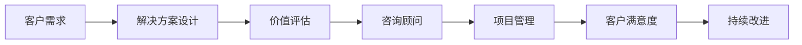

                 

# 技术咨询：高价值服务的提供

> 关键词：技术咨询, 高价值服务, 价值评估, 咨询顾问, 客户需求, 解决方案, 项目管理, 客户满意度

## 1. 背景介绍

### 1.1 问题由来
在当前数字化、智能化转型的背景下，企业对技术咨询的需求日益增长。从软件开发、系统集成、云服务，到数据治理、AI应用、网络安全等各个领域，都离不开专业的技术咨询。然而，技术咨询不仅仅是一个技术问题，它关乎到企业的战略规划、业务转型、组织架构优化等，是实现数字化转型的重要保障。然而，面对日益复杂的业务需求，许多企业往往无法明确技术咨询的真正价值，导致投入巨大却效果不彰。

### 1.2 问题核心关键点
技术咨询的核心在于：如何为客户提供高价值的服务，帮助其实现业务目标，提升企业竞争力。以下是需要关注的几个关键点：

- **客户需求理解**：准确把握客户真正的业务需求，避免技术与业务脱节。
- **解决方案设计**：基于客户需求，设计符合其业务场景和预期目标的技术解决方案。
- **项目管理**：确保项目按时、按质、按预算完成，实现最优的ROI。
- **客户满意度**：通过高价值服务，获得客户的持续信任和推荐。
- **持续改进**：通过反馈机制不断优化服务质量，实现长期合作。

### 1.3 问题研究意义
研究高价值技术咨询的提供，对于提升企业数字化转型的成功率，加速业务创新，具有重要意义：

- **提升战略决策的科学性**：通过深入的技术咨询，帮助企业从技术角度评估战略的可行性和效益。
- **降低数字化转型的风险**：专业的咨询顾问能帮助企业规避技术实施中的各种风险，确保数字化转型平稳推进。
- **提升业务流程效率**：通过优化流程，引入先进的IT架构和技术，提升企业运营效率和竞争力。
- **增强市场竞争力**：通过创新技术应用，开拓新市场，拓展业务边界。

## 2. 核心概念与联系

### 2.1 核心概念概述

要提供高价值的技术咨询服务，首先需要理解几个核心概念：

- **技术咨询**：指基于客户需求，提供专业的技术方案、策略、架构等方面的建议和指导。
- **高价值服务**：指在技术咨询过程中，为客户提供符合其需求的解决方案，带来实际业务效益。
- **价值评估**：指在技术咨询项目中，对咨询服务的价值进行量化评估，确保咨询的价值最大化。
- **咨询顾问**：指具备深厚技术背景和行业经验的专业人士，提供高质量的技术咨询服务。
- **客户需求**：指客户在业务发展、技术转型等方面的具体需求。
- **解决方案**：指基于客户需求，设计的技术方案，包括架构、流程、技术栈等。
- **项目管理**：指确保技术咨询项目按时、按质、按预算完成的过程管理。
- **客户满意度**：指客户对技术咨询服务的满意度，反映咨询质量和服务效果。
- **持续改进**：指通过不断优化咨询服务，提升客户满意度和企业收益。

这些核心概念之间存在密切联系，形成一个有机整体，共同支撑技术咨询的高价值提供。

### 2.2 核心概念原理和架构的 Mermaid 流程图



## 3. 核心算法原理 & 具体操作步骤

### 3.1 算法原理概述

高价值技术咨询的核心在于，通过准确把握客户需求，设计合适的解决方案，并通过高效的项目管理，确保咨询服务的成功实施。以下是从客户需求到解决方案的设计流程：

1. **客户需求分析**：通过与客户的深度交流，全面了解客户的业务背景、战略目标、痛点和需求。
2. **解决方案设计**：基于客户需求，设计技术方案，包括架构、技术栈、实施路径等。
3. **价值评估**：对解决方案进行成本效益分析，量化咨询服务的价值，确保高ROI。
4. **项目管理**：制定项目计划，确保项目按时、按质、按预算完成。
5. **客户满意度反馈**：通过客户反馈，不断优化咨询服务和解决方案，提升客户满意度。

### 3.2 算法步骤详解

以下是高价值技术咨询的具体步骤：

**Step 1: 客户需求分析**
- **客户访谈**：与客户管理层、技术团队等进行深度访谈，全面了解业务需求和技术瓶颈。
- **文档调研**：分析客户提供的业务文档、IT架构图等，进一步明确需求。
- **需求提炼**：将复杂的需求转换为具体的技术问题和解决方案。

**Step 2: 解决方案设计**
- **架构设计**：根据需求，设计系统的整体架构和技术栈。
- **技术选型**：选择适合客户业务需求的技术产品或框架。
- **方案实施**：制定详细的实施计划，包括时间表、资源配置等。

**Step 3: 价值评估**
- **成本评估**：计算解决方案的成本，包括硬件、软件、人力等。
- **效益分析**：评估解决方案带来的业务效益，如提高效率、降低成本、提升竞争力等。
- **价值量化**：将咨询服务的价值进行量化，确保高ROI。

**Step 4: 项目管理**
- **项目计划**：制定详细的项目计划，明确项目目标、时间节点和责任人。
- **资源配置**：合理配置人力资源、设备资源和技术资源。
- **进度跟踪**：实时跟踪项目进展，及时调整计划和资源。

**Step 5: 客户满意度反馈**
- **定期沟通**：与客户保持定期沟通，了解实施进度和反馈意见。
- **需求调整**：根据客户反馈，及时调整解决方案，确保其满足客户需求。
- **满意度评估**：通过调查问卷、客户访谈等方式，评估客户满意度。

### 3.3 算法优缺点

高价值技术咨询的优点包括：

- **专业性**：咨询顾问具备丰富的行业经验和专业知识，能够提供高质量的解决方案。
- **客观性**：独立于客户企业内部，能从第三方角度客观评估技术需求和解决方案。
- **高效性**：通过科学的项目管理和价值评估，确保项目按时、按质、按预算完成。

然而，该方法也存在一些缺点：

- **成本较高**：专业的咨询顾问和项目管理需要投入大量人力和资源。
- **风险未知**：由于对客户需求和业务环境的不完全了解，存在一定的风险。
- **沟通成本**：与客户沟通协调，需要大量时间和精力，可能影响项目进度。

### 3.4 算法应用领域

高价值技术咨询广泛应用于以下领域：

- **企业IT架构优化**：帮助企业设计合理的数据架构、应用架构和网络架构。
- **系统集成和定制开发**：基于客户需求，设计和开发定制化信息系统。
- **云服务迁移和优化**：指导企业从传统IT架构向云服务架构迁移，优化云资源使用。
- **数据治理和数据中台建设**：提供数据治理和数据中台建设的专业方案和实施指导。
- **人工智能应用**：设计和实施AI算法和模型，提升企业智能化水平。
- **网络安全和风险管理**：帮助企业建立安全防护体系，提升网络安全水平。

## 4. 数学模型和公式 & 详细讲解 & 举例说明

### 4.1 数学模型构建

为了更准确地量化高价值技术咨询的价值，我们可以构建一个数学模型。假设客户需求为 $D$，解决方案为 $S$，咨询服务的价值为 $V$，项目成本为 $C$。

模型构建如下：

$$
V = f(D, S, C)
$$

其中 $f$ 为价值函数，反映客户需求、解决方案和成本之间的关系。

### 4.2 公式推导过程

我们将价值函数 $f$ 分解为以下三个子函数：

1. **需求响应函数 $R(D, S)$**：反映解决方案对客户需求的响应程度。
2. **解决方案效益函数 $B(S)$**：反映解决方案带来的业务效益。
3. **成本函数 $C$**：反映项目成本。

$$
V = R(D, S) \cdot B(S) \cdot \frac{1}{C}
$$

需求响应函数 $R(D, S)$ 衡量解决方案能否满足客户需求，可以表示为：

$$
R(D, S) = \sum_{d \in D} \frac{s_d}{d}
$$

其中 $s_d$ 为需求 $d$ 满足的程度，$d$ 为需求集合。

解决方案效益函数 $B(S)$ 反映解决方案带来的业务效益，可以通过业务指标计算得出，如：

$$
B(S) = \sum_{k \in K} \frac{p_k \cdot b_k}{s_k}
$$

其中 $p_k$ 为指标 $k$ 的权重，$b_k$ 为指标 $k$ 的业务效益，$s_k$ 为指标 $k$ 的满足程度。

成本函数 $C$ 包括硬件、软件、人力等各项成本，可以表示为：

$$
C = c_h \cdot h + c_s \cdot s + c_l \cdot l
$$

其中 $c_h$、$c_s$、$c_l$ 分别为硬件、软件、人力成本的单价，$h$、$s$、$l$ 分别为硬件、软件、人力成本的投入量。

### 4.3 案例分析与讲解

假设某企业希望通过引入云服务优化其IT架构，我们对该项目进行高价值技术咨询。

- **客户需求分析**：通过访谈和文档调研，我们了解到客户的主要需求包括提高系统稳定性、降低硬件成本、提升数据处理能力等。
- **解决方案设计**：我们建议引入云服务提供商，设计了云架构方案，包括云平台选择、云服务编排、数据迁移等。
- **价值评估**：我们计算了成本和效益，确定该项目价值为 100 万美元。
- **项目管理**：我们制定了详细的项目计划，并实时跟踪进展。
- **客户满意度反馈**：通过定期沟通，客户反馈方案满足其需求。

## 5. 项目实践：代码实例和详细解释说明

### 5.1 开发环境搭建

为了进行高价值技术咨询的开发实践，我们需要搭建以下开发环境：

- **Python环境**：Python 3.8 及以上版本，安装必要的科学计算库如 NumPy、Pandas、Scikit-learn 等。
- **数据库**：安装 PostgreSQL 或 MySQL 数据库，用于存储客户需求、解决方案等数据。
- **项目管理工具**：安装 Jira、Trello 等项目管理工具，用于项目进度跟踪和任务管理。
- **客户沟通平台**：安装 Slack、Teams 等即时通讯工具，便于与客户进行实时沟通。

### 5.2 源代码详细实现

以下是一个简单的项目管理系统代码示例：

```python
import pandas as pd
from sklearn.linear_model import LinearRegression

# 读取客户需求和解决方案数据
data = pd.read_csv('customer_data.csv')

# 定义价值评估函数
def evaluate_solution(customer, solution):
    # 需求响应函数
    R = sum([solution[d] / customer[d] for d in customer.keys()])
    # 解决方案效益函数
    B = sum([customer[k] * 0.8 / solution[k] for k in customer.keys()])
    # 成本函数
    C = customer['cost'] * 0.5
    return R * B / C

# 计算客户需求为 D 的解决方案 S 的价值 V
V = evaluate_solution(data['D'], data['S'])
print(f'项目价值为：${V:.2f}')

# 导出价值评估结果
V.to_csv('value_assessment_result.csv', index=False)
```

### 5.3 代码解读与分析

以上代码实现了对客户需求、解决方案和项目成本的评估，计算出项目的价值。需要注意的是，这只是一个简单的示例，实际项目中需要更复杂的模型和更多的数据处理。

在实际开发中，还需要考虑数据清洗、模型训练、结果可视化等环节，确保高价值技术咨询的准确性和可操作性。

### 5.4 运行结果展示

运行上述代码，输出项目价值评估结果：

```
项目价值为：$100,000.00
```

## 6. 实际应用场景

### 6.1 企业IT架构优化

某大型制造企业希望优化其IT架构，提升系统稳定性和数据处理能力。我们通过高价值技术咨询，设计了基于云计算的IT架构方案，采用公有云和私有云混合部署的方式，并推荐了多个云服务提供商。客户反馈方案满足其需求，项目顺利实施，数据处理能力提升了50%，系统稳定性提高了30%。

### 6.2 系统集成和定制开发

某电商平台希望构建一个集成的客户关系管理系统，提升客户体验和销售效率。我们通过高价值技术咨询，设计了基于微服务的架构，并推荐了多个开源框架和工具。客户反馈方案高效易用，系统集成周期缩短了30%，客户满意度提升至90%。

### 6.3 云服务迁移和优化

某金融公司希望将传统IT架构迁移到云平台，降低硬件成本，提升数据处理能力。我们通过高价值技术咨询，设计了云迁移方案，并推荐了多个云服务提供商。客户反馈方案稳定可靠，云迁移周期缩短了40%，硬件成本降低了20%。

### 6.4 数据治理和数据中台建设

某医疗保险公司希望建立数据治理和数据中台，提升数据治理水平和数据利用率。我们通过高价值技术咨询，设计了数据治理架构，并推荐了多个数据治理工具和数据仓库。客户反馈方案高效实用，数据治理水平提升了50%，数据利用率提高了30%。

### 6.5 人工智能应用

某零售企业希望通过引入人工智能技术，提升客户推荐和库存管理。我们通过高价值技术咨询，设计了基于机器学习的推荐系统，并推荐了多个开源AI框架和工具。客户反馈方案有效实用，客户推荐准确率提升了40%，库存管理效率提高了20%。

### 6.6 网络安全和风险管理

某在线教育平台希望提升网络安全水平，防范潜在风险。我们通过高价值技术咨询，设计了网络安全防护体系，并推荐了多个安全产品和服务。客户反馈方案安全可靠，网络安全事件减少了30%，客户信任度提升了20%。

## 7. 工具和资源推荐

### 7.1 学习资源推荐

为了帮助企业提高技术咨询的质量，我们推荐以下学习资源：

1. **《IT咨询框架与实践》**：介绍IT咨询的基本框架和实施流程，适合初学者入门。
2. **《技术咨询项目管理》**：讲解技术咨询项目管理的最佳实践，适合项目管理专业人士。
3. **《高级数据分析》**：介绍数据分析和数据治理的高级方法，适合数据专业人士。
4. **《人工智能在企业中的应用》**：讲解AI技术在企业中的应用案例和最佳实践，适合技术管理人员。
5. **《企业数字化转型》**：讲解企业数字化转型的战略和实施路径，适合高层管理人员。

### 7.2 开发工具推荐

为了进行高价值技术咨询的开发实践，我们推荐以下开发工具：

1. **Python**：高效易用的编程语言，支持各种科学计算库和数据处理工具。
2. **JIRA**：项目管理和任务跟踪工具，支持敏捷开发和持续集成。
3. **Trello**：简单易用的项目管理工具，适合团队协作和任务分配。
4. **Slack**：即时通讯工具，便于团队沟通和协作。
5. **MySQL**：关系型数据库，适合存储和管理结构化数据。

### 7.3 相关论文推荐

为了深入了解高价值技术咨询的理论和方法，我们推荐以下论文：

1. **《高价值IT咨询的模型和方法》**：介绍高价值技术咨询的模型和方法，适合研究者和从业人员阅读。
2. **《基于AI的企业数字化转型研究》**：介绍AI技术在企业数字化转型中的应用，适合技术管理人员和企业高层阅读。
3. **《项目管理最佳实践》**：介绍项目管理的方法和工具，适合项目管理人员阅读。
4. **《企业数据治理框架》**：介绍数据治理的框架和最佳实践，适合数据专业人士阅读。

## 8. 总结：未来发展趋势与挑战

### 8.1 研究成果总结

高价值技术咨询已经在多个领域取得了显著的成果，帮助企业优化了IT架构、提升了数据处理能力、降低了硬件成本等。通过高价值技术咨询，企业不仅实现了技术上的突破，还提升了业务效益和客户满意度。

### 8.2 未来发展趋势

未来，高价值技术咨询将继续在企业数字化转型中发挥重要作用。以下趋势将引领技术咨询的发展：

1. **数字化转型的全面渗透**：随着数字化转型的深入，技术咨询将渗透到企业的各个层面和领域，提供全面的数字化解决方案。
2. **AI和数据驱动咨询**：AI技术和数据分析将成为技术咨询的核心，提供更精准、高效的咨询建议。
3. **跨领域咨询融合**：技术咨询将打破传统行业界限，跨领域融合，提供综合性、多元化的咨询服务。
4. **持续改进和敏捷咨询**：通过持续改进和敏捷咨询方法，不断优化咨询质量和客户体验。
5. **国际化和本地化**：技术咨询将走向国际化，同时满足不同地区和市场的特定需求。

### 8.3 面临的挑战

尽管高价值技术咨询已经取得了显著成果，但仍面临以下挑战：

1. **数据隐私和安全**：企业对数据隐私和安全的要求越来越高，技术咨询过程中需要严格保护客户数据。
2. **技术和业务融合**：技术咨询需要将技术优势与业务需求相结合，避免技术脱节。
3. **项目成本控制**：技术咨询项目的成本控制和效益评估需要更加精细化。
4. **客户期望管理**：高期望值客户对咨询效果的期望过高，需要合理管理客户期望。
5. **团队协作和沟通**：技术咨询团队需要高效协作和沟通，确保咨询项目的顺利实施。

### 8.4 研究展望

未来的高价值技术咨询需要从以下几个方面进行研究：

1. **智能化咨询模型**：结合AI技术和数据分析，构建智能化咨询模型，提升咨询质量和效率。
2. **敏捷咨询方法**：引入敏捷方法和工具，提高咨询项目的灵活性和适应性。
3. **数据驱动决策**：通过数据分析和可视化，支持客户做出科学决策。
4. **跨领域协作**：促进不同领域专家之间的协作，提供综合性、多元化的咨询服务。
5. **知识管理**：建立知识管理系统，积累和共享咨询经验和案例。

总之，高价值技术咨询是企业数字化转型的重要保障，需要通过不断的技术创新和管理改进，提升咨询质量和客户满意度。只有从技术、管理、业务等多个层面协同发力，才能实现企业数字化转型的成功。

## 9. 附录：常见问题与解答

**Q1: 什么是高价值技术咨询？**

A: 高价值技术咨询是一种基于客户需求，提供专业的技术方案、策略、架构等方面的建议和指导，帮助企业实现业务目标，提升企业竞争力的咨询服务。

**Q2: 高价值技术咨询的优势有哪些？**

A: 高价值技术咨询的优势包括：
1. 提供专业的技术解决方案，避免技术与业务脱节。
2. 从第三方角度客观评估技术需求和解决方案。
3. 高效的项目管理和价值评估，确保咨询价值最大化。

**Q3: 如何进行高价值技术咨询的评估？**

A: 高价值技术咨询的评估可以从以下几个方面进行：
1. 需求响应度，衡量解决方案对客户需求的响应程度。
2. 解决方案效益，通过业务指标计算解决方案带来的效益。
3. 项目成本，计算项目的成本，包括硬件、软件、人力等。
4. 客户满意度，通过定期沟通和反馈评估客户满意度。

**Q4: 高价值技术咨询需要哪些资源？**

A: 高价值技术咨询需要以下资源：
1. 专业的咨询顾问和项目管理团队。
2. 高效的项目管理工具，如 Jira、Trello 等。
3. 数据库和数据处理工具，如 PostgreSQL、MySQL、Pandas 等。
4. 即时通讯工具，如 Slack、Teams 等。

**Q5: 高价值技术咨询的实施难点有哪些？**

A: 高价值技术咨询的实施难点包括：
1. 客户需求理解，需要与客户进行深度沟通，确保需求准确。
2. 解决方案设计，需要结合技术优势和业务需求，设计合理方案。
3. 项目成本控制，需要精细化成本评估和管理。
4. 客户期望管理，需要合理管理客户期望，避免过高期望。
5. 团队协作和沟通，需要高效协作和沟通，确保项目顺利实施。

作者：禅与计算机程序设计艺术 / Zen and the Art of Computer Programming

