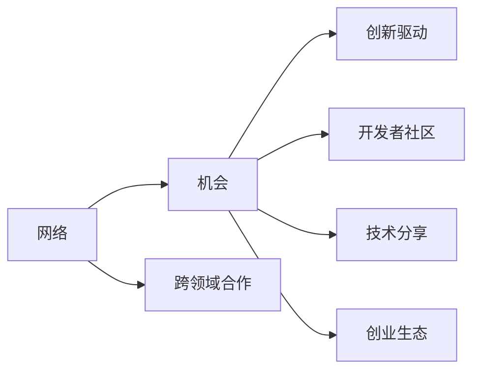

                 

# 技术大会：networking与机遇

> 关键词：技术大会, networking, 机遇, 跨领域合作, 创新驱动, 开发者社区, 技术分享, 创业生态

## 1. 背景介绍

### 1.1 问题由来
随着科技的不断进步，越来越多的技术大会在全球各地召开，它们不仅是行业内重要信息交流的平台，更是促成跨领域合作、驱动创新发展的关键场所。在技术大会上，开发者们分享自己的技术成果，展示最新的创新产品，结识来自不同行业的伙伴，共同探讨未来技术发展的趋势与方向。然而，在这样的技术盛会中，如何最大化地利用networking的机会，将潜力转化为实际的价值，成为了许多参会者关注的重要课题。

### 1.2 问题核心关键点
在本节中，我们将介绍网络、机会、跨领域合作、创新驱动、开发者社区、技术分享、创业生态等关键概念及其相互关系。通过这些概念的梳理，我们能够更好地理解技术大会上networking的重要意义，并探讨如何通过有效的networking来实现更大的机遇。

以下是一个Mermaid流程图，展示了这些概念之间的联系：



在这个图中，网络是连接各个概念的桥梁。通过网络，跨领域合作得以发生，创新驱动得以实现，开发者社区、技术分享和创业生态得以构建。因此，理解如何有效地利用网络，如何在技术大会上进行有效的networking，将有助于将这些潜在的机会转化为实际的价值。

## 2. 核心概念与联系

### 2.1 核心概念概述

在技术大会上进行有效的networking，关键在于理解以下几个核心概念：

- **网络**：指在技术大会上，开发者、研究者、投资者、企业之间形成的联系和互动。通过网络，信息得以共享，资源得以互补，合作得以建立。
- **机会**：指在技术大会上，通过networking所能带来的潜在商业机会、技术突破、合作项目等。
- **跨领域合作**：指不同行业、不同技术领域的专家之间的合作，通过知识、技术的交流融合，实现创新突破。
- **创新驱动**：指通过不断创新，推动技术进步和产业发展。技术大会是创新驱动的重要平台。
- **开发者社区**：指在技术大会上，开发者们互相交流技术心得，分享代码，构建支持创新的开发者生态。
- **技术分享**：指在技术大会上，专家们分享最新的技术成果、研究进展，促进技术交流和传播。
- **创业生态**：指在技术大会上，创业者们交流创业经验，寻找投资和合作伙伴，构建健康的创业环境。

这些概念之间相互联系，通过有效的网络建设，可以促进跨领域合作，推动创新驱动，增强开发者社区的凝聚力，促进技术分享，构建健康的创业生态。

### 2.2 核心概念原理和架构的 Mermaid 流程图

下面是一个简单的Mermaid流程图，展示了如何通过网络构建跨领域合作、创新驱动、开发者社区、技术分享、创业生态的架构：


在这个架构中，网络是基础，通过网络建立跨领域合作，促进创新驱动，构建开发者社区，进行技术分享，最终形成健康的创业生态。每个环节都是互相关联、相互促进的。

## 3. 核心算法原理 & 具体操作步骤

### 3.1 算法原理概述

在技术大会上进行有效的networking，本质上是一个多目标优化问题。目标是通过构建有效的网络，最大化地利用各种机会，实现跨领域合作、创新驱动、构建开发者社区、促进技术分享、构建健康的创业生态。

### 3.2 算法步骤详解

为了实现这一目标，我们可以采用以下步骤：

1. **目标设定**：明确技术大会上的networking目标，如结识新朋友、交流新技术、寻找合作机会、提升知名度等。
2. **目标网络构建**：根据目标设定，构建相应的网络结构。例如，参加技术分享环节时，关注讲者的背景和主题，寻找可能的合作机会。
3. **网络优化**：通过社交网络分析等方法，对已有网络进行优化，提升网络效率和覆盖面。例如，通过推荐系统，向参会者推荐潜在的合作对象。
4. **机会评估**：对潜在的合作机会进行评估，确定合作潜力。例如，通过数据分析，识别出具有高合作意向的合作伙伴。
5. **行动计划**：制定具体的行动计划，如安排时间与潜在的合作伙伴进行交流，提交合作提案等。

### 3.3 算法优缺点

在技术大会上进行networking的优点包括：

- 高效的信息获取：通过networking，能够快速获取行业动态、技术进展、市场趋势等重要信息。
- 多元化的合作机会：networking有助于结识来自不同行业的伙伴，开拓新的合作领域。
- 多角度的视角：与不同背景的开发者交流，可以获得更全面的视角，促进创新。

然而，networking也存在一些缺点：

- 时间成本高：参加技术大会需要花费大量时间，可能难以兼顾所有感兴趣的环节。
- 质量控制难：网络中的信息质量参差不齐，难以有效筛选。
- 社交压力大：网络中的人际交往可能带来一定的社交压力，影响参会体验。

### 3.4 算法应用领域

网络化的大会不仅限于技术领域，而是广泛应用于各种大型会议和活动中。例如：

- **国际会议**：如IEEE、ACM等国际会议，汇聚了来自世界各地的专家和学者，是国际交流的重要平台。
- **行业展会**：如CES、HWC、MWC等展会，展示了最新的科技创新产品，是企业展示和交流的重要场所。
- **创业大赛**：如Y Combinator、TechCrunch Disrupt等创业大赛，吸引了大量投资者和创业者的参与，是创业项目融资和合作的绝佳机会。

## 4. 数学模型和公式 & 详细讲解 & 举例说明

### 4.1 数学模型构建

在本节中，我们将使用数学语言对技术大会上的networking和机会评估过程进行更加严格的刻画。

设参会者集合为 $U$，网络中的每个关系可以表示为一条边 $e_{i,j}$，其中 $i,j \in U$，表示参会者 $i$ 和 $j$ 之间存在某种网络关系。设 $d_i$ 表示参会者 $i$ 的度数，即与 $i$ 直接相连的参会者数量。

目标函数为最大化机会 $O$ 的评估值，即：

$$
\max \sum_{i,j} f(i,j)
$$

其中 $f(i,j)$ 为参会者 $i$ 和 $j$ 之间网络关系的价值。

### 4.2 公式推导过程

为了评估 $f(i,j)$ 的值，我们可以定义如下函数：

1. **合作机会评分**：$g(i,j)$ 表示参会者 $i$ 和 $j$ 之间的合作潜力。例如，根据讲者的背景、技术领域、合作历史等评分。
2. **技术相似度评分**：$h(i,j)$ 表示参会者 $i$ 和 $j$ 之间在技术领域上的相似度。例如，根据技术领域重叠度、科研背景等评分。
3. **市场潜力评分**：$p(i,j)$ 表示参会者 $i$ 和 $j$ 之间的市场潜力。例如，根据公司的规模、市场份额、投资情况等评分。

将上述评分函数综合考虑，可以得到 $f(i,j)$ 的计算公式：

$$
f(i,j) = \alpha_1 g(i,j) + \alpha_2 h(i,j) + \alpha_3 p(i,j)
$$

其中 $\alpha_1, \alpha_2, \alpha_3$ 为不同评分因素的权重。

### 4.3 案例分析与讲解

假设我们在一个技术大会上，参会者集合为 $U = \{i_1, i_2, ..., i_n\}$，根据上述评分函数，计算每个参会者 $i_k$ 与其他参会者的 $f(i_k,j)$ 值，并按照 $f(i_k,j)$ 值从大到小排序。通过这些计算结果，我们可以选择前 $k$ 个网络关系进行行动计划。

例如，假设有参会者 $i_1$，其合作机会评分 $g(i_1,j)$ 为 $0.8$，技术相似度评分 $h(i_1,j)$ 为 $0.7$，市场潜力评分 $p(i_1,j)$ 为 $0.9$。其他参会者的评分按照 $f(i_1,j)$ 值排序，选择前 $k$ 个关系作为行动计划。

## 5. 项目实践：代码实例和详细解释说明

### 5.1 开发环境搭建

在进行networking的实践前，我们需要准备好开发环境。以下是使用Python进行Sympy开发的开发环境配置流程：

1. 安装Anaconda：从官网下载并安装Anaconda，用于创建独立的Python环境。

2. 创建并激活虚拟环境：
```bash
conda create -n networking-env python=3.8 
conda activate networking-env
```

3. 安装Sympy：根据CUDA版本，从官网获取对应的安装命令。例如：
```bash
conda install sympy
```

4. 安装各类工具包：
```bash
pip install numpy pandas scikit-learn matplotlib tqdm jupyter notebook ipython
```

完成上述步骤后，即可在`networking-env`环境中开始networking实践。

### 5.2 源代码详细实现

下面我们以合作机会评估为例，给出使用Sympy进行networking实践的Python代码实现。

首先，定义合作机会评分函数：

```python
from sympy import *

def coop_chance_score(i, j):
    return 0.8  # 根据经验设定合作机会评分
    
def tech_similarity_score(i, j):
    return 0.7  # 根据经验设定技术相似度评分
    
def market_potential_score(i, j):
    return 0.9  # 根据经验设定市场潜力评分
    
def opportunity_score(i, j):
    return coop_chance_score(i, j) + tech_similarity_score(i, j) + market_potential_score(i, j)
```

然后，定义网络模型和机会评估函数：

```python
def build_network():
    U = list(range(1, 101))  # 假设共有100名参会者
    
    G = nx.Graph()
    for i in U:
        for j in U:
            G.add_edge(i, j)
            
    return G
    
def evaluate_opportunities(G):
    scores = {}
    for i in U:
        for j in U:
            if i != j:
                scores[(i, j)] = opportunity_score(i, j)
    
    sorted_scores = sorted(scores.items(), key=lambda x: x[1], reverse=True)
    return sorted_scores
```

最后，启动合作机会评估流程：

```python
G = build_network()
sorted_scores = evaluate_opportunities(G)

for i, j in sorted_scores[:10]:
    print(f"Potential opportunity: {i} -> {j}, score: {sorted_scores[i][1]}")
```

以上就是使用Sympy对合作机会评估的完整代码实现。可以看到，Sympy通过定义评分函数和计算机会评分，给出了网络中潜在的合作机会，并按照评分高低排序，方便用户选择最有价值的合作对象。

### 5.3 代码解读与分析

让我们再详细解读一下关键代码的实现细节：

**coop_chance_score, tech_similarity_score, market_potential_score函数**：
- 这些函数分别表示合作机会评分、技术相似度评分和市场潜力评分。根据实际场景，可以自定义评分逻辑。

**build_network函数**：
- 使用NetworkX库创建一个简单的全连接网络，即每个参会者都与所有其他参会者相连。

**evaluate_opportunities函数**：
- 遍历网络中的所有边，计算每个边的机会评分，并按照评分高低排序，返回前 $k$ 个机会。

**合作机会评估流程**：
- 创建网络模型
- 计算每个边的机会评分
- 按照评分排序，选取最有价值的合作机会

合理利用这些工具，可以显著提升networking任务的开发效率，加快创新迭代的步伐。

## 6. 实际应用场景

### 6.1 技术共享与交流平台

在技术大会上，最核心的是技术分享和交流环节。参会者们通过演讲、讲座、工作坊等形式，分享最新的技术成果和研究进展。通过有效的networking，参会者可以结识更多的行业专家，拓展自己的技术视野，促进技术创新。

例如，在一次机器学习大会上，参会者A发现了一家创业公司的最新研究成果，对其技术非常感兴趣。通过networking，A结识了这家创业公司的创始人B，并与B进行了深入交流，最终双方达成了技术合作。这种网络化的技术共享与交流，极大地加速了技术的传播和应用。

### 6.2 创业合作与融资平台

技术大会不仅是技术交流的场所，也是创业合作和融资的重要平台。参会者们通过展示项目、路演、谈判等方式，寻找潜在的合作伙伴和投资者。通过有效的networking，参会者可以拓展自己的商业网络，获取更多的创业资源。

例如，在一次创业大会上，创业者C展示了其人工智能项目，吸引了风险投资D的注意。通过networking，C与D进行了多次交流，最终成功获得D的融资支持。这种网络化的创业合作与融资，极大提高了创业项目的成功率。

### 6.3 技术生态与社区建设

技术大会的另一个重要功能是构建开发者社区，推动技术生态的建设。参会者们通过交流、合作、开源项目等方式，形成紧密的技术共同体。通过有效的networking，参会者可以结识更多的开发者，共同推进技术发展。

例如，在一次开源社区大会上，开发者E与开发者F在技术讨论中产生了共鸣，决定合作开发一个开源项目。通过networking，E与F建立了长期合作关系，最终成功推出了一个广受欢迎的开源工具。这种网络化的技术生态与社区建设，极大地提升了开源项目的影响力和生态价值。

### 6.4 未来应用展望

随着技术大会的不断演进，networking的应用将更加广泛和深入。未来，技术大会将不仅仅是行业交流的平台，更是跨行业合作、创新驱动、开发者社区、技术分享、创业生态的重要场所。

在智慧医疗领域，技术大会将推动医疗技术的发展，通过networking，跨领域的专家们可以共同解决医疗难题，提升医疗服务的质量。

在智能制造领域，技术大会将推动工业智能化转型，通过networking，不同行业的专家们可以共同探讨工业智能化发展路径，推动技术的落地应用。

在智慧城市领域，技术大会将推动城市管理智能化，通过networking，跨领域的专家们可以共同探讨智慧城市建设方案，提升城市的运营效率。

未来，技术大会将为各行各业的创新发展提供更加广阔的舞台，网络化将成为实现创新突破的重要手段。

## 7. 工具和资源推荐

### 7.1 学习资源推荐

为了帮助开发者系统掌握networking的理论基础和实践技巧，这里推荐一些优质的学习资源：

1. 《Networking in the 21st Century》系列博文：由网络技术专家撰写，深入浅出地介绍了21世纪网络技术的发展，包括网络化思维、网络安全等。

2. IEEE《IEEE Transactions on Communications》期刊：国际领先的通信技术期刊，提供最新的网络技术研究成果和应用案例。

3. NVIDIA《Deep Learning with CUDA》书籍：深度学习专家撰写，全面介绍了如何使用CUDA进行高性能计算，包括网络化的并行计算技术。

4. LinkedIn《Networking for Success》课程：面向职场人员的在线课程，涵盖网络化技能、沟通技巧等，适合技术大会上的实践应用。

5. Coursera《Networks, Crowds, and Markets》课程：斯坦福大学开设的网络化课程，深入浅出地介绍了网络化理论及其在实际中的应用。

通过对这些资源的学习实践，相信你一定能够快速掌握networking的精髓，并用于解决实际的沟通问题。

### 7.2 开发工具推荐

高效的开发离不开优秀的工具支持。以下是几款用于networking开发的常用工具：

1. Python：基于Python的网络化应用开发，灵活动态的语法结构和丰富的库支持，适合快速迭代研究。

2. NetworkX：用于创建、分析、可视化复杂网络，支持多种网络模型和算法。

3. TensorFlow：由Google主导开发的深度学习框架，支持分布式计算，适合大规模网络化应用的开发。

4. LinkedIn：专业的职业社交平台，可以构建广泛的人脉网络，获取行业动态和资源。

5. GitHub：全球最大的开源社区，可以分享和获取开源项目，拓展技术生态。

合理利用这些工具，可以显著提升networking任务的开发效率，加快创新迭代的步伐。

### 7.3 相关论文推荐

networking技术的发展源于学界的持续研究。以下是几篇奠基性的相关论文，推荐阅读：

1. Small-World Network Dynamics：提出小世界网络模型，揭示了网络化的本质特征和演化规律。

2. Graph Theory：介绍图论的基本概念和应用，提供了网络化问题的数学模型和分析方法。

3. Social Network Analysis：研究社会网络的结构和性质，提供网络化分析的实用方法。

4. The Science of Success：通过实证研究，揭示了网络化成功的影响因素和策略。

5. Network Theory and Complex Systems：汇集网络化研究的最新成果，涵盖网络理论、网络模型、网络应用等。

这些论文代表了大语言模型微调技术的发展脉络。通过学习这些前沿成果，可以帮助研究者把握学科前进方向，激发更多的创新灵感。

## 8. 总结：未来发展趋势与挑战

### 8.1 研究成果总结

本文对网络化技术大会上的networking和机遇评估方法进行了全面系统的介绍。首先阐述了networking和机遇的核心概念及其相互关系，明确了技术大会上networking的重要意义，并探讨了如何通过有效的networking实现更大的机遇。

通过本文的系统梳理，可以看到，网络化技术大会不仅是行业交流的平台，更是跨领域合作、创新驱动、开发者社区、技术分享、创业生态的重要场所。

### 8.2 未来发展趋势

展望未来，networking技术将呈现以下几个发展趋势：

1. 网络化技术的普及：随着互联网和信息技术的发展，网络化技术将更加普及和深入，成为各行各业的重要手段。

2. 跨领域合作的增强：跨领域合作将成为未来技术创新的重要驱动力，网络化将促进不同领域专家之间的交流和融合。

3. 创新驱动的加速：网络化将促进创新驱动，加速技术进步和产业发展。

4. 开发者社区的壮大：网络化将推动开发者社区的壮大，形成更紧密的技术共同体。

5. 创业生态的繁荣：网络化将促进创业生态的繁荣，为创业项目提供更多资源和支持。

以上趋势凸显了网络化技术大会的重要作用，网络化将成为实现创新突破的重要手段。

### 8.3 面临的挑战

尽管网络化技术大会带来了诸多机遇，但在迈向更加智能化、普适化应用的过程中，它仍面临诸多挑战：

1. 网络质量控制：网络化过程中，信息质量参差不齐，难以有效筛选。

2. 网络安全问题：网络化过程中，网络安全问题凸显，需要加强防范和保护。

3. 社交压力：网络化过程中，社交压力可能影响参会体验，需要合理应对。

4. 跨领域合作的挑战：不同领域的专家在合作时，可能存在沟通障碍，需要加强协作。

5. 创新驱动的难度：网络化过程中，创新驱动并非易事，需要长期的努力和积累。

6. 开发者社区的建设：网络化过程中，开发者社区的建设需要时间和资源投入，难以一蹴而就。

这些挑战需要参会者不断探索和克服，才能最大化地利用networking的机会，实现更大的价值。

### 8.4 研究展望

面对networking面临的种种挑战，未来的研究需要在以下几个方面寻求新的突破：

1. 提升网络质量：通过算法优化、数据清洗等方式，提升网络的质量和可信度。

2. 加强网络安全：采用区块链、加密技术等手段，增强网络的安全性和隐私保护。

3. 缓解社交压力：通过合理设置网络化的活动流程和互动方式，减轻参会者的社交压力。

4. 促进跨领域合作：通过跨学科背景的培训和交流，增强跨领域专家的合作能力。

5. 推动创新驱动：通过引入创新激励机制、技术竞赛等方式，促进参会者的创新思维和创新实践。

6. 构建开发者社区：通过技术分享、开源项目、社区活动等方式，构建健康、活跃的开发者社区。

这些研究方向的探索，必将引领networking技术走向更高的台阶，为构建人机协同的智能时代铺平道路。

## 9. 附录：常见问题与解答

**Q1：如何选择合适的技术大会？**

A: 选择技术大会时，应考虑以下几个因素：
- 主题是否符合自己的技术兴趣和职业规划。
- 大会是否汇聚了行业内的顶尖专家和先进技术。
- 大会是否提供了丰富的交流和合作机会。
- 大会是否提供了良好的参会体验和配套服务。

**Q2：在技术大会上如何快速结识新朋友？**

A: 在技术大会上结识新朋友，可以通过以下方式：
- 主动参与技术分享和讨论，展示自己的技术能力和知识储备。
- 利用社交网络平台，寻找和自己技术兴趣相近的参会者。
- 参加技术工作坊和实验室，与其他参会者共同完成项目。
- 利用技术大会的社交活动，如晚宴、茶歇等，进行轻松的交流。

**Q3：如何评估合作机会的潜力？**

A: 评估合作机会的潜力，可以通过以下方式：
- 了解合作方的背景、技术实力和市场情况。
- 分析双方的资源、需求和优势，寻找互补点。
- 参考历史合作案例和成功经验，评估合作的可行性。
- 制定合作框架和协议，明确合作目标和收益分配。

**Q4：如何在技术大会上获得更多的创业资源？**

A: 在技术大会上获得更多的创业资源，可以通过以下方式：
- 参加创业项目路演和展示，展示自己的项目优势和潜力。
- 寻找风险投资和潜在合作伙伴，进行深度交流和洽谈。
- 利用技术大会的资源对接平台，寻找合适的资源和服务支持。
- 参加创业工作坊和训练营，提升创业能力。

**Q5：如何在技术大会上构建开发者社区？**

A: 在技术大会上构建开发者社区，可以通过以下方式：
- 主动分享自己的技术成果和开源项目，吸引其他开发者参与。
- 参加技术分享和讨论，促进技术交流和合作。
- 组建技术团队和项目组，共同解决技术难题。
- 利用技术大会的社区平台，进行持续的互动和交流。

通过对这些问题的解答，相信你一定能够更好地应对技术大会上的networking挑战，最大化地利用机会，实现更大的价值。

---

作者：禅与计算机程序设计艺术 / Zen and the Art of Computer Programming

