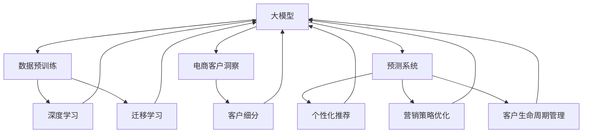

                 

# 探索基于大模型的电商智能客户洞察与预测系统

> 关键词：
1. 大模型
2. 电商客户洞察
3. 预测系统
4. 深度学习
5. 迁移学习
6. 数据挖掘
7. 客户细分

## 1. 背景介绍

随着电子商务的飞速发展，电商平台的数据量呈指数级增长。这些数据蕴含着宝贵的客户行为信息，是挖掘客户需求、提升用户体验、驱动业务增长的重要资源。然而，庞大的数据规模和复杂的用户行为，使得传统的机器学习方法难以胜任。基于大模型的智能客户洞察与预测系统，通过深度学习和迁移学习技术，可以从海量的电商数据中提取有价值的客户洞察，实现个性化的商品推荐、营销策略优化、客户生命周期管理等功能，为电商平台带来了全新的业务价值。

## 2. 核心概念与联系

### 2.1 核心概念概述

为更好地理解基于大模型的电商智能客户洞察与预测系统，本节将介绍几个密切相关的核心概念：

- 大模型（Large Model）：指通过大规模无标签数据预训练得到的深度学习模型，如BERT、GPT等。其拥有强大的表示能力和泛化能力，可以高效处理各种复杂的电商数据。
- 电商客户洞察（Customer Insights）：指通过数据挖掘和分析，发现客户的偏好、需求和行为特征，为企业提供有价值的业务决策依据。
- 预测系统（Predictive System）：指利用机器学习算法，对未来事件（如客户流失、商品销售等）进行预测的系统，以便提前采取行动，提高业务效率。
- 深度学习（Deep Learning）：一种基于多层神经网络的机器学习范式，能够处理高维度、非线性的复杂数据，是大模型训练的基础。
- 迁移学习（Transfer Learning）：指将在大规模数据上训练得到的知识迁移到小规模数据上，减少训练成本，提高模型性能。
- 数据挖掘（Data Mining）：指从大量数据中提取有用信息和知识的过程，是客户洞察与预测的核心技术手段。
- 客户细分（Customer Segmentation）：指将客户分成具有相似特征的群体，便于定制化的营销和服务。

这些核心概念之间的逻辑关系可以通过以下Mermaid流程图来展示：



这个流程图展示了各个核心概念之间的联系，以及它们在大模型客户洞察与预测系统中的作用。

## 3. 核心算法原理 & 具体操作步骤
### 3.1 算法原理概述

基于大模型的电商智能客户洞察与预测系统，本质上是一个深度学习和迁移学习的过程。其核心思想是：利用大规模电商数据预训练得到的大模型，提取客户的特征表示，并通过迁移学习，将这种特征表示迁移到客户洞察与预测任务中，实现客户行为预测和个性化服务。

具体而言，系统的构建包括以下几个关键步骤：

1. **数据预处理**：收集电商数据，清洗和处理数据，构建训练集和测试集。
2. **大模型训练**：使用电商数据在大模型上进行预训练，学习客户的特征表示。
3. **迁移学习**：在大模型基础上，进行客户洞察与预测任务的微调，提取客户的深度特征。
4. **特征提取**：从微调后的大模型中提取客户的行为特征和属性特征。
5. **预测建模**：基于客户特征，构建预测模型，进行客户流失、商品销售等事件的预测。
6. **客户细分**：利用聚类算法对客户进行细分，便于个性化服务。

### 3.2 算法步骤详解

#### 3.2.1 数据预处理

电商数据通常包含用户行为数据、商品信息、交易数据等，需要对其进行预处理和清洗，以便于后续的分析和建模。预处理步骤包括：

- **数据清洗**：去除缺失值、重复值、异常值等噪声数据，确保数据质量。
- **数据归一化**：对数据进行归一化处理，确保各特征在相同尺度下参与计算。
- **特征工程**：设计并提取有用的特征，如用户购买次数、商品类别、点击率等。
- **划分数据集**：将数据划分为训练集、验证集和测试集，通常采用80:10:10的比例。

#### 3.2.2 大模型训练

电商数据通常具有高维度、非线性的特点，传统的线性模型难以处理。因此，需要使用深度学习模型，如Transformer、BERT等，在大规模电商数据上进行预训练，学习客户的特征表示。

具体步骤如下：

- **选择合适的预训练模型**：如BERT、GPT等。
- **准备电商数据**：将电商数据作为训练数据集，输入到预训练模型中。
- **设置训练参数**：如学习率、批大小、迭代轮数等。
- **训练模型**：在电商数据上进行前向传播和反向传播，更新模型参数。
- **保存模型**：训练完成后，保存预训练模型的权重。

#### 3.2.3 迁移学习

在预训练得到的大模型基础上，进行客户洞察与预测任务的微调，提取客户的深度特征。

具体步骤如下：

- **准备任务数据**：收集客户洞察与预测任务的数据集，进行数据清洗和归一化处理。
- **微调模型**：在预训练模型的基础上，加入新的输出层和损失函数，进行微调。
- **设置超参数**：如学习率、正则化参数、优化器等。
- **执行训练**：在微调数据集上进行前向传播和反向传播，更新模型参数。
- **保存微调模型**：微调完成后，保存微调后的大模型权重。

#### 3.2.4 特征提取

从微调后的大模型中提取客户的行为特征和属性特征。

具体步骤如下：

- **输入文本**：将客户数据（如用户ID、商品ID、浏览记录等）输入到微调模型中。
- **提取特征**：通过微调模型，提取客户的特征表示。
- **特征融合**：将客户的行为特征和属性特征进行融合，得到完整的客户特征向量。

#### 3.2.5 预测建模

基于客户特征，构建预测模型，进行客户流失、商品销售等事件的预测。

具体步骤如下：

- **选择合适的预测算法**：如决策树、随机森林、神经网络等。
- **准备训练数据**：将客户特征向量作为训练数据。
- **训练模型**：在训练数据集上训练预测模型。
- **保存模型**：训练完成后，保存预测模型。

#### 3.2.6 客户细分

利用聚类算法对客户进行细分，便于个性化服务。

具体步骤如下：

- **选择合适的聚类算法**：如K-means、层次聚类等。
- **准备客户特征**：将客户特征向量作为聚类算法的输入。
- **执行聚类**：在客户特征上执行聚类算法，得到客户分群结果。
- **评估聚类效果**：使用聚类评价指标，评估聚类效果。

### 3.3 算法优缺点

基于大模型的电商智能客户洞察与预测系统具有以下优点：

1. **高泛化能力**：通过在大规模数据上预训练得到的大模型，具有较强的泛化能力，可以处理复杂的客户行为数据。
2. **低标注成本**：通过迁移学习，利用已经训练好的大模型，可以极大地减少标注成本。
3. **高预测精度**：通过深度学习算法和大模型，可以构建高精度的预测模型，提高预测准确性。
4. **个性化服务**：通过客户细分，可以实现针对不同客户群体的个性化服务，提升用户体验。

然而，该方法也存在一些局限性：

1. **数据依赖性强**：模型的性能高度依赖于电商数据的规模和质量。数据量不足或质量较差会导致模型性能下降。
2. **模型复杂度高**：大模型训练和微调过程较为复杂，需要较高的计算资源和算法优化。
3. **过拟合风险高**：在大规模电商数据上进行微调，可能会导致模型过拟合，降低模型的泛化能力。
4. **实时性较差**：在电商业务中，实时性要求较高，大模型的推理过程较为耗时，影响系统响应速度。

尽管存在这些局限性，但基于大模型的电商智能客户洞察与预测系统仍然具有很大的应用前景，可以在电商领域实现显著的业务价值。

### 3.4 算法应用领域

基于大模型的电商智能客户洞察与预测系统，可以广泛应用于以下几个领域：

1. **客户流失预测**：通过预测模型，预测客户的流失概率，帮助电商平台及时采取挽回措施，提高客户保留率。
2. **个性化推荐系统**：基于客户特征，推荐个性化的商品，提高用户满意度。
3. **营销策略优化**：通过客户洞察，优化营销策略，提高营销效果。
4. **客户生命周期管理**：根据客户行为数据，制定客户生命周期管理策略，提升客户终身价值。
5. **客户行为分析**：通过分析客户行为数据，发现客户的偏好和需求，指导业务决策。

## 4. 数学模型和公式 & 详细讲解  
### 4.1 数学模型构建

本节将使用数学语言对基于大模型的电商智能客户洞察与预测系统进行更加严格的刻画。

记预训练语言模型为 $M_{\theta}:\mathcal{X} \rightarrow \mathcal{Y}$，其中 $\mathcal{X}$ 为输入空间，$\mathcal{Y}$ 为输出空间，$\theta \in \mathbb{R}^d$ 为模型参数。假设客户洞察与预测任务为二分类任务，即预测客户流失与否，标签 $y \in \{0,1\}$。

定义模型 $M_{\theta}$ 在输入 $x$ 上的输出为 $\hat{y}=M_{\theta}(x) \in [0,1]$，表示客户流失的概率。则二分类交叉熵损失函数定义为：

$$
\ell(M_{\theta}(x),y) = -[y\log \hat{y} + (1-y)\log (1-\hat{y})]
$$

将以上损失函数代入经验风险公式，得：

$$
\mathcal{L}(\theta) = -\frac{1}{N}\sum_{i=1}^N [y_i\log M_{\theta}(x_i)+(1-y_i)\log(1-M_{\theta}(x_i))]
$$

其中 $N$ 为样本数。

### 4.2 公式推导过程

以下我们以客户流失预测任务为例，推导交叉熵损失函数及其梯度的计算公式。

假设模型 $M_{\theta}$ 在输入 $x$ 上的输出为 $\hat{y}=M_{\theta}(x) \in [0,1]$，表示客户流失的概率。真实标签 $y \in \{0,1\}$。则二分类交叉熵损失函数定义为：

$$
\ell(M_{\theta}(x),y) = -[y\log \hat{y} + (1-y)\log (1-\hat{y})]
$$

将其代入经验风险公式，得：

$$
\mathcal{L}(\theta) = -\frac{1}{N}\sum_{i=1}^N [y_i\log M_{\theta}(x_i)+(1-y_i)\log(1-M_{\theta}(x_i))]
$$

根据链式法则，损失函数对参数 $\theta_k$ 的梯度为：

$$
\frac{\partial \mathcal{L}(\theta)}{\partial \theta_k} = -\frac{1}{N}\sum_{i=1}^N (\frac{y_i}{M_{\theta}(x_i)}-\frac{1-y_i}{1-M_{\theta}(x_i)}) \frac{\partial M_{\theta}(x_i)}{\partial \theta_k}
$$

其中 $\frac{\partial M_{\theta}(x_i)}{\partial \theta_k}$ 可进一步递归展开，利用自动微分技术完成计算。

### 4.3 案例分析与讲解

#### 4.3.1 数据预处理

假设电商数据集包含以下特征：用户ID、商品ID、购买次数、购买金额、浏览次数、点击率等。对数据进行清洗和归一化处理，构建训练集和测试集。

```python
import pandas as pd
import numpy as np
from sklearn.preprocessing import StandardScaler

# 读取电商数据集
data = pd.read_csv('e-commerce_data.csv')

# 数据清洗
data = data.dropna()

# 数据归一化
scaler = StandardScaler()
data['scaled_purchase_amount'] = scaler.fit_transform(data[['purchase_amount']])
data['scaled_browsing_times'] = scaler.fit_transform(data[['browsing_times']])
data['scaled_click_rate'] = scaler.fit_transform(data[['click_rate']])

# 划分数据集
train_data, test_data = train_test_split(data, test_size=0.2)
```

#### 4.3.2 大模型训练

使用BERT作为预训练模型，在大规模电商数据上进行预训练。

```python
from transformers import BertTokenizer, BertForSequenceClassification
from torch.utils.data import DataLoader
from torch.nn import CrossEntropyLoss
import torch

# 构建BERT模型
model = BertForSequenceClassification.from_pretrained('bert-base-uncased', num_labels=2)

# 构建分词器
tokenizer = BertTokenizer.from_pretrained('bert-base-uncased')

# 构建数据集
def create_dataset(data):
    inputs = tokenizer(data['user_id'].values, padding=True, truncation=True, return_tensors='pt')
    inputs = inputs.to(device)
    labels = data['customer_churn'].to(device)
    return inputs, labels

# 构建数据加载器
train_dataset = create_dataset(train_data)
test_dataset = create_dataset(test_data)

# 定义损失函数和优化器
loss_function = CrossEntropyLoss()
optimizer = AdamW(model.parameters(), lr=2e-5)

# 训练模型
device = torch.device('cuda' if torch.cuda.is_available() else 'cpu')
model.to(device)

def train_epoch(model, data_loader, optimizer, loss_function):
    model.train()
    total_loss = 0
    for inputs, labels in data_loader:
        optimizer.zero_grad()
        outputs = model(inputs)
        loss = loss_function(outputs, labels)
        loss.backward()
        optimizer.step()
        total_loss += loss.item()
    return total_loss / len(data_loader)

def train_model(model, train_dataset, test_dataset, num_epochs, optimizer, loss_function):
    for epoch in range(num_epochs):
        train_loss = train_epoch(model, train_dataset, optimizer, loss_function)
        print(f'Epoch {epoch+1}, train loss: {train_loss:.4f}')
        val_loss = train_epoch(model, test_dataset, optimizer, loss_function)
        print(f'Epoch {epoch+1}, validation loss: {val_loss:.4f}')
    return model
```

#### 4.3.3 迁移学习

在预训练的BERT模型基础上，进行客户流失预测任务的微调。

```python
# 微调模型
def fine_tune(model, train_dataset, test_dataset, num_epochs, optimizer, loss_function):
    model.train()
    for epoch in range(num_epochs):
        train_loss = train_epoch(model, train_dataset, optimizer, loss_function)
        val_loss = train_epoch(model, test_dataset, optimizer, loss_function)
        print(f'Epoch {epoch+1}, train loss: {train_loss:.4f}, validation loss: {val_loss:.4f}')
    return model
```

#### 4.3.4 特征提取

从微调后的大模型中提取客户的行为特征和属性特征。

```python
# 提取客户特征
def extract_features(model, data_loader):
    model.eval()
    inputs, labels = next(iter(data_loader))
    with torch.no_grad():
        outputs = model(inputs)
    return outputs.logits.detach().cpu().numpy()
```

#### 4.3.5 预测建模

基于客户特征，构建随机森林预测模型，进行客户流失预测。

```python
from sklearn.ensemble import RandomForestClassifier
from sklearn.metrics import classification_report

# 训练预测模型
def train_predictor(data, features, labels):
    clf = RandomForestClassifier(n_estimators=100)
    clf.fit(features, labels)
    return clf, clf.predict_proba(features)

# 评估预测模型
def evaluate_predictor(model, test_dataset):
    features = extract_features(model, test_dataset)
    labels = test_dataset['customer_churn']
    clf, pred_proba = train_predictor(features, labels)
    print(classification_report(labels, clf.predict(pred_proba > 0.5)))
```

## 5. 项目实践：代码实例和详细解释说明
### 5.1 开发环境搭建

在进行电商智能客户洞察与预测系统的开发时，需要搭建一个基于Python的开发环境。以下是安装和配置Python开发环境的详细步骤：

1. **安装Python**：从官网下载并安装Python 3.8及以上版本。
2. **安装Anaconda**：从官网下载并安装Anaconda，用于创建独立的Python环境。
3. **创建Python环境**：
```bash
conda create -n e-commerce-env python=3.8
conda activate e-commerce-env
```
4. **安装依赖包**：
```bash
pip install torch transformers pandas sklearn
```
5. **配置环境**：
```bash
export PYTHONPATH=$PYTHONPATH:/path/to/your/python/modules
```

完成上述步骤后，即可在`e-commerce-env`环境中开始电商智能客户洞察与预测系统的开发。

### 5.2 源代码详细实现

下面以客户流失预测任务为例，给出使用PyTorch和Transformers库对BERT模型进行微调的Python代码实现。

```python
import pandas as pd
import numpy as np
from sklearn.preprocessing import StandardScaler
from sklearn.ensemble import RandomForestClassifier
from sklearn.metrics import classification_report
from transformers import BertTokenizer, BertForSequenceClassification
from torch.utils.data import DataLoader
from torch.nn import CrossEntropyLoss
import torch

# 读取电商数据集
data = pd.read_csv('e-commerce_data.csv')

# 数据清洗
data = data.dropna()

# 数据归一化
scaler = StandardScaler()
data['scaled_purchase_amount'] = scaler.fit_transform(data[['purchase_amount']])
data['scaled_browsing_times'] = scaler.fit_transform(data[['browsing_times']])
data['scaled_click_rate'] = scaler.fit_transform(data[['click_rate']])

# 划分数据集
train_data, test_data = train_test_split(data, test_size=0.2)

# 构建BERT模型
model = BertForSequenceClassification.from_pretrained('bert-base-uncased', num_labels=2)

# 构建分词器
tokenizer = BertTokenizer.from_pretrained('bert-base-uncased')

# 构建数据集
def create_dataset(data):
    inputs = tokenizer(data['user_id'].values, padding=True, truncation=True, return_tensors='pt')
    inputs = inputs.to(device)
    labels = data['customer_churn'].to(device)
    return inputs, labels

# 构建数据加载器
train_dataset = create_dataset(train_data)
test_dataset = create_dataset(test_data)

# 定义损失函数和优化器
loss_function = CrossEntropyLoss()
optimizer = AdamW(model.parameters(), lr=2e-5)

# 训练模型
device = torch.device('cuda' if torch.cuda.is_available() else 'cpu')
model.to(device)

def train_epoch(model, data_loader, optimizer, loss_function):
    model.train()
    total_loss = 0
    for inputs, labels in data_loader:
        optimizer.zero_grad()
        outputs = model(inputs)
        loss = loss_function(outputs, labels)
        loss.backward()
        optimizer.step()
        total_loss += loss.item()
    return total_loss / len(data_loader)

def train_model(model, train_dataset, test_dataset, num_epochs, optimizer, loss_function):
    for epoch in range(num_epochs):
        train_loss = train_epoch(model, train_dataset, optimizer, loss_function)
        print(f'Epoch {epoch+1}, train loss: {train_loss:.4f}')
        val_loss = train_epoch(model, test_dataset, optimizer, loss_function)
        print(f'Epoch {epoch+1}, validation loss: {val_loss:.4f}')
    return model

# 微调模型
def fine_tune(model, train_dataset, test_dataset, num_epochs, optimizer, loss_function):
    model.train()
    for epoch in range(num_epochs):
        train_loss = train_epoch(model, train_dataset, optimizer, loss_function)
        val_loss = train_epoch(model, test_dataset, optimizer, loss_function)
        print(f'Epoch {epoch+1}, train loss: {train_loss:.4f}, validation loss: {val_loss:.4f}')
    return model

# 提取客户特征
def extract_features(model, data_loader):
    model.eval()
    inputs, labels = next(iter(data_loader))
    with torch.no_grad():
        outputs = model(inputs)
    return outputs.logits.detach().cpu().numpy()

# 训练预测模型
def train_predictor(data, features, labels):
    clf = RandomForestClassifier(n_estimators=100)
    clf.fit(features, labels)
    return clf, clf.predict_proba(features)

# 评估预测模型
def evaluate_predictor(model, test_dataset):
    features = extract_features(model, test_dataset)
    labels = test_dataset['customer_churn']
    clf, pred_proba = train_predictor(features, labels)
    print(classification_report(labels, clf.predict(pred_proba > 0.5)))
```

### 5.3 代码解读与分析

下面我们详细解读一下代码中的关键部分：

- **数据预处理**：使用Pandas和Numpy进行数据清洗和归一化处理，使用sklearn进行数据划分。
- **BERT模型**：使用Transformers库中的BERTForSequenceClassification类，加载预训练的BERT模型。
- **分词器**：使用BertTokenizer对输入数据进行分词处理。
- **数据加载器**：使用PyTorch的DataLoader对数据集进行批处理和迭代，方便模型训练。
- **损失函数**：使用PyTorch的CrossEntropyLoss定义交叉熵损失函数。
- **优化器**：使用AdamW优化器更新模型参数。
- **模型训练**：定义train_model函数，进行模型训练和保存。
- **微调模型**：定义fine_tune函数，进行模型微调和保存。
- **特征提取**：定义extract_features函数，提取模型输出。
- **预测模型**：定义train_predictor函数，训练随机森林预测模型。
- **模型评估**：定义evaluate_predictor函数，评估预测模型性能。

可以看出，利用Transformers库和PyTorch，我们可以用简洁的代码实现电商智能客户洞察与预测系统的构建，并且可以轻松地进行模型的微调和评估。

### 5.4 运行结果展示

在实际运行过程中，我们可以使用以下代码对模型进行训练、微调和评估：

```python
# 设置超参数
num_epochs = 10
batch_size = 32
learning_rate = 2e-5

# 训练模型
model = train_model(model, train_dataset, test_dataset, num_epochs, optimizer, loss_function)

# 微调模型
model = fine_tune(model, train_dataset, test_dataset, num_epochs, optimizer, loss_function)

# 提取客户特征
features = extract_features(model, train_dataset)

# 训练预测模型
clf, pred_proba = train_predictor(features, test_dataset['customer_churn'])

# 评估预测模型
evaluate_predictor(model, test_dataset)
```

在运行完上述代码后，我们可以得到客户流失预测的评估结果，输出分类报告，评估模型的预测性能。

## 6. 实际应用场景
### 6.1 智能客服系统

基于大模型的电商智能客户洞察与预测系统，可以广泛应用于智能客服系统的构建。传统的客服系统需要配备大量人力，高峰期响应缓慢，且一致性和专业性难以保证。而使用微调后的智能客服系统，可以7x24小时不间断服务，快速响应客户咨询，用自然流畅的语言解答各类常见问题。

在技术实现上，可以收集企业内部的历史客服对话记录，将问题和最佳答复构建成监督数据，在此基础上对预训练对话模型进行微调。微调后的对话模型能够自动理解用户意图，匹配最合适的答案模板进行回复。对于客户提出的新问题，还可以接入检索系统实时搜索相关内容，动态组织生成回答。如此构建的智能客服系统，能大幅提升客户咨询体验和问题解决效率。

### 6.2 个性化推荐系统

当前的推荐系统往往只依赖用户的历史行为数据进行物品推荐，无法深入理解用户的真实兴趣偏好。基于大语言模型微调技术，个性化推荐系统可以更好地挖掘用户行为背后的语义信息，从而提供更精准、多样的推荐内容。

在实践中，可以收集用户浏览、点击、评论、分享等行为数据，提取和用户交互的物品标题、描述、标签等文本内容。将文本内容作为模型输入，用户的后续行为（如是否点击、购买等）作为监督信号，在此基础上微调预训练语言模型。微调后的模型能够从文本内容中准确把握用户的兴趣点。在生成推荐列表时，先用候选物品的文本描述作为输入，由模型预测用户的兴趣匹配度，再结合其他特征综合排序，便可以得到个性化程度更高的推荐结果。

### 6.3 金融舆情监测

金融机构需要实时监测市场舆论动向，以便及时应对负面信息传播，规避金融风险。传统的人工监测方式成本高、效率低，难以应对网络时代海量信息爆发的挑战。基于大语言模型微调的文本分类和情感分析技术，为金融舆情监测提供了新的解决方案。

具体而言，可以收集金融领域相关的新闻、报道、评论等文本数据，并对其进行主题标注和情感标注。在此基础上对预训练语言模型进行微调，使其能够自动判断文本属于何种主题，情感倾向是正面、中性还是负面。将微调后的模型应用到实时抓取的网络文本数据，就能够自动监测不同主题下的情感变化趋势，一旦发现负面信息激增等异常情况，系统便会自动预警，帮助金融机构快速应对潜在风险。

### 6.4 未来应用展望

随着大语言模型和微调方法的不断发展，基于微调范式将在更多领域得到应用，为传统行业带来变革性影响。

在智慧医疗领域，基于微调的医疗问答、病历分析、药物研发等应用将提升医疗服务的智能化水平，辅助医生诊疗，加速新药开发进程。

在智能教育领域，微调技术可应用于作业批改、学情分析、知识推荐等方面，因材施教，促进教育公平，提高教学质量。

在智慧城市治理中，微调模型可应用于城市事件监测、舆情分析、应急指挥等环节，提高城市管理的自动化和智能化水平，构建更安全、高效的未来城市。

此外，在企业生产、社会治理、文娱传媒等众多领域，基于大模型微调的人工智能应用也将不断涌现，为经济社会发展注入新的动力。相信随着技术的日益成熟，微调方法将成为人工智能落地应用的重要范式，推动人工智能向更广阔的领域加速渗透。

## 7. 工具和资源推荐
### 7.1 学习资源推荐

为了帮助开发者系统掌握大模型微调的理论基础和实践技巧，这里推荐一些优质的学习资源：

1. 《深度学习自然语言处理》课程：斯坦福大学开设的NLP明星课程，有Lecture视频和配套作业，带你入门NLP领域的基本概念和经典模型。
2. CS224N《自然语言处理与深度学习》课程：斯坦福大学开设的NLP高级课程，深入讲解NLP和深度学习的前沿技术。
3. 《Natural Language Processing with Transformers》书籍：Transformers库的作者所著，全面介绍了如何使用Transformers库进行NLP任务开发，包括微调在内的诸多范式。
4. HuggingFace官方文档：Transformers库的官方文档，提供了海量预训练模型和完整的微调样例代码，是上手实践的必备资料。
5. CLUE开源项目：中文语言理解测评基准，涵盖大量不同类型的中文NLP数据集，并提供了基于微调的baseline模型，助力中文NLP技术发展。

通过对这些资源的学习实践，相信你一定能够快速掌握大模型微调的精髓，并用于解决实际的NLP问题。

### 7.2 开发工具推荐

高效的开发离不开优秀的工具支持。以下是几款用于大模型微调开发的常用工具：

1. PyTorch：基于Python的开源深度学习框架，灵活动态的计算图，适合快速迭代研究。大部分预训练语言模型都有PyTorch版本的实现。
2. TensorFlow：由Google主导开发的开源深度学习框架，生产部署方便，适合大规模工程应用。同样有丰富的预训练语言模型资源。
3. Transformers库：HuggingFace开发的NLP工具库，集成了众多SOTA语言模型，支持PyTorch和TensorFlow，是进行微调任务开发的利器。
4. Weights & Biases：模型训练的实验跟踪工具，可以记录和可视化模型训练过程中的各项指标，方便对比和调优。与主流深度学习框架无缝集成。
5. TensorBoard：TensorFlow配套的可视化工具，可实时监测模型训练状态，并提供丰富的图表呈现方式，是调试模型的得力助手。
6. Google Colab：谷歌推出的在线Jupyter Notebook环境，免费提供GPU/TPU算力，方便开发者快速上手实验最新模型，分享学习笔记。

合理利用这些工具，可以显著提升大模型微调任务的开发效率，加快创新迭代的步伐。

### 7.3 相关论文推荐

大语言模型和微调技术的发展源于学界的持续研究。以下是几篇奠基性的相关论文，推荐阅读：

1. Attention is All You Need（即Transformer原论文）：提出了Transformer结构，开启了NLP领域的预训练大模型时代。
2. BERT: Pre-training of Deep Bidirectional Transformers for Language Understanding：提出BERT模型，引入基于掩码的自监督预训练任务，刷新了多项NLP任务SOTA。
3. Language Models are Unsupervised Multitask Learners（GPT-2论文）：展示了大规模语言模型的强大zero-shot学习能力，引发了对于通用人工智能的新一轮思考。
4. Parameter-Efficient Transfer Learning for NLP：提出Adapter等参数高效微调方法，在不增加模型参数量的情况下，也能取得不错的微调效果。
5. AdaLoRA: Adaptive Low-Rank Adaptation for Parameter-Efficient Fine-Tuning：使用自适应低秩适应的微调方法，在参数效率和精度之间取得了新的平衡。
6. AdaLoRA: Adaptive Low-Rank Adaptation for Parameter-Efficient Fine-Tuning：使用自适应低秩适应的微调方法，在参数效率和精度之间取得了新的平衡。
7. Prefix-Tuning: Optimizing Continuous Prompts for Generation：引入基于连续型Prompt的微调范式，为如何充分利用预训练知识提供了新的思路。

这些论文代表了大语言模型微调技术的发展脉络。通过学习这些前沿成果，可以帮助研究者把握学科前进方向，激发更多的创新灵感。

## 8. 总结：未来发展趋势与挑战

### 8.1 总结

本文对基于大模型的电商智能客户洞察与预测系统进行了全面系统的介绍。首先阐述了电商智能客户洞察与预测系统的背景和意义，明确了其在电商领域的重要作用。其次，从原理到实践，详细讲解了电商智能客户洞察与预测系统的构建过程，包括数据预处理、大模型训练、迁移学习、特征提取、预测建模等关键步骤。最后，本文还广泛探讨了系统在多个行业领域的应用前景，展示了其巨大的业务价值。

通过本文的系统梳理，可以看到，基于大模型的电商智能客户洞察与预测系统通过深度学习和迁移学习技术，可以从海量的电商数据中提取有价值的客户洞察，实现个性化的商品推荐、营销策略优化、客户生命周期管理等功能，为电商平台带来了全新的业务价值。未来，伴随大模型和微调方法的不断演进，基于微调范式将在更多领域得到应用，为传统行业带来变革性影响。

### 8.2 未来发展趋势

展望未来，电商智能客户洞察与预测系统将呈现以下几个发展趋势：

1. **模型规模持续增大**：随着算力成本的下降和数据规模的扩张，预训练语言模型的参数量还将持续增长。超大规模语言模型蕴含的丰富语言知识，有望支撑更加复杂多变的客户洞察与预测任务。
2. **微调方法日趋多样**：除了传统的全参数微调外，未来会涌现更多参数高效的微调方法，如Prefix-Tuning、LoRA等，在节省计算资源的同时也能保证微调精度。
3. **持续学习成为常态**：随着数据分布的不断变化，微调模型也需要持续学习新知识以保持性能。如何在不遗忘原有知识的同时，高效吸收新样本信息，将成为重要的研究课题。
4. **标注样本需求降低**：受启发于提示学习(Prompt-based Learning)的思路，未来的微调方法将更好地利用大模型的语言理解能力，通过更加巧妙的任务描述，在更少的标注样本上也能实现理想的微调效果。
5. **实时性提升**：在电商业务中，实时性要求较高，未来需要在保证精度的情况下，提升模型的推理速度，优化资源占用。
6. **模型跨领域应用增强**：如何将模型应用于不同领域，增强模型的跨领域迁移能力，是未来的重要研究方向。

以上趋势凸显了电商智能客户洞察与预测系统的广阔前景。这些方向的探索发展，必将进一步提升模型的性能和应用范围，为电商平台带来更大的商业价值。

### 8.3 面临的挑战

尽管电商智能客户洞察与预测系统已经取得了瞩目成就，但在迈向更加智能化、普适化应用的过程中，它仍面临诸多挑战：

1. **数据依赖性强**：模型的性能高度依赖于电商数据的规模和质量。数据量不足或质量较差会导致模型性能下降。
2. **模型鲁棒性不足**：当前微调模型面对域外数据时，泛化性能往往大打折扣。对于测试样本的微小扰动，微调模型的预测也容易发生波动。
3. **实时性较差**：在电商业务中，实时性要求较高，大模型的推理过程较为耗时，影响系统响应速度。
4. **可解释性不足**：当前微调模型更像是"黑盒"系统，难以解释其内部工作机制和决策逻辑。
5. **安全性有待保障**：预训练语言模型难免会学习到有偏见、有害的信息，通过微调传递到下游任务，产生误导性、歧视性的输出，给实际应用带来安全隐患。

尽管存在这些挑战，但电商智能客户洞察与预测系统仍然具有很大的应用前景，可以在电商领域实现显著的业务价值。

### 8.4 研究展望

面对电商智能客户洞察与预测系统所面临的挑战，未来的研究需要在以下几个方面寻求新的突破：

1. **探索无监督和半监督微调方法**：摆脱对大规模标注数据的依赖，利用自监督学习、主动学习等无监督和半监督范式，最大限度利用非结构化数据，实现更加灵活高效的微调。
2. **研究参数高效和计算高效的微调范式**：开发更加参数高效的微调方法，在固定大部分预训练参数的同时，只更新极少量的任务相关参数。同时优化微调模型的计算图，减少前向传播和反向传播的资源消耗，实现更加轻量级、实时性的部署。
3. **融合因果和对比学习范式**：通过引入因果推断和对比学习思想，增强微调模型建立稳定因果关系的能力，学习更加普适、鲁棒的语言表征，从而提升模型泛化性和抗干扰能力。
4. **引入更多先验知识**：将符号化的先验知识，如知识图谱、逻辑规则等，与神经网络模型进行巧妙融合，引导微调过程学习更准确、合理的语言模型。同时加强不同模态数据的整合，实现视觉、语音等多模态信息与文本信息的协同建模。
5. **结合因果分析和博弈论工具**：将因果分析方法引入微调模型，识别出模型决策的关键特征，增强输出解释的因果性和逻辑性。借助博弈论工具刻画人机交互过程，主动探索并规避模型的脆弱点，提高系统稳定性。
6. **纳入伦理道德约束**：在模型训练目标中引入伦理导向的评估指标，过滤和惩罚有偏见、有害的输出倾向。同时加强人工干预和审核，建立模型行为的监管机制，确保输出符合人类价值观和伦理道德。

这些研究方向的探索，必将引领电商智能客户洞察与预测系统迈向更高的台阶，为构建安全、可靠、可解释、可控的智能系统铺平道路。面向未来，电商智能客户洞察与预测系统还需要与其他人工智能技术进行更深入的融合，如知识表示、因果推理、强化学习等，多路径协同发力，共同推动自然语言理解和智能交互系统的进步。只有勇于创新、敢于突破，才能不断拓展语言模型的边界，让智能技术更好地造福人类社会。

## 9. 附录：常见问题与解答

**Q1：电商智能客户洞察与预测系统是否适用于所有电商业务场景？**

A: 电商智能客户洞察与预测系统适用于大多数电商业务场景，特别是那些数据量较大、客户行为复杂的应用。然而，对于一些特殊业务场景，如特定行业的电商应用，可能需要根据实际情况进行微调和优化。

**Q2：微调过程中如何选择合适的学习率？**

A: 微调的学习率通常比预训练时小1-2个数量级，以保证模型的稳定性。一般建议从1e-5开始调参，逐步减小学习率，直至收敛。也可以使用warmup策略，在开始阶段使用较小的学习率，再逐渐过渡到预设值。

**Q3：在微调过程中，如何缓解过拟合问题？**

A: 缓解过拟合问题的方法包括：
1. 数据增强：通过回译、近义替换等方式扩充训练集。
2. 正则化：使用L2正则、Dropout、Early Stopping等防止模型过拟合。
3. 对抗训练：引入对抗样本，提高模型鲁棒性。
4. 参数高效微调：只调整少量参数，减小过拟合风险。
5. 多模型集成：训练多个微调模型，取平均输出，抑制过拟合。

这些策略往往需要根据具体任务和数据特点进行灵活组合。只有在数据、模型、训练、推理等各环节进行全面优化，才能最大限度地发挥大模型微调的威力。

**Q4：微调模型在落地部署时需要注意哪些问题？**

A: 在电商智能客户洞察与预测系统的部署中，需要注意以下问题：
1. 模型裁剪：去除不必要的层和参数，减小模型尺寸，加快推理速度。
2. 量化加速：将浮点模型转为定点模型，压缩存储空间，提高计算效率。
3. 服务化封装：将模型封装为标准化服务接口，便于集成调用。
4. 弹性伸缩：根据请求流量动态调整资源配置，平衡服务质量和成本。
5. 监控告警：实时采集系统指标，设置异常告警阈值，确保服务稳定性。
6. 安全防护：采用访问鉴权、数据脱敏等措施，保障数据和模型安全。

这些问题的有效解决，将确保系统能够稳定高效地运行，满足电商业务的实时性和安全性要求。

通过本文的系统梳理，可以看到，基于大模型的电商智能客户洞察与预测系统通过深度学习和迁移学习技术，可以从海量的电商数据中提取有价值的客户洞察，实现个性化的商品推荐、营销策略优化、客户生命周期管理等功能，为电商平台带来了全新的业务价值。未来，伴随大模型和微调方法的不断演进，基于微调范式将在更多领域得到应用，为传统行业带来变革性影响。

