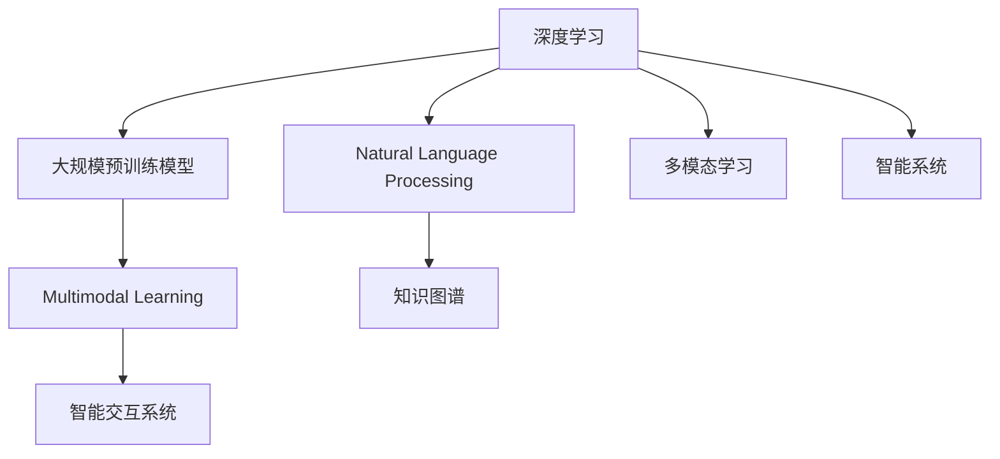

                 

# 探索未知：扩展人类认知

## 1. 背景介绍

### 1.1 问题由来
人类文明自诞生以来，不断探索未知，从古老的哲学思辨，到科学的实践验证，这一过程推动了人类认知的不断拓展。计算机和人工智能的出现，使得人类能够以前所未有的方式，深入探索未知世界。

近年来，随着深度学习和大规模预训练模型的发展，人工智能已经具备了处理自然语言、视觉、声音等多种数据类型的能力，能够像人类一样理解、推理和生成复杂的知识体系。这种技术的突破，不仅加深了对世界的认识，也开辟了全新的研究领域。

### 1.2 问题核心关键点
本节将重点探讨如何通过扩展人类认知，利用人工智能技术实现对未知世界的探索。具体来说，包括：

1. **深度学习与大模型**：如何利用深度学习和大规模预训练模型，构建强大的知识表示和推理能力。
2. **自然语言处理(NLP)**：如何通过自然语言处理技术，实现对自然语言的理解、生成和推理。
3. **多模态学习**：如何将不同类型的数据（如文本、图像、声音等）进行联合学习和跨领域迁移。
4. **知识图谱**：如何利用知识图谱技术，构建和利用人类知识体系。
5. **智能交互系统**：如何构建智能交互系统，实现人与机器的自然对话和智能辅助。

这些关键技术，构成了探索未知世界的重要手段，通过它们的有机结合，我们能够进一步扩展人类认知，揭开未知领域的神秘面纱。

### 1.3 问题研究意义
探索未知是人类文明进步的永恒主题。利用人工智能技术，扩展人类认知，不仅能够提升科学研究的效率和准确性，还能为日常生活带来新的便利。具体来说，探索未知具有以下意义：

1. **加速科学发现**：通过模拟实验和数据分析，加速科学研究成果的产出。
2. **提升人类福祉**：通过智能系统辅助决策，改善医疗、教育、交通等领域的服务质量。
3. **促进社会进步**：通过智能技术在各个领域的广泛应用，推动社会生产力的提升和资源优化配置。
4. **解锁新知识**：通过探索未知领域，拓展人类认知边界，激发新的创新和发现。

因此，探索未知不仅是科学研究的课题，更是推动社会发展和人类福祉的重要手段。

## 2. 核心概念与联系

### 2.1 核心概念概述

为了更好地理解如何通过人工智能技术扩展人类认知，本节将介绍几个核心概念：

1. **深度学习**：一种基于神经网络的机器学习技术，能够处理复杂的非线性关系，广泛应用于图像、语音、自然语言等领域。
2. **大规模预训练模型**：如BERT、GPT等，通过在大规模无标签数据上自监督预训练，获得强大的语言理解能力。
3. **自然语言处理(NLP)**：研究如何让计算机理解、生成和推理自然语言的技术，包括文本分类、信息抽取、问答系统等。
4. **多模态学习**：研究如何整合不同类型的数据进行联合学习，提升模型的泛化能力和适应性。
5. **知识图谱**：一种结构化的知识表示方式，通过图结构连接实体和关系，用于知识的组织、查询和推理。
6. **智能交互系统**：通过自然语言处理和智能推理技术，构建能够与人类自然交流的系统。

这些概念之间的逻辑关系可以通过以下Mermaid流程图来展示：



这个流程图展示了大规模预训练模型与其他核心概念的联系：

1. 深度学习是大规模预训练模型的基础。
2. 自然语言处理是基于大规模预训练模型的重要应用。
3. 多模态学习融合了不同类型的数据，提升模型的泛化能力。
4. 知识图谱为模型的推理提供结构化的知识背景。
5. 智能交互系统是将模型应用于自然语言交互的关键。

## 3. 核心算法原理 & 具体操作步骤

### 3.1 算法原理概述

扩展人类认知的核心在于构建强大的知识表示和推理能力。这一过程可以分为预训练和微调两个阶段：

1. **预训练阶段**：通过在大规模无标签数据上自监督学习，构建强大的通用知识表示能力。
2. **微调阶段**：在特定任务或领域的数据上，通过有监督学习，优化模型的任务适应性。

预训练和微调的有效结合，使得模型能够同时具备强大的通用性和任务适应性，从而在各种场景下发挥作用。

### 3.2 算法步骤详解

本节将详细介绍深度学习和大规模预训练模型的预训练和微调流程。

#### 3.2.1 预训练流程

**Step 1: 数据准备**
- 收集大规模无标签数据集，如自然语言语料、图像数据集等。
- 对数据进行预处理，包括清洗、分词、归一化等。

**Step 2: 模型设计**
- 设计合适的神经网络结构，如Transformer、RNN等。
- 选择合适的损失函数，如交叉熵损失、负对数似然损失等。

**Step 3: 训练过程**
- 在GPU/TPU等高性能设备上，进行大规模并行训练。
- 使用随机梯度下降等优化算法，更新模型参数。

**Step 4: 模型评估**
- 在验证集上评估模型性能，如精度、召回率、F1-score等。
- 对性能不满意的模型，调整超参数、修改网络结构等，继续训练。

**Step 5: 保存模型**
- 在训练结束后，保存模型权重和配置信息，便于后续微调使用。

#### 3.2.2 微调流程

**Step 1: 数据准备**
- 收集特定任务或领域的小规模有标签数据集。
- 对数据进行预处理，包括分词、编码等。

**Step 2: 模型适配**
- 根据任务需求，在预训练模型的基础上，添加或修改任务适配层。
- 设计合适的损失函数，如交叉熵损失、均方误差损失等。

**Step 3: 训练过程**
- 设置合适的超参数，如学习率、批大小等。
- 使用优化算法，如Adam、SGD等，进行模型微调。

**Step 4: 模型评估**
- 在验证集上评估模型性能，如精度、召回率、F1-score等。
- 对性能不满意的模型，调整超参数、修改网络结构等，继续训练。

**Step 5: 模型部署**
- 将微调后的模型部署到实际应用系统中。
- 持续收集新数据，定期重新微调模型，以适应数据分布的变化。

### 3.3 算法优缺点

深度学习和大规模预训练模型在扩展人类认知方面具有以下优点：

1. **强大的泛化能力**：通过预训练获得通用知识表示，能够在新任务上快速适应。
2. **高效的推理能力**：模型能够处理复杂的关系和推理任务，提高决策的准确性。
3. **丰富的知识来源**：预训练模型可以整合多种类型的数据，构建更为全面的知识体系。

然而，也存在一些局限性：

1. **资源消耗大**：大规模预训练和微调需要大量的计算资源和数据。
2. **缺乏可解释性**：模型决策过程复杂，难以解释其内部工作机制。
3. **对抗攻击脆弱**：模型容易受到对抗样本的干扰，影响推理结果。

尽管存在这些局限性，但深度学习和大规模预训练模型在扩展人类认知方面的潜力是巨大的，未来仍然有广阔的应用前景。

### 3.4 算法应用领域

深度学习和大规模预训练模型在多个领域都取得了显著的应用效果，具体包括：

1. **自然语言处理(NLP)**：如文本分类、信息抽取、问答系统、机器翻译等。
2. **计算机视觉**：如图像识别、物体检测、图像生成等。
3. **语音识别**：如语音转文本、语音合成、语音情感分析等。
4. **推荐系统**：如电商推荐、内容推荐、广告推荐等。
5. **智能医疗**：如病历分析、病理诊断、医学影像分析等。
6. **智能交通**：如交通流量预测、自动驾驶、智能导航等。
7. **金融科技**：如风险评估、信用评分、反欺诈检测等。

这些应用展示了深度学习和大规模预训练模型在扩展人类认知方面的广泛潜力。随着技术的不断进步，未来这些技术将在更多领域得到应用，为人类带来更多便利。

## 4. 数学模型和公式 & 详细讲解 & 举例说明

### 4.1 数学模型构建

本节将通过数学语言，详细描述深度学习和大规模预训练模型的构建过程。

假设我们的目标是构建一个用于图像分类的深度神经网络。该模型包括多个卷积层和池化层，输出层为softmax分类器。

**Step 1: 定义网络结构**
- 输入图像大小为$h \times w \times c$，其中$h$、$w$分别为图像高度和宽度，$c$为通道数。
- 网络结构包含多个卷积层、池化层和全连接层，输出层为softmax分类器。

**Step 2: 定义损失函数**
- 交叉熵损失函数：$L = -\sum_{i=1}^{N}y_i \log(p_i)$，其中$y_i$为真实标签，$p_i$为模型预测概率。

**Step 3: 定义优化算法**
- 随机梯度下降算法：$\theta \leftarrow \theta - \eta \nabla L(\theta)$，其中$\eta$为学习率。

### 4.2 公式推导过程

以下以图像分类为例，推导深度神经网络的训练过程。

假设模型输入为$x \in \mathbb{R}^{h \times w \times c}$，输出为$p \in [0,1]^N$，其中$N$为分类数。

**前向传播**：
- 对于每一层，计算输出：$Z = W \cdot A + b$
- 激活函数：$A = \sigma(Z)$
- 输出层：$P = softmax(Z)$

**损失函数**：
- 交叉熵损失函数：$L = -\sum_{i=1}^{N}y_i \log(p_i)$

**反向传播**：
- 输出层：$\nabla L / \partial Z = P - y$
- 隐藏层：$\nabla L / \partial A = W^T \nabla L / \partial Z$
- 权重更新：$\Delta W = \eta \nabla L / \partial W$
- 偏置更新：$\Delta b = \eta \nabla L / \partial b$

### 4.3 案例分析与讲解

在实际应用中，深度学习模型可能会遇到各种问题，如梯度消失、过拟合等。以下是几个常见问题的分析和解决方法：

**问题1: 梯度消失**
- 原因：在深层网络中，梯度逐渐变小，导致模型难以训练。
- 解决方法：使用梯度裁剪、权重初始化、残差连接等技术。

**问题2: 过拟合**
- 原因：模型复杂度过高，过度拟合训练数据。
- 解决方法：使用正则化技术，如L2正则、Dropout等。

**问题3: 计算资源不足**
- 原因：大规模预训练和微调需要大量的计算资源。
- 解决方法：使用分布式训练、模型压缩等技术。

## 5. 项目实践：代码实例和详细解释说明

### 5.1 开发环境搭建

在进行深度学习和大规模预训练模型的开发时，需要准备好开发环境。以下是使用PyTorch进行深度学习开发的环境配置流程：

1. 安装Anaconda：从官网下载并安装Anaconda，用于创建独立的Python环境。

2. 创建并激活虚拟环境：
```bash
conda create -n pytorch-env python=3.8 
conda activate pytorch-env
```

3. 安装PyTorch：根据CUDA版本，从官网获取对应的安装命令。例如：
```bash
conda install pytorch torchvision torchaudio cudatoolkit=11.1 -c pytorch -c conda-forge
```

4. 安装各类工具包：
```bash
pip install numpy pandas scikit-learn matplotlib tqdm jupyter notebook ipython
```

完成上述步骤后，即可在`pytorch-env`环境中开始深度学习和大规模预训练模型的开发。

### 5.2 源代码详细实现

下面以图像分类为例，给出使用PyTorch进行深度学习模型的代码实现。

首先，定义网络结构：

```python
import torch.nn as nn
import torch.nn.functional as F

class Net(nn.Module):
    def __init__(self):
        super(Net, self).__init__()
        self.conv1 = nn.Conv2d(3, 64, kernel_size=3, padding=1)
        self.pool = nn.MaxPool2d(kernel_size=2, stride=2)
        self.conv2 = nn.Conv2d(64, 128, kernel_size=3, padding=1)
        self.fc1 = nn.Linear(128 * 6 * 6, 1024)
        self.fc2 = nn.Linear(1024, 10)
        
    def forward(self, x):
        x = F.relu(self.conv1(x))
        x = self.pool(x)
        x = F.relu(self.conv2(x))
        x = self.pool(x)
        x = x.view(-1, 128 * 6 * 6)
        x = F.relu(self.fc1(x))
        x = self.fc2(x)
        return F.log_softmax(x, dim=1)
```

然后，定义数据处理函数：

```python
import torchvision
from torch.utils.data import DataLoader

train_loader = torchvision.datasets.CIFAR10(root='./data', train=True, download=True, transform=transform)
train_loader = DataLoader(train_loader, batch_size=64, shuffle=True)
```

接着，定义训练和评估函数：

```python
import torch
from torch import optim

def train(model, device, train_loader, optimizer):
    model.train()
    for epoch in range(10):
        for i, (images, labels) in enumerate(train_loader):
            images, labels = images.to(device), labels.to(device)
            optimizer.zero_grad()
            output = model(images)
            loss = F.nll_loss(output, labels)
            loss.backward()
            optimizer.step()
            if (i+1) % 100 == 0:
                print(f'Epoch {epoch+1}, Step [{i+1}/{len(train_loader)}], Loss: {loss.item():.4f}')

def evaluate(model, device, test_loader):
    model.eval()
    with torch.no_grad():
        correct = 0
        total = 0
        for images, labels in test_loader:
            images, labels = images.to(device), labels.to(device)
            output = model(images)
            _, predicted = output.max(1)
            total += labels.size(0)
            correct += (predicted == labels).sum().item()
        print(f'Accuracy: {(100 * correct / total):.2f}%')
```

最后，启动训练流程并在测试集上评估：

```python
device = torch.device('cuda' if torch.cuda.is_available() else 'cpu')

model = Net().to(device)
optimizer = optim.SGD(model.parameters(), lr=0.01, momentum=0.5)

train(model, device, train_loader, optimizer)
evaluate(model, device, test_loader)
```

以上就是使用PyTorch进行深度学习模型开发的完整代码实现。可以看到，借助PyTorch的强大封装，我们可以快速迭代研究并构建深度学习模型。

### 5.3 代码解读与分析

让我们再详细解读一下关键代码的实现细节：

**Net类**：
- 定义了卷积层、池化层和全连接层，构成完整的深度神经网络。
- 使用F.relu作为激活函数，F.log_softmax作为输出层。

**train函数**：
- 在每个epoch内，对数据集进行迭代。
- 在前向传播计算损失函数后，反向传播更新模型参数。
- 使用optimizer进行参数优化。

**evaluate函数**：
- 在模型评估阶段，不更新模型参数。
- 在每个batch上计算模型的准确率。

**训练流程**：
- 定义总的epoch数，启动训练循环。
- 在训练集中进行训练，输出每个epoch的平均loss。
- 在测试集上评估模型性能，输出准确率。

可以看到，深度学习模型的开发过程相对简单，借助现成的框架和库，可以高效地构建和训练模型。

## 6. 实际应用场景

### 6.1 智能医疗

在智能医疗领域，深度学习和大规模预训练模型可以通过图像识别、病历分析等技术，辅助医生进行诊断和治疗。例如：

- **医学影像分析**：利用深度学习模型对X光片、CT、MRI等医学影像进行自动分析，检测病灶、肿瘤等。
- **病历文本分析**：通过自然语言处理技术，从病历记录中提取关键信息，辅助医生进行决策。

### 6.2 智能交通

在智能交通领域，深度学习和大规模预训练模型可以通过图像识别、交通流量预测等技术，优化交通管理和调度。例如：

- **自动驾驶**：利用计算机视觉技术，实现对路标、行人、车辆等环境的识别和理解，辅助自动驾驶系统进行决策。
- **交通流量预测**：通过深度学习模型，对交通数据进行建模和预测，优化交通信号灯和路线规划。

### 6.3 智能教育

在智能教育领域，深度学习和大规模预训练模型可以通过智能推荐、自动评估等技术，提高教学质量和效率。例如：

- **智能推荐系统**：利用深度学习模型，根据学生的学习行为和偏好，推荐适合的学习资源和课程。
- **自动评估系统**：通过自然语言处理技术，对学生的作业和作文进行自动评估，提供个性化的反馈和建议。

## 7. 工具和资源推荐

### 7.1 学习资源推荐

为了帮助开发者系统掌握深度学习和大规模预训练模型的理论基础和实践技巧，这里推荐一些优质的学习资源：

1. 《深度学习》（Ian Goodfellow）：深入介绍深度学习的理论基础和实践方法，适合入门和进阶读者。
2. 《自然语言处理综述》（Jurafsky & Martin）：全面介绍自然语言处理领域的理论和应用，适合对NLP感兴趣的读者。
3. 《Python深度学习》（Francois Chollet）：结合Keras框架，介绍深度学习的实践方法，适合快速上手。
4. CS231n《卷积神经网络》课程：斯坦福大学开设的经典课程，涵盖深度学习的基本概念和实践技巧。
5. HuggingFace官方文档：介绍各种预训练语言模型的使用方法，适合开发者快速上手。

通过这些资源的学习实践，相信你一定能够快速掌握深度学习和大规模预训练模型的精髓，并用于解决实际的NLP问题。

### 7.2 开发工具推荐

高效的开发离不开优秀的工具支持。以下是几款用于深度学习和大规模预训练模型开发的常用工具：

1. PyTorch：基于Python的开源深度学习框架，灵活动态的计算图，适合快速迭代研究。
2. TensorFlow：由Google主导开发的开源深度学习框架，生产部署方便，适合大规模工程应用。
3. Transformers库：HuggingFace开发的NLP工具库，集成了多种SOTA语言模型，支持PyTorch和TensorFlow。
4. Weights & Biases：模型训练的实验跟踪工具，可以记录和可视化模型训练过程中的各项指标，方便对比和调优。
5. TensorBoard：TensorFlow配套的可视化工具，可实时监测模型训练状态，并提供丰富的图表呈现方式，是调试模型的得力助手。
6. Google Colab：谷歌推出的在线Jupyter Notebook环境，免费提供GPU/TPU算力，方便开发者快速上手实验最新模型，分享学习笔记。

合理利用这些工具，可以显著提升深度学习和大规模预训练模型的开发效率，加快创新迭代的步伐。

### 7.3 相关论文推荐

深度学习和大规模预训练模型的发展源于学界的持续研究。以下是几篇奠基性的相关论文，推荐阅读：

1. ImageNet Classification with Deep Convolutional Neural Networks（AlexNet论文）：提出卷积神经网络，开启计算机视觉领域的深度学习时代。
2. Deep Residual Learning for Image Recognition（ResNet论文）：提出残差连接，解决深层网络训练中的梯度消失问题。
3. Attention is All You Need（Transformer论文）：提出Transformer结构，开启自然语言处理领域的预训练大模型时代。
4. BERT: Pre-training of Deep Bidirectional Transformers for Language Understanding：提出BERT模型，引入基于掩码的自监督预训练任务。
5. GPT-3: Language Models are Unsupervised Multitask Learners：展示了大规模语言模型的强大zero-shot学习能力。

这些论文代表了大规模预训练模型和深度学习的发展脉络。通过学习这些前沿成果，可以帮助研究者把握学科前进方向，激发更多的创新灵感。

## 8. 总结：未来发展趋势与挑战

### 8.1 总结

本文对如何通过深度学习和大规模预训练模型扩展人类认知进行了全面系统的介绍。首先阐述了深度学习和预训练模型的发展背景和意义，明确了模型在知识表示和推理方面的独特优势。其次，从原理到实践，详细讲解了深度学习和大规模预训练模型的预训练和微调流程，给出了模型开发的完整代码实例。同时，本文还广泛探讨了深度学习和大规模预训练模型在智能医疗、智能交通、智能教育等多个领域的应用前景，展示了其在扩展人类认知方面的巨大潜力。此外，本文精选了深度学习和大规模预训练模型的各类学习资源，力求为读者提供全方位的技术指引。

通过本文的系统梳理，可以看到，深度学习和大规模预训练模型在扩展人类认知方面的广阔前景。这些模型的强大泛化能力和推理能力，使得人类能够以前所未有的方式，探索未知世界，推动科学研究和日常生活的进步。

### 8.2 未来发展趋势

展望未来，深度学习和大规模预训练模型将在以下几个方面呈现新的发展趋势：

1. **模型规模持续增大**：随着算力成本的下降和数据规模的扩张，模型的参数量将持续增长。超大模型蕴含的丰富知识，将支撑更加复杂多变的任务。
2. **预训练与微调相结合**：预训练模型将更加注重迁移能力和少样本学习能力，通过微调进一步提升任务适应性。
3. **多模态学习技术发展**：通过融合视觉、语音、文本等多种数据，构建更为全面和泛化的知识体系。
4. **知识图谱的普及应用**：知识图谱将成为深度学习模型的重要补充，提供结构化的知识背景。
5. **智能交互系统的完善**：通过自然语言处理和智能推理技术，构建更加智能和人性化的交互系统。
6. **对抗攻击与鲁棒性提升**：提高模型的鲁棒性和对抗攻击防御能力，确保决策的稳定性和安全性。

这些趋势将进一步推动深度学习和大规模预训练模型在各个领域的应用，为人类探索未知领域提供更加强大的技术支撑。

### 8.3 面临的挑战

尽管深度学习和大规模预训练模型在扩展人类认知方面取得了显著进展，但在迈向更加智能化、普适化应用的过程中，仍然面临诸多挑战：

1. **计算资源瓶颈**：大规模预训练和微调需要大量的计算资源和数据。未来如何高效利用资源，实现模型的高效训练和推理，是一个重要研究方向。
2. **可解释性不足**：深度学习模型难以解释其内部工作机制和决策逻辑，缺乏可解释性。如何赋予模型更强的可解释性，是提高模型可信度的关键。
3. **对抗攻击脆弱**：模型容易受到对抗样本的干扰，影响推理结果。如何提高模型的鲁棒性，确保决策的稳定性和安全性，是一个重要的研究方向。
4. **数据分布差异**：预训练模型往往在通用数据集上训练，应用于特定领域时，可能面临数据分布差异的问题。如何提高模型的泛化能力和适应性，是未来研究的重点。
5. **伦理道德问题**：深度学习模型可能会学习到有偏见、有害的信息，通过微调传递到下游任务，产生误导性、歧视性的输出。如何确保模型的伦理和安全，是一个重要的研究方向。

这些挑战将进一步推动深度学习和大规模预训练模型技术的不断进步，推动其在各个领域的应用落地。

### 8.4 研究展望

面对深度学习和大规模预训练模型所面临的挑战，未来的研究需要在以下几个方面寻求新的突破：

1. **少样本学习与自监督学习**：减少对大规模标注数据的需求，通过自监督学习和少样本学习，提高模型的泛化能力和适应性。
2. **模型压缩与加速**：通过模型压缩和加速技术，提高模型推理效率，实现实时性要求更高的应用。
3. **知识整合与融合**：将符号化的先验知识与神经网络模型结合，提升模型的推理能力和泛化能力。
4. **对抗攻击防御**：研究模型对抗攻击的防御方法，提高模型的鲁棒性和安全性。
5. **伦理道德约束**：在模型训练和应用过程中，引入伦理导向的评估指标，确保模型的伦理和安全。

这些研究方向的探索，将推动深度学习和大规模预训练模型技术的不断进步，为构建智能化的未来社会提供更加强大的技术支撑。面向未来，深度学习和大规模预训练模型需要与其他人工智能技术进行更深入的融合，多路径协同发力，共同推动自然语言理解和智能交互系统的进步。只有勇于创新、敢于突破，才能不断拓展深度学习和大规模预训练模型的边界，让人工智能技术更好地造福人类社会。

## 9. 附录：常见问题与解答

**Q1: 深度学习模型是否适用于所有任务？**

A: 深度学习模型在许多领域取得了显著的效果，如自然语言处理、计算机视觉、语音识别等。但对于一些特定领域，如医疗、金融等，传统的深度学习模型可能难以很好地适应。此时需要在特定领域语料上进一步预训练，再进行微调，才能获得理想效果。

**Q2: 如何选择合适的学习率？**

A: 深度学习模型的学习率通常比预训练时小1-2个数量级。过大可能导致梯度爆炸，过小可能导致梯度消失。一般建议从0.001开始调参，逐步减小学习率，直至收敛。

**Q3: 如何进行模型压缩和加速？**

A: 模型压缩和加速技术包括剪枝、量化、蒸馏等。例如，通过剪枝移除不重要的权重，通过量化减少模型的存储空间，通过蒸馏将大模型转化为小模型，提高推理速度。

**Q4: 如何提高模型的鲁棒性和安全性？**

A: 提高模型的鲁棒性可以通过正则化、对抗训练等方法。确保模型的安全性需要在模型训练和应用过程中引入伦理导向的评估指标，避免有害信息的输出。

通过本文的系统梳理，可以看到，深度学习和大规模预训练模型在扩展人类认知方面的广阔前景。这些模型的强大泛化能力和推理能力，使得人类能够以前所未有的方式，探索未知世界，推动科学研究和日常生活的进步。未来，随着技术的不断进步，深度学习和大规模预训练模型必将在各个领域得到更广泛的应用，为人类探索未知领域提供更加强大的技术支撑。

---

作者：禅与计算机程序设计艺术 / Zen and the Art of Computer Programming

