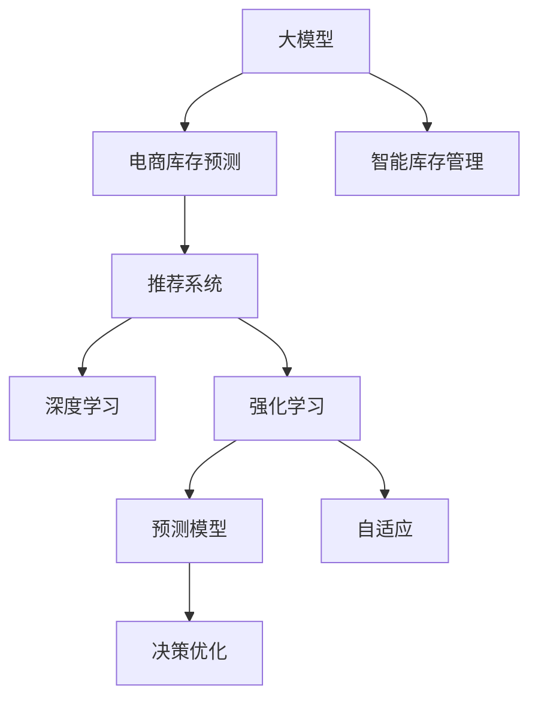

                 

# 探讨基于大模型的电商智能库存预测系统

> 关键词：大模型,电商,智能库存预测,推荐系统,深度学习,强化学习,预测模型,自适应,决策优化

## 1. 背景介绍

### 1.1 问题由来
电商行业是现代经济的重要组成部分，其运营效率直接关系到企业盈利能力。库存管理作为电商物流体系的关键环节，直接影响着企业的资金流和运营效率。传统库存管理主要依赖经验预测和简单规则，存在信息孤岛、数据冗余、预测准确度低等问题。

近年来，随着人工智能技术的迅猛发展，基于大模型的电商智能库存预测系统（Large Model-based Smart Inventory Forecasting System, LMSIFS）应运而生。这种系统利用深度学习、强化学习等先进算法，结合电商业务特点，对库存预测进行智能优化。

## 2. 核心概念与联系

### 2.1 核心概念概述

为更好理解LMSIFS的原理与技术细节，本节将介绍几个关键概念：

- **大模型(Large Model)**：指通过大规模数据训练得到的神经网络模型，如BERT、GPT等。这些模型能够捕获数据的深层次特征，具备强大的学习和推理能力。

- **电商库存预测(E-Commerce Inventory Forecasting)**：指根据历史销售数据、促销活动、季节性因素等，预测未来时间段内的库存需求，实现库存最优配置。

- **智能库存管理(Intelligent Inventory Management)**：基于先进的算法，对库存进行动态调整，达到最优的供需平衡，降低缺货率与库存成本。

- **推荐系统(Recommendation System)**：根据用户行为和商品属性，预测用户可能感兴趣的商品，提升用户体验和销售转化率。

- **深度学习(Deep Learning)**：利用多层神经网络，模拟人脑神经网络的学习过程，实现对数据的复杂模式识别。

- **强化学习(Reinforcement Learning, RL)**：通过与环境的交互，学习最优策略，使得智能体在特定环境中做出最优决策。

- **预测模型(Prediction Model)**：根据历史数据建立模型，预测未来趋势或结果。

- **自适应(Adaptation)**：指模型根据环境变化，调整参数或策略，以适应新的情况。

- **决策优化(Decision Optimization)**：通过优化算法，选择最优的决策方案，最大化系统的性能指标。

这些概念之间相互关联，共同构成了LMSIFS的技术框架：



这个流程图展示了各个核心概念之间的关系：大模型提供底层特征提取，电商库存预测是预测模型的具体应用，智能库存管理涵盖库存的动态优化，推荐系统提供用户行为预测，深度学习和强化学习为算法基础，自适应与决策优化为系统调整的机制。

## 3. 核心算法原理 & 具体操作步骤
### 3.1 算法原理概述

LMSIFS的核心算法包括深度学习、强化学习和自适应等，旨在构建一个自适应的库存预测系统。其原理可以总结如下：

1. **深度学习**：利用大模型对历史销售数据进行特征提取，建立预测模型。
2. **强化学习**：通过与环境的交互，学习最优的库存管理策略。
3. **自适应**：根据实时数据和市场变化，动态调整预测模型和策略。
4. **决策优化**：通过优化算法，选择最优的库存配置方案。

### 3.2 算法步骤详解

LMSIFS的实施步骤如下：

**Step 1: 数据收集与处理**
- 收集电商平台的销售数据、用户行为数据、促销活动数据等，进行数据清洗和归一化。
- 提取商品的特征，如价格、销量、品牌、类别等。

**Step 2: 模型预训练**
- 使用大模型进行预训练，学习商品的特征表示。
- 采用自监督学习任务，如掩码语言模型、序列预测等，提高模型的泛化能力。

**Step 3: 模型微调**
- 在电商数据集上微调大模型，学习商品的销售规律。
- 设置合适的超参数，如学习率、批大小、迭代轮数等。

**Step 4: 实时预测与优化**
- 实时收集库存数据和市场信息，输入模型进行预测。
- 利用强化学习算法，根据预测结果和实时反馈调整库存策略。
- 根据预测误差和资源约束，优化库存配置方案。

**Step 5: 系统集成与部署**
- 将预测和优化结果集成到库存管理系统，实现库存动态调整。
- 部署模型到电商平台的边缘计算节点，提供实时预测服务。
- 使用监控工具，实时跟踪系统性能和数据质量。

### 3.3 算法优缺点

LMSIFS相较于传统库存管理系统，有以下优势：

- **高精度预测**：利用深度学习和大模型的强大特征提取能力，实现高精度库存预测。
- **自适应性强**：强化学习使得系统能够根据市场变化进行动态调整，适应新情况。
- **实时优化**：实时预测与优化结合，实现库存的即时调整，减少库存成本。
- **扩展性好**：基于大模型的微调方法，可以轻松应用于多类商品和不同市场环境。

然而，LMSIFS也存在以下局限：

- **数据依赖**：模型性能高度依赖于数据的质量和多样性。
- **计算成本**：深度学习模型的训练和推理需要大量的计算资源。
- **隐私风险**：电商平台的交易数据涉及用户隐私，需要严格的数据保护措施。
- **解释性不足**：黑盒模型难以解释其决策过程，不利于业务理解和风险控制。

### 3.4 算法应用领域

LMSIFS可应用于电商行业的多个方面，具体如下：

- **库存管理**：根据预测结果和市场变化，动态调整库存量，避免缺货和过剩。
- **促销活动**：预测促销活动对销量的影响，优化促销策略，提升销售效果。
- **商品推荐**：结合库存预测结果，推荐热门商品，提升用户体验。
- **运营分析**：通过预测误差分析，优化运营流程，提高整体效率。
- **风险预警**：预测异常销售行为，及时预警潜在风险，保障平台安全。

## 4. 数学模型和公式 & 详细讲解 & 举例说明
### 4.1 数学模型构建

LMSIFS的数学模型基于深度学习和强化学习。以基于深度学习预测模型为例，可以构建如下数学模型：

设输入为历史销售数据 $x=(x_1,x_2,\cdots,x_t)$，输出为预测销售量 $y=(y_1,y_2,\cdots,y_t)$，其中 $t$ 为预测时间步长。

**预测模型**：

$$
y_t = f(x; \theta)
$$

其中 $f$ 为预测函数，$\theta$ 为模型参数。

**损失函数**：

$$
\mathcal{L}(\theta) = \frac{1}{N} \sum_{i=1}^N ||y_i - f(x_i; \theta)||^2
$$

其中 $N$ 为样本数量。

**优化目标**：

$$
\theta^* = \mathop{\arg\min}_{\theta} \mathcal{L}(\theta)
$$

通过梯度下降等优化算法，最小化损失函数，得到最优模型参数 $\theta^*$。

### 4.2 公式推导过程

以LSTM模型为例，进行详细推导：

设 $x_t$ 为第 $t$ 个时间步的输入特征，$h_t$ 为LSTM的隐藏状态，$y_t$ 为预测的销售量。

LSTM的隐藏状态更新公式为：

$$
h_t = \text{LSTM}(x_t, h_{t-1}; \theta)
$$

其中 $\text{LSTM}$ 为LSTM模型，$\theta$ 为模型参数。

预测公式为：

$$
y_t = \text{Dense}(h_t; \theta_y)
$$

其中 $\text{Dense}$ 为全连接层，$\theta_y$ 为预测层的参数。

损失函数为：

$$
\mathcal{L}(\theta) = \frac{1}{N} \sum_{i=1}^N (y_i - y_{pred})^2
$$

其中 $y_{pred}$ 为预测结果。

优化目标为：

$$
\theta^* = \mathop{\arg\min}_{\theta} \mathcal{L}(\theta)
$$

通过反向传播算法，求得损失函数对参数 $\theta$ 的梯度，带入梯度下降等优化算法，即可更新模型参数。

### 4.3 案例分析与讲解

以某电商平台为例，进行LSTM模型的训练和预测分析：

1. **数据准备**：收集历史销售数据，并进行预处理。
2. **模型构建**：构建LSTM模型，设置输入和输出维度，定义损失函数和优化器。
3. **训练与验证**：在训练集上训练模型，使用验证集评估模型性能，调整超参数。
4. **实时预测**：使用训练好的模型，对实时数据进行预测，并结合强化学习算法优化库存策略。

## 5. 项目实践：代码实例和详细解释说明
### 5.1 开发环境搭建

在开发LMSIFS时，需要配置好开发环境。以下是使用Python的示例：

1. 安装Anaconda，创建虚拟环境：
```bash
conda create -n lmsifs python=3.8
conda activate lmsifs
```

2. 安装相关库：
```bash
pip install torch torchvision numpy scikit-learn pandas tqdm jupyter notebook ipython
```

3. 安装深度学习框架和库：
```bash
pip install torch torchvision numpy scikit-learn pandas tqdm jupyter notebook ipython
```

### 5.2 源代码详细实现

以下是LSTM模型的代码实现：

```python
import torch
import torch.nn as nn
import torch.optim as optim

class LSTM(nn.Module):
    def __init__(self, input_size, hidden_size, output_size):
        super(LSTM, self).__init__()
        self.hidden_size = hidden_size
        self.lstm = nn.LSTM(input_size, hidden_size, batch_first=True)
        self.fc = nn.Linear(hidden_size, output_size)

    def forward(self, x):
        h0 = torch.zeros(1, x.size(0), self.hidden_size).to(device)  # 初始化隐藏状态
        c0 = torch.zeros(1, x.size(0), self.hidden_size).to(device)  # 初始化细胞状态

        out, _ = self.lstm(x, (h0, c0))  # 前向传播
        out = self.fc(out[:, -1, :])  # 预测输出

        return out

# 设置模型参数
input_size = 1
hidden_size = 50
output_size = 1
learning_rate = 0.001

# 构建模型
model = LSTM(input_size, hidden_size, output_size).to(device)

# 设置优化器
optimizer = optim.Adam(model.parameters(), lr=learning_rate)

# 训练模型
for epoch in range(epochs):
    # 训练集
    train_x = ...
    train_y = ...
    loss_train = ...
    optimizer.zero_grad()
    y_pred = model(train_x)
    loss_train = loss_train(y_pred, train_y)
    loss_train.backward()
    optimizer.step()

    # 验证集
    valid_x = ...
    valid_y = ...
    loss_valid = ...
    y_pred = model(valid_x)
    loss_valid = loss_valid(y_pred, valid_y)
    print('Epoch {} - Train Loss: {:.4f} - Valid Loss: {:.4f}'.format(epoch+1, loss_train.item(), loss_valid.item()))

# 使用模型进行预测
test_x = ...
y_pred = model(test_x)
print(y_pred)
```

### 5.3 代码解读与分析

在上述代码中，我们首先定义了LSTM模型的结构，包括输入、隐藏状态和输出。然后使用优化器Adam进行模型训练，设定学习率为0.001。在每一轮训练中，我们首先计算训练集上的损失，并通过反向传播更新模型参数。接着计算验证集上的损失，用于评估模型性能。最后，使用训练好的模型进行实时预测。

## 6. 实际应用场景
### 6.1 智能库存管理

LMSIFS在智能库存管理中的应用场景包括：

1. **库存动态调整**：根据实时数据和预测结果，动态调整库存量，避免缺货和过剩。
2. **促销活动优化**：预测促销活动对销量的影响，优化促销策略，提升销售效果。
3. **商品推荐**：结合库存预测结果，推荐热门商品，提升用户体验。
4. **运营分析**：通过预测误差分析，优化运营流程，提高整体效率。
5. **风险预警**：预测异常销售行为，及时预警潜在风险，保障平台安全。

### 6.2 实时优化与预测

LMSIFS通过实时数据和市场信息进行预测与优化，具体流程如下：

1. **实时数据收集**：收集订单数据、库存数据、用户行为数据等，输入模型进行实时预测。
2. **动态调整策略**：根据预测结果和实时反馈调整库存策略，确保库存配置最优。
3. **优化库存配置**：使用优化算法，选择最优的库存配置方案，降低库存成本。

### 6.3 系统集成与部署

LMSIFS的集成与部署步骤如下：

1. **系统设计**：设计LMSIFS的系统架构，包括数据处理、模型预测、策略优化等模块。
2. **模型集成**：将训练好的预测模型集成到库存管理系统，实现库存预测功能。
3. **部署部署**：将模型部署到电商平台的边缘计算节点，提供实时预测服务。
4. **监控与优化**：使用监控工具，实时跟踪系统性能和数据质量，及时进行优化调整。

## 7. 工具和资源推荐
### 7.1 学习资源推荐

为了帮助开发者系统掌握LMSIFS的理论基础和实践技巧，这里推荐一些优质的学习资源：

1. **深度学习与强化学习课程**：如Coursera的《深度学习专项课程》和Udacity的《强化学习纳米学位》。
2. **模型与算法论文**：如Google的LSTM论文和OpenAI的Transformer论文。
3. **开源项目与社区**：如TensorFlow、PyTorch等深度学习框架，GitHub上的LSTM模型库。

### 7.2 开发工具推荐

为了提高LMSIFS的开发效率，需要选用一些高效的开发工具：

1. **深度学习框架**：如TensorFlow、PyTorch、Keras等，方便模型构建和训练。
2. **数据处理工具**：如Pandas、NumPy等，用于数据清洗和处理。
3. **可视化工具**：如Matplotlib、Seaborn等，用于数据可视化。
4. **监控工具**：如TensorBoard、Prometheus等，用于系统监控和性能优化。

### 7.3 相关论文推荐

为了深入了解LMSIFS的理论和实践，以下是一些关键论文：

1. **LSTM模型**：Hochreiter和Schmidhuber的《Long Short-Term Memory》论文。
2. **强化学习**：Sutton和Barto的《Reinforcement Learning: An Introduction》。
3. **自适应系统**：Wooldridge和Harrison的《Econometric Analysis of Cross Section and Panel Data》。
4. **预测模型**：Box和Jenkins的《Time Series Analysis: Forecasting and Control》。

## 8. 总结：未来发展趋势与挑战
### 8.1 总结

本文系统介绍了基于大模型的电商智能库存预测系统（LMSIFS），详细讲解了其核心算法原理与具体操作步骤。通过对深度学习、强化学习和自适应等技术的结合，LMSIFS实现了高精度、自适应和实时优化的库存预测与动态调整，为电商库存管理提供了新的解决方案。

## 8.2 未来发展趋势

展望未来，LMSIFS将呈现以下几个发展趋势：

1. **多模态融合**：结合电商业务特点，将文本、图像、音频等多模态数据进行融合，提升预测精度。
2. **强化学习优化**：结合强化学习算法，动态调整库存策略，实现库存的实时优化。
3. **自适应学习**：通过自适应学习机制，实时更新模型参数，适应市场变化。
4. **云计算与边缘计算**：将模型部署到云平台和边缘计算节点，提升预测速度和稳定性。
5. **实时数据处理**：利用实时数据处理技术，实现更高效的库存管理。
6. **区块链技术**：利用区块链技术，保障交易数据的安全性和隐私性。

## 8.3 面临的挑战

尽管LMSIFS在电商库存管理中展现了巨大潜力，但仍面临以下挑战：

1. **数据质量**：电商数据存在冗余和不一致性，需要进行高质量的数据清洗和处理。
2. **模型复杂性**：大模型的训练和推理需要大量计算资源，增加了系统成本。
3. **隐私保护**：电商交易数据涉及用户隐私，需要严格的数据保护措施。
4. **模型解释性**：黑盒模型难以解释其决策过程，不利于业务理解和风险控制。
5. **实时优化**：实时数据处理和预测增加了系统复杂性，需要高效的技术支持。

## 8.4 研究展望

为应对上述挑战，未来的研究方向应包括：

1. **数据预处理技术**：开发高效的数据清洗和处理算法，提升数据质量。
2. **模型优化算法**：优化深度学习模型的训练和推理过程，降低计算成本。
3. **隐私保护机制**：研究数据匿名化和加密技术，保障用户隐私。
4. **可解释性模型**：开发可解释性强的模型，提升系统的透明度和可信度。
5. **实时优化技术**：结合实时数据处理和优化算法，实现更高效的库存管理。

总之，LMSIFS作为电商库存管理的重要工具，具有广阔的应用前景。未来需要在数据处理、模型优化、隐私保护等方面不断进行技术创新，以应对实际应用中的各种挑战。通过持续的研究和实践，LMSIFS必将为电商行业带来新的突破，推动智能库存管理技术的不断进步。

---

作者：禅与计算机程序设计艺术 / Zen and the Art of Computer Programming

