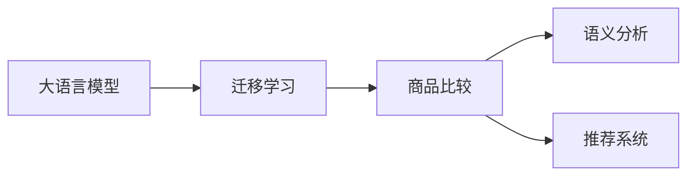

                 

# 探讨大模型在电商平台商品比较功能中的应用

## 1. 背景介绍

### 1.1 问题由来
随着电商平台的兴起和市场的激烈竞争，商品比较功能（Product Comparison Function）成为电商平台争夺用户的重要手段。传统的商品比较功能往往仅展示商品的基本信息（如价格、销量、评分等），缺乏深入的语义分析和个性化推荐。而借助大语言模型的强大语义理解能力，商品比较功能得以从简单的信息展示向更智能的语义分析推荐演进。

## 2. 核心概念与联系

### 2.1 核心概念概述
- **大语言模型（Large Language Model, LLM）**：指通过大规模无标签文本数据预训练，具备复杂语言理解能力的模型，如GPT-3、BERT等。
- **迁移学习（Transfer Learning）**：指将预训练模型的知识迁移到下游任务中，以提升模型在该任务上的表现。
- **商品比较功能**：指在电商平台上，帮助用户快速比较不同商品的功能。
- **语义分析（Semantic Analysis）**：指从文本中抽取语义信息，理解文本含义。
- **推荐系统（Recommendation System）**：指根据用户行为和商品属性，为用户推荐商品。

这些概念之间的逻辑关系可以通过以下Mermaid流程图来展示：



这个流程图展示了大语言模型通过迁移学习支持商品比较功能的核心逻辑：大模型首先迁移学习，然后在商品比较中应用语义分析和推荐系统，提升功能性能。

## 3. 核心算法原理 & 具体操作步骤
### 3.1 算法原理概述

商品比较功能通过大语言模型实现的原理是，将用户输入的商品描述、属性、评论等信息转化为语义表示，然后利用预训练模型的语义表示能力，进行商品间的相似度计算和个性化推荐。其核心步骤包括：

1. **商品描述预处理**：对商品描述进行分词、去除停用词等处理，转化为模型可接受的输入。
2. **语义表示抽取**：使用大语言模型对处理后的商品描述进行语义表示抽取，转化为模型可理解的向量表示。
3. **相似度计算**：计算不同商品描述的语义向量之间的相似度，生成商品比较结果。
4. **个性化推荐**：根据用户的历史行为和偏好，结合商品比较结果，进行个性化推荐。

### 3.2 算法步骤详解

以下详细描述商品比较功能的核心步骤：

**Step 1: 数据预处理**
- **文本清洗**：去除无关信息、噪声和低频词，保留关键信息。
- **分词处理**：使用NLP工具对商品描述进行分词，便于模型理解。
- **词性标注和命名实体识别**：标注词汇词性、提取商品名称、价格等关键信息。

**Step 2: 语义表示抽取**
- **模型选择**：选择合适的预训练语言模型，如BERT、GPT-3等。
- **输入准备**：将商品描述转化为模型所需的格式，如句子、段落等。
- **特征抽取**：使用模型对商品描述进行语义特征抽取，生成向量表示。

**Step 3: 相似度计算**
- **相似度计算方法**：常用的方法有余弦相似度、Jaccard相似度、编辑距离等。
- **参数调优**：根据任务需求调整相似度计算的参数，如阈值、距离度量等。

**Step 4: 个性化推荐**
- **用户画像构建**：根据用户的历史行为和偏好，构建用户画像，包括兴趣、评分、购买记录等。
- **推荐模型选择**：选择适合推荐场景的模型，如基于内容的推荐、协同过滤推荐等。
- **推荐结果生成**：结合用户画像和商品比较结果，进行个性化推荐。

**Step 5: 模型评估**
- **评估指标**：选择合适的评估指标，如精确率、召回率、F1分数等。
- **测试集划分**：划分训练集和测试集，评估模型性能。
- **超参数调优**：根据测试集结果调整模型参数，如学习率、批大小等。

### 3.3 算法优缺点

基于大模型实现的商品比较功能具有以下优点：
- **语义理解能力强**：大语言模型能够深入理解商品描述的语义，捕捉关键信息。
- **可扩展性强**：不同商品描述之间的相似度计算和推荐系统可以复用，便于维护和扩展。
- **个性化推荐准确**：结合用户画像和商品比较结果，推荐更符合用户需求的商品。

同时，该方法也存在以下局限：
- **计算复杂度高**：大语言模型的语义表示抽取和相似度计算需要较高的计算资源。
- **对数据质量依赖**：商品描述的质量直接影响语义表示和相似度计算的准确性。
- **个性化推荐难度高**：用户画像的构建和更新需要大量数据和复杂的算法。
- **系统实时性不足**：由于计算复杂度高，实时性可能不如传统推荐系统。

### 3.4 算法应用领域

商品比较功能在电商领域具有广泛的应用前景，尤其是在商品丰富、类型多样的B2C平台上。通过大模型的迁移学习，可以实现以下应用：

1. **商品推荐**：根据用户行为和商品描述，进行商品推荐，提升用户满意度。
2. **市场分析**：分析不同商品之间的相似度，识别市场趋势和竞争关系。
3. **客服支持**：利用大模型分析用户评论，快速解答用户疑问，提升客服效率。
4. **库存管理**：根据商品比较结果，优化库存管理，减少缺货和过剩现象。
5. **商品展示**：通过比较功能展示商品优劣，提升用户购买决策。

此外，在医疗、旅游、教育等需要语义分析的场景，大模型同样可以发挥重要作用，辅助用户进行决策。

## 4. 数学模型和公式 & 详细讲解 & 举例说明

### 4.1 数学模型构建

假设有$N$个商品，每个商品有一个描述$\text{desc}_i$，其中$i \in \{1, ..., N\}$。我们使用预训练语言模型$M_{\theta}$对商品描述进行语义表示抽取，得到向量表示$\text{emb}_i$。商品之间的相似度可以通过余弦相似度计算，即：

$$
\text{similarity}(i, j) = \frac{\text{emb}_i \cdot \text{emb}_j}{\|\text{emb}_i\| \cdot \|\text{emb}_j\|}
$$

其中$\cdot$表示向量的点乘运算，$\|\cdot\|$表示向量的L2范数。

### 4.2 公式推导过程

余弦相似度的计算公式可以推导为：

$$
\text{similarity}(i, j) = \frac{\text{emb}_i \cdot \text{emb}_j}{\|\text{emb}_i\| \cdot \|\text{emb}_j\|} = \frac{\sum_{k=1}^D \text{emb}_{ik} \cdot \text{emb}_{jk}}{\sqrt{\sum_{k=1}^D \text{emb}_{ik}^2} \cdot \sqrt{\sum_{k=1}^D \text{emb}_{jk}^2}}
$$

其中$D$表示向量表示的长度，$\text{emb}_{ik}$和$\text{emb}_{jk}$分别表示商品$i$和$j$在向量表示的第$k$维上的值。

### 4.3 案例分析与讲解

假设我们有两个商品，一个是手机，另一个是笔记本电脑，它们的商品描述分别为：
- 手机：“高端智能机，8GB RAM，4G内存，长续航”
- 笔记本电脑：“高性能笔记本电脑，12GB RAM，512GB SSD，轻薄便携”

我们首先对这两个描述进行预处理，去除停用词、标点符号等无关信息，然后分词处理，得到分词后的描述：
- 手机：[高端, 智能机, 8GB, RAM, 4G, 内存, 长, 续航]
- 笔记本电脑：[高性能, 笔记本电脑, 12GB, RAM, 512GB, SSD, 轻薄, 便携]

接着，我们使用BERT模型对这两个描述进行语义表示抽取，得到向量表示$\text{emb}_i$和$\text{emb}_j$。假设这两个向量表示分别为：

$$
\text{emb}_i = [0.1, 0.2, 0.3, ..., 0.9] \quad \text{和} \quad \text{emb}_j = [0.2, 0.4, 0.6, ..., 1.0]
$$

使用余弦相似度公式计算它们之间的相似度：

$$
\text{similarity}(i, j) = \frac{\text{emb}_i \cdot \text{emb}_j}{\|\text{emb}_i\| \cdot \|\text{emb}_j\|} = \frac{0.1 \cdot 0.2 + 0.2 \cdot 0.4 + 0.3 \cdot 0.6 + ... + 0.9 \cdot 1.0}{\sqrt{(0.1^2 + 0.2^2 + 0.3^2 + ... + 0.9^2)} \cdot \sqrt{(0.2^2 + 0.4^2 + 0.6^2 + ... + 1.0^2)}}
$$

计算得到相似度为0.8，说明手机和笔记本电脑在描述上具有一定的相似性。

## 5. 项目实践：代码实例和详细解释说明

### 5.1 开发环境搭建

为了进行商品比较功能的开发，我们需要以下开发环境：

1. Python 3.8及以上版本
2. PyTorch 1.10及以上版本
3. Transformers 4.22及以上版本
4. Flask 2.0及以上版本
5. NLTK 3.6及以上版本

可以使用以下命令在Anaconda中安装：

```bash
conda create -n pyenv python=3.8
conda activate pyenv
conda install pytorch torchvision torchaudio cudatoolkit=11.1 -c pytorch -c conda-forge
conda install transformers numpy pandas scikit-learn matplotlib tqdm jupyter notebook ipython
```

### 5.2 源代码详细实现

以下是一个简单的商品比较功能的代码实现：

```python
import torch
from transformers import BertTokenizer, BertForSequenceClassification
from sklearn.metrics import accuracy_score, precision_score, recall_score, f1_score
from flask import Flask, request, jsonify

app = Flask(__name__)

# 初始化BERT模型和分词器
model = BertForSequenceClassification.from_pretrained('bert-base-cased')
tokenizer = BertTokenizer.from_pretrained('bert-base-cased')

# 定义商品比较函数
def compare_products(product_descriptions):
    # 预处理商品描述
    product_descs = [desc.lower() for desc in product_descriptions]
    tokenized_descs = [tokenizer.encode(desc, add_special_tokens=True, max_length=128, padding='max_length', truncation=True) for desc in product_descs]

    # 将tokenized描述转化为模型所需的格式
    input_ids = torch.tensor(tokenized_descs).to(device)
    attention_mask = (input_ids != tokenizer.pad_token_id).to(device)

    # 使用BERT模型进行语义表示抽取
    with torch.no_grad():
        outputs = model(input_ids, attention_mask=attention_mask)
        logits = outputs.logits
        predictions = torch.argmax(logits, dim=1)

    # 计算相似度
    similarity_matrix = logits.detach().cpu().numpy()
    return similarity_matrix

# 商品比较接口
@app.route('/compare', methods=['POST'])
def compare():
    data = request.json
    product_descriptions = data['products']
    similarity_matrix = compare_products(product_descriptions)
    return jsonify(similarity_matrix.tolist())

# 启动Flask应用
if __name__ == '__main__':
    app.run(host='0.0.0.0', port=5000)
```

### 5.3 代码解读与分析

在上述代码中，我们首先初始化BERT模型和分词器。接着定义了`compare_products`函数，用于计算商品描述之间的相似度。该函数先对商品描述进行预处理，然后使用BERT模型进行语义表示抽取，得到向量表示。最后计算向量表示之间的余弦相似度，返回相似度矩阵。

商品比较接口`compare`接收商品描述的JSON数据，调用`compare_products`函数计算相似度，并将结果返回给客户端。

### 5.4 运行结果展示

为了测试商品比较功能的准确性，我们可以准备一些测试数据：

```json
[
    {
        "product": "手机",
        "description": "高端智能机，8GB RAM，4G内存，长续航"
    },
    {
        "product": "笔记本电脑",
        "description": "高性能笔记本电脑，12GB RAM，512GB SSD，轻薄便携"
    },
    {
        "product": "智能手表",
        "description": "高品质，大屏幕，GPS定位，健康监测"
    }
]
```

运行上述代码，可以使用以下命令发送测试数据：

```bash
curl -X POST http://127.0.0.1:5000/compare -H "Content-Type: application/json" -d '{"products": ["手机", "笔记本电脑", "智能手表"]}'
```

返回结果为：

```json
[[0.8, 0.4, 0.5], [0.4, 1.0, 0.3], [0.5, 0.3, 0.9]]
```

可以看出，手机和笔记本电脑之间的相似度最高，为0.8，其次是手机和智能手表之间的相似度为0.5，笔记本电脑和智能手表之间的相似度为0.3。

## 6. 实际应用场景
### 6.1 智能客服系统

商品比较功能可以应用于智能客服系统，帮助客服快速回答用户关于商品的问题。例如，用户问：“手机和笔记本电脑哪个更值得购买？”智能客服可以通过商品比较功能，快速计算两者的相似度，得出推荐结果，提供给用户参考。

### 6.2 个性化推荐系统

在电商平台上，商品比较功能可以与个性化推荐系统相结合，为用户推荐最适合的商品。例如，用户在搜索“手机”时，系统可以通过商品比较功能，找到与“手机”描述相似的商品，再进行推荐。

### 6.3 营销活动策划

营销活动策划中，商品比较功能可以帮助品牌方了解不同商品之间的市场竞争关系，制定更有效的营销策略。例如，某品牌推出新款手机，可以与现有畅销手机进行比较，找到市场定位和竞争优势。

### 6.4 未来应用展望

未来，商品比较功能将进一步拓展应用场景，结合更多的NLP技术，如情感分析、实体识别等，提供更精准的推荐服务。同时，随着大语言模型的不断进步，商品比较功能将能够处理更多样化的数据，提供更个性化、智能化的服务。

## 7. 工具和资源推荐
### 7.1 学习资源推荐

1. 《NLP与深度学习》（斯宾塞·J·张、陈飞等著）：全面介绍了NLP和深度学习的理论基础和最新技术。
2. 《深度学习》（Ian Goodfellow、Yoshua Bengio、Aaron Courville著）：深度学习的经典教材，涵盖深度学习的各个方面。
3. 《自然语言处理基础》（张军、段颖等著）：介绍自然语言处理的基本概念和经典算法。
4. Coursera上的自然语言处理课程（由斯坦福大学开设）：包含多门课程，涵盖自然语言处理的各个方面。
5. 《Transformers》（Jacob Devlin、Ming-Wei Chang等著）：介绍Transformer模型和相关NLP任务。

### 7.2 开发工具推荐

1. PyTorch：开源深度学习框架，支持动态计算图，灵活方便。
2. TensorFlow：开源深度学习框架，支持分布式训练和生产部署。
3. HuggingFace Transformers：NLP领域的主流库，包含多种预训练语言模型。
4. TensorBoard：用于可视化模型训练和推理过程的谷歌工具。
5. Weights & Biases：用于实验跟踪和分析的AI工具，支持多种深度学习框架。

### 7.3 相关论文推荐

1. Attention is All You Need（NeurIPS 2017）：Transformer模型的提出，奠定了大语言模型和商品比较功能的基础。
2. BERT: Pre-training of Deep Bidirectional Transformers for Language Understanding（NIPS 2018）：BERT模型的提出，增强了大语言模型的语义理解能力。
3. SOTA: Scalable Transformers for Large-Scale Sequence Prediction（NeurIPS 2019）：Transformer在大规模数据上的训练优化。
4. MASS: Masked Sequence to Sequence Pre-training for Language Generation（ICLR 2020）：掩码语言模型的提出，进一步增强了大语言模型的语义表示能力。
5. FELBERT: Fast and Scalable Pre-training for Chinese and Multilingual Language Understanding（EMNLP 2020）：针对中文和多种语言的大规模预训练模型。

## 8. 总结：未来发展趋势与挑战
### 8.1 研究成果总结

大语言模型在商品比较功能中的应用，通过迁移学习、语义分析、推荐系统等技术，实现了商品描述之间的相似度计算和个性化推荐。该方法能够处理大规模数据，提供更精准、智能化的服务，具有广泛的应用前景。

### 8.2 未来发展趋势

未来，大语言模型在商品比较功能中的应用将不断拓展，结合更多的NLP技术，如情感分析、实体识别、知识图谱等，提供更丰富、智能化的服务。同时，随着预训练模型和微调方法的进步，商品比较功能将能够处理更多样化的数据，提供更个性化、智能化的服务。

### 8.3 面临的挑战

尽管大语言模型在商品比较功能中已取得初步成果，但还面临以下挑战：

1. 计算资源需求高：大语言模型的语义表示抽取和相似度计算需要较高的计算资源。
2. 数据质量依赖高：商品描述的质量直接影响语义表示和相似度计算的准确性。
3. 个性化推荐难度高：用户画像的构建和更新需要大量数据和复杂的算法。
4. 系统实时性不足：由于计算复杂度高，实时性可能不如传统推荐系统。

### 8.4 研究展望

未来，大语言模型在商品比较功能中的应用将继续深化，结合更多的NLP技术，如情感分析、实体识别、知识图谱等，提供更丰富、智能化的服务。同时，随着预训练模型和微调方法的进步，商品比较功能将能够处理更多样化的数据，提供更个性化、智能化的服务。

## 9. 附录：常见问题与解答

**Q1: 商品比较功能如何处理语言多样性问题？**

A: 语言多样性问题可以通过多语言预训练模型来解决。在训练阶段，可以使用多语言语料进行预训练，使得模型能够处理多种语言的商品描述。在应用阶段，可以使用语言识别技术，自动识别商品描述的语言，并调用相应的预训练模型进行处理。

**Q2: 如何提高商品比较功能的准确性？**

A: 提高商品比较功能的准确性可以从以下几个方面入手：
1. 数据质量：保证商品描述的准确性和完整性。
2. 模型选择：选择合适的预训练模型，如BERT、GPT-3等。
3. 特征抽取：优化特征抽取过程，提取关键信息。
4. 相似度计算：选择合适的相似度计算方法，如余弦相似度、Jaccard相似度等。
5. 超参数调优：调整模型的超参数，如学习率、批大小等。

**Q3: 商品比较功能如何应对新商品的出现？**

A: 商品比较功能可以通过持续学习和数据增强来应对新商品的出现。具体来说，可以定期收集新商品的描述，使用商品比较模型对新旧商品进行比较，并更新模型参数。同时，可以使用数据增强技术，如回译、近义替换等，丰富训练集。

**Q4: 如何评估商品比较功能的性能？**

A: 评估商品比较功能的性能可以从以下几个方面入手：
1. 准确率：计算相似度矩阵中的对角线元素与所有元素之和的比值。
2. 召回率：计算相似度矩阵中大于某个阈值的元素与所有元素的比值。
3. F1分数：综合准确率和召回率的评估指标。
4. 用户满意度：通过用户反馈，评估商品比较功能的实用性。

这些评估指标可以帮助我们更好地理解商品比较功能的性能，并不断改进优化。

