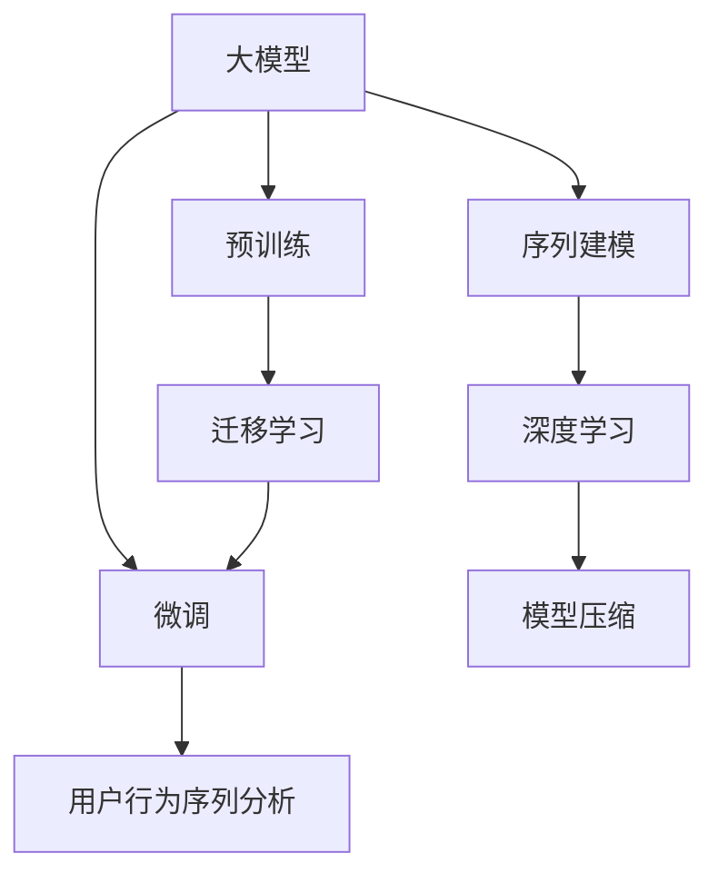

                 

## 1. 背景介绍

### 1.1 问题由来

电商平台用户行为序列分析是大数据挖掘和客户关系管理中的一个重要应用，旨在从用户行为数据中提取有价值的洞见，优化用户体验和提升销售额。通过分析用户的点击、浏览、购买等行为，电商平台可以更精准地推荐商品，提高用户的购物体验和平台的用户黏性。

传统的用户行为序列分析方法通常基于统计学模型，如关联规则挖掘、聚类分析、时间序列分析等。这些方法在数据量较小的情况下较为有效，但面对日益增长的电商平台数据，传统方法的计算复杂度和存储需求急剧增加，难以适应大规模、高维度数据的处理需求。

近年来，大模型在自然语言处理（NLP）领域取得了显著进展，如图灵奖得主GPT-3的发布，展现了大模型在处理大规模、复杂任务上的强大能力。在电商平台用户行为序列分析中，大模型的应用有望彻底改变传统的分析方法，提供更加高效、准确、全面的洞察。

### 1.2 问题核心关键点

大模型在电商平台用户行为序列分析中的潜力，主要体现在以下几个方面：

1. **高维度数据处理能力**：大模型通常具有数十亿甚至上百亿的参数，具备处理高维数据的能力，能够适应电商平台中包含的丰富且复杂的行为特征。
2. **强大的特征提取能力**：通过预训练和微调，大模型可以自动学习到数据中的关键特征，实现对用户行为的深层次理解。
3. **实时性**：大模型能够实时处理用户行为数据，快速响应用户需求，提高客户服务的效率。
4. **鲁棒性**：大模型能够适应各种类型的数据和噪音，提高分析结果的鲁棒性。
5. **普适性**：大模型具有广泛的应用领域，可以适用于多种用户行为序列分析场景。

这些特点使得大模型在电商平台用户行为序列分析中展现出巨大的潜力，可以显著提升分析和推荐系统的性能。

## 2. 核心概念与联系

### 2.1 核心概念概述

为了更好地理解大模型在电商平台用户行为序列分析中的应用，本节将介绍几个核心概念：

1. **大模型（Large Model）**：指具有大规模参数量（通常超过10亿）的深度学习模型，如BERT、GPT-3等。大模型通过大规模数据预训练，具有强大的特征提取和表示学习能力。

2. **用户行为序列（User Behavior Sequence）**：指用户在电商平台上的行为时间序列，包括点击、浏览、购买、评价等事件。行为序列数据通常具有高维稀疏性，包含大量噪音和随机性。

3. **序列建模（Sequence Modeling）**：指对时间序列数据进行建模，以捕捉时间依赖性和动态特性。大模型在序列建模中具有显著优势。

4. **迁移学习（Transfer Learning）**：指将在大规模数据上预训练的模型迁移到特定任务上进行微调，以提高模型在新任务上的表现。

5. **深度学习（Deep Learning）**：指使用深层神经网络对复杂数据进行建模和预测。大模型是深度学习的重要组成部分。

6. **模型压缩（Model Compression）**：指在不损失模型性能的前提下，通过剪枝、量化等技术减少模型参数和存储空间，以适应高并发和低延迟的实际应用需求。

这些核心概念之间的逻辑关系可以通过以下Mermaid流程图来展示：



这个流程图展示了大模型在电商平台用户行为序列分析中的核心概念及其之间的关系：

1. 大模型通过预训练获得基础能力。
2. 微调在大模型的基础上，进行特定任务适配。
3. 用户行为序列分析是大模型的重要应用场景。
4. 迁移学习使得大模型能够迁移到不同任务中进行微调。
5. 深度学习是实现大模型序列建模的重要技术。
6. 模型压缩在保证模型性能的同时，减少计算和存储需求。

这些概念共同构成了大模型在电商平台用户行为序列分析中的应用框架，使得大模型能够高效、准确地分析和预测用户行为。

## 3. 核心算法原理 & 具体操作步骤

### 3.1 算法原理概述

大模型在电商平台用户行为序列分析中，主要通过序列建模技术，对用户行为序列进行预测和分类。具体而言，大模型将用户的行为序列作为输入，输出对应的标签或概率分布，从而实现对用户行为的分析和预测。

形式化地，假设用户行为序列为 $X=\{x_1, x_2, ..., x_n\}$，其中 $x_i$ 表示用户在第 $i$ 次访问电商平台时的行为（如点击某商品）。则用户行为序列分析的目标是找到最优的模型 $M_{\theta}$，使得在给定行为序列 $X$ 的情况下，预测结果 $y$ 与真实标签 $y'$ 的误差最小化。

即：

$$
\min_{\theta} \mathcal{L}(M_{\theta}, X, y')
$$

其中 $\mathcal{L}$ 为损失函数，可以采用交叉熵、均方误差等。

### 3.2 算法步骤详解

基于大模型的电商平台用户行为序列分析，主要包括以下几个关键步骤：

**Step 1: 准备预训练模型和数据集**

- 选择合适的预训练模型，如BERT、GPT-3等。
- 准备用户行为序列数据集，包括点击、浏览、购买等行为数据。
- 将数据集划分为训练集、验证集和测试集，确保数据分布的一致性。

**Step 2: 添加任务适配层**

- 根据具体任务需求，设计合适的输出层和损失函数。
- 对于分类任务，通常采用多分类交叉熵损失函数。
- 对于回归任务，通常采用均方误差损失函数。

**Step 3: 设置微调超参数**

- 选择合适的优化算法及其参数，如AdamW、SGD等。
- 设置学习率、批大小、迭代轮数等超参数。
- 设置正则化技术及强度，如L2正则、Dropout、Early Stopping等。

**Step 4: 执行梯度训练**

- 将训练集数据分批次输入模型，前向传播计算损失函数。
- 反向传播计算参数梯度，根据设定的优化算法和学习率更新模型参数。
- 周期性在验证集上评估模型性能，根据性能指标决定是否触发Early Stopping。
- 重复上述步骤直至满足预设的迭代轮数或Early Stopping条件。

**Step 5: 测试和部署**

- 在测试集上评估微调后模型 $M_{\hat{\theta}}$ 的性能，对比微调前后的精度提升。
- 使用微调后的模型对新样本进行推理预测，集成到实际的应用系统中。
- 持续收集新的数据，定期重新微调模型，以适应数据分布的变化。

### 3.3 算法优缺点

大模型在电商平台用户行为序列分析中具有以下优点：

1. **高效性**：大模型能够处理高维数据，适应电商平台的复杂行为特征。
2. **准确性**：通过预训练和微调，大模型可以自动学习到数据中的关键特征，提高预测准确性。
3. **鲁棒性**：大模型具有强大的泛化能力，能够适应各种类型的数据和噪音。
4. **实时性**：大模型能够实时处理用户行为数据，快速响应用户需求。
5. **普适性**：大模型可以应用于多种用户行为序列分析场景，具有广泛的应用前景。

同时，该方法也存在一些局限性：

1. **依赖标注数据**：微调过程需要标注数据，获取高质量标注数据的成本较高。
2. **模型复杂度**：大模型参数量巨大，对计算资源和存储资源要求较高。
3. **可解释性不足**：大模型的决策过程较为复杂，难以进行解释和调试。
4. **计算开销**：大模型的训练和推理开销较大，需要高性能的硬件设备支持。

尽管存在这些局限性，但就目前而言，大模型在电商平台用户行为序列分析中展现出了巨大的潜力，成为研究和应用的热点。

### 3.4 算法应用领域

大模型在电商平台用户行为序列分析中，可以应用于以下几个具体领域：

1. **用户行为预测**：预测用户未来的点击、购买行为，提高个性化推荐系统的准确性。
2. **用户画像建模**：通过对用户行为序列的分析，构建详细且准确的客户画像，提升客户关系管理的效果。
3. **营销活动优化**：分析用户行为序列数据，评估营销活动的效果，优化广告投放策略。
4. **用户流失预警**：预测用户的流失行为，提前采取措施，降低用户流失率。
5. **异常行为检测**：识别和分析异常行为模式，防范欺诈和风险。

这些领域的应用展示了大模型在电商平台用户行为序列分析中的广泛价值，为电商平台的运营优化和客户满意度提升提供了新的手段。

## 4. 数学模型和公式 & 详细讲解 & 举例说明

### 4.1 数学模型构建

本节将使用数学语言对大模型在电商平台用户行为序列分析中的应用进行更加严格的刻画。

假设用户行为序列为 $X=\{x_1, x_2, ..., x_n\}$，其中 $x_i$ 表示用户在第 $i$ 次访问电商平台时的行为（如点击某商品）。设 $y$ 为预测结果，如用户是否点击某商品。则用户行为序列分析的目标是找到最优的模型 $M_{\theta}$，使得在给定行为序列 $X$ 的情况下，预测结果 $y$ 与真实标签 $y'$ 的误差最小化。

形式化地，假设 $M_{\theta}$ 为预训练模型，则用户行为序列分析的数学模型为：

$$
\min_{\theta} \mathcal{L}(M_{\theta}, X, y')
$$

其中，$\mathcal{L}$ 为损失函数，可以采用交叉熵损失、均方误差损失等。

### 4.2 公式推导过程

以下我们以二分类任务为例，推导交叉熵损失函数及其梯度的计算公式。

假设 $M_{\theta}$ 在行为序列 $X$ 上的预测结果为 $\hat{y}=M_{\theta}(X)$，表示用户是否点击某商品的预测概率。真实标签 $y \in \{0,1\}$。则二分类交叉熵损失函数定义为：

$$
\ell(M_{\theta}(X),y) = -[y\log \hat{y} + (1-y)\log (1-\hat{y})]
$$

将其代入数学模型，得：

$$
\mathcal{L}(\theta) = -\frac{1}{N}\sum_{i=1}^N \ell(M_{\theta}(X_i),y_i')
$$

根据链式法则，损失函数对参数 $\theta_k$ 的梯度为：

$$
\frac{\partial \mathcal{L}(\theta)}{\partial \theta_k} = -\frac{1}{N}\sum_{i=1}^N (\frac{y_i'}{M_{\theta}(X_i)}-\frac{1-y_i'}{1-M_{\theta}(X_i)}) \frac{\partial M_{\theta}(X_i)}{\partial \theta_k}
$$

其中 $\frac{\partial M_{\theta}(X_i)}{\partial \theta_k}$ 可进一步递归展开，利用自动微分技术完成计算。

在得到损失函数的梯度后，即可带入参数更新公式，完成模型的迭代优化。重复上述过程直至收敛，最终得到适应电商平台用户行为序列分析的最优模型参数 $\theta^*$。

### 4.3 案例分析与讲解

以电商平台点击行为预测为例，假设模型 $M_{\theta}$ 在行为序列 $X$ 上的预测结果为 $\hat{y}=M_{\theta}(X)$。使用二分类交叉熵损失函数，预测用户是否点击某商品。具体实现步骤如下：

1. 定义损失函数：

   ```python
   import torch
   import torch.nn as nn
   
   class ClickPredictor(nn.Module):
       def __init__(self, num_classes):
           super(ClickPredictor, self).__init__()
           self.fc = nn.Linear(768, num_classes)
           self.sigmoid = nn.Sigmoid()
           
       def forward(self, x):
           x = self.fc(x)
           x = self.sigmoid(x)
           return x
   ```

2. 定义优化器和超参数：

   ```python
   from transformers import BertModel
   from transformers import BertTokenizer
   
   model = BertModel.from_pretrained('bert-base-cased')
   model.eval()
   
   optimizer = torch.optim.Adam(model.parameters(), lr=1e-5)
   ```

3. 定义训练函数：

   ```python
   def train_epoch(model, data_loader, optimizer, num_epochs=10):
       for epoch in range(num_epochs):
           model.train()
           for batch in data_loader:
               inputs, labels = batch
               optimizer.zero_grad()
               outputs = model(inputs)
               loss = nn.BCEWithLogitsLoss()(outputs, labels)
               loss.backward()
               optimizer.step()
           print(f"Epoch {epoch+1}, loss: {loss.item():.4f}")
   ```

4. 训练模型：

   ```python
   def read_data(path):
       data = []
       with open(path, 'r') as f:
           for line in f:
               x, y = line.strip().split('\t')
               x = BertTokenizer.from_pretrained('bert-base-cased').tokenize(x)
               x = torch.tensor(x, dtype=torch.long)
               y = torch.tensor(int(y), dtype=torch.float)
               data.append((x, y))
       return data
   
   train_data = read_data('train.csv')
   train_loader = torch.utils.data.DataLoader(train_data, batch_size=32, shuffle=True)
   
   train_epoch(model, train_loader, optimizer)
   ```

在上述代码中，首先定义了点击预测模型 `ClickPredictor`，采用BCEWithLogitsLoss作为损失函数，使用Adam优化器进行模型训练。通过读取训练数据，构建训练集数据加载器，最后进行模型训练。

训练完成后，即可在测试集上评估模型性能：

```python
def evaluate(model, data_loader):
    model.eval()
    correct = 0
    total = 0
    with torch.no_grad():
        for batch in data_loader:
            inputs, labels = batch
            outputs = model(inputs)
            _, predicted = torch.max(outputs, 1)
            total += labels.size(0)
            correct += (predicted == labels).sum().item()
    print(f"Accuracy: {correct/total:.2f}")
```

通过定义测试集数据加载器，并在测试集上进行评估，可以得到模型的准确率。

## 5. 项目实践：代码实例和详细解释说明

### 5.1 开发环境搭建

在进行项目实践前，我们需要准备好开发环境。以下是使用Python进行PyTorch开发的环境配置流程：

1. 安装Anaconda：从官网下载并安装Anaconda，用于创建独立的Python环境。

2. 创建并激活虚拟环境：
   ```bash
   conda create -n pytorch-env python=3.8 
   conda activate pytorch-env
   ```

3. 安装PyTorch：根据CUDA版本，从官网获取对应的安装命令。例如：
   ```bash
   conda install pytorch torchvision torchaudio cudatoolkit=11.1 -c pytorch -c conda-forge
   ```

4. 安装Transformers库：
   ```bash
   pip install transformers
   ```

5. 安装各类工具包：
   ```bash
   pip install numpy pandas scikit-learn matplotlib tqdm jupyter notebook ipython
   ```

完成上述步骤后，即可在`pytorch-env`环境中开始项目实践。

### 5.2 源代码详细实现

这里我们以电商平台用户行为序列分析为例，给出使用Transformers库对BERT模型进行训练的PyTorch代码实现。

首先，定义行为序列分析的数据处理函数：

```python
from transformers import BertTokenizer
from torch.utils.data import Dataset
import torch

class BehaviorSequenceDataset(Dataset):
    def __init__(self, sequences, labels, tokenizer, max_len=128):
        self.sequences = sequences
        self.labels = labels
        self.tokenizer = tokenizer
        self.max_len = max_len
        
    def __len__(self):
        return len(self.sequences)
    
    def __getitem__(self, item):
        sequence = self.sequences[item]
        label = self.labels[item]
        
        encoding = self.tokenizer(sequence, return_tensors='pt', max_length=self.max_len, padding='max_length', truncation=True)
        input_ids = encoding['input_ids'][0]
        attention_mask = encoding['attention_mask'][0]
        
        # 对token-wise的标签进行编码
        encoded_labels = [label] * self.max_len
        labels = torch.tensor(encoded_labels, dtype=torch.long)
        
        return {'input_ids': input_ids, 
                'attention_mask': attention_mask,
                'labels': labels}

# 标签与id的映射
label2id = {'0': 0, '1': 1}
id2label = {v: k for k, v in label2id.items()}

# 创建dataset
tokenizer = BertTokenizer.from_pretrained('bert-base-cased')

train_dataset = BehaviorSequenceDataset(train_sequences, train_labels, tokenizer)
dev_dataset = BehaviorSequenceDataset(dev_sequences, dev_labels, tokenizer)
test_dataset = BehaviorSequenceDataset(test_sequences, test_labels, tokenizer)
```

然后，定义模型和优化器：

```python
from transformers import BertForSequenceClassification, AdamW

model = BertForSequenceClassification.from_pretrained('bert-base-cased', num_labels=len(label2id))

optimizer = AdamW(model.parameters(), lr=2e-5)
```

接着，定义训练和评估函数：

```python
from torch.utils.data import DataLoader
from tqdm import tqdm
from sklearn.metrics import accuracy_score

device = torch.device('cuda') if torch.cuda.is_available() else torch.device('cpu')
model.to(device)

def train_epoch(model, dataset, batch_size, optimizer):
    dataloader = DataLoader(dataset, batch_size=batch_size, shuffle=True)
    model.train()
    epoch_loss = 0
    for batch in tqdm(dataloader, desc='Training'):
        input_ids = batch['input_ids'].to(device)
        attention_mask = batch['attention_mask'].to(device)
        labels = batch['labels'].to(device)
        model.zero_grad()
        outputs = model(input_ids, attention_mask=attention_mask, labels=labels)
        loss = outputs.loss
        epoch_loss += loss.item()
        loss.backward()
        optimizer.step()
    return epoch_loss / len(dataloader)

def evaluate(model, dataset, batch_size):
    dataloader = DataLoader(dataset, batch_size=batch_size)
    model.eval()
    correct = 0
    total = 0
    with torch.no_grad():
        for batch in dataloader:
            input_ids = batch['input_ids'].to(device)
            attention_mask = batch['attention_mask'].to(device)
            labels = batch['labels']
            outputs = model(input_ids, attention_mask=attention_mask)
            _, predicted = torch.max(outputs, 1)
            total += labels.size(0)
            correct += (predicted == labels).sum().item()
    print(f"Accuracy: {correct/total:.2f}")
```

最后，启动训练流程并在测试集上评估：

```python
epochs = 5
batch_size = 16

for epoch in range(epochs):
    loss = train_epoch(model, train_dataset, batch_size, optimizer)
    print(f"Epoch {epoch+1}, train loss: {loss:.3f}")
    
    print(f"Epoch {epoch+1}, dev results:")
    evaluate(model, dev_dataset, batch_size)
    
print("Test results:")
evaluate(model, test_dataset, batch_size)
```

以上就是使用PyTorch对BERT进行电商平台用户行为序列分析的完整代码实现。可以看到，得益于Transformers库的强大封装，我们可以用相对简洁的代码完成BERT模型的加载和训练。

### 5.3 代码解读与分析

让我们再详细解读一下关键代码的实现细节：

**BehaviorSequenceDataset类**：
- `__init__`方法：初始化行为序列和标签等关键组件。
- `__len__`方法：返回数据集的样本数量。
- `__getitem__`方法：对单个样本进行处理，将行为序列输入编码为token ids，将标签编码为数字，并对其进行定长padding，最终返回模型所需的输入。

**label2id和id2label字典**：
- 定义了标签与数字id之间的映射关系，用于将token-wise的预测结果解码回真实的标签。

**训练和评估函数**：
- 使用PyTorch的DataLoader对数据集进行批次化加载，供模型训练和推理使用。
- 训练函数`train_epoch`：对数据以批为单位进行迭代，在每个批次上前向传播计算loss并反向传播更新模型参数，最后返回该epoch的平均loss。
- 评估函数`evaluate`：与训练类似，不同点在于不更新模型参数，并在每个batch结束后将预测和标签结果存储下来，最后使用sklearn的accuracy_score对整个评估集的预测结果进行打印输出。

**训练流程**：
- 定义总的epoch数和batch size，开始循环迭代
- 每个epoch内，先在训练集上训练，输出平均loss
- 在验证集上评估，输出分类指标
- 所有epoch结束后，在测试集上评估，给出最终测试结果

可以看到，PyTorch配合Transformers库使得BERT训练的代码实现变得简洁高效。开发者可以将更多精力放在数据处理、模型改进等高层逻辑上，而不必过多关注底层的实现细节。

当然，工业级的系统实现还需考虑更多因素，如模型的保存和部署、超参数的自动搜索、更灵活的任务适配层等。但核心的模型训练流程基本与此类似。

## 6. 实际应用场景

### 6.1 智能推荐系统

基于大模型的电商平台用户行为序列分析，可以应用于智能推荐系统的构建。传统推荐系统往往依赖用户历史行为数据进行物品推荐，难以把握用户的实时兴趣和动态需求。而使用大模型分析用户行为序列，可以更精准地捕捉用户当前的兴趣偏好，提供更加个性化、实时的推荐。

在技术实现上，可以收集用户的行为序列数据，提取点击、浏览、购买等行为特征，输入到预训练模型中进行序列建模和预测。通过调整预测结果，可以生成推荐列表，实现精准推荐。

### 6.2 用户画像生成

用户画像是大数据挖掘和客户关系管理中的一个重要应用，旨在从用户行为数据中提取详细且全面的用户特征。通过分析用户的行为序列，可以生成更加准确和丰富的用户画像，提升客户关系管理的效果。

在具体应用中，可以将用户的行为序列输入到预训练模型中进行序列建模，并提取模型的输出特征。这些特征可以包括用户的兴趣偏好、购买行为、浏览历史等，用于构建用户画像。

### 6.3 营销活动优化

电商平台需要定期进行营销活动，以提高用户参与度和销售额。通过分析用户行为序列，可以评估营销活动的效果，优化广告投放策略，提升活动效果。

具体而言，可以收集用户在营销活动期间的行为序列数据，提取相关行为特征，输入到预训练模型中进行序列建模和预测。通过分析预测结果，可以评估营销活动的吸引力和效果，进而优化广告投放策略，提升活动参与度和销售额。

### 6.4 异常行为检测

电商平台面临多种欺诈和风险行为，如恶意刷单、虚假交易等。通过分析用户行为序列，可以识别和检测异常行为，防范欺诈和风险。

具体而言，可以收集用户在特定时间段内的行为序列数据，提取相关行为特征，输入到预训练模型中进行序列建模和预测。通过分析预测结果，可以识别出异常行为，及时采取措施，防范欺诈和风险。

### 6.5 未来应用展望

随着大模型的不断进步，其在电商平台用户行为序列分析中的应用前景将更加广阔。未来，大模型有望在以下方面取得新的突破：

1. **实时性增强**：通过优化模型结构和计算图，进一步提升模型的实时处理能力，实现毫秒级的推理速度。
2. **跨模态融合**：将视觉、语音等多模态数据与文本数据融合，提升模型的综合分析能力。
3. **参数压缩**：开发更加高效的模型压缩方法，如知识蒸馏、剪枝、量化等，减少模型存储和推理开销。
4. **模型泛化**：开发更加鲁棒的模型泛化方法，提高模型在不同领域和任务上的泛化能力。
5. **用户隐私保护**：设计隐私保护的模型训练方法，保护用户隐私，提升用户信任度。

这些方向的探索发展，必将进一步推动大模型在电商平台用户行为序列分析中的应用，为电商平台带来更大的价值。

## 7. 工具和资源推荐

### 7.1 学习资源推荐

为了帮助开发者系统掌握大模型在电商平台用户行为序列分析中的应用，这里推荐一些优质的学习资源：

1. 《Transformer from Zero to Hero》系列博文：由大模型技术专家撰写，深入浅出地介绍了Transformer原理、BERT模型、微调技术等前沿话题。

2. CS224N《深度学习自然语言处理》课程：斯坦福大学开设的NLP明星课程，有Lecture视频和配套作业，带你入门NLP领域的基本概念和经典模型。

3. 《Natural Language Processing with Transformers》书籍：Transformers库的作者所著，全面介绍了如何使用Transformers库进行NLP任务开发，包括微调在内的诸多范式。

4. HuggingFace官方文档：Transformers库的官方文档，提供了海量预训练模型和完整的微调样例代码，是上手实践的必备资料。

5. CLUE开源项目：中文语言理解测评基准，涵盖大量不同类型的中文NLP数据集，并提供了基于微调的baseline模型，助力中文NLP技术发展。

通过对这些资源的学习实践，相信你一定能够快速掌握大模型在电商平台用户行为序列分析中的应用，并用于解决实际的电商平台问题。

### 7.2 开发工具推荐

高效的开发离不开优秀的工具支持。以下是几款用于大模型在电商平台用户行为序列分析开发的常用工具：

1. PyTorch：基于Python的开源深度学习框架，灵活动态的计算图，适合快速迭代研究。大部分预训练语言模型都有PyTorch版本的实现。

2. TensorFlow：由Google主导开发的开源深度学习框架，生产部署方便，适合大规模工程应用。同样有丰富的预训练语言模型资源。

3. Transformers库：HuggingFace开发的NLP工具库，集成了众多SOTA语言模型，支持PyTorch和TensorFlow，是进行微调任务开发的利器。

4. Weights & Biases：模型训练的实验跟踪工具，可以记录和可视化模型训练过程中的各项指标，方便对比和调优。与主流深度学习框架无缝集成。

5. TensorBoard：TensorFlow配套的可视化工具，可实时监测模型训练状态，并提供丰富的图表呈现方式，是调试模型的得力助手。

6. Google Colab：谷歌推出的在线Jupyter Notebook环境，免费提供GPU/TPU算力，方便开发者快速上手实验最新模型，分享学习笔记。

合理利用这些工具，可以显著提升大模型在电商平台用户行为序列分析的开发效率，加快创新迭代的步伐。

### 7.3 相关论文推荐

大模型在电商平台用户行为序列分析中的应用源于学界的持续研究。以下是几篇奠基性的相关论文，推荐阅读：

1. Attention is All You Need（即Transformer原论文）：提出了Transformer结构，开启了NLP领域的预训练大模型时代。

2. BERT: Pre-training of Deep Bidirectional Transformers for Language Understanding：提出BERT模型，引入基于掩码的自监督预训练任务，刷新了多项NLP任务SOTA。

3. Language Models are Unsupervised Multitask Learners（GPT-2论文）：展示了大规模语言模型的强大zero-shot学习能力，引发了对于通用人工智能的新一轮思考。

4. Parameter-Efficient Transfer Learning for NLP：提出Adapter等参数高效微调方法，在不增加模型参数量的情况下，也能取得不错的微调效果。

5. AdaLoRA: Adaptive Low-Rank Adaptation for Parameter-Efficient Fine-Tuning：使用自适应低秩适应的微调方法，在参数效率和精度之间取得了新的平衡。

6. Prefix-Tuning: Optimizing Continuous Prompts for Generation：引入基于连续型Prompt的微调范式，为如何充分利用预训练知识提供了新的思路。

这些论文代表了大模型在电商平台用户行为序列分析中的应用发展脉络。通过学习这些前沿成果，可以帮助研究者把握学科前进方向，激发更多的创新灵感。

## 8. 总结：未来发展趋势与挑战

### 8.1 总结

本文对大模型在电商平台用户行为序列分析中的应用进行了全面系统的介绍。首先阐述了大模型和微调技术的研究背景和意义，明确了微调在拓展预训练模型应用、提升电商平台用户行为序列分析性能方面的独特价值。其次，从原理到实践，详细讲解了微调的数学原理和关键步骤，给出了微调任务开发的完整代码实例。同时，本文还广泛探讨了大模型在电商平台用户行为序列分析中的应用场景，展示了其广阔的潜力。

通过本文的系统梳理，可以看到，大模型在电商平台用户行为序列分析中展现出巨大的潜力，可以显著提升分析和推荐系统的性能。未来，随着大模型和微调方法的不断进步，基于微调的方法将在电商平台中得到更广泛的应用，为电商平台运营优化和客户满意度提升提供新的手段。

### 8.2 未来发展趋势

展望未来，大模型在电商平台用户行为序列分析中呈现以下几个发展趋势：

1. **模型规模持续增大**：随着算力成本的下降和数据规模的扩张，预训练语言模型的参数量还将持续增长。超大规模语言模型蕴含的丰富语言知识，有望支撑更加复杂多变的电商平台用户行为序列分析任务。

2. **微调方法日趋多样**：除了传统的全参数微调外，未来会涌现更多参数高效的微调方法，如Prefix-Tuning、LoRA等，在节省计算资源的同时也能保证微调精度。

3. **持续学习成为常态**：随着电商平台数据分布的不断变化，微调模型也需要持续学习新知识以保持性能。如何在不遗忘原有知识的同时，高效吸收新样本信息，将成为重要的研究课题。

4. **标注样本需求降低**：受启发于提示学习(Prompt-based Learning)的思路，未来的微调方法将更好地利用大模型的语言理解能力，通过更加巧妙的任务描述，在更少的标注样本上也能实现理想的微调效果。

5. **模型鲁棒性提升**：当前微调模型面对域外数据时，泛化性能往往大打折扣。对于测试样本的微小扰动，微调模型的预测也容易发生波动。如何提高微调模型的鲁棒性，避免灾难性遗忘，还需要更多理论和实践的积累。

6. **实时性增强**：大模型能够实时处理用户行为数据，快速响应用户需求，提高客户服务的效率。

这些趋势凸显了大模型在电商平台用户行为序列分析中的广阔前景。这些方向的探索发展，必将进一步提升大模型在电商平台中的应用价值，为电商平台的运营优化和客户满意度提升提供新的手段。

### 8.3 面临的挑战

尽管大模型在电商平台用户行为序列分析中展现出巨大的潜力，但在迈向更加智能化、普适化应用的过程中，它仍面临着诸多挑战：

1. **标注成本瓶颈**：微调过程需要标注数据，获取高质量标注数据的成本较高。如何进一步降低微调对标注样本的依赖，将是一大难题。

2. **模型鲁棒性不足**：当前微调模型面对域外数据时，泛化性能往往大打折扣。对于测试样本的微小扰动，微调模型的预测也容易发生波动。如何提高微调模型的鲁棒性，避免灾难性遗忘，还需要更多理论和实践的积累。

3. **计算开销大**：大模型的训练和推理开销较大，需要高性能的硬件设备支持。如何在保证模型性能的同时，减小计算和存储需求，是未来需要解决的重要问题。

4. **可解释性不足**：大模型的决策过程较为复杂，难以进行解释和调试。对于医疗、金融等高风险应用，算法的可解释性和可审计性尤为重要。

5. **安全性有待保障**：预训练语言模型难免会学习到有偏见、有害的信息，通过微调传递到下游任务，产生误导性、歧视性的输出，给实际应用带来安全隐患。如何从数据和算法层面消除模型偏见，避免恶意用途，确保输出的安全性，也将是重要的研究课题。

6. **知识整合能力不足**：现有的微调模型往往局限于任务内数据，难以灵活吸收和运用更广泛的先验知识。如何让微调过程更好地与外部知识库、规则库等专家知识结合，形成更加全面、准确的信息整合能力，还有很大的想象空间。

正视微调面临的这些挑战，积极应对并寻求突破，将是大模型在电商平台用户行为序列分析中走向成熟的必由之路。相信随着学界和产业界的共同努力，这些挑战终将一一被克服，大模型在电商平台中的应用将更加广泛和深入。

### 8.4 研究展望

面对大模型在电商平台用户行为序列分析中面临的种种挑战，未来的研究需要在以下几个方面寻求新的突破：

1. **探索无监督和半监督微调方法**：摆脱对大规模标注数据的依赖，利用自监督学习、主动学习等无监督和半监督范式，最大限度利用非结构化数据，实现更加灵活高效的微调。

2. **研究参数高效和计算高效的微调范式**：开发更加参数高效的微调方法，在固定大部分预训练参数的同时，只更新极少量的任务相关参数。同时优化微调模型的计算图，减少前向传播和反向传播的资源消耗，实现更加轻量级、实时性的部署。

3. **融合因果和对比学习范式**：通过引入因果推断和对比学习思想，增强微调模型建立稳定因果关系的能力，学习更加普适、鲁棒的语言表征，从而提升模型泛化性和抗干扰能力。

4. **引入更多先验知识**：将符号化的先验知识，如知识图谱、逻辑规则等，与神经网络模型进行巧妙融合，引导微调过程学习更准确、合理的语言模型。同时加强不同模态数据的整合，实现视觉、语音等多模态信息与文本信息的协同建模。

5. **结合因果分析和博弈论工具**：将因果分析方法引入微调模型，识别出模型决策的关键特征，增强输出解释的因果性和逻辑性。借助博弈论工具刻画人机交互过程，主动探索并规避模型的脆弱点，提高系统稳定性。

6. **纳入伦理道德约束**：在模型训练目标中引入伦理导向的评估指标，过滤和惩罚有偏见、有害的输出倾向。同时加强人工干预和审核，建立模型行为的监管机制，确保输出符合人类价值观和伦理道德。

这些研究方向的探索，必将引领大模型在电商平台用户行为序列分析中迈向更高的台阶，为电商平台运营优化和客户满意度提升提供新的手段。面向未来，大模型在电商平台中的应用还需要与其他人工智能技术进行更深入的融合，如知识表示、因果推理、强化学习等，多路径协同发力，共同推动电商平台用户行为序列分析系统的进步。只有勇于创新、敢于突破，才能不断拓展语言模型的边界，让智能技术更好地造福电商平台用户。

## 9. 附录：常见问题与解答

**Q1：电商平台用户行为序列分析的主要任务有哪些？**

A: 电商平台用户行为序列分析的主要任务包括：

1. **用户行为预测**：预测用户未来的点击、购买行为，提高个性化推荐系统的准确性。
2. **用户画像建模**：通过对用户行为序列的分析，构建详细且全面的用户特征，提升客户关系管理的效果。
3. **营销活动优化**：分析用户行为序列，评估营销活动的效果，优化广告投放策略。
4. **异常行为检测**：识别和分析异常行为模式，防范欺诈和风险。

这些任务展示了电商平台的运营优化和客户关系管理需求，是大模型在电商平台用户行为序列分析中的重要应用方向。

**Q2：大模型在电商平台用户行为序列分析中如何进行微调？**

A: 大模型在电商平台用户行为序列分析中的微调过程主要包括以下几个步骤：

1. 准备预训练模型和数据集：选择合适的预训练模型，如BERT、GPT-3等，准备电商平台用户行为序列数据集。
2. 添加任务适配层：根据具体任务需求，设计合适的输出层和损失函数。
3. 设置微调超参数：选择合适的优化算法及其参数，如AdamW、SGD等。设置学习率、批大小、迭代轮数等超参数。
4. 执行梯度训练：将训练集数据分批次输入模型，前向传播计算损失函数。反向传播计算参数梯度，根据设定的优化算法和学习率更新模型参数。周期性在验证集上评估模型性能，根据性能指标决定是否触发Early Stopping。重复上述步骤直至满足预设的迭代轮数或Early Stopping条件。
5. 测试和部署：在测试集上评估微调后模型 $M_{\hat{\theta}}$ 的性能，对比微调前后的精度提升。使用微调后的模型对新样本进行推理预测，集成到实际的应用系统中。

具体实现过程中，可以使用PyTorch、TensorFlow等深度学习框架，结合Transformers库进行模型训练和推理。

**Q3：电商平台用户行为序列分析中的数据预处理和特征提取需要注意哪些问题？**

A: 电商平台用户行为序列分析中的数据预处理和特征提取需要注意以下问题：

1. 数据清洗：去除噪声数据和异常值，确保数据的准确性和一致性。
2. 特征选择：提取与任务相关的关键特征，如点击次数、浏览时长、购买频率等。
3. 特征归一化：对特征进行归一化处理，确保模型对特征的敏感度一致。
4. 特征编码：将离散特征转换为连续数值，如将购买行为编码为一维向量。
5. 特征组合：通过组合和交叉特征，提升模型的预测能力。

通过合理的数据预处理和特征提取，可以有效提高模型的性能和泛化能力，为电商平台用户行为序列分析提供坚实的数据基础。

**Q4：大模型在电商平台用户行为序列分析中的模型压缩和优化有哪些方法？**

A: 大模型在电商平台用户行为序列分析中的模型压缩和优化主要包括以下方法：

1. 知识蒸馏：通过教师模型对学生模型进行指导，减小学生模型的参数量。
2. 剪枝：移除冗余的参数和连接，减小模型的计算量和存储量。
3. 量化：将浮点模型转换为定点模型，减少存储空间和计算开销。
4. 模型并行：通过模型并行技术，加速模型的训练和推理过程。
5. 分布式训练：利用分布式计算技术，提高模型的训练效率。

通过这些方法，可以在保证模型性能的同时，减小计算和存储需求，提高大模型在电商平台用户行为序列分析中的实时性和可扩展性。

**Q5：大模型在电商平台用户行为序列分析中的训练和推理有哪些优化策略？**

A: 大模型在电商平台用户行为序列分析中的训练和推理优化策略主要包括以下方面：

1. 数据增强：通过回译、近义替换等方式扩充训练集，提高模型的泛化能力。
2. 正则化：使用L2正则、Dropout等技术，防止模型过拟合。
3. 对抗训练：引入对抗样本，提高模型鲁棒性。
4. 模型集成：通过集成多个模型，提升模型的性能和稳定性。
5. 混合精度训练：使用混合精度技术，减少计算开销。
6. 动态图优化：优化模型的计算图，减少推理时的内存占用。

通过这些策略，可以在保证模型性能的同时，提高大模型在电商平台用户行为序列分析中的训练效率和推理速度。

---

作者：禅与计算机程序设计艺术 / Zen and the Art of Computer Programming

