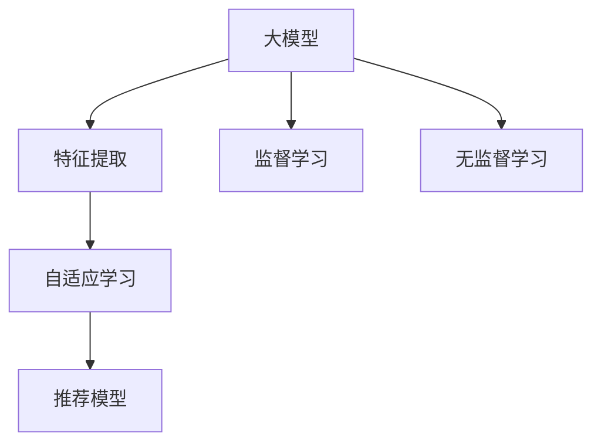

                 

## 1. 背景介绍

### 1.1 问题由来

推荐系统作为互联网时代的重要应用，通过用户行为数据来挖掘其兴趣偏好，从而为用户推荐感兴趣的商品或内容。然而，推荐系统的性能很大程度上依赖于其用户画像的准确性和多样性，而现有的推荐算法在处理海量稀疏数据和复杂交互时面临诸多挑战。

为了应对这些挑战，研究者们纷纷将目光投向了大模型在推荐系统中的应用。通过在通用大模型上进行自适应学习，可以从大规模无标签数据中学习到更普适、更高效的推荐模型。相较于传统推荐算法，大模型可以自动提取特征，无需手动设计复杂特征工程，并且能够适应多模态数据的输入，提供更为全面的推荐服务。

### 1.2 问题核心关键点

大模型在推荐系统中的自适应学习，其核心在于如何在大规模无标签数据中高效提取用户兴趣特征，并将其转化为推荐模型能够利用的形式。具体来说，涉及以下几个关键问题：

- **特征提取**：如何从用户行为数据中提取有效的特征向量。
- **自适应学习**：如何在预训练数据上进行自适应微调，学习推荐模型。
- **鲁棒性保证**：如何在模型推广到新用户时，保持较高的预测准确性和稳定性。

## 2. 核心概念与联系

### 2.1 核心概念概述

为更好地理解大模型在推荐系统中的自适应学习，本节将介绍几个密切相关的核心概念：

- **大模型**：以Transformer等架构为代表的预训练语言模型，如BERT、GPT等。通过在巨量无标签文本上预训练，学习到丰富的语言知识和常识。
- **自适应学习**：指在大模型的基础上，通过特定任务的监督学习或无监督学习来优化模型在新场景下的适应性，提升性能。
- **特征向量**：将用户行为数据编码为向量形式，用于推荐模型的输入。
- **监督学习**：利用标注数据来指导模型学习，提高预测准确性。
- **无监督学习**：仅利用未标注数据，发现数据中的潜在结构，以提升模型的泛化能力。
- **推荐模型**：将用户特征与物品特征进行映射，预测用户对物品的兴趣程度，并输出推荐结果的模型。

这些概念之间的逻辑关系可以通过以下Mermaid流程图来展示：



这个流程图展示了大模型在推荐系统中的应用流程：

1. 大模型学习大规模无标签数据，提取通用语言知识。
2. 特征提取器将用户行为数据编码为特征向量。
3. 自适应学习器在大模型上进行微调，学习推荐模型。
4. 推荐模型将用户和物品特征映射为推荐结果。

## 3. 核心算法原理 & 具体操作步骤

### 3.1 算法原理概述

大模型在推荐系统中的自适应学习，本质上是一种基于监督学习或无监督学习的微调方法。其核心思想是：将预训练的大模型看作一个强大的特征提取器，通过特定任务的监督数据对其进行微调，学习到推荐模型所需的特征表示，从而实现高效的推荐。

形式化地，假设预训练语言模型为 $M_{\theta}$，其中 $\theta$ 为预训练得到的模型参数。给定推荐系统的训练集 $D=\{(x_i, y_i)\}_{i=1}^N$，其中 $x_i$ 为用户行为数据，$y_i$ 为用户对物品的兴趣评分或是否点击的标签。微调的目标是找到新的模型参数 $\hat{\theta}$，使得：

$$
\hat{\theta} = \mathop{\arg\min}_{\theta} \mathcal{L}(M_{\theta},D)
$$

其中 $\mathcal{L}$ 为针对推荐任务设计的损失函数，用于衡量模型预测结果与真实标签之间的差异。常见的损失函数包括均方误差损失、交叉熵损失等。

### 3.2 算法步骤详解

大模型在推荐系统中的自适应学习一般包括以下几个关键步骤：

**Step 1: 准备预训练模型和数据集**
- 选择合适的预训练语言模型 $M_{\theta}$ 作为初始化参数，如 BERT、GPT 等。
- 准备推荐系统的训练集 $D=\{(x_i, y_i)\}_{i=1}^N$，划分为训练集、验证集和测试集。一般要求标注数据与预训练数据的分布不要差异过大。

**Step 2: 添加任务适配层**
- 根据推荐任务类型，在预训练模型顶层设计合适的输出层和损失函数。
- 对于分类任务，通常在顶层添加线性分类器和交叉熵损失函数。
- 对于回归任务，通常使用均方误差损失函数。

**Step 3: 设置微调超参数**
- 选择合适的优化算法及其参数，如 AdamW、SGD 等，设置学习率、批大小、迭代轮数等。
- 设置正则化技术及强度，包括权重衰减、Dropout、Early Stopping等。
- 确定冻结预训练参数的策略，如仅微调顶层，或全部参数都参与微调。

**Step 4: 执行梯度训练**
- 将训练集数据分批次输入模型，前向传播计算损失函数。
- 反向传播计算参数梯度，根据设定的优化算法和学习率更新模型参数。
- 周期性在验证集上评估模型性能，根据性能指标决定是否触发 Early Stopping。
- 重复上述步骤直到满足预设的迭代轮数或 Early Stopping 条件。

**Step 5: 测试和部署**
- 在测试集上评估微调后模型 $M_{\hat{\theta}}$ 的性能，对比微调前后的精度提升。
- 使用微调后的模型对新用户进行推荐，集成到实际的应用系统中。
- 持续收集新的用户数据，定期重新微调模型，以适应数据分布的变化。

以上是基于监督学习微调大模型在推荐系统中的应用流程。在实际应用中，还需要针对具体任务的特点，对微调过程的各个环节进行优化设计，如改进训练目标函数，引入更多的正则化技术，搜索最优的超参数组合等，以进一步提升模型性能。

### 3.3 算法优缺点

大模型在推荐系统中的自适应学习具有以下优点：
1. 高效特征提取：大模型具备强大的自动特征提取能力，能够在处理复杂用户行为数据时表现优异。
2. 广泛适用：适用于各种推荐任务，包括商品推荐、内容推荐、系统推荐等，设计简单的任务适配层即可实现微调。
3. 可解释性强：大模型通过多层结构逐步提取特征，每个层的作用都较为明确，易于解释和调试。
4. 鲁棒性高：大模型经过大规模预训练，具有较强的泛化能力和鲁棒性，能够适应多变的数据环境。

同时，该方法也存在一定的局限性：
1. 计算资源需求高：大模型的参数量较大，训练和推理需要较强的计算资源。
2. 模型复杂度高：大模型结构复杂，需要更多的计算资源进行训练和推理。
3. 数据依赖性强：微调的效果很大程度上取决于标注数据的质量和数量，获取高质量标注数据的成本较高。
4. 隐私和安全问题：用户行为数据涉及隐私，大模型的训练和推理需要严格的隐私保护和数据安全措施。

尽管存在这些局限性，但就目前而言，基于大模型微调的方法仍然是大规模推荐系统的重要技术手段。未来相关研究的重点在于如何进一步降低大模型对计算资源和标注数据的依赖，提高模型的泛化能力和隐私保护水平。

### 3.4 算法应用领域

大模型在推荐系统中的自适应学习，已经在电商、新闻、音乐、视频等多个领域得到了广泛的应用，成为推荐系统的主要技术手段。以下是几个典型的应用场景：

**电商推荐**：利用大模型对用户浏览记录、购买行为等数据进行分析，推荐其可能感兴趣的商品。通过微调，模型能够自动提取用户兴趣特征，提高推荐相关性和多样性。

**内容推荐**：对用户阅读、点赞、分享等行为数据进行建模，推荐相关文章、视频等内容。通过微调，模型能够自动学习用户对内容的喜好，提升推荐的精准度和覆盖面。

**系统推荐**：推荐用户可能感兴趣的系统功能或服务。通过微调，模型能够学习用户的使用习惯和偏好，提供个性化的服务推荐。

除了上述这些经典场景外，大模型在推荐系统中的应用还在不断扩展，如推荐广告、推荐视频、推荐活动等，为推荐系统带来了新的突破。

## 4. 数学模型和公式 & 详细讲解 & 举例说明

### 4.1 数学模型构建

假设推荐系统的用户行为数据为 $x \in \mathbb{R}^d$，物品特征数据为 $y \in \mathbb{R}^d$，大模型的参数为 $\theta$。则推荐模型的输出 $o$ 可以表示为：

$$
o = M_{\theta}(x)
$$

其中 $M_{\theta}$ 为预训练的大模型。推荐模型的目标函数为：

$$
\mathcal{L}(\theta) = \frac{1}{N} \sum_{i=1}^N \ell(y_i, o_i)
$$

其中 $\ell(y_i, o_i)$ 为损失函数，$o_i = M_{\theta}(x_i)$ 为模型在用户行为数据 $x_i$ 上的输出。

### 4.2 公式推导过程

以下我们以线性回归为例，推导微调的目标函数和梯度计算公式。

假设推荐任务为线性回归，用户行为数据 $x \in \mathbb{R}^d$，物品特征数据 $y \in \mathbb{R}$。则目标函数为：

$$
\mathcal{L}(\theta) = \frac{1}{N} \sum_{i=1}^N (y_i - o_i)^2
$$

其中 $o_i = M_{\theta}(x_i)$ 为模型在用户行为数据 $x_i$ 上的输出。

根据链式法则，目标函数对参数 $\theta_k$ 的梯度为：

$$
\frac{\partial \mathcal{L}(\theta)}{\partial \theta_k} = -\frac{2}{N} \sum_{i=1}^N (y_i - o_i) \frac{\partial o_i}{\partial \theta_k}
$$

其中 $\frac{\partial o_i}{\partial \theta_k}$ 可进一步递归展开，利用自动微分技术完成计算。

在得到目标函数的梯度后，即可带入优化算法，完成模型的迭代优化。重复上述过程直至收敛，最终得到适应推荐任务的最优模型参数 $\theta^*$。

### 4.3 案例分析与讲解

以电商推荐为例，我们将大模型BERT用于推荐模型。具体实现步骤如下：

1. 数据准备：收集用户浏览记录、购买历史等数据，作为训练集。
2. 模型构建：选择预训练的BERT模型作为特征提取器，设计合适的输出层和损失函数。
3. 微调训练：在大规模无标签文本数据上预训练BERT模型，在电商推荐数据集上微调。
4. 推荐实现：使用微调后的BERT模型预测用户对商品的兴趣评分，生成推荐列表。

在实际应用中，通常需要针对电商推荐任务的特点进行优化，如引入用户互动数据、考虑物品冷启动等问题。

## 5. 项目实践：代码实例和详细解释说明

### 5.1 开发环境搭建

在进行推荐系统开发前，我们需要准备好开发环境。以下是使用Python进行PyTorch开发的环境配置流程：

1. 安装Anaconda：从官网下载并安装Anaconda，用于创建独立的Python环境。

2. 创建并激活虚拟环境：
```bash
conda create -n pytorch-env python=3.8 
conda activate pytorch-env
```

3. 安装PyTorch：根据CUDA版本，从官网获取对应的安装命令。例如：
```bash
conda install pytorch torchvision torchaudio cudatoolkit=11.1 -c pytorch -c conda-forge
```

4. 安装TensorFlow：
```bash
pip install tensorflow
```

5. 安装TensorBoard：
```bash
pip install tensorboard
```

6. 安装PyTorch Transformers库：
```bash
pip install transformers
```

7. 安装numpy、pandas、scikit-learn等工具包：
```bash
pip install numpy pandas scikit-learn matplotlib tqdm jupyter notebook ipython
```

完成上述步骤后，即可在`pytorch-env`环境中开始推荐系统微调实践。

### 5.2 源代码详细实现

这里我们以电商推荐系统为例，使用PyTorch和Transformers库对BERT模型进行微调的完整代码实现。

首先，定义电商推荐任务的数据处理函数：

```python
from transformers import BertTokenizer
from torch.utils.data import Dataset
import torch

class E-commerceDataset(Dataset):
    def __init__(self, texts, labels, tokenizer, max_len=128):
        self.texts = texts
        self.labels = labels
        self.tokenizer = tokenizer
        self.max_len = max_len
        
    def __len__(self):
        return len(self.texts)
    
    def __getitem__(self, item):
        text = self.texts[item]
        label = self.labels[item]
        
        encoding = self.tokenizer(text, return_tensors='pt', max_length=self.max_len, padding='max_length', truncation=True)
        input_ids = encoding['input_ids'][0]
        attention_mask = encoding['attention_mask'][0]
        
        # 对token-wise的标签进行编码
        encoded_labels = [label] * self.max_len
        labels = torch.tensor(encoded_labels, dtype=torch.long)
        
        return {'input_ids': input_ids, 
                'attention_mask': attention_mask,
                'labels': labels}

# 创建dataset
tokenizer = BertTokenizer.from_pretrained('bert-base-cased')

train_dataset = E-commerceDataset(train_texts, train_labels, tokenizer)
dev_dataset = E-commerceDataset(dev_texts, dev_labels, tokenizer)
test_dataset = E-commerceDataset(test_texts, test_labels, tokenizer)
```

然后，定义模型和优化器：

```python
from transformers import BertForRegression
from torch.optim import AdamW

model = BertForRegression.from_pretrained('bert-base-cased', num_labels=len(tag2id))

optimizer = AdamW(model.parameters(), lr=2e-5)
```

接着，定义训练和评估函数：

```python
from torch.utils.data import DataLoader
from tqdm import tqdm
from sklearn.metrics import mean_squared_error

device = torch.device('cuda') if torch.cuda.is_available() else torch.device('cpu')
model.to(device)

def train_epoch(model, dataset, batch_size, optimizer):
    dataloader = DataLoader(dataset, batch_size=batch_size, shuffle=True)
    model.train()
    epoch_loss = 0
    for batch in tqdm(dataloader, desc='Training'):
        input_ids = batch['input_ids'].to(device)
        attention_mask = batch['attention_mask'].to(device)
        labels = batch['labels'].to(device)
        model.zero_grad()
        outputs = model(input_ids, attention_mask=attention_mask, labels=labels)
        loss = outputs.loss
        epoch_loss += loss.item()
        loss.backward()
        optimizer.step()
    return epoch_loss / len(dataloader)

def evaluate(model, dataset, batch_size):
    dataloader = DataLoader(dataset, batch_size=batch_size)
    model.eval()
    preds, labels = [], []
    with torch.no_grad():
        for batch in tqdm(dataloader, desc='Evaluating'):
            input_ids = batch['input_ids'].to(device)
            attention_mask = batch['attention_mask'].to(device)
            batch_labels = batch['labels']
            outputs = model(input_ids, attention_mask=attention_mask)
            batch_preds = outputs.logits.cpu().tolist()
            batch_labels = batch_labels.cpu().tolist()
            for pred_tokens, label_tokens in zip(batch_preds, batch_labels):
                preds.append(pred_tokens[:len(label_tokens)])
                labels.append(label_tokens)
                
    print(mean_squared_error(labels, preds))
```

最后，启动训练流程并在测试集上评估：

```python
epochs = 5
batch_size = 16

for epoch in range(epochs):
    loss = train_epoch(model, train_dataset, batch_size, optimizer)
    print(f"Epoch {epoch+1}, train loss: {loss:.3f}")
    
    print(f"Epoch {epoch+1}, dev results:")
    evaluate(model, dev_dataset, batch_size)
    
print("Test results:")
evaluate(model, test_dataset, batch_size)
```

以上就是使用PyTorch对BERT进行电商推荐系统微调的完整代码实现。可以看到，借助Transformers库的强大封装，我们可以用相对简洁的代码完成BERT模型的加载和微调。

### 5.3 代码解读与分析

让我们再详细解读一下关键代码的实现细节：

**E-commerceDataset类**：
- `__init__`方法：初始化文本、标签、分词器等关键组件。
- `__len__`方法：返回数据集的样本数量。
- `__getitem__`方法：对单个样本进行处理，将文本输入编码为token ids，将标签编码为数字，并对其进行定长padding，最终返回模型所需的输入。

**tokenizer变量**：
- 定义了BertTokenizer，用于将用户行为数据转换为token ids，并处理特殊符号。

**训练和评估函数**：
- 使用PyTorch的DataLoader对数据集进行批次化加载，供模型训练和推理使用。
- 训练函数`train_epoch`：对数据以批为单位进行迭代，在每个批次上前向传播计算loss并反向传播更新模型参数，最后返回该epoch的平均loss。
- 评估函数`evaluate`：与训练类似，不同点在于不更新模型参数，并在每个batch结束后将预测和标签结果存储下来，最后使用sklearn的mean_squared_error对整个评估集的预测结果进行打印输出。

**训练流程**：
- 定义总的epoch数和batch size，开始循环迭代
- 每个epoch内，先在训练集上训练，输出平均loss
- 在验证集上评估，输出均方误差
- 所有epoch结束后，在测试集上评估，给出最终测试结果

可以看到，PyTorch配合Transformers库使得BERT微调的代码实现变得简洁高效。开发者可以将更多精力放在数据处理、模型改进等高层逻辑上，而不必过多关注底层的实现细节。

当然，工业级的系统实现还需考虑更多因素，如模型的保存和部署、超参数的自动搜索、更灵活的任务适配层等。但核心的微调范式基本与此类似。

## 6. 实际应用场景

### 6.1 智能客服系统

基于大模型自适应学习的应用，智能客服系统可以显著提升用户体验和效率。传统客服系统依赖于人工处理，高峰期响应慢，难以实现个性化服务。使用大模型自适应学习，可以7x24小时不间断服务，自动理解用户意图，提供个性化回复，提升用户满意度。

在技术实现上，可以收集客服历史对话数据，构建监督数据集。在预训练的BERT模型上进行微调，使其学习到对不同问题的回答模板。对新用户的问题，系统可以自动匹配最佳答案模板，实现快速响应。对于复杂问题，系统还可以接入检索系统，实时搜索相关内容，提供动态生成的回答。

### 6.2 金融舆情监测

在金融领域，舆情监测对于及时了解市场动向、规避风险至关重要。传统人工监测方式成本高、效率低，难以应对海量信息。使用大模型自适应学习，可以自动分析金融新闻、评论等文本数据，识别出关键信息，实时预警负面事件，保障金融稳定。

具体而言，可以收集金融领域相关的新闻、报道、评论等文本数据，并对其进行主题标注和情感标注。在大模型上进行微调，使其学习到对不同主题和情感的识别能力。对实时抓取的网络文本数据，系统可以自动分析舆情趋势，一旦发现异常情况，自动预警，帮助金融机构快速应对潜在风险。

### 6.3 个性化推荐系统

当前的推荐系统往往只依赖用户历史行为数据，无法深入理解用户真实兴趣。基于大模型自适应学习，推荐系统可以更好地挖掘用户语义信息，提供个性化推荐。

在实践中，可以收集用户浏览、点击、评论等行为数据，提取和用户交互的物品标题、描述、标签等文本内容。将文本内容作为模型输入，用户的后续行为作为监督信号，在大模型上进行微调。微调后的模型能够从文本内容中准确把握用户兴趣点。在生成推荐列表时，先用候选物品的文本描述作为输入，由模型预测用户兴趣匹配度，再结合其他特征综合排序，便可以得到个性化程度更高的推荐结果。

### 6.4 未来应用展望

随着大模型和自适应学习方法的不断发展，推荐系统将在更多领域得到应用，为各行各业带来变革性影响。

在智慧医疗领域，基于大模型自适应学习的应用，可以提升医疗诊断的准确性和效率。通过微调，模型可以学习到医学领域的术语和知识，自动提取病例信息，预测疾病风险，辅助医生诊疗。

在智能教育领域，自适应学习可以应用于个性化教学、智能辅导等场景，因材施教，提升教学效果。通过微调，系统可以学习学生的学习行为和反馈，自动生成个性化的学习计划和内容。

在智慧城市治理中，自适应学习可以应用于城市事件监测、舆情分析、应急指挥等环节，提高城市管理的自动化和智能化水平，构建更安全、高效的未来城市。

此外，在企业生产、社会治理、文娱传媒等众多领域，基于大模型自适应学习的人工智能应用也将不断涌现，为传统行业数字化转型升级提供新的技术路径。相信随着技术的日益成熟，自适应学习范式将成为推荐系统的重要范式，推动人工智能技术在各行业的应用和发展。

## 7. 工具和资源推荐

### 7.1 学习资源推荐

为了帮助开发者系统掌握大模型自适应学习的理论基础和实践技巧，这里推荐一些优质的学习资源：

1. 《Transformer从原理到实践》系列博文：由大模型技术专家撰写，深入浅出地介绍了Transformer原理、BERT模型、自适应学习等前沿话题。

2. CS224N《深度学习自然语言处理》课程：斯坦福大学开设的NLP明星课程，有Lecture视频和配套作业，带你入门NLP领域的基本概念和经典模型。

3. 《Natural Language Processing with Transformers》书籍：Transformers库的作者所著，全面介绍了如何使用Transformers库进行NLP任务开发，包括自适应学习的诸多范式。

4. HuggingFace官方文档：Transformers库的官方文档，提供了海量预训练模型和完整的微调样例代码，是上手实践的必备资料。

5. CLUE开源项目：中文语言理解测评基准，涵盖大量不同类型的中文NLP数据集，并提供了基于自适应学习的baseline模型，助力中文NLP技术发展。

通过对这些资源的学习实践，相信你一定能够快速掌握大模型自适应学习的精髓，并用于解决实际的NLP问题。
###  7.2 开发工具推荐

高效的开发离不开优秀的工具支持。以下是几款用于大模型自适应学习开发的常用工具：

1. PyTorch：基于Python的开源深度学习框架，灵活动态的计算图，适合快速迭代研究。大部分预训练语言模型都有PyTorch版本的实现。

2. TensorFlow：由Google主导开发的开源深度学习框架，生产部署方便，适合大规模工程应用。同样有丰富的预训练语言模型资源。

3. Transformers库：HuggingFace开发的NLP工具库，集成了众多SOTA语言模型，支持PyTorch和TensorFlow，是进行自适应学习任务的开发的利器。

4. Weights & Biases：模型训练的实验跟踪工具，可以记录和可视化模型训练过程中的各项指标，方便对比和调优。与主流深度学习框架无缝集成。

5. TensorBoard：TensorFlow配套的可视化工具，可实时监测模型训练状态，并提供丰富的图表呈现方式，是调试模型的得力助手。

6. Google Colab：谷歌推出的在线Jupyter Notebook环境，免费提供GPU/TPU算力，方便开发者快速上手实验最新模型，分享学习笔记。

合理利用这些工具，可以显著提升大模型自适应学习任务的开发效率，加快创新迭代的步伐。

### 7.3 相关论文推荐

大模型自适应学习的研究源于学界的持续研究。以下是几篇奠基性的相关论文，推荐阅读：

1. Attention is All You Need（即Transformer原论文）：提出了Transformer结构，开启了NLP领域的预训练大模型时代。

2. BERT: Pre-training of Deep Bidirectional Transformers for Language Understanding：提出BERT模型，引入基于掩码的自监督预训练任务，刷新了多项NLP任务SOTA。

3. Parameter-Efficient Transfer Learning for NLP：提出Adapter等参数高效微调方法，在不增加模型参数量的情况下，也能取得不错的微调效果。

4. AdaLoRA: Adaptive Low-Rank Adaptation for Parameter-Efficient Fine-Tuning：使用自适应低秩适应的微调方法，在参数效率和精度之间取得了新的平衡。

5. Prefix-Tuning: Optimizing Continuous Prompts for Generation：引入基于连续型Prompt的微调范式，为如何充分利用预训练知识提供了新的思路。

6. Self-Adaptive Representation Learning for Recommender Systems：提出自适应表示学习框架，利用大模型学习用户-物品的表示关系，提升推荐系统的表现。

这些论文代表了大模型自适应学习的发展脉络。通过学习这些前沿成果，可以帮助研究者把握学科前进方向，激发更多的创新灵感。

## 8. 总结：未来发展趋势与挑战

### 8.1 总结

本文对大模型在推荐系统中的自适应学习进行了全面系统的介绍。首先阐述了推荐系统和大模型自适应学习的背景和意义，明确了自适应学习在提升推荐模型性能、泛化能力方面的独特价值。其次，从原理到实践，详细讲解了自适应学习的数学原理和关键步骤，给出了推荐系统微调任务的完整代码实例。同时，本文还广泛探讨了自适应学习在智能客服、金融舆情、个性化推荐等多个行业领域的应用前景，展示了自适应学习范式的巨大潜力。

通过本文的系统梳理，可以看到，基于大模型自适应学习的方法正在成为推荐系统的重要技术手段，极大地拓展了预训练语言模型的应用边界，催生了更多的落地场景。受益于大规模语料的预训练，自适应学习模型能够自动提取用户兴趣特征，提升推荐系统的精准度和覆盖面。未来，伴随大模型和自适应学习方法的持续演进，推荐系统必将在更广阔的应用领域大放异彩，深刻影响人类的生产生活方式。

### 8.2 未来发展趋势

展望未来，大模型自适应学习技术将呈现以下几个发展趋势：

1. 模型规模持续增大。随着算力成本的下降和数据规模的扩张，预训练语言模型的参数量还将持续增长。超大规模语言模型蕴含的丰富语言知识，有望支撑更加复杂多变的推荐模型微调。

2. 自适应方法日趋多样。除了传统的全参数微调外，未来会涌现更多自适应方法，如Adapter、Prefix等，在节省计算资源的同时也能保证微调精度。

3. 持续学习成为常态。随着数据分布的不断变化，自适应学习模型也需要持续学习新知识以保持性能。如何在不遗忘原有知识的同时，高效吸收新样本信息，将成为重要的研究课题。

4. 标注样本需求降低。受启发于提示学习(Prompt-based Learning)的思路，未来的自适应方法将更好地利用大模型的语言理解能力，通过更加巧妙的任务描述，在更少的标注样本上也能实现理想的微调效果。

5. 多模态自适应学习崛起。当前的自适应方法主要聚焦于纯文本数据，未来会进一步拓展到图像、视频、语音等多模态数据自适应学习。多模态信息的融合，将显著提升自适应模型对现实世界的理解和建模能力。

6. 推荐模型通用性增强。经过海量数据的自适应学习，自适应模型将具备更强大的常识推理和跨领域迁移能力，逐步迈向通用人工智能(AGI)的目标。

以上趋势凸显了大模型自适应学习技术的广阔前景。这些方向的探索发展，必将进一步提升推荐系统的性能和应用范围，为人类认知智能的进化带来深远影响。

### 8.3 面临的挑战

尽管大模型自适应学习技术已经取得了瞩目成就，但在迈向更加智能化、普适化应用的过程中，它仍面临着诸多挑战：

1. 标注成本瓶颈。虽然自适应学习大大降低了标注数据的需求，但对于长尾应用场景，难以获得充足的高质量标注数据，成为制约自适应学习性能的瓶颈。如何进一步降低自适应学习对标注样本的依赖，将是一大难题。

2. 模型鲁棒性不足。当前自适应模型面对域外数据时，泛化性能往往大打折扣。对于测试样本的微小扰动，自适应模型的预测也容易发生波动。如何提高自适应模型的鲁棒性，避免灾难性遗忘，还需要更多理论和实践的积累。

3. 推理效率有待提高。大规模语言模型虽然精度高，但在实际部署时往往面临推理速度慢、内存占用大等效率问题。如何在保证性能的同时，简化模型结构，提升推理速度，优化资源占用，将是重要的优化方向。

4. 可解释性亟需加强。当前自适应模型更像是"黑盒"系统，难以解释其内部工作机制和决策逻辑。对于医疗、金融等高风险应用，算法的可解释性和可审计性尤为重要。如何赋予自适应模型更强的可解释性，将是亟待攻克的难题。

5. 安全性有待保障。用户行为数据涉及隐私，大模型的训练和推理需要严格的隐私保护和数据安全措施。如何在保护用户隐私的同时，实现高效的自适应学习，将是重要的研究方向。

6. 知识整合能力不足。现有的自适应模型往往局限于任务内数据，难以灵活吸收和运用更广泛的先验知识。如何让自适应过程更好地与外部知识库、规则库等专家知识结合，形成更加全面、准确的信息整合能力，还有很大的想象空间。

正视自适应学习面临的这些挑战，积极应对并寻求突破，将是大模型自适应学习走向成熟的必由之路。相信随着学界和产业界的共同努力，这些挑战终将一一被克服，大模型自适应学习必将在构建人机协同的智能时代中扮演越来越重要的角色。

### 8.4 未来突破

面对大模型自适应学习所面临的种种挑战，未来的研究需要在以下几个方面寻求新的突破：

1. 探索无监督和半监督自适应学习方法。摆脱对大规模标注数据的依赖，利用自监督学习、主动学习等无监督和半监督范式，最大限度利用非结构化数据，实现更加灵活高效的自适应学习。

2. 研究参数高效和计算高效的自适应学习范式。开发更加参数高效的自适应方法，在固定大部分预训练参数的同时，只更新极少量的任务相关参数。同时优化自适应模型的计算图，减少前向传播和反向传播的资源消耗，实现更加轻量级、实时性的部署。

3. 融合因果和对比学习范式。通过引入因果推断和对比学习思想，增强自适应模型建立稳定因果关系的能力，学习更加普适、鲁棒的语言表征，从而提升模型泛化性和抗干扰能力。

4. 引入更多先验知识。将符号化的先验知识，如知识图谱、逻辑规则等，与神经网络模型进行巧妙融合，引导自适应过程学习更准确、合理的语言模型。同时加强不同模态数据的整合，实现视觉、语音等多模态信息与文本信息的协同建模。

5. 结合因果分析和博弈论工具。将因果分析方法引入自适应模型，识别出模型决策的关键特征，增强输出解释的因果性和逻辑性。借助博弈论工具刻画人机交互过程，主动探索并规避模型的脆弱点，提高系统稳定性。

6. 纳入伦理道德约束。在模型训练目标中引入伦理导向的评估指标，过滤和惩罚有害的输出倾向。同时加强人工干预和审核，建立模型行为的监管机制，确保输出符合人类价值观和伦理道德。

这些研究方向的探索，必将引领大模型自适应学习技术迈向更高的台阶，为构建安全、可靠、可解释、可控的智能系统铺平道路。面向未来，大模型自适应学习技术还需要与其他人工智能技术进行更深入的融合，如知识表示、因果推理、强化学习等，多路径协同发力，共同推动自然语言理解和智能交互系统的进步。只有勇于创新、敢于突破，才能不断拓展语言模型的边界，让智能技术更好地造福人类社会。

## 9. 附录：常见问题与解答

**Q1：自适应学习是否适用于所有推荐任务？**

A: 自适应学习在大多数推荐任务上都能取得不错的效果，特别是对于数据量较小的任务。但对于一些特定领域的任务，如医学、法律等，仅仅依靠通用语料预训练的模型可能难以很好地适应。此时需要在特定领域语料上进一步预训练，再进行自适应学习，才能获得理想效果。此外，对于一些需要时效性、个性化很强的任务，如对话、推荐等，自适应方法也需要针对性的改进优化。

**Q2：自适应过程中如何选择合适的学习率？**

A: 自适应学习的学习率一般要比预训练时小1-2个数量级，如果使用过大的学习率，容易破坏预训练权重，导致过拟合。一般建议从1e-5开始调参，逐步减小学习率，直至收敛。也可以使用warmup策略，在开始阶段使用较小的学习率，再逐渐过渡到预设值。需要注意的是，不同的优化器(如AdamW、Adafactor等)以及不同的学习率调度策略，可能需要设置不同的学习率阈值。

**Q3：自适应学习过程中如何缓解过拟合问题？**

A: 过拟合是自适应学习面临的主要挑战，尤其是在标注数据不足的情况下。常见的缓解策略包括：
1. 数据增强：通过回译、近义替换等方式扩充训练集
2. 正则化：使用L2正则、Dropout、Early Stopping等避免过拟合
3. 对抗训练：引入对抗样本，提高模型鲁棒性
4. 参数高效自适应方法：只调整少量参数(如Adapter、Prefix等)，减小过拟合风险
5. 多模型集成：训练多个自适应模型，取平均输出，抑制过拟合

这些策略往往需要根据具体任务和数据特点进行灵活组合。只有在数据、模型、训练、推理等各环节进行全面优化，才能最大限度地发挥大模型自适应学习的威力。

**Q4：自适应模型在落地部署时需要注意哪些问题？**

A: 将自适应模型转化为实际应用，还需要考虑以下因素：
1. 模型裁剪：去除不必要的层和参数，减小模型尺寸，加快推理速度
2. 量化加速：将浮点模型转为定点模型，压缩存储空间，提高计算效率
3. 服务化封装：将模型封装为标准化服务接口，便于集成调用
4. 弹性伸缩：根据请求流量动态调整资源配置，平衡服务质量和成本
5. 监控告警：实时采集系统指标，设置异常告警阈值，确保服务稳定性
6. 安全防护：采用访问鉴权、数据脱敏等措施，保障数据和模型安全

自适应学习模型在推荐系统中的应用，还需要针对具体推荐场景进行优化，如引入用户互动数据、考虑物品冷启动等问题。

**Q5：自适应学习过程中如何提升模型泛化能力？**

A: 提升模型泛化能力是自适应学习的重要目标。以下是一些常见方法：
1. 引入更多先验知识：将符号化的先验知识，如知识图谱、逻辑规则等，与神经网络模型进行巧妙融合，引导自适应过程学习更准确、合理的语言模型。
2. 多模态自适应学习：将视觉、语音等多模态数据与文本数据结合，提升自适应模型的泛化能力。
3. 对抗训练：引入对抗样本，提高模型鲁棒性，减少泛化误差。
4. 数据增强：通过回译、近义替换等方式扩充训练集，增加模型泛化能力。
5. 正则化技术：使用L2正则、Dropout等技术，避免过拟合，提升泛化能力。

这些方法可以灵活组合，提升自适应模型的泛化能力和鲁棒性。

---

作者：禅与计算机程序设计艺术 / Zen and the Art of Computer Programming

