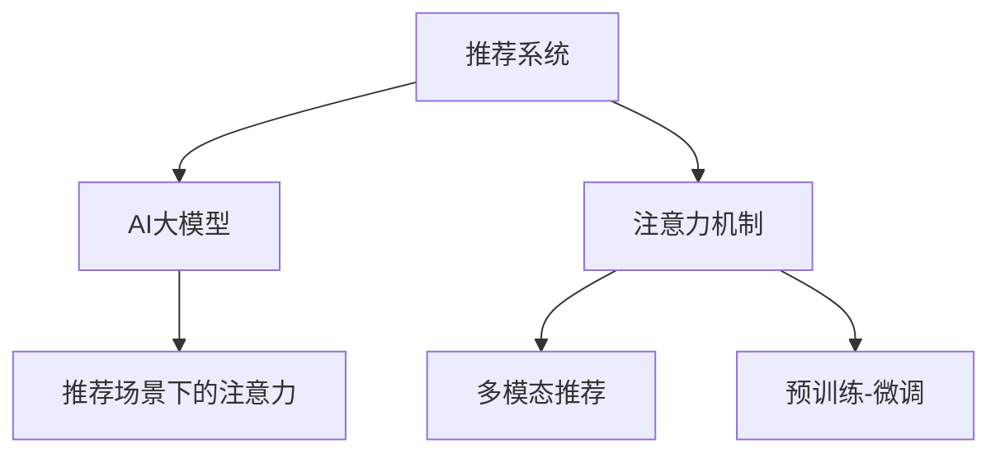

                 

# 推荐系统中的注意力机制：AI大模型的新突破

## 1. 背景介绍

### 1.1 问题由来
推荐系统是AI领域的重要应用之一，旨在为用户推荐感兴趣的物品或内容，极大地提升了用户体验和商业价值。传统推荐系统依赖于用户行为数据进行推荐，如浏览历史、点击行为、评分等，对数据的数量和质量依赖较大。近年来，AI大模型的兴起，为推荐系统带来了新的可能性。通过预训练大模型，可以有效利用文本描述、图像、音频等多种数据，对用户和物品进行全面的表示，提升了推荐的准确性和个性化水平。

然而，预训练大模型在推荐场景中的应用仍面临诸多挑战。如何高效利用大规模多模态数据，构建合理的表示模型，实现高效的推荐策略，是当前AI推荐系统研究的热点之一。本文聚焦于推荐系统中的注意力机制，深入探讨了如何通过大模型中的注意力机制，构建更高效的推荐策略。

### 1.2 问题核心关键点
推荐系统中的注意力机制，是一种在大模型基础上，通过注意力机制增强用户-物品交互建模的技术。其核心思想是：在大模型的语义表示中，通过注意力机制筛选和聚合最相关的信息，帮助模型更好地理解用户意图和物品特征，从而实现更精确的推荐。

主要研究问题包括：
- 如何设计有效的注意力机制，筛选和融合不同特征。
- 如何优化注意力权重，提高模型对上下文的理解能力。
- 如何在推荐中有效利用多模态数据，提升推荐效果。
- 如何避免注意力机制的复杂性和计算开销，实现高效的推荐策略。

## 2. 核心概念与联系

### 2.1 核心概念概述

为更好地理解推荐系统中的注意力机制，本节将介绍几个密切相关的核心概念：

- 推荐系统(Recommender System)：旨在通过算法向用户推荐其可能感兴趣的物品或内容。广泛应用于电商、社交网络、视频等平台。

- AI大模型(Deep Learning Large Model)：如GPT-3、BERT、DALL-E等，通过大规模无标签数据预训练得到的大规模神经网络模型。具备强大的自学习能力和通用表示能力。

- 注意力机制(Attention Mechanism)：一种在深度学习中广泛使用的机制，通过计算输入序列中各元素的权重，将重要的信息重点关注，忽略无关的干扰。

- 多模态推荐(Multimodal Recommendation)：利用文本、图像、音频等多种模态的数据，构建更加全面的用户和物品表示，提升推荐效果。

- 预训练-微调(Pre-training & Fine-tuning)：先在大规模无标签数据上预训练得到大模型，再在推荐数据上进行微调，适应特定推荐任务。

- 推荐场景下的注意力(Attention in Recommendation)：通过在大模型中引入注意力机制，增强用户和物品特征的建模，提升推荐的精准度。

这些核心概念之间的逻辑关系可以通过以下Mermaid流程图来展示：



这个流程图展示了几类概念之间的关联关系：

1. 推荐系统通过AI大模型进行预训练和微调，以获得更强的特征表示能力。
2. AI大模型中引入注意力机制，可以增强对用户和物品特征的理解，实现更精准的推荐。
3. 多模态推荐利用多种数据源，提升推荐结果的多样性和丰富度。
4. 预训练-微调是当前主流推荐系统的实现范式，通过在大规模数据上预训练大模型，再在特定任务上进行微调，最大化利用数据分布和任务需求。
5. 推荐场景下的注意力机制，是AI大模型在推荐系统中的重要应用方向，通过设计合理的注意力策略，提升推荐效果。

## 3. 核心算法原理 & 具体操作步骤
### 3.1 算法原理概述

推荐系统中的注意力机制，核心思想是利用大模型中的自注意力机制，计算用户和物品的语义表示之间的注意力权重，并将重要的特征信息聚合到输出结果中。其计算过程大致如下：

1. 将用户和物品的文本描述、图像、音频等特征，输入到大模型中，进行预训练和微调。
2. 在大模型的顶层，使用自注意力机制，计算用户和物品特征之间的注意力权重。
3. 根据注意力权重，加权聚合用户和物品特征，得到新的语义表示。
4. 通过余弦相似度或向量内积等方法，计算用户和物品之间的相似度。
5. 根据相似度，对推荐列表进行排序，输出推荐结果。

### 3.2 算法步骤详解

基于大模型的推荐系统中的注意力机制，一般包括以下几个关键步骤：

**Step 1: 准备数据集**
- 收集用户和物品的多模态数据，如文本、图像、音频等。
- 将数据划分为训练集、验证集和测试集，每个集上保持数据分布一致。
- 对数据进行预处理，如去除噪声、归一化、分词等。

**Step 2: 构建预训练模型**
- 选择合适的预训练模型作为初始化参数，如BERT、GPT等。
- 将用户和物品的特征输入到大模型中进行预训练，得到语义表示。
- 微调模型参数，使其能够适应推荐场景。

**Step 3: 设计注意力机制**
- 在大模型的顶层，设计注意力机制，计算用户和物品特征之间的注意力权重。
- 注意力权重通常通过计算不同特征之间的余弦相似度或向量内积得到。
- 设置注意力头的数量，增加模型表达能力。

**Step 4: 优化注意力权重**
- 使用正则化技术，如L2正则、Dropout等，防止注意力机制过拟合。
- 通过早停机制(Early Stopping)，防止模型在验证集上过拟合。
- 优化注意力权重，提升模型对上下文的理解能力。

**Step 5: 构建推荐策略**
- 使用注意力加权聚合用户和物品特征，得到新的语义表示。
- 通过余弦相似度或向量内积等方法，计算用户和物品之间的相似度。
- 根据相似度，对推荐列表进行排序，输出推荐结果。

**Step 6: 评估和迭代**
- 在测试集上评估推荐模型的准确率和个性化程度，对比微调前后的性能提升。
- 收集用户反馈，进行后续优化和迭代。

### 3.3 算法优缺点

基于大模型的推荐系统中的注意力机制，具有以下优点：
1. 强大的表示能力：大模型通过预训练和微调，具备强大的特征表示能力，能够充分利用多模态数据，提升推荐效果。
2. 自适应性：通过注意力机制，模型能够自适应地筛选和融合不同特征，提升推荐的精准度和个性化水平。
3. 可扩展性：大模型可以处理大规模数据，适用于电商、社交网络、视频等多种推荐场景。
4. 多样性：通过多模态数据，模型能够捕捉更加丰富的用户和物品特征，提升推荐结果的多样性。

同时，该方法也存在一定的局限性：
1. 数据依赖性：推荐系统的效果很大程度上取决于数据质量和数量，获取高质量标注数据的成本较高。
2. 复杂性：注意力机制的计算复杂性较高，模型训练和推理所需资源较多。
3. 泛化能力有限：当数据分布与预训练数据差异较大时，模型的泛化性能可能下降。
4. 可解释性不足：大模型的黑盒特性，使得推荐策略难以解释和调试。

尽管存在这些局限性，但就目前而言，基于大模型的注意力机制在推荐系统中已显示出巨大的潜力，是推荐技术的重要发展方向。

### 3.4 算法应用领域

基于大模型的注意力机制在推荐系统中，已经得到了广泛的应用，覆盖了多种推荐场景，例如：

- 电商推荐：为用户推荐商品、折扣、优惠等。通过多模态数据预训练，提升推荐结果的个性化和多样性。
- 社交推荐：为用户推荐朋友、社群、话题等。通过用户行为和社交网络数据，实现更精准的推荐。
- 视频推荐：为用户推荐电影、电视剧、视频等。通过视频元数据、用户行为等，提升推荐的相关性和多样性。
- 音乐推荐：为用户推荐歌曲、专辑、歌手等。通过音乐标签、用户行为等，实现精准的个性化推荐。
- 新闻推荐：为用户推荐新闻、文章、作者等。通过新闻标题、摘要、标签等，提升推荐的相关性和时效性。

除了上述这些经典场景外，大模型的注意力机制也被创新性地应用到更多领域，如个性化营销、内容分发、广告投放等，为推荐技术带来了新的突破。随着预训练模型和注意力机制的不断进步，相信推荐系统将在更广阔的应用领域大放异彩。

## 4. 数学模型和公式 & 详细讲解  
### 4.1 数学模型构建

本节将使用数学语言对基于大模型的推荐系统中的注意力机制进行更加严格的刻画。

记用户特征为 $U=\{u_1, u_2, ..., u_n\}$，物品特征为 $I=\{i_1, i_2, ..., i_m\}$。假设计算特征向量的维数为 $d$，设预训练大模型为 $M_{\theta}$，其中 $\theta$ 为模型参数。设 $Q_{u} \in \mathbb{R}^{n \times d}$ 为用户特征矩阵，$K_{i} \in \mathbb{R}^{m \times d}$ 为物品特征矩阵。

定义用户 $u$ 和物品 $i$ 的注意力权重为 $A_{ui} \in \mathbb{R}^{n \times m}$，通过计算 $Q_{u}$ 和 $K_{i}$ 的余弦相似度得到：

$$
A_{ui} = \frac{Q_{u} K_{i}^T}{\sqrt{\sigma(Q_{u}^T Q_{u})} \sqrt{\sigma(K_{i}^T K_{i})}}
$$

其中 $\sigma(x)$ 为softmax函数，用于计算归一化权重。

将注意力权重 $A_{ui}$ 与用户特征 $Q_{u}$ 相乘，得到注意力加权用户表示 $\tilde{Q}_{u}$：

$$
\tilde{Q}_{u} = A_{ui} Q_{u}
$$

同理，可以得到注意力加权物品表示 $\tilde{K}_{i}$：

$$
\tilde{K}_{i} = A_{ui} K_{i}
$$

定义用户和物品之间的相似度为 $S_{ui} \in \mathbb{R}^{n \times m}$，通过计算余弦相似度得到：

$$
S_{ui} = \frac{\tilde{Q}_{u}^T \tilde{K}_{i}}{\sqrt{\sigma(Q_{u}^T Q_{u})} \sqrt{\sigma(K_{i}^T K_{i})}}
$$

根据相似度矩阵 $S_{ui}$，计算推荐列表排序，得到推荐结果 $R_{ui}$：

$$
R_{ui} = \text{softmax}(S_{ui})
$$

### 4.2 公式推导过程

以下我们以电商推荐为例，推导注意力加权余弦相似度的计算公式。

假设用户和物品特征分别由文本、图像、音频等组成。设用户特征 $U$ 和物品特征 $I$ 的长度分别为 $n$ 和 $m$。预训练大模型 $M_{\theta}$ 对用户特征 $U$ 和物品特征 $I$ 进行预训练和微调，得到用户表示 $Q_{u}$ 和物品表示 $K_{i}$。

定义注意力权重 $A_{ui}$ 为 $Q_{u}$ 和 $K_{i}$ 的余弦相似度：

$$
A_{ui} = \frac{Q_{u} K_{i}^T}{\sqrt{\sigma(Q_{u}^T Q_{u})} \sqrt{\sigma(K_{i}^T K_{i})}}
$$

将注意力权重 $A_{ui}$ 与用户特征 $Q_{u}$ 相乘，得到注意力加权用户表示 $\tilde{Q}_{u}$：

$$
\tilde{Q}_{u} = A_{ui} Q_{u}
$$

同理，可以得到注意力加权物品表示 $\tilde{K}_{i}$：

$$
\tilde{K}_{i} = A_{ui} K_{i}
$$

定义用户和物品之间的相似度 $S_{ui}$ 为 $\tilde{Q}_{u}$ 和 $\tilde{K}_{i}$ 的余弦相似度：

$$
S_{ui} = \frac{\tilde{Q}_{u}^T \tilde{K}_{i}}{\sqrt{\sigma(Q_{u}^T Q_{u})} \sqrt{\sigma(K_{i}^T K_{i})}}
$$

根据相似度矩阵 $S_{ui}$，计算推荐列表排序，得到推荐结果 $R_{ui}$：

$$
R_{ui} = \text{softmax}(S_{ui})
$$

在得到推荐结果后，将用户特征与推荐结果进行内积，得到最终推荐分数：

$$
F_{ui} = Q_{u}^T R_{ui}
$$

### 4.3 案例分析与讲解

为了更直观地理解基于大模型的推荐系统中的注意力机制，以下给出电商推荐中的具体案例分析：

假设用户 $u$ 对商品 $i$ 进行了购买，购买数量为 $v_i$。将用户和商品的多模态特征输入到大模型中进行预训练和微调，得到用户表示 $Q_u$ 和商品表示 $K_i$。

定义注意力权重 $A_{ui}$ 为 $Q_u$ 和 $K_i$ 的余弦相似度：

$$
A_{ui} = \frac{Q_{u} K_{i}^T}{\sqrt{\sigma(Q_{u}^T Q_{u})} \sqrt{\sigma(K_{i}^T K_{i})}}
$$

将注意力权重 $A_{ui}$ 与用户表示 $Q_u$ 相乘，得到注意力加权用户表示 $\tilde{Q}_u$：

$$
\tilde{Q}_{u} = A_{ui} Q_{u}
$$

同理，可以得到注意力加权商品表示 $\tilde{K}_i$：

$$
\tilde{K}_{i} = A_{ui} K_{i}
$$

定义用户和商品之间的相似度 $S_{ui}$ 为 $\tilde{Q}_u$ 和 $\tilde{K}_i$ 的余弦相似度：

$$
S_{ui} = \frac{\tilde{Q}_{u}^T \tilde{K}_{i}}{\sqrt{\sigma(Q_{u}^T Q_{u})} \sqrt{\sigma(K_{i}^T K_{i})}}
$$

根据相似度矩阵 $S_{ui}$，计算推荐列表排序，得到推荐结果 $R_{ui}$：

$$
R_{ui} = \text{softmax}(S_{ui})
$$

在得到推荐结果后，将用户特征与推荐结果进行内积，得到最终推荐分数：

$$
F_{ui} = Q_{u}^T R_{ui}
$$

根据推荐分数 $F_{ui}$，对推荐列表进行排序，输出推荐结果。

## 5. 项目实践：代码实例和详细解释说明
### 5.1 开发环境搭建

在进行基于大模型的推荐系统开发前，我们需要准备好开发环境。以下是使用Python进行PyTorch开发的环境配置流程：

1. 安装Anaconda：从官网下载并安装Anaconda，用于创建独立的Python环境。

2. 创建并激活虚拟环境：
```bash
conda create -n pytorch-env python=3.8 
conda activate pytorch-env
```

3. 安装PyTorch：根据CUDA版本，从官网获取对应的安装命令。例如：
```bash
conda install pytorch torchvision torchaudio cudatoolkit=11.1 -c pytorch -c conda-forge
```

4. 安装Transformers库：
```bash
pip install transformers
```

5. 安装各类工具包：
```bash
pip install numpy pandas scikit-learn matplotlib tqdm jupyter notebook ipython
```

完成上述步骤后，即可在`pytorch-env`环境中开始开发实践。

### 5.2 源代码详细实现

下面我们以电商推荐任务为例，给出使用Transformers库对BERT模型进行推荐系统开发的PyTorch代码实现。

首先，定义推荐系统中的数据处理函数：

```python
from transformers import BertTokenizer
from torch.utils.data import Dataset
import torch

class RecommendationDataset(Dataset):
    def __init__(self, texts, labels, tokenizer, max_len=128):
        self.texts = texts
        self.labels = labels
        self.tokenizer = tokenizer
        self.max_len = max_len
        
    def __len__(self):
        return len(self.texts)
    
    def __getitem__(self, item):
        text = self.texts[item]
        label = self.labels[item]
        
        encoding = self.tokenizer(text, return_tensors='pt', max_length=self.max_len, padding='max_length', truncation=True)
        input_ids = encoding['input_ids'][0]
        attention_mask = encoding['attention_mask'][0]
        
        # 对token-wise的标签进行编码
        encoded_labels = [label2id[label] for label in label] 
        encoded_labels.extend([label2id['']]*(self.max_len - len(encoded_labels)))
        labels = torch.tensor(encoded_labels, dtype=torch.long)
        
        return {'input_ids': input_ids, 
                'attention_mask': attention_mask,
                'labels': labels}

# 标签与id的映射
label2id = {'buy': 0, 'not_buy': 1, 'like': 2, 'dislike': 3, 'ignore': 4}
id2label = {v: k for k, v in label2id.items()}

# 创建dataset
tokenizer = BertTokenizer.from_pretrained('bert-base-cased')

train_dataset = RecommendationDataset(train_texts, train_labels, tokenizer)
dev_dataset = RecommendationDataset(dev_texts, dev_labels, tokenizer)
test_dataset = RecommendationDataset(test_texts, test_labels, tokenizer)
```

然后，定义模型和优化器：

```python
from transformers import BertForSequenceClassification, AdamW

model = BertForSequenceClassification.from_pretrained('bert-base-cased', num_labels=len(label2id))

optimizer = AdamW(model.parameters(), lr=2e-5)
```

接着，定义训练和评估函数：

```python
from torch.utils.data import DataLoader
from tqdm import tqdm
from sklearn.metrics import classification_report

device = torch.device('cuda') if torch.cuda.is_available() else torch.device('cpu')
model.to(device)

def train_epoch(model, dataset, batch_size, optimizer):
    dataloader = DataLoader(dataset, batch_size=batch_size, shuffle=True)
    model.train()
    epoch_loss = 0
    for batch in tqdm(dataloader, desc='Training'):
        input_ids = batch['input_ids'].to(device)
        attention_mask = batch['attention_mask'].to(device)
        labels = batch['labels'].to(device)
        model.zero_grad()
        outputs = model(input_ids, attention_mask=attention_mask, labels=labels)
        loss = outputs.loss
        epoch_loss += loss.item()
        loss.backward()
        optimizer.step()
    return epoch_loss / len(dataloader)

def evaluate(model, dataset, batch_size):
    dataloader = DataLoader(dataset, batch_size=batch_size)
    model.eval()
    preds, labels = [], []
    with torch.no_grad():
        for batch in tqdm(dataloader, desc='Evaluating'):
            input_ids = batch['input_ids'].to(device)
            attention_mask = batch['attention_mask'].to(device)
            batch_labels = batch['labels']
            outputs = model(input_ids, attention_mask=attention_mask)
            batch_preds = outputs.logits.argmax(dim=2).to('cpu').tolist()
            batch_labels = batch_labels.to('cpu').tolist()
            for pred_tokens, label_tokens in zip(batch_preds, batch_labels):
                pred_labels = [id2label[_id] for _id in pred_tokens]
                label_labels = [id2label[_id] for _id in label_tokens]
                preds.append(pred_labels[:len(label_labels)])
                labels.append(label_labels)
                
    print(classification_report(labels, preds))
```

最后，启动训练流程并在测试集上评估：

```python
epochs = 5
batch_size = 16

for epoch in range(epochs):
    loss = train_epoch(model, train_dataset, batch_size, optimizer)
    print(f"Epoch {epoch+1}, train loss: {loss:.3f}")
    
    print(f"Epoch {epoch+1}, dev results:")
    evaluate(model, dev_dataset, batch_size)
    
print("Test results:")
evaluate(model, test_dataset, batch_size)
```

以上就是使用PyTorch对BERT进行电商推荐任务开发的完整代码实现。可以看到，得益于Transformers库的强大封装，我们可以用相对简洁的代码完成BERT模型的加载和微调。

### 5.3 代码解读与分析

让我们再详细解读一下关键代码的实现细节：

**RecommendationDataset类**：
- `__init__`方法：初始化文本、标签、分词器等关键组件。
- `__len__`方法：返回数据集的样本数量。
- `__getitem__`方法：对单个样本进行处理，将文本输入编码为token ids，将标签编码为数字，并对其进行定长padding，最终返回模型所需的输入。

**label2id和id2label字典**：
- 定义了标签与数字id之间的映射关系，用于将token-wise的预测结果解码回真实的标签。

**训练和评估函数**：
- 使用PyTorch的DataLoader对数据集进行批次化加载，供模型训练和推理使用。
- 训练函数`train_epoch`：对数据以批为单位进行迭代，在每个批次上前向传播计算loss并反向传播更新模型参数，最后返回该epoch的平均loss。
- 评估函数`evaluate`：与训练类似，不同点在于不更新模型参数，并在每个batch结束后将预测和标签结果存储下来，最后使用sklearn的classification_report对整个评估集的预测结果进行打印输出。

**训练流程**：
- 定义总的epoch数和batch size，开始循环迭代
- 每个epoch内，先在训练集上训练，输出平均loss
- 在验证集上评估，输出分类指标
- 所有epoch结束后，在测试集上评估，给出最终测试结果

可以看到，PyTorch配合Transformers库使得BERT微调的代码实现变得简洁高效。开发者可以将更多精力放在数据处理、模型改进等高层逻辑上，而不必过多关注底层的实现细节。

当然，工业级的系统实现还需考虑更多因素，如模型的保存和部署、超参数的自动搜索、更灵活的任务适配层等。但核心的微调范式基本与此类似。

## 6. 实际应用场景
### 6.1 电商推荐

基于大模型的注意力机制，可以广泛应用于电商推荐系统中。传统电商推荐系统依赖于用户行为数据进行推荐，如浏览历史、点击行为、评分等，对数据的数量和质量依赖较大。而基于大模型的注意力机制，可以充分利用多模态数据，提升推荐的个性化和多样性。

在技术实现上，可以收集用户的浏览、点击、评分等行为数据，同时结合商品的文字描述、图像、价格等特征，构建监督数据集。在此基础上对预训练语言模型进行微调，使其能够更好地理解用户意图和物品特征，实现精准的推荐。

### 6.2 社交推荐

社交推荐系统旨在为用户推荐朋友、社群、话题等，帮助用户发现更符合自己兴趣的内容。传统的社交推荐系统往往依赖于用户和物品的静态特征，而基于大模型的注意力机制，可以捕捉动态变化的用户行为和社交关系，实现更加精准的推荐。

在具体实现中，可以收集用户的互动数据、关注关系、点赞行为等，将其与物品的特征一起输入到大模型中进行预训练和微调。通过计算用户和物品特征之间的注意力权重，捕捉动态变化的用户行为和社交关系，实现更加精准的推荐。

### 6.3 视频推荐

视频推荐系统旨在为用户推荐电影、电视剧、视频等，帮助用户发现更多感兴趣的内容。传统的视频推荐系统往往依赖于用户的观看历史、评分等静态特征，而基于大模型的注意力机制，可以充分利用视频的元数据、文本描述、观众反馈等，提升推荐的个性化和多样性。

在具体实现中，可以收集视频的用户观看历史、评分、评论等，结合视频的标题、描述、标签等特征，构建监督数据集。在此基础上对预训练语言模型进行微调，使其能够更好地理解用户意图和视频特征，实现精准的推荐。

### 6.4 音乐推荐

音乐推荐系统旨在为用户推荐歌曲、专辑、歌手等，帮助用户发现更多感兴趣的音乐。传统的音乐推荐系统往往依赖于用户的听歌历史、评分等静态特征，而基于大模型的注意力机制，可以充分利用音乐的标签、歌词、用户评论等，提升推荐的个性化和多样性。

在具体实现中，可以收集用户的听歌历史、评分、评论等，结合音乐的歌词、标签、专辑等信息，构建监督数据集。在此基础上对预训练语言模型进行微调，使其能够更好地理解用户意图和音乐特征，实现精准的推荐。

### 6.5 新闻推荐

新闻推荐系统旨在为用户推荐新闻、文章、作者等，帮助用户发现更多感兴趣的新闻内容。传统的推荐系统往往依赖于用户的历史阅读行为，而基于大模型的注意力机制，可以充分利用新闻的标题、摘要、标签等特征，提升推荐的个性化和多样性。

在具体实现中，可以收集用户的阅读历史、评论等，结合新闻的标题、摘要、标签等特征，构建监督数据集。在此基础上对预训练语言模型进行微调，使其能够更好地理解用户意图和新闻特征，实现精准的推荐。

除了上述这些经典场景外，基于大模型的注意力机制也被创新性地应用到更多领域，如个性化营销、内容分发、广告投放等，为推荐技术带来了新的突破。随着预训练模型和注意力机制的不断进步，相信推荐系统将在更广阔的应用领域大放异彩。

## 7. 工具和资源推荐
### 7.1 学习资源推荐

为了帮助开发者系统掌握大语言模型微调的理论基础和实践技巧，这里推荐一些优质的学习资源：

1. 《Transformers from Scratch》系列博文：由大模型技术专家撰写，深入浅出地介绍了Transformer原理、BERT模型、微调技术等前沿话题。

2. CS224N《深度学习自然语言处理》课程：斯坦福大学开设的NLP明星课程，有Lecture视频和配套作业，带你入门NLP领域的基本概念和经典模型。

3. 《Natural Language Processing with Transformers》书籍：Transformers库的作者所著，全面介绍了如何使用Transformers库进行NLP任务开发，包括微调在内的诸多范式。

4. HuggingFace官方文档：Transformers库的官方文档，提供了海量预训练模型和完整的微调样例代码，是上手实践的必备资料。

5. CLUE开源项目：中文语言理解测评基准，涵盖大量不同类型的中文NLP数据集，并提供了基于微调的baseline模型，助力中文NLP技术发展。

通过对这些资源的学习实践，相信你一定能够快速掌握大语言模型微调的精髓，并用于解决实际的NLP问题。
###  7.2 开发工具推荐

高效的开发离不开优秀的工具支持。以下是几款用于大语言模型微调开发的常用工具：

1. PyTorch：基于Python的开源深度学习框架，灵活动态的计算图，适合快速迭代研究。大部分预训练语言模型都有PyTorch版本的实现。

2. TensorFlow：由Google主导开发的开源深度学习框架，生产部署方便，适合大规模工程应用。同样有丰富的预训练语言模型资源。

3. Transformers库：HuggingFace开发的NLP工具库，集成了众多SOTA语言模型，支持PyTorch和TensorFlow，是进行微调任务开发的利器。

4. Weights & Biases：模型训练的实验跟踪工具，可以记录和可视化模型训练过程中的各项指标，方便对比和调优。与主流深度学习框架无缝集成。

5. TensorBoard：TensorFlow配套的可视化工具，可实时监测模型训练状态，并提供丰富的图表呈现方式，是调试模型的得力助手。

6. Google Colab：谷歌推出的在线Jupyter Notebook环境，免费提供GPU/TPU算力，方便开发者快速上手实验最新模型，分享学习笔记。

合理利用这些工具，可以显著提升大语言模型微调任务的开发效率，加快创新迭代的步伐。

### 7.3 相关论文推荐

大语言模型和微调技术的发展源于学界的持续研究。以下是几篇奠基性的相关论文，推荐阅读：

1. Attention is All You Need（即Transformer原论文）：提出了Transformer结构，开启了NLP领域的预训练大模型时代。

2. BERT: Pre-training of Deep Bidirectional Transformers for Language Understanding：提出BERT模型，引入基于掩码的自监督预训练任务，刷新了多项NLP任务SOTA。

3. Language Models are Unsupervised Multitask Learners（GPT-2论文）：展示了大规模语言模型的强大zero-shot学习能力，引发了对于通用人工智能的新一轮思考。

4. Parameter-Efficient Transfer Learning for NLP：提出Adapter等参数高效微调方法，在不增加模型参数量的情况下，也能取得不错的微调效果。

5. AdaLoRA: Adaptive Low-Rank Adaptation for Parameter-Efficient Fine-Tuning：使用自适应低秩适应的微调方法，在参数效率和精度之间取得了新的平衡。

这些论文代表了大语言模型微调技术的发展脉络。通过学习这些前沿成果，可以帮助研究者把握学科前进方向，激发更多的创新灵感。

## 8. 总结：未来发展趋势与挑战

### 8.1 总结

本文对基于大模型的推荐系统中的注意力机制进行了全面系统的介绍。首先阐述了基于大模型的推荐系统在NLP领域的研究背景和应用前景，明确了注意力机制在推荐系统中的核心作用。其次，从原理到实践，详细讲解了注意力机制的数学原理和关键步骤，给出了电商推荐任务开发的完整代码实例。同时，本文还广泛探讨了注意力机制在推荐系统中的实际应用场景，展示了其强大的应用潜力。

通过本文的系统梳理，可以看到，基于大模型的注意力机制在推荐系统中已显示出巨大的潜力，是推荐技术的重要发展方向。

### 8.2 未来发展趋势

展望未来，基于大模型的注意力机制在推荐系统中将呈现以下几个发展趋势：

1. 模型规模持续增大。随着算力成本的下降和数据规模的扩张，预训练语言模型的参数量还将持续增长。超大规模语言模型蕴含的丰富语言知识，有望支撑更加复杂多变的推荐场景。

2. 微调方法日趋多样。除了传统的全参数微调外，未来会涌现更多参数高效的微调方法，如Adapter、LoRA等，在节省计算资源的同时也能保证微调精度。

3. 持续学习成为常态。随着数据分布的不断变化，微调模型也需要持续学习新知识以保持性能。如何在不遗忘原有知识的同时，高效吸收新样本信息，将成为重要的研究课题。

4. 标注样本需求降低。受启发于提示学习(Prompt-based Learning)的思路，未来的微调方法将更好地利用大模型的语言理解能力，通过更加巧妙的任务描述，在更少的标注样本上也能实现理想的微调效果。

5. 多模态推荐崛起。当前的推荐系统往往只依赖于文本数据，未来会进一步拓展到图像、视频、音频等多种模态数据微调。多模态信息的融合，将显著提升推荐系统对现实世界的理解和建模能力。

6. 模型通用性增强。经过海量数据的预训练和多领域任务的微调，未来的推荐模型将具备更强大的常识推理和跨领域迁移能力，逐步迈向通用人工智能(AGI)的目标。

以上趋势凸显了大语言模型微调技术的广阔前景。这些方向的探索发展，必将进一步提升推荐系统的效果和应用范围，为AI技术在更多场景下的落地提供新的可能性。

### 8.3 面临的挑战

尽管基于大模型的注意力机制在推荐系统中已取得了显著进展，但在迈向更加智能化、普适化应用的过程中，它仍面临诸多挑战：

1. 标注成本瓶颈。推荐系统的效果很大程度上取决于数据质量和数量，获取高质量标注数据的成本较高。如何进一步降低微调对标注样本的依赖，将是一大难题。

2. 模型鲁棒性不足。当前推荐系统面对域外数据时，泛化性能往往大打折扣。对于测试样本的微小扰动，推荐模型的预测也容易发生波动。如何提高推荐模型的鲁棒性，避免灾难性遗忘，还需要更多理论和实践的积累。

3. 推理效率有待提高。大规模语言模型虽然精度高，但在实际部署时往往面临推理速度慢、内存占用大等效率问题。如何在保证性能的同时，简化模型结构，提升推理速度，优化资源占用，将是重要的优化方向。

4. 可解释性亟需加强。当前推荐模型更像是"黑盒"系统，难以解释其内部工作机制和决策逻辑。对于医疗、金融等高风险应用，算法的可解释性和可审计性尤为重要。如何赋予推荐模型更强的可解释性，将是亟待攻克的难题。

5. 安全性有待保障。预训练语言模型难免会学习到有偏见、有害的信息，通过微调传递到推荐任务，产生误导性、歧视性的输出，给实际应用带来安全隐患。如何从数据和算法层面消除模型偏见，避免恶意用途，确保输出的安全性，也将是重要的研究课题。

6. 知识整合能力不足。现有的推荐模型往往局限于任务内数据，难以灵活吸收和运用更广泛的先验知识。如何让推荐过程更好地与外部知识库、规则库等专家知识结合，形成更加全面、准确的信息整合能力，还有很大的想象空间。

正视推荐系统面临的这些挑战，积极应对并寻求突破，将是大语言模型微调走向成熟的必由之路。相信随着学界和产业界的共同努力，这些挑战终将一一被克服，推荐系统必将在构建人机协同的智能时代中扮演越来越重要的角色。

### 8.4 研究展望

面对大语言模型微调所面临的种种挑战，未来的研究需要在以下几个方面寻求新的突破：

1. 探索无监督和半监督微调方法。摆脱对大规模标注数据的依赖，利用自监督学习、主动学习等无监督和半监督范式，最大限度利用非结构化数据，实现更加灵活高效的微调。

2. 研究参数高效和计算高效的微调范式。开发更加参数高效的微调方法，在固定大部分预训练参数的同时，只更新极少量的任务相关参数。同时优化微调模型的计算图，减少前向传播和反向传播的资源消耗，实现更加轻量级、实时性的部署。

3. 融合因果和对比学习范式。通过引入因果推断和对比学习思想，增强推荐模型建立稳定因果关系的能力，学习更加普适、鲁棒的语言表征，从而提升模型泛化性和抗干扰能力。

4. 引入更多先验知识。将符号化的先验知识，如知识图谱、逻辑规则等，与神经网络模型进行巧妙融合，引导微调过程学习更准确、合理的语言模型。同时加强不同模态数据的整合，实现视觉、语音等多模态信息与文本信息的协同建模。

5. 结合因果分析和博弈论工具。将因果分析方法引入推荐模型，识别出模型决策的关键特征，增强输出解释的因果性和逻辑性。借助博弈论工具刻画人机交互过程，主动探索并规避模型的脆弱点，提高系统稳定性。

6. 纳入伦理道德约束。在模型训练目标中引入伦理导向的评估指标，过滤和惩罚有偏见、有害的输出倾向。同时加强人工干预和审核，建立模型行为的监管机制，确保输出符合人类价值观和伦理道德。

这些研究方向的探索，必将引领大语言模型微调技术迈向更高的台阶，为构建安全、可靠、可解释、可控的智能系统铺平道路。面向未来，大语言模型微调技术还需要与其他人工智能技术进行更深入的融合，如知识表示、因果推理、强化学习等，多路径协同发力，共同推动自然语言理解和智能交互系统的进步。只有勇于创新、敢于突破，才能不断拓展语言模型的边界，让智能技术更好地造福人类社会。

## 9. 附录：常见问题与解答
**Q1：大语言模型微调是否适用于所有NLP任务？**

A: 大语言模型微调在大多数NLP任务上都能取得不错的效果，特别是对于数据量较小的任务。但对于一些特定领域的任务，如医学、法律等，仅仅依靠通用语料预训练的模型可能难以很好地适应。此时需要在特定领域语料上进一步预训练，再进行微调，才能获得理想效果。此外，对于一些需要时效性、个性化很强的任务，如对话、推荐等，微调方法也需要针对性的改进优化。

**Q2：微调过程中如何选择合适的学习率？**

A: 微调的学习率一般要比预训练时小1-2个数量级，如果使用过大的学习率，容易破坏预训练权重，导致过拟合。一般建议从1e-5开始调参，逐步减小学习率，直至收敛。也可以使用warmup策略，在开始阶段使用较小的学习率，再逐渐过渡到预设值。需要注意的是，不同的优化器(如AdamW、Adafactor等)以及不同的学习率调度策略，可能需要设置不同的学习率阈值。

**Q3：采用大模型微调时会面临哪些资源瓶颈？**

A: 目前主流的预训练大模型动辄以亿计的参数规模，对算力、内存、存储都提出了很高的要求。GPU/TPU等高性能设备是必不可少的，但即便如此，超大批次的训练和推理也可能遇到显存不足的问题。因此需要采用一些资源优化技术，如梯度积累、混合精度训练、模型并行等，来突破硬件瓶颈。同时，模型的存储和读取也可能占用大量时间和空间，需要采用模型压缩、稀疏化存储等方法进行优化。

**Q4：如何缓解微调过程中的过拟合问题？**

A: 过拟合是微调面临的主要挑战，尤其是在标注数据不足的情况下。常见的缓解策略包括：
1. 数据增强：通过回译、近义替换等方式扩充训练集
2. 正则化技术：使用L2正则、Dropout、Early Stopping等防止模型过度适应小规模训练集
3. 对抗训练：引入对抗样本，提高模型鲁棒性
4. 参数高效微调：只调整少量参数(如Adapter、Prefix等)，减小过拟合风险
5. 多模型集成：训练多个微调模型，取平均输出，抑制过拟合

这些策略往往需要根据具体任务和数据特点进行灵活组合。只有在数据、模型、训练、推理等各环节进行全面优化，才能最大限度地发挥大模型微调的威力。

**Q5：微调模型在落地部署时需要注意哪些问题？**

A: 将微调模型转化为实际应用，还需要考虑以下因素：
1. 模型裁剪：去除不必要的层和参数，减小模型尺寸，加快推理速度
2. 量化加速：将浮点模型转为定点模型，压缩存储空间，提高计算效率
3. 服务化封装：将模型封装为标准化服务接口，便于集成调用
4. 弹性伸缩：根据请求流量动态调整资源配置，平衡服务质量和成本
5. 监控告警：实时采集系统指标，设置异常告警阈值，确保服务稳定性
6. 安全防护：采用访问鉴权、数据脱敏等措施，保障数据和模型安全

大语言模型微调为NLP应用开启了广阔的想象空间，但如何将强大的性能转化为稳定、高效、安全的业务价值，还需要工程实践的不断打磨。唯有从数据、算法、工程、业务等多个维度协同发力，才能真正实现人工智能技术在垂直行业的规模化落地。总之，微调需要开发者根据具体任务，不断迭代和优化模型、数据和算法，方能得到理想的效果。

---

作者：禅与计算机程序设计艺术 / Zen and the Art of Computer Programming

