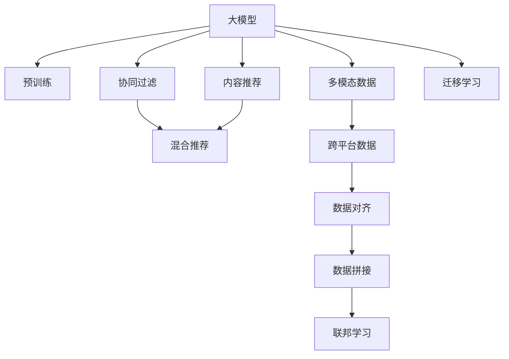

                 

# 推荐系统中的跨平台数据利用：大模型的新思路

> 关键词：跨平台数据利用,推荐系统,大模型,协同过滤,内容推荐,混合推荐

## 1. 背景介绍

### 1.1 问题由来
在推荐系统领域，数据的多样性和异构性始终是一个重要的挑战。用户和物品数据通常分布在不同的平台、系统和格式中，彼此间的数据无法直接互通，这极大限制了推荐系统的效果和覆盖范围。特别是在大模型时代，数据的多样性和规模不断扩大，如何有效利用这些跨平台数据成为亟需解决的问题。

推荐系统的核心目标是通过分析用户历史行为数据，为用户推荐符合其兴趣和需求的内容。传统的推荐方法主要基于协同过滤和内容推荐两种方式。协同过滤依赖用户之间的相似性进行推荐，而内容推荐则关注物品本身属性。但这些方法通常局限于单一平台的数据，难以充分利用跨平台的数据资源，造成推荐的泛化能力和精准度不足。

随着深度学习技术和大模型的发展，推荐系统的技术范式也发生了根本变革。大模型通过自监督和监督学习，可以从大规模数据中学习丰富的特征表示，具备强大的泛化能力。如何在大模型的框架下，实现跨平台数据的利用，成为提升推荐系统效果的关键问题。

### 1.2 问题核心关键点
本节将重点介绍大模型在推荐系统中的应用，以及如何通过跨平台数据利用提升推荐性能的关键点：

1. **多平台数据融合**：整合来自不同平台的用户的特征数据，构建统一的用户表示。
2. **多模态数据融合**：将用户的文本数据、图片数据、行为数据等不同类型的信息进行融合。
3. **数据对齐和拼接**：解决不同平台数据格式不一致的问题，进行数据对齐和拼接。
4. **跨平台迁移学习**：利用预训练模型在多个平台上的知识迁移，提升推荐性能。
5. **联邦学习**：在多平台分布式环境中，通过本地训练和聚合更新，实现数据的联合优化。

这些关键点将帮助读者理解大模型在推荐系统中的作用，以及跨平台数据利用如何带来新的思路。

## 2. 核心概念与联系

### 2.1 核心概念概述

为了更好地理解大模型在推荐系统中的应用，本节将介绍几个密切相关的核心概念：

- **大模型(Large Models)**：以自回归模型（如GPT）或自编码模型（如BERT）为代表的大规模预训练模型。通过在大规模数据上进行预训练，学习通用的语言表示，具备强大的语言理解和生成能力。
- **协同过滤(Collaborative Filtering)**：通过分析用户之间的相似性，推荐用户可能感兴趣的物品。
- **内容推荐(Content-Based Recommendation)**：根据物品的属性特征，为用户推荐相关的物品。
- **混合推荐(Hybrid Recommendation)**：将协同过滤和内容推荐相结合，综合利用用户行为数据和物品属性数据，提高推荐精度。
- **联邦学习(Federated Learning)**：在多个分布式设备上本地训练模型，通过聚合更新实现全局优化，保护数据隐私。
- **多模态数据(Multimodal Data)**：用户和物品数据不仅包含文本信息，还可能包括图片、视频、行为等不同类型的信息。
- **跨平台数据(Cross-Platform Data)**：用户和物品数据分散在不同平台、系统和格式中，需要进行数据对齐和拼接。
- **迁移学习(Transfer Learning)**：通过在大模型上预训练的知识迁移，提升小样本数据上的推荐效果。

这些核心概念之间的逻辑关系可以通过以下Mermaid流程图来展示：



这个流程图展示了大模型在推荐系统中的应用框架，以及跨平台数据利用的关键步骤：

1. 大模型通过预训练获得基础能力。
2. 协同过滤和内容推荐是大模型的两种重要应用方向。
3. 混合推荐利用多模态数据，综合协同过滤和内容推荐。
4. 跨平台数据需要对齐和拼接。
5. 联邦学习在多平台分布式环境中，通过本地训练和聚合更新，实现数据的联合优化。
6. 迁移学习利用大模型在不同平台上的知识迁移，提升推荐性能。

这些概念共同构成了推荐系统的技术基础，使大模型能够更好地应用于跨平台数据的利用。通过理解这些核心概念，我们可以更好地把握推荐系统的工作原理和优化方向。

## 3. 核心算法原理 & 具体操作步骤

### 3.1 算法原理概述

跨平台数据利用在大模型推荐系统中，主要通过以下步骤实现：

1. **数据收集**：从不同平台收集用户和物品的特征数据。
2. **数据对齐**：将不同格式的数据进行对齐和拼接。
3. **特征提取**：利用大模型进行特征提取，构建统一的用户和物品表示。
4. **迁移学习**：在大模型上进行预训练，利用跨平台数据提升模型的泛化能力。
5. **推荐预测**：将用户表示输入模型，预测用户可能感兴趣的物品。

### 3.2 算法步骤详解

**Step 1: 数据收集**
- 从不同平台收集用户和物品的特征数据，如用户浏览历史、评分记录、物品描述、图片等。
- 数据收集时需注意隐私保护，如匿名化处理等。

**Step 2: 数据对齐**
- 对不同平台的数据进行格式转换，统一数据格式。
- 使用时间戳、设备ID等特征进行对齐，解决数据缺失和重复问题。

**Step 3: 特征提取**
- 利用预训练语言模型，如BERT、GPT等，对用户和物品的文本特征进行编码，得到高维表示向量。
- 对图像、视频等非文本特征，可以通过预训练的视觉模型进行提取，得到特征向量。

**Step 4: 迁移学习**
- 在大模型上进行预训练，学习通用的特征表示。
- 将预训练模型在不同平台上的知识进行迁移，利用跨平台数据提升模型的泛化能力。

**Step 5: 推荐预测**
- 将用户表示输入大模型，通过多模态融合、协同过滤等方法进行推荐预测。
- 利用联邦学习等分布式优化技术，进行多平台联合训练和更新。

### 3.3 算法优缺点

跨平台数据利用在大模型推荐系统中，具有以下优点：

1. **数据多样性**：通过整合不同平台的数据，可以获取更多的用户和物品特征，提升推荐精度。
2. **泛化能力**：预训练模型在多平台上的知识迁移，提升了模型在新的数据分布上的泛化能力。
3. **模型效率**：大模型在特征提取和推理上的高效性能，提高了推荐系统的响应速度。

同时，该方法也存在一定的局限性：

1. **数据隐私**：跨平台数据收集和处理需注意用户隐私保护，防止数据泄露。
2. **对齐复杂度**：不同平台数据格式和质量不一致，需要进行复杂的对齐和拼接工作。
3. **计算成本**：大规模数据预训练和迁移学习需要大量的计算资源。
4. **模型复杂性**：多模态数据融合和混合推荐增加了模型的复杂性，可能导致过拟合。

尽管存在这些局限性，但跨平台数据利用仍是提升推荐系统性能的重要手段。未来相关研究的重点在于如何进一步降低数据对齐的复杂度，提高模型的计算效率，同时兼顾隐私保护和可解释性等因素。

### 3.4 算法应用领域

大模型在推荐系统中的应用，不仅限于传统的电商和新闻推荐，还拓展到了更多场景：

- **社交推荐**：在社交平台（如微信、微博）上，为用户推荐可能感兴趣的朋友、文章和话题。
- **内容平台推荐**：在视频、音频平台（如B站、网易云音乐）上，为用户推荐感兴趣的视频、音乐和播客。
- **健康医疗推荐**：在健康应用（如丁香医生）上，为患者推荐合适的医生、药物和治疗方案。
- **金融推荐**：在金融平台（如理财、投资）上，为用户推荐合适的投资产品、理财方案和金融新闻。
- **教育推荐**：在教育平台（如Coursera、Udacity）上，为用户推荐合适的课程和学习资源。
- **旅游推荐**：在旅游平台（如携程、Tripadvisor）上，为用户推荐目的地、酒店和旅游线路。

除了上述这些经典应用外，大模型在推荐系统中的应用还在不断拓展，为各行各业带来新的技术突破。

## 4. 数学模型和公式 & 详细讲解

### 4.1 数学模型构建

本节将使用数学语言对跨平台数据利用在大模型推荐系统中的应用进行更加严格的刻画。

记用户表示为 $U=\{u_1,u_2,...,u_N\}$，物品表示为 $I=\{i_1,i_2,...,i_M\}$，跨平台数据集为 $D=\{(x_i,y_i)\}_{i=1}^N$。

定义用户和物品的特征提取函数 $f:X \rightarrow Y$，其中 $X$ 为用户或物品的特征空间，$Y$ 为特征表示空间。假设特征提取函数 $f$ 是通过预训练模型学习的，即 $f \approx M_{\theta}$，其中 $M_{\theta}$ 为预训练语言模型，$\theta$ 为模型参数。

在数据对齐和拼接后，用户和物品的表示向量可以表示为 $u \in \mathbb{R}^{d_u}$，$i \in \mathbb{R}^{d_i}$，其中 $d_u$ 和 $d_i$ 为用户和物品表示向量的维度。

### 4.2 公式推导过程

以下我们以协同过滤为基础，推导利用大模型进行跨平台数据利用的基本公式。

假设用户 $u$ 对物品 $i$ 的评分（或点击、购买等行为）为 $y_i$，评分矩阵 $R \in \mathbb{R}^{N \times M}$。目标是为用户 $u$ 推荐物品 $i$，预测其评分 $y_i^*$。

协同过滤的方法包括基于用户的协同过滤和基于物品的协同过滤。基于用户的协同过滤方法，以用户 $u$ 的相似用户为参考，进行评分预测：

$$
y_i^* = \alpha \sum_{j=1}^N y_j \mathbb{I}(u_j,i) w_j
$$

其中 $\mathbb{I}(u_j,i)$ 为指示函数，$w_j$ 为相似度权重，$\alpha$ 为缩放系数。

基于物品的协同过滤方法，以物品 $i$ 的相似物品为参考，进行评分预测：

$$
y_i^* = \beta \sum_{j=1}^M y_j \mathbb{I}(i_j,i) w_j
$$

其中 $\mathbb{I}(i_j,i)$ 为指示函数，$w_j$ 为相似度权重，$\beta$ 为缩放系数。

在大模型推荐系统中，可以进一步利用大模型的特征表示，提升协同过滤的效果。假设用户和物品的特征表示向量为 $u \in \mathbb{R}^{d_u}$，$i \in \mathbb{R}^{d_i}$，则利用大模型进行协同过滤的预测公式为：

$$
y_i^* = \gamma f(u) f^T(i)
$$

其中 $f(u)$ 和 $f(i)$ 分别表示用户和物品的特征表示向量，$\gamma$ 为缩放系数。

### 4.3 案例分析与讲解

**案例1: 社交平台推荐**

社交平台（如微信、微博）的数据通常包括用户的历史行为数据、好友关系、点赞、评论等。通过这些数据，可以构建用户的兴趣表示和好友关系表示，进行跨平台数据利用：

- **数据收集**：从微信、微博等社交平台收集用户的互动数据、好友关系等。
- **数据对齐**：对不同平台的数据进行格式转换和对齐，得到统一的特征表示。
- **特征提取**：利用预训练语言模型（如BERT）对用户的互动数据进行编码，得到高维表示向量。
- **协同过滤**：利用用户的兴趣表示和好友关系表示，进行基于用户的协同过滤推荐。
- **混合推荐**：结合用户的互动数据和好友关系数据，综合利用协同过滤和内容推荐方法，提升推荐精度。

**案例2: 视频平台推荐**

视频平台（如B站、网易云音乐）的数据包括用户的视频观看历史、点赞、评论等，以及视频的内容标签、分类等。通过这些数据，可以构建用户的兴趣表示和视频标签表示，进行跨平台数据利用：

- **数据收集**：从B站、网易云音乐等平台收集用户的视频观看历史、点赞、评论等。
- **数据对齐**：对不同平台的数据进行格式转换和对齐，得到统一的特征表示。
- **特征提取**：利用预训练语言模型（如BERT）对视频标题、描述进行编码，得到高维表示向量。
- **协同过滤**：利用用户的兴趣表示和视频标签表示，进行基于物品的协同过滤推荐。
- **混合推荐**：结合用户的观看历史和视频标签，综合利用协同过滤和内容推荐方法，提升推荐精度。

以上案例展示了不同平台下跨平台数据利用的基本思路和方法。在实际应用中，还需要根据具体任务的特点，对数据收集、特征提取、协同过滤等环节进行优化设计。

## 5. 项目实践：代码实例和详细解释说明

### 5.1 开发环境搭建

在进行跨平台数据利用实践前，我们需要准备好开发环境。以下是使用Python进行PyTorch开发的环境配置流程：

1. 安装Anaconda：从官网下载并安装Anaconda，用于创建独立的Python环境。

2. 创建并激活虚拟环境：
```bash
conda create -n pytorch-env python=3.8 
conda activate pytorch-env
```

3. 安装PyTorch：根据CUDA版本，从官网获取对应的安装命令。例如：
```bash
conda install pytorch torchvision torchaudio cudatoolkit=11.1 -c pytorch -c conda-forge
```

4. 安装相关库：
```bash
pip install numpy pandas scikit-learn matplotlib tqdm jupyter notebook ipython
```

完成上述步骤后，即可在`pytorch-env`环境中开始跨平台数据利用实践。

### 5.2 源代码详细实现

下面我们以视频平台推荐为例，给出使用Transformers库进行跨平台数据利用的PyTorch代码实现。

首先，定义协同过滤推荐模型的数据处理函数：

```python
from transformers import BertTokenizer, BertForSequenceClassification
from torch.utils.data import Dataset
import torch

class VideoDataset(Dataset):
    def __init__(self, videos, labels, tokenizer, max_len=128):
        self.videos = videos
        self.labels = labels
        self.tokenizer = tokenizer
        self.max_len = max_len
        
    def __len__(self):
        return len(self.videos)
    
    def __getitem__(self, item):
        video = self.videos[item]
        label = self.labels[item]
        
        encoding = self.tokenizer(video, return_tensors='pt', max_length=self.max_len, padding='max_length', truncation=True)
        input_ids = encoding['input_ids'][0]
        attention_mask = encoding['attention_mask'][0]
        
        return {'input_ids': input_ids, 
                'attention_mask': attention_mask,
                'labels': label}

# 标签与id的映射
label2id = {'positive': 1, 'negative': 0}
id2label = {v: k for k, v in label2id.items()}

# 创建dataset
tokenizer = BertTokenizer.from_pretrained('bert-base-cased')

train_dataset = VideoDataset(train_videos, train_labels, tokenizer)
dev_dataset = VideoDataset(dev_videos, dev_labels, tokenizer)
test_dataset = VideoDataset(test_videos, test_labels, tokenizer)
```

然后，定义模型和优化器：

```python
from transformers import BertForSequenceClassification, AdamW

model = BertForSequenceClassification.from_pretrained('bert-base-cased', num_labels=2)

optimizer = AdamW(model.parameters(), lr=2e-5)
```

接着，定义训练和评估函数：

```python
from torch.utils.data import DataLoader
from tqdm import tqdm
from sklearn.metrics import classification_report

device = torch.device('cuda') if torch.cuda.is_available() else torch.device('cpu')
model.to(device)

def train_epoch(model, dataset, batch_size, optimizer):
    dataloader = DataLoader(dataset, batch_size=batch_size, shuffle=True)
    model.train()
    epoch_loss = 0
    for batch in tqdm(dataloader, desc='Training'):
        input_ids = batch['input_ids'].to(device)
        attention_mask = batch['attention_mask'].to(device)
        labels = batch['labels'].to(device)
        model.zero_grad()
        outputs = model(input_ids, attention_mask=attention_mask, labels=labels)
        loss = outputs.loss
        epoch_loss += loss.item()
        loss.backward()
        optimizer.step()
    return epoch_loss / len(dataloader)

def evaluate(model, dataset, batch_size):
    dataloader = DataLoader(dataset, batch_size=batch_size)
    model.eval()
    preds, labels = [], []
    with torch.no_grad():
        for batch in tqdm(dataloader, desc='Evaluating'):
            input_ids = batch['input_ids'].to(device)
            attention_mask = batch['attention_mask'].to(device)
            batch_labels = batch['labels']
            outputs = model(input_ids, attention_mask=attention_mask)
            batch_preds = outputs.logits.argmax(dim=2).to('cpu').tolist()
            batch_labels = batch_labels.to('cpu').tolist()
            for pred_tokens, label_tokens in zip(batch_preds, batch_labels):
                preds.append(pred_tokens[:len(label_tokens)])
                labels.append(label_tokens)
                
    print(classification_report(labels, preds))
```

最后，启动训练流程并在测试集上评估：

```python
epochs = 5
batch_size = 16

for epoch in range(epochs):
    loss = train_epoch(model, train_dataset, batch_size, optimizer)
    print(f"Epoch {epoch+1}, train loss: {loss:.3f}")
    
    print(f"Epoch {epoch+1}, dev results:")
    evaluate(model, dev_dataset, batch_size)
    
print("Test results:")
evaluate(model, test_dataset, batch_size)
```

以上就是使用PyTorch对Bert模型进行视频平台推荐任务的跨平台数据利用代码实现。可以看到，得益于Transformers库的强大封装，我们可以用相对简洁的代码完成BERT模型的加载和跨平台数据利用的微调。

### 5.3 代码解读与分析

让我们再详细解读一下关键代码的实现细节：

**VideoDataset类**：
- `__init__`方法：初始化视频、标签、分词器等关键组件。
- `__len__`方法：返回数据集的样本数量。
- `__getitem__`方法：对单个样本进行处理，将视频输入编码为token ids，得到模型所需的输入。

**label2id和id2label字典**：
- 定义了标签与数字id之间的映射关系，用于将模型预测结果解码回真实的标签。

**训练和评估函数**：
- 使用PyTorch的DataLoader对数据集进行批次化加载，供模型训练和推理使用。
- 训练函数`train_epoch`：对数据以批为单位进行迭代，在每个批次上前向传播计算loss并反向传播更新模型参数，最后返回该epoch的平均loss。
- 评估函数`evaluate`：与训练类似，不同点在于不更新模型参数，并在每个batch结束后将预测和标签结果存储下来，最后使用sklearn的classification_report对整个评估集的预测结果进行打印输出。

**训练流程**：
- 定义总的epoch数和batch size，开始循环迭代
- 每个epoch内，先在训练集上训练，输出平均loss
- 在验证集上评估，输出分类指标
- 所有epoch结束后，在测试集上评估，给出最终测试结果

可以看到，PyTorch配合Transformers库使得BERT跨平台数据利用的代码实现变得简洁高效。开发者可以将更多精力放在数据处理、模型改进等高层逻辑上，而不必过多关注底层的实现细节。

当然，工业级的系统实现还需考虑更多因素，如模型的保存和部署、超参数的自动搜索、更灵活的任务适配层等。但核心的跨平台数据利用范式基本与此类似。

## 6. 实际应用场景
### 6.1 视频平台推荐

视频平台（如B站、网易云音乐）的数据通常包括用户的视频观看历史、点赞、评论等，以及视频的内容标签、分类等。通过这些数据，可以构建用户的兴趣表示和视频标签表示，进行跨平台数据利用：

**应用场景**：为用户推荐可能感兴趣的视频。

**数据收集**：从B站、网易云音乐等平台收集用户的视频观看历史、点赞、评论等。

**数据对齐**：对不同平台的数据进行格式转换和对齐，得到统一的特征表示。

**特征提取**：利用预训练语言模型（如BERT）对视频标题、描述进行编码，得到高维表示向量。

**协同过滤**：利用用户的兴趣表示和视频标签表示，进行基于物品的协同过滤推荐。

**混合推荐**：结合用户的观看历史和视频标签，综合利用协同过滤和内容推荐方法，提升推荐精度。

### 6.2 社交平台推荐

社交平台（如微信、微博）的数据通常包括用户的历史行为数据、好友关系、点赞、评论等。通过这些数据，可以构建用户的兴趣表示和好友关系表示，进行跨平台数据利用：

**应用场景**：为用户推荐可能感兴趣的朋友、文章和话题。

**数据收集**：从微信、微博等社交平台收集用户的互动数据、好友关系等。

**数据对齐**：对不同平台的数据进行格式转换和对齐，得到统一的特征表示。

**特征提取**：利用预训练语言模型（如BERT）对用户的互动数据进行编码，得到高维表示向量。

**协同过滤**：利用用户的兴趣表示和好友关系表示，进行基于用户的协同过滤推荐。

**混合推荐**：结合用户的互动数据和好友关系数据，综合利用协同过滤和内容推荐方法，提升推荐精度。

### 6.3 内容平台推荐

内容平台（如B站、网易云音乐）的数据包括用户的视频观看历史、点赞、评论等，以及视频的内容标签、分类等。通过这些数据，可以构建用户的兴趣表示和视频标签表示，进行跨平台数据利用：

**应用场景**：为用户推荐感兴趣的视频、音乐和播客。

**数据收集**：从B站、网易云音乐等平台收集用户的视频观看历史、点赞、评论等。

**数据对齐**：对不同平台的数据进行格式转换和对齐，得到统一的特征表示。

**特征提取**：利用预训练语言模型（如BERT）对视频标题、描述进行编码，得到高维表示向量。

**协同过滤**：利用用户的兴趣表示和视频标签表示，进行基于物品的协同过滤推荐。

**混合推荐**：结合用户的观看历史和视频标签，综合利用协同过滤和内容推荐方法，提升推荐精度。

### 6.4 未来应用展望

随着大模型和跨平台数据利用技术的不断发展，推荐系统的效果将不断提升。未来，跨平台数据利用将在更多领域得到应用，为各行各业带来变革性影响。

在智慧医疗领域，基于大模型的推荐系统可以为用户推荐合适的医生、药物和治疗方案，提升医疗服务的智能化水平，辅助医生诊疗，加速新药开发进程。

在智能教育领域，推荐系统可以为用户推荐合适的课程和学习资源，因材施教，促进教育公平，提高教学质量。

在智慧城市治理中，推荐系统可以为用户推荐合适的旅游目的地、酒店和旅游线路，提高城市管理的自动化和智能化水平，构建更安全、高效的未来城市。

此外，在企业生产、社会治理、文娱传媒等众多领域，跨平台数据利用推荐系统也将不断涌现，为经济社会发展注入新的动力。相信随着技术的日益成熟，跨平台数据利用推荐系统必将在构建人机协同的智能时代中扮演越来越重要的角色。

## 7. 工具和资源推荐
### 7.1 学习资源推荐

为了帮助开发者系统掌握大模型在推荐系统中的应用，这里推荐一些优质的学习资源：

1. 《Recommender Systems: From Theory to Practice》：这本书系统介绍了推荐系统的基础理论和最新进展，适合深入了解推荐系统的工作原理。

2. 《Deep Learning for Recommendation Systems》：由Google和斯坦福大学的研究人员共同撰写，介绍了深度学习在推荐系统中的应用，包括协同过滤、内容推荐、混合推荐等。

3. 《Large-Scale Machine Learning with Python》：由Python数据科学社区的知名博主撰写，介绍了大规模机器学习技术，包括数据处理、特征工程、模型训练等。

4. CS294M《Machine Learning for Big Data》课程：加州大学伯克利分校开设的推荐系统相关课程，有Lecture视频和配套作业，适合系统学习推荐系统的前沿技术。

5. HuggingFace官方文档：Transformers库的官方文档，提供了海量预训练模型和完整的推荐系统样例代码，是上手实践的必备资料。

通过对这些资源的学习实践，相信你一定能够快速掌握大模型在推荐系统中的应用，并用于解决实际的推荐问题。
###  7.2 开发工具推荐

高效的开发离不开优秀的工具支持。以下是几款用于大模型推荐系统开发的常用工具：

1. PyTorch：基于Python的开源深度学习框架，灵活动态的计算图，适合快速迭代研究。大部分推荐系统模型都有PyTorch版本的实现。

2. TensorFlow：由Google主导开发的开源深度学习框架，生产部署方便，适合大规模工程应用。同样有丰富的推荐系统模型资源。

3. Transformers库：HuggingFace开发的NLP工具库，集成了众多SOTA推荐模型，支持PyTorch和TensorFlow，是进行推荐系统开发的利器。

4. Weights & Biases：模型训练的实验跟踪工具，可以记录和可视化模型训练过程中的各项指标，方便对比和调优。与主流深度学习框架无缝集成。

5. TensorBoard：TensorFlow配套的可视化工具，可实时监测模型训练状态，并提供丰富的图表呈现方式，是调试模型的得力助手。

6. Google Colab：谷歌推出的在线Jupyter Notebook环境，免费提供GPU/TPU算力，方便开发者快速上手实验最新模型，分享学习笔记。

合理利用这些工具，可以显著提升大模型推荐系统的开发效率，加快创新迭代的步伐。

### 7.3 相关论文推荐

大模型在推荐系统中的应用源于学界的持续研究。以下是几篇奠基性的相关论文，推荐阅读：

1. Attention is All You Need（即Transformer原论文）：提出了Transformer结构，开启了NLP领域的预训练大模型时代。

2. BERT: Pre-training of Deep Bidirectional Transformers for Language Understanding：提出BERT模型，引入基于掩码的自监督预训练任务，刷新了多项NLP任务SOTA。

3. Deep Neural Networks for Large-Scale Recommender Systems：提出基于深度神经网络的推荐系统方法，取得了良好的效果。

4. TensorFlow Recommenders：介绍TensorFlow的推荐系统框架，包括模型构建、训练、部署等各个环节。

5. Bridging Recommendation and Neural Machine Translation: A Unified Framework with Deep Structured Prediction：提出将推荐系统和NLP任务结合，构建统一框架，提升推荐系统的效果。

6. Text-based Personalization with Large Pre-trained Language Models：提出利用大语言模型进行个性化推荐，提升推荐系统的表现。

这些论文代表了大模型在推荐系统中的研究进展，通过学习这些前沿成果，可以帮助研究者把握学科前进方向，激发更多的创新灵感。

## 8. 总结：未来发展趋势与挑战

### 8.1 总结

本文对大模型在推荐系统中的应用进行了全面系统的介绍。首先阐述了推荐系统中的跨平台数据利用，明确了利用大模型进行推荐技术的关键点。其次，从原理到实践，详细讲解了大模型在推荐系统中的应用方法，给出了推荐系统开发的完整代码实例。同时，本文还广泛探讨了大模型推荐系统在多个领域的应用前景，展示了跨平台数据利用技术带来的新思路。此外，本文精选了推荐系统的各类学习资源，力求为读者提供全方位的技术指引。

通过本文的系统梳理，可以看到，大模型在推荐系统中的应用已经展现出强大的潜力和生命力，能够有效解决跨平台数据利用的挑战，提升推荐系统的精度和泛化能力。未来，随着推荐技术的不断进步，大模型推荐系统必将在更广泛的领域发挥重要作用，为各行各业带来深刻变革。

### 8.2 未来发展趋势

展望未来，大模型在推荐系统中的应用将呈现以下几个发展趋势：

1. **数据融合多样化**：跨平台数据利用将更加多样化，不仅仅局限于文本数据，还可能拓展到图像、视频、语音等多模态数据。
2. **多模态推荐**：将不同模态的数据进行融合，提升推荐系统的表现。
3. **联邦推荐**：在多平台分布式环境中，通过本地训练和聚合更新，实现数据的联合优化，保护用户隐私。
4. **个性化推荐**：利用大模型对用户行为进行深度理解，实现更加个性化的推荐。
5. **混合推荐**：结合协同过滤和内容推荐，利用大模型的泛化能力，提升推荐系统的效果。
6. **持续推荐**：利用大模型的持续学习能力，不断学习新的用户数据，提升推荐系统的时效性。

以上趋势凸显了大模型在推荐系统中的强大潜力。这些方向的探索发展，必将进一步提升推荐系统的精度和用户体验，为各行各业带来更多的商业价值。

### 8.3 面临的挑战

尽管大模型在推荐系统中的应用已经取得了显著成果，但在迈向更加智能化、普适化应用的过程中，仍面临诸多挑战：

1. **数据隐私保护**：跨平台数据收集和处理需注意用户隐私保护，防止数据泄露。
2. **数据对齐复杂度**：不同平台数据格式和质量不一致，需要进行复杂的对齐和拼接工作。
3. **计算成本**：大规模数据预训练和迁移学习需要大量的计算资源。
4. **模型复杂性**：多模态数据融合和混合推荐增加了模型的复杂性，可能导致过拟合。
5. **模型鲁棒性**：面对域外数据时，泛化性能往往大打折扣，需要提高模型的鲁棒性。
6. **计算效率**：推荐系统在实际部署时，往往面临推理速度慢、内存占用大等效率问题，需要优化模型结构。

尽管存在这些挑战，但跨平台数据利用仍是提升推荐系统性能的重要手段。未来相关研究的重点在于如何进一步降低数据对齐的复杂度，提高模型的计算效率，同时兼顾隐私保护和可解释性等因素。

### 8.4 研究展望

面对大模型推荐系统所面临的挑战，未来的研究需要在以下几个方面寻求新的突破：

1. **数据高效处理**：研究如何利用分布式计算和多模态融合技术，提高数据处理的效率。
2. **模型压缩优化**：研究如何通过模型裁剪、量化等技术，优化推荐系统的计算效率。
3. **联邦学习优化**：研究如何优化联邦学习算法的效率和效果，实现更加高效的联合训练。
4. **隐私保护技术**：研究如何在联邦学习等分布式环境中，保护用户隐私和数据安全。
5. **混合推荐优化**：研究如何进一步融合协同过滤和内容推荐，提升推荐系统的表现。
6. **跨平台知识迁移**：研究如何通过知识蒸馏和迁移学习，提升小样本数据上的推荐效果。

这些研究方向的探索，必将引领大模型推荐系统走向更高的台阶，为构建智能推荐系统提供更可靠的技术保障。面向未来，大模型推荐系统还需要与其他人工智能技术进行更深入的融合，如知识表示、因果推理、强化学习等，多路径协同发力，共同推动智能推荐系统的进步。只有勇于创新、敢于突破，才能不断拓展推荐系统的边界，让推荐技术更好地造福人类社会。

## 9. 附录：常见问题与解答

**Q1：跨平台数据利用在大模型推荐系统中如何实现？**

A: 跨平台数据利用在大模型推荐系统中主要通过以下步骤实现：

1. **数据收集**：从不同平台收集用户和物品的特征数据。
2. **数据对齐**：将不同格式的数据进行对齐和拼接。
3. **特征提取**：利用大模型进行特征提取，构建统一的用户和物品表示。
4. **迁移学习**：在大模型上进行预训练，学习通用的特征表示。
5. **推荐预测**：将用户表示输入模型，预测用户可能感兴趣的物品。

**Q2：跨平台数据利用有哪些关键技术？**

A: 跨平台数据利用的关键技术包括：

1. **数据对齐**：将不同平台的数据进行格式转换和对齐，得到统一的特征表示。
2. **特征提取**：利用大模型对用户和物品的文本特征进行编码，得到高维表示向量。
3. **迁移学习**：在大模型上进行预训练，学习通用的特征表示。
4. **协同过滤**：利用用户的兴趣表示和物品表示，进行推荐预测。
5. **多模态融合**：将用户的文本数据、图片数据、行为数据等不同类型的信息进行融合。

**Q3：跨平台数据利用在大模型推荐系统中有哪些优点？**

A: 跨平台数据利用在大模型推荐系统中的优点包括：

1. **数据多样性**：通过整合不同平台的数据，可以获取更多的用户和物品特征，提升推荐精度。
2. **泛化能力**：预训练模型在多平台上的知识迁移，提升了模型在新的数据分布上的泛化能力。
3. **模型效率**：大模型在特征提取和推理上的高效性能，提高了推荐系统的响应速度。

**Q4：跨平台数据利用有哪些潜在风险？**

A: 跨平台数据利用的潜在风险包括：

1. **数据隐私**：跨平台数据收集和处理需注意用户隐私保护，防止数据泄露。
2. **数据对齐复杂度**：不同平台数据格式和质量不一致，需要进行复杂的对齐和拼接工作。
3. **计算成本**：大规模数据预训练和迁移学习需要大量的计算资源。
4. **模型复杂性**：多模态数据融合和混合推荐增加了模型的复杂性，可能导致过拟合。

**Q5：大模型推荐系统在实际应用中需要注意哪些问题？**

A: 大模型推荐系统在实际应用中需要注意的问题包括：

1. **数据隐私**：保护用户隐私，防止数据泄露。
2. **数据对齐复杂度**：不同平台数据格式和质量不一致，需要进行复杂的对齐和拼接工作。
3. **计算成本**：大规模数据预训练和迁移学习需要大量的计算资源。
4. **模型复杂性**：多模态数据融合和混合推荐增加了模型的复杂性，可能导致过拟合。
5. **模型鲁棒性**：面对域外数据时，泛化性能往往大打折扣，需要提高模型的鲁棒性。
6. **计算效率**：推荐系统在实际部署时，往往面临推理速度慢、内存占用大等效率问题，需要优化模型结构。

**Q6：如何提高跨平台数据利用的效果？**

A: 提高跨平台数据利用效果的方法包括：

1. **数据对齐和拼接**：使用时间戳、设备ID等特征进行对齐，解决数据缺失和重复问题。
2. **特征提取**：利用预训练语言模型对用户和物品的文本特征进行编码，得到高维表示向量。
3. **迁移学习**：在大模型上进行预训练，学习通用的特征表示。
4. **协同过滤**：利用用户的兴趣表示和物品表示，进行推荐预测。
5. **多模态融合**：将用户的文本数据、图片数据、行为数据等不同类型的信息进行融合。

**Q7：跨平台数据利用在大模型推荐系统中有哪些未来方向？**

A: 跨平台数据利用在大模型推荐系统中的未来方向包括：

1. **数据融合多样化**：跨平台数据利用将更加多样化，不仅仅局限于文本数据，还可能拓展到图像、视频、语音等多模态数据。
2. **多模态推荐**：将不同模态的数据进行融合，提升推荐系统的表现。
3. **联邦推荐**：在多平台分布式环境中，通过本地训练和聚合更新，实现数据的联合优化，保护用户隐私。
4. **个性化推荐**：利用大模型对用户行为进行深度理解，实现更加个性化的推荐。
5. **混合推荐**：结合协同过滤和内容推荐，利用大模型的泛化能力，提升推荐系统的效果。
6. **持续推荐**：利用大模型的持续学习能力，不断学习新的用户数据，提升推荐系统的时效性。

以上未来方向将进一步推动大模型推荐系统的进步，为各行各业带来更多的商业价值。

---

作者：禅与计算机程序设计艺术 / Zen and the Art of Computer Programming

