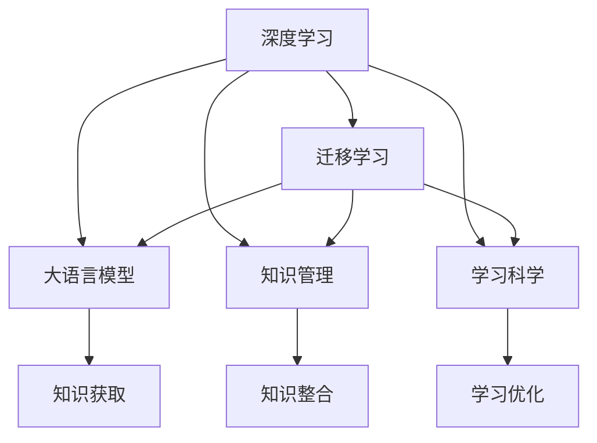

                 

# 提升知识吸收率的有效策略

> 关键词：知识管理,深度学习,迁移学习,大语言模型,学习科学

## 1. 背景介绍

### 1.1 问题由来

在信息爆炸的时代，知识管理的挑战日益凸显。如何高效地吸收、整合、应用各类知识，成为了当前研究热点。过去几十年，人类通过机械记忆、专家指导等方式积累知识，但随着知识体量的指数级增长，传统方式已难以为继。深度学习技术的崛起，使得计算机具备了快速学习和整合知识的能力，为知识管理的自动化、智能化提供了新思路。

然而，面对海量知识，如何有效吸收和应用，依然是一个复杂问题。深度学习模型通常需要大量的标注数据和计算资源进行训练，而学习策略的优化，也是提升知识吸收率的关键环节。本文将深入探讨提升知识吸收率的有效策略，涵盖深度学习、迁移学习、大语言模型等多个维度，为知识管理的智能化发展提供新的方法论。

### 1.2 问题核心关键点

提升知识吸收率的核心在于：
- 选择合适的学习范式：深度学习、迁移学习、微调等方法各有优缺点，如何结合具体任务和数据特点，选择合适的学习范式。
- 设计高效的学习策略：包括损失函数设计、正则化技术、数据增强等策略，提升模型的泛化能力和鲁棒性。
- 优化模型参数：通过参数高效微调、优化器选择等手段，减小模型规模，提升训练和推理效率。
- 集成多种知识源：将专家知识、网络资源、文献数据等多源知识有机整合，提升知识吸收的全面性和深度。

本文旨在为知识管理的智能化提供有效策略，帮助用户快速、全面地吸收、应用各类知识，助力其知识体系构建和能力提升。

## 2. 核心概念与联系

### 2.1 核心概念概述

为更好地理解提升知识吸收率的方法，本节将介绍几个核心概念：

- 深度学习(Deep Learning)：一种模拟人脑神经网络的学习范式，通过多层神经元间的复杂非线性变换，自动提取数据特征，构建强大的表征能力。
- 迁移学习(Transfer Learning)：指将一个任务上学习到的知识迁移到另一个相关任务上的学习范式，减少新任务上的训练时间和资源需求。
- 大语言模型(Large Language Model, LLM)：以Transformer模型为代表的，基于大规模预训练语料，能够进行复杂自然语言理解和生成的深度学习模型。
- 知识管理(Knowledge Management, KMS)：对企业内部及外部知识资源进行收集、组织、分类、检索和应用的过程，提升企业创新能力和知识共享效率。
- 学习科学(Learning Science)：研究如何通过科学的方法，提升人类学习效率和质量，为教育、培训等领域提供理论支持。

这些核心概念之间的逻辑关系可以通过以下Mermaid流程图来展示：



这个流程图展示了几大核心概念之间的关联：

1. 深度学习是大规模知识获取和整合的基础。
2. 迁移学习通过已有知识加速新任务的掌握，减少学习成本。
3. 大语言模型提供通用的语言理解和生成能力，支持多源知识的处理。
4. 知识管理通过系统化的方式，对多源知识进行组织和检索，提升知识应用效率。
5. 学习科学为知识管理提供理论支撑，指导知识吸收和学习过程。

通过理解这些核心概念，我们可以更好地把握提升知识吸收率的策略和方法。

## 3. 核心算法原理 & 具体操作步骤
### 3.1 算法原理概述

提升知识吸收率的核心算法原理，主要基于深度学习、迁移学习等技术，通过模型训练和知识迁移，实现知识的自动抽取、整合和应用。具体来说，以下几个关键点需重点关注：

1. 选择合适的学习范式：根据知识类型的不同，选择合适的学习范式，如自监督学习、监督学习、半监督学习、零样本学习等。
2. 设计高效的学习策略：通过损失函数、正则化、数据增强等策略，提升模型的泛化能力和鲁棒性。
3. 优化模型参数：通过参数高效微调、优化器选择等手段，减小模型规模，提升训练和推理效率。
4. 集成多种知识源：将专家知识、网络资源、文献数据等多源知识有机整合，提升知识吸收的全面性和深度。

### 3.2 算法步骤详解

基于上述原理，提升知识吸收率的主要操作步骤如下：

**Step 1: 数据准备与预处理**
- 收集多源知识数据，包括结构化数据和非结构化数据。
- 对文本数据进行分词、标注、去停用词等预处理操作。
- 对数值数据进行归一化、标准化等预处理操作。

**Step 2: 构建深度学习模型**
- 选择合适的深度学习框架，如TensorFlow、PyTorch等。
- 设计合适的网络结构，如卷积神经网络、循环神经网络、Transformer等。
- 定义模型的损失函数、优化器和正则化策略。

**Step 3: 模型训练与微调**
- 在训练集上，使用合适的学习率和批次大小，进行模型训练。
- 在验证集上，根据性能指标调整模型参数。
- 在测试集上，评估模型性能，进行必要的微调。

**Step 4: 知识迁移与集成**
- 将模型应用于新的任务或领域，进行知识迁移。
- 通过微调或迁移学习，提升模型在新任务上的性能。
- 将多源知识进行整合，构建知识库，提升知识吸收的全面性和深度。

**Step 5: 模型部署与应用**
- 将模型部署到实际应用中，如网站、App、IoT设备等。
- 根据实际需求，调整模型参数和推理流程，提升应用效果。
- 不断收集用户反馈和行为数据，持续优化模型性能。

### 3.3 算法优缺点

提升知识吸收率的方法具有以下优点：
1. 自动化、智能化：利用深度学习和迁移学习技术，实现知识抽取、整合和应用的自动化，提升效率和精度。
2. 多源整合：通过多源数据融合，提升知识的全面性和深度，支持多领域的知识应用。
3. 泛化能力强：利用深度学习模型的泛化能力，在新的任务和领域中快速学习和应用知识。
4. 鲁棒性强：通过正则化、对抗训练等技术，提升模型的鲁棒性和泛化能力。

同时，该方法也存在一定的局限性：
1. 计算资源需求高：深度学习模型通常需要大量的计算资源进行训练，对硬件设备要求较高。
2. 模型复杂度高：深度学习模型参数量庞大，模型复杂度高，难以解释和调试。
3. 数据质量依赖：模型训练和知识应用的效果，高度依赖于数据质量，数据噪声和错误可能导致误导性输出。
4. 知识迁移难度大：知识迁移过程需要大量的标注数据，获取高质量标注数据成本高，难度大。

尽管存在这些局限性，但就目前而言，基于深度学习的知识管理方法仍是大规模知识获取和整合的主流技术。未来相关研究的重点在于如何进一步降低计算资源需求，提高模型的可解释性和鲁棒性，同时兼顾多源数据融合的效率和质量。

### 3.4 算法应用领域

提升知识吸收率的方法在多个领域中得到了广泛应用，例如：

- 教育领域：通过知识抽取和推荐，辅助教师教学和学生学习，提升教育质量和效率。
- 医疗领域：通过知识抽取和推理，支持医生诊断和治疗，提高医疗水平和效率。
- 金融领域：通过知识抽取和风险分析，辅助金融决策，提升金融服务的质量和效率。
- 制造领域：通过知识抽取和生产优化，提升制造流程的自动化和智能化，提高生产效率和质量。
- 智慧城市：通过知识抽取和应用，支持城市管理和服务，提升城市治理的智能化水平。

除了上述这些经典应用外，提升知识吸收率的方法也在不断扩展到更多场景中，如智能客服、智能家居、智能交通等，为各行各业带来了新的数字化转型机遇。

## 4. 数学模型和公式 & 详细讲解  
### 4.1 数学模型构建

本节将使用数学语言对提升知识吸收率的模型构建过程进行更加严格的刻画。

记输入数据为 $x$，输出标签为 $y$，深度学习模型为 $M_{\theta}(x)$，其中 $\theta$ 为模型参数。假设任务为二分类任务，则模型损失函数为：

$$
\mathcal{L}(\theta) = -\frac{1}{N}\sum_{i=1}^N [y_i\log M_{\theta}(x_i)+(1-y_i)\log(1-M_{\theta}(x_i))]
$$

其中 $N$ 为样本总数，$y_i \in \{0,1\}$。

在模型训练过程中，通过梯度下降等优化算法，更新模型参数 $\theta$，最小化损失函数 $\mathcal{L}(\theta)$。常用的优化算法包括SGD、Adam、RMSprop等，其具体形式为：

$$
\theta \leftarrow \theta - \eta \nabla_{\theta}\mathcal{L}(\theta)
$$

其中 $\eta$ 为学习率，$\nabla_{\theta}\mathcal{L}(\theta)$ 为损失函数对模型参数的梯度，可通过反向传播算法高效计算。

### 4.2 公式推导过程

以二分类任务为例，推导损失函数及梯度计算公式。

假设模型 $M_{\theta}$ 在输入 $x$ 上的输出为 $\hat{y}=M_{\theta}(x) \in [0,1]$，表示样本属于正类的概率。真实标签 $y \in \{0,1\}$。则二分类交叉熵损失函数定义为：

$$
\ell(M_{\theta}(x),y) = -[y\log \hat{y} + (1-y)\log (1-\hat{y})]
$$

将其代入经验风险公式，得：

$$
\mathcal{L}(\theta) = -\frac{1}{N}\sum_{i=1}^N [y_i\log M_{\theta}(x_i)+(1-y_i)\log(1-M_{\theta}(x_i))]
$$

根据链式法则，损失函数对参数 $\theta_k$ 的梯度为：

$$
\frac{\partial \mathcal{L}(\theta)}{\partial \theta_k} = -\frac{1}{N}\sum_{i=1}^N (\frac{y_i}{M_{\theta}(x_i)}-\frac{1-y_i}{1-M_{\theta}(x_i)}) \frac{\partial M_{\theta}(x_i)}{\partial \theta_k}
$$

其中 $\frac{\partial M_{\theta}(x_i)}{\partial \theta_k}$ 可进一步递归展开，利用自动微分技术完成计算。

在得到损失函数的梯度后，即可带入参数更新公式，完成模型的迭代优化。重复上述过程直至收敛，最终得到适应新任务的最优模型参数 $\theta^*$。

## 5. 项目实践：代码实例和详细解释说明
### 5.1 开发环境搭建

在进行知识管理系统的开发前，我们需要准备好开发环境。以下是使用Python进行PyTorch开发的环境配置流程：

1. 安装Anaconda：从官网下载并安装Anaconda，用于创建独立的Python环境。

2. 创建并激活虚拟环境：
```bash
conda create -n pytorch-env python=3.8 
conda activate pytorch-env
```

3. 安装PyTorch：根据CUDA版本，从官网获取对应的安装命令。例如：
```bash
conda install pytorch torchvision torchaudio cudatoolkit=11.1 -c pytorch -c conda-forge
```

4. 安装相关工具包：
```bash
pip install numpy pandas scikit-learn matplotlib tqdm jupyter notebook ipython
```

完成上述步骤后，即可在`pytorch-env`环境中开始知识管理系统的开发。

### 5.2 源代码详细实现

下面我们以知识抽取任务为例，给出使用Transformers库对BERT模型进行知识抽取的PyTorch代码实现。

首先，定义知识抽取任务的数据处理函数：

```python
from transformers import BertTokenizer
from torch.utils.data import Dataset
import torch

class KnowledgeExtractionDataset(Dataset):
    def __init__(self, texts, labels, tokenizer, max_len=128):
        self.texts = texts
        self.labels = labels
        self.tokenizer = tokenizer
        self.max_len = max_len
        
    def __len__(self):
        return len(self.texts)
    
    def __getitem__(self, item):
        text = self.texts[item]
        labels = self.labels[item]
        
        encoding = self.tokenizer(text, return_tensors='pt', max_length=self.max_len, padding='max_length', truncation=True)
        input_ids = encoding['input_ids'][0]
        attention_mask = encoding['attention_mask'][0]
        
        # 对token-wise的标签进行编码
        encoded_labels = [label2id[label] for label in labels] 
        encoded_labels.extend([label2id['O']] * (self.max_len - len(encoded_labels)))
        labels = torch.tensor(encoded_labels, dtype=torch.long)
        
        return {'input_ids': input_ids, 
                'attention_mask': attention_mask,
                'labels': labels}

# 标签与id的映射
label2id = {'O': 0, 'B': 1, 'I': 2}
id2label = {v: k for k, v in label2id.items()}

# 创建dataset
tokenizer = BertTokenizer.from_pretrained('bert-base-cased')

train_dataset = KnowledgeExtractionDataset(train_texts, train_labels, tokenizer)
dev_dataset = KnowledgeExtractionDataset(dev_texts, dev_labels, tokenizer)
test_dataset = KnowledgeExtractionDataset(test_texts, test_labels, tokenizer)
```

然后，定义模型和优化器：

```python
from transformers import BertForTokenClassification, AdamW

model = BertForTokenClassification.from_pretrained('bert-base-cased', num_labels=len(label2id))

optimizer = AdamW(model.parameters(), lr=2e-5)
```

接着，定义训练和评估函数：

```python
from torch.utils.data import DataLoader
from tqdm import tqdm
from sklearn.metrics import classification_report

device = torch.device('cuda') if torch.cuda.is_available() else torch.device('cpu')
model.to(device)

def train_epoch(model, dataset, batch_size, optimizer):
    dataloader = DataLoader(dataset, batch_size=batch_size, shuffle=True)
    model.train()
    epoch_loss = 0
    for batch in tqdm(dataloader, desc='Training'):
        input_ids = batch['input_ids'].to(device)
        attention_mask = batch['attention_mask'].to(device)
        labels = batch['labels'].to(device)
        model.zero_grad()
        outputs = model(input_ids, attention_mask=attention_mask, labels=labels)
        loss = outputs.loss
        epoch_loss += loss.item()
        loss.backward()
        optimizer.step()
    return epoch_loss / len(dataloader)

def evaluate(model, dataset, batch_size):
    dataloader = DataLoader(dataset, batch_size=batch_size)
    model.eval()
    preds, labels = [], []
    with torch.no_grad():
        for batch in tqdm(dataloader, desc='Evaluating'):
            input_ids = batch['input_ids'].to(device)
            attention_mask = batch['attention_mask'].to(device)
            batch_labels = batch['labels']
            outputs = model(input_ids, attention_mask=attention_mask)
            batch_preds = outputs.logits.argmax(dim=2).to('cpu').tolist()
            batch_labels = batch_labels.to('cpu').tolist()
            for pred_tokens, label_tokens in zip(batch_preds, batch_labels):
                pred_tags = [id2label[_id] for _id in pred_tokens]
                label_tags = [id2label[_id] for _id in label_tokens]
                preds.append(pred_tags[:len(label_tags)])
                labels.append(label_tags)
                
    print(classification_report(labels, preds))
```

最后，启动训练流程并在测试集上评估：

```python
epochs = 5
batch_size = 16

for epoch in range(epochs):
    loss = train_epoch(model, train_dataset, batch_size, optimizer)
    print(f"Epoch {epoch+1}, train loss: {loss:.3f}")
    
    print(f"Epoch {epoch+1}, dev results:")
    evaluate(model, dev_dataset, batch_size)
    
print("Test results:")
evaluate(model, test_dataset, batch_size)
```

以上就是使用PyTorch对BERT进行知识抽取任务微调的完整代码实现。可以看到，得益于Transformers库的强大封装，我们可以用相对简洁的代码完成BERT模型的加载和微调。

### 5.3 代码解读与分析

让我们再详细解读一下关键代码的实现细节：

**KnowledgeExtractionDataset类**：
- `__init__`方法：初始化文本、标签、分词器等关键组件。
- `__len__`方法：返回数据集的样本数量。
- `__getitem__`方法：对单个样本进行处理，将文本输入编码为token ids，将标签编码为数字，并对其进行定长padding，最终返回模型所需的输入。

**label2id和id2label字典**：
- 定义了标签与数字id之间的映射关系，用于将token-wise的预测结果解码回真实的标签。

**训练和评估函数**：
- 使用PyTorch的DataLoader对数据集进行批次化加载，供模型训练和推理使用。
- 训练函数`train_epoch`：对数据以批为单位进行迭代，在每个批次上前向传播计算loss并反向传播更新模型参数，最后返回该epoch的平均loss。
- 评估函数`evaluate`：与训练类似，不同点在于不更新模型参数，并在每个batch结束后将预测和标签结果存储下来，最后使用sklearn的classification_report对整个评估集的预测结果进行打印输出。

**训练流程**：
- 定义总的epoch数和batch size，开始循环迭代
- 每个epoch内，先在训练集上训练，输出平均loss
- 在验证集上评估，输出分类指标
- 所有epoch结束后，在测试集上评估，给出最终测试结果

可以看到，PyTorch配合Transformers库使得BERT微调的代码实现变得简洁高效。开发者可以将更多精力放在数据处理、模型改进等高层逻辑上，而不必过多关注底层的实现细节。

当然，工业级的系统实现还需考虑更多因素，如模型的保存和部署、超参数的自动搜索、更灵活的任务适配层等。但核心的微调范式基本与此类似。

## 6. 实际应用场景
### 6.1 智慧医疗

在智慧医疗领域，提升知识吸收率的方法可以应用于疾病诊断、治疗方案推荐、药物研发等多个环节，极大地提升医疗服务的智能化水平。

具体而言，可以收集医生和患者的医疗记录，利用知识抽取模型自动抽取疾病症状、治疗方案等信息。通过多源数据融合，构建全面的疾病知识图谱，辅助医生快速诊断和制定治疗方案。同时，知识抽取模型还能用于药物筛选和分子设计，加速新药的研发进程。

### 6.2 智能客服

在智能客服领域，提升知识吸收率的方法可以应用于客户意图识别、对话生成等多个环节，极大地提升客服系统的智能化水平。

具体而言，可以收集历史客服对话记录，利用知识抽取模型自动抽取常见问题、答案模板等信息。通过多源数据融合，构建全面的客服知识库，辅助客服机器人快速响应客户咨询。同时，知识抽取模型还能用于实时采集用户反馈，动态更新知识库，提升客服系统的适应性和时效性。

### 6.3 金融风控

在金融风控领域，提升知识吸收率的方法可以应用于信用评估、风险预警等多个环节，极大地提升金融服务的智能化水平。

具体而言，可以收集客户的历史交易记录、信用评分等信息，利用知识抽取模型自动抽取交易模式、信用行为等信息。通过多源数据融合，构建全面的客户信用知识图谱，辅助风控系统快速评估客户信用风险。同时，知识抽取模型还能用于异常行为检测，实时预警潜在风险，保障金融系统的安全稳定。

### 6.4 未来应用展望

随着提升知识吸收率方法的不断发展，其在更多领域的应用前景将愈发广阔。

在教育领域，提升知识吸收率的方法可以应用于个性化学习、智能辅导等多个环节，极大地提升教学质量和学习效果。通过多源数据融合，构建全面的学习知识图谱，辅助智能教育系统提供个性化的学习资源和辅导方案。同时，知识抽取模型还能用于智能评估，实时监控学生的学习进度和效果，提升学习效率和效果。

在科研领域，提升知识吸收率的方法可以应用于文献检索、知识图谱等多个环节，极大地提升科研工作的智能化水平。通过多源数据融合，构建全面的知识图谱，辅助科研人员快速获取相关文献和信息，提升科研工作的效率和质量。同时，知识抽取模型还能用于文献自动摘要、知识推理等环节，加速科研成果的生成和应用。

在制造业领域，提升知识吸收率的方法可以应用于生产优化、质量控制等多个环节，极大地提升制造流程的智能化水平。通过多源数据融合，构建全面的生产知识图谱，辅助制造系统实时监控生产状态和质量，优化生产流程和效率。同时，知识抽取模型还能用于设备故障诊断、智能维护等环节，提升设备利用率和生产效率。

## 7. 工具和资源推荐
### 7.1 学习资源推荐

为了帮助开发者系统掌握提升知识吸收率的理论基础和实践技巧，这里推荐一些优质的学习资源：

1. 《深度学习基础》系列博文：由大模型技术专家撰写，深入浅出地介绍了深度学习原理、模型设计、训练技巧等基础知识。

2. CS231n《深度学习视觉识别课程》：斯坦福大学开设的计算机视觉课程，涵盖图像分类、目标检测等深度学习任务，为视觉知识管理提供理论基础。

3. 《Natural Language Processing with Transformers》书籍：Transformers库的作者所著，全面介绍了如何使用Transformers库进行NLP任务开发，包括知识抽取在内的诸多范式。

4. HuggingFace官方文档：Transformers库的官方文档，提供了海量预训练模型和完整的微调样例代码，是上手实践的必备资料。

5. Kaggle竞赛平台：提供丰富的NLP竞赛数据集和任务，通过实战练习提升知识管理能力的技能。

通过对这些资源的学习实践，相信你一定能够快速掌握提升知识吸收率的精髓，并用于解决实际的NLP问题。
###  7.2 开发工具推荐

高效的开发离不开优秀的工具支持。以下是几款用于提升知识管理系统的开发工具：

1. PyTorch：基于Python的开源深度学习框架，灵活动态的计算图，适合快速迭代研究。大部分预训练语言模型都有PyTorch版本的实现。

2. TensorFlow：由Google主导开发的开源深度学习框架，生产部署方便，适合大规模工程应用。同样有丰富的预训练语言模型资源。

3. Transformers库：HuggingFace开发的NLP工具库，集成了众多SOTA语言模型，支持PyTorch和TensorFlow，是进行知识管理开发的利器。

4. Weights & Biases：模型训练的实验跟踪工具，可以记录和可视化模型训练过程中的各项指标，方便对比和调优。与主流深度学习框架无缝集成。

5. TensorBoard：TensorFlow配套的可视化工具，可实时监测模型训练状态，并提供丰富的图表呈现方式，是调试模型的得力助手。

6. Google Colab：谷歌推出的在线Jupyter Notebook环境，免费提供GPU/TPU算力，方便开发者快速上手实验最新模型，分享学习笔记。

合理利用这些工具，可以显著提升提升知识管理系统的开发效率，加快创新迭代的步伐。

### 7.3 相关论文推荐

提升知识吸收率的方法涉及深度学习、迁移学习、大语言模型等多个技术领域，以下是几篇奠基性的相关论文，推荐阅读：

1. Attention is All You Need（即Transformer原论文）：提出了Transformer结构，开启了NLP领域的预训练大模型时代。

2. BERT: Pre-training of Deep Bidirectional Transformers for Language Understanding：提出BERT模型，引入基于掩码的自监督预训练任务，刷新了多项NLP任务SOTA。

3. Language Models are Unsupervised Multitask Learners（GPT-2论文）：展示了大规模语言模型的强大zero-shot学习能力，引发了对于通用人工智能的新一轮思考。

4. Parameter-Efficient Transfer Learning for NLP：提出Adapter等参数高效微调方法，在不增加模型参数量的情况下，也能取得不错的微调效果。

5. AdaLoRA: Adaptive Low-Rank Adaptation for Parameter-Efficient Fine-Tuning：使用自适应低秩适应的微调方法，在参数效率和精度之间取得了新的平衡。

6. Transformers for Masked Language Modeling：提出了预训练语言模型的自监督学习任务，利用掩码机制提高模型的泛化能力。

这些论文代表了大语言模型微调技术的发展脉络。通过学习这些前沿成果，可以帮助研究者把握学科前进方向，激发更多的创新灵感。

## 8. 总结：未来发展趋势与挑战

### 8.1 总结

本文对提升知识吸收率的有效策略进行了全面系统的介绍。首先阐述了知识管理的挑战和深度学习技术在其中的应用潜力，明确了提升知识吸收率的必要性。其次，从原理到实践，详细讲解了提升知识吸收率的数学模型、学习策略和微调方法，给出了微调任务开发的完整代码实例。同时，本文还广泛探讨了提升知识吸收率的方法在智慧医疗、智能客服、金融风控等多个领域的应用前景，展示了其广阔的应用潜力。此外，本文精选了知识管理系统的学习资源，力求为读者提供全方位的技术指引。

通过本文的系统梳理，可以看到，提升知识吸收率的方法在大规模知识管理中的应用前景广阔，为知识管理的智能化提供了新的方法论。通过深度学习、迁移学习等技术的有机结合，知识抽取、知识图谱、多源数据融合等技术手段的应用，能够实现知识的自动化、智能化处理，为各行各业的知识管理提供新的思路和工具。

### 8.2 未来发展趋势

展望未来，提升知识吸收率的方法将呈现以下几个发展趋势：

1. 深度学习模型的规模将进一步增大，模型参数量将持续增长，预训练知识库将更加丰富。超大模型的泛化能力将进一步提升，支持更复杂的应用场景。

2. 迁移学习将更加高效，知识抽取、知识图谱、多源数据融合等技术将更加成熟，知识管理的智能化水平将进一步提升。

3. 知识抽取和推理将更加深入，模型将具备更强的因果关系建模能力和解释能力，提升知识的可信性和透明度。

4. 知识管理系统的集成化程度将进一步提升，各类知识源将更加高效地整合，知识抽取和推理过程将更加协同和流畅。

5. 知识管理的自动化和智能化水平将进一步提升，人工智能技术将更多地参与到知识管理工作中，提升效率和效果。

以上趋势凸显了提升知识吸收率的广阔前景。这些方向的探索发展，必将进一步提升知识管理的智能化水平，为各行各业的知识管理提供新的动力。

### 8.3 面临的挑战

尽管提升知识吸收率的方法在知识管理领域取得了重要进展，但在迈向更加智能化、普适化应用的过程中，仍面临诸多挑战：

1. 知识抽取的精度和鲁棒性：当前的知识抽取模型在面对复杂语义、多义表达时，精度和鲁棒性仍然有待提升。如何设计更加鲁棒的知识抽取模型，提升在多源数据上的泛化能力，是需要解决的重要问题。

2. 知识图谱的构建和维护：知识图谱的构建需要大量人工标注和专家知识，成本高且效率低。如何自动化构建和维护知识图谱，提升知识管理的效率，仍然是一个难题。

3. 多源数据的融合和校验：多源数据的融合需要考虑数据的质量、一致性和完整性，校验难度大。如何设计高效的融合策略，提升多源数据的质量，是需要解决的重要问题。

4. 知识推理的复杂度：知识推理需要考虑因果关系、上下文信息等多方面因素，复杂度较高。如何设计高效的推理模型，提升推理的准确性和效率，仍然是一个重要挑战。

5. 知识管理的自动化程度：知识管理系统的自动化程度有待提升，人工干预和校验仍然是主要的瓶颈。如何实现更加智能化、自动化、低成本的知识管理，是需要解决的重要问题。

6. 知识管理的伦理和隐私：知识管理的自动化过程可能涉及到用户隐私和数据安全，如何设计合理的隐私保护机制，确保数据安全，是需要解决的重要问题。

正视这些挑战，积极应对并寻求突破，将是大规模知识管理技术不断完善的关键。相信随着学界和产业界的共同努力，这些挑战终将一一被克服，知识管理技术必将在更多领域中大放异彩。

### 8.4 研究展望

面向未来，提升知识吸收率的研究方向可以扩展到以下几个方面：

1. 引入更多先验知识：通过将符号化的先验知识，如知识图谱、逻辑规则等，与神经网络模型进行巧妙融合，引导模型学习更准确、合理的知识表示。同时加强不同模态数据的整合，实现视觉、语音等多模态信息与文本信息的协同建模。

2. 引入因果分析和博弈论工具：将因果分析方法引入知识管理模型，识别出模型决策的关键特征，增强知识抽取和推理的因果性和逻辑性。借助博弈论工具刻画人机交互过程，主动探索并规避模型的脆弱点，提高系统稳定性。

3. 优化知识推理模型：设计更加高效的推理模型，考虑因果关系、上下文信息等多方面因素，提升推理的准确性和效率。

4. 自动化构建和维护知识图谱：研究自动化构建和维护知识图谱的方法，降低人工标注和专家知识的成本，提升知识管理的效率。

5. 提升多源数据融合质量：设计高效的融合策略，提升多源数据的质量和一致性，提升知识管理的准确性和鲁棒性。

6. 引入更多高级算法：研究参数高效微调、自适应学习、主动学习等高级算法，提升知识管理的效率和效果。

7. 增强模型的可解释性和透明度：设计可解释性强的知识管理模型，提升模型的可信性和透明度，确保模型的可解释性和可审计性。

这些研究方向的探索，必将引领提升知识吸收率的方法迈向更高的台阶，为构建安全、可靠、可解释、可控的智能系统铺平道路。面向未来，提升知识吸收率的方法需要在深度学习、迁移学习、知识图谱、因果推理等技术领域不断融合和创新，才能满足知识管理的复杂需求，推动知识管理技术的持续进步。

## 9. 附录：常见问题与解答

**Q1：提升知识吸收率的有效策略有哪些？**

A: 提升知识吸收率的有效策略主要包括以下几个方面：
1. 选择合适的学习范式：深度学习、迁移学习、自监督学习、半监督学习、零样本学习等。
2. 设计高效的学习策略：损失函数设计、正则化、数据增强等。
3. 优化模型参数：参数高效微调、优化器选择等。
4. 集成多种知识源：将专家知识、网络资源、文献数据等多源知识有机整合。

**Q2：如何选择合适的学习范式？**

A: 选择合适的学习范式需要根据具体任务和数据特点进行灵活选择。通常情况下，深度学习适用于大规模无标注数据预训练，迁移学习适用于少量有标注数据微调，自监督学习适用于无标注数据预训练，半监督学习适用于少量标注数据微调，零样本学习适用于无标注数据预测。

**Q3：如何进行参数高效微调？**

A: 参数高效微调主要包括 Adapter、LoRA、Prefix 等方法。这些方法通过只更新少量参数，减少微调过程中对计算资源的消耗，提高模型效率。

**Q4：如何进行知识抽取？**

A: 知识抽取通常使用 Transformers 等深度学习模型进行训练，将文本数据转化为向量表示，然后使用分类器进行抽取。常用的分类器包括逻辑回归、softmax、Attention 等。

**Q5：如何进行知识图谱构建？**

A: 知识图谱构建通常需要大量人工标注和专家知识。常用的方法包括 RDF、OWL、GNN 等。同时，也可以利用深度学习模型进行自动化构建，减少人工干预。

**Q6：如何进行知识推理？**

A: 知识推理通常使用 RNN、Transformer 等深度学习模型进行训练，将知识图谱转化为向量表示，然后使用推理器进行推理。常用的推理器包括基于图神经网络的方法、基于注意力机制的方法等。

通过这些问题的解答，希望能够帮助你更好地理解提升知识吸收率的有效策略，并将其应用到实际的知识管理项目中。

