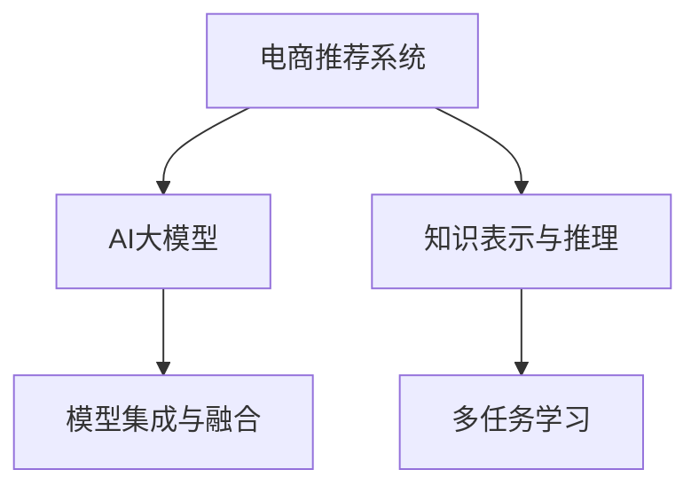

                 

## 1. 背景介绍

### 1.1 问题由来
随着电商平台的飞速发展，用户体验和业务效率成为了核心竞争力。传统的电商推荐系统基于用户历史行为数据，使用逻辑回归、协同过滤、深度学习等模型，能够较好地预测用户点击、购买行为，提供个性化推荐。但随着用户规模的不断扩大和数据维度的不断提升，推荐系统面临着数据稀疏、计算复杂、效果不稳定等问题。

为了解决这些问题，近年来，AI大模型如BERT、GPT、Deformable DETR等，因其在自然语言处理领域的显著表现，逐渐被引入电商推荐系统中。这些大模型具备强大的语言处理能力和迁移学习能力，可以在稀疏、复杂的数据环境下，提升推荐系统的性能和稳定性。但如何融合大模型与传统推荐算法，充分利用其语言理解、知识表示等能力，同时保持推荐系统的实时性和高效性，成为新的技术挑战。

### 1.2 问题核心关键点
大模型融合推荐系统的主要挑战在于：

- **模型融合**：如何将大模型与传统推荐算法有效结合，形成互补优势。
- **计算复杂性**：大模型的参数量和计算需求极高，如何在电商实时推荐场景中高效运行。
- **实时性要求**：电商平台的推荐系统需要实时响应用户请求，如何平衡实时性与准确性。
- **隐私与数据安全**：用户行为数据涉及隐私保护，如何在保证用户隐私的前提下，提升推荐效果。
- **效果评价**：推荐系统的效果评价指标多种多样，如何科学评估大模型融合的效果。

## 2. 核心概念与联系

### 2.1 核心概念概述

为更好地理解大模型与电商推荐系统的融合方法，本节将介绍几个密切相关的核心概念：

- **电商推荐系统**：基于用户行为数据，通过算法模型预测用户后续行为，提供个性化推荐，以提升用户体验和业务转化率。
- **AI大模型**：通过大规模预训练数据集，学习广泛的语言知识，具备强大的自然语言处理能力和迁移学习能力。
- **知识表示与推理**：利用语言模型对用户行为进行编码，提升推荐系统的知识表示能力和推理能力。
- **多任务学习**：将多个子任务整合训练，提升大模型的多任务泛化能力，优化推荐系统效果。
- **模型集成与融合**：将多个推荐模型集成起来，取长补短，提升整体推荐效果。

这些核心概念之间的逻辑关系可以通过以下Mermaid流程图来展示：



这个流程图展示了大模型与电商推荐系统的核心概念及其之间的关系：

1. 电商推荐系统通过AI大模型学习用户行为语言表示。
2. 知识表示与推理利用大模型对用户行为进行编码，提升推荐系统效果。
3. 多任务学习整合多个子任务，提升大模型泛化能力。
4. 模型集成与融合将多个推荐模型结合，优化推荐效果。

这些概念共同构成了大模型与电商推荐系统融合的基础，使得电商推荐系统能够充分利用大模型的强大能力，提升推荐效果和用户体验。

## 3. 核心算法原理 & 具体操作步骤
### 3.1 算法原理概述

大模型融合推荐系统，本质上是一种多任务学习范式。其核心思想是：将电商推荐系统中的多个子任务，如用户兴趣建模、相似度计算、商品推荐等，整合到一个统一的大模型中训练，通过模型自适应学习，优化推荐效果。

形式化地，假设电商推荐系统中的多个子任务为 $T=\{t_1, t_2, ..., t_n\}$，每个子任务 $t_i$ 对应的数据集为 $D_i$。大模型 $M_{\theta}$ 在不同任务下的输出为 $Y=\{y_1, y_2, ..., y_n\}$。微调后的模型参数为 $\theta^*$，使得整体模型在所有任务上表现最优：

$$
\theta^* = \mathop{\arg\min}_{\theta} \sum_{i=1}^n \mathcal{L}_i(y_i, M_{\theta}(D_i))
$$

其中 $\mathcal{L}_i$ 为子任务 $t_i$ 的损失函数，$\theta^*$ 为最终优化的模型参数。通过多任务学习，大模型能够学习到各个任务之间的隐含关联，提升推荐系统的综合效果。

### 3.2 算法步骤详解

大模型融合电商推荐系统一般包括以下几个关键步骤：

**Step 1: 数据预处理与整合**

- 收集电商推荐系统中的多个子任务数据集，并进行预处理，如用户行为数据清洗、特征提取等。
- 将不同任务的数据集整合为一个大数据集，每个样本的特征向量由多个任务特征拼接而成。

**Step 2: 模型架构设计**

- 选择合适的预训练大模型架构，如BERT、GPT等。
- 在大模型上设计多个子任务输出层，每个输出层对应一个推荐子任务。
- 为每个输出层设计对应的损失函数，如交叉熵损失、均方误差损失等。

**Step 3: 模型训练与优化**

- 将整合后的数据集输入模型，进行前向传播计算损失函数。
- 反向传播计算参数梯度，根据设定的优化算法和学习率更新模型参数。
- 在训练过程中，应用多任务学习策略，如MTRL等，优化模型在各个任务上的性能。
- 在验证集上评估模型性能，根据性能指标决定是否触发Early Stopping。
- 重复上述步骤直到满足预设的迭代轮数或Early Stopping条件。

**Step 4: 测试与部署**

- 在测试集上评估微调后模型 $M_{\theta^*}$ 的性能，对比微调前后的效果提升。
- 使用微调后的模型对新样本进行推理预测，集成到实际的应用系统中。
- 持续收集新的数据，定期重新微调模型，以适应数据分布的变化。

以上是基于大模型融合电商推荐系统的一般流程。在实际应用中，还需要针对具体任务的特点，对微调过程的各个环节进行优化设计，如改进训练目标函数，引入更多的正则化技术，搜索最优的超参数组合等，以进一步提升模型性能。

### 3.3 算法优缺点

大模型融合电商推荐系统的方法具有以下优点：

1. **数据利用充分**：大模型能够利用丰富的文本数据，提升推荐系统的泛化能力，适应电商平台的用户行为多样性。
2. **效果提升显著**：大模型融合多任务学习，能够提升推荐系统的综合性能，提升用户满意度。
3. **跨任务学习**：大模型能够学习不同任务之间的隐含关联，提高推荐系统的鲁棒性和稳定性。

同时，该方法也存在一定的局限性：

1. **计算复杂高**：大模型的参数量和计算需求极高，需要高性能的计算设备和算法优化。
2. **实时性需求高**：电商平台的推荐系统需要实时响应用户请求，大模型的计算复杂性可能导致响应延迟。
3. **数据隐私问题**：电商推荐系统涉及用户行为数据隐私保护，大模型需要采取隐私保护技术，如差分隐私等。
4. **模型解释性差**：大模型通常具有黑盒性质，难以解释其内部推理逻辑，影响模型可信度。

尽管存在这些局限性，但就目前而言，大模型融合方法仍是电商推荐系统优化的一个重要方向。未来相关研究的重点在于如何进一步降低计算复杂性，提升实时性，同时兼顾隐私保护和模型解释性等因素。

### 3.4 算法应用领域

大模型融合电商推荐系统在电商平台上已经得到了广泛的应用，覆盖了几乎所有常见推荐任务，例如：

- **用户兴趣建模**：利用用户行为数据，学习用户的兴趣和偏好，提升个性化推荐效果。
- **商品相似度计算**：通过语言模型，计算商品之间的相似度和关联性，推荐相关商品。
- **动态推荐**：根据用户实时行为，动态调整推荐策略，提升推荐准确性和及时性。
- **跨域推荐**：利用大模型的跨领域迁移能力，推荐跨域商品，增强推荐多样性。
- **情感分析**：分析用户评价和反馈，提升商品质量判断和情感感知能力。
- **对话推荐**：通过自然语言处理技术，与用户进行多轮对话，实时推荐商品。

除了上述这些经典任务外，大模型融合推荐系统还被创新性地应用到更多场景中，如跨模态推荐、智能客服、知识图谱等，为电商推荐系统带来了全新的突破。随着大模型和推荐系统的不断进步，相信电商推荐系统必将在更广阔的应用领域大放异彩。

## 4. 数学模型和公式 & 详细讲解 & 举例说明
### 4.1 数学模型构建

本节将使用数学语言对大模型融合电商推荐系统进行更加严格的刻画。

假设电商推荐系统中的多个子任务为 $T=\{t_1, t_2, ..., t_n\}$，每个子任务 $t_i$ 对应的数据集为 $D_i=\{(x_i, y_i)\}_{i=1}^N$，其中 $x_i \in \mathbb{R}^d$ 为特征向量，$y_i \in \{0, 1\}$ 为标签。

定义大模型 $M_{\theta}$ 在数据集 $D_i$ 上的损失函数为 $\mathcal{L}_i(\theta)$，则在所有任务上，大模型的整体损失函数为：

$$
\mathcal{L}(\theta) = \sum_{i=1}^n \mathcal{L}_i(\theta)
$$

大模型融合电商推荐系统的目标是最小化整体损失函数，即找到最优参数：

$$
\theta^* = \mathop{\arg\min}_{\theta} \mathcal{L}(\theta)
$$

在实践中，我们通常使用基于梯度的优化算法（如SGD、Adam等）来近似求解上述最优化问题。设 $\eta$ 为学习率，$\lambda$ 为正则化系数，则参数的更新公式为：

$$
\theta \leftarrow \theta - \eta \nabla_{\theta}\mathcal{L}(\theta) - \eta\lambda\theta
$$

其中 $\nabla_{\theta}\mathcal{L}(\theta)$ 为损失函数对参数 $\theta$ 的梯度，可通过反向传播算法高效计算。

### 4.2 公式推导过程

以下我们以用户兴趣建模任务为例，推导多任务学习下的用户兴趣表示公式。

假设用户行为数据为 $\{x_i, y_i\}_{i=1}^N$，其中 $x_i \in \mathbb{R}^d$ 为用户行为特征，$y_i \in \{0, 1\}$ 为兴趣标签。定义用户兴趣表示为 $\alpha \in \mathbb{R}^k$，其中 $k$ 为用户兴趣的维度。用户兴趣建模的目标是最大化兴趣表示 $\alpha$ 与行为数据 $x_i$ 之间的相似度：

$$
\max_{\alpha} \frac{1}{N}\sum_{i=1}^N f(x_i, \alpha)
$$

其中 $f(x_i, \alpha)$ 为兴趣表示与行为数据的相似度函数，如余弦相似度：

$$
f(x_i, \alpha) = \cos(x_i, \alpha) = \frac{\alpha^T x_i}{\|\alpha\|\|x_i\|}
$$

将该问题转化为多任务学习范式，定义多任务损失函数 $\mathcal{L}(\theta)$ 为：

$$
\mathcal{L}(\theta) = -\frac{1}{N}\sum_{i=1}^N \log\sigma(f(x_i, \alpha(\theta)))
$$

其中 $\alpha(\theta)$ 为大模型输出的用户兴趣表示，$\sigma$ 为sigmoid函数，用于将输出映射到 $[0, 1]$ 区间。

对上述损失函数进行梯度下降优化，可以得到：

$$
\frac{\partial \mathcal{L}(\theta)}{\partial \theta} = -\frac{1}{N}\sum_{i=1}^N \frac{\partial f(x_i, \alpha(\theta))}{\partial \theta} \cdot \frac{1}{f(x_i, \alpha(\theta)) - 1}
$$

其中 $\frac{\partial f(x_i, \alpha(\theta))}{\partial \theta}$ 为兴趣表示与行为数据的导数，可通过链式法则计算。

在得到损失函数的梯度后，即可带入参数更新公式，完成模型的迭代优化。重复上述过程直至收敛，最终得到适应电商推荐系统任务的用户兴趣表示 $\alpha(\theta^*)$。

## 5. 项目实践：代码实例和详细解释说明
### 5.1 开发环境搭建

在进行大模型融合电商推荐系统的开发前，我们需要准备好开发环境。以下是使用Python进行PyTorch开发的环境配置流程：

1. 安装Anaconda：从官网下载并安装Anaconda，用于创建独立的Python环境。

2. 创建并激活虚拟环境：
```bash
conda create -n recommendation-env python=3.8 
conda activate recommendation-env
```

3. 安装PyTorch：根据CUDA版本，从官网获取对应的安装命令。例如：
```bash
conda install pytorch torchvision torchaudio cudatoolkit=11.1 -c pytorch -c conda-forge
```

4. 安装Transformers库：
```bash
pip install transformers
```

5. 安装各类工具包：
```bash
pip install numpy pandas scikit-learn matplotlib tqdm jupyter notebook ipython
```

完成上述步骤后，即可在`recommendation-env`环境中开始项目实践。

### 5.2 源代码详细实现

下面我们以用户兴趣建模任务为例，给出使用Transformers库对BERT模型进行融合电商推荐系统的PyTorch代码实现。

首先，定义用户兴趣建模的数据处理函数：

```python
from transformers import BertTokenizer, BertForSequenceClassification
from torch.utils.data import Dataset, DataLoader

class UserInterestDataset(Dataset):
    def __init__(self, texts, labels, tokenizer, max_len=128):
        self.texts = texts
        self.labels = labels
        self.tokenizer = tokenizer
        self.max_len = max_len
        
    def __len__(self):
        return len(self.texts)
    
    def __getitem__(self, item):
        text = self.texts[item]
        label = self.labels[item]
        
        encoding = self.tokenizer(text, return_tensors='pt', max_length=self.max_len, padding='max_length', truncation=True)
        input_ids = encoding['input_ids'][0]
        attention_mask = encoding['attention_mask'][0]
        
        # 对标签进行独热编码
        label = torch.tensor([[1 if label == 1 else 0]], dtype=torch.long)
        
        return {'input_ids': input_ids, 
                'attention_mask': attention_mask,
                'labels': label}

# 创建数据集
tokenizer = BertTokenizer.from_pretrained('bert-base-cased')

train_dataset = UserInterestDataset(train_texts, train_labels, tokenizer)
dev_dataset = UserInterestDataset(dev_texts, dev_labels, tokenizer)
test_dataset = UserInterestDataset(test_texts, test_labels, tokenizer)
```

然后，定义模型和优化器：

```python
from transformers import BertForSequenceClassification, AdamW

model = BertForSequenceClassification.from_pretrained('bert-base-cased', num_labels=2)

optimizer = AdamW(model.parameters(), lr=2e-5)
```

接着，定义训练和评估函数：

```python
from tqdm import tqdm
from sklearn.metrics import accuracy_score

device = torch.device('cuda') if torch.cuda.is_available() else torch.device('cpu')
model.to(device)

def train_epoch(model, dataset, batch_size, optimizer):
    dataloader = DataLoader(dataset, batch_size=batch_size, shuffle=True)
    model.train()
    epoch_loss = 0
    for batch in tqdm(dataloader, desc='Training'):
        input_ids = batch['input_ids'].to(device)
        attention_mask = batch['attention_mask'].to(device)
        labels = batch['labels'].to(device)
        model.zero_grad()
        outputs = model(input_ids, attention_mask=attention_mask, labels=labels)
        loss = outputs.loss
        epoch_loss += loss.item()
        loss.backward()
        optimizer.step()
    return epoch_loss / len(dataloader)

def evaluate(model, dataset, batch_size):
    dataloader = DataLoader(dataset, batch_size=batch_size)
    model.eval()
    preds, labels = [], []
    with torch.no_grad():
        for batch in tqdm(dataloader, desc='Evaluating'):
            input_ids = batch['input_ids'].to(device)
            attention_mask = batch['attention_mask'].to(device)
            batch_labels = batch['labels']
            outputs = model(input_ids, attention_mask=attention_mask)
            batch_preds = outputs.logits.argmax(dim=1).to('cpu').tolist()
            batch_labels = batch_labels.to('cpu').tolist()
            for pred, label in zip(batch_preds, batch_labels):
                preds.append(pred)
                labels.append(label)
                
    print('Accuracy:', accuracy_score(labels, preds))
```

最后，启动训练流程并在测试集上评估：

```python
epochs = 5
batch_size = 16

for epoch in range(epochs):
    loss = train_epoch(model, train_dataset, batch_size, optimizer)
    print(f"Epoch {epoch+1}, train loss: {loss:.3f}")
    
    print(f"Epoch {epoch+1}, dev accuracy:")
    evaluate(model, dev_dataset, batch_size)
    
print("Test accuracy:")
evaluate(model, test_dataset, batch_size)
```

以上就是使用PyTorch对BERT进行融合电商推荐系统的完整代码实现。可以看到，得益于Transformers库的强大封装，我们可以用相对简洁的代码完成BERT模型的加载和微调。

### 5.3 代码解读与分析

让我们再详细解读一下关键代码的实现细节：

**UserInterestDataset类**：
- `__init__`方法：初始化文本、标签、分词器等关键组件。
- `__len__`方法：返回数据集的样本数量。
- `__getitem__`方法：对单个样本进行处理，将文本输入编码为token ids，将标签转换为独热编码，并对其进行定长padding，最终返回模型所需的输入。

**模型和优化器**：
- 使用BertForSequenceClassification构建用户兴趣建模的分类模型，num_labels参数为1，表示二分类任务。
- 使用AdamW优化器，设定学习率为2e-5。

**训练和评估函数**：
- 使用PyTorch的DataLoader对数据集进行批次化加载，供模型训练和推理使用。
- 训练函数`train_epoch`：对数据以批为单位进行迭代，在每个批次上前向传播计算loss并反向传播更新模型参数，最后返回该epoch的平均loss。
- 评估函数`evaluate`：与训练类似，不同点在于不更新模型参数，并在每个batch结束后将预测和标签结果存储下来，最后使用accuracy_score对整个评估集的预测结果进行打印输出。

**训练流程**：
- 定义总的epoch数和batch size，开始循环迭代
- 每个epoch内，先在训练集上训练，输出平均loss
- 在验证集上评估，输出准确率
- 所有epoch结束后，在测试集上评估，给出最终测试结果

可以看到，PyTorch配合Transformers库使得BERT微调的代码实现变得简洁高效。开发者可以将更多精力放在数据处理、模型改进等高层逻辑上，而不必过多关注底层的实现细节。

当然，工业级的系统实现还需考虑更多因素，如模型的保存和部署、超参数的自动搜索、更灵活的任务适配层等。但核心的微调范式基本与此类似。

## 6. 实际应用场景
### 6.1 智能客服系统

基于大模型融合电商推荐系统的对话技术，可以广泛应用于智能客服系统的构建。传统客服往往需要配备大量人力，高峰期响应缓慢，且一致性和专业性难以保证。而使用融合电商推荐系统的对话模型，可以7x24小时不间断服务，快速响应客户咨询，用自然流畅的语言解答各类常见问题。

在技术实现上，可以收集企业内部的历史客服对话记录，将问题和最佳答复构建成监督数据，在此基础上对融合电商推荐系统的对话模型进行微调。微调后的对话模型能够自动理解用户意图，匹配最合适的答案模板进行回复。对于客户提出的新问题，还可以接入检索系统实时搜索相关内容，动态组织生成回答。如此构建的智能客服系统，能大幅提升客户咨询体验和问题解决效率。

### 6.2 金融舆情监测

金融机构需要实时监测市场舆论动向，以便及时应对负面信息传播，规避金融风险。传统的人工监测方式成本高、效率低，难以应对网络时代海量信息爆发的挑战。融合电商推荐系统的文本分类和情感分析技术，为金融舆情监测提供了新的解决方案。

具体而言，可以收集金融领域相关的新闻、报道、评论等文本数据，并对其进行主题标注和情感标注。在此基础上对融合电商推荐系统的文本分类模型进行微调，使其能够自动判断文本属于何种主题，情感倾向是正面、中性还是负面。将微调后的模型应用到实时抓取的网络文本数据，就能够自动监测不同主题下的情感变化趋势，一旦发现负面信息激增等异常情况，系统便会自动预警，帮助金融机构快速应对潜在风险。

### 6.3 个性化推荐系统

当前的推荐系统往往只依赖用户的历史行为数据进行物品推荐，无法深入理解用户的真实兴趣偏好。融合电商推荐系统的多任务学习技术，可以充分利用用户行为的语言信息，提升推荐系统的知识表示能力和推理能力。

在实践中，可以收集用户浏览、点击、评论、分享等行为数据，提取和用户交互的物品标题、描述、标签等文本内容。将文本内容作为模型输入，用户的后续行为（如是否点击、购买等）作为监督信号，在此基础上微调融合电商推荐系统的文本分类模型。微调后的模型能够从文本内容中准确把握用户的兴趣点。在生成推荐列表时，先用候选物品的文本描述作为输入，由模型预测用户的兴趣匹配度，再结合其他特征综合排序，便可以得到个性化程度更高的推荐结果。

### 6.4 未来应用展望

随着融合电商推荐系统的不断发展，基于微调的方法将在更多领域得到应用，为传统行业带来变革性影响。

在智慧医疗领域，基于融合电商推荐系统的医疗问答、病历分析、药物研发等应用将提升医疗服务的智能化水平，辅助医生诊疗，加速新药开发进程。

在智能教育领域，融合电商推荐系统的知识推荐技术，可应用于作业批改、学情分析、知识推荐等方面，因材施教，促进教育公平，提高教学质量。

在智慧城市治理中，融合电商推荐系统的情感分析技术，可以用于城市事件监测、舆情分析、应急指挥等环节，提高城市管理的自动化和智能化水平，构建更安全、高效的未来城市。

此外，在企业生产、社会治理、文娱传媒等众多领域，融合电商推荐系统的人工智能应用也将不断涌现，为经济社会发展注入新的动力。相信随着技术的日益成熟，融合电商推荐系统必将在更广阔的应用领域大放异彩，深刻影响人类的生产生活方式。

## 7. 工具和资源推荐
### 7.1 学习资源推荐

为了帮助开发者系统掌握融合电商推荐系统的理论基础和实践技巧，这里推荐一些优质的学习资源：

1. 《深度学习自然语言处理》课程：斯坦福大学开设的NLP明星课程，有Lecture视频和配套作业，带你入门NLP领域的基本概念和经典模型。

2. 《Transformers from Scratch》博文系列：由AI大模型技术专家撰写，深入浅出地介绍了Transformer原理、BERT模型、微调技术等前沿话题。

3. 《Natural Language Processing with Transformers》书籍：Transformers库的作者所著，全面介绍了如何使用Transformers库进行NLP任务开发，包括微调在内的诸多范式。

4. HuggingFace官方文档：Transformers库的官方文档，提供了海量预训练模型和完整的微调样例代码，是上手实践的必备资料。

5. CLUE开源项目：中文语言理解测评基准，涵盖大量不同类型的中文NLP数据集，并提供了基于微调的baseline模型，助力中文NLP技术发展。

通过对这些资源的学习实践，相信你一定能够快速掌握融合电商推荐系统的精髓，并用于解决实际的NLP问题。
###  7.2 开发工具推荐

高效的开发离不开优秀的工具支持。以下是几款用于融合电商推荐系统开发的常用工具：

1. PyTorch：基于Python的开源深度学习框架，灵活动态的计算图，适合快速迭代研究。大部分预训练语言模型都有PyTorch版本的实现。

2. TensorFlow：由Google主导开发的开源深度学习框架，生产部署方便，适合大规模工程应用。同样有丰富的预训练语言模型资源。

3. Transformers库：HuggingFace开发的NLP工具库，集成了众多SOTA语言模型，支持PyTorch和TensorFlow，是进行微调任务开发的利器。

4. Weights & Biases：模型训练的实验跟踪工具，可以记录和可视化模型训练过程中的各项指标，方便对比和调优。与主流深度学习框架无缝集成。

5. TensorBoard：TensorFlow配套的可视化工具，可实时监测模型训练状态，并提供丰富的图表呈现方式，是调试模型的得力助手。

6. Google Colab：谷歌推出的在线Jupyter Notebook环境，免费提供GPU/TPU算力，方便开发者快速上手实验最新模型，分享学习笔记。

合理利用这些工具，可以显著提升融合电商推荐系统的开发效率，加快创新迭代的步伐。

### 7.3 相关论文推荐

融合电商推荐系统的快速发展源于学界的持续研究。以下是几篇奠基性的相关论文，推荐阅读：

1. Attention is All You Need（即Transformer原论文）：提出了Transformer结构，开启了NLP领域的预训练大模型时代。

2. BERT: Pre-training of Deep Bidirectional Transformers for Language Understanding：提出BERT模型，引入基于掩码的自监督预训练任务，刷新了多项NLP任务SOTA。

3. Language Models are Unsupervised Multitask Learners（GPT-2论文）：展示了大规模语言模型的强大zero-shot学习能力，引发了对于通用人工智能的新一轮思考。

4. Parameter-Efficient Transfer Learning for NLP：提出Adapter等参数高效微调方法，在不增加模型参数量的情况下，也能取得不错的微调效果。

5. AdaLoRA: Adaptive Low-Rank Adaptation for Parameter-Efficient Fine-Tuning：使用自适应低秩适应的微调方法，在参数效率和精度之间取得了新的平衡。

这些论文代表了大模型融合技术的发展脉络。通过学习这些前沿成果，可以帮助研究者把握学科前进方向，激发更多的创新灵感。

## 8. 总结：未来发展趋势与挑战

### 8.1 总结

本文对融合电商推荐系统的AI大模型融合方法进行了全面系统的介绍。首先阐述了融合电商推荐系统的背景和意义，明确了融合电商推荐系统的核心价值和挑战。其次，从原理到实践，详细讲解了融合电商推荐系统的数学原理和关键步骤，给出了融合电商推荐系统的完整代码实例。同时，本文还广泛探讨了融合电商推荐系统在智能客服、金融舆情、个性化推荐等多个行业领域的应用前景，展示了融合电商推荐系统的巨大潜力。此外，本文精选了融合电商推荐系统的各类学习资源，力求为读者提供全方位的技术指引。

通过本文的系统梳理，可以看到，融合电商推荐系统的AI大模型融合方法正在成为电商推荐系统的重要范式，极大地拓展了预训练语言模型的应用边界，催生了更多的落地场景。受益于大规模语料的预训练，融合电商推荐系统在实时性、鲁棒性、泛化能力等方面均取得了显著进展，推动了电商推荐系统向智能、个性化、实时化方向发展。未来，伴随大模型和融合推荐系统的不断进步，相信电商推荐系统必将在更广阔的应用领域大放异彩，深刻影响人类的生产生活方式。

### 8.2 未来发展趋势

展望未来，融合电商推荐系统的AI大模型融合技术将呈现以下几个发展趋势：

1. **跨领域融合**：随着电商推荐系统的领域拓展，融合大模型将更加注重跨领域融合，提升模型在不同领域中的泛化能力。
2. **多模态融合**：融合电商推荐系统将融合视觉、语音、文本等多模态数据，提升对用户多维度行为的全面理解。
3. **实时性优化**：电商推荐系统需要实时响应用户请求，融合电商推荐系统将更加注重实时性优化，提升推荐速度。
4. **隐私保护**：用户行为数据涉及隐私保护，融合电商推荐系统将更加注重隐私保护技术，如差分隐私、联邦学习等。
5. **模型解释性**：融合电商推荐系统将更加注重模型解释性，提升模型可信度和可解释性。
6. **应用场景丰富化**：融合电商推荐系统将应用于更多场景，如智能客服、金融舆情、智慧城市等，推动更多行业数字化转型。

以上趋势凸显了融合电商推荐系统的广阔前景。这些方向的探索发展，必将进一步提升电商推荐系统的性能和用户体验，为人类认知智能的进化带来深远影响。

### 8.3 面临的挑战

尽管融合电商推荐系统的AI大模型融合技术已经取得了瞩目成就，但在迈向更加智能化、普适化应用的过程中，它仍面临着诸多挑战：

1. **计算资源瓶颈**：大模型的参数量和计算需求极高，需要高性能的计算设备和算法优化。如何平衡模型性能与计算资源，成为一大挑战。
2. **隐私与数据安全**：用户行为数据涉及隐私保护，融合电商推荐系统需要采取隐私保护技术，如差分隐私、联邦学习等，以确保数据安全。
3. **模型解释性差**：大模型通常具有黑盒性质，难以解释其内部推理逻辑，影响模型可信度。如何提升模型解释性，成为一大难题。
4. **实时性要求高**：电商平台的推荐系统需要实时响应用户请求，融合电商推荐系统需要高效优化算法，提升实时性。
5. **数据分布变化**：电商推荐系统中的数据分布可能会随着时间变化，融合电商推荐系统需要定期重新微调，以适应数据分布的变化。

尽管存在这些挑战，但就目前而言，融合电商推荐系统的AI大模型融合方法仍是电商推荐系统优化的一个重要方向。未来相关研究的重点在于如何进一步降低计算复杂性，提升实时性，同时兼顾隐私保护和模型解释性等因素。

### 8.4 研究展望

面对融合电商推荐系统的AI大模型融合所面临的种种挑战，未来的研究需要在以下几个方面寻求新的突破：

1. **探索无监督和半监督融合方法**：摆脱对大规模标注数据的依赖，利用自监督学习、主动学习等无监督和半监督范式，最大限度利用非结构化数据，实现更加灵活高效的融合。
2. **研究参数高效和计算高效的融合范式**：开发更加参数高效的融合方法，在固定大部分预训练参数的同时，只更新极少量的任务相关参数。同时优化融合系统的计算图，减少前向传播和反向传播的资源消耗，实现更加轻量级、实时性的部署。
3. **融合因果分析和博弈论工具**：将因果分析方法引入融合系统，识别出模型决策的关键特征，增强输出解释的因果性和逻辑性。借助博弈论工具刻画人机交互过程，主动探索并规避模型的脆弱点，提高系统稳定性。
4. **纳入伦理道德约束**：在模型训练目标中引入伦理导向的评估指标，过滤和惩罚有偏见、有害的输出倾向。同时加强人工干预和审核，建立模型行为的监管机制，确保输出符合人类价值观和伦理道德。

这些研究方向的探索，必将引领融合电商推荐系统的AI大模型融合技术迈向更高的台阶，为构建安全、可靠、可解释、可控的智能系统铺平道路。面向未来，融合电商推荐系统还需要与其他人工智能技术进行更深入的融合，如知识表示、因果推理、强化学习等，多路径协同发力，共同推动自然语言理解和智能交互系统的进步。只有勇于创新、敢于突破，才能不断拓展融合电商推荐系统的边界，让智能技术更好地造福人类社会。

## 9. 附录：常见问题与解答

**Q1：融合电商推荐系统的AI大模型融合是否适用于所有NLP任务？**

A: 融合电商推荐系统的AI大模型融合方法在电商推荐系统中的应用已经取得了显著成效。但针对其他NLP任务，如自然语言推理、机器翻译等，其适用性需要进一步验证。

**Q2：融合电商推荐系统中的大模型如何选择？**

A: 选择适合的大模型需要考虑多个因素，如任务类型、数据规模、计算资源等。对于电商推荐系统，BERT、GPT等大模型在自然语言处理领域表现优异，适合用于用户兴趣建模、相似度计算等任务。

**Q3：如何平衡计算资源和模型性能？**

A: 优化融合系统的计算图、使用梯度累积、混合精度训练等技术，可以有效降低计算资源消耗，同时保持模型性能。同时，针对不同任务，可以选择不同的模型架构和参数配置，以适应计算资源限制。

**Q4：融合电商推荐系统中的数据隐私问题如何解决？**

A: 采用差分隐私、联邦学习等技术，可以有效保护用户隐私。同时，在数据预处理阶段，可以进行数据匿名化处理，减少隐私泄露的风险。

**Q5：融合电商推荐系统的效果如何评估？**

A: 电商推荐系统的效果评估指标包括点击率、转化率、用户满意度等。可以通过A/B测试、用户反馈调查等方法，科学评估融合电商推荐系统的推荐效果。

通过本文的系统梳理，可以看到，融合电商推荐系统的AI大模型融合方法正在成为电商推荐系统的重要范式，极大地拓展了预训练语言模型的应用边界，催生了更多的落地场景。受益于大规模语料的预训练，融合电商推荐系统在实时性、鲁棒性、泛化能力等方面均取得了显著进展，推动了电商推荐系统向智能、个性化、实时化方向发展。未来，伴随大模型和融合推荐系统的不断进步，相信电商推荐系统必将在更广阔的应用领域大放异彩，深刻影响人类的生产生活方式。

---

作者：禅与计算机程序设计艺术 / Zen and the Art of Computer Programming

