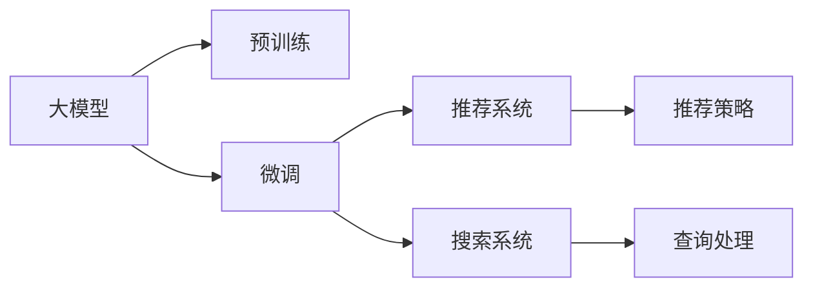
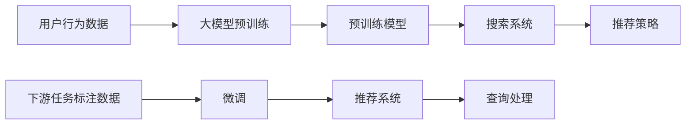

                 

# 搜索推荐系统的AI 大模型融合：电商平台的核心竞争力与转型策略

## 1. 背景介绍

在电商平台上，搜索和推荐系统是用户体验的核心组件，它们共同塑造了用户的购物体验。随着人工智能技术的发展，AI大模型在电商平台中的应用变得越来越普遍。本文将介绍AI大模型在搜索推荐系统中的应用，探讨其核心竞争力，以及平台应该如何进行转型以充分利用AI大模型的优势。

## 2. 核心概念与联系

### 2.1 核心概念概述

在电商平台的搜索推荐系统中，AI大模型主要扮演以下角色：

- **大模型**：指的是如BERT、GPT-3等大规模预训练语言模型。这些模型通过在大规模无标签数据上进行预训练，学习到通用的语言表示，可以应用于多种NLP任务。
- **预训练**：指在大规模无标签数据上，通过自监督学习任务训练大模型的过程。预训练使得模型学习到丰富的语言知识，为后续微调打下基础。
- **微调**：指在大规模预训练模型的基础上，使用下游任务的标注数据，通过有监督学习优化模型在特定任务上的性能。
- **推荐系统**：利用用户的历史行为、商品属性、用户画像等信息，推荐用户可能感兴趣的商品。
- **搜索系统**：根据用户的查询关键词，检索并推荐相关的商品或内容。

这些概念通过以下Mermaid流程图展示了它们之间的联系：



### 2.2 核心概念原理和架构的 Mermaid 流程图

这里提供一个简单的Mermaid流程图，展示了大模型在搜索推荐系统中的应用：



## 3. 核心算法原理 & 具体操作步骤

### 3.1 算法原理概述

AI大模型在电商平台的搜索推荐系统中主要通过预训练和微调两个步骤实现其核心竞争力。预训练使模型学习到通用的语言表示，微调则将模型适配到具体的搜索和推荐任务上。

### 3.2 算法步骤详解

1. **预训练**：
   - 使用大规模无标签数据（如Netflix的电影评论、亚马逊的产品描述等）训练大模型。
   - 预训练过程可以使用自监督任务，如掩码语言模型、序列分类等。
   - 预训练目标是为模型提供强大的语言表示能力，以便在微调时更好地适应具体的任务。

2. **微调**：
   - 收集下游任务（如搜索、推荐）的标注数据。
   - 使用下游任务的标注数据对预训练模型进行微调。
   - 微调过程可以使用监督学习算法，如梯度下降、Adam等。
   - 微调的目标是最小化损失函数，使得模型在特定任务上表现更好。

3. **融合**：
   - 将微调后的模型与其他算法（如协同过滤、深度学习等）结合，提升推荐和搜索系统的性能。
   - 采用多模型融合策略，如Stacking、Ensemble等，利用不同模型的优势。
   - 引入用户反馈，不断优化模型和策略。

### 3.3 算法优缺点

#### 优点：

- **泛化能力强**：大模型通过预训练学习到通用的语言表示，在微调时能够快速适应不同的任务。
- **效率高**：微调过程使用小规模标注数据，可以快速完成模型适配。
- **效果显著**：在推荐和搜索任务上，微调模型通常能显著提升系统的性能。

#### 缺点：

- **计算资源需求高**：预训练和微调需要大量的计算资源，如高性能GPU。
- **数据质量依赖大**：微调模型的效果依赖于标注数据的数量和质量，标注成本较高。
- **模型复杂度高**：大模型结构复杂，推理速度较慢。

### 3.4 算法应用领域

AI大模型在搜索推荐系统中的应用主要体现在以下几个领域：

- **个性化推荐**：通过用户的历史行为和兴趣，推荐个性化的商品。
- **搜索排序**：根据用户查询的关键词，推荐最相关的商品。
- **广告定向**：通过用户画像和行为数据，定向投放广告。
- **客户服务**：通过聊天机器人提供智能客服。

## 4. 数学模型和公式 & 详细讲解

### 4.1 数学模型构建

假设搜索系统接收用户查询$q$，模型输出为商品$r$的相关度$P(r|q)$。模型可以表示为：

$$
P(r|q) = f(Q(q), R(r), T(q,r))
$$

其中，$Q(q)$是查询编码器，$R(r)$是商品编码器，$T(q,r)$是交互编码器，$f$是融合函数。

### 4.2 公式推导过程

对于推荐系统，可以使用概率图模型来表示：

$$
P(r|u) = \frac{P(r|q_u)P(q_u)}{P(q_u)}
$$

其中，$q_u$是用户$u$的查询，$P(q_u)$是查询$q_u$的概率，$P(r|q_u)$是商品$r$在查询$q_u$下的概率。

通过最大化$P(r|u)$，可以使用最大似然估计或交叉熵损失函数进行训练：

$$
\mathcal{L} = -\frac{1}{N}\sum_{i=1}^N \log P(r_i|q_i)
$$

### 4.3 案例分析与讲解

以Amazon的推荐系统为例，其核心算法包括：

- **协同过滤**：基于用户的历史行为，推荐类似商品。
- **深度学习**：使用大模型进行商品表示学习，提升推荐效果。
- **上下文感知**：考虑用户当前的上下文信息，如时间、位置等。

## 5. 项目实践：代码实例和详细解释说明

### 5.1 开发环境搭建

- **环境准备**：
  - 安装Python 3.8及以上版本。
  - 安装PyTorch、TensorFlow等深度学习框架。
  - 安装Pandas、NumPy等数据处理工具。

- **项目结构**：
  - `data`：包含训练和测试数据集。
  - `models`：包含预训练和微调模型的代码。
  - `train`：包含训练脚本和日志文件。

### 5.2 源代码详细实现

这里提供一个简单的示例代码，使用BERT模型进行推荐系统的微调：

```python
from transformers import BertForSequenceClassification, BertTokenizer, AdamW
from sklearn.metrics import accuracy_score
import pandas as pd
import torch

# 加载数据集
train_data = pd.read_csv('train.csv')
test_data = pd.read_csv('test.csv')

# 分词和编码
tokenizer = BertTokenizer.from_pretrained('bert-base-uncased')
train_encodings = tokenizer(train_data['query'], train_data['item'], truncation=True, padding=True)
test_encodings = tokenizer(test_data['query'], test_data['item'], truncation=True, padding=True)

# 构建数据集
train_dataset = TensorDataset(torch.tensor(train_encodings['input_ids']), torch.tensor(train_encodings['attention_mask']), torch.tensor(train_encodings['labels']))
test_dataset = TensorDataset(torch.tensor(test_encodings['input_ids']), torch.tensor(test_encodings['attention_mask']), torch.tensor(test_encodings['labels']))

# 加载模型
model = BertForSequenceClassification.from_pretrained('bert-base-uncased', num_labels=2)
model.to(device)

# 定义优化器
optimizer = AdamW(model.parameters(), lr=2e-5)

# 训练模型
for epoch in range(10):
    for batch in train_loader:
        input_ids = batch[0].to(device)
        attention_mask = batch[1].to(device)
        labels = batch[2].to(device)
        
        model.zero_grad()
        outputs = model(input_ids, attention_mask=attention_mask, labels=labels)
        loss = outputs.loss
        loss.backward()
        optimizer.step()
        
    # 评估模型
    with torch.no_grad():
        predictions = model.predict(test_dataset)
        accuracy = accuracy_score(test_dataset['labels'], predictions)
        print(f'Epoch {epoch+1}, Accuracy: {accuracy:.3f}')
```

### 5.3 代码解读与分析

- **数据预处理**：使用BERT分词器对查询和商品进行分词和编码，生成适合模型输入的格式。
- **模型加载**：加载预训练的BERT模型，并设置训练设备。
- **优化器定义**：定义AdamW优化器，控制学习率等参数。
- **训练过程**：在每个epoch内，对训练数据进行迭代训练，计算损失并更新模型参数。
- **模型评估**：在测试集上评估模型性能，计算准确率等指标。

## 6. 实际应用场景

### 6.1 智能客服系统

智能客服系统可以应用大模型进行微调，以提升自然语言理解和处理能力。例如，通过收集用户的聊天记录，使用BERT模型进行微调，训练聊天机器人理解和回复用户的查询。

### 6.2 个性化推荐系统

个性化推荐系统可以应用大模型进行微调，以提升推荐的精准度和多样性。例如，使用用户的历史行为和兴趣进行微调，训练推荐模型，推荐用户可能感兴趣的商品。

### 6.3 搜索系统

搜索系统可以应用大模型进行微调，以提升搜索排序的效果。例如，使用用户查询的关键词进行微调，训练搜索模型，推荐最相关的商品。

### 6.4 广告定向系统

广告定向系统可以应用大模型进行微调，以提升广告的投放效果。例如，使用用户画像和行为数据进行微调，训练广告模型，定向投放广告。

## 7. 工具和资源推荐

### 7.1 学习资源推荐

- **《深度学习》课程**：斯坦福大学开设的NLP课程，涵盖深度学习的基本概念和算法。
- **《自然语言处理综述》**：NLP领域的经典综述，介绍自然语言处理的基本理论和应用。
- **Hugging Face官方文档**：提供丰富的预训练模型和微调样例代码。

### 7.2 开发工具推荐

- **PyTorch**：深度学习框架，支持动态图，适合研究性实验。
- **TensorFlow**：深度学习框架，支持静态图，适合生产环境部署。
- **Transformers库**：提供预训练模型的封装，简化微调过程。

### 7.3 相关论文推荐

- **《Attention is All You Need》**：介绍Transformer架构，推动预训练语言模型的发展。
- **《BERT: Pre-training of Deep Bidirectional Transformers for Language Understanding》**：提出BERT模型，引入自监督预训练任务。
- **《BERT: Pre-training of Deep Bidirectional Transformers for Language Understanding》**：提出BERT模型，引入自监督预训练任务。

## 8. 总结：未来发展趋势与挑战

### 8.1 未来发展趋势

- **模型规模增大**：随着算力成本的下降，预训练模型的参数量将持续增大，推动大模型的泛化能力提升。
- **计算效率提升**：未来将出现更高效的计算图和算法，提升大模型的推理速度和资源利用率。
- **多模态融合**：将视觉、语音等多模态数据与文本数据结合，提升搜索推荐系统的全面性。
- **个性化推荐**：基于用户的行为和兴趣，实现更精准、个性化的推荐。
- **搜索排序**：通过大模型进行查询编码和商品编码，提升搜索排序效果。

### 8.2 面临的挑战

- **数据质量**：标注数据的质量和数量直接影响模型的效果，如何获取高质量数据是一个挑战。
- **计算资源**：大模型的预训练和微调需要大量的计算资源，如何降低成本是一个难题。
- **模型复杂度**：大模型结构复杂，推理速度较慢，如何提升模型的效率是一个挑战。
- **泛化能力**：模型的泛化能力在长尾应用场景中可能不足，如何提高泛化能力是一个挑战。
- **安全性**：大模型可能存在偏见和有害信息，如何确保模型的安全性是一个挑战。

### 8.3 研究展望

未来，大模型在搜索推荐系统中的应用将不断扩展，推动电商平台的智能化转型。研究的重点将在于：

- **高效计算技术**：探索更高效的计算图和算法，提升大模型的推理速度和资源利用率。
- **多模态融合技术**：将视觉、语音等多模态数据与文本数据结合，提升搜索推荐系统的全面性。
- **个性化推荐算法**：基于用户的行为和兴趣，实现更精准、个性化的推荐。
- **搜索排序算法**：通过大模型进行查询编码和商品编码，提升搜索排序效果。

## 9. 附录：常见问题与解答

**Q1：大模型在搜索推荐系统中如何应用？**

A: 大模型在搜索推荐系统中主要通过预训练和微调两个步骤实现其核心竞争力。预训练使模型学习到通用的语言表示，微调则将模型适配到具体的搜索和推荐任务上。

**Q2：大模型在推荐系统中的融合策略有哪些？**

A: 大模型在推荐系统中的融合策略包括Stacking、Ensemble等。通过融合多个模型的输出，提升推荐的精准度和多样性。

**Q3：大模型在搜索系统中的查询处理方式有哪些？**

A: 大模型在搜索系统中的查询处理方式包括BERT编码、TF-IDF编码等。通过将查询和商品编码，进行匹配和排序，提升搜索效果。

**Q4：大模型在广告定向系统中的定向方式有哪些？**

A: 大模型在广告定向系统中的定向方式包括用户画像定向、行为定向等。通过用户画像和行为数据进行微调，实现精准的广告定向。

**Q5：大模型在智能客服系统中的应用方式有哪些？**

A: 大模型在智能客服系统中的应用方式包括聊天机器人的自然语言理解和回复生成。通过微调BERT等模型，训练聊天机器人理解用户的查询并生成回复。

---

作者：禅与计算机程序设计艺术 / Zen and the Art of Computer Programming

