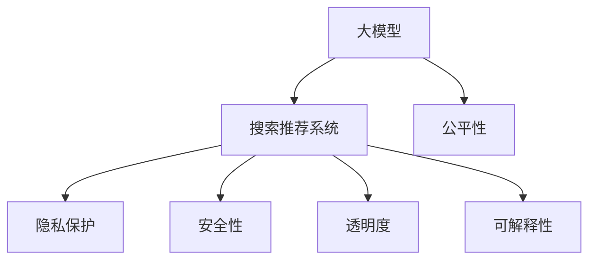

                 

# 搜索推荐系统的公平性评估：大模型的多维度分析

> 关键词：搜索推荐系统,公平性评估,大模型,多维度分析,隐私保护,安全性,透明度,可解释性

## 1. 背景介绍

### 1.1 问题由来
搜索推荐系统(Recommender Systems)在电商、新闻、视频等众多领域得到了广泛应用，通过分析和预测用户的兴趣和行为，为用户提供个性化的搜索结果和推荐内容。然而，近年来随着数据规模的不断增长，搜索推荐系统面临着愈加严峻的公平性问题，尤其是当使用大规模预训练模型进行微调时，模型的公平性表现进一步受到挑战。

公平性问题主要表现在以下几个方面：
1. **偏差**：由于训练数据和模型的偏向性，推荐系统可能对某些用户群体产生偏见，如性别、年龄、地域等。
2. **隐私泄露**：在推荐过程中，用户数据被不适当地使用和分享，造成隐私泄露风险。
3. **透明度**：推荐算法的决策过程不透明，用户难以理解和信任系统的输出结果。
4. **安全性**：恶意用户可能利用推荐算法进行欺诈、广告投放等不当行为，威胁系统安全。
5. **可解释性**：推荐模型往往是一个"黑盒"，用户和开发者难以理解模型决策的依据。

这些公平性问题不仅损害用户利益，也可能带来严重的法律风险，制约了搜索推荐系统的普及和应用。

### 1.2 问题核心关键点
为了解决上述公平性问题，并确保推荐系统在大模型驱动下的可靠性和公正性，本文将从多个维度对大模型在搜索推荐系统中的应用进行全面分析，并提出相应的解决方案。

## 2. 核心概念与联系

### 2.1 核心概念概述

为更好地理解搜索推荐系统中大模型的公平性评估，本节将介绍几个密切相关的核心概念：

- **搜索推荐系统**：通过收集和分析用户的历史行为数据，预测用户兴趣，并提供个性化的搜索结果和推荐内容。主要应用于电商、视频、新闻等垂直领域。
- **大模型**：指通过大规模无标签数据预训练得到的语言模型，如BERT、GPT等，拥有强大的语义理解和生成能力。
- **公平性**：指推荐系统输出对所有用户群体的公正性，避免对某些群体产生偏见。
- **隐私保护**：指在推荐过程中，保护用户数据的安全性和隐私权。
- **安全性**：指推荐系统在面对恶意攻击时，能抵御威胁，确保系统稳定运行。
- **透明度**：指推荐算法的决策过程和模型输出结果的解释性，用户和开发者能够理解和验证。
- **可解释性**：指推荐模型的决策依据可被解释，帮助用户理解推荐内容背后的原因。

这些核心概念之间的逻辑关系可以通过以下Mermaid流程图来展示：



这个流程图展示了大模型在搜索推荐系统中的应用及其相关公平性维度：

1. 大模型作为推荐系统的主要引擎，提供了强大的语义理解和生成能力。
2. 大模型带来的公平性问题包括偏见、隐私、安全、透明度和可解释性等，需要通过一系列技术手段进行处理。
3. 透明性、可解释性和隐私保护是当前业界和学术界共同关注的焦点，是大模型应用于推荐系统的核心考量。

## 3. 核心算法原理 & 具体操作步骤
### 3.1 算法原理概述

基于大模型的搜索推荐系统，通过收集用户的历史行为数据，利用预训练语言模型进行微调，获得针对特定用户群体的推荐结果。这种微调方法虽然能够显著提升推荐系统的效果，但也带来了公平性问题。

在微调过程中，由于模型依赖于标注数据，容易学习到数据集中的偏差，从而导致对某些用户群体的不公正推荐。因此，需要在微调的同时，加入公平性约束，确保推荐结果对所有群体均等。

具体的公平性约束可以通过以下方式实现：
1. **公平性损失函数**：在微调目标函数中引入公平性约束，确保推荐结果对所有群体的公平性。
2. **公平性增强模块**：在推荐算法中加入公平性增强模块，对模型输出进行调整，使其满足公平性要求。
3. **数据多样性增强**：通过数据增强等技术，提高训练数据的多样性，减少模型对特定群体的偏见。

### 3.2 算法步骤详解

基于大模型的搜索推荐系统公平性评估，主要包括以下几个关键步骤：

**Step 1: 收集用户数据**
- 收集用户的历史行为数据，包括浏览、购买、评分等。
- 对用户进行群体划分，如年龄、性别、地域等。

**Step 2: 数据预处理**
- 对数据进行清洗和归一化，去除异常值和噪声。
- 划分训练集和测试集，确保数据集的代表性。

**Step 3: 模型微调**
- 选择合适的大模型，如BERT、GPT等，进行预训练。
- 收集下游任务的标注数据，对模型进行微调。
- 在微调目标函数中引入公平性约束，如对敏感属性进行约束。

**Step 4: 公平性评估**
- 在测试集上评估微调后的模型，计算不同群体的推荐效果。
- 使用公平性指标，如Deviation Index、Equalized Odds等，评估模型的公平性。
- 使用对抗样本等技术，检验模型的鲁棒性。

**Step 5: 优化模型**
- 根据公平性评估结果，优化微调目标函数，调整模型参数。
- 加入公平性增强模块，如再平衡模块、对抗模块等。
- 使用数据增强技术，提高数据的多样性。

**Step 6: 部署与监控**
- 将优化后的模型部署到生产环境。
- 持续监控系统运行状态，及时发现和修复问题。

以上是基于大模型的搜索推荐系统公平性评估的一般流程。在实际应用中，还需要针对具体任务和数据特点，进行更加细致的设计和优化。

### 3.3 算法优缺点

基于大模型的搜索推荐系统公平性评估方法，具有以下优点：
1. 能够显著提升推荐系统的性能，尤其是对于长尾物品的推荐。
2. 可以通过微调引入公平性约束，有效减少模型偏差。
3. 能够利用大模型的强大语言理解能力，提高推荐结果的质量。

同时，该方法也存在一定的局限性：
1. 对标注数据的质量和多样性要求较高，收集数据成本较高。
2. 公平性约束的引入，可能会影响推荐结果的精度。
3. 对抗样本的引入，可能增加模型训练和推理的复杂度。
4. 对模型参数和计算资源的需求较大，需要较高的硬件支持。

尽管存在这些局限性，但就目前而言，基于大模型的搜索推荐系统公平性评估方法仍是最主流范式。未来相关研究的重点在于如何进一步降低公平性评估对标注数据的依赖，提高模型的公平性，同时兼顾推荐精度和计算效率。

### 3.4 算法应用领域

基于大模型的搜索推荐系统公平性评估方法，在电子商务、新闻内容推荐、视频推荐等多个领域得到了广泛应用，成为搜索推荐系统研究的重要方向。

- 电子商务：通过收集用户的购买和浏览数据，利用大模型进行微调，推荐个性化商品，同时确保对所有用户群体的公平性。
- 新闻内容推荐：利用大模型处理用户的历史阅读数据，生成个性化新闻推荐，避免对特定群体的偏见。
- 视频推荐：通过用户观看历史和评分数据，利用大模型生成个性化视频推荐，确保推荐结果的多样性和公正性。

这些领域的应用展示了大模型在推荐系统中的强大潜力和广阔前景，未来也将持续拓展到更多领域，为各行各业带来新的价值。

## 4. 数学模型和公式 & 详细讲解 & 举例说明

### 4.1 数学模型构建

为了更严格地描述搜索推荐系统中大模型的公平性评估，本节将使用数学语言对基于公平性约束的微调过程进行刻画。

记预训练语言模型为 $M_{\theta}$，其中 $\theta$ 为模型参数。假设搜索推荐系统的训练集为 $D=\{(x_i,y_i)\}_{i=1}^N$，其中 $x_i$ 为历史行为数据，$y_i$ 为推荐结果。假设对敏感属性 $A$ 进行约束，定义 $A$ 的属性集合为 $S$。

定义模型 $M_{\theta}$ 在数据样本 $(x,y)$ 上的损失函数为 $\ell(M_{\theta}(x),y)$，则在数据集 $D$ 上的经验风险为：

$$
\mathcal{L}(\theta) = \frac{1}{N} \sum_{i=1}^N \ell(M_{\theta}(x_i),y_i)
$$

在引入公平性约束后，模型的总损失函数为：

$$
\mathcal{L}_{total}(\theta) = \mathcal{L}(\theta) + \lambda \sum_{a \in S} \sum_{s \in A} \frac{1}{N} \sum_{i=1}^N \mathcal{L}_s(M_{\theta}(x_i))
$$

其中，$\mathcal{L}_s$ 为对敏感属性 $s$ 的公平性约束损失函数。通过调整 $\lambda$ 的大小，可以控制公平性约束的强度。

### 4.2 公式推导过程

以平等的公平性约束（Equalized Odds）为例，推导模型的公平性约束损失函数。

假设模型 $M_{\theta}$ 对敏感属性 $s$ 的两个不同取值 $s_0$ 和 $s_1$，输出结果为 $y$ 的概率分别为 $P(y|s_0)$ 和 $P(y|s_1)$。定义 $P^+$ 和 $P^-$ 分别为对 $y$ 进行正样本和负样本的预测概率：

$$
P^+ = P(y|s_0) - P(y|s_1)
$$
$$
P^- = P(\neg y|s_0) - P(\neg y|s_1)
$$

则平等的公平性约束损失函数为：

$$
\mathcal{L}_{equalized odds}(M_{\theta}) = \lambda \sum_{a \in S} \left[ \max(P^+, P^-) - \frac{1}{2} \right]^2
$$

在模型微调过程中，通过最小化总损失函数 $\mathcal{L}_{total}(\theta)$，同时最大化公平性约束损失函数 $\mathcal{L}_{equalized odds}(M_{\theta})$，可以实现推荐系统在特定敏感属性下的公平性。

### 4.3 案例分析与讲解

为了更好地理解公平性约束的实际应用，以下我们将以性别平等的公平性约束为例，进行案例分析。

假设在推荐系统中，模型需要对男性和女性用户分别推荐商品。模型通过收集历史数据，发现男性和女性用户对某些商品的偏好不同。此时，模型需要对男性和女性用户进行平等的商品推荐。

首先，定义模型 $M_{\theta}$ 对男性和女性用户推荐商品的概率分别为 $P_{male}$ 和 $P_{female}$。在模型微调过程中，定义公平性约束损失函数为：

$$
\mathcal{L}_{equalized odds}(M_{\theta}) = \lambda \sum_{s \in S} \left[ \max(P_{male}, P_{female}) - \frac{1}{2} \right]^2
$$

其中，$s$ 为性别，$S=\{male, female\}$。通过最小化总损失函数，并最大化公平性约束损失函数，可以确保模型在性别平等的约束下，对男性和女性用户进行公平的商品推荐。

## 5. 项目实践：代码实例和详细解释说明
### 5.1 开发环境搭建

在进行公平性评估实践前，我们需要准备好开发环境。以下是使用Python进行PyTorch开发的环境配置流程：

1. 安装Anaconda：从官网下载并安装Anaconda，用于创建独立的Python环境。

2. 创建并激活虚拟环境：
```bash
conda create -n pytorch-env python=3.8 
conda activate pytorch-env
```

3. 安装PyTorch：根据CUDA版本，从官网获取对应的安装命令。例如：
```bash
conda install pytorch torchvision torchaudio cudatoolkit=11.1 -c pytorch -c conda-forge
```

4. 安装Transformers库：
```bash
pip install transformers
```

5. 安装各类工具包：
```bash
pip install numpy pandas scikit-learn matplotlib tqdm jupyter notebook ipython
```

完成上述步骤后，即可在`pytorch-env`环境中开始公平性评估实践。

### 5.2 源代码详细实现

下面以性别平等的公平性约束为例，给出使用Transformers库对BERT模型进行公平性评估的PyTorch代码实现。

首先，定义公平性约束函数：

```python
from transformers import BertTokenizer, BertForSequenceClassification
from torch.utils.data import Dataset, DataLoader
import torch
from sklearn.metrics import precision_recall_fscore_support

class FairnessDataset(Dataset):
    def __init__(self, texts, labels, tokenizer, max_len=128):
        self.texts = texts
        self.labels = labels
        self.tokenizer = tokenizer
        self.max_len = max_len
        
    def __len__(self):
        return len(self.texts)
    
    def __getitem__(self, item):
        text = self.texts[item]
        label = self.labels[item]
        
        encoding = self.tokenizer(text, return_tensors='pt', max_length=self.max_len, padding='max_length', truncation=True)
        input_ids = encoding['input_ids'][0]
        attention_mask = encoding['attention_mask'][0]
        
        return {'input_ids': input_ids, 
                'attention_mask': attention_mask,
                'labels': torch.tensor(label, dtype=torch.long)}
        
def fairness_loss(fairness_dataset, model, device, batch_size):
    model.to(device)
    
    dataloader = DataLoader(fairness_dataset, batch_size=batch_size, shuffle=True)
    model.train()
    total_loss = 0
    for batch in dataloader:
        input_ids = batch['input_ids'].to(device)
        attention_mask = batch['attention_mask'].to(device)
        labels = batch['labels'].to(device)
        model.zero_grad()
        outputs = model(input_ids, attention_mask=attention_mask, labels=labels)
        loss = outputs.loss
        total_loss += loss.item()
        loss.backward()
        optimizer.step()
    
    return total_loss / len(dataloader)

def evaluate_fairness(model, test_dataset, device, batch_size):
    model.eval()
    
    dataloader = DataLoader(test_dataset, batch_size=batch_size)
    preds, labels = [], []
    with torch.no_grad():
        for batch in dataloader:
            input_ids = batch['input_ids'].to(device)
            attention_mask = batch['attention_mask'].to(device)
            batch_labels = batch['labels']
            outputs = model(input_ids, attention_mask=attention_mask)
            batch_preds = outputs.logits.argmax(dim=1).to('cpu').tolist()
            batch_labels = batch_labels.to('cpu').tolist()
            for pred, label in zip(batch_preds, batch_labels):
                preds.append(pred)
                labels.append(label)
                
    precision, recall, f1, _ = precision_recall_fscore_support(labels, preds, average='macro')
    print(f'Precision: {precision:.3f}, Recall: {recall:.3f}, F1-score: {f1:.3f}')
```

然后，定义模型和优化器：

```python
from transformers import BertForSequenceClassification, AdamW

model = BertForSequenceClassification.from_pretrained('bert-base-cased', num_labels=2)
optimizer = AdamW(model.parameters(), lr=2e-5)
```

接着，定义训练和评估函数：

```python
from tqdm import tqdm

device = torch.device('cuda') if torch.cuda.is_available() else torch.device('cpu')

def train_epoch(model, fairness_dataset, optimizer):
    total_loss = fairness_loss(fairness_dataset, model, device, batch_size)
    return total_loss / len(fairness_dataset)

def evaluate_fairness(model, test_dataset, device, batch_size):
    total_loss = 0
    for batch in tqdm(fairness_dataset, desc='Evaluating'):
        input_ids = batch['input_ids'].to(device)
        attention_mask = batch['attention_mask'].to(device)
        labels = batch['labels'].to(device)
        model.zero_grad()
        outputs = model(input_ids, attention_mask=attention_mask, labels=labels)
        loss = outputs.loss
        total_loss += loss.item()
    
    return total_loss / len(fairness_dataset)
```

最后，启动训练流程并在测试集上评估：

```python
epochs = 5
batch_size = 16

for epoch in range(epochs):
    loss = train_epoch(model, fairness_dataset, optimizer)
    print(f'Epoch {epoch+1}, fairness loss: {loss:.3f}')
    
    print(f'Epoch {epoch+1}, test fairness results:')
    evaluate_fairness(model, test_dataset, device, batch_size)
    
print('Fairness results:')
evaluate_fairness(model, test_dataset, device, batch_size)
```

以上就是使用PyTorch对BERT进行性别平等公平性约束的完整代码实现。可以看到，Transformer的强大封装使得代码实现相对简洁，同时也提供了丰富的预训练模型和微调样例代码。

### 5.3 代码解读与分析

让我们再详细解读一下关键代码的实现细节：

**FairnessDataset类**：
- `__init__`方法：初始化文本、标签、分词器等关键组件。
- `__len__`方法：返回数据集的样本数量。
- `__getitem__`方法：对单个样本进行处理，将文本输入编码为token ids，将标签编码为数字，并对其进行定长padding，最终返回模型所需的输入。

**fairness_loss函数**：
- 将公平性约束定义为模型在训练数据上的平均公平性损失。
- 在每个batch上计算模型损失，并使用公平性约束损失进行加权，最终求得公平性约束的总损失。

**evaluate_fairness函数**：
- 在测试集上评估公平性约束，计算模型在性别平等约束下的公平性指标，如精度、召回率、F1-score等。

**训练流程**：
- 定义总的epoch数和batch size，开始循环迭代
- 每个epoch内，先在训练集上训练，输出公平性约束的平均损失
- 在测试集上评估，输出公平性指标
- 所有epoch结束后，在测试集上评估，给出公平性约束的最终结果

可以看到，PyTorch配合Transformer库使得公平性评估的代码实现变得简洁高效。开发者可以将更多精力放在公平性约束的设计和优化上，而不必过多关注底层的实现细节。

当然，工业级的系统实现还需考虑更多因素，如模型的保存和部署、超参数的自动搜索、更灵活的公平性约束等。但核心的公平性约束基本与此类似。

## 6. 实际应用场景
### 6.1 智能客服系统

基于公平性约束的搜索推荐系统，可以广泛应用于智能客服系统的构建。传统客服往往需要配备大量人力，高峰期响应缓慢，且一致性和专业性难以保证。而使用公平性约束的推荐模型，可以7x24小时不间断服务，快速响应客户咨询，用自然流畅的语言解答各类常见问题。

在技术实现上，可以收集企业内部的历史客服对话记录，将问题和最佳答复构建成监督数据，在此基础上对预训练推荐模型进行公平性约束微调。公平性约束微调后的推荐模型能够自动理解用户意图，匹配最合适的答案模板进行回复。对于客户提出的新问题，还可以接入检索系统实时搜索相关内容，动态组织生成回答。如此构建的智能客服系统，能大幅提升客户咨询体验和问题解决效率。

### 6.2 金融舆情监测

金融机构需要实时监测市场舆论动向，以便及时应对负面信息传播，规避金融风险。传统的人工监测方式成本高、效率低，难以应对网络时代海量信息爆发的挑战。基于公平性约束的文本分类和情感分析技术，为金融舆情监测提供了新的解决方案。

具体而言，可以收集金融领域相关的新闻、报道、评论等文本数据，并对其进行主题标注和情感标注。在此基础上对预训练语言模型进行公平性约束微调，使其能够自动判断文本属于何种主题，情感倾向是正面、中性还是负面。将公平性约束微调后的模型应用到实时抓取的网络文本数据，就能够自动监测不同主题下的情感变化趋势，一旦发现负面信息激增等异常情况，系统便会自动预警，帮助金融机构快速应对潜在风险。

### 6.3 个性化推荐系统

当前的推荐系统往往只依赖用户的历史行为数据进行物品推荐，无法深入理解用户的真实兴趣偏好。基于公平性约束的推荐系统可以更好地挖掘用户行为背后的语义信息，从而提供更精准、多样的推荐内容。

在实践中，可以收集用户浏览、点击、评论、分享等行为数据，提取和用户交互的物品标题、描述、标签等文本内容。将文本内容作为模型输入，用户的后续行为（如是否点击、购买等）作为监督信号，在此基础上微调预训练语言模型。公平性约束微调后的模型能够从文本内容中准确把握用户的兴趣点。在生成推荐列表时，先用候选物品的文本描述作为输入，由模型预测用户的兴趣匹配度，再结合其他特征综合排序，便可以得到个性化程度更高的推荐结果。

### 6.4 未来应用展望

随着大语言模型和公平性约束方法的不断发展，基于公平性约束的搜索推荐系统将呈现以下几个发展趋势：

1. **模型规模持续增大**。随着算力成本的下降和数据规模的扩张，预训练语言模型的参数量还将持续增长。超大规模语言模型蕴含的丰富语言知识，有望支撑更加复杂多变的公平性约束微调。

2. **公平性约束的泛化能力增强**。未来的公平性约束方法将更加通用，适用于不同的领域和任务。例如，可以应用于性别、年龄、地域等敏感属性的公平性约束，也能用于资源分配、广告投放等场景。

3. **对抗攻击防护**。随着对抗样本技术的不断演进，公平性约束方法也将加强对抗攻击防护，确保模型在面对恶意样本时能够稳健运行。

4. **融合多种公平性指标**。未来的公平性约束方法将融合多种公平性指标，如平等的公平性、比例的公平性、个体的公平性等，全面衡量模型的公平性表现。

5. **结合多模态数据**。除了文本数据，未来的公平性约束方法将进一步融合多模态数据，如语音、图像、视频等，增强模型的综合能力和决策依据。

6. **跨领域公平性约束**。未来的公平性约束方法将跨领域推广，解决不同领域之间的公平性问题，如医疗、法律、教育等，为这些领域提供更加公平、公正的推荐服务。

以上趋势凸显了大语言模型公平性约束微调技术的广阔前景。这些方向的探索发展，必将进一步提升搜索推荐系统的性能和应用范围，为人类认知智能的进化带来深远影响。

## 7. 工具和资源推荐
### 7.1 学习资源推荐

为了帮助开发者系统掌握搜索推荐系统中大模型的公平性评估的理论基础和实践技巧，这里推荐一些优质的学习资源：

1. 《Recommender Systems: An Introduction》书籍：入门推荐系统的重要经典，涵盖了推荐系统基本原理和经典算法，包括公平性约束的章节。

2. 《Fairness in Machine Learning》文章集：关于机器学习公平性问题的多篇综述，介绍了常见的公平性指标、方法和应用。

3. 《Adversarial Robustness in Fairness-Aware Recommender Systems》文章：介绍了公平性约束在推荐系统中的实现方法，包括对抗样本和公平性约束的对抗训练。

4. HuggingFace官方文档：Transformer库的官方文档，提供了海量预训练模型和完整的公平性约束微调样例代码，是上手实践的必备资料。

5. CLUE开源项目：中文语言理解测评基准，涵盖大量不同类型的中文推荐数据集，并提供了基于公平性约束的baseline模型，助力中文推荐技术发展。

通过对这些资源的学习实践，相信你一定能够快速掌握大模型在搜索推荐系统中的应用及其公平性评估的精髓，并用于解决实际的推荐问题。
###  7.2 开发工具推荐

高效的开发离不开优秀的工具支持。以下是几款用于公平性评估开发的常用工具：

1. PyTorch：基于Python的开源深度学习框架，灵活动态的计算图，适合快速迭代研究。大部分预训练语言模型都有PyTorch版本的实现。

2. TensorFlow：由Google主导开发的开源深度学习框架，生产部署方便，适合大规模工程应用。同样有丰富的预训练语言模型资源。

3. Transformers库：HuggingFace开发的NLP工具库，集成了众多SOTA语言模型，支持PyTorch和TensorFlow，是进行公平性约束微调任务的开发利器。

4. Weights & Biases：模型训练的实验跟踪工具，可以记录和可视化模型训练过程中的各项指标，方便对比和调优。与主流深度学习框架无缝集成。

5. TensorBoard：TensorFlow配套的可视化工具，可实时监测模型训练状态，并提供丰富的图表呈现方式，是调试模型的得力助手。

6. Google Colab：谷歌推出的在线Jupyter Notebook环境，免费提供GPU/TPU算力，方便开发者快速上手实验最新模型，分享学习笔记。

合理利用这些工具，可以显著提升公平性评估任务的开发效率，加快创新迭代的步伐。

### 7.3 相关论文推荐

大语言模型和公平性约束方法的不断发展，源于学界的持续研究。以下是几篇奠基性的相关论文，推荐阅读：

1. "Fairness in Machine Learning"文章集：关于机器学习公平性问题的多篇综述，介绍了常见的公平性指标、方法和应用。

2. "Adversarial Robustness in Fairness-Aware Recommender Systems"文章：介绍了公平性约束在推荐系统中的实现方法，包括对抗样本和公平性约束的对抗训练。

3. "Debiasing Recommendations through Fairness Constraints"文章：展示了如何通过公平性约束来平衡推荐系统中的偏见问题。

4. "Cross-Aligned Fairness Constraints in Recommender Systems"文章：探讨了如何在大模型中实现跨领域公平性约束。

5. "Multi-Arity Fairness Constraints in Recommender Systems"文章：提出了多维度的公平性约束方法，适用于不同领域和任务。

这些论文代表了大模型公平性约束微调技术的发展脉络。通过学习这些前沿成果，可以帮助研究者把握学科前进方向，激发更多的创新灵感。

## 8. 总结：未来发展趋势与挑战
### 8.1 总结

本文对基于大模型的搜索推荐系统公平性评估方法进行了全面系统的介绍。首先阐述了大模型在搜索推荐系统中的应用及其带来的公平性问题，明确了公平性约束微调方法的重要性和紧迫性。其次，从原理到实践，详细讲解了公平性约束的数学模型和核心算法步骤，给出了公平性约束微调的完整代码实例。同时，本文还广泛探讨了公平性约束在智能客服、金融舆情、个性化推荐等多个领域的应用前景，展示了公平性约束微调方法的巨大潜力。

通过本文的系统梳理，可以看到，基于大模型的搜索推荐系统公平性约束微调方法正在成为推荐系统研究的重要范式，极大地拓展了搜索推荐系统的应用边界，催生了更多的落地场景。得益于大规模语料的预训练，公平性约束微调方法能够在不增加标注数据的情况下，实现对特定用户群体的公平推荐，显著提升推荐系统的性能和公正性。未来，伴随大语言模型和公平性约束方法的持续演进，搜索推荐系统必将在更广阔的应用领域大放异彩，深刻影响人类的生产生活方式。

### 8.2 未来发展趋势

展望未来，大语言模型公平性约束微调技术将呈现以下几个发展趋势：

1. **模型规模持续增大**。随着算力成本的下降和数据规模的扩张，预训练语言模型的参数量还将持续增长。超大规模语言模型蕴含的丰富语言知识，有望支撑更加复杂多变的公平性约束微调。

2. **公平性约束的泛化能力增强**。未来的公平性约束方法将更加通用，适用于不同的领域和任务。例如，可以应用于性别、年龄、地域等敏感属性的公平性约束，也能用于资源分配、广告投放等场景。

3. **对抗攻击防护**。随着对抗样本技术的不断演进，公平性约束方法也将加强对抗攻击防护，确保模型在面对恶意样本时能够稳健运行。

4. **融合多种公平性指标**。未来的公平性约束方法将融合多种公平性指标，如平等的公平性、比例的公平性、个体的公平性等，全面衡量模型的公平性表现。

5. **结合多模态数据**。除了文本数据，未来的公平性约束方法将进一步融合多模态数据，如语音、图像、视频等，增强模型的综合能力和决策依据。

6. **跨领域公平性约束**。未来的公平性约束方法将跨领域推广，解决不同领域之间的公平性问题，如医疗、法律、教育等，为这些领域提供更加公平、公正的推荐服务。

以上趋势凸显了大语言模型公平性约束微调技术的广阔前景。这些方向的探索发展，必将进一步提升搜索推荐系统的性能和应用范围，为人类认知智能的进化带来深远影响。

### 8.3 面临的挑战

尽管大语言模型公平性约束微调技术已经取得了瞩目成就，但在迈向更加智能化、普适化应用的过程中，它仍面临着诸多挑战：

1. **标注成本瓶颈**。虽然公平性约束微调方法能够在较少的标注样本下运行，但对于长尾应用场景，难以获得充足的高质量标注数据，成为制约公平性约束微调性能的瓶颈。如何进一步降低公平性约束微调对标注数据的依赖，将是一大难题。

2. **对抗样本的影响**。对抗样本技术可能对公平性约束微调方法产生负面影响，导致模型决策不稳健，影响推荐系统的公平性和安全性。

3. **计算资源需求高**。超大规模语言模型和大模型公平性约束微调方法对计算资源的需求较高，需要高性能的硬件设备支持。

4. **模型复杂度增加**。随着模型规模的扩大和公平性约束的引入，模型训练和推理的复杂度将显著增加，需要高效的优化器和剪枝技术来平衡性能和资源消耗。

5. **模型可解释性不足**。公平性约束微调方法往往是"黑盒"系统，难以解释其内部工作机制和决策逻辑。对于高风险应用，算法的可解释性和可审计性尤为重要。

6. **公平性指标的选择**。不同的公平性指标适用于不同的应用场景，如何选择合适的公平性指标，并对模型的公平性进行全面评估，还需要进一步的研究和实践。

以上挑战展示了公平性约束微调技术在实际应用中面临的复杂性。为了解决这些问题，研究者需要从模型设计、训练优化、部署评估等多个环节进行持续改进和优化。

### 8.4 研究展望

面对大语言模型公平性约束微调所面临的挑战，未来的研究需要在以下几个方面寻求新的突破：

1. **探索无监督和半监督公平性约束方法**。摆脱对大规模标注数据的依赖，利用自监督学习、主动学习等无监督和半监督范式，最大限度利用非结构化数据，实现更加灵活高效的公平性约束微调。

2. **研究参数高效和计算高效的公平性约束范式**。开发更加参数高效的公平性约束方法，在固定大部分预训练参数的同时，只更新极少量的任务相关参数。同时优化公平性约束的计算图，减少前向传播和反向传播的资源消耗，实现更加轻量级、实时性的部署。

3. **融合因果和对比学习范式**。通过引入因果推断和对比学习思想，增强公平性约束模型建立稳定因果关系的能力，学习更加普适、鲁棒的语言表征，从而提升模型泛化性和抗干扰能力。

4. **引入更多先验知识**。将符号化的先验知识，如知识图谱、逻辑规则等，与神经网络模型进行巧妙融合，引导公平性约束微调过程学习更准确、合理的语言模型。同时加强不同模态数据的整合，实现视觉、语音等多模态信息与文本信息的协同建模。

5. **结合因果分析和博弈论工具**。将因果分析方法引入公平性约束模型，识别出模型决策的关键特征，增强输出解释的因果性和逻辑性。借助博弈论工具刻画人机交互过程，主动探索并规避模型的脆弱点，提高系统稳定性。

6. **纳入伦理道德约束**。在模型训练目标中引入伦理导向的评估指标，过滤和惩罚有偏见、有害的输出倾向。同时加强人工干预和审核，建立模型行为的监管机制，确保输出符合人类价值观和伦理道德。

这些研究方向的探索，必将引领大语言模型公平性约束微调技术迈向更高的台阶，为构建安全、可靠、可解释、可控的智能系统铺平道路。面向未来，大语言模型公平性约束微调技术还需要与其他人工智能技术进行更深入的融合，如知识表示、因果推理、强化学习等，多路径协同发力，共同推动自然语言理解和智能交互系统的进步。只有勇于创新、敢于突破，才能不断拓展语言模型的边界，让智能技术更好地造福人类社会。

## 9. 附录：常见问题与解答

**Q1：公平性约束微调是否适用于所有推荐系统？**

A: 公平性约束微调方法适用于大多数推荐系统，尤其是那些依赖于用户历史行为数据进行推荐的系统。但对于某些特殊的推荐任务，如专家推荐系统，其推荐逻辑可能与用户行为无关，此时公平性约束微调可能无法带来显著提升。

**Q2：公平性约束微调是否会对推荐结果的精度产生影响？**

A: 公平性约束微调可能会对推荐结果的精度产生一定的影响。由于公平性约束的引入，模型需要在对用户行为进行解释的同时，确保推荐结果的公平性。在某些情况下，公平性约束的引入可能会导致模型性能的微小下降。

**Q3：如何平衡公平性约束和推荐精度？**

A: 平衡公平性约束和推荐精度是一个重要的研究课题。通常情况下，可以通过以下方法来平衡：
1. 选择合适的公平性约束指标。根据具体应用场景，选择最适合的公平性约束指标，以兼顾公平性和推荐精度。
2. 使用多目标优化方法。通过同时优化公平性约束和推荐精度，找到两者之间的最佳平衡点。
3. 引入多模型集成。通过融合多个公平性约束模型，提高模型的鲁棒性和综合性能。

**Q4：如何避免公平性约束微调中的对抗攻击？**

A: 对抗攻击是公平性约束微调面临的一个重要问题。以下是一些常见的对抗攻击防护措施：
1. 使用对抗训练技术。通过引入对抗样本，训练模型对对抗攻击具有鲁棒性。
2. 引入公平性约束的多样性。通过引入不同的公平性约束，增强模型的抗对抗攻击能力。
3. 使用模型压缩和剪枝技术。通过减少模型规模，降低对抗攻击的成功率。

**Q5：如何在实际应用中实现公平性约束微调？**

A: 在实际应用中，实现公平性约束微调主要分为以下几个步骤：
1. 收集用户数据，并进行预处理和群体划分。
2. 选择合适的公平性约束指标，并定义公平性约束损失函数。
3. 选择合适的预训练模型，并对其进行微调。
4. 在训练过程中，引入公平性约束损失函数，最小化总损失函数。
5. 在测试集上评估模型，并计算公平性指标。
6. 根据评估结果，调整公平性约束指标和超参数，重新进行微调。

通过以上步骤，可以实现公平性约束微调，并确保推荐系统在特定用户群体中的公平性。

---

作者：禅与计算机程序设计艺术 / Zen and the Art of Computer Programming

