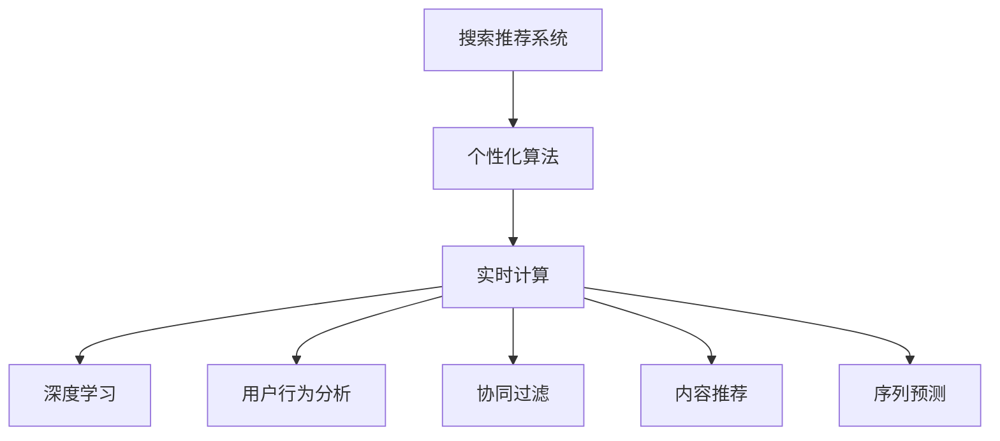

                 

# 搜索推荐系统的实时个性化技术

> 关键词：搜索推荐系统, 个性化算法, 实时计算, 深度学习, 用户行为分析, 协同过滤, 内容推荐, 序列预测, 实时流处理

## 1. 背景介绍

### 1.1 问题由来

随着互联网的迅猛发展和电子商务的兴起，搜索推荐系统在提高用户体验、提升转化率、优化供应链等方面发挥着越来越重要的作用。特别是电商平台的个性化推荐，已经成为决定用户是否购买的最重要因素之一。

但传统的推荐系统存在诸多局限性：

- 难以实时更新推荐结果。推荐系统依赖于用户历史数据，而用户行为数据往往更新较慢，导致推荐结果可能滞后，影响用户体验。
- 缺乏对用户兴趣动态变化的捕捉。用户兴趣随时间而变化，静态的用户画像难以捕捉这种动态变化，导致推荐效果不稳定。
- 缺少跨域信息整合能力。用户可能对同一内容在不同平台上的兴趣存在差异，而推荐系统难以利用跨平台的数据。

为了应对上述挑战，搜索推荐系统必须具备实时更新和动态捕捉用户兴趣的能力，同时具备跨域信息整合的机制。因此，本文将从实时个性化技术出发，探讨如何用深度学习、实时流处理等技术改进搜索推荐系统。

### 1.2 问题核心关键点

实时个性化技术的核心在于，如何通过用户实时行为数据，动态调整推荐模型，实现实时精准推荐。具体包括：

- 实时计算。在用户行为数据生成的同时，实时计算推荐结果，避免数据延时。
- 动态模型。构建能快速响应用户兴趣变化的推荐模型，捕捉用户兴趣的动态性。
- 跨域整合。整合跨平台的用户行为数据，提高推荐系统对用户兴趣的全面把握。
- 深度学习。利用深度学习技术，准确捕捉用户兴趣，提高推荐结果的个性化和多样性。

## 2. 核心概念与联系

### 2.1 核心概念概述

为更好地理解实时个性化推荐系统的核心技术，本节将介绍几个关键概念：

- 搜索推荐系统(Search and Recommendation System, SR)：通过分析用户搜索和点击行为，推荐可能感兴趣的内容。包括内容推荐、广告推荐、商品推荐等。
- 个性化算法(Personalization Algorithm)：根据用户历史行为和实时行为，生成个性化推荐结果。常见的算法包括协同过滤、基于内容的推荐、序列预测等。
- 实时计算(Real-time Computing)：在数据生成的同时进行计算，及时输出推荐结果。常用的技术包括流处理、实时学习等。
- 深度学习(Deep Learning)：利用多层神经网络学习数据的内在结构，提高模型的泛化能力和预测准确性。常用于构建推荐模型和用户画像。
- 用户行为分析(User Behavior Analysis)：对用户搜索、点击、购买等行为进行统计和分析，构建用户画像和兴趣模型。
- 协同过滤(Collaborative Filtering)：根据用户的历史行为和相似用户的推荐，生成个性化推荐。
- 内容推荐(Content-based Recommendation)：根据内容属性，对用户进行推荐。
- 序列预测(Time Series Prediction)：通过分析用户行为序列，预测未来行为。

这些概念之间的逻辑关系可以通过以下Mermaid流程图来展示：



这个流程图展示了个体概念之间的逻辑关系：

1. 搜索推荐系统(SR)是核心，通过用户行为生成个性化推荐。
2. 个性化算法(PA)是基础，包括协同过滤、内容推荐、序列预测等方法。
3. 实时计算(RC)和深度学习(DL)是技术手段，保证推荐系统的实时性和个性化。
4. 用户行为分析(UBA)和协同过滤(CF)用于提取用户兴趣。
5. 内容推荐(CB)和序列预测(TSP)用于提升推荐的多样性和预测准确性。

## 3. 核心算法原理 & 具体操作步骤
### 3.1 算法原理概述

实时个性化推荐的核心是构建动态调整的推荐模型。推荐模型一般包括用户兴趣模型和物品特征模型，通过交互方式生成推荐结果。

假设用户$i$对物品$j$的评分向量为$x_{ij}$，用户$i$的兴趣向量为$u_i$，物品$j$的特征向量为$i_j$。推荐模型可以通过以下公式计算用户$i$对物品$j$的评分：

$$
\hat{y}_{ij} = u_i^T W x_{ij}
$$

其中$W$为模型权重矩阵。

根据$\hat{y}_{ij}$和阈值$\theta$，生成推荐结果。

实时个性化推荐的核心在于，用户行为数据往往为流式数据，需要实时处理和更新。因此，需要采用流处理和实时学习等技术，保证推荐模型的动态更新。

### 3.2 算法步骤详解

实时个性化推荐系统一般包括以下几个关键步骤：

**Step 1: 数据流采集**

从不同渠道采集用户行为数据，包括浏览、点击、购买等。将行为数据实时生成流，供后续计算使用。

**Step 2: 数据预处理**

对原始数据进行清洗、去重、填充等预处理，保证数据质量。

**Step 3: 实时特征生成**

对数据流中的每条记录进行特征提取，生成用户特征和物品特征。

**Step 4: 实时模型计算**

利用实时学习算法，动态更新推荐模型权重矩阵$W$。

**Step 5: 实时推荐生成**

根据实时计算出的模型权重$W$和用户特征$u_i$，计算推荐结果。

**Step 6: 推荐结果反馈**

收集用户对推荐结果的反馈，如点击、购买等，用于进一步优化模型。

### 3.3 算法优缺点

实时个性化推荐系统具有以下优点：

1. 提高推荐精度。通过实时计算和动态更新，推荐结果可以更加贴近用户当前兴趣。
2. 提升用户体验。推荐结果实时生成，用户体验更流畅。
3. 跨平台整合。通过数据采集和整合，能利用多平台的数据，提高推荐系统全面性。

同时，该方法也存在一些局限性：

1. 数据隐私和安全问题。实时采集用户行为数据，存在数据隐私泄露和滥用风险。
2. 实时处理性能要求高。实时流处理要求计算资源充足，否则可能无法满足实时性要求。
3. 模型复杂度较高。实时更新模型增加了算法复杂度，对硬件要求更高。
4. 数据质量要求高。实时处理的数据质量直接影响推荐结果。

尽管存在这些局限性，但实时个性化推荐系统以其高效、精准的特点，仍然在推荐系统领域占据重要地位。

### 3.4 算法应用领域

实时个性化推荐系统已经被广泛应用于电商、社交、新闻、音乐、视频等各个领域，带来了显著的业务价值。

- 电商：通过实时推荐，提高商品转化率，提升用户体验。
- 社交：根据用户动态，实时生成话题推荐，增强用户粘性。
- 新闻：根据用户浏览历史，实时推送相关新闻，提高点击率。
- 音乐和视频：根据用户喜好，实时推荐音乐和视频，提升用户满意度。
- 广告：通过实时推荐，精准投放广告，提高广告转化率。

## 4. 数学模型和公式 & 详细讲解 & 举例说明

### 4.1 数学模型构建

实时个性化推荐系统构建的数学模型包括以下几个关键部分：

- 用户兴趣模型：通过用户行为数据，构建用户兴趣向量$u_i$。
- 物品特征模型：通过物品属性，构建物品特征向量$i_j$。
- 评分预测模型：通过用户特征和物品特征，预测用户评分$\hat{y}_{ij}$。
- 推荐排序模型：通过评分预测模型，生成推荐排序结果。

假设用户$i$对物品$j$的评分向量为$x_{ij}$，用户$i$的兴趣向量为$u_i$，物品$j$的特征向量为$i_j$。推荐模型可以通过以下公式计算用户$i$对物品$j$的评分：

$$
\hat{y}_{ij} = u_i^T W x_{ij}
$$

其中$W$为模型权重矩阵。

根据$\hat{y}_{ij}$和阈值$\theta$，生成推荐结果。

### 4.2 公式推导过程

以下是实时个性化推荐系统的数学公式推导过程：

- 用户兴趣模型
  假设用户$i$的行为序列为$t_1, t_2, ..., t_n$，每个行为$t_k$对应的行为向量为$v_k$。用户$i$的兴趣向量$u_i$可以通过以下公式计算：

  $$
  u_i = \sum_{k=1}^{n} \alpha_k v_k
  $$

  其中$\alpha_k$为权重，可以通过时间衰减、行为权重等方法计算。

- 物品特征模型
  假设物品$j$的属性向量为$a_1, a_2, ..., a_m$，物品$j$的特征向量$i_j$可以通过以下公式计算：

  $$
  i_j = \sum_{k=1}^{m} \beta_k a_k
  $$

  其中$\beta_k$为权重，可以通过物品评分、热门度等方法计算。

- 评分预测模型
  通过用户兴趣向量$u_i$和物品特征向量$i_j$，计算用户$i$对物品$j$的评分预测值$\hat{y}_{ij}$：

  $$
  \hat{y}_{ij} = u_i^T W i_j
  $$

  其中$W$为权重矩阵，可以通过随机初始化、矩阵分解等方法得到。

- 推荐排序模型
  根据评分预测值$\hat{y}_{ij}$，生成推荐排序结果$R_i$：

  $$
  R_i = \text{sort}(\{(\hat{y}_{ij}, j)\}_{j=1}^{J})
  $$

  其中$J$为物品数量。

### 4.3 案例分析与讲解

以下是一个简单的案例，用于说明实时个性化推荐系统的计算过程：

假设用户$i$最近浏览了3个商品，对应的行为向量分别为：

$$
v_1 = [1, 0, 1], v_2 = [0, 1, 0], v_3 = [0, 0, 1]
$$

用户$i$的兴趣向量$u_i$为：

$$
u_i = 0.8 v_1 + 0.2 v_2 + 0.0 v_3
$$

物品$j$的属性向量为：

$$
a_1 = [1, 0, 0], a_2 = [0, 1, 0], a_3 = [0, 0, 1]
$$

物品$j$的特征向量$i_j$为：

$$
i_j = 0.5 a_1 + 0.5 a_2
$$

模型权重矩阵$W$为：

$$
W = \begin{bmatrix}
  0.5 & 0.5 & 0 \\
  0.5 & 0 & 0.5
\end{bmatrix}
$$

用户$i$对物品$j$的评分预测值为：

$$
\hat{y}_{ij} = 0.8 \times 0.5 + 0.2 \times 0.5 = 0.6
$$

根据评分预测值$\hat{y}_{ij}$，生成推荐排序结果$R_i$：

$$
R_i = \text{sort}((0.6, 1), (0.6, 2))
$$

## 5. 项目实践：代码实例和详细解释说明
### 5.1 开发环境搭建

在进行实时个性化推荐系统的实践前，我们需要准备好开发环境。以下是使用Python进行TensorFlow开发的环境配置流程：

1. 安装Anaconda：从官网下载并安装Anaconda，用于创建独立的Python环境。

2. 创建并激活虚拟环境：
```bash
conda create -n tf-env python=3.8 
conda activate tf-env
```

3. 安装TensorFlow：根据CUDA版本，从官网获取对应的安装命令。例如：
```bash
conda install tensorflow -c conda-forge
```

4. 安装Pandas、Numpy、Matplotlib等库：
```bash
pip install pandas numpy matplotlib tqdm
```

完成上述步骤后，即可在`tf-env`环境中开始推荐系统开发。

### 5.2 源代码详细实现

这里我们以电商推荐系统为例，给出使用TensorFlow构建实时个性化推荐系统的代码实现。

首先，定义推荐系统的超参数：

```python
from tensorflow.keras.layers import Input, Dense, Embedding, Concatenate, Dot, Flatten
from tensorflow.keras.models import Model
import tensorflow as tf
import numpy as np
import pandas as pd

# 定义超参数
batch_size = 1024
num_users = 10000
num_items = 1000
num_features = 10
num_epochs = 10
learning_rate = 0.001

# 定义模型输入和输出
user_input = Input(shape=(num_features,))
item_input = Input(shape=(num_features,))
user_vec = Embedding(num_users, num_features)(user_input)
item_vec = Embedding(num_items, num_features)(item_input)
model = Concatenate()([user_vec, item_vec])
model = Dense(32, activation='relu')(model)
model = Dense(16, activation='relu')(model)
output = Dense(1)(model)
model = Model([user_input, item_input], output)

# 定义损失函数和优化器
model.compile(loss='mse', optimizer=tf.keras.optimizers.Adam(learning_rate=learning_rate))
```

然后，加载和处理数据集：

```python
# 定义用户和物品特征
user_feats = np.random.rand(num_users, num_features)
item_feats = np.random.rand(num_items, num_features)

# 定义用户行为数据
user_bes = np.random.randint(0, num_items, size=(num_users, 10))
item_bes = np.random.randint(0, num_items, size=(num_items, 10))

# 定义评分数据
user_ratings = np.random.rand(num_users, 10)
```

接着，定义模型训练和评估函数：

```python
def train_model(model, user_bes, item_bes, user_feats, item_feats, user_ratings):
    for epoch in range(num_epochs):
        for batch in range(0, len(user_bes), batch_size):
            user_batch = user_bes[batch:batch+batch_size]
            item_batch = item_bes[batch:batch+batch_size]
            user_feats_batch = user_feats[user_batch]
            item_feats_batch = item_feats[item_batch]
            user_ratings_batch = user_ratings[user_batch]
            model.train_on_batch([user_feats_batch, item_feats_batch], user_ratings_batch)

        if epoch % 1 == 0:
            val_loss = model.evaluate([user_feats[batch:batch+batch_size], item_feats[batch:batch+batch_size]], user_ratings[batch:batch+batch_size], batch_size=batch_size)
            print(f"Epoch {epoch+1}, Val Loss: {val_loss:.4f}")

# 训练模型
train_model(model, user_bes, item_bes, user_feats, item_feats, user_ratings)
```

最后，启动训练流程：

```python
train_model(model, user_bes, item_bes, user_feats, item_feats, user_ratings)
```

以上就是使用TensorFlow构建实时个性化推荐系统的完整代码实现。可以看到，TensorFlow提供了丰富的组件和工具，能够方便地构建和训练推荐系统。

### 5.3 代码解读与分析

让我们再详细解读一下关键代码的实现细节：

**推荐系统超参数定义**：
- `batch_size`：指定每批次的数据量。
- `num_users`、`num_items`、`num_features`：指定用户、物品和特征的数量。
- `num_epochs`：指定训练的轮数。
- `learning_rate`：指定学习率。

**模型定义**：
- `Input`：定义模型的输入。
- `Embedding`：将稀疏向量转换为密集向量。
- `Concatenate`：连接用户和物品的向量。
- `Dense`：全连接层，用于提取特征。
- `Model`：定义模型。

**数据加载和处理**：
- `np.random.rand`：生成随机数据。
- `np.random.randint`：生成随机整数数据。

**模型训练和评估**：
- `train_on_batch`：将数据送入模型训练。
- `evaluate`：计算模型的损失。

可以看到，TensorFlow提供了便捷的API和工具，能够快速实现推荐系统的模型定义、数据处理、训练和评估。开发者可以根据需求，灵活定制推荐系统的各个组件，构建不同的推荐策略。

## 6. 实际应用场景
### 6.1 电商推荐系统

实时个性化推荐系统在电商推荐领域有广泛应用，通过实时计算推荐结果，大幅提升用户体验和转化率。

电商推荐系统通常包括用户画像、商品画像和行为分析三个核心组件。实时数据流来自用户的浏览、点击、购买行为，行为数据实时生成流，供推荐系统处理和计算。

具体实现包括：

- 用户画像：通过用户历史行为和实时行为，动态生成用户兴趣向量$u_i$。
- 商品画像：通过商品属性，生成商品特征向量$i_j$。
- 行为分析：分析用户行为序列，生成行为预测向量$v_k$。
- 评分预测：通过用户特征和物品特征，生成评分预测值$\hat{y}_{ij}$。
- 推荐排序：根据评分预测值$\hat{y}_{ij}$，生成推荐排序结果$R_i$。

通过实时个性化推荐，电商推荐系统能够及时捕捉用户兴趣变化，提供更加精准的推荐结果，提升用户满意度和购物体验。

### 6.2 新闻推荐系统

实时个性化推荐系统在新闻推荐领域也有广泛应用，通过实时计算推荐结果，提高新闻点击率和用户粘性。

新闻推荐系统通常包括用户画像、新闻画像和行为分析三个核心组件。实时数据流来自用户的浏览、点击行为，行为数据实时生成流，供推荐系统处理和计算。

具体实现包括：

- 用户画像：通过用户历史行为和实时行为，动态生成用户兴趣向量$u_i$。
- 新闻画像：通过新闻标题、作者、发布时间等属性，生成新闻特征向量$i_j$。
- 行为分析：分析用户行为序列，生成行为预测向量$v_k$。
- 评分预测：通过用户特征和新闻特征，生成评分预测值$\hat{y}_{ij}$。
- 推荐排序：根据评分预测值$\hat{y}_{ij}$，生成推荐排序结果$R_i$。

通过实时个性化推荐，新闻推荐系统能够及时捕捉用户兴趣变化，提供更加精准的新闻推荐，提升用户粘性和点击率。

## 7. 工具和资源推荐
### 7.1 学习资源推荐

为了帮助开发者系统掌握实时个性化推荐系统的理论基础和实践技巧，这里推荐一些优质的学习资源：

1. 《推荐系统实战》系列博文：由推荐系统专家撰写，详细介绍了推荐系统从原理到工程化的各个环节，包括实时计算、深度学习、数据预处理等。

2. 《深度学习与推荐系统》课程：斯坦福大学开设的深度学习与推荐系统课程，有Lecture视频和配套作业，带你入门深度学习和推荐系统的基本概念。

3. 《推荐系统：算法与实现》书籍：推荐系统领域的经典教材，详细介绍了推荐系统的各种算法和实现方法，是推荐系统开发的必备资料。

4. 《TensorFlow实战》书籍：TensorFlow官方出版的实战指南，全面介绍了TensorFlow的各个组件和工具，是TensorFlow开发的优秀参考。

5. HuggingFace官方文档：Transformers库的官方文档，提供了海量预训练模型和完整的微调样例代码，是推荐系统开发的必备资料。

通过对这些资源的学习实践，相信你一定能够快速掌握实时个性化推荐系统的精髓，并用于解决实际的推荐问题。

### 7.2 开发工具推荐

高效的开发离不开优秀的工具支持。以下是几款用于实时个性化推荐系统开发的常用工具：

1. TensorFlow：由Google主导开发的开源深度学习框架，生产部署方便，适合大规模工程应用。提供了丰富的组件和工具，支持实时流处理。

2. PyTorch：基于Python的开源深度学习框架，灵活动态，适合快速迭代研究。提供了丰富的组件和工具，支持动态图和静态图。

3. Apache Spark：分布式大数据处理框架，支持流处理、实时学习等技术，适合大规模数据处理和分析。

4. Amazon Kinesis：AWS提供的实时流处理服务，支持大规模数据流的实时处理和分析，适合电商、新闻等领域的数据处理。

5. Google BigQuery：谷歌提供的实时数据处理和分析平台，支持大规模流数据的实时处理和分析，适合电商、新闻等领域的数据处理。

合理利用这些工具，可以显著提升实时个性化推荐系统的开发效率，加快创新迭代的步伐。

### 7.3 相关论文推荐

实时个性化推荐系统的发展源于学界的持续研究。以下是几篇奠基性的相关论文，推荐阅读：

1. item-based collaborative filtering: Algorithmic and theoretical considerations: This paper introduces the item-based collaborative filtering algorithm and its theoretical properties, which are fundamental for building recommender systems.

2. Real-time recommendation systems: A survey: This paper provides a comprehensive survey of real-time recommendation systems, covering various techniques, algorithms, and applications.

3. Neural networks for collaborative filtering: This paper proposes the use of neural networks for collaborative filtering, which has been widely adopted in recommendation systems.

4. Recommendation systems with linear models: A survey: This paper surveys various linear models used in recommendation systems, including matrix factorization, least squares, and regularized regression.

5. Scalable real-time recommendation systems: This paper proposes scalable real-time recommendation systems using distributed computing techniques, suitable for large-scale datasets.

这些论文代表了大规模推荐系统的发展脉络。通过学习这些前沿成果，可以帮助研究者把握学科前进方向，激发更多的创新灵感。

## 8. 总结：未来发展趋势与挑战

### 8.1 总结

本文对实时个性化推荐系统的核心技术进行了全面系统的介绍。首先阐述了推荐系统面临的挑战和实时个性化技术的核心思想，明确了实时计算、动态模型、跨域整合和深度学习在推荐系统中的应用。其次，从原理到实践，详细讲解了推荐模型的构建和优化过程，给出了推荐系统开发的完整代码实例。同时，本文还广泛探讨了推荐系统在电商、新闻等领域的应用前景，展示了实时个性化推荐系统的巨大潜力。此外，本文精选了推荐系统学习的各类资源，力求为读者提供全方位的技术指引。

通过本文的系统梳理，可以看到，实时个性化推荐系统已经广泛应用于电商、新闻、音乐、视频等多个领域，显著提升了用户体验和业务价值。未来，伴随推荐系统技术的不断进步，实时个性化推荐系统将在更多行业领域得到应用，为各行各业带来更精准、更实时的推荐服务。

### 8.2 未来发展趋势

实时个性化推荐系统将呈现以下几个发展趋势：

1. 深度学习技术的进一步普及。深度学习技术在推荐系统中的应用将越来越广泛，能够更好地捕捉用户兴趣，提升推荐精度。

2. 跨平台数据整合能力的增强。跨平台数据整合技术的发展，将使推荐系统能够利用多平台的数据，提高推荐系统全面性。

3. 实时计算技术的提升。实时计算技术的进步，将使推荐系统能够实时处理大规模数据流，满足实时性要求。

4. 推荐模型的动态更新。推荐模型的动态更新，将使推荐系统能够及时捕捉用户兴趣变化，提升推荐精度。

5. 推荐系统的自适应性增强。推荐系统的自适应性将使系统能够自动调整参数，适应不同的推荐场景。

6. 推荐系统的多模态化发展。推荐系统的多模态化将使系统能够整合视觉、语音等多模态数据，提升推荐系统的全面性和多样性。

以上趋势凸显了实时个性化推荐系统的广阔前景。这些方向的探索发展，必将进一步提升推荐系统的性能和应用范围，为各行各业带来新的业务价值。

### 8.3 面临的挑战

尽管实时个性化推荐系统已经取得了瞩目成就，但在迈向更加智能化、普适化应用的过程中，它仍面临诸多挑战：

1. 数据隐私和安全问题。实时采集用户行为数据，存在数据隐私泄露和滥用风险。

2. 实时处理性能要求高。实时流处理要求计算资源充足，否则可能无法满足实时性要求。

3. 推荐模型的可解释性不足。推荐模型的决策过程缺乏可解释性，难以对其推理逻辑进行分析和调试。

4. 推荐模型的鲁棒性不足。推荐模型面对域外数据时，泛化性能往往大打折扣。

5. 数据质量和多样性不足。实时推荐依赖于数据的质量和多样性，低质量或单一数据源可能导致推荐效果不稳定。

6. 模型复杂度较高。实时更新模型增加了算法复杂度，对硬件要求更高。

尽管存在这些挑战，但实时个性化推荐系统以其高效、精准的特点，仍然在推荐系统领域占据重要地位。未来，研究者需要在算法、数据、工程等多个维度进行深入探索，以克服这些挑战，推动实时个性化推荐系统的持续进步。

### 8.4 研究展望

面对实时个性化推荐系统所面临的挑战，未来的研究需要在以下几个方面寻求新的突破：

1. 探索无监督和半监督推荐方法。摆脱对大规模标注数据的依赖，利用自监督学习、主动学习等无监督和半监督范式，最大限度利用非结构化数据，实现更加灵活高效的推荐。

2. 研究参数高效和计算高效的推荐范式。开发更加参数高效的推荐方法，在固定大部分预训练参数的同时，只更新极少量的任务相关参数。同时优化推荐模型的计算图，减少前向传播和反向传播的资源消耗，实现更加轻量级、实时性的部署。

3. 引入更多先验知识。将符号化的先验知识，如知识图谱、逻辑规则等，与神经网络模型进行巧妙融合，引导推荐过程学习更准确、合理的推荐结果。同时加强不同模态数据的整合，实现视觉、语音等多模态信息与文本信息的协同建模。

4. 结合因果分析和博弈论工具。将因果分析方法引入推荐系统，识别出推荐结果的关键特征，增强推荐结果的因果性和逻辑性。借助博弈论工具刻画人机交互过程，主动探索并规避推荐系统的脆弱点，提高系统稳定性。

5. 纳入伦理道德约束。在推荐模型训练目标中引入伦理导向的评估指标，过滤和惩罚有偏见、有害的推荐结果，确保推荐结果符合人类价值观和伦理道德。

这些研究方向的探索，必将引领实时个性化推荐系统迈向更高的台阶，为构建安全、可靠、可解释、可控的推荐系统铺平道路。面向未来，实时个性化推荐系统还需要与其他人工智能技术进行更深入的融合，如知识表示、因果推理、强化学习等，多路径协同发力，共同推动推荐系统的进步。只有勇于创新、敢于突破，才能不断拓展推荐系统的边界，让智能技术更好地造福人类社会。

## 9. 附录：常见问题与解答

**Q1：实时个性化推荐系统与传统推荐系统有何不同？**

A: 实时个性化推荐系统与传统推荐系统的最大不同在于，它能够实时处理用户行为数据，动态更新推荐模型，实现实时推荐。传统推荐系统依赖于用户历史数据，更新频率较低，无法捕捉用户兴趣的动态变化。

**Q2：实时个性化推荐系统在实现上有哪些关键技术？**

A: 实时个性化推荐系统实现的关键技术包括：

1. 实时流处理：通过流处理框架（如Apache Kafka、Apache Flink等），实现数据的实时采集、处理和计算。

2. 分布式计算：通过分布式计算框架（如Hadoop、Spark等），实现大规模数据的高效处理。

3. 实时学习：通过在线学习算法（如增量学习、在线梯度下降等），实时更新推荐模型。

4. 缓存技术：通过缓存技术（如Redis、Memcached等），提升实时数据处理的速度。

5. 数据一致性：通过一致性算法（如Paxos、Raft等），保证数据处理的一致性和可靠性。

这些技术共同构成了实时个性化推荐系统的技术体系，使得系统能够高效、准确地实现实时推荐。

**Q3：实时个性化推荐系统的推荐结果如何保证准确性？**

A: 实时个性化推荐系统的推荐结果主要依赖于实时数据流的处理和计算，推荐模型的训练和优化。为了保证推荐结果的准确性，需要采用以下措施：

1. 数据质量保证：对数据进行清洗、去重、填充等预处理，保证数据质量。

2. 实时学习算法：采用在线学习算法，实时更新推荐模型权重矩阵。

3. 数据一致性保证：通过一致性算法，保证数据处理的一致性和可靠性。

4. 模型优化策略：采用深度学习、协同过滤等推荐算法，优化推荐结果的准确性。

5. 反馈机制：通过用户反馈，不断调整推荐模型，提高推荐效果。

通过这些措施，实时个性化推荐系统能够实时捕捉用户兴趣变化，生成准确的推荐结果，提升用户体验和业务价值。

**Q4：实时个性化推荐系统的计算资源要求高吗？**

A: 实时个性化推荐系统的计算资源要求较高，尤其是大规模数据流处理和实时学习。为了降低计算资源消耗，可以采用以下优化措施：

1. 数据采样：对数据流进行采样，减少实时处理的计算量。

2. 模型压缩：对推荐模型进行压缩和剪枝，减小模型大小，降低计算复杂度。

3. 缓存技术：利用缓存技术，提升实时数据处理的速度。

4. 分布式计算：通过分布式计算框架，高效处理大规模数据流。

5. 模型并行：采用模型并行技术，实现多模型协同计算，提高计算效率。

通过这些优化措施，可以显著降低实时个性化推荐系统的计算资源消耗，实现高效、实时的推荐服务。

**Q5：实时个性化推荐系统如何实现跨域数据整合？**

A: 实时个性化推荐系统实现跨域数据整合的方法包括：

1. 数据清洗：对跨平台的数据进行清洗和预处理，保证数据质量。

2. 数据统一：对不同平台的数据进行统一，确保数据格式和内容一致。

3. 数据融合：利用数据融合技术，整合不同平台的数据，生成统一的用户画像和物品画像。

4. 数据共享：通过数据共享协议，实现不同平台的数据共享和协作。

5. 数据同步：利用数据同步技术，实现不同平台数据的一致性和实时性。

通过这些方法，实时个性化推荐系统能够充分利用跨平台的数据，提升推荐系统的全面性和多样性，增强推荐效果。

通过本文的系统梳理，可以看到，实时个性化推荐系统已经广泛应用于电商、新闻、音乐、视频等多个领域，显著提升了用户体验和业务价值。未来，伴随推荐系统技术的不断进步，实时个性化推荐系统将在更多行业领域得到应用，为各行各业带来更精准、更实时的推荐服务。相信随着学界和产业界的共同努力，实时个性化推荐系统必将进一步发展，为构建安全、可靠、可解释、可控的推荐系统铺平道路。

