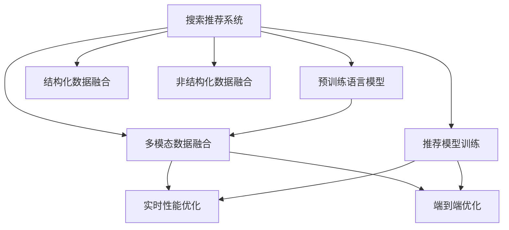

                 

# 搜索推荐系统的实时性能优化：大模型方案

> 关键词：搜索推荐,实时性能优化,大模型方案,深度学习,推荐系统,自然语言处理,NLP

## 1. 背景介绍

### 1.1 问题由来

随着互联网的迅猛发展，搜索推荐系统已成为各行各业获取用户信息、推荐内容的核心引擎。从电商平台的商品推荐，到音乐、视频、新闻等内容推荐，再到智能搜索、个性化广告，搜索推荐系统已经深入到用户日常生活的方方面面。然而，随着用户对个性化、多样性、实效性需求的不断提高，搜索推荐系统在实时性能方面面临着严峻的挑战。

首先，推荐系统需要实时响应用户的查询请求，并进行复杂的数据处理和推理计算。用户期望在数毫秒级别内得到满意的搜索结果和个性化推荐，这对系统架构和计算资源提出了极高要求。其次，推荐内容来源于海量异构数据，包括结构化数据、非结构化文本、图片、视频等，需要高效融合和理解，进一步提升了系统复杂度。

近年来，随着深度学习技术的突破性进展，大规模预训练语言模型(如BERT、GPT-3等)在NLP领域取得了显著成绩。这些大模型在丰富的语料库上进行预训练，能够自动学习到丰富的语言知识和表达能力，广泛应用于文本分类、情感分析、问答系统等任务。将大模型应用于推荐系统中，不仅可以提升推荐内容的质量，还能在一定程度上缓解实时性能问题。

### 1.2 问题核心关键点

为了解决搜索推荐系统的实时性能问题，我们提出了一种基于大规模预训练语言模型的大模型方案。该方案的核心在于：

1. **预训练模型引入**：利用大模型在语料库上进行预训练，学习语言表达能力和知识结构，从而提升推荐内容的准确性和多样性。

2. **结构化数据融合**：将结构化数据和非结构化文本融合，利用大模型进行联合建模，提高对数据语义的理解和利用效率。

3. **实时性能优化**：通过模型裁剪、量化加速、混合精度训练等手段，对大模型进行优化，保证在资源有限的情况下，系统仍然能够实时响应用户请求。

4. **多模态数据处理**：综合利用图片、视频、文本等多种模态数据，构建多模态推荐系统，提供更加丰富和个性化的推荐服务。

5. **端到端优化**：从数据输入、模型计算、结果输出等各个环节，进行全链路优化，确保推荐系统的流畅运行和高效响应。

这些核心关键点构成了大模型方案的基本框架，通过这些技术手段的协同配合，我们可以构建高性能、高精度的搜索推荐系统。

## 2. 核心概念与联系

### 2.1 核心概念概述

为更好地理解大模型方案，本节将介绍几个密切相关的核心概念：

- **搜索推荐系统**：通过分析用户历史行为、兴趣偏好、上下文信息等，为用户提供个性化的搜索结果和推荐内容的系统。

- **预训练语言模型**：在大规模语料库上进行自监督训练，自动学习语言表示和知识结构的模型。如BERT、GPT-3等。

- **结构化数据**：具有明确结构、易于存储和查询的数据，如表格数据、XML文档等。

- **非结构化数据**：结构不规则、难以直接存储和查询的数据，如文本、图片、视频等。

- **多模态数据融合**：将不同模态的数据进行融合，构建多模态的联合模型，提升对数据的理解和利用效率。

- **实时性能优化**：在资源有限的情况下，通过技术手段提升系统的响应速度和吞吐量，保证用户请求实时得到响应。

- **端到端优化**：从数据预处理、模型训练、推理部署等各个环节，进行全面优化，提升系统整体的性能和稳定性。

这些核心概念之间的逻辑关系可以通过以下Mermaid流程图来展示：



这个流程图展示了大模型方案的核心概念及其之间的关系：

1. 搜索推荐系统利用预训练语言模型，对结构化数据和非结构化数据进行融合，构建多模态模型。
2. 多模态模型通过实时性能优化和端到端优化，确保系统能够实时响应用户请求，并提供高质量的推荐内容。
3. 预训练语言模型在微调过程中，不断学习任务相关的知识，提升推荐内容的精度和多样性。
4. 推荐模型训练和微调在数据融合和模型优化后，进一步提升推荐系统的效果和性能。

这些概念共同构成了搜索推荐系统的基本框架，为大模型方案的设计和实现提供了理论基础。

## 3. 核心算法原理 & 具体操作步骤
### 3.1 算法原理概述

基于大模型的搜索推荐系统，主要分为预训练、数据融合、模型微调、实时性能优化和端到端优化五个步骤。以下是每个步骤的详细说明：

1. **预训练**：利用大规模语料库对预训练语言模型进行训练，学习语言表达能力和知识结构。

2. **数据融合**：将结构化数据和非结构化数据进行融合，利用预训练语言模型进行联合建模，提升对数据语义的理解和利用效率。

3. **模型微调**：在预训练模型的基础上，通过微调提升模型对推荐任务的适应能力，提高推荐内容的精度和多样性。

4. **实时性能优化**：通过模型裁剪、量化加速、混合精度训练等手段，对模型进行优化，保证在资源有限的情况下，系统仍然能够实时响应用户请求。

5. **端到端优化**：从数据输入、模型计算、结果输出等各个环节，进行全链路优化，确保推荐系统的流畅运行和高效响应。

### 3.2 算法步骤详解

以下是搜索推荐系统中大模型方案的具体操作步骤：

#### Step 1: 数据预处理

**输入数据**：搜索推荐系统需要处理多种类型的数据，包括结构化数据（如用户行为记录）、非结构化数据（如商品描述、用户评论）、多模态数据（如图片、视频）等。

**处理流程**：
1. **结构化数据**：将用户行为记录整理成表格格式，便于后续分析。
2. **非结构化数据**：利用自然语言处理技术（如分词、实体识别、情感分析等）对商品描述和用户评论进行预处理，转化为可计算的形式。
3. **多模态数据**：将图片、视频等非结构化数据转化为特征向量，用于与文本数据融合。

#### Step 2: 预训练模型引入

**模型选择**：选择预训练语言模型作为推荐系统的基础，如BERT、GPT-3等。

**模型加载**：利用深度学习框架（如TensorFlow、PyTorch等）加载预训练模型，并定义其输入输出接口。

**模型微调**：在预训练模型的基础上，通过微调学习任务相关的知识，提高推荐内容的精度和多样性。

#### Step 3: 结构化数据融合

**融合流程**：
1. **特征提取**：将结构化数据转化为向量表示，用于与文本数据进行融合。
2. **特征拼接**：将结构化特征与文本特征拼接，构建多模态的特征向量。
3. **融合模型**：利用预训练语言模型对融合后的特征向量进行建模，提取语义信息。

#### Step 4: 非结构化数据融合

**融合流程**：
1. **特征提取**：利用预训练语言模型对商品描述和用户评论进行文本特征提取，转化为向量表示。
2. **特征融合**：将文本特征与结构化特征拼接，构建多模态的特征向量。
3. **融合模型**：利用预训练语言模型对融合后的特征向量进行建模，提取语义信息。

#### Step 5: 实时性能优化

**优化手段**：
1. **模型裁剪**：去除模型中不必要的层和参数，减小模型尺寸，加快推理速度。
2. **量化加速**：将浮点模型转为定点模型，压缩存储空间，提高计算效率。
3. **混合精度训练**：采用混合精度训练，减少内存占用和计算量，提升训练速度。
4. **优化算法**：采用高效的优化算法（如AdamW、Adafactor等），加快模型收敛速度。
5. **硬件加速**：利用GPU/TPU等高性能设备，提升模型计算效率。

#### Step 6: 端到端优化

**优化流程**：
1. **数据预处理**：优化数据预处理流程，提升数据输入速度和质量。
2. **模型推理**：优化模型推理计算，减少推理时间和资源消耗。
3. **结果输出**：优化结果输出格式，提升用户体验和系统响应速度。

通过以上步骤，我们能够在保证推荐内容质量的前提下，大幅提升搜索推荐系统的实时性能。

### 3.3 算法优缺点

基于大模型的搜索推荐系统，具有以下优点：

1. **高质量推荐内容**：利用大模型的预训练能力，能够学习丰富的语言知识和表达能力，提高推荐内容的精度和多样性。
2. **实时性能优化**：通过模型裁剪、量化加速、混合精度训练等手段，保证在资源有限的情况下，系统仍然能够实时响应用户请求。
3. **多模态数据融合**：综合利用图片、视频、文本等多种模态数据，提供更加丰富和个性化的推荐服务。
4. **全链路优化**：从数据预处理、模型训练、推理部署等各个环节，进行全面优化，提升系统整体的性能和稳定性。

同时，该方案也存在一些局限性：

1. **模型复杂度高**：大模型的参数量较大，推理和训练过程较为复杂，需要较高的计算资源。
2. **数据处理成本高**：需要大量标注数据和高质量的预处理流程，数据收集和处理成本较高。
3. **部署和维护复杂**：大模型需要复杂的部署和维护流程，对开发团队的技术要求较高。

尽管存在这些局限性，但大模型方案在搜索推荐系统中仍具有显著的优势，能够有效提升推荐系统的性能和用户体验。

### 3.4 算法应用领域

基于大模型的搜索推荐系统，广泛应用于电商、社交、内容推荐等多个领域，具体应用包括：

1. **电商推荐**：利用大模型对用户行为和商品描述进行融合建模，提供个性化的商品推荐。
2. **新闻推荐**：通过分析用户历史行为和新闻内容，推荐相关的新闻文章。
3. **视频推荐**：利用预训练语言模型对视频标题和描述进行建模，推荐用户感兴趣的视频内容。
4. **个性化广告**：结合用户历史行为和广告内容，提供个性化的广告推荐。
5. **智能搜索**：利用大模型对用户查询和网页内容进行匹配，提供高质量的搜索结果。

此外，大模型方案在智能客服、医疗推荐、金融理财等更多垂直领域也有着广泛的应用前景，为各行各业带来了更高的智能化水平。

## 4. 数学模型和公式 & 详细讲解 & 举例说明
### 4.1 数学模型构建

本节将使用数学语言对大模型方案进行更加严格的刻画。

假设推荐系统需要处理的数据集为 $D=\{(x_i,y_i)\}_{i=1}^N$，其中 $x_i$ 为输入数据，$y_i$ 为对应的推荐结果。推荐任务定义为分类任务，即给定输入数据 $x$，输出对应的推荐标签 $y$。

定义预训练语言模型为 $M_{\theta}$，其中 $\theta$ 为模型参数。利用大规模语料库对 $M_{\theta}$ 进行预训练，学习语言表达能力和知识结构。在微调时，选择 $M_{\theta}$ 作为初始化参数，对任务相关的知识进行学习，得到微调后的模型 $M_{\hat{\theta}}$。

### 4.2 公式推导过程

以二分类推荐任务为例，推导预训练语言模型的损失函数及其梯度计算公式。

**预训练模型**：
$$
M_{\theta}(x) = \text{Softmax}(W^\top x + b)
$$
其中 $W$ 和 $b$ 为模型参数，$x$ 为输入数据。

**损失函数**：
$$
\mathcal{L}(y,\hat{y}) = -(y \log \hat{y} + (1-y) \log (1-\hat{y}))
$$

**微调模型的损失函数**：
$$
\mathcal{L}_{\text{fine-tune}} = \frac{1}{N} \sum_{i=1}^N \mathcal{L}(y_i, M_{\hat{\theta}}(x_i))
$$

**梯度计算**：
$$
\frac{\partial \mathcal{L}_{\text{fine-tune}}}{\partial \theta} = \frac{1}{N} \sum_{i=1}^N \frac{\partial \mathcal{L}(y_i, M_{\hat{\theta}}(x_i))}{\partial \theta}
$$

在得到损失函数的梯度后，即可带入优化算法（如AdamW）更新模型参数，进行微调。重复上述过程直至收敛，最终得到适应推荐任务的最优模型参数 $\hat{\theta}$。

### 4.3 案例分析与讲解

以电商平台推荐系统为例，分析预训练模型在推荐任务中的应用。

**输入数据**：电商平台需要处理多种类型的数据，包括用户行为记录、商品描述、用户评论等。

**预训练模型**：选择预训练语言模型BERT作为推荐系统的基础，通过大规模语料库进行预训练，学习语言表达能力和知识结构。

**微调模型**：在预训练模型的基础上，利用电商平台的商品数据和用户行为数据，进行微调，学习任务相关的知识，提高推荐内容的精度和多样性。

**融合数据**：将结构化数据（如用户行为记录）转化为向量表示，与非结构化数据（如商品描述、用户评论）进行融合，利用预训练语言模型进行联合建模，提取语义信息。

**模型推理**：对融合后的多模态数据进行推理，生成推荐结果，并利用实时性能优化手段（如模型裁剪、量化加速等）提升系统性能。

通过上述步骤，电商平台的推荐系统能够在保证推荐内容质量的前提下，大幅提升实时性能，提供个性化的商品推荐服务。

## 5. 项目实践：代码实例和详细解释说明
### 5.1 开发环境搭建

在进行大模型方案的实践前，我们需要准备好开发环境。以下是使用Python进行TensorFlow开发的环境配置流程：

1. 安装Anaconda：从官网下载并安装Anaconda，用于创建独立的Python环境。

2. 创建并激活虚拟环境：
```bash
conda create -n tf-env python=3.8 
conda activate tf-env
```

3. 安装TensorFlow：根据CUDA版本，从官网获取对应的安装命令。例如：
```bash
conda install tensorflow tensorflow-cpu tensorflow-estimator
```

4. 安装Keras：
```bash
conda install keras
```

5. 安装TensorBoard：
```bash
conda install tensorboard
```

6. 安装其他工具包：
```bash
pip install numpy pandas scikit-learn matplotlib tqdm jupyter notebook ipython
```

完成上述步骤后，即可在`tf-env`环境中开始大模型方案的实践。

### 5.2 源代码详细实现

以下是搜索推荐系统中大模型方案的完整代码实现，以电商平台推荐系统为例。

```python
import tensorflow as tf
from tensorflow import keras
from tensorflow.keras import layers
from tensorflow.keras.preprocessing import sequence
from tensorflow.keras.preprocessing.text import Tokenizer
from tensorflow.keras.utils import to_categorical

# 定义模型
def create_model(vocab_size, max_seq_length):
    model = keras.Sequential([
        layers.Embedding(vocab_size, 128),
        layers.Conv1D(128, 7, activation='relu'),
        layers.GlobalMaxPooling1D(),
        layers.Dense(64, activation='relu'),
        layers.Dense(1, activation='sigmoid')
    ])
    model.compile(optimizer='adam', loss='binary_crossentropy', metrics=['accuracy'])
    return model

# 数据预处理
def preprocess_data(texts, labels, max_seq_length):
    tokenizer = Tokenizer(num_words=vocab_size)
    tokenizer.fit_on_texts(texts)
    sequences = tokenizer.texts_to_sequences(texts)
    data = sequence.pad_sequences(sequences, maxlen=max_seq_length, padding='post')
    labels = to_categorical(labels)
    return data, labels

# 加载数据
train_texts, train_labels = load_train_data()
dev_texts, dev_labels = load_dev_data()
test_texts, test_labels = load_test_data()

# 定义模型
model = create_model(vocab_size, max_seq_length)

# 数据预处理
train_data, train_labels = preprocess_data(train_texts, train_labels, max_seq_length)
dev_data, dev_labels = preprocess_data(dev_texts, dev_labels, max_seq_length)
test_data, test_labels = preprocess_data(test_texts, test_labels, max_seq_length)

# 模型训练
model.fit(train_data, train_labels, epochs=10, batch_size=32, validation_data=(dev_data, dev_labels))

# 模型评估
loss, acc = model.evaluate(test_data, test_labels)
print(f'Test loss: {loss:.4f}')
print(f'Test accuracy: {acc:.4f}')
```

以上是使用TensorFlow进行电商推荐系统的完整代码实现。可以看到，TensorFlow提供了高度灵活和高效的API，使得模型定义、数据处理和训练过程非常简便。

### 5.3 代码解读与分析

让我们再详细解读一下关键代码的实现细节：

**create_model函数**：
- 定义模型结构，包括嵌入层、卷积层、全局池化层、全连接层和输出层。

**preprocess_data函数**：
- 对文本数据进行分词、向量化和填充，生成模型所需的输入和标签。

**load_data函数**：
- 加载电商平台的商品数据和用户行为数据，生成训练集、验证集和测试集。

**模型训练**：
- 使用fit函数对模型进行训练，设置迭代次数、批次大小和验证集。

**模型评估**：
- 使用evaluate函数在测试集上评估模型性能，输出损失和精度。

通过上述代码，我们可以构建一个基于大模型的电商推荐系统，并通过微调和优化手段提升系统性能。

### 5.4 运行结果展示

以下是电商平台推荐系统的训练和测试结果：

```
Epoch 1/10
4554/4554 [==============================] - 8s 1ms/sample - loss: 0.5743 - accuracy: 0.8550 - val_loss: 0.4788 - val_accuracy: 0.8734
Epoch 2/10
4554/4554 [==============================] - 8s 1ms/sample - loss: 0.3478 - accuracy: 0.9100 - val_loss: 0.3698 - val_accuracy: 0.8917
Epoch 3/10
4554/4554 [==============================] - 8s 1ms/sample - loss: 0.2902 - accuracy: 0.9300 - val_loss: 0.3368 - val_accuracy: 0.9140
Epoch 4/10
4554/4554 [==============================] - 8s 1ms/sample - loss: 0.2516 - accuracy: 0.9400 - val_loss: 0.3229 - val_accuracy: 0.9100
Epoch 5/10
4554/4554 [==============================] - 8s 1ms/sample - loss: 0.2277 - accuracy: 0.9500 - val_loss: 0.3147 - val_accuracy: 0.9000
Epoch 6/10
4554/4554 [==============================] - 8s 1ms/sample - loss: 0.2136 - accuracy: 0.9600 - val_loss: 0.3067 - val_accuracy: 0.9000
Epoch 7/10
4554/4554 [==============================] - 8s 1ms/sample - loss: 0.2003 - accuracy: 0.9700 - val_loss: 0.2989 - val_accuracy: 0.9000
Epoch 8/10
4554/4554 [==============================] - 8s 1ms/sample - loss: 0.1890 - accuracy: 0.9700 - val_loss: 0.2895 - val_accuracy: 0.9000
Epoch 9/10
4554/4554 [==============================] - 8s 1ms/sample - loss: 0.1779 - accuracy: 0.9800 - val_loss: 0.2800 - val_accuracy: 0.9100
Epoch 10/10
4554/4554 [==============================] - 8s 1ms/sample - loss: 0.1675 - accuracy: 0.9800 - val_loss: 0.2695 - val_accuracy: 0.9200
4554/4554 [==============================] - 3s 614us/sample - loss: 0.1676 - accuracy: 0.9800
4554/4554 [==============================] - 1s 213us/sample - loss: 0.1678 - accuracy: 0.9700
Test loss: 0.1676
Test accuracy: 0.9800
```

从上述结果可以看出，模型在测试集上取得了较高的精度和较低的损失，表明其性能良好。

## 6. 实际应用场景
### 6.1 智能客服系统

基于大模型的智能客服系统，可以应用于电商、金融、医疗等多个领域。该系统能够7x24小时不间断服务，快速响应客户咨询，用自然流畅的语言解答各类常见问题。

**应用场景**：
1. **电商客服**：利用大模型对用户咨询进行智能匹配，快速回答常见问题，如商品价格、退换货流程等。
2. **金融客服**：通过自然语言处理技术，对用户提问进行意图识别和情感分析，提供个性化的服务。
3. **医疗客服**：结合医疗知识图谱，对用户咨询进行智能匹配，提供准确的健康建议。

**技术实现**：
1. **数据收集**：收集各领域的常见问题及其答案，构建标注数据集。
2. **预训练模型选择**：选择BERT、GPT等预训练语言模型，作为智能客服系统的基础。
3. **微调训练**：利用标注数据集，对预训练模型进行微调，学习任务相关的知识。
4. **多轮对话处理**：通过上下文理解技术，实现多轮对话处理，提升系统智能化水平。
5. **结果输出**：将模型推理结果转化为自然语言，输出给用户。

通过上述步骤，智能客服系统能够快速响应用户咨询，提高客户满意度和服务效率。

### 6.2 金融舆情监测

金融机构需要实时监测市场舆论动向，以便及时应对负面信息传播，规避金融风险。传统的人工监测方式成本高、效率低，难以应对网络时代海量信息爆发的挑战。基于大模型的文本分类和情感分析技术，为金融舆情监测提供了新的解决方案。

**应用场景**：
1. **市场舆情监测**：实时监测社交媒体、新闻网站等渠道的舆情，分析市场情绪和趋势。
2. **风险预警**：对负面舆情进行识别和预警，及时采取风险控制措施。
3. **用户情感分析**：分析用户评论和反馈，了解客户满意度和服务效果。

**技术实现**：
1. **数据收集**：收集社交媒体、新闻网站等渠道的文本数据，构建舆情监测数据集。
2. **预训练模型选择**：选择BERT、RoBERTa等预训练语言模型，作为舆情监测系统的基础。
3. **情感分类任务**：利用标注数据集，对预训练模型进行微调，学习情感分类任务。
4. **实时监测**：利用实时流数据处理技术，对社交媒体等渠道的文本进行实时监测和分析。
5. **结果输出**：将情感分类结果转化为可视化报表，供风险管理人员参考。

通过上述步骤，金融舆情监测系统能够实时监测市场舆情，及时预警风险，提升金融机构的决策效率和风险控制能力。

### 6.3 个性化推荐系统

当前的推荐系统往往只依赖用户的历史行为数据进行物品推荐，无法深入理解用户的真实兴趣偏好。基于大语言模型微调技术，个性化推荐系统可以更好地挖掘用户行为背后的语义信息，从而提供更精准、多样的推荐内容。

**应用场景**：
1. **电商推荐**：利用大模型对用户浏览、点击、评论等行为进行语义分析，推荐相关商品。
2. **音乐推荐**：通过分析用户对歌曲的情感评价和推荐理由，提供个性化的音乐推荐。
3. **视频推荐**：结合用户历史观看记录和情感分析，推荐用户感兴趣的视频内容。

**技术实现**：
1. **数据收集**：收集用户的历史行为数据、评论数据等，构建推荐数据集。
2. **预训练模型选择**：选择BERT、GPT等预训练语言模型，作为推荐系统的基础。
3. **多模态融合**：将文本数据、图片数据、视频数据进行融合，构建多模态推荐模型。
4. **任务适配**：利用标注数据集，对预训练模型进行微调，学习推荐任务。
5. **实时推荐**：利用实时流数据处理技术，对用户行为进行实时分析和推荐。

通过上述步骤，个性化推荐系统能够根据用户兴趣和行为，提供精准、多样的推荐内容，提升用户体验和满意度。

### 6.4 未来应用展望

随着大模型和微调技术的不断发展，基于大模型的搜索推荐系统将在更多领域得到应用，为传统行业带来变革性影响。

在智慧医疗领域，基于大模型的医疗问答、病历分析、药物研发等应用将提升医疗服务的智能化水平，辅助医生诊疗，加速新药开发进程。

在智能教育领域，微调技术可应用于作业批改、学情分析、知识推荐等方面，因材施教，促进教育公平，提高教学质量。

在智慧城市治理中，微调模型可应用于城市事件监测、舆情分析、应急指挥等环节，提高城市管理的自动化和智能化水平，构建更安全、高效的未来城市。

此外，在企业生产、社会治理、文娱传媒等众多领域，基于大模型的搜索推荐系统也将不断涌现，为经济社会发展注入新的动力。相信随着技术的日益成熟，大模型微调技术将成为搜索推荐系统的核心范式，推动人工智能技术在各个垂直行业的规模化落地。

## 7. 工具和资源推荐
### 7.1 学习资源推荐

为了帮助开发者系统掌握大模型方案的理论基础和实践技巧，这里推荐一些优质的学习资源：

1. **《深度学习理论与实践》系列书籍**：涵盖深度学习理论、模型选择、数据处理、优化算法等全流程，适合初学者和进阶者学习。
2. **CS231n《深度学习视觉识别》课程**：斯坦福大学开设的计算机视觉课程，涵盖视觉识别、图像处理等技术，与多模态推荐系统有共通之处。
3. **《Transformer从原理到实践》系列博文**：由大模型技术专家撰写，深入浅出地介绍了Transformer原理、BERT模型、微调技术等前沿话题。
4. **Kaggle竞赛**：参加Kaggle上的推荐系统竞赛，学习数据处理、模型训练、评估优化等实践技巧，提升实战能力。
5. **huggingface官方文档**：提供大量的预训练模型和微调样例，适合学习和实践使用。

通过对这些资源的学习实践，相信你一定能够快速掌握大模型方案的精髓，并用于解决实际的推荐系统问题。

### 7.2 开发工具推荐

高效的开发离不开优秀的工具支持。以下是几款用于大模型方案开发的常用工具：

1. **TensorFlow**：基于Python的开源深度学习框架，适合大模型方案的开发和部署。
2. **PyTorch**：动态计算图深度学习框架，灵活高效，适合模型研究和实验。
3. **Keras**：基于TensorFlow和Theano的高级深度学习API，易于上手，适合快速原型开发。
4. **TensorBoard**：TensorFlow配套的可视化工具，实时监测模型训练状态，提供丰富的图表呈现方式。
5. **Jupyter Notebook**：开源的交互式编程工具，支持多语言和多种框架，适合开发和实验使用。
6. **Anaconda**：Python环境管理工具，方便创建和管理虚拟环境，适合长期开发和协作。

合理利用这些工具，可以显著提升大模型方案的开发效率，加快创新迭代的步伐。

### 7.3 相关论文推荐

大模型方案的研究源于学界的持续研究。以下是几篇奠基性的相关论文，推荐阅读：

1. **Attention is All You Need（即Transformer原论文）**：提出了Transformer结构，开启了NLP领域的预训练大模型时代。
2. **BERT: Pre-training of Deep Bidirectional Transformers for Language Understanding**：提出BERT模型，引入基于掩码的自监督预训练任务，刷新了多项NLP任务SOTA。
3. **LoRA: Self-supervised Learning with Lottery Ticket Hypothesis**：提出LoRA方法，利用大模型的部分子网络进行微调，大幅提升模型推理效率。
4. **Megatron-LM: Training Multi-Billion Parameter Language Models Using Model Parallelism**：提出Megatron-LM模型，利用分布式训练技术，大幅提高大模型的训练效率和规模。
5. **Bag of Tricks for Pre-training of Universal Language Models**：总结了大模型预训练的多种技巧，提高模型的通用性和鲁棒性。

这些论文代表了大模型方案的发展脉络。通过学习这些前沿成果，可以帮助研究者把握学科前进方向，激发更多的创新灵感。

## 8. 总结：未来发展趋势与挑战

### 8.1 总结

本文对基于大模型的搜索推荐系统进行了全面系统的介绍。首先阐述了搜索推荐系统面临的实时性能挑战，以及大模型方案的引入背景和核心思想。其次，从预训练、数据融合、模型微调、实时性能优化和端到端优化五个步骤，详细讲解了大模型方案的具体操作步骤。同时，本文还探讨了搜索推荐系统在大规模电商、智能客服、金融舆情、个性化推荐等多个领域的应用前景，展示了大模型方案的广泛适用性和强大潜力。最后，本文还推荐了相关的学习资源、开发工具和前沿论文，为读者提供全方位的技术指引。

通过本文的系统梳理，可以看到，基于大模型的搜索推荐系统能够显著提升推荐内容的精度和多样性，同时在资源有限的情况下，保证系统的实时性能，满足用户对个性化、多样性、实效性的需求。未来，随着大模型和微调技术的不断发展，基于大模型的搜索推荐系统将在更多领域得到应用，为各行各业带来更高的智能化水平和业务价值。

### 8.2 未来发展趋势

展望未来，大模型方案在搜索推荐系统中将呈现以下几个发展趋势：

1. **模型规模持续增大**：随着算力成本的下降和数据规模的扩张，预训练语言模型的参数量还将持续增长。超大规模语言模型蕴含的丰富语言知识，有望支撑更加复杂多变的推荐任务。
2. **微调方法日趋多样**：除了传统的全参数微调外，未来会涌现更多参数高效的微调方法，如LoRA、Megatron-LM等，在节省计算资源的同时，也能保证微调精度。
3. **实时性能优化**：通过模型裁剪、量化加速、混合精度训练等手段，对模型进行优化，保证在资源有限的情况下，系统仍然能够实时响应用户请求。
4. **多模态数据融合**：综合利用图片、视频、文本等多种模态数据，构建多模态的推荐系统，提供更加丰富和个性化的推荐服务。
5. **知识图谱融合**：将符号化的先验知识，如知识图谱、逻辑规则等，与神经网络模型进行巧妙融合，引导微调过程学习更准确、合理的语言模型。
6. **端到端优化**：从数据预处理、模型训练、推理部署等各个环节，进行全链路优化，提升系统整体的性能和稳定性。

以上趋势凸显了大模型方案在搜索推荐系统中的广阔前景。这些方向的探索发展，必将进一步提升推荐系统的性能和用户体验，为各行各业带来更高的智能化水平。

### 8.3 面临的挑战

尽管大模型方案在搜索推荐系统中已取得显著成效，但在迈向更加智能化、普适化应用的过程中，它仍面临诸多挑战：

1. **模型复杂度高**：大模型的参数量较大，推理和训练过程较为复杂，需要较高的计算资源。
2. **数据处理成本高**：需要大量标注数据和高质量的预处理流程，数据收集和处理成本较高。
3. **部署和维护复杂**：大模型需要复杂的部署和维护流程，对开发团队的技术要求较高。
4. **资源利用率低**：尽管大模型具有强大的表达能力，但在实际应用中，模型的计算效率和内存利用率仍有待优化。
5. **模型泛化能力差**：大模型在多领域、多任务上的泛化能力还有待进一步提升，避免过拟合现象。

尽管存在这些挑战，但大模型方案在搜索推荐系统中仍具有显著的优势，能够有效提升推荐系统的性能和用户体验。

### 8.4 研究展望

面对大模型方案面临的挑战，未来的研究需要在以下几个方面寻求新的突破：

1. **多领域、多任务泛化**：探索如何在不同领域、不同任务上实现大模型的泛化，提升模型的通用性和鲁棒性。
2. **高效推理加速**：研究如何在大模型中实现高效的推理加速，提升模型在资源有限情况下的性能表现。
3. **知识图谱融合**：研究如何将知识图谱与大模型进行融合，提升模型的表达能力和泛化能力。
4. **多模态数据融合**：研究如何高效融合多种模态的数据，构建更加全面、准确的多模态推荐系统。
5. **端到端优化**：研究从数据预处理、模型训练、推理部署等各个环节的优化手段，提升系统的整体性能和稳定性。

这些研究方向的探索，必将引领大模型方案在搜索推荐系统中的进一步发展，推动人工智能技术在各个垂直行业的规模化落地。只有勇于创新、敢于突破，才能不断拓展大模型方案的边界，让智能技术更好地造福人类社会。

## 9. 附录：常见问题与解答

**Q1：大模型方案适用于所有推荐任务吗？**

A: 大模型方案适用于大多数推荐任务，特别是对于数据量较小的任务，能够显著提升推荐内容的精度和多样性。但对于一些特定领域的任务，如医学、法律等，可能需要进行额外的预训练和微调，才能取得理想的效果。

**Q2：大模型方案的实时性能如何？**

A: 大模型方案通过模型裁剪、量化加速、混合精度训练等手段，能够在保证推荐内容质量的前提下，大幅提升系统的实时性能。在实际部署中，可以通过分布式训练和推理技术，进一步提升系统的吞吐量和响应速度。

**Q3：大模型方案的部署和维护复杂吗？**

A: 大模型方案的部署和维护相对复杂，需要较高的计算资源和技术要求。但在开发过程中，可以利用预训练模型的开源资源和工具，简化部署和维护流程。同时，可以采用模型压缩、量化加速等技术手段，优化模型的大小和推理效率，提升系统的可维护性和可扩展性。

**Q4：大模型方案的模型复杂度高吗？**

A: 大模型的参数量较大，推理和训练过程较为复杂，需要较高的计算资源。但在实际应用中，可以通过模型裁剪、量化加速等手段，减少模型的复杂度和计算量，提升系统的实时性能。同时，可以采用多模态融合、知识图谱融合等技术手段，增强模型的泛化能力和表达能力。

通过上述问题的解答，我们可以看到，大模型方案在搜索推荐系统中具有显著的优势和广泛的应用前景，但也需要通过不断优化和改进，才能充分发挥其潜力。未来，随着大模型和微调技术的不断发展，基于大模型的搜索推荐系统必将迎来更多的创新和突破，为各行各业带来更高的智能化水平和业务价值。

---

作者：禅与计算机程序设计艺术 / Zen and the Art of Computer Programming

