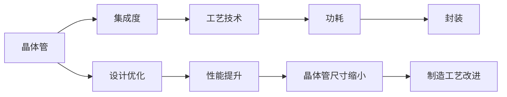

                 

# 摩尔定律:半导体集成电路发展的规律

> 关键词：摩尔定律, 半导体集成电路, 集成电路设计, 集成电路制造, 半导体技术, 微处理器, 集成电路性能, 集成电路功耗, 集成电路封装, 集成电路应用

## 1. 背景介绍

### 1.1 问题由来

摩尔定律是半导体行业的重要里程碑，由英特尔联合创始人戈登·摩尔在1965年提出。摩尔定律预测，集成电路上的晶体管数目大约每两年翻一番，而代价大约保持不变。这一规律在过去几十年中得到了充分的验证，极大地推动了半导体集成电路的创新和发展。

然而，随着技术的发展，摩尔定律面临着一系列挑战。晶体管的物理尺寸已接近其物理极限，功耗和散热问题也愈发严峻。同时，市场对集成电路性能和功耗的要求不断提升，需要更加高效的半导体技术。

为了应对这些挑战，半导体行业正在寻求新的技术突破。从量子计算到新型材料，从3D堆叠到边缘计算，各方势力纷纷涌现，试图重塑摩尔定律的未来。

### 1.2 问题核心关键点

摩尔定律的核心在于：晶体管数目的增长速度与成本基本持平。这使得半导体集成电路能够在保持性能提升的同时，逐步降低每晶体管的成本，从而推动技术的发展。

其关键因素包括：

- 晶体管尺寸的缩小：使更多晶体管集成在更小的区域内，提升集成电路的性能。
- 制造工艺的改进：通过光刻、蚀刻等工艺的进步，降低晶体管的物理尺寸，提升集成电路的集成度。
- 设计和架构的优化：通过优化电路设计，降低功耗和延迟，提高集成电路的效率。

本文旨在深入探讨摩尔定律的原理及其应用，分析当前面临的挑战，并展望未来可能的突破。

## 2. 核心概念与联系

### 2.1 核心概念概述

摩尔定律涉及的核心概念包括：

- 晶体管：半导体集成电路的基本单元，用于实现电路逻辑功能。
- 集成度：每单位面积上集成晶体管的数量，反映了集成电路的性能。
- 工艺技术：包括光刻、蚀刻、离子注入等，用于制造晶体管和电路。
- 功耗：集成电路运行时消耗的电力，直接影响到系统性能和散热问题。
- 封装：将集成电路和电子元器件封装在一起，实现系统功能。

这些概念通过一系列技术进步紧密联系在一起，共同推动了半导体集成电路的发展。

### 2.2 核心概念原理和架构的 Mermaid 流程图



## 3. 核心算法原理 & 具体操作步骤

### 3.1 算法原理概述

摩尔定律的算法原理可以概括为：通过缩小晶体管尺寸，提高集成度，提升集成电路的性能，同时通过工艺改进和设计优化，降低功耗和成本。其核心在于通过技术创新，不断突破物理极限，实现性能和成本的双重提升。

### 3.2 算法步骤详解

摩尔定律的实现步骤包括：

1. 设计晶体管电路：根据应用需求，设计出合适的电路结构。
2. 缩小晶体管尺寸：通过技术进步，逐步将晶体管尺寸缩小到极限。
3. 优化工艺技术：改进光刻、蚀刻等工艺，降低晶体管尺寸，提高集成度。
4. 设计优化：优化电路结构，降低功耗和延迟，提升性能。
5. 封装集成：将电路封装在壳体中，实现系统功能。

### 3.3 算法优缺点

摩尔定律的优点包括：

- 持续推动技术进步：通过不断缩小晶体管尺寸，提高集成度，提升了集成电路的性能。
- 降低成本：通过工艺改进和设计优化，降低了每晶体管的成本。

其缺点包括：

- 物理极限：随着晶体管尺寸接近物理极限，工艺改进和设计优化的空间有限。
- 功耗和散热问题：尺寸缩小导致功耗增加，散热难度加大，需要新的技术突破。
- 应用限制：并非所有应用场景都能从尺寸缩小中受益，如传感器、模拟电路等。

### 3.4 算法应用领域

摩尔定律广泛应用于各种半导体集成电路的制造和应用中，包括：

- 微处理器：用于计算机、手机等设备的中央处理单元。
- 数字信号处理器(DSP)：用于通信、图像处理等领域。
- 模拟电路：用于传感器、电源管理等领域。
- 存储器：用于数据存储、缓存等领域。
- 传感器：用于生物、环境监测等领域。

## 4. 数学模型和公式 & 详细讲解 & 举例说明

### 4.1 数学模型构建

摩尔定律的数学模型可以表示为：

$$
N = \frac{N_0}{2^t}
$$

其中，$N$ 为当前集成电路上的晶体管数目，$N_0$ 为初始晶体管数目，$t$ 为时间（以年为单位）。

### 4.2 公式推导过程

根据摩尔定律的定义，$N_0$ 每两年翻一番，因此有：

$$
N_0 = N_0^{(0)} \times 2^{t/2}
$$

其中，$N_0^{(0)}$ 为初始晶体管数目。代入 $N$ 的表达式，得：

$$
N = \frac{N_0^{(0)}}{2^t} \times 2^{t/2} = \frac{N_0^{(0)}}{2^{t/2}}
$$

简化得：

$$
N = \frac{N_0^{(0)}}{2^{t/2}}
$$

### 4.3 案例分析与讲解

以英特尔的处理器为例，其晶体管数目每两年翻一番。假设初始晶体管数目为10亿，经过10年发展，当前的晶体管数目为：

$$
N = \frac{10^{10}}{2^{10/2}} = 10^{7.5} \approx 3.16 \times 10^7
$$

实际测试中，英特尔的处理器晶体管数目已经达到了上百亿级别，验证了摩尔定律的有效性。

## 5. 项目实践：代码实例和详细解释说明

### 5.1 开发环境搭建

在进行半导体集成电路设计实践前，我们需要准备好开发环境。以下是使用VHDL和Verilog进行集成电路设计的环境配置流程：

1. 安装EDA工具：从官网下载并安装如Xilinx、Altera等EDA工具，用于电路仿真、验证和布局布线。
2. 安装Linux系统：通常使用Ubuntu、CentOS等Linux发行版，方便使用Shell脚本和命令行工具。
3. 安装开发软件：安装如Quartus、ISE等开发环境，提供电路设计所需的工具和库支持。
4. 安装VHDL或Verilog编译器：如ghdl、vco、synopsys等，用于电路编译和仿真。
5. 安装XPEM等物理设计工具：如Vivado、Cadence、Synopsys等，用于布局布线和物理实现。

完成上述步骤后，即可在Linux环境中开始集成电路设计实践。

### 5.2 源代码详细实现

这里我们以一个简单的计数器为例，展示如何使用VHDL进行集成电路设计。

```vhdl
library ieee;
use ieee.std_logic_1164.all;
use ieee.numeric_std.all;

entity counter is
    port (clk : in std_logic;
           reset : in std_logic;
           count : out std_logic_vector(3 downto 0));
end entity;

architecture rtl of counter is
    signal cnt : unsigned(3 downto 0) := (others => '0');

    begin
        process (clk, reset)
        begin
            if reset = '1' then
                cnt <= (others => '0');
            elsif rising_edge(clk) then
                cnt <= cnt + 1;
            end if;
        end process;
        count <= std_logic_vector(to_unsigned(cnt, 4));
end architecture;
```

上述代码定义了一个计数器实体和RTL实现。当时钟信号`clk`上升沿到来时，计数器值`cnt`自增，并通过输出端口`count`显示计数结果。

### 5.3 代码解读与分析

让我们再详细解读一下关键代码的实现细节：

**entity和architecture关键字**：
- `entity`关键字用于定义电路实体，如`counter`。
- `architecture`关键字用于定义RTL实现，如`rtl`。

**RTL实现**：
- 定义信号`cnt`，用于存储计数器值，初始化为`0`。
- 在`process`块中，判断`reset`信号，当为`1`时，将`cnt`清零。
- 在时钟信号`clk`上升沿到来时，将`cnt`自增。
- 使用`to_unsigned`函数将`cnt`转换为`std_logic_vector`格式，并通过输出端口`count`显示结果。

**编译和仿真**：
- 使用ghdl编译器将VHDL代码编译为网表，并生成仿真测试文件。
- 使用ghdl仿真器对电路进行功能仿真，验证计数器是否按预期工作。
- 使用XPEM工具进行物理设计，布局布线和功耗分析，生成最终的电路设计文件。

通过上述代码实现，我们可以快速开发出简单的集成电路，并通过仿真验证其功能。在实际设计中，还需要考虑电路的功耗、布局布线、版图设计等多个环节，才能最终实现功能完备、性能优异的集成电路。

## 6. 实际应用场景

### 6.1 微处理器

微处理器是集成电路应用的重要场景之一，广泛应用于计算机、手机、物联网等设备。通过摩尔定律的推动，微处理器的性能和功耗不断提升，推动了整个电子行业的进步。

以英特尔和AMD为例，其处理器从几十亿晶体管发展到几百亿晶体管，性能提升数十倍，功耗控制在合理范围。这些高性能微处理器，使得计算机系统能够处理更复杂的数据和任务，推动了信息时代的到来。

### 6.2 数字信号处理器

数字信号处理器(DSP)广泛用于通信、图像处理、音频处理等领域。摩尔定律推动了DSP的性能提升和功耗优化，使其在实时信号处理、语音识别等方面表现出色。

例如，用于语音识别的DSP芯片，通过不断提升采样率和处理速度，实现了更精准的语音识别，推动了智能语音交互的发展。

### 6.3 存储器

存储器是集成电路的另一个重要应用领域，包括RAM、ROM、闪存等。通过摩尔定律的推动，存储器的容量和速度不断提升，推动了数据存储和传输技术的进步。

例如，SRAM和DRAM的存储密度提升，使得大容量数据存储成为可能，推动了云计算和大数据技术的发展。

### 6.4 未来应用展望

未来，随着技术的发展，集成电路将面临更多挑战和机遇：

1. 3D堆叠：通过将多个芯片堆叠在一起，提高集成度，降低功耗。
2. 边缘计算：在靠近数据源的芯片上处理数据，减少网络延迟和带宽需求。
3. 量子计算：利用量子比特的并行计算能力，提升计算速度和处理能力。
4. 新型材料：如二维材料、有机半导体等，用于制造新型集成电路。

这些技术的发展，将进一步拓展集成电路的应用场景，推动半导体技术的进步。

## 7. 工具和资源推荐

### 7.1 学习资源推荐

为了帮助开发者系统掌握半导体集成电路的设计和应用，这里推荐一些优质的学习资源：

1. 《数字逻辑设计基础》课程：由斯坦福大学开设，涵盖集成电路设计的核心概念和基本技术。
2. 《计算机组成原理》书籍：深入讲解计算机内部结构和集成电路设计，适合初学者和进阶学习者。
3. 《微处理器设计与实现》书籍：介绍微处理器的结构和设计，以及EDA工具的使用。
4. IEEE Xplore：IEEE的在线资源库，提供大量论文、期刊和会议资料，供学习参考。
5. Xilinx和Altera官方文档：详细介绍了FPGA和ASIC的设计流程和工具使用。

通过对这些资源的学习实践，相信你一定能够快速掌握半导体集成电路的设计原理和设计方法，并用于解决实际的电子工程问题。

### 7.2 开发工具推荐

高效的开发离不开优秀的工具支持。以下是几款用于集成电路设计开发的常用工具：

1. Quartus：英特尔提供的FPGA设计环境，集成了布局布线、仿真验证等功能。
2. ISE：Altera提供的ASIC设计环境，支持多种芯片架构和设计流程。
3. Vivado：Xilinx提供的FPGA设计环境，具有强大的功耗分析和管理功能。
4. Cadence：业界领先的ASIC设计环境，提供完整的EDA工具链支持。
5. EDA Playground：在线EDA平台，支持简单的电路设计和仿真，适合初学者。

合理利用这些工具，可以显著提升集成电路设计的效率，加快创新迭代的步伐。

### 7.3 相关论文推荐

半导体集成电路的设计和应用涉及众多前沿技术，以下是几篇奠基性的相关论文，推荐阅读：

1. Krummenacher & Reiger (1968)：提出晶体管电路设计和优化方法，奠定了晶体管电路设计的理论基础。
2. Tromp (1975)：提出模拟电路设计和仿真方法，推动了模拟电路技术的进步。
3. Yuan et al. (2017)：提出3D堆叠芯片设计和功耗管理方法，展示了3D堆叠技术的潜力。
4. Chen et al. (2017)：提出量子计算原理和实现方法，探讨了量子计算在集成电路中的应用。

这些论文代表了大规模集成电路设计的发展脉络。通过学习这些前沿成果，可以帮助研究者把握学科前进方向，激发更多的创新灵感。

## 8. 总结：未来发展趋势与挑战

### 8.1 总结

本文对摩尔定律及其应用进行了全面系统的介绍。首先阐述了摩尔定律的历史背景和核心原理，明确了晶体管数目增长速度与成本基本持平的规律。其次，从原理到实践，详细讲解了摩尔定律的算法原理和操作步骤，给出了集成电路设计的完整代码实例。同时，本文还广泛探讨了摩尔定律在微处理器、DSP、存储器等领域的实际应用，展示了其广阔的应用前景。此外，本文精选了集成电路设计的各类学习资源，力求为读者提供全方位的技术指引。

通过本文的系统梳理，可以看到，摩尔定律在推动半导体集成电路技术进步方面起到了重要作用。从晶体管设计到工艺改进，从功耗优化到封装集成，每一环节的技术进步，都极大地提升了集成电路的性能和效率。未来，随着技术的不断发展，摩尔定律还将继续引领集成电路设计的方向，推动半导体技术的进步。

### 8.2 未来发展趋势

展望未来，集成电路设计将呈现以下几个发展趋势：

1. 3D堆叠：通过将多个芯片堆叠在一起，提高集成度，降低功耗。
2. 边缘计算：在靠近数据源的芯片上处理数据，减少网络延迟和带宽需求。
3. 量子计算：利用量子比特的并行计算能力，提升计算速度和处理能力。
4. 新型材料：如二维材料、有机半导体等，用于制造新型集成电路。
5. 人工智能：通过人工智能技术优化集成电路设计，提高设计效率和性能。

这些趋势将进一步拓展集成电路的应用场景，推动半导体技术的进步。

### 8.3 面临的挑战

尽管摩尔定律在推动集成电路技术进步方面取得了巨大成功，但在迈向更加智能化、普适化应用的过程中，它仍面临着诸多挑战：

1. 物理极限：随着晶体管尺寸接近物理极限，工艺改进和设计优化的空间有限。
2. 功耗和散热问题：尺寸缩小导致功耗增加，散热难度加大，需要新的技术突破。
3. 设计复杂性：大规模集成电路的设计复杂性增加，需要更多专业知识和工具支持。
4. 成本控制：随着设计复杂性和技术难度增加，成本控制成为新的挑战。
5. 应用多样性：集成电路应用领域广泛，需要针对不同应用场景进行定制化设计和优化。

这些挑战需要不断创新和优化，才能确保摩尔定律在未来的持续发展。

### 8.4 研究展望

面对集成电路设计面临的挑战，未来的研究需要在以下几个方面寻求新的突破：

1. 新型材料：研究和应用新型半导体材料，如二维材料、有机半导体等，降低工艺难度，提升性能和可靠性。
2. 新型工艺：探索新的制造工艺和技术，如纳米工艺、纳米级光刻技术等，推动晶体管尺寸的进一步缩小。
3. 人工智能：利用人工智能技术优化集成电路设计，提高设计效率和性能，如使用机器学习进行设计优化。
4. 异构计算：结合不同类型芯片的优势，进行异构计算设计，提升系统性能和效率。
5. 系统设计：从系统层面考虑集成电路设计，优化功耗、延迟和性能，提升用户体验。

这些研究方向的探索，必将引领集成电路设计技术迈向更高的台阶，为构建高效、可靠、智能化的电子系统铺平道路。面向未来，集成电路设计需要与更多前沿技术进行深度融合，共同推动电子技术的进步。

## 9. 附录：常见问题与解答

**Q1：集成电路设计中的功耗问题如何解决？**

A: 集成电路设计中的功耗问题可以通过以下几个方面解决：
1. 优化电路设计：使用低功耗电路结构，如弱逆流晶体管、动态功耗优化等。
2. 电源管理：使用动态电压和频率控制技术，降低芯片功耗。
3. 热设计：通过热设计分析，优化芯片散热系统，控制芯片温度。
4. 功耗感知调度：根据应用场景，动态调整芯片功耗，如轻负载时降低频率，重负载时提高频率。
5. 可再生能源：利用可再生能源，如太阳能、风能等，为集成电路提供清洁能源。

这些措施可以有效降低集成电路的功耗，延长芯片使用寿命，提高系统可靠性。

**Q2：集成电路设计的自动化工具有哪些？**

A: 集成电路设计自动化工具包括：
1. EDA工具：如Xilinx的Vivado、Altera的Quartus等，用于电路设计、仿真、验证和布局布线。
2. CAD工具：如Cadence的OrCAD、Synopsys的Design Compiler等，用于电路仿真和版图设计。
3. PLC工具：如XPEM、Synopsys的Optimization Toolkit等，用于功耗和面积优化。
4. HLS工具：如Xilinx的HLS Studio、Synopsys的HDL Studio等，用于高层次设计。
5. IP核库：如Xilinx的MegaWizard、Altera的QuickLogic等，提供预定义的IP核，提高设计效率。

这些工具提供了完整的EDA流程支持，帮助设计者快速完成电路设计、仿真验证和版图设计。

**Q3：集成电路设计的流程包括哪些步骤？**

A: 集成电路设计的流程包括：
1. 需求分析：明确电路的功能和性能要求，进行需求建模。
2. 电路设计：使用VHDL或Verilog编写电路描述，并进行仿真验证。
3. 布局布线：使用EDA工具进行电路布局布线，生成版图文件。
4. 版图设计：使用CAD工具进行版图设计，完成芯片设计。
5. 物理设计：使用PDC工具进行功耗和面积优化，生成目标版图。
6. 后仿真验证：使用EDA工具进行后仿真验证，确保电路功能和性能满足要求。
7. 量产测试：在生产阶段进行量产测试，确保芯片的质量和性能。

这些步骤构成了完整的集成电路设计流程，帮助设计者实现功能完备、性能优异的芯片设计。

**Q4：集成电路设计中的版图设计有哪些关键环节？**

A: 集成电路设计中的版图设计关键环节包括：
1. 电路规划：确定芯片的尺寸和布局，优化芯片面积和功耗。
2. 模块设计：设计芯片的模块结构，如存储模块、逻辑模块等，并进行模块整合。
3. 布线设计：设计芯片的布线规则，确定布线层次和布线路径，并进行布线实现。
4. 功耗管理：设计芯片的功耗管理方案，如电源网络设计、动态功耗控制等。
5. 热设计：设计芯片的热设计方案，如散热结构、热分布等，确保芯片温度稳定。
6. 封装设计：设计芯片的封装结构，确保芯片的机械强度和电性能。

这些环节在版图设计中至关重要，直接影响芯片的性能和可靠性。

**Q5：集成电路设计中的功耗优化有哪些方法？**

A: 集成电路设计中的功耗优化方法包括：
1. 静态功耗优化：优化电路结构，降低静态功耗，如使用弱逆流晶体管、低功耗逻辑门等。
2. 动态功耗优化：优化功耗管理方案，如动态电压和频率控制、动态功耗感知调度等。
3. 热设计优化：优化芯片散热系统，确保芯片温度稳定，如使用散热片、散热器等。
4. 版图设计优化：优化芯片布局，降低功耗，如芯片布局中靠近功耗较大模块。
5. 技术创新：探索新的工艺和技术，如纳米工艺、纳米级光刻技术等，提升芯片性能。

这些方法可以有效降低集成电路的功耗，延长芯片使用寿命，提高系统可靠性。

---

作者：禅与计算机程序设计艺术 / Zen and the Art of Computer Programming

