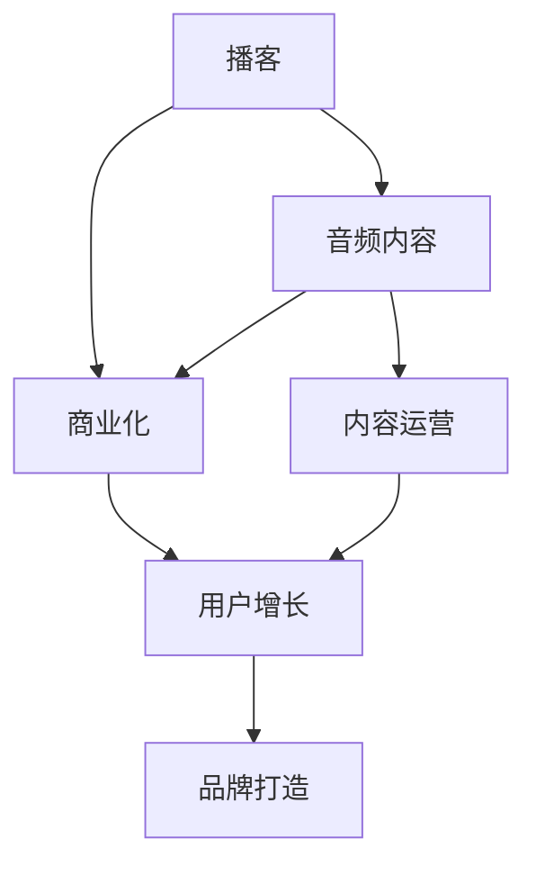

                 

## 1. 背景介绍

播客作为一种新兴的音频内容形式，正迅速崛起并逐渐成为听众获取信息、娱乐的主要渠道之一。播客不仅提供了丰富的内容，而且具有便携性和多样性，能够满足不同听众的个性化需求。随着移动互联网的普及，播客市场的竞争日益激烈，如何高效商业化播客内容成为了一个重要的课题。本文将从播客创业的角度出发，探索音频内容的商业化路径，帮助播客主理人找到一条适合自己的商业化之路。

## 2. 核心概念与联系

### 2.1 核心概念概述

在探索播客创业的商业化路径之前，首先需要明确几个核心概念及其相互之间的关系：

- **播客(Podcast)**：通过定期发布音频内容，听众可以在任何时间、任何地点进行收听。播客内容涵盖广泛主题，包括科技、教育、娱乐等。
- **音频内容(Audio Content)**：播客的核心要素，是播客主理人创作和分享的内容，通常包括主播的评论、访谈、独白等。
- **商业化(Commercialization)**：将音频内容转化为经济收益的过程，包括广告、付费订阅、版权销售等模式。
- **内容运营(Content Operations)**：播客主理人需要持续生产高质量内容，并通过合理运营策略提升内容价值，吸引听众和广告商。
- **用户增长(User Growth)**：通过营销、推广等手段增加播客的听众数量，提升播客的影响力和商业价值。
- **品牌打造(Branding)**：建立播客的品牌形象和声誉，增强听众的忠诚度和黏性，提升商业化能力。

这些核心概念通过一个简单的Mermaid流程图展示了它们之间的联系：



## 3. 核心算法原理 & 具体操作步骤

### 3.1 算法原理概述

播客的商业化主要涉及内容生产和市场运营两方面。以下是一些关键的算法原理：

- **内容生成算法**：通过机器学习和自然语言处理技术，自动生成高质量音频内容。
- **用户行为分析**：利用数据分析技术，深入了解用户行为和偏好，优化内容生产和运营策略。
- **推荐算法**：通过推荐算法，精准推送个性化的音频内容给听众，提高用户黏性和转化率。
- **广告投放算法**：通过优化广告投放策略，提升广告的展示效果和用户点击率，增加收入来源。

### 3.2 算法步骤详解

播客创业的商业化路径可以分为以下几个关键步骤：

#### Step 1: 市场调研与定位

- **调研分析**：通过问卷调查、社交媒体分析、竞争对手分析等手段，了解目标听众的兴趣、需求和消费行为。
- **目标市场**：确定目标市场和听众群体，定位播客的内容主题和风格，制定内容生产策略。

#### Step 2: 内容生产与优化

- **内容创作**：根据市场调研结果，创作高质量的音频内容，确保内容的原创性、价值性和吸引力。
- **内容优化**：通过A/B测试、用户反馈等方法，不断优化内容的标题、描述、结构和表现形式。

#### Step 3: 用户增长与运营

- **营销推广**：利用社交媒体、SEO、SEM等手段，进行广泛的营销推广，吸引更多听众。
- **用户运营**：通过社群管理、互动回复、用户反馈等方式，维护听众关系，提升用户黏性和忠诚度。

#### Step 4: 商业化模式选择

- **广告模式**：通过在播客中插入广告，获得广告商赞助，增加收入来源。
- **付费订阅**：通过设置付费订阅，提升听众的付费意愿，增加稳定的收入来源。
- **版权销售**：将播客内容制作成音频书、电子书等形式，销售版权，增加额外的收入渠道。

### 3.3 算法优缺点

播客商业化的算法原理和技术手段有许多优点，但也存在一些缺点：

#### 优点：

- **效率提升**：利用算法可以大大提升内容生产和运营的效率，减少人力成本和时间成本。
- **精准度提高**：通过数据分析和推荐算法，可以更精准地了解用户需求和行为，提升用户转化率。
- **个性化定制**：利用算法可以定制个性化的内容推送策略，提升听众的满意度和忠诚度。

#### 缺点：

- **技术门槛高**：需要掌握机器学习、自然语言处理等先进技术，对于没有技术背景的播客主理人来说，存在一定的挑战。
- **数据隐私问题**：大量用户数据涉及隐私问题，需要严格遵守数据保护法规，确保数据安全。
- **内容质量难保证**：依赖算法生成的内容可能存在机械化、缺乏创意的问题，需要人工审核和把关。

### 3.4 算法应用领域

播客商业化的算法原理和应用范围非常广泛，主要包括以下几个领域：

- **内容生成**：在播客创作和制作过程中，利用算法生成音频内容，提升内容质量。
- **用户分析**：通过用户行为数据分析，了解听众的兴趣和需求，优化内容策略。
- **内容推荐**：利用推荐算法，提高内容推送的精准度和用户满意度。
- **广告投放**：通过优化广告投放策略，提升广告效果和转化率。
- **营销推广**：利用社交媒体、SEO等手段，进行广泛推广，增加听众数量。

## 4. 数学模型和公式 & 详细讲解 & 举例说明

### 4.1 数学模型构建

播客商业化的核心模型主要包括以下几个：

- **用户行为模型**：通过时间序列分析、聚类算法等，预测用户的行为和需求。
- **内容推荐模型**：利用协同过滤、深度学习等算法，推荐符合用户偏好的音频内容。
- **广告效果模型**：通过回归分析、逻辑回归等算法，评估广告的展示效果和转化率。
- **营销策略模型**：利用多变量回归、线性规划等方法，优化营销策略和预算分配。

### 4.2 公式推导过程

以用户行为模型为例，假设用户的行为数据为 $(x_t, y_t)$，其中 $x_t$ 表示第 $t$ 天听众的行为，$y_t$ 表示第 $t$ 天的行为结果。利用时间序列分析，构建用户行为预测模型：

$$
y_{t+1} = f(x_t, \theta) + \epsilon_t
$$

其中 $f$ 为预测函数，$\theta$ 为模型参数，$\epsilon_t$ 为误差项。利用历史数据进行训练，得到最优模型参数 $\hat{\theta}$，用于未来行为的预测。

### 4.3 案例分析与讲解

假设某播客主理人通过用户行为分析，发现听众主要在周末和假期的行为更加活跃，于是调整内容发布策略，增加周末和假期的内容发布量，并利用推荐算法精准推送个性化内容，取得了显著的用户增长和商业化效果。

## 5. 项目实践：代码实例和详细解释说明

### 5.1 开发环境搭建

为了进行播客内容的商业化开发，需要进行以下环境搭建：

1. 安装Python开发环境，包括Pip、Jupyter Notebook等工具。
2. 安装TensorFlow、Scikit-learn、PyTorch等机器学习和深度学习库。
3. 安装Web框架，如Flask、Django等，用于搭建播客网站和API接口。
4. 部署MySQL或MongoDB等关系型/非关系型数据库，存储用户数据和内容信息。
5. 设置CDN和负载均衡，确保网站和API接口的稳定性。

### 5.2 源代码详细实现

以下是一个简单的代码实例，用于用户行为预测和内容推荐：

```python
# 用户行为预测
from sklearn.linear_model import LinearRegression
import pandas as pd

# 加载用户行为数据
data = pd.read_csv('user_behavior.csv')

# 特征工程
X = data[['time', 'location', 'age', 'interest']]
y = data['behavior']

# 建立线性回归模型
model = LinearRegression()
model.fit(X, y)

# 预测用户行为
new_data = pd.DataFrame({'time': ['2023-05-01', '2023-05-07'], 'location': ['A', 'B'], 'age': [25, 30], 'interest': ['C', 'D']})
predictions = model.predict(new_data)

# 内容推荐
from surprise import Dataset, Reader, KNNBasic
from surprise.model_selection import cross_validate

# 加载内容数据
reader = Reader(rating_scale=(1, 5))
data = Dataset.load_from_df(user_data, reader)
testset = Dataset.load_from_df(user_data, reader)

# 建立协同过滤推荐模型
algo = KNNBasic(similarity_options={'name': 'pearson_baseline'})
algo.fit(data.build_full_trainset())
predictions = algo.test(testset)

# 输出推荐结果
for uid, iid, estimate in predictions:
    print(f"User {uid}, Item {iid}, Rating: {estimate:.2f}")
```

### 5.3 代码解读与分析

以上代码实现了用户行为预测和内容推荐的基本流程。首先，通过Pandas加载用户行为数据，并进行特征工程，构建线性回归模型进行用户行为预测。然后，利用Surprise库构建协同过滤推荐模型，利用历史数据进行训练，对新内容进行推荐。

## 6. 实际应用场景

播客商业化的实际应用场景非常丰富，以下是几个典型场景：

### 6.1 广告投放

通过分析用户行为和偏好，将广告精准投放给目标听众，增加广告的展示效果和转化率。例如，某科技播客可以根据用户的科技兴趣，推送最新的科技新闻、产品评测等广告内容，吸引科技爱好者的注意。

### 6.2 付费订阅

利用数据分析和用户行为预测，提高听众的付费意愿。例如，某教育播客可以分析用户的互动行为和学习效果，为有潜力的听众提供付费订阅选项，增加稳定的收入来源。

### 6.3 版权销售

将播客内容制作成音频书、电子书等形式，销售版权，增加额外的收入渠道。例如，某娱乐播客可以将音频内容整理成一本书，通过电子书销售平台进行销售。

## 7. 工具和资源推荐

### 7.1 学习资源推荐

为了深入理解播客创业的商业化过程，推荐以下学习资源：

- **《播客创业指南》**：详细介绍了播客创业的各个环节，包括内容创作、用户运营、商业化策略等。
- **《数据分析与机器学习实战》**：系统讲解了数据分析和机器学习的基本概念和实战技巧，适合初学者和进阶者。
- **《深度学习框架实战》**：介绍了TensorFlow、PyTorch等深度学习框架的实战应用，帮助开发者掌握相关技术。

### 7.2 开发工具推荐

播客创业的开发工具推荐如下：

- **Python**：作为数据科学和机器学习的通用语言，适合进行数据分析和模型开发。
- **TensorFlow**：强大的深度学习框架，支持各种深度学习模型和算法。
- **Scikit-learn**：常用的机器学习库，提供丰富的机器学习算法和工具。
- **Jupyter Notebook**：轻量级的交互式编程环境，适合快速原型开发和数据可视化。
- **MySQL/MongoDB**：关系型/非关系型数据库，适合存储和管理数据。

### 7.3 相关论文推荐

以下是几篇关于播客创业和音频内容商业化的经典论文：

- **《播客商业化的用户行为分析》**：通过用户行为数据预测听众的需求和兴趣，优化内容生产和推广策略。
- **《基于深度学习的播客内容推荐》**：利用深度学习算法，构建精准的播客内容推荐系统，提升用户体验和黏性。
- **《音频内容的多渠道商业化》**：探讨了音频内容在不同渠道（如广告、订阅、版权销售）的商业化路径，提供了丰富的实践案例。

## 8. 总结：未来发展趋势与挑战

### 8.1 研究成果总结

本文从播客创业的商业化角度出发，详细介绍了播客内容的生产和运营策略，帮助播客主理人找到适合的商业化路径。通过对内容生成、用户分析、内容推荐和广告投放等关键环节的分析，揭示了播客商业化的核心算法原理和操作步骤。

### 8.2 未来发展趋势

展望未来，播客创业的商业化将呈现以下几个发展趋势：

- **多渠道融合**：播客内容将在不同渠道（如网站、社交媒体、应用程序）上进行融合，形成统一的用户体验和品牌形象。
- **个性化定制**：利用人工智能技术，实现个性化的内容推荐和广告投放，提升用户满意度和转化率。
- **全球化扩展**：随着移动互联网的普及，播客内容将在全球范围内进行传播和商业化，吸引更多的国际听众。
- **内容创新**：不断探索新的内容形式和创作方式，如互动播客、播客合集等，提升播客内容的吸引力和影响力。

### 8.3 面临的挑战

播客创业的商业化虽然充满机遇，但也面临着诸多挑战：

- **内容质量难以保证**：依赖算法生成的内容可能存在机械化、缺乏创意的问题，需要人工审核和把关。
- **技术门槛较高**：需要掌握机器学习、自然语言处理等先进技术，对于没有技术背景的播客主理人来说，存在一定的挑战。
- **数据隐私问题**：大量用户数据涉及隐私问题，需要严格遵守数据保护法规，确保数据安全。

### 8.4 研究展望

未来的研究需要关注以下几个方向：

- **内容质量优化**：如何利用算法生成高质量、有创意的音频内容，提升用户体验和满意度。
- **多渠道融合**：如何实现播客内容在不同渠道上的无缝衔接，提升用户黏性和品牌忠诚度。
- **个性化定制**：如何通过个性化推荐和定制化内容，提升用户转化率和黏性。
- **全球化扩展**：如何利用全球化的市场和技术资源，拓展播客内容的覆盖范围和影响力。

## 9. 附录：常见问题与解答

**Q1: 播客创业的商业化主要有哪些模式？**

A: 播客创业的商业化主要包括以下几种模式：

1. **广告模式**：通过在播客中插入广告，获得广告商赞助，增加收入来源。
2. **付费订阅**：通过设置付费订阅，提升听众的付费意愿，增加稳定的收入来源。
3. **版权销售**：将播客内容制作成音频书、电子书等形式，销售版权，增加额外的收入渠道。
4. **商品销售**：通过播客推广自己的商品或服务，增加直接的销售收入。
5. **赞助和合作**：与企业或品牌进行合作，获取赞助或合作费用。

**Q2: 如何提升播客内容的吸引力？**

A: 提升播客内容的吸引力需要从多个方面进行优化：

1. **选题和内容创意**：选择具有吸引力的主题，增加内容的趣味性和价值。
2. **音频质量**：确保音频清晰度高，背景噪音少，声线自然流畅。
3. **互动性**：增加听众互动环节，如问答、评论等，增强听众的参与感和黏性。
4. **内容更新频率**：保持内容的持续更新，定期发布新内容，增加听众的期待感。
5. **个性化推荐**：利用推荐算法，精准推送个性化的内容给听众，提升用户满意度。

**Q3: 如何优化播客的广告效果？**

A: 优化播客的广告效果主要包括以下几个方面：

1. **精准投放**：根据听众的兴趣和行为数据，精准投放广告，提升广告展示效果。
2. **广告创意**：设计具有吸引力的广告文案和音频内容，提升广告的点击率和转化率。
3. **多渠道发布**：通过多渠道发布广告，增加广告的覆盖面和展示效果。
4. **效果监测**：实时监测广告效果，及时调整广告策略，提高广告投入产出比。

**Q4: 如何提升播客听众的黏性？**

A: 提升播客听众的黏性需要从以下几个方面进行优化：

1. **内容质量**：确保内容的原创性、价值性和吸引力，提升听众的满意度和忠诚度。
2. **互动性**：增加听众互动环节，如问答、评论等，增强听众的参与感和黏性。
3. **定期更新**：保持内容的持续更新，定期发布新内容，增加听众的期待感。
4. **听众社区**：建立听众社区，加强社群管理，提升听众的归属感和黏性。
5. **品牌打造**：建立播客的品牌形象和声誉，增强听众的忠诚度和黏性。

---

作者：禅与计算机程序设计艺术 / Zen and the Art of Computer Programming

