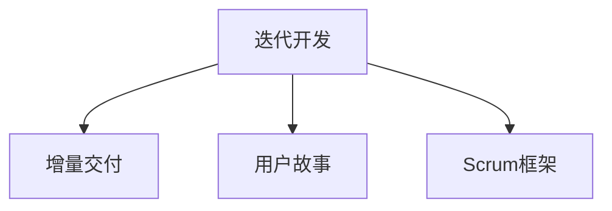
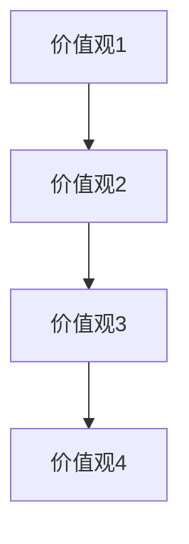
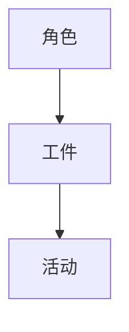

                 

# 敏捷项目管理：在复杂环境中快速交付

## 1. 背景介绍

在快速变化的市场环境中，敏捷项目管理已成为软件开发中不可或缺的一部分。它通过高度的灵活性和反应能力，确保项目能够快速适应需求变化，按时交付高质量的产品。本文将深入探讨敏捷项目管理的核心概念、基本原理以及操作步骤，帮助您在复杂环境中实现快速交付。

## 2. 核心概念与联系

### 2.1 核心概念概述

敏捷项目管理是一种基于迭代和增量的软件开发方法，强调灵活性和快速响应变化。其核心概念包括：

- **迭代开发**：将项目分解成多个小周期，每个周期进行需求分析、设计、实现和测试，不断迭代优化。
- **增量交付**：每个周期结束时交付可工作的增量，确保项目持续推进。
- **用户故事**：以用户视角定义需求，强调价值交付。
- **Scrum框架**：一种敏捷开发框架，包括团队角色、任务管理、迭代计划、每日站会等环节。

这些概念通过Mermaid流程图进行了展示：



这些核心概念相辅相成，共同构成了敏捷项目管理的核心框架。

### 2.2 核心概念原理和架构

敏捷项目管理的核心原理基于以下四个价值观：

- **个体和交互胜过过程和工具**：注重团队协作和沟通，确保信息透明和及时反馈。
- **可工作的软件胜过详尽的文档**：以交付实际可工作的软件为首要目标，文档仅作为辅助手段。
- **客户合作胜过合同谈判**：与客户保持紧密合作，确保产品符合客户需求。
- **响应变化胜过遵循计划**：高度灵活，快速响应需求变化。

这些价值观通过架构图进行了展示：



敏捷项目管理的架构主要由三部分组成：

- **角色**：包括Scrum Master、产品负责人、开发团队等。
- **工件**：如产品待办清单、冲刺计划、迭代报告等。
- **活动**：如每日站会、回顾会议、迭代评审等。

这些角色、工件和活动通过架构图进行了展示：



## 3. 核心算法原理 & 具体操作步骤

### 3.1 算法原理概述

敏捷项目管理的核心算法原理基于迭代和增量的思想，通过不断迭代优化，确保项目快速交付。其基本流程如下：

1. 需求分析：根据客户需求和市场变化，定义产品待办清单。
2. 迭代规划：确定每个迭代的目标和任务，生成冲刺计划。
3. 每日站会：团队成员每日汇报进度，解决问题。
4. 迭代评审：定期评审进度和质量，调整策略。
5. 回顾会议：总结迭代经验，持续改进。

### 3.2 算法步骤详解

以下是敏捷项目管理的具体操作步骤：

**Step 1: 初始化角色与工件**

1. **团队组建**：选择经验丰富的Scrum Master和开发团队，明确各自职责。
2. **产品待办清单**：根据需求分析，创建产品待办清单，定义需求优先级。
3. **冲刺计划**：确定冲刺周期（如2-4周），生成冲刺计划。

**Step 2: 执行日常活动**

1. **每日站会**：团队成员每天早上进行15分钟站会，汇报昨天完成的工作、今天计划和阻碍。
2. **任务执行**：根据冲刺计划，分配任务，团队成员独立完成任务。
3. **即时反馈**：遇到问题及时沟通解决，确保任务顺利推进。

**Step 3: 评审与回顾**

1. **迭代评审**：每次冲刺结束时，进行迭代评审，确保交付可工作增量。
2. **回顾会议**：回顾迭代过程，总结经验教训，持续改进。

### 3.3 算法优缺点

敏捷项目管理具有以下优点：

1. **灵活性高**：快速响应需求变化，适应性强。
2. **透明度高**：信息透明，团队协作效率高。
3. **价值交付快**：快速交付可工作增量，客户满意度高。
4. **持续改进**：通过回顾会议持续优化流程。

同时，也存在以下缺点：

1. **难以控制进度**：缺乏固定进度计划，可能导致延期。
2. **依赖团队成员**：团队成员经验和技能对项目进度和质量影响较大。
3. **资源浪费**：频繁的评审和回顾会占用较多时间，资源浪费。

### 3.4 算法应用领域

敏捷项目管理在软件开发、产品开发、项目管理等领域广泛应用。以下是几个典型应用场景：

1. **软件开发**：通过敏捷开发，快速迭代开发高质量软件，满足客户需求。
2. **产品开发**：定义用户故事，通过敏捷方法实现快速迭代，优化产品功能。
3. **项目管理**：制定冲刺计划，定期评审进展，持续改进项目流程。

## 4. 数学模型和公式 & 详细讲解 & 举例说明

### 4.1 数学模型构建

敏捷项目管理的核心数学模型是**迭代次数和任务完成度的关系模型**。假设每次迭代可以完成 $x$ 个任务，总任务数为 $N$，则迭代次数 $T$ 与任务完成度 $C$ 的关系为：

$$ T = \frac{N}{x} $$

其中，$C = \frac{T}{N}$，表示任务完成度。

### 4.2 公式推导过程

通过迭代次数和任务完成度的关系模型，我们可以推导出每次迭代后任务完成度的变化情况：

假设任务完成度从 $C_0$ 变为 $C_T$，每次迭代完成 $x$ 个任务，则有：

$$ C_T = C_0 + \frac{T}{N}x $$

进一步简化为：

$$ C_T = C_0 + T/x $$

这个公式表明，每次迭代后任务完成度增加 $T/x$。

### 4.3 案例分析与讲解

假设一个项目共有100个任务，每次迭代可以完成10个任务，则迭代次数 $T$ 和任务完成度 $C$ 的关系如下：

| 迭代次数 $T$ | 任务完成度 $C$ |
| --- | --- |
| 1 | 0.1 |
| 2 | 0.2 |
| 3 | 0.3 |
| ... | ... |
| 10 | 1 |

通过这个案例，我们可以看到，每次迭代任务完成度线性增加，确保了项目快速推进。

## 5. 项目实践：代码实例和详细解释说明

### 5.1 开发环境搭建

要实现敏捷项目管理，需要搭建合适的开发环境。以下是搭建环境的步骤：

1. **安装项目管理工具**：如JIRA、Trello等，用于任务管理和跟踪。
2. **配置开发环境**：搭建服务器、安装开发工具、设置CI/CD流程。
3. **部署应用程序**：将开发成果部署到生产环境。

### 5.2 源代码详细实现

以下是使用JIRA进行敏捷项目管理的示例代码：

```python
import jira

# 连接到JIRA实例
jira_url = 'https://example.com/jira'
jira_username = 'your_username'
jira_password = 'your_password'
jira = jira.Jira(jira_url, jira_username, jira_password)

# 创建冲刺计划
sprint = jira.sprint.get(1)
new_sprint = jira.sprint.create(
    title='sprint_2',
    description='描述冲刺计划',
    startDate='2023-01-01',
    endDate='2023-01-15')

# 创建任务
issue_type = jira.issue_type.create(name='Task')
issue = jira.issue.create(
    project=1,
    summary='开发用户故事',
    description='实现用户故事',
    issue_type=issue_type,
    status_id=3)

# 分配任务给团队成员
assignee = jira.user.get('your_username')
jira.issue.update(issue, 'assignee', assignee)

# 获取任务状态
status = jira.issue.get_statuses()
task_status = [status[i] for i in range(len(status)) if status[i]['name'] == 'In Progress']
print(task_status)
```

### 5.3 代码解读与分析

在上述代码中，我们通过JIRA实现了创建冲刺计划、创建任务、分配任务和获取任务状态。以下是对每个步骤的详细解释：

- **连接到JIRA实例**：通过JIRA的REST API连接到指定实例。
- **创建冲刺计划**：使用`jira.sprint.create`方法创建冲刺计划，并设置冲刺标题、描述、开始和结束日期。
- **创建任务**：使用`jira.issue.create`方法创建任务，并设置任务标题、描述、类型和状态。
- **分配任务给团队成员**：使用`jira.issue.update`方法将任务分配给指定成员。
- **获取任务状态**：使用`jira.issue.get_statuses`方法获取所有任务状态，并使用列表推导式筛选出当前任务状态。

### 5.4 运行结果展示

运行上述代码后，可以在JIRA实例中查看创建的冲刺计划和任务，确保任务状态更新，确保项目按计划推进。

## 6. 实际应用场景

敏捷项目管理在各行各业均有广泛应用。以下是几个典型应用场景：

### 6.1 软件开发

软件开发是敏捷项目管理的典型应用场景。通过敏捷开发，团队可以快速迭代开发高质量软件，满足客户需求，并在市场变化中快速响应。

### 6.2 产品开发

产品开发中，敏捷项目管理通过定义用户故事，快速迭代优化产品功能，确保产品符合客户需求，满足市场需求。

### 6.3 项目管理

项目管理中，敏捷项目管理通过制定冲刺计划，定期评审进展，持续改进项目流程，确保项目按时交付，提升项目成功率。

## 7. 工具和资源推荐

### 7.1 学习资源推荐

为了更好地掌握敏捷项目管理的方法和技巧，以下是几个推荐的学习资源：

1. **《敏捷项目管理：核心原则与实践》**：一本系统介绍敏捷项目管理的书籍，涵盖了敏捷项目管理的基本概念、工具和实践。
2. **Scrum.org官方指南**：Scrum.org提供的官方指南，详细介绍了Scrum框架的使用方法。
3. **Udemy敏捷项目管理课程**：Udemy提供的敏捷项目管理课程，包括Scrum、Kanban等敏捷方法的深入讲解。
4. **Coursera敏捷项目管理课程**：Coursera提供的敏捷项目管理课程，涵盖了敏捷项目管理的基本原理和方法。
5. **Agile Manifesto**：敏捷宣言的官方文档，详细介绍了敏捷项目管理的核心价值观和12条原则。

### 7.2 开发工具推荐

以下是几个推荐的敏捷项目管理工具：

1. **JIRA**：一个功能强大的项目管理工具，支持敏捷方法，包括Scrum、Kanban等。
2. **Trello**：一个简单易用的项目管理工具，支持敏捷方法，适合小型团队使用。
3. **Asana**：一个灵活的项目管理工具，支持敏捷方法，适合不同规模的团队。
4. **Confluence**：一个协作工具，支持敏捷方法，适合团队协作和知识共享。
5. **GitLab**：一个全功能的软件开发平台，支持敏捷方法，包括Scrum、Kanban等。

### 7.3 相关论文推荐

为了深入了解敏捷项目管理的研究进展，以下是几篇推荐的论文：

1. **《敏捷项目管理：方法与实践》**：一篇系统介绍敏捷项目管理的论文，涵盖了敏捷项目管理的基本方法、工具和实践。
2. **《Scrum：一种敏捷软件开发方法》**：一篇详细介绍Scrum框架的论文，包括Scrum的角色、工件和活动。
3. **《敏捷项目管理的演化》**：一篇介绍敏捷项目管理演化的论文，探讨了敏捷项目管理的现状和未来发展趋势。
4. **《敏捷项目管理：一种有效的软件开发方法》**：一篇探讨敏捷项目管理在软件开发中应用效果的论文。

## 8. 总结：未来发展趋势与挑战

### 8.1 研究成果总结

敏捷项目管理已经成为软件开发和项目管理的重要方法，广泛应用于各行各业。通过敏捷项目管理，团队可以高效地响应需求变化，快速交付高质量产品，提升项目成功率。

### 8.2 未来发展趋势

敏捷项目管理将呈现以下发展趋势：

1. **自动化与智能化**：通过AI和机器学习技术，自动化项目管理和任务分配，提升项目效率。
2. **跨团队协作**：敏捷项目管理将更加注重跨团队协作，确保项目顺利推进。
3. **持续改进**：敏捷项目管理将更加注重持续改进，通过回顾会议和学习改进流程。
4. **多模态数据整合**：敏捷项目管理将更加注重多模态数据整合，提升项目管理精度。

### 8.3 面临的挑战

尽管敏捷项目管理已经取得显著成果，但仍然面临以下挑战：

1. **团队协作问题**：团队成员的经验和技能对项目进度和质量影响较大。
2. **需求变化问题**：需求变化可能导致项目延期和质量下降。
3. **资源分配问题**：资源分配不合理可能导致项目进度和质量问题。

### 8.4 研究展望

未来的研究需要在以下几个方面寻求新的突破：

1. **自动化与智能化**：通过AI和机器学习技术，自动化项目管理和任务分配，提升项目效率。
2. **跨团队协作**：敏捷项目管理将更加注重跨团队协作，确保项目顺利推进。
3. **持续改进**：敏捷项目管理将更加注重持续改进，通过回顾会议和学习改进流程。
4. **多模态数据整合**：敏捷项目管理将更加注重多模态数据整合，提升项目管理精度。

## 9. 附录：常见问题与解答

**Q1：敏捷项目管理适用于所有项目吗？**

A: 敏捷项目管理适用于需要快速响应需求变化的项目。对于稳定需求的项目，如基础设施建设和传统行业，可能需要采用其他项目管理方法。

**Q2：敏捷项目管理如何应对需求变化？**

A: 敏捷项目管理通过定期评审和回顾会议，快速响应需求变化，确保项目顺利推进。同时，通过迭代开发，快速迭代优化产品功能，提升客户满意度。

**Q3：敏捷项目管理如何提高团队协作效率？**

A: 敏捷项目管理通过每日站会、持续集成和自动化测试等方法，确保团队成员及时沟通和协作，提升项目效率。

**Q4：敏捷项目管理如何处理任务优先级？**

A: 敏捷项目管理通过产品待办清单和冲刺计划，定义任务优先级，确保团队集中精力解决高优先级任务。

**Q5：敏捷项目管理如何评估项目进度？**

A: 敏捷项目管理通过每日站会和迭代评审，实时评估项目进度，确保项目按时交付。

---

作者：禅与计算机程序设计艺术 / Zen and the Art of Computer Programming

